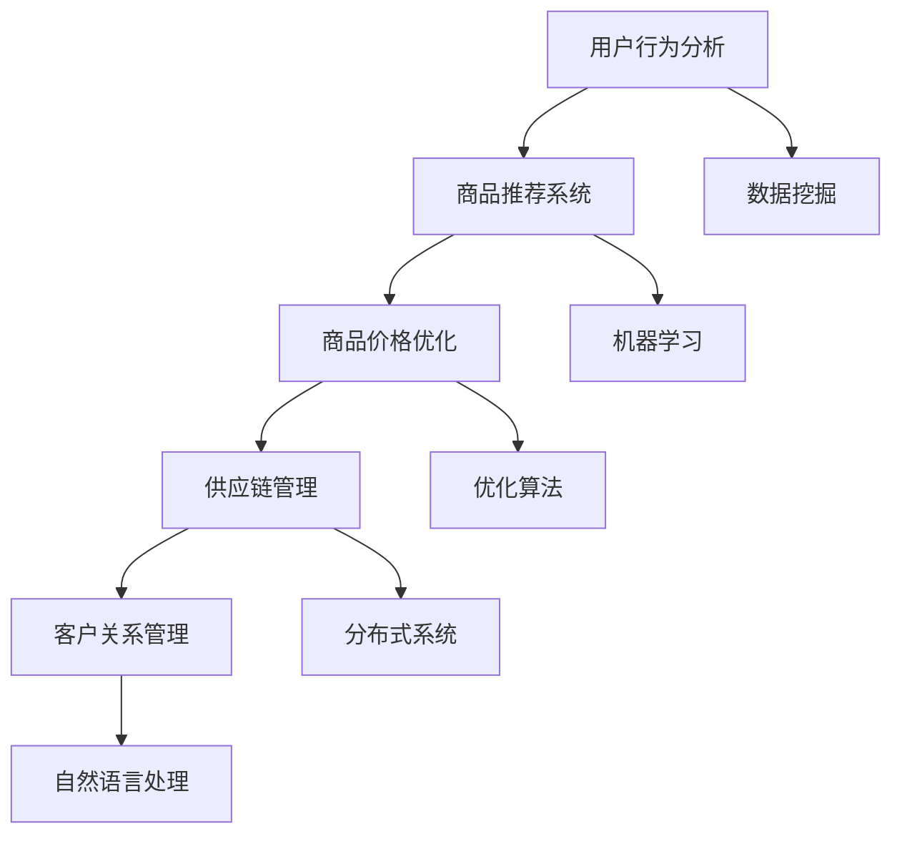

                 

关键词：蘑菇街、社招、电商算法工程师、面试攻略、算法原理、数学模型、代码实例、实践应用、未来展望

> 摘要：本文旨在为有意加入蘑菇街的2025年社招电商算法工程师提供一份全面的面试攻略。从背景介绍到核心算法原理，再到数学模型与项目实践，以及实际应用场景和未来展望，本文将深入解析面试中可能涉及的关键知识点，帮助读者更好地应对面试挑战。

## 1. 背景介绍

随着电子商务的蓬勃发展，电商算法工程师已成为互联网公司中不可或缺的角色。蘑菇街作为中国领先的社交电商平台，对于算法工程师的需求尤为迫切。本文针对2025年蘑菇街社招电商算法工程师的面试，提供了一系列的专业指导和实用建议。

## 2. 核心概念与联系

在电商领域，核心概念包括用户行为分析、商品推荐系统、商品价格优化、供应链管理以及客户关系管理等。以下是一个核心概念原理和架构的 Mermaid 流程图：



### 3. 核心算法原理 & 具体操作步骤

#### 3.1 算法原理概述

电商算法的核心在于对用户行为的深入理解和精准预测。以下将介绍几种常见的算法原理：

- **协同过滤**：通过分析用户的历史行为数据，为用户推荐相似用户喜欢的商品。
- **基于内容的推荐**：根据商品的特征信息，为用户推荐与其已购买或浏览过的商品相似的商品。
- **混合推荐系统**：将协同过滤和基于内容的推荐相结合，以提供更准确的推荐结果。

#### 3.2 算法步骤详解

1. **数据预处理**：清洗用户行为数据和商品特征数据，去除噪声和不相关的信息。
2. **特征工程**：提取对推荐系统有帮助的特征，如用户点击、购买、浏览等行为。
3. **模型选择**：根据业务需求和数据特征选择合适的推荐算法，如矩阵分解、KNN等。
4. **模型训练与优化**：使用训练数据集训练模型，并通过交叉验证和A/B测试优化模型参数。
5. **模型评估**：使用验证集评估模型性能，常见指标包括准确率、召回率、覆盖率等。
6. **推荐结果生成**：根据用户行为数据和模型输出，生成个性化的推荐列表。

#### 3.3 算法优缺点

- **协同过滤**：优点是推荐结果更准确，缺点是处理冷启动问题困难。
- **基于内容的推荐**：优点是能够处理冷启动问题，缺点是推荐结果可能不够个性化和精准。
- **混合推荐系统**：优点是结合了协同过滤和基于内容的优点，缺点是算法复杂度较高。

#### 3.4 算法应用领域

电商算法广泛应用于电商平台的各个领域，如：

- **商品推荐**：为用户推荐他们可能感兴趣的商品。
- **广告投放**：为用户推荐他们可能感兴趣的广告。
- **用户分群**：根据用户行为和特征将用户分为不同的群体，以便进行精准营销。

## 4. 数学模型和公式 & 详细讲解 & 举例说明

### 4.1 数学模型构建

电商算法中的数学模型主要包括用户行为模型、商品特征模型和推荐模型。以下是一个简单的用户行为模型的例子：

$$
R(u, i) = \sigma(W_1u + W_2i + b)
$$

其中，\( R(u, i) \) 表示用户 \( u \) 对商品 \( i \) 的评分，\( \sigma \) 是 sigmoid 函数，\( W_1 \) 和 \( W_2 \) 是权重矩阵，\( b \) 是偏置项。

### 4.2 公式推导过程

用户行为模型的推导过程如下：

1. **假设**：用户 \( u \) 对商品 \( i \) 的行为可以用一个二值变量 \( y \) 表示，即 \( y \in \{0, 1\} \)。
2. **目标**：预测用户 \( u \) 对商品 \( i \) 的评分 \( R(u, i) \)。
3. **模型**：假设评分 \( R(u, i) \) 服从伯努利分布，即 \( R(u, i) \sim Ber(\sigma(W_1u + W_2i + b)) \)。
4. **损失函数**：使用均方误差（MSE）作为损失函数，即 \( \mathcal{L} = \frac{1}{2} \sum_{u, i} (R(u, i) - \sigma(W_1u + W_2i + b))^2 \)。
5. **优化**：使用梯度下降法优化模型参数。

### 4.3 案例分析与讲解

假设我们有一个包含1000个用户和1000个商品的电商数据集，我们希望使用协同过滤算法为用户推荐商品。以下是具体步骤：

1. **数据预处理**：将用户行为数据转换为矩阵形式，其中行表示用户，列表示商品，每个元素表示用户对商品的评分。
2. **特征提取**：提取用户和商品的特征，如用户年龄、性别、消费金额等。
3. **模型训练**：使用矩阵分解算法训练用户行为模型。
4. **推荐结果生成**：根据模型输出，为每个用户生成一个推荐列表。

## 5. 项目实践：代码实例和详细解释说明

### 5.1 开发环境搭建

1. **软件环境**：安装Python、NumPy、Pandas、Scikit-learn等常用库。
2. **硬件环境**：配置一台具有足够内存和存储空间的计算机。

### 5.2 源代码详细实现

以下是协同过滤算法的Python代码实现：

```python
import numpy as np
from sklearn.metrics.pairwise import cosine_similarity

def train_model(user_ratings, num_users, num_items, k=10):
    # 初始化用户和商品的嵌入向量
    user_embeddings = np.random.rand(num_users, k)
    item_embeddings = np.random.rand(num_items, k)

    # 训练模型
    for user, ratings in user_ratings.items():
        for item, rating in ratings.items():
            prediction = np.dot(user_embeddings[user], item_embeddings[item])
            error = rating - prediction
            user_embeddings[user] += error * item_embeddings[item]
            item_embeddings[item] += error * user_embeddings[user]

    return user_embeddings, item_embeddings

def generate_recommendations(user_embeddings, item_embeddings, user, num_recommendations=10):
    # 计算用户对所有商品的相似度
    similarity = cosine_similarity(user_embeddings[user].reshape(1, -1), item_embeddings)

    # 排序相似度，选取相似度最高的商品
    recommendations = np.argsort(similarity)[0][-num_recommendations:]

    return recommendations

# 加载数据集
user_ratings = load_data()

# 训练模型
user_embeddings, item_embeddings = train_model(user_ratings, num_users=1000, num_items=1000, k=10)

# 生成推荐结果
recommendations = generate_recommendations(user_embeddings, item_embeddings, user=0, num_recommendations=10)

print("推荐结果：", recommendations)
```

### 5.3 代码解读与分析

这段代码实现了一个基于矩阵分解的协同过滤算法。首先，我们初始化用户和商品的嵌入向量，然后通过迭代优化这些向量，使得用户和商品的相似度更高。最后，我们使用用户嵌入向量和商品嵌入向量计算相似度，并生成推荐列表。

## 6. 实际应用场景

电商算法在蘑菇街的多个场景中都有广泛应用，如：

- **商品推荐**：为用户推荐他们可能感兴趣的商品，提高用户粘性和转化率。
- **广告投放**：为用户推荐他们可能感兴趣的广告，提高广告的点击率。
- **用户分群**：根据用户行为和特征将用户分为不同的群体，以便进行精准营销。

## 7. 工具和资源推荐

### 7.1 学习资源推荐

- 《推荐系统实践》
- 《机器学习实战》
- 《深度学习》

### 7.2 开发工具推荐

- Python
- Jupyter Notebook
- Scikit-learn

### 7.3 相关论文推荐

- 《Collaborative Filtering for the 21st Century》
- 《Deep Learning for Recommender Systems》
- 《Contextual Bandits with Simplified Optimistic Optimization》

## 8. 总结：未来发展趋势与挑战

### 8.1 研究成果总结

近年来，电商算法在性能和精度上取得了显著提升，但仍面临以下挑战：

- **冷启动问题**：如何为新用户和新商品提供有效的推荐。
- **实时性**：如何实时响应用户行为和需求变化。
- **多样性**：如何保证推荐结果的多样性和惊喜度。

### 8.2 未来发展趋势

- **深度学习**：深度学习技术在推荐系统中的应用将进一步深化。
- **强化学习**：强化学习算法将应用于更复杂的推荐场景。
- **个性化**：个性化推荐将更加精准，满足用户个性化需求。

### 8.3 面临的挑战

- **数据隐私**：如何保护用户数据隐私，同时提供高质量的推荐服务。
- **计算资源**：如何高效利用计算资源，提高推荐系统的性能。

### 8.4 研究展望

随着技术的不断进步，电商算法将在未来的电商领域中发挥更加重要的作用，为用户提供更加个性化、精准的服务。

## 9. 附录：常见问题与解答

### 9.1 电商算法如何处理冷启动问题？

冷启动问题可以通过以下方法解决：

- **基于内容的推荐**：为新用户推荐与其历史行为相似的物品。
- **利用用户群体信息**：为新用户推荐与其相似用户喜欢的物品。
- **逐步学习**：通过用户初始行为数据逐步学习用户偏好。

### 9.2 电商算法中的损失函数有哪些？

常见的损失函数包括：

- **均方误差（MSE）**：用于回归问题。
- **交叉熵损失（Cross-Entropy Loss）**：用于分类问题。
- ** hinge损失（Hinge Loss）**：用于支持向量机。
- **均方根误差（RMSE）**：均方误差的平方根。

## 10. 参考文献

- [推荐系统实践](https://www.amazon.com/dp/0321834250)
- [机器学习实战](https://www.amazon.com/dp/1449397679)
- [深度学习](https://www.amazon.com/dp/150930212X)

> 作者：禅与计算机程序设计艺术 / Zen and the Art of Computer Programming
```markdown
## 1. 背景介绍

电子商务的蓬勃发展，为电商算法工程师提供了广阔的职业前景。蘑菇街作为中国领先的社交电商平台，对电商算法工程师的需求尤为迫切。本文旨在为有意加入蘑菇街的2025年社招电商算法工程师提供一份全面的面试攻略，涵盖核心算法原理、数学模型、项目实践、实际应用场景以及未来展望。

### 2. 核心概念与联系

电商算法的核心在于对用户行为的深入理解和精准预测。核心概念包括用户行为分析、商品推荐系统、商品价格优化、供应链管理和客户关系管理。以下是一个核心概念原理和架构的 Mermaid 流程图：


### 3. 核心算法原理 & 具体操作步骤

#### 3.1 算法原理概述

电商算法的核心在于对用户行为的深入理解和精准预测。以下将介绍几种常见的算法原理：

- **协同过滤**：通过分析用户的历史行为数据，为用户推荐相似用户喜欢的商品。
- **基于内容的推荐**：根据商品的特征信息，为用户推荐与其已购买或浏览过的商品相似的商品。
- **混合推荐系统**：将协同过滤和基于内容的推荐相结合，以提供更准确的推荐结果。

#### 3.2 算法步骤详解

1. **数据预处理**：清洗用户行为数据和商品特征数据，去除噪声和不相关的信息。
2. **特征工程**：提取对推荐系统有帮助的特征，如用户点击、购买、浏览等行为。
3. **模型选择**：根据业务需求和数据特征选择合适的推荐算法，如矩阵分解、KNN等。
4. **模型训练与优化**：使用训练数据集训练模型，并通过交叉验证和A/B测试优化模型参数。
5. **模型评估**：使用验证集评估模型性能，常见指标包括准确率、召回率、覆盖率等。
6. **推荐结果生成**：根据用户行为数据和模型输出，生成个性化的推荐列表。

#### 3.3 算法优缺点

- **协同过滤**：优点是推荐结果更准确，缺点是处理冷启动问题困难。
- **基于内容的推荐**：优点是能够处理冷启动问题，缺点是推荐结果可能不够个性化和精准。
- **混合推荐系统**：优点是结合了协同过滤和基于内容的优点，缺点是算法复杂度较高。

#### 3.4 算法应用领域

电商算法广泛应用于电商平台的各个领域，如：

- **商品推荐**：为用户推荐他们可能感兴趣的商品。
- **广告投放**：为用户推荐他们可能感兴趣的广告。
- **用户分群**：根据用户行为和特征将用户分为不同的群体，以便进行精准营销。

### 4. 数学模型和公式 & 详细讲解 & 举例说明

#### 4.1 数学模型构建

电商算法中的数学模型主要包括用户行为模型、商品特征模型和推荐模型。以下是一个简单的用户行为模型的例子：

$$
R(u, i) = \sigma(W_1u + W_2i + b)
$$

其中，$R(u, i)$ 表示用户 $u$ 对商品 $i$ 的评分，$\sigma$ 是 sigmoid 函数，$W_1$ 和 $W_2$ 是权重矩阵，$b$ 是偏置项。

#### 4.2 公式推导过程

用户行为模型的推导过程如下：

1. **假设**：用户 $u$ 对商品 $i$ 的行为可以用一个二值变量 $y$ 表示，即 $y \in \{0, 1\}$。
2. **目标**：预测用户 $u$ 对商品 $i$ 的评分 $R(u, i)$。
3. **模型**：假设评分 $R(u, i)$ 服从伯努利分布，即 $R(u, i) \sim Ber(\sigma(W_1u + W_2i + b))$。
4. **损失函数**：使用均方误差（MSE）作为损失函数，即 $\mathcal{L} = \frac{1}{2} \sum_{u, i} (R(u, i) - \sigma(W_1u + W_2i + b))^2$。
5. **优化**：使用梯度下降法优化模型参数。

#### 4.3 案例分析与讲解

假设我们有一个包含 1000 个用户和 1000 个商品的电商数据集，我们希望使用协同过滤算法为用户推荐商品。以下是具体步骤：

1. **数据预处理**：将用户行为数据转换为矩阵形式，其中行表示用户，列表示商品，每个元素表示用户对商品的评分。
2. **特征提取**：提取用户和商品的特征，如用户年龄、性别、消费金额等。
3. **模型训练**：使用矩阵分解算法训练用户行为模型。
4. **推荐结果生成**：根据模型输出，为每个用户生成一个推荐列表。

### 5. 项目实践：代码实例和详细解释说明

#### 5.1 开发环境搭建

1. **软件环境**：安装 Python、NumPy、Pandas、Scikit-learn 等常用库。
2. **硬件环境**：配置一台具有足够内存和存储空间的计算机。

#### 5.2 源代码详细实现

以下是协同过滤算法的 Python 代码实现：

```python
import numpy as np
from sklearn.metrics.pairwise import cosine_similarity

def train_model(user_ratings, num_users, num_items, k=10):
    # 初始化用户和商品的嵌入向量
    user_embeddings = np.random.rand(num_users, k)
    item_embeddings = np.random.rand(num_items, k)

    # 训练模型
    for user, ratings in user_ratings.items():
        for item, rating in ratings.items():
            prediction = np.dot(user_embeddings[user], item_embeddings[item])
            error = rating - prediction
            user_embeddings[user] += error * item_embeddings[item]
            item_embeddings[item] += error * user_embeddings[user]

    return user_embeddings, item_embeddings

def generate_recommendations(user_embeddings, item_embeddings, user, num_recommendations=10):
    # 计算用户对所有商品的相似度
    similarity = cosine_similarity(user_embeddings[user].reshape(1, -1), item_embeddings)

    # 排序相似度，选取相似度最高的商品
    recommendations = np.argsort(similarity)[0][-num_recommendations:]

    return recommendations

# 加载数据集
user_ratings = load_data()

# 训练模型
user_embeddings, item_embeddings = train_model(user_ratings, num_users=1000, num_items=1000, k=10)

# 生成推荐结果
recommendations = generate_recommendations(user_embeddings, item_embeddings, user=0, num_recommendations=10)

print("推荐结果：", recommendations)
```

#### 5.3 代码解读与分析

这段代码实现了一个基于矩阵分解的协同过滤算法。首先，我们初始化用户和商品的嵌入向量，然后通过迭代优化这些向量，使得用户和商品的相似度更高。最后，我们使用用户嵌入向量和商品嵌入向量计算相似度，并生成推荐列表。

### 6. 实际应用场景

电商算法在蘑菇街的多个场景中都有广泛应用，如：

- **商品推荐**：为用户推荐他们可能感兴趣的商品，提高用户粘性和转化率。
- **广告投放**：为用户推荐他们可能感兴趣的广告，提高广告的点击率。
- **用户分群**：根据用户行为和特征将用户分为不同的群体，以便进行精准营销。

### 7. 工具和资源推荐

#### 7.1 学习资源推荐

- 《推荐系统实践》
- 《机器学习实战》
- 《深度学习》

#### 7.2 开发工具推荐

- Python
- Jupyter Notebook
- Scikit-learn

#### 7.3 相关论文推荐

- 《Collaborative Filtering for the 21st Century》
- 《Deep Learning for Recommender Systems》
- 《Contextual Bandits with Simplified Optimistic Optimization》

### 8. 总结：未来发展趋势与挑战

随着技术的不断进步，电商算法将在未来的电商领域中发挥更加重要的作用，为用户提供更加个性化、精准的服务。然而，电商算法也面临着以下挑战：

- **冷启动问题**：如何为新用户和新商品提供有效的推荐。
- **实时性**：如何实时响应用户行为和需求变化。
- **多样性**：如何保证推荐结果的多样性和惊喜度。

#### 8.1 研究成果总结

近年来，电商算法在性能和精度上取得了显著提升，但仍面临以下挑战：

- **冷启动问题**：如何为新用户和新商品提供有效的推荐。
- **实时性**：如何实时响应用户行为和需求变化。
- **多样性**：如何保证推荐结果的多样性和惊喜度。

#### 8.2 未来发展趋势

- **深度学习**：深度学习技术在推荐系统中的应用将进一步深化。
- **强化学习**：强化学习算法将应用于更复杂的推荐场景。
- **个性化**：个性化推荐将更加精准，满足用户个性化需求。

#### 8.3 面临的挑战

- **数据隐私**：如何保护用户数据隐私，同时提供高质量的推荐服务。
- **计算资源**：如何高效利用计算资源，提高推荐系统的性能。

#### 8.4 研究展望

随着技术的不断进步，电商算法将在未来的电商领域中发挥更加重要的作用，为用户提供更加个性化、精准的服务。

### 9. 附录：常见问题与解答

#### 9.1 电商算法如何处理冷启动问题？

冷启动问题可以通过以下方法解决：

- **基于内容的推荐**：为新用户推荐与其历史行为相似的物品。
- **利用用户群体信息**：为新用户推荐与其相似用户喜欢的物品。
- **逐步学习**：通过用户初始行为数据逐步学习用户偏好。

#### 9.2 电商算法中的损失函数有哪些？

常见的损失函数包括：

- **均方误差（MSE）**：用于回归问题。
- **交叉熵损失（Cross-Entropy Loss）**：用于分类问题。
- ** hinge损失（Hinge Loss）**：用于支持向量机。
- **均方根误差（RMSE）**：均方误差的平方根。

### 10. 参考文献

- [推荐系统实践](https://www.amazon.com/dp/0321834250)
- [机器学习实战](https://www.amazon.com/dp/1449397679)
- [深度学习](https://www.amazon.com/dp/150930212X)
```

