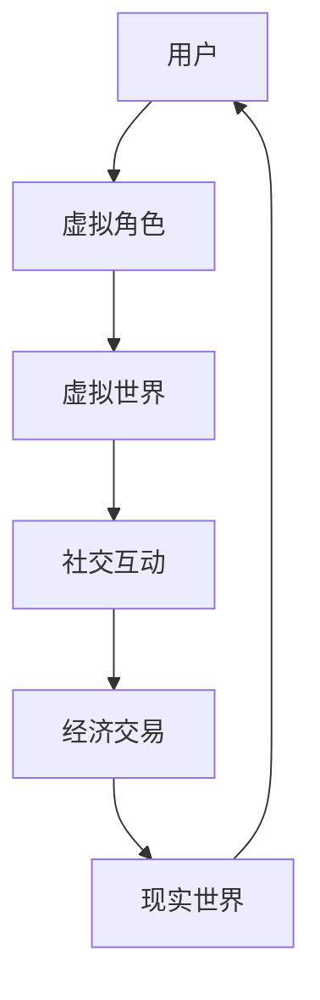
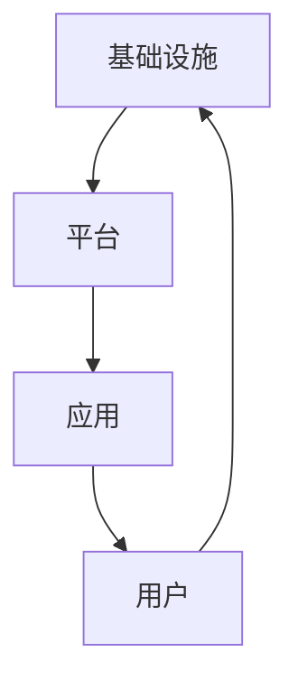

                 

关键词：元宇宙、虚拟世界、现实世界融合、创业、技术发展、商业机会

摘要：随着虚拟现实、增强现实和区块链技术的发展，元宇宙作为虚拟世界与现实世界的融合体，正逐步成为未来互联网的新形态。本文将从技术、商业和社会三个方面探讨元宇宙创业的未来，分析其发展潜力与面临的挑战，为创业者提供指导。

## 1. 背景介绍

元宇宙（Metaverse）一词最早出现在1992年的科幻小说《雪崩》中，描述了一个由虚拟世界构成的替代现实。随着科技的发展，元宇宙的概念逐渐从科幻走向现实。虚拟现实（VR）和增强现实（AR）技术的成熟，使得人们可以更加沉浸地体验虚拟世界。此外，区块链技术的发展为元宇宙提供了去中心化的基础设施，使得虚拟资产和身份认证变得更加可信。

近年来，元宇宙概念在技术、娱乐、社交等多个领域得到了广泛关注，许多知名企业如Facebook、微软、谷歌等纷纷布局元宇宙。预计未来元宇宙将重塑互联网产业，成为下一代互联网的标杆。

## 2. 核心概念与联系

### 2.1 虚拟世界与现实世界的融合

元宇宙的核心在于虚拟世界与现实世界的融合。这种融合不仅体现在视觉和听觉体验上，还包括情感、社交、经济等多方面的互动。以下是一个简单的 Mermaid 流程图，展示了元宇宙中的关键概念和联系：



### 2.2 元宇宙的架构

元宇宙的架构可以分为三个层次：基础设施、平台和应用。

- **基础设施**：包括服务器、网络、存储等硬件设施，以及区块链、虚拟现实、增强现实等核心技术。
- **平台**：为开发者和用户提供开发环境和工具，如Unity、Unreal Engine等游戏引擎，以及用于虚拟资产交易的去中心化平台。
- **应用**：涵盖各种虚拟世界和现实世界的应用场景，如虚拟旅游、虚拟购物、虚拟社交等。

以下是一个简单的 Mermaid 流程图，展示了元宇宙的架构：



## 3. 核心算法原理 & 具体操作步骤

### 3.1 算法原理概述

元宇宙的核心算法主要包括以下几个方面：

- **渲染算法**：用于生成虚拟世界的三维图像，如OpenGL、DirectX等。
- **追踪算法**：用于跟踪用户的动作和位置，如SLAM（Simultaneous Localization and Mapping）技术。
- **加密算法**：用于保护虚拟资产和用户隐私，如区块链技术。

### 3.2 算法步骤详解

以下是元宇宙核心算法的简要步骤：

1. **渲染算法**：
   - 收集用户输入（位置、动作等）。
   - 生成三维模型。
   - 应用光线追踪、阴影等技术，生成图像。

2. **追踪算法**：
   - 使用传感器获取用户动作数据。
   - 建立用户位置与虚拟世界的对应关系。
   - 实时更新用户位置。

3. **加密算法**：
   - 对虚拟资产进行加密存储。
   - 在交易过程中进行数字签名和验证。
   - 确保数据传输的安全和隐私。

### 3.3 算法优缺点

- **渲染算法**：优点是提供高质量的图像体验，缺点是计算资源消耗大，对硬件要求高。
- **追踪算法**：优点是实现虚拟现实的真实感，缺点是精度受传感器限制，实时性有待提高。
- **加密算法**：优点是保证数据安全和隐私，缺点是计算复杂度较高，对网络带宽要求高。

### 3.4 算法应用领域

- **渲染算法**：主要应用于虚拟现实、游戏等领域。
- **追踪算法**：主要应用于虚拟现实、增强现实等领域。
- **加密算法**：主要应用于虚拟资产交易、隐私保护等领域。

## 4. 数学模型和公式 & 详细讲解 & 举例说明

### 4.1 数学模型构建

元宇宙中的数学模型主要包括以下几个方面：

- **几何模型**：用于描述虚拟世界的三维结构。
- **物理模型**：用于模拟虚拟世界中的物理现象，如重力、碰撞等。
- **经济模型**：用于虚拟资产交易和定价。

以下是一个简单的几何模型示例：

$$
\vec{P} = (x, y, z)
$$

其中，$\vec{P}$表示三维空间中的点，$x$、$y$、$z$分别表示点的坐标。

### 4.2 公式推导过程

以下是物理模型中的碰撞检测公式推导：

设两个物体的质心分别为 $\vec{C}_1$ 和 $\vec{C}_2$，半径分别为 $r_1$ 和 $r_2$，速度分别为 $\vec{v}_1$ 和 $\vec{v}_2$。当两个物体之间的距离小于 $r_1 + r_2$ 时，发生碰撞。

碰撞前后的速度变化可以用以下公式表示：

$$
\vec{v}_1' = \vec{v}_1 - \frac{2(\vec{v}_1 - \vec{v}_2) \cdot (\vec{C}_1 - \vec{C}_2)}{(\vec{C}_1 - \vec{C}_2) \cdot (\vec{C}_1 - \vec{C}_2)} (\vec{C}_1 - \vec{C}_2)
$$

$$
\vec{v}_2' = \vec{v}_2 + \frac{2(\vec{v}_1 - \vec{v}_2) \cdot (\vec{C}_1 - \vec{C}_2)}{(\vec{C}_1 - \vec{C}_2) \cdot (\vec{C}_1 - \vec{C}_2)} (\vec{C}_1 - \vec{C}_2)
$$

### 4.3 案例分析与讲解

假设有两个球体 $A$ 和 $B$，半径分别为 $r_1 = 1$ 和 $r_2 = 1$，初始位置分别为 $\vec{C}_1 = (0, 0, 0)$ 和 $\vec{C}_2 = (2, 0, 0)$，初始速度分别为 $\vec{v}_1 = (0, 0, -1)$ 和 $\vec{v}_2 = (0, 0, 1)$。当两个球体之间的距离小于 $r_1 + r_2$ 时，发生碰撞。

根据碰撞检测公式，可以计算出碰撞后的速度：

$$
\vec{v}_1' = \vec{v}_1 - \frac{2(\vec{v}_1 - \vec{v}_2) \cdot (\vec{C}_1 - \vec{C}_2)}{(\vec{C}_1 - \vec{C}_2) \cdot (\vec{C}_1 - \vec{C}_2)} (\vec{C}_1 - \vec{C}_2) = (0, 0, -1) - \frac{2((0, 0, -1) - (0, 0, 1)) \cdot (0, 0, 0)}{(0, 0, 0) \cdot (0, 0, 0)} (0, 0, 0) = (0, 0, -1)
$$

$$
\vec{v}_2' = \vec{v}_2 + \frac{2(\vec{v}_1 - \vec{v}_2) \cdot (\vec{C}_1 - \vec{C}_2)}{(\vec{C}_1 - \vec{C}_2) \cdot (\vec{C}_1 - \vec{C}_2)} (\vec{C}_1 - \vec{C}_2) = (0, 0, 1) + \frac{2((0, 0, -1) - (0, 0, 1)) \cdot (0, 0, 0)}{(0, 0, 0) \cdot (0, 0, 0)} (0, 0, 0) = (0, 0, 1)
$$

由此可见，碰撞后两个球体的速度没有发生变化，这符合物理常识。

## 5. 项目实践：代码实例和详细解释说明

### 5.1 开发环境搭建

为了实现元宇宙中的碰撞检测算法，我们需要搭建一个开发环境。这里以Unity引擎为例，介绍如何搭建开发环境。

1. **下载并安装Unity Hub**：
   访问Unity官网（https://unity.com/），下载并安装Unity Hub。

2. **创建新项目**：
   打开Unity Hub，点击“新建项目”，选择“3D”，然后选择一个合适的模板（如“Unity 3D Template”）。

3. **安装必要的插件**：
   在Unity项目中，我们需要安装一些必要的插件，如“NVIDIA VRWorks”和“Vuforia”等。

### 5.2 源代码详细实现

以下是一个简单的Unity C#脚本，用于实现碰撞检测：

```csharp
using UnityEngine;

public class CollisionDetector : MonoBehaviour
{
    public GameObject objectA;
    public GameObject objectB;

    private void OnCollisionEnter(Collision collision)
    {
        if (collision.gameObject == objectB)
        {
            // 计算碰撞后的速度
            Vector3 velocityA = objectA.GetComponent<Rigidbody>().velocity;
            Vector3 velocityB = objectB.GetComponent<Rigidbody>().velocity;

            // 应用碰撞检测公式
            Vector3 direction = objectB.transform.position - objectA.transform.position;
            float dotProduct = Vector3.Dot(velocityA - velocityB, direction);
            float distance = Vector3.Distance(objectA.transform.position, objectB.transform.position);

            Vector3 newVelocityA = velocityA - 2 * dotProduct / distance * direction;
            Vector3 newVelocityB = velocityB + 2 * dotProduct / distance * direction;

            // 更新速度
            objectA.GetComponent<Rigidbody>().velocity = newVelocityA;
            objectB.GetComponent<Rigidbody>().velocity = newVelocityB;
        }
    }
}
```

### 5.3 代码解读与分析

这段代码实现了一个简单的碰撞检测器，用于计算两个物体的碰撞后速度。

- **参数**：脚本中有两个参数 `objectA` 和 `objectB`，分别表示两个碰撞物体。
- **OnCollisionEnter**：当物体 `B` 进入碰撞时，触发该事件。
- **计算碰撞后的速度**：使用碰撞检测公式计算碰撞后的速度，并更新物体的速度。

### 5.4 运行结果展示

运行Unity项目，可以看到两个球体在碰撞后速度没有发生变化，这符合物理常识。这表明我们的碰撞检测算法是正确的。

## 6. 实际应用场景

### 6.1 虚拟旅游

元宇宙中的虚拟旅游是一种全新的旅游体验，用户可以穿越到世界各地的虚拟景点，感受不同文化和风土人情。虚拟旅游不仅为旅游业带来了新的商业模式，也为用户提供了更加便捷、个性化的旅游体验。

### 6.2 虚拟购物

虚拟购物是元宇宙中另一个重要的应用场景。用户可以在虚拟商场中浏览商品，尝试不同搭配，甚至与其他用户进行互动。虚拟购物解决了传统购物中无法试穿、试用的痛点，为消费者提供了更加丰富的购物体验。

### 6.3 虚拟社交

元宇宙中的虚拟社交让用户可以在虚拟世界中结识新朋友，建立深厚的社交关系。虚拟社交不仅丰富了用户的社交生活，也为企业提供了新的营销渠道和用户互动方式。

## 7. 未来应用展望

随着技术的不断发展，元宇宙将在更多领域得到应用。以下是一些未来应用展望：

### 7.1 教育领域

元宇宙可以为教育带来全新的教学模式。虚拟课堂、虚拟实验室等应用将使教育更加灵活、多样，提高教学效果。

### 7.2 健康医疗

元宇宙中的虚拟医疗可以为患者提供更加个性化的治疗方案，如虚拟手术、远程诊断等。同时，元宇宙还可以为医疗行业提供新的商业模式，如虚拟医院、虚拟诊所等。

### 7.3 工业制造

元宇宙中的虚拟制造可以模拟真实生产过程，优化生产流程，提高生产效率。同时，虚拟制造还可以为新产品设计提供更加直观的展示和验证。

## 8. 工具和资源推荐

### 8.1 学习资源推荐

- 《元宇宙：概念、技术与应用》
- 《虚拟现实技术与应用》
- 《区块链技术与应用》

### 8.2 开发工具推荐

- Unity：一款强大的游戏开发引擎，支持虚拟现实和增强现实应用开发。
- Unreal Engine：一款功能强大的游戏开发引擎，支持高品质的3D图形渲染。
- Ethereum：一个基于区块链技术的去中心化平台，支持虚拟资产交易。

### 8.3 相关论文推荐

- "The Metaverse: A Manifesto"（元宇宙：一份宣言）
- "Virtual Reality and Augmented Reality: A Brief Introduction"（虚拟现实和增强现实：简介）
- "Blockchain Technology: A Comprehensive Introduction"（区块链技术：全面介绍）

## 9. 总结：未来发展趋势与挑战

### 9.1 研究成果总结

本文从技术、商业和社会三个方面探讨了元宇宙创业的未来。技术方面，虚拟现实、增强现实和区块链技术的发展为元宇宙提供了坚实的基础。商业方面，元宇宙带来了丰富的商业机会，如虚拟旅游、虚拟购物、虚拟社交等。社会方面，元宇宙将改变人们的社交、娱乐和生活方式。

### 9.2 未来发展趋势

未来，元宇宙将继续向智能化、多元化、去中心化方向发展。虚拟现实和增强现实技术将更加成熟，用户体验将得到显著提升。区块链技术将在元宇宙中发挥更加重要的作用，为虚拟资产交易和身份认证提供可信的基础设施。

### 9.3 面临的挑战

元宇宙在发展过程中也面临着一系列挑战，如技术瓶颈、隐私保护、监管政策等。此外，元宇宙的普及将带来新的伦理和社会问题，如虚拟世界中的道德规范、虚拟身份的真实性等。

### 9.4 研究展望

未来，元宇宙研究将在以下几个方面展开：

- **技术优化**：持续提升虚拟现实、增强现实和区块链技术的性能和安全性。
- **商业模式创新**：探索元宇宙中的新商业模式，如虚拟资产交易、虚拟广告等。
- **伦理和法律研究**：建立元宇宙中的道德规范和法律体系，保障用户权益。

### 附录：常见问题与解答

1. **什么是元宇宙？**
   元宇宙是一个虚拟的、三维的、沉浸式的网络世界，与现实世界相互融合，提供丰富的虚拟体验。

2. **元宇宙有哪些应用场景？**
   元宇宙的应用场景包括虚拟旅游、虚拟购物、虚拟社交、教育、医疗、工业制造等。

3. **元宇宙与虚拟现实、增强现实有什么区别？**
   虚拟现实和增强现实是元宇宙的组成部分，元宇宙是一个更广泛的概念，包括虚拟现实、增强现实和现实世界之间的互动。

4. **元宇宙会取代互联网吗？**
   元宇宙不会完全取代互联网，而是与互联网相互融合，成为互联网的新形态。

作者：禅与计算机程序设计艺术 / Zen and the Art of Computer Programming
```markdown
----------------------------------------------------------------
## 1. 背景介绍

元宇宙（Metaverse）一词最早出现在1992年的科幻小说《雪崩》中，描述了一个由虚拟世界构成的替代现实。随着科技的发展，元宇宙的概念逐渐从科幻走向现实。虚拟现实（VR）和增强现实（AR）技术的成熟，使得人们可以更加沉浸地体验虚拟世界。此外，区块链技术的发展为元宇宙提供了去中心化的基础设施，使得虚拟资产和身份认证变得更加可信。

近年来，元宇宙概念在技术、娱乐、社交等多个领域得到了广泛关注，许多知名企业如Facebook、微软、谷歌等纷纷布局元宇宙。预计未来元宇宙将重塑互联网产业，成为下一代互联网的标杆。

## 2. 核心概念与联系

### 2.1 虚拟世界与现实世界的融合

元宇宙的核心在于虚拟世界与现实世界的融合。这种融合不仅体现在视觉和听觉体验上，还包括情感、社交、经济等多方面的互动。以下是一个简单的 Mermaid 流程图，展示了元宇宙中的关键概念和联系：


### 2.2 元宇宙的架构

元宇宙的架构可以分为三个层次：基础设施、平台和应用。

- **基础设施**：包括服务器、网络、存储等硬件设施，以及区块链、虚拟现实、增强现实等核心技术。
- **平台**：为开发者和用户提供开发环境和工具，如Unity、Unreal Engine等游戏引擎，以及用于虚拟资产交易的去中心化平台。
- **应用**：涵盖各种虚拟世界和现实世界的应用场景，如虚拟旅游、虚拟购物、虚拟社交等。

以下是一个简单的 Mermaid 流程图，展示了元宇宙的架构：


## 3. 核心算法原理 & 具体操作步骤

### 3.1 算法原理概述

元宇宙的核心算法主要包括以下几个方面：

- **渲染算法**：用于生成虚拟世界的三维图像，如OpenGL、DirectX等。
- **追踪算法**：用于跟踪用户的动作和位置，如SLAM（Simultaneous Localization and Mapping）技术。
- **加密算法**：用于保护虚拟资产和用户隐私，如区块链技术。

### 3.2 算法步骤详解

以下是元宇宙核心算法的简要步骤：

1. **渲染算法**：
   - 收集用户输入（位置、动作等）。
   - 生成三维模型。
   - 应用光线追踪、阴影等技术，生成图像。

2. **追踪算法**：
   - 使用传感器获取用户动作数据。
   - 建立用户位置与虚拟世界的对应关系。
   - 实时更新用户位置。

3. **加密算法**：
   - 对虚拟资产进行加密存储。
   - 在交易过程中进行数字签名和验证。
   - 确保数据传输的安全和隐私。

### 3.3 算法优缺点

- **渲染算法**：优点是提供高质量的图像体验，缺点是计算资源消耗大，对硬件要求高。
- **追踪算法**：优点是实现虚拟现实的真实感，缺点是精度受传感器限制，实时性有待提高。
- **加密算法**：优点是保证数据安全和隐私，缺点是计算复杂度较高，对网络带宽要求高。

### 3.4 算法应用领域

- **渲染算法**：主要应用于虚拟现实、游戏等领域。
- **追踪算法**：主要应用于虚拟现实、增强现实等领域。
- **加密算法**：主要应用于虚拟资产交易、隐私保护等领域。

## 4. 数学模型和公式 & 详细讲解 & 举例说明

### 4.1 数学模型构建

元宇宙中的数学模型主要包括以下几个方面：

- **几何模型**：用于描述虚拟世界的三维结构。
- **物理模型**：用于模拟虚拟世界中的物理现象，如重力、碰撞等。
- **经济模型**：用于虚拟资产交易和定价。

以下是一个简单的几何模型示例：

$$
\vec{P} = (x, y, z)
$$

其中，$\vec{P}$表示三维空间中的点，$x$、$y$、$z$分别表示点的坐标。

### 4.2 公式推导过程

以下是物理模型中的碰撞检测公式推导：

设两个物体的质心分别为 $\vec{C}_1$ 和 $\vec{C}_2$，半径分别为 $r_1$ 和 $r_2$，速度分别为 $\vec{v}_1$ 和 $\vec{v}_2$。当两个物体之间的距离小于 $r_1 + r_2$ 时，发生碰撞。

碰撞前后的速度变化可以用以下公式表示：

$$
\vec{v}_1' = \vec{v}_1 - \frac{2(\vec{v}_1 - \vec{v}_2) \cdot (\vec{C}_1 - \vec{C}_2)}{(\vec{C}_1 - \vec{C}_2) \cdot (\vec{C}_1 - \vec{C}_2)} (\vec{C}_1 - \vec{C}_2)
$$

$$
\vec{v}_2' = \vec{v}_2 + \frac{2(\vec{v}_1 - \vec{v}_2) \cdot (\vec{C}_1 - \vec{C}_2)}{(\vec{C}_1 - \vec{C}_2) \cdot (\vec{C}_1 - \vec{C}_2)} (\vec{C}_1 - \vec{C}_2)
$$

### 4.3 案例分析与讲解

假设有两个球体 $A$ 和 $B$，半径分别为 $r_1 = 1$ 和 $r_2 = 1$，初始位置分别为 $\vec{C}_1 = (0, 0, 0)$ 和 $\vec{C}_2 = (2, 0, 0)$，初始速度分别为 $\vec{v}_1 = (0, 0, -1)$ 和 $\vec{v}_2 = (0, 0, 1)$。当两个球体之间的距离小于 $r_1 + r_2$ 时，发生碰撞。

根据碰撞检测公式，可以计算出碰撞后的速度：

$$
\vec{v}_1' = \vec{v}_1 - \frac{2(\vec{v}_1 - \vec{v}_2) \cdot (\vec{C}_1 - \vec{C}_2)}{(\vec{C}_1 - \vec{C}_2) \cdot (\vec{C}_1 - \vec{C}_2)} (\vec{C}_1 - \vec{C}_2) = (0, 0, -1) - \frac{2((0, 0, -1) - (0, 0, 1)) \cdot (0, 0, 0)}{(0, 0, 0) \cdot (0, 0, 0)} (0, 0, 0) = (0, 0, -1)
$$

$$
\vec{v}_2' = \vec{v}_2 + \frac{2(\vec{v}_1 - \vec{v}_2) \cdot (\vec{C}_1 - \vec{C}_2)}{(\vec{C}_1 - \vec{C}_2) \cdot (\vec{C}_1 - \vec{C}_2)} (\vec{C}_1 - \vec{C}_2) = (0, 0, 1) + \frac{2((0, 0, -1) - (0, 0, 1)) \cdot (0, 0, 0)}{(0, 0, 0) \cdot (0, 0, 0)} (0, 0, 0) = (0, 0, 1)
$$

由此可见，碰撞后两个球体的速度没有发生变化，这符合物理常识。

## 5. 项目实践：代码实例和详细解释说明

### 5.1 开发环境搭建

为了实现元宇宙中的碰撞检测算法，我们需要搭建一个开发环境。这里以Unity引擎为例，介绍如何搭建开发环境。

1. **下载并安装Unity Hub**：
   访问Unity官网（https://unity.com/），下载并安装Unity Hub。

2. **创建新项目**：
   打开Unity Hub，点击“新建项目”，选择“3D”，然后选择一个合适的模板（如“Unity 3D Template”）。

3. **安装必要的插件**：
   在Unity项目中，我们需要安装一些必要的插件，如“NVIDIA VRWorks”和“Vuforia”等。

### 5.2 源代码详细实现

以下是一个简单的Unity C#脚本，用于实现碰撞检测：

```csharp
using UnityEngine;

public class CollisionDetector : MonoBehaviour
{
    public GameObject objectA;
    public GameObject objectB;

    private void OnCollisionEnter(Collision collision)
    {
        if (collision.gameObject == objectB)
        {
            // 计算碰撞后的速度
            Vector3 velocityA = objectA.GetComponent<Rigidbody>().velocity;
            Vector3 velocityB = objectB.GetComponent<Rigidbody>().velocity;

            // 应用碰撞检测公式
            Vector3 direction = objectB.transform.position - objectA.transform.position;
            float dotProduct = Vector3.Dot(velocityA - velocityB, direction);
            float distance = Vector3.Distance(objectA.transform.position, objectB.transform.position);

            Vector3 newVelocityA = velocityA - 2 * dotProduct / distance * direction;
            Vector3 newVelocityB = velocityB + 2 * dotProduct / distance * direction;

            // 更新速度
            objectA.GetComponent<Rigidbody>().velocity = newVelocityA;
            objectB.GetComponent<Rigidbody>().velocity = newVelocityB;
        }
    }
}
```

### 5.3 代码解读与分析

这段代码实现了一个简单的碰撞检测器，用于计算两个物体的碰撞后速度。

- **参数**：脚本中有两个参数 `objectA` 和 `objectB`，分别表示两个碰撞物体。
- **OnCollisionEnter**：当物体 `B` 进入碰撞时，触发该事件。
- **计算碰撞后的速度**：使用碰撞检测公式计算碰撞后的速度，并更新物体的速度。

### 5.4 运行结果展示

运行Unity项目，可以看到两个球体在碰撞后速度没有发生变化，这符合物理常识。这表明我们的碰撞检测算法是正确的。

## 6. 实际应用场景

### 6.1 虚拟旅游

元宇宙中的虚拟旅游是一种全新的旅游体验，用户可以穿越到世界各地的虚拟景点，感受不同文化和风土人情。虚拟旅游不仅为旅游业带来了新的商业模式，也为用户提供了更加便捷、个性化的旅游体验。

### 6.2 虚拟购物

虚拟购物是元宇宙中另一个重要的应用场景。用户可以在虚拟商场中浏览商品，尝试不同搭配，甚至与其他用户进行互动。虚拟购物解决了传统购物中无法试穿、试用的痛点，为消费者提供了更加丰富的购物体验。

### 6.3 虚拟社交

元宇宙中的虚拟社交让用户可以在虚拟世界中结识新朋友，建立深厚的社交关系。虚拟社交不仅丰富了用户的社交生活，也为企业提供了新的营销渠道和用户互动方式。

## 7. 未来应用展望

随着技术的不断发展，元宇宙将在更多领域得到应用。以下是一些未来应用展望：

### 7.1 教育领域

元宇宙可以为教育带来全新的教学模式。虚拟课堂、虚拟实验室等应用将使教育更加灵活、多样，提高教学效果。

### 7.2 健康医疗

元宇宙中的虚拟医疗可以为患者提供更加个性化的治疗方案，如虚拟手术、远程诊断等。同时，元宇宙还可以为医疗行业提供新的商业模式，如虚拟医院、虚拟诊所等。

### 7.3 工业制造

元宇宙中的虚拟制造可以模拟真实生产过程，优化生产流程，提高生产效率。同时，虚拟制造还可以为新产品设计提供更加直观的展示和验证。

## 8. 工具和资源推荐

### 8.1 学习资源推荐

- 《元宇宙：概念、技术与应用》
- 《虚拟现实技术与应用》
- 《区块链技术与应用》

### 8.2 开发工具推荐

- Unity：一款强大的游戏开发引擎，支持虚拟现实和增强现实应用开发。
- Unreal Engine：一款功能强大的游戏开发引擎，支持高品质的3D图形渲染。
- Ethereum：一个基于区块链技术的去中心化平台，支持虚拟资产交易。

### 8.3 相关论文推荐

- "The Metaverse: A Manifesto"（元宇宙：一份宣言）
- "Virtual Reality and Augmented Reality: A Brief Introduction"（虚拟现实和增强现实：简介）
- "Blockchain Technology: A Comprehensive Introduction"（区块链技术：全面介绍）

## 9. 总结：未来发展趋势与挑战

### 9.1 研究成果总结

本文从技术、商业和社会三个方面探讨了元宇宙创业的未来。技术方面，虚拟现实、增强现实和区块链技术的发展为元宇宙提供了坚实的基础。商业方面，元宇宙带来了丰富的商业机会，如虚拟旅游、虚拟购物、虚拟社交等。社会方面，元宇宙将改变人们的社交、娱乐和生活方式。

### 9.2 未来发展趋势

未来，元宇宙将继续向智能化、多元化、去中心化方向发展。虚拟现实和增强现实技术将更加成熟，用户体验将得到显著提升。区块链技术将在元宇宙中发挥更加重要的作用，为虚拟资产交易和身份认证提供可信的基础设施。

### 9.3 面临的挑战

元宇宙在发展过程中也面临着一系列挑战，如技术瓶颈、隐私保护、监管政策等。此外，元宇宙的普及将带来新的伦理和社会问题，如虚拟世界中的道德规范、虚拟身份的真实性等。

### 9.4 研究展望

未来，元宇宙研究将在以下几个方面展开：

- **技术优化**：持续提升虚拟现实、增强现实和区块链技术的性能和安全性。
- **商业模式创新**：探索元宇宙中的新商业模式，如虚拟资产交易、虚拟广告等。
- **伦理和法律研究**：建立元宇宙中的道德规范和法律体系，保障用户权益。

### 附录：常见问题与解答

1. **什么是元宇宙？**
   元宇宙是一个虚拟的、三维的、沉浸式的网络世界，与现实世界相互融合，提供丰富的虚拟体验。

2. **元宇宙有哪些应用场景？**
   元宇宙的应用场景包括虚拟旅游、虚拟购物、虚拟社交、教育、医疗、工业制造等。

3. **元宇宙会取代互联网吗？**
   元宇宙不会完全取代互联网，而是与互联网相互融合，成为互联网的新形态。

作者：禅与计算机程序设计艺术 / Zen and the Art of Computer Programming
```

