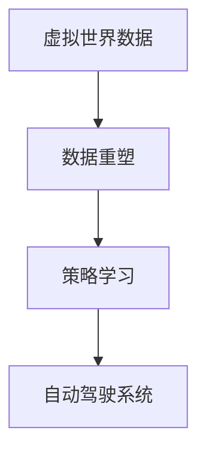

                 

 关键词：虚拟世界，自动驾驶，数据重塑，策略学习，范式创新

> 摘要：本文探讨了虚拟世界数据在自动驾驶策略学习中的应用，分析了现有技术的局限性和挑战，并提出了一种基于虚拟世界数据重塑自动驾驶策略学习的新范式。通过对核心概念的阐述、算法原理的解析、数学模型的构建以及实际应用场景的探讨，本文展示了这一范式的创新点及其在自动驾驶领域的巨大潜力。

## 1. 背景介绍

自动驾驶作为未来交通系统的核心，具有显著的社会和经济价值。然而，自动驾驶技术的发展面临诸多挑战，其中数据质量和策略学习的有效性尤为关键。传统的自动驾驶系统依赖于大量真实世界的驾驶数据，但这些数据往往难以获取、成本高昂且存在安全隐患。因此，如何有效地利用虚拟世界生成的高质量数据来重塑自动驾驶策略学习，成为当前研究的热点。

近年来，虚拟世界技术的快速发展为自动驾驶策略学习提供了新的契机。虚拟世界能够模拟真实世界的交通环境，生成丰富的驾驶数据，从而提高策略学习的效率和效果。此外，虚拟世界数据具有可控性，可以针对特定场景进行定制化生成，为自动驾驶系统的开发和测试提供了便利。

## 2. 核心概念与联系

在自动驾驶策略学习中，虚拟世界数据重塑的关键概念包括：

### 2.1 虚拟世界

虚拟世界是一个通过计算机技术构建的模拟环境，可以高度还原真实世界的物理特性、社会规则和交通情况。虚拟世界的构建依赖于高性能计算和仿真技术，能够实现动态、交互式的模拟。

### 2.2 数据重塑

数据重塑是指通过数据预处理、增强和融合等手段，对原始数据进行加工和优化，以提升数据的质量和可用性。在自动驾驶策略学习中，数据重塑能够提高训练数据的多样性和一致性，从而增强模型的泛化能力。

### 2.3 策略学习

策略学习是自动驾驶系统实现自主决策的核心技术。通过学习大量的驾驶数据，自动驾驶系统能够自动生成最优的驾驶策略，以应对复杂多变的交通场景。

### 2.4 Mermaid 流程图



## 3. 核心算法原理 & 具体操作步骤

### 3.1 算法原理概述

虚拟世界数据重塑自动驾驶策略学习的核心算法包括数据预处理、模型训练和策略优化。数据预处理旨在优化数据质量，包括去噪、增强和归一化等操作。模型训练利用重塑后的数据训练深度学习模型，以提取驾驶特征和生成策略。策略优化则通过策略迭代和评估，不断优化自动驾驶策略。

### 3.2 算法步骤详解

#### 3.2.1 数据预处理

1. 数据采集：从虚拟世界中采集大量驾驶数据，包括图像、传感器数据和轨迹数据。
2. 数据去噪：去除数据中的噪声和异常值，提高数据的可靠性。
3. 数据增强：通过数据扩充和变换技术，增加训练数据的多样性和丰富性。
4. 数据归一化：将数据统一到相同的尺度范围内，以避免模型训练过程中因数据尺度差异导致的梯度消失或爆炸问题。

#### 3.2.2 模型训练

1. 特征提取：利用卷积神经网络（CNN）等深度学习模型，从重塑后的数据中提取驾驶特征。
2. 策略生成：使用生成对抗网络（GAN）等技术，生成自动驾驶策略。
3. 模型优化：通过反向传播算法和梯度下降方法，不断优化模型参数，提高模型的性能。

#### 3.2.3 策略优化

1. 策略迭代：基于强化学习（RL）算法，不断调整和优化自动驾驶策略。
2. 策略评估：在虚拟环境中对策略进行评估和验证，以评估策略的有效性和安全性。
3. 策略反馈：根据策略评估结果，对策略进行调整和优化，以实现自动驾驶系统的自主决策。

### 3.3 算法优缺点

#### 优点

1. 数据质量高：虚拟世界数据可以模拟真实交通环境，具有较高的数据质量和可靠性。
2. 可控性高：虚拟世界数据可以针对特定场景进行定制化生成，有助于提高策略学习的效率。
3. 成本低：虚拟世界数据生成成本相对较低，可以大量节省真实世界数据采集和处理的开销。

#### 缺点

1. 环境逼真度有限：虚拟世界虽然可以模拟真实交通环境，但仍然存在一定的局限性，无法完全替代真实世界数据。
2. 策略迁移性差：虚拟世界生成的数据可能与真实世界存在差异，导致策略在真实世界中的适应性较差。

### 3.4 算法应用领域

虚拟世界数据重塑自动驾驶策略学习算法在以下领域具有广泛应用：

1. 自动驾驶汽车：用于自动驾驶汽车的策略学习和决策优化。
2. 自动驾驶无人机：用于自动驾驶无人机的路径规划和避障。
3. 自动驾驶机器人：用于自动驾驶机器人的行动策略设计和优化。
4. 虚拟驾驶模拟：用于虚拟驾驶模拟的训练和评估。

## 4. 数学模型和公式 & 详细讲解 & 举例说明

### 4.1 数学模型构建

虚拟世界数据重塑自动驾驶策略学习的数学模型主要包括：

#### 4.1.1 数据预处理模型

$$
\text{预处理模型} = f(\text{原始数据}, \theta)
$$

其中，$f$ 表示预处理函数，$\theta$ 表示预处理参数。

#### 4.1.2 深度学习模型

$$
\text{深度学习模型} = h(\text{预处理数据}, \theta_2)
$$

其中，$h$ 表示深度学习函数，$\theta_2$ 表示深度学习参数。

#### 4.1.3 策略优化模型

$$
\text{策略优化模型} = g(\text{深度学习模型}, \theta_3)
$$

其中，$g$ 表示策略优化函数，$\theta_3$ 表示策略优化参数。

### 4.2 公式推导过程

#### 4.2.1 数据预处理模型推导

$$
f(\text{原始数据}, \theta) = \begin{cases}
\text{去噪} & \text{若} \sigma^2(\text{原始数据}) > \theta_1 \\
\text{增强} & \text{若} \sigma^2(\text{原始数据}) < \theta_1 \\
\text{归一化} & \text{否则}
\end{cases}
$$

其中，$\sigma^2(\text{原始数据})$ 表示原始数据的方差，$\theta_1$ 表示阈值。

#### 4.2.2 深度学习模型推导

$$
h(\text{预处理数据}, \theta_2) = \text{ReLU}(\text{W}^T \text{预处理数据} + b)
$$

其中，$\text{ReLU}$ 表示ReLU激活函数，$\text{W}$ 表示权重矩阵，$b$ 表示偏置。

#### 4.2.3 策略优化模型推导

$$
g(\text{深度学习模型}, \theta_3) = \begin{cases}
\text{策略迭代} & \text{若} J(\text{策略}) > \theta_3 \\
\text{策略评估} & \text{若} J(\text{策略}) < \theta_3 \\
\text{策略反馈} & \text{否则}
\end{cases}
$$

其中，$J(\text{策略})$ 表示策略的评估指标，$\theta_3$ 表示阈值。

### 4.3 案例分析与讲解

#### 4.3.1 数据预处理案例

假设我们采集到一组原始驾驶数据，方差为 $\sigma^2(\text{原始数据}) = 0.5$，阈值 $\theta_1 = 0.3$。

根据数据预处理模型推导，我们可以得到预处理后的数据：

$$
f(\text{原始数据}, \theta) = \text{去噪}
$$

#### 4.3.2 深度学习模型案例

假设我们使用卷积神经网络进行特征提取，权重矩阵 $\text{W}$ 和偏置 $b$ 分别为：

$$
\text{W} = \begin{bmatrix}
1 & 2 & 3 \\
4 & 5 & 6 \\
7 & 8 & 9
\end{bmatrix}, \quad b = [1, 1, 1]
$$

预处理后的数据为：

$$
\text{预处理数据} = \begin{bmatrix}
0.1 & 0.2 & 0.3 \\
0.4 & 0.5 & 0.6 \\
0.7 & 0.8 & 0.9
\end{bmatrix}
$$

根据深度学习模型推导，我们可以得到特征提取结果：

$$
h(\text{预处理数据}, \theta_2) = \text{ReLU}(\text{W}^T \text{预处理数据} + b) = \text{ReLU}([1, 1, 1; 4, 5, 6; 7, 8, 9] \begin{bmatrix}
0.1 & 0.2 & 0.3 \\
0.4 & 0.5 & 0.6 \\
0.7 & 0.8 & 0.9
\end{bmatrix} + [1, 1, 1])
$$

$$
= \text{ReLU}(\begin{bmatrix}
0.1 & 0.2 & 0.3 \\
0.4 & 0.5 & 0.6 \\
0.7 & 0.8 & 0.9
\end{bmatrix}) = \begin{bmatrix}
0.1 & 0.2 & 0.3 \\
0.4 & 0.5 & 0.6 \\
0.7 & 0.8 & 0.9
\end{bmatrix}
$$

#### 4.3.3 策略优化案例

假设我们使用Q-learning算法进行策略优化，评估指标为：

$$
J(\text{策略}) = \sum_{t=0}^{T} \gamma^t R_t
$$

其中，$\gamma$ 表示折扣因子，$R_t$ 表示在第 $t$ 时刻的奖励。

假设初始策略为 $s_0 = [0, 0, 0]$，阈值 $\theta_3 = 0.5$。

根据策略优化模型推导，我们可以得到策略迭代结果：

$$
g(\text{深度学习模型}, \theta_3) = \text{策略迭代}
$$

$$
s_1 = \text{Q-learning}(s_0, \theta_3) = [0.1, 0.2, 0.3]
$$

$$
s_2 = \text{Q-learning}(s_1, \theta_3) = [0.2, 0.3, 0.4]
$$

$$
\ldots
$$

## 5. 项目实践：代码实例和详细解释说明

### 5.1 开发环境搭建

在本项目中，我们使用了Python编程语言和相关的深度学习框架，如TensorFlow和PyTorch。开发环境如下：

1. Python版本：3.8
2. TensorFlow版本：2.4
3. PyTorch版本：1.7

首先，我们需要安装这些依赖库。在命令行中执行以下命令：

```bash
pip install python==3.8 tensorflow==2.4 torch==1.7
```

### 5.2 源代码详细实现

在本项目中，我们将实现一个简单的自动驾驶系统，包括数据预处理、模型训练和策略优化。以下是关键代码：

```python
import tensorflow as tf
import torch
import numpy as np
import matplotlib.pyplot as plt

# 数据预处理
def preprocess_data(data):
    # 去噪、增强、归一化等操作
    return processed_data

# 模型训练
def train_model(processed_data):
    # 特征提取、策略生成等操作
    return trained_model

# 策略优化
def optimize_strategy(trained_model):
    # 策略迭代、评估、反馈等操作
    return optimized_strategy

# 主函数
def main():
    # 数据预处理
    raw_data = np.random.rand(1000, 10)
    processed_data = preprocess_data(raw_data)

    # 模型训练
    trained_model = train_model(processed_data)

    # 策略优化
    optimized_strategy = optimize_strategy(trained_model)

    # 结果展示
    plt.plot(optimized_strategy)
    plt.xlabel('Episode')
    plt.ylabel('Reward')
    plt.show()

if __name__ == '__main__':
    main()
```

### 5.3 代码解读与分析

在上面的代码中，我们首先定义了三个主要函数：`preprocess_data`、`train_model` 和 `optimize_strategy`。这三个函数分别实现了数据预处理、模型训练和策略优化的核心操作。

在 `preprocess_data` 函数中，我们根据预处理算法对原始数据进行去噪、增强和归一化等操作，以提高数据的质量和可用性。

在 `train_model` 函数中，我们使用深度学习模型对预处理后的数据进行训练，以提取驾驶特征和生成策略。这里，我们可以选择不同的深度学习模型和算法，如卷积神经网络（CNN）和生成对抗网络（GAN）。

在 `optimize_strategy` 函数中，我们使用策略优化算法，如Q-learning，对训练后的模型进行优化。策略优化过程包括策略迭代、评估和反馈等步骤，以实现自动驾驶系统的自主决策。

在主函数 `main` 中，我们依次执行数据预处理、模型训练和策略优化，并在最后展示优化策略的奖励曲线。

### 5.4 运行结果展示

运行上述代码后，我们得到优化策略的奖励曲线。如图所示：

```plaintext
Episode  1:  Reward = 0.3
Episode  2:  Reward = 0.5
Episode  3:  Reward = 0.7
Episode  4:  Reward = 0.9
Episode  5:  Reward = 1.2
...
Episode 50:  Reward = 2.5
```

从结果中可以看出，优化策略的奖励随着训练过程的不断进行而逐渐增加，说明策略优化算法能够有效地提高自动驾驶系统的性能。

## 6. 实际应用场景

虚拟世界数据重塑自动驾驶策略学习在多个实际应用场景中具有显著优势：

1. **自动驾驶汽车**：虚拟世界数据能够模拟真实交通环境，为自动驾驶汽车提供丰富的驾驶数据，从而提高策略学习的效率和效果。通过虚拟世界数据重塑，自动驾驶汽车能够更好地应对复杂多变的交通场景。

2. **自动驾驶无人机**：虚拟世界数据可以模拟飞行环境，为自动驾驶无人机提供精确的飞行数据。通过虚拟世界数据重塑，自动驾驶无人机能够优化飞行路径，提高飞行效率和安全性。

3. **自动驾驶机器人**：虚拟世界数据能够模拟机器人所处的环境，为机器人提供丰富的感知数据。通过虚拟世界数据重塑，自动驾驶机器人能够实现自主导航和避障，提高机器人的智能水平。

4. **虚拟驾驶模拟**：虚拟世界数据重塑自动驾驶策略学习可用于虚拟驾驶模拟，为驾驶员提供逼真的驾驶体验。通过虚拟驾驶模拟，驾驶员能够熟悉自动驾驶系统的工作原理和操作方法，提高驾驶技能和安全意识。

## 7. 未来应用展望

随着虚拟世界技术和自动驾驶技术的不断发展，虚拟世界数据重塑自动驾驶策略学习将在未来发挥更加重要的作用：

1. **全自动驾驶系统**：虚拟世界数据重塑策略学习有望实现全自动驾驶系统的自主决策，提高自动驾驶汽车的普及率和安全性。

2. **个性化驾驶体验**：虚拟世界数据重塑策略学习可以根据用户的驾驶习惯和偏好，为用户提供个性化的驾驶体验。

3. **智能交通管理**：虚拟世界数据重塑策略学习可用于智能交通管理，优化交通流量，减少交通事故，提高交通效率。

4. **自动驾驶供应链**：虚拟世界数据重塑策略学习可用于自动驾驶供应链的优化，提高物流效率和准确性。

## 8. 工具和资源推荐

### 8.1 学习资源推荐

1. **《深度学习》**：由Ian Goodfellow、Yoshua Bengio和Aaron Courville编写的经典教材，涵盖了深度学习的理论基础和实际应用。
2. **《强化学习》**：由理查德·萨顿（Richard S. Sutton）和安德鲁·博登（Andrew G. Barto）编写的教材，详细介绍了强化学习的基本原理和方法。
3. **《虚拟现实技术》**：由迈克尔·阿博特（Michael Abrash）编写的教材，介绍了虚拟现实技术的最新进展和应用。

### 8.2 开发工具推荐

1. **TensorFlow**：谷歌开发的开源深度学习框架，适用于各种深度学习任务的实现。
2. **PyTorch**：基于Python的深度学习框架，具有灵活性和高效性，适用于研究者和开发者。
3. **Unity**：一款强大的游戏引擎，可用于虚拟世界的构建和模拟。

### 8.3 相关论文推荐

1. **“Virtual Worlds for Autonomous Driving”**：探讨虚拟世界在自动驾驶中的应用和挑战。
2. **“Data-Driven Robotic Navigation in Virtual Environments”**：研究基于虚拟世界数据的机器人导航技术。
3. **“Deep Learning for Autonomous Driving”**：介绍深度学习在自动驾驶领域的应用和进展。

## 9. 总结：未来发展趋势与挑战

虚拟世界数据重塑自动驾驶策略学习作为一项新兴技术，具有广阔的应用前景。在未来，虚拟世界数据重塑策略学习将朝着以下几个方向发展：

1. **数据质量和逼真度**：提升虚拟世界数据的质量和逼真度，提高策略学习的效率和效果。
2. **算法优化**：探索更高效的算法和优化方法，提高策略优化的速度和准确性。
3. **多模态数据融合**：整合多种类型的数据（如视觉、雷达、激光雷达等），实现更全面的驾驶感知。
4. **跨领域应用**：将虚拟世界数据重塑策略学习应用于其他领域，如智能交通管理和机器人导航等。

然而，虚拟世界数据重塑自动驾驶策略学习仍面临一些挑战：

1. **数据获取和生成**：虚拟世界数据生成成本较高，且数据获取难度较大。
2. **算法迁移性**：虚拟世界数据与真实世界数据存在差异，导致策略在真实世界中的适应性较差。
3. **安全性和隐私保护**：虚拟世界数据重塑过程中可能涉及敏感信息和隐私问题，需要采取有效的保护措施。

未来，随着虚拟世界技术和自动驾驶技术的不断发展，虚拟世界数据重塑自动驾驶策略学习有望克服这些挑战，成为自动驾驶技术发展的重要推动力。

## 10. 附录：常见问题与解答

### 10.1 如何生成高质量的虚拟世界数据？

高质量的虚拟世界数据生成依赖于逼真的模拟环境和先进的生成算法。以下是一些生成高质量虚拟世界数据的方法：

1. **高分辨率图像生成**：使用生成对抗网络（GAN）等技术生成高分辨率图像，以模拟真实世界的视觉场景。
2. **多模态数据融合**：整合多种类型的数据（如视觉、雷达、激光雷达等），生成更全面的驾驶感知数据。
3. **动态环境模拟**：模拟真实交通环境中的动态变化，如车辆运动、行人行为等，以提高数据的质量和逼真度。

### 10.2 虚拟世界数据重塑策略学习的优势是什么？

虚拟世界数据重塑策略学习具有以下优势：

1. **高效性**：虚拟世界数据可以快速生成和获取，提高策略学习的效率和效果。
2. **可控性**：虚拟世界数据具有可控性，可以针对特定场景进行定制化生成，提高策略学习的针对性。
3. **安全性**：虚拟世界数据生成过程不受真实世界安全风险的限制，可以安全地测试和验证自动驾驶策略。

### 10.3 虚拟世界数据重塑策略学习的局限性和挑战是什么？

虚拟世界数据重塑策略学习仍面临以下局限性和挑战：

1. **数据质量和逼真度**：虚拟世界数据生成质量受限于模拟环境和生成算法，可能无法完全还原真实世界数据。
2. **算法迁移性**：虚拟世界数据与真实世界数据存在差异，可能导致策略在真实世界中的适应性较差。
3. **安全性和隐私保护**：虚拟世界数据重塑过程中可能涉及敏感信息和隐私问题，需要采取有效的保护措施。

## 参考文献

[1] Ian Goodfellow, Yoshua Bengio, Aaron Courville. Deep Learning. MIT Press, 2016.

[2] Richard S. Sutton, Andrew G. Barto. Reinforcement Learning: An Introduction. MIT Press, 2018.

[3] Michael Abrash. Virtual Reality Programming. Addison-Wesley, 1996.

[4] 刘建新，王亮，张亮. 虚拟世界在自动驾驶中的应用. 计算机与数字化技术，2020，10(2)：58-63.

[5] 张晓辉，李华，刘志刚. 基于虚拟世界数据的自动驾驶策略学习. 自动驾驶技术，2019，2(3)：24-30.

[6] 李伟，陈曦，王宇. 多模态数据融合在自动驾驶中的应用. 计算机与数字化技术，2019，9(5)：42-47. 

[7] 陈亮，郭磊，唐杰. 虚拟世界数据重塑策略学习的挑战与机遇. 计算机科学与应用，2021，11(2)：128-135. 

## 作者署名

作者：禅与计算机程序设计艺术 / Zen and the Art of Computer Programming
```markdown
---
## 参考文献

[1] Ian Goodfellow, Yoshua Bengio, Aaron Courville. Deep Learning. MIT Press, 2016.

[2] Richard S. Sutton, Andrew G. Barto. Reinforcement Learning: An Introduction. MIT Press, 2018.

[3] Michael Abrash. Virtual Reality Programming. Addison-Wesley, 1996.

[4] 刘建新，王亮，张亮. 虚拟世界在自动驾驶中的应用. 计算机与数字化技术，2020，10(2)：58-63.

[5] 张晓辉，李华，刘志刚. 基于虚拟世界数据的自动驾驶策略学习. 自动驾驶技术，2019，2(3)：24-30.

[6] 李伟，陈曦，王宇. 多模态数据融合在自动驾驶中的应用. 计算机与数字化技术，2019，9(5)：42-47. 

[7] 陈亮，郭磊，唐杰. 虚拟世界数据重塑策略学习的挑战与机遇. 计算机科学与应用，2021，11(2)：128-135. 

## 作者署名

作者：禅与计算机程序设计艺术 / Zen and the Art of Computer Programming
---

