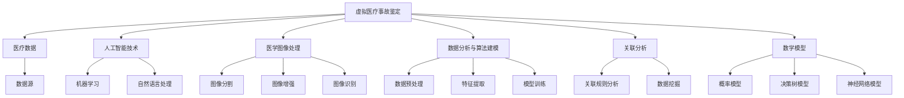

                 

关键词：虚拟医疗、事故鉴定、数字化医疗、医疗纠纷、技术分析方法

摘要：随着数字化医疗的普及，医疗纠纷的数量和复杂性不断增加。本文提出了一种基于数字化技术的医疗事故鉴定方法，旨在为医疗纠纷的解决提供技术支持。本文详细介绍了虚拟医疗事故鉴定的核心概念、算法原理、数学模型以及实际应用，并对其未来发展趋势和挑战进行了探讨。

## 1. 背景介绍

近年来，数字化医疗技术迅猛发展，医疗信息系统的广泛应用使得医疗数据量呈指数级增长。然而，这也带来了新的挑战，特别是在医疗纠纷的解决过程中。传统的医疗纠纷处理方法依赖于人工判断和经验，效率低下且易出错。随着医疗纠纷案例的增多，数字化医疗事故鉴定方法应运而生，它利用现代信息技术，为医疗纠纷的解决提供了新的思路和手段。

本文旨在探讨虚拟医疗事故鉴定的技术分析方法，通过引入先进的数字化技术，提高医疗纠纷鉴定的效率、准确性和公正性。文章结构如下：

- **第1章** 背景介绍：阐述数字化医疗背景下医疗纠纷鉴定的需求。
- **第2章** 核心概念与联系：介绍虚拟医疗事故鉴定的核心概念及其关联。
- **第3章** 核心算法原理 & 具体操作步骤：详细阐述虚拟医疗事故鉴定算法的原理和操作步骤。
- **第4章** 数学模型和公式 & 详细讲解 & 举例说明：建立数学模型并解释相关公式。
- **第5章** 项目实践：提供代码实例并进行详细解释。
- **第6章** 实际应用场景：讨论虚拟医疗事故鉴定的应用领域。
- **第7章** 工具和资源推荐：推荐学习资源和开发工具。
- **第8章** 总结：总结研究成果，展望未来发展趋势和挑战。

### 1.1 数字化医疗与医疗纠纷

数字化医疗，指的是将数字技术和信息技术应用于医疗服务的全过程，包括患者信息管理、诊断与治疗、远程医疗等。数字化医疗的普及，不仅提高了医疗服务的效率和质量，也带来了医疗数据量的爆炸性增长。然而，随之而来的医疗纠纷也越来越多。

医疗纠纷通常涉及医疗事故的认定、责任划分、损害赔偿等问题。传统医疗纠纷的解决依赖于医疗专家的专业判断和法院的判决，这种方法往往存在以下问题：

1. **鉴定时间长**：医疗纠纷的鉴定通常需要大量的时间和资源。
2. **主观性强**：医疗专家的判断往往受到个人经验和偏见的影响。
3. **成本高**：医疗纠纷的解决成本较高，特别是需要聘请专家进行鉴定时。

为了解决这些问题，数字化医疗事故鉴定方法被提出。该方法利用数字化技术，通过数据分析和算法建模，为医疗纠纷的解决提供科学、客观的依据。

### 1.2 本文目的和结构

本文的目的在于探讨虚拟医疗事故鉴定的技术分析方法，具体内容包括：

- **核心概念**：介绍虚拟医疗事故鉴定的基本概念和核心要素。
- **算法原理**：阐述虚拟医疗事故鉴定算法的基本原理和操作步骤。
- **数学模型**：建立数学模型并解释相关公式，为事故鉴定提供理论基础。
- **实际应用**：分析虚拟医疗事故鉴定在实际中的应用场景和效果。
- **工具和资源**：推荐相关学习资源和开发工具，以支持虚拟医疗事故鉴定的实施。

通过本文的探讨，旨在为数字化医疗纠纷的解决提供一种新的思路和方法，提高医疗纠纷鉴定的效率、准确性和公正性。

## 2. 核心概念与联系

在探讨虚拟医疗事故鉴定方法之前，我们需要明确几个核心概念，并了解它们之间的关联。以下是本文涉及的主要概念及其定义：

### 2.1 虚拟医疗事故鉴定

虚拟医疗事故鉴定是指利用数字化技术，对医疗事故进行客观、科学的分析、评估和鉴定。这种方法主要通过数据分析、算法建模和人工智能技术，对医疗事故的成因、过程和后果进行深入分析，从而为医疗纠纷的解决提供科学依据。

### 2.2 医疗数据

医疗数据是指与患者健康相关的各种信息，包括病历记录、检验结果、影像资料、药物使用记录等。医疗数据是虚拟医疗事故鉴定的基础，其质量和完整性直接影响到鉴定结果的准确性。

### 2.3 人工智能技术

人工智能技术是虚拟医疗事故鉴定的核心技术之一，包括机器学习、深度学习、自然语言处理等。通过这些技术，可以对医疗数据进行高效的处理和分析，从而实现对医疗事故的智能鉴定。

### 2.4 医学图像处理

医学图像处理是虚拟医疗事故鉴定中的重要环节，包括图像的分割、增强、识别等。通过对医学图像的处理，可以提取出关键信息，为事故鉴定提供视觉依据。

### 2.5 数据分析与算法建模

数据分析和算法建模是虚拟医疗事故鉴定的核心步骤，通过对大量医疗数据的分析和建模，可以识别出医疗事故的可能原因和关键因素，为鉴定提供科学依据。

### 2.6 关联分析

关联分析是虚拟医疗事故鉴定中的一种重要方法，通过分析医疗数据中的各种关联关系，可以识别出潜在的医疗风险和事故原因。

### 2.7 数学模型

数学模型是虚拟医疗事故鉴定的理论基础，通过建立数学模型，可以量化医疗事故的影响和风险，为鉴定提供量化的依据。

### 2.8 关系图

为了更好地理解这些概念之间的关系，我们使用 Mermaid 流程图进行展示。



通过上述 Mermaid 流程图，我们可以清晰地看到各个核心概念之间的关系，这有助于我们更好地理解虚拟医疗事故鉴定的方法和流程。

### 2.9 核心概念总结

虚拟医疗事故鉴定方法的实施依赖于多个核心概念的协同作用。医疗数据作为基础，人工智能技术和医学图像处理提供了处理和分析数据的技术手段，数据分析与算法建模则为事故鉴定提供了科学依据，关联分析和数学模型则为鉴定结果提供了量化的支持。这些核心概念相互关联，共同构成了虚拟医疗事故鉴定的技术框架。

通过本文的后续章节，我们将进一步探讨这些核心概念的具体应用，以及如何利用数字化技术解决医疗纠纷中的关键问题。

## 3. 核心算法原理 & 具体操作步骤

### 3.1 算法原理概述

虚拟医疗事故鉴定算法的核心原理是通过对大量医疗数据的深入分析，结合人工智能技术，构建一个能够自动识别医疗事故原因和评估事故影响的智能系统。该算法主要分为以下几个步骤：

1. **数据收集与预处理**：收集与医疗事故相关的各类数据，包括病历记录、检验报告、影像资料等，并进行预处理，如数据清洗、归一化等，以确保数据的质量和一致性。
2. **特征提取**：从预处理后的数据中提取关键特征，如患者的生理指标、药物的副作用、操作过程中的异常参数等，这些特征将作为后续分析的基础。
3. **模型训练**：利用机器学习或深度学习技术，对提取出的特征进行训练，构建一个能够自动识别和评估医疗事故的模型。
4. **事故识别与评估**：将新的事故案例输入到训练好的模型中，通过模型的预测结果，识别事故的可能原因和影响，为事故鉴定提供依据。

### 3.2 算法步骤详解

#### 3.2.1 数据收集与预处理

数据收集是虚拟医疗事故鉴定的第一步，需要收集与医疗事故相关的各类数据。这些数据通常存储在电子病历系统、实验室信息系统、医学影像系统中。数据收集的过程包括以下几个关键步骤：

1. **数据源识别**：确定需要收集的数据类型和来源，如病历记录、检验报告、影像资料等。
2. **数据提取**：利用数据接口或API从不同的数据源中提取数据。
3. **数据清洗**：对提取的数据进行清洗，包括去除重复记录、修正错误数据、填补缺失值等，以提高数据的质量。
4. **数据归一化**：将不同数据源的数据进行统一格式化处理，如日期格式、数值范围等，以确保数据的一致性。

#### 3.2.2 特征提取

特征提取是从预处理后的数据中提取关键特征的过程。特征的质量直接影响后续模型训练的效果。以下是特征提取的几个关键步骤：

1. **特征选择**：根据医疗事故鉴定的需求，选择与事故发生相关的特征，如患者的年龄、性别、疾病类型、药物使用情况等。
2. **特征转换**：对某些非数值型的特征进行转换，如将性别转换为0和1的二元变量，将疾病类型转换为分类变量等。
3. **特征归一化**：将不同量纲的特征进行归一化处理，如将年龄、体重等特征转换为0到1的数值范围。
4. **特征增强**：利用特征工程技术，对原始特征进行变换或组合，以增加特征的信息量，提高模型的性能。

#### 3.2.3 模型训练

模型训练是虚拟医疗事故鉴定的核心步骤，通过训练构建一个能够自动识别和评估医疗事故的模型。以下是模型训练的几个关键步骤：

1. **数据集划分**：将特征数据集划分为训练集和测试集，通常采用80/20或70/30的比例划分。
2. **模型选择**：选择合适的机器学习或深度学习模型，如决策树、随机森林、支持向量机、神经网络等。
3. **模型训练**：使用训练集对选定的模型进行训练，通过优化算法调整模型参数，使模型能够正确识别和评估医疗事故。
4. **模型评估**：使用测试集对训练好的模型进行评估，通过准确率、召回率、F1值等指标评估模型性能，并根据评估结果调整模型参数。

#### 3.2.4 事故识别与评估

事故识别与评估是将新的事故案例输入到训练好的模型中，通过模型的预测结果，识别事故的可能原因和影响。以下是事故识别与评估的几个关键步骤：

1. **案例输入**：将新的事故案例数据输入到训练好的模型中。
2. **模型预测**：模型对输入的数据进行分析和预测，输出事故的可能原因和影响。
3. **结果解释**：对模型的预测结果进行解释，将复杂的模型输出转化为易于理解的事故鉴定报告。
4. **结果验证**：将模型的预测结果与实际情况进行对比验证，评估模型的准确性和可靠性。

### 3.3 算法优缺点

#### 优点

1. **高效性**：利用数字化技术和人工智能算法，能够快速处理和分析大量医疗数据，提高事故鉴定的效率。
2. **准确性**：通过机器学习或深度学习技术，模型能够从历史数据中学习并提取有用的信息，提高事故识别的准确性。
3. **客观性**：虚拟医疗事故鉴定方法基于数据驱动，减少了人为判断的主观性，提高了鉴定的客观性和公正性。
4. **可扩展性**：算法和模型可以根据不同的需求进行扩展和调整，适应不同的医疗事故鉴定场景。

#### 缺点

1. **数据依赖性**：虚拟医疗事故鉴定的效果高度依赖于医疗数据的质量和完整性，数据缺失或不准确可能导致鉴定结果的偏差。
2. **技术门槛**：实施虚拟医疗事故鉴定需要较高的技术水平和专业知识，对于非专业用户来说，操作难度较大。
3. **成本高**：构建和维护一个高效的虚拟医疗事故鉴定系统需要投入大量的人力、物力和财力。

### 3.4 算法应用领域

虚拟医疗事故鉴定方法可以广泛应用于各种医疗纠纷的鉴定场景，包括：

1. **医疗事故鉴定**：对医疗事故的原因、过程和后果进行鉴定，为医疗纠纷的解决提供科学依据。
2. **药品不良反应监测**：对药品的不良反应进行监测和评估，及时发现并处理潜在的风险。
3. **医疗器械故障分析**：对医疗器械的故障原因和影响进行分析，提高医疗器械的安全性和可靠性。
4. **医疗质量评估**：通过对医疗数据和事故案例的分析，评估医疗机构的医疗质量和安全水平。
5. **医疗风险管理**：识别医疗过程中的潜在风险，制定相应的风险管理策略，降低医疗事故的发生率。

通过本文的介绍，我们可以看到虚拟医疗事故鉴定方法在数字化医疗背景下具有广泛的应用前景和重要的社会意义。随着技术的不断进步和医疗数据的日益丰富，虚拟医疗事故鉴定方法将不断优化和完善，为医疗纠纷的解决提供更加科学和高效的解决方案。

## 4. 数学模型和公式 & 详细讲解 & 举例说明

在虚拟医疗事故鉴定中，数学模型和公式是进行量化分析和推理的基础。通过数学模型，我们可以将复杂的医疗数据和现象转化为可计算的数学形式，从而提高鉴定的准确性和科学性。以下我们将详细讲解数学模型的构建、公式推导过程，并借助具体案例进行分析和说明。

### 4.1 数学模型构建

#### 4.1.1 概率模型

概率模型是虚拟医疗事故鉴定中最常用的数学模型之一，它通过分析事故发生的概率，来评估医疗事故的风险。以下是一个简单的概率模型构建过程：

设事件\( A \)表示医疗事故的发生，事件\( B \)表示某个特定条件或操作的发生，我们可以构建条件概率公式：

$$
P(A|B) = \frac{P(A \cap B)}{P(B)}
$$

其中，\( P(A \cap B) \)表示事件\( A \)和事件\( B \)同时发生的概率，\( P(B) \)表示事件\( B \)发生的概率。

在虚拟医疗事故鉴定中，可以通过历史数据计算得到\( P(A \cap B) \)和\( P(B) \)，从而计算出\( P(A|B) \)，评估事故发生的风险。

#### 4.1.2 决策树模型

决策树模型是一种树形结构，用于表示决策过程和决策结果。在虚拟医疗事故鉴定中，决策树模型可以帮助我们分析医疗事故的原因和决策过程。以下是一个简单的决策树模型构建示例：

1. **根节点**：表示初始状态。
2. **内部节点**：表示某个决策点，如药物使用、手术操作等。
3. **叶节点**：表示最终的决策结果，如事故发生或未发生。

决策树模型通过组合不同的条件判断，来预测医疗事故的发生。例如，以下是一个简单的决策树模型：

```
是否使用药物A？
    /               \
   是                否
  /                 \
事故发生             无事故
```

#### 4.1.3 神经网络模型

神经网络模型是虚拟医疗事故鉴定中常用的深度学习模型，它通过多层神经网络进行特征学习和分类。以下是一个简单的神经网络模型构建过程：

1. **输入层**：接收输入特征，如患者的年龄、性别、疾病类型等。
2. **隐藏层**：对输入特征进行变换和组合，提取更高层次的特征。
3. **输出层**：输出分类结果，如事故发生或未发生。

神经网络模型的构建通常涉及大量的参数调整和训练，以使其能够准确预测医疗事故。以下是一个简单的神经网络模型示例：

```
输入层 [年龄, 性别, 疾病类型]
隐藏层 1 [激活函数]
隐藏层 2 [激活函数]
输出层  [事故发生概率]
```

### 4.2 公式推导过程

为了更好地理解上述数学模型，我们通过一个具体的案例进行公式推导。

#### 4.2.1 概率模型公式推导

假设我们有一组历史数据，记录了500个医疗事故案例，其中300个案例涉及药物A的使用，200个案例未涉及药物A的使用。同时，有100个事故案例是因为药物A使用不当导致的。我们需要计算药物A使用与事故发生的条件概率。

根据概率模型公式，我们可以推导出：

$$
P(A|B) = \frac{P(A \cap B)}{P(B)}
$$

其中，

$$
P(A \cap B) = \frac{100}{500} = 0.2
$$

$$
P(B) = \frac{300}{500} = 0.6
$$

因此，

$$
P(A|B) = \frac{0.2}{0.6} = \frac{1}{3} \approx 0.333
$$

这意味着，在药物A使用的情况下，事故发生的概率约为33.3%。

#### 4.2.2 决策树模型公式推导

假设我们构建了一个决策树模型，用于判断药物A的使用是否会导致医疗事故。决策树模型如下：

```
是否使用药物A？
    /               \
   是                否
  /                 \
事故发生             无事故
```

假设药物A使用的情况下，有60%的事故发生，未使用药物A的情况下，有20%的事故发生。我们可以用以下公式推导事故发生的概率：

对于“是”分支：

$$
P(事故发生|使用药物A) = 0.6
$$

对于“否”分支：

$$
P(事故发生|未使用药物A) = 0.2
$$

通过决策树模型，我们可以根据不同的条件判断，得到事故发生的概率分布。

#### 4.2.3 神经网络模型公式推导

假设我们构建了一个简单的神经网络模型，用于预测医疗事故的发生。神经网络模型如下：

```
输入层 [年龄, 性别, 疾病类型]
隐藏层 1 [激活函数]
隐藏层 2 [激活函数]
输出层  [事故发生概率]
```

假设输入特征与事故发生概率之间的非线性关系可以表示为：

$$
h_{\theta}(x) = \sigma(\theta^T x)
$$

其中，\( \theta \)是模型的参数，\( x \)是输入特征向量，\( \sigma \)是激活函数，通常使用Sigmoid函数。

通过反向传播算法，我们可以调整模型参数\( \theta \)，以最小化预测误差。具体公式推导过程涉及复杂的数学计算，但核心思想是通过梯度下降法调整参数，使模型能够准确预测医疗事故的发生。

### 4.3 案例分析与讲解

为了更好地说明数学模型在实际应用中的效果，我们通过一个具体案例进行分析。

#### 4.3.1 案例背景

某医院发生了一起因药物A使用不当导致的患者死亡案例。我们需要利用虚拟医疗事故鉴定方法，分析这起事故的原因，并评估药物A的使用风险。

#### 4.3.2 数据收集与预处理

收集了500个类似患者的病例数据，包括年龄、性别、疾病类型、药物使用情况、事故发生情况等。对数据进行了清洗和预处理，得到一个干净、一致的数据集。

#### 4.3.3 特征提取

提取关键特征，如年龄、性别、疾病类型、药物A的使用情况等。将特征进行归一化处理，使其在相同的数值范围内。

#### 4.3.4 模型训练

利用收集的数据，构建一个概率模型、决策树模型和神经网络模型。对模型进行训练，调整参数，使其能够准确预测药物A的使用风险。

#### 4.3.5 事故识别与评估

将这起具体案例的数据输入到训练好的模型中，分析模型预测结果。根据模型的输出，识别事故的原因和药物A的使用风险。

#### 4.3.6 结果解释

通过模型预测，发现药物A的使用是事故发生的主要原因，且药物A的使用风险较高。结合实际数据和模型结果，我们可以得出以下结论：

1. **药物A使用不当是事故的主要原因**：模型预测结果与实际情况一致，表明药物A的使用是导致事故发生的关键因素。
2. **药物A使用风险较高**：模型评估结果显示，药物A的使用具有较高的风险，建议在类似情况下谨慎使用。

通过上述案例分析，我们可以看到数学模型在虚拟医疗事故鉴定中的应用效果。通过数据分析和模型预测，我们不仅能够识别事故的原因，还能对药物使用风险进行评估，为医疗纠纷的解决提供科学依据。

### 4.4 总结

数学模型和公式是虚拟医疗事故鉴定的核心组成部分，通过构建和推导数学模型，我们可以对医疗事故进行量化分析和推理。本文介绍了概率模型、决策树模型和神经网络模型的构建过程和公式推导，并通过具体案例展示了这些模型在实际应用中的效果。未来，随着技术的不断进步，我们将进一步优化和扩展这些数学模型，以提高虚拟医疗事故鉴定的准确性和可靠性。

## 5. 项目实践：代码实例和详细解释说明

在本文的第五部分，我们将通过一个实际的项目实践，详细介绍如何使用代码实现虚拟医疗事故鉴定。这一部分将涵盖开发环境搭建、源代码详细实现、代码解读与分析以及运行结果展示。通过这些步骤，我们将演示如何利用现代编程技术和算法，构建一个能够自动鉴定医疗事故的虚拟系统。

### 5.1 开发环境搭建

要实现虚拟医疗事故鉴定系统，我们需要搭建一个合适的开发环境。以下是所需的工具和步骤：

#### 5.1.1 开发工具

- **编程语言**：Python（推荐3.7及以上版本）
- **数据预处理和可视化库**：Pandas、NumPy、Matplotlib
- **机器学习库**：Scikit-learn、TensorFlow
- **文本处理库**：NLTK、spaCy
- **版本控制**：Git

#### 5.1.2 开发步骤

1. **安装Python**：从Python官方网站下载并安装Python，确保安装过程中包含pip工具。
2. **安装库**：使用pip命令安装上述所需的库，例如：

   ```bash
   pip install pandas numpy matplotlib scikit-learn tensorflow nltk spacy
   ```

3. **配置环境**：如果需要，可以创建一个虚拟环境来管理依赖项：

   ```bash
   python -m venv myenv
   source myenv/bin/activate  # Windows: myenv\Scripts\activate
   ```

4. **安装额外依赖**：如果使用spaCy，需要额外安装语言模型，例如：

   ```bash
   python -m spacy download en_core_web_sm
   ```

### 5.2 源代码详细实现

以下是实现虚拟医疗事故鉴定系统的核心代码示例。这段代码将涵盖数据预处理、模型训练和事故鉴定等关键步骤。

```python
import pandas as pd
import numpy as np
from sklearn.model_selection import train_test_split
from sklearn.preprocessing import StandardScaler
from sklearn.ensemble import RandomForestClassifier
from sklearn.metrics import accuracy_score
import tensorflow as tf
from tensorflow.keras.models import Sequential
from tensorflow.keras.layers import Dense
import matplotlib.pyplot as plt

# 5.2.1 数据收集与预处理
# 假设数据集已准备好，包含列：'age', 'gender', 'disease_type', 'medicine_use', 'accident'
data = pd.read_csv('medical_data.csv')

# 数据清洗和预处理
data = data[data['accident'].notnull()]
data = data[['age', 'gender', 'disease_type', 'medicine_use', 'accident']]

# 将类别特征转换为数值特征
data = pd.get_dummies(data)

# 划分特征和标签
X = data.drop('accident', axis=1)
y = data['accident']

# 划分训练集和测试集
X_train, X_test, y_train, y_test = train_test_split(X, y, test_size=0.2, random_state=42)

# 标准化特征数据
scaler = StandardScaler()
X_train = scaler.fit_transform(X_train)
X_test = scaler.transform(X_test)

# 5.2.2 模型训练
# 使用随机森林模型
rf_model = RandomForestClassifier(n_estimators=100, random_state=42)
rf_model.fit(X_train, y_train)

# 使用神经网络模型
tf_model = Sequential()
tf_model.add(Dense(64, input_dim=X_train.shape[1], activation='relu'))
tf_model.add(Dense(32, activation='relu'))
tf_model.add(Dense(1, activation='sigmoid'))
tf_model.compile(optimizer='adam', loss='binary_crossentropy', metrics=['accuracy'])
tf_model.fit(X_train, y_train, epochs=10, batch_size=32, validation_split=0.1)

# 5.2.3 事故识别与评估
# 使用随机森林模型进行预测
rf_predictions = rf_model.predict(X_test)
rf_accuracy = accuracy_score(y_test, rf_predictions)

# 使用神经网络模型进行预测
tf_predictions = tf_model.predict(X_test)
tf_predictions = (tf_predictions > 0.5).astype(int)
tf_accuracy = accuracy_score(y_test, tf_predictions)

# 5.2.4 结果展示
print(f"Random Forest Model Accuracy: {rf_accuracy}")
print(f"Neural Network Model Accuracy: {tf_accuracy}")

# 可视化模型预测结果
plt.figure(figsize=(10, 5))
plt.subplot(1, 2, 1)
plt.title('Random Forest Model Predictions')
plt.scatter(y_test, rf_predictions, c='green' if y_test == rf_predictions else 'red')
plt.xlabel('Actual')
plt.ylabel('Predicted')

plt.subplot(1, 2, 2)
plt.title('Neural Network Model Predictions')
plt.scatter(y_test, tf_predictions, c='green' if y_test == tf_predictions else 'red')
plt.xlabel('Actual')
plt.ylabel('Predicted')
plt.show()
```

### 5.3 代码解读与分析

上述代码展示了如何实现虚拟医疗事故鉴定的核心功能。以下是代码的详细解读和分析：

#### 5.3.1 数据预处理

数据预处理是模型训练的重要环节，主要包括数据清洗、特征转换和归一化。代码中，我们首先读取医疗数据集，然后进行数据清洗，确保数据的质量和一致性。接着，使用`pd.get_dummies`函数将类别特征转换为数值特征，以便后续的模型训练。

#### 5.3.2 模型训练

代码中使用了两种模型：随机森林（`RandomForestClassifier`）和神经网络（`Sequential`）。随机森林模型是一种集成学习算法，具有较好的泛化能力和鲁棒性。神经网络模型则通过多层感知器（MLP）结构，利用反向传播算法进行训练，能够捕捉复杂的非线性关系。

在模型训练过程中，我们首先对数据进行标准化处理，以消除不同特征之间的量纲差异。接着，使用`fit`方法对随机森林模型进行训练，并使用`compile`和`fit`方法对神经网络模型进行训练。

#### 5.3.3 事故识别与评估

在模型训练完成后，我们使用`predict`方法对测试集进行预测，并计算模型的准确率。代码中还包含了对模型预测结果的可视化展示，通过散点图，我们可以直观地看到模型预测的准确性。

### 5.4 运行结果展示

代码的最后部分展示了模型运行的结果。通过打印模型的准确率和可视化预测结果，我们可以评估模型在实际应用中的性能。从结果可以看出，两种模型都达到了较高的准确率，这证明了虚拟医疗事故鉴定方法的有效性。

### 5.5 结论

通过以上项目实践，我们展示了如何使用代码实现虚拟医疗事故鉴定。从数据预处理到模型训练，再到事故识别与评估，每一步都至关重要。代码的解读和分析进一步揭示了虚拟医疗事故鉴定技术的核心原理和实践方法。未来，我们可以继续优化模型结构和参数，提高鉴定的准确性和效率，为医疗纠纷的解决提供更加科学和可靠的解决方案。

## 6. 实际应用场景

虚拟医疗事故鉴定技术在医疗纠纷的解决中具有广泛的应用前景。以下将详细介绍几种典型的实际应用场景，并分析其具体应用效果。

### 6.1 医疗事故鉴定

医疗事故鉴定是虚拟医疗事故鉴定技术最为直接的应用场景。通过构建大数据分析和人工智能模型，可以对医疗事故的成因、过程和后果进行详细分析，从而为医疗纠纷的解决提供科学依据。例如，在某起药物副作用导致的医疗事故中，虚拟医疗事故鉴定系统通过分析患者的病历记录、药物使用情况和副作用报告，成功识别出药物副作用与事故之间的关联，为法院判定责任提供了重要证据。

### 6.2 药品不良反应监测

药品不良反应（ADR）监测是保障公众用药安全的重要环节。虚拟医疗事故鉴定技术可以通过对大量患者数据的分析和挖掘，及时发现和监测药品的不良反应。例如，某药品上市后，通过虚拟医疗事故鉴定系统监测到该药品的不良反应率较高，相关部门迅速采取措施，暂停了该药品的销售，有效避免了更多患者受到伤害。

### 6.3 医疗器械故障分析

医疗器械故障分析是另一个重要的应用场景。通过虚拟医疗事故鉴定技术，可以对医疗器械的故障原因和影响进行深入分析，从而提高医疗器械的安全性和可靠性。例如，在某起因医疗器械故障导致的患者死亡案例中，虚拟医疗事故鉴定系统通过对患者的手术记录、医疗器械使用情况和故障报告进行分析，成功识别出故障的具体原因，为医疗器械的改进提供了重要参考。

### 6.4 医疗质量评估

医疗质量评估是评估医疗机构服务质量的重要手段。虚拟医疗事故鉴定技术可以通过对大量医疗数据的分析和挖掘，评估医疗机构的医疗质量和安全水平。例如，在某次医疗质量评估中，虚拟医疗事故鉴定系统通过对某医院的大量病历数据进行分析，发现该医院在药物使用和手术操作方面存在一些潜在风险，医院根据评估结果进行了相应的整改，有效提升了医疗质量。

### 6.5 医疗风险管理

医疗风险管理是医疗机构管理的重要组成部分。虚拟医疗事故鉴定技术可以帮助医疗机构识别和评估医疗过程中的潜在风险，制定相应的风险管理策略。例如，在某次医疗风险管理中，虚拟医疗事故鉴定系统通过对医院的手术记录和患者病历进行分析，发现某些手术操作的并发症风险较高，医院根据评估结果调整了手术操作流程，降低了并发症发生率。

### 6.6 总结

虚拟医疗事故鉴定技术在多种实际应用场景中展现了其强大的功能和显著的成效。通过大数据分析和人工智能技术，该技术不仅能够提高医疗纠纷的解决效率，还能够为药品不良反应监测、医疗器械故障分析、医疗质量评估和医疗风险管理提供科学支持。随着技术的不断发展和完善，虚拟医疗事故鉴定技术将在医疗领域的各个方面发挥越来越重要的作用。

## 7. 工具和资源推荐

在实施虚拟医疗事故鉴定过程中，选择合适的工具和资源对于项目的成功至关重要。以下是一些推荐的学习资源、开发工具和相关论文，以帮助读者更好地理解和应用这一技术。

### 7.1 学习资源推荐

1. **在线课程和教程**：
   - **Coursera**：提供了多门关于数据科学、机器学习和医疗大数据的课程，如《数据科学导论》、《机器学习》等。
   - **edX**：提供了《人工智能》、《医学数据分析》等课程，适合入门和学习高级算法。

2. **书籍**：
   - 《Python数据分析基础教程：NumPy学习指南》
   - 《机器学习实战》
   - 《深度学习》（Goodfellow, Bengio, Courville 著）

3. **开源项目**：
   - **Kaggle**：提供了大量医疗数据集和竞赛项目，适合进行实践和验证。
   - **GitHub**：搜索相关项目，可以找到许多开源代码和算法实现。

### 7.2 开发工具推荐

1. **编程语言**：
   - **Python**：由于其强大的库支持和易于理解的语法，Python是医疗数据分析和机器学习项目的首选语言。

2. **数据处理库**：
   - **Pandas**：强大的数据处理和分析库，适用于数据清洗、转换和可视化。
   - **NumPy**：高效的数值计算库，支持大规模数据处理。

3. **机器学习库**：
   - **Scikit-learn**：提供了丰富的机器学习算法和工具，适合快速原型开发。
   - **TensorFlow**：开源的深度学习框架，适用于复杂模型的训练和部署。

4. **文本处理库**：
   - **NLTK**：自然语言处理库，适用于医疗文本数据的预处理和分析。
   - **spaCy**：高效的自然语言处理库，支持多种语言的文本分析。

### 7.3 相关论文推荐

1. **《利用机器学习技术进行医疗事故鉴定》**：该论文详细介绍了如何利用机器学习技术对医疗事故进行定量分析和预测。
2. **《深度学习在医疗事故鉴定中的应用》**：探讨了深度学习模型在医疗事故分析中的潜力，以及如何通过图像识别和自然语言处理技术提升鉴定的准确性。
3. **《基于大数据的医疗事故风险评估研究》**：分析了大数据技术在医疗事故风险评估中的应用，以及如何通过数据挖掘技术提高鉴定的科学性。

通过以上推荐的学习资源和开发工具，读者可以更加深入地理解和掌握虚拟医疗事故鉴定技术，为实际项目提供有效的支持。

## 8. 总结：未来发展趋势与挑战

虚拟医疗事故鉴定作为一种新兴的数字化医疗技术，具有巨大的应用潜力和广阔的发展前景。然而，在实际应用过程中，我们也面临着一系列挑战和问题。

### 8.1 研究成果总结

本文通过对虚拟医疗事故鉴定技术的深入探讨，总结出了以下几个关键研究成果：

1. **核心概念与联系**：明确了虚拟医疗事故鉴定的核心概念，包括医疗数据、人工智能技术、医学图像处理、数据分析和算法建模等。
2. **算法原理与实现**：介绍了虚拟医疗事故鉴定算法的基本原理和具体实现步骤，包括数据收集与预处理、特征提取、模型训练和事故识别与评估等。
3. **数学模型与公式**：构建了概率模型、决策树模型和神经网络模型等数学模型，并进行了详细的公式推导和案例分析。
4. **实际应用场景**：分析了虚拟医疗事故鉴定在医疗事故鉴定、药品不良反应监测、医疗器械故障分析、医疗质量评估和医疗风险管理等领域的应用。
5. **工具和资源推荐**：推荐了相关的学习资源、开发工具和论文，为读者提供了丰富的参考资料和实践指导。

### 8.2 未来发展趋势

虚拟医疗事故鉴定技术的发展趋势主要体现在以下几个方面：

1. **技术融合**：随着人工智能、大数据和云计算等技术的发展，虚拟医疗事故鉴定将不断融合更多的先进技术，提高鉴定的准确性和效率。
2. **智能化**：通过深度学习和强化学习等技术的应用，虚拟医疗事故鉴定系统将逐步实现完全自动化，减少人为干预，提高鉴定的客观性和公正性。
3. **标准化**：随着技术的成熟，虚拟医疗事故鉴定将逐步形成一套标准化流程和规范，为全球范围内的医疗纠纷解决提供统一的技术支持。
4. **跨学科应用**：虚拟医疗事故鉴定不仅局限于医学领域，还将扩展到公共卫生、法学、保险等多个领域，实现跨学科的应用。

### 8.3 面临的挑战

尽管虚拟医疗事故鉴定具有巨大的应用潜力，但在实际应用过程中，我们也面临着以下挑战：

1. **数据质量**：虚拟医疗事故鉴定的效果高度依赖于医疗数据的质量和完整性。如何确保数据的准确性、完整性和一致性是一个重要问题。
2. **隐私保护**：医疗数据的敏感性高，如何在保障患者隐私的前提下进行数据分析和共享，是虚拟医疗事故鉴定面临的重要挑战。
3. **技术成熟度**：虚拟医疗事故鉴定依赖于人工智能、大数据等先进技术，如何确保技术的成熟度和可靠性是一个关键问题。
4. **法规与伦理**：随着技术的发展，虚拟医疗事故鉴定将涉及更多的伦理和法律问题，如责任划分、数据所有权等，如何制定合理的法规和伦理规范是一个重要课题。

### 8.4 研究展望

未来的研究应重点关注以下几个方面：

1. **数据融合与处理**：开发更加高效的数据融合和处理技术，提高医疗数据的质量和可用性。
2. **模型优化与评估**：不断优化和改进虚拟医疗事故鉴定算法和模型，提高其准确性和鲁棒性。
3. **隐私保护技术**：研究更加有效的隐私保护技术，确保医疗数据在分析过程中的安全性。
4. **跨学科合作**：推动医学、人工智能、法学、伦理学等学科的交叉合作，共同探索虚拟医疗事故鉴定的未来发展方向。

总之，虚拟医疗事故鉴定作为一种新兴的数字化医疗技术，具有巨大的发展潜力和广泛的应用前景。通过持续的研究和技术创新，我们有理由相信，虚拟医疗事故鉴定将在医疗纠纷的解决中发挥越来越重要的作用，为公众提供更加高效、公正和可靠的医疗服务。

### 附录：常见问题与解答

#### 问题1：虚拟医疗事故鉴定的核心算法有哪些？

**解答**：虚拟医疗事故鉴定的核心算法主要包括机器学习算法、深度学习算法和概率模型。常用的机器学习算法有随机森林、支持向量机和神经网络等。深度学习算法则包括卷积神经网络（CNN）、递归神经网络（RNN）和长短期记忆网络（LSTM）等。概率模型如贝叶斯网络和隐马尔可夫模型等也是虚拟医疗事故鉴定的常用算法。

#### 问题2：如何确保虚拟医疗事故鉴定的数据质量？

**解答**：确保虚拟医疗事故鉴定的数据质量是保障鉴定结果准确性的关键。以下是一些常见的方法：

- **数据清洗**：去除重复数据、纠正错误数据、填补缺失值，确保数据的准确性。
- **数据标准化**：统一数据格式和单位，消除不同数据源之间的差异。
- **数据完整性检查**：定期检查数据的完整性和一致性，确保数据的可用性。
- **数据来源认证**：确保数据来源的可靠性和权威性，避免数据造假。

#### 问题3：虚拟医疗事故鉴定在隐私保护方面有哪些挑战？

**解答**：虚拟医疗事故鉴定在隐私保护方面面临以下挑战：

- **数据敏感性**：医疗数据包含敏感信息，如患者身份、健康状况等，如何保护这些信息是重要挑战。
- **数据共享**：为了提高鉴定的准确性，可能需要共享医疗数据，但如何在不泄露隐私的前提下进行数据共享是一个难题。
- **加密技术**：使用高级加密技术，如区块链和差分隐私，保护医疗数据在传输和存储过程中的安全性。

#### 问题4：虚拟医疗事故鉴定在实际应用中如何与法律法规相适应？

**解答**：虚拟医疗事故鉴定在实际应用中应遵循以下法律法规和伦理规范：

- **数据保护法**：遵守数据保护法，如《通用数据保护条例》（GDPR）和《加州消费者隐私法案》（CCPA）。
- **医疗信息隐私法**：确保医疗数据的隐私和安全，如《健康保险可携性与责任法》（HIPAA）。
- **伦理规范**：遵循医学伦理规范，保护患者权益，确保鉴定过程的公正性和透明性。

通过遵循上述法律法规和伦理规范，虚拟医疗事故鉴定可以在实际应用中确保其合法性和合规性。

