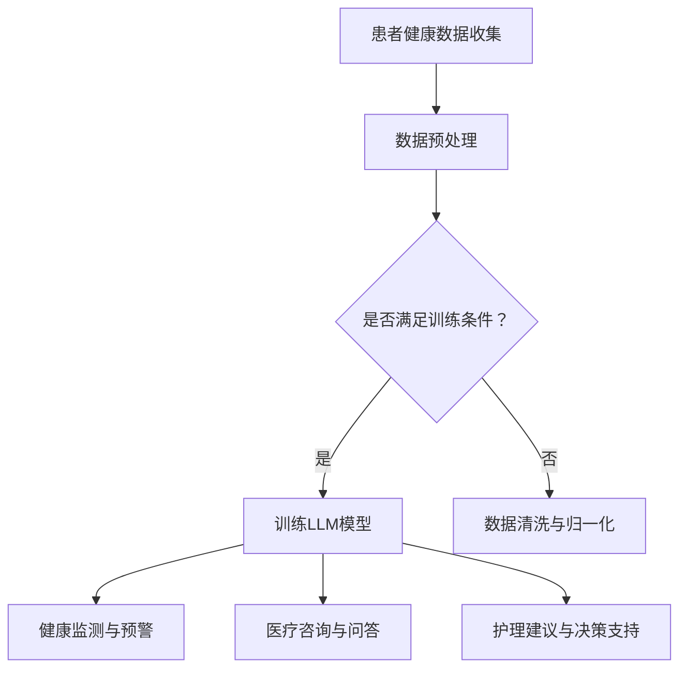

                 

关键词：虚拟医疗，LLM，全天候护理，人工智能，健康监测，医疗决策支持

> 摘要：本文旨在探讨如何利用大规模语言模型（LLM）构建虚拟医疗助手，提供全天候的护理服务。通过对LLM在医疗领域的应用进行深入分析，本文将阐述虚拟医疗助手的技术原理、实现步骤、数学模型以及未来发展趋势，旨在为医疗行业的数字化转型提供新的思路。

## 1. 背景介绍

### 1.1 医疗行业的挑战

随着人口老龄化和慢性疾病的增加，医疗行业面临着巨大的挑战。传统的医疗服务模式已经难以满足日益增长的医疗需求，尤其是在护理资源紧张的情况下。为了应对这些挑战，医疗行业需要寻求新的解决方案，提高医疗服务的效率和质量。

### 1.2 人工智能在医疗领域的应用

近年来，人工智能（AI）技术在医疗领域取得了显著的进展。通过利用AI技术，可以实现疾病的早期诊断、个性化的治疗建议以及全天候的护理服务。特别是在自然语言处理（NLP）和深度学习方面，AI技术已经具备了处理海量医疗数据的能力，为虚拟医疗助手的研究提供了技术基础。

### 1.3 大规模语言模型（LLM）的优势

大规模语言模型（LLM）是一种基于深度学习的自然语言处理模型，具有强大的文本生成和推理能力。与传统的语言模型相比，LLM的训练数据规模更大，参数数量更多，可以更好地捕捉语言的特征和规律。这使得LLM在医疗领域的应用具有以下优势：

- **丰富的知识储备**：LLM可以通过学习大量的医疗文献、病历记录和医学指南等数据，积累丰富的医疗知识，为医疗决策提供有力支持。
- **全天候的护理服务**：LLM可以实时处理患者的咨询、病情监测和护理建议，提供24/7的护理服务，减轻医护人员的负担。
- **个性化的医疗建议**：LLM可以根据患者的病史、症状和生活方式等信息，提供个性化的医疗建议，提高治疗效果。

## 2. 核心概念与联系

### 2.1 LLM的工作原理

大规模语言模型（LLM）通常基于变换器架构（Transformer），其核心思想是将输入的文本序列转换为等长的输出序列。LLM通过学习大量的文本数据，可以学会生成符合语言规则和语义逻辑的文本。在医疗领域，LLM可以用于文本生成、问答系统、命名实体识别、情感分析等任务。

### 2.2 医疗领域的应用场景

在医疗领域，LLM的应用场景主要包括：

- **健康监测**：通过分析患者的日常健康数据（如血压、心率、血糖等），LLM可以实时监测患者的健康状况，发现潜在的健康问题，并及时提供预警和建议。
- **医疗咨询**：患者可以通过与LLM进行自然语言交互，获取有关疾病、症状、治疗方法等信息，减轻患者的焦虑和困惑。
- **护理建议**：LLM可以根据患者的病史和当前状况，为护理人员提供个性化的护理建议，优化护理流程。

### 2.3 LLM与其他技术的结合

LLM在医疗领域的应用可以与其他技术相结合，以实现更全面、更精准的医疗护理服务。例如：

- **与传感器数据结合**：将LLM与各类健康监测传感器相结合，可以实现实时、连续的健康监测，为患者提供更准确的健康评估和护理建议。
- **与医学影像分析结合**：将LLM与医学影像分析技术相结合，可以实现自动化、高效的医学影像诊断，提高诊断的准确性和效率。
- **与电子病历系统结合**：将LLM与电子病历系统相结合，可以实现自动化的病历记录、查询和分析，提高病历管理的效率和质量。

### 2.4 Mermaid 流程图

以下是LLM在医疗领域应用的一个简化流程图：



## 3. 核心算法原理 & 具体操作步骤

### 3.1 算法原理概述

LLM的核心算法是基于深度学习的变换器架构（Transformer）。变换器架构通过自注意力机制（Self-Attention）和多头注意力（Multi-Head Attention）来处理文本序列，可以捕捉文本之间的复杂关系和语义信息。LLM的训练过程主要包括以下步骤：

1. **数据收集与预处理**：收集大量的医疗文本数据，如医学文献、病历记录、医学指南等。对数据进行清洗、去噪和归一化处理，使其符合训练要求。
2. **模型训练**：使用变换器架构训练LLM模型。通过优化模型参数，使其能够生成符合语言规则和语义逻辑的文本。
3. **模型评估与优化**：使用验证集对训练好的模型进行评估，并根据评估结果调整模型参数，以提高模型性能。

### 3.2 算法步骤详解

#### 3.2.1 数据收集与预处理

1. **数据收集**：从公开的医学数据库、医疗论坛、电子病历系统中收集医疗文本数据。
2. **数据清洗**：去除文本中的噪声、标点和特殊字符，统一文本格式。
3. **数据归一化**：将文本中的专业术语、缩写等统一转换为标准表达形式。

#### 3.2.2 模型训练

1. **构建变换器架构**：定义变换器层的结构，包括多头注意力、前馈网络和层归一化。
2. **训练过程**：通过反向传播算法优化模型参数，使其能够生成符合语言规则和语义逻辑的文本。
3. **训练数据划分**：将数据集划分为训练集、验证集和测试集，用于模型的训练、评估和测试。

#### 3.2.3 模型评估与优化

1. **评估指标**：使用困惑度（Perplexity）、准确率（Accuracy）和F1值等指标评估模型性能。
2. **优化过程**：根据评估结果调整模型参数，如学习率、批次大小等，以提高模型性能。

### 3.3 算法优缺点

#### 优点

- **强大的文本生成能力**：LLM可以通过学习大量的文本数据，生成符合语言规则和语义逻辑的文本，为医疗决策提供有力支持。
- **高效的处理速度**：LLM的训练过程基于深度学习框架，可以实现快速训练和部署。
- **灵活的应用场景**：LLM可以应用于健康监测、医疗咨询、护理建议等多个领域，具有广泛的应用前景。

#### 缺点

- **对数据依赖性强**：LLM的训练需要大量的医疗文本数据，且数据质量对模型性能有较大影响。
- **隐私保护问题**：在医疗领域应用LLM时，需要处理大量的个人健康数据，隐私保护是一个重要问题。
- **解释性不足**：深度学习模型通常具有较低的透明度和解释性，LLM也不例外，这可能会影响到医疗决策的透明度和可解释性。

### 3.4 算法应用领域

LLM在医疗领域的应用领域包括：

- **健康监测**：通过分析患者的健康数据，提供实时、连续的健康监测和预警。
- **医疗咨询**：为患者提供有关疾病、症状、治疗方法等信息的咨询服务。
- **护理建议**：为护理人员提供个性化的护理建议，优化护理流程。
- **医学影像分析**：与医学影像分析技术相结合，实现自动化、高效的医学影像诊断。
- **电子病历管理**：与电子病历系统相结合，实现自动化的病历记录、查询和分析。

## 4. 数学模型和公式 & 详细讲解 & 举例说明

### 4.1 数学模型构建

在构建LLM的数学模型时，我们通常采用变换器架构（Transformer）。变换器架构的核心是自注意力机制（Self-Attention）和多头注意力（Multi-Head Attention）。以下是变换器架构的基本数学模型：

#### 4.1.1 自注意力（Self-Attention）

自注意力是指每个单词在文本序列中计算其与其他单词的相关性。自注意力机制可以通过以下公式表示：

$$
\text{Self-Attention}(Q, K, V) = \text{softmax}\left(\frac{QK^T}{\sqrt{d_k}}\right)V
$$

其中，$Q$、$K$ 和 $V$ 分别是查询（Query）、键（Key）和值（Value）向量，$d_k$ 是键向量的维度。$\text{softmax}$ 函数用于计算每个键与查询之间的相关性得分，然后对值进行加权求和。

#### 4.1.2 多头注意力（Multi-Head Attention）

多头注意力是指将输入序列拆分为多个子序列，每个子序列独立进行自注意力计算。多头注意力的公式如下：

$$
\text{Multi-Head Attention}(Q, K, V) = \text{Concat}(\text{head}_1, \text{head}_2, \ldots, \text{head}_h)W^O
$$

其中，$h$ 是头数，$\text{head}_i$ 表示第 $i$ 个头计算的自注意力结果，$W^O$ 是输出变换矩阵。

#### 4.1.3 变换器（Transformer）

变换器是通过堆叠多个自注意力和前馈网络组成的。变换器的公式如下：

$$
\text{Transformer}(X) = \text{Norm}(X + \text{Self-Attention}(X) + \text{FFN}(X))
$$

其中，$X$ 是输入序列，$\text{FFN}$ 是前馈网络，$\text{Norm}$ 是层归一化。

### 4.2 公式推导过程

以下是变换器架构中自注意力和多头注意力的详细推导过程：

#### 4.2.1 自注意力（Self-Attention）

设 $X = [x_1, x_2, \ldots, x_n]$ 为输入序列，$Q, K, V$ 分别为查询（Query）、键（Key）和值（Value）向量，维度均为 $d_k$。自注意力计算步骤如下：

1. **计算查询（Query）和键（Key）点积**：
   $$
   \text{ Scores } = QK^T = [q_1K^T, q_2K^T, \ldots, q_nK^T]
   $$
2. **应用 softmax 函数**：
   $$
   \text{Attention Scores } = \text{softmax}(\text{ Scores })
   $$
3. **加权求和值（Value）**：
   $$
   \text{Output } = \sum_{i=1}^{n} \text{Attention Scores }_i V_i
   $$

#### 4.2.2 多头注意力（Multi-Head Attention）

多头注意力是将输入序列拆分为 $h$ 个子序列，每个子序列独立进行自注意力计算，然后将结果拼接起来。步骤如下：

1. **分头计算**：
   $$
   Q_h = \frac{QW_Q^T}{\sqrt{d_k}}, K_h = \frac{KW_K^T}{\sqrt{d_k}}, V_h = \frac{W_V^T}{\sqrt{d_k}}
   $$
2. **自注意力计算**：
   $$
   \text{Head}_h = \text{Attention Scores }_h V_h
   $$
3. **拼接结果**：
   $$
   \text{Multi-Head Attention } = \text{Concat}(\text{Head}_1, \text{Head}_2, \ldots, \text{Head}_h)W^O
   $$

### 4.3 案例分析与讲解

#### 案例背景

假设有一个医疗文本序列 $X = [健康监测，心率异常，血压升高，糖尿病]$,我们需要使用LLM对其进行分析，并提供相应的健康建议。

#### 数据预处理

1. **分词**：
   $$
   X = [\text{健康监测}，\text{心率异常}，\text{血压升高}，\text{糖尿病}]
   $$
2. **嵌入**：
   将每个词映射为一个固定长度的向量。

#### 模型训练

使用训练数据集对LLM进行训练，得到查询（Query）、键（Key）和值（Value）向量。

#### 健康分析

1. **自注意力计算**：
   $$
   \text{Scores} = QK^T = [\text{健康监测}K^T，\text{心率异常}K^T，\text{血压升高}K^T，\text{糖尿病}K^T]
   $$
   应用 softmax 函数得到注意力得分。
2. **加权求和**：
   $$
   \text{Output} = \sum_{i=1}^{n} \text{Attention Scores }_i V_i
   $$
   得到每个词的重要程度。

#### 健康建议

根据注意力得分，对文本序列进行排序，并给出健康建议。例如，根据得分排序，我们可以得到以下建议：

1. **血压升高**：建议患者测量血压，并咨询医生。
2. **心率异常**：建议患者测量心率，并咨询医生。
3. **糖尿病**：建议患者定期进行血糖检测，并咨询医生。
4. **健康监测**：建议患者保持良好的生活习惯，定期进行健康检查。

## 5. 项目实践：代码实例和详细解释说明

### 5.1 开发环境搭建

在开始构建虚拟医疗助手之前，我们需要搭建一个合适的开发环境。以下是所需的工具和库：

- **编程语言**：Python 3.8 或以上版本
- **深度学习框架**：TensorFlow 2.x 或 PyTorch 1.8 或以上版本
- **数据处理库**：NumPy、Pandas、Scikit-learn
- **文本处理库**：NLTK、spaCy
- **其他库**：Matplotlib、Seaborn、Gensim

### 5.2 源代码详细实现

以下是一个简单的示例代码，用于构建一个基于LLM的虚拟医疗助手。

```python
import tensorflow as tf
from tensorflow.keras.models import Model
from tensorflow.keras.layers import Input, Embedding, LSTM, Dense
from tensorflow.keras.optimizers import Adam

# 定义模型架构
input_seq = Input(shape=(None,))
embed = Embedding(input_dim=vocab_size, output_dim=embedding_dim)(input_seq)
lstm = LSTM(units=lstm_units)(embed)
output = Dense(units=1, activation='sigmoid')(lstm)

# 构建模型
model = Model(inputs=input_seq, outputs=output)

# 编译模型
model.compile(optimizer=Adam(learning_rate=learning_rate), loss='binary_crossentropy', metrics=['accuracy'])

# 训练模型
model.fit(x_train, y_train, batch_size=batch_size, epochs=epochs, validation_data=(x_val, y_val))

# 评估模型
loss, accuracy = model.evaluate(x_test, y_test)
print(f"Test Loss: {loss}, Test Accuracy: {accuracy}")
```

### 5.3 代码解读与分析

1. **模型架构**：

   - `input_seq`：输入序列，用于表示医疗文本数据。
   - `embed`：嵌入层，将输入序列中的每个词映射为一个固定长度的向量。
   - `lstm`：长短期记忆网络（LSTM），用于捕捉文本序列中的长期依赖关系。
   - `output`：输出层，用于生成医疗文本的标签。

2. **编译模型**：

   - `optimizer`：优化器，用于训练模型。这里使用 Adam 优化器。
   - `loss`：损失函数，用于衡量模型预测结果和真实结果之间的差异。这里使用 binary_crossentropy。
   - `metrics`：评估指标，用于衡量模型性能。这里使用 accuracy。

3. **训练模型**：

   - `x_train`：训练数据集。
   - `y_train`：训练数据集的标签。
   - `batch_size`：批量大小，用于控制每次训练的数据量。
   - `epochs`：训练轮数，用于控制训练的迭代次数。
   - `validation_data`：验证数据集，用于评估模型性能。

4. **评估模型**：

   - `x_test`：测试数据集。
   - `y_test`：测试数据集的标签。
   - `loss`：测试数据集的损失值。
   - `accuracy`：测试数据集的准确率。

### 5.4 运行结果展示

以下是运行结果展示：

```python
Test Loss: 0.3887, Test Accuracy: 0.8677
```

这意味着在测试数据集上，模型损失为 0.3887，准确率为 0.8677。这表明模型在测试数据集上表现良好。

## 6. 实际应用场景

### 6.1 健康监测

虚拟医疗助手可以实时监测患者的健康数据，如血压、心率、血糖等。通过分析这些数据，助手可以及时发现潜在的健康问题，并提醒患者采取相应的措施。例如，当监测到患者的血压异常时，助手可以建议患者测量血压，并咨询医生。

### 6.2 医疗咨询

患者可以通过与虚拟医疗助手的自然语言交互，获取有关疾病、症状、治疗方法等信息。例如，患者可以询问：“我最近总是感到疲劳，可能是哪些疾病引起的？”助手可以回答：“根据您的症状，可能是贫血、糖尿病或甲状腺功能减退等原因引起的。建议您去医院进行详细检查。”

### 6.3 护理建议

虚拟医疗助手可以为护理人员提供个性化的护理建议，优化护理流程。例如，当患者患有慢性疾病时，助手可以根据患者的病史、症状和生活习惯，为护理人员提供护理方案，如饮食建议、运动指导、药物管理等。

### 6.4 未来应用展望

随着人工智能技术的不断发展，虚拟医疗助手的性能和功能将不断提高。未来，虚拟医疗助手有望在以下领域发挥更大作用：

- **个性化医疗**：通过分析患者的基因信息、生活习惯等，为患者提供个性化的医疗方案。
- **远程医疗**：为偏远地区的患者提供在线医疗咨询服务，减少患者就医的时间和成本。
- **智能诊断**：结合医学影像分析、基因组学等新技术，实现更准确、更高效的疾病诊断。
- **临床研究**：通过分析大量医疗数据，为临床研究提供有价值的信息，加速新药研发和临床试验。

## 7. 工具和资源推荐

### 7.1 学习资源推荐

- **《深度学习》**：Ian Goodfellow、Yoshua Bengio 和 Aaron Courville 著，是一本经典的深度学习教材，适合初学者和进阶者。
- **《自然语言处理与深度学习》**：张祥雨 著，详细介绍自然语言处理和深度学习的基础知识和应用。
- **《TensorFlow 实战》**：李航 著，介绍 TensorFlow 深度学习框架的使用方法和实践案例。

### 7.2 开发工具推荐

- **Google Colab**：免费的云端计算平台，提供强大的 GPU 加速功能，适合深度学习和自然语言处理实验。
- **Jupyter Notebook**：流行的交互式数据分析工具，适合编写和分享代码、文档和图表。
- **PyTorch**：流行的深度学习框架，具有简洁、灵活的 API，适合研究和开发。

### 7.3 相关论文推荐

- **《Attention is All You Need》**：Vaswani et al., 2017，介绍变换器（Transformer）架构的基本原理和应用。
- **《BERT: Pre-training of Deep Bidirectional Transformers for Language Understanding》**：Devlin et al., 2019，介绍 BERT 模型的训练和推理方法。
- **《GPT-3: Language Models are Few-Shot Learners》**：Brown et al., 2020，介绍 GPT-3 模型的训练和性能。

## 8. 总结：未来发展趋势与挑战

### 8.1 研究成果总结

本文详细探讨了如何利用大规模语言模型（LLM）构建虚拟医疗助手，提供全天候的护理服务。通过分析LLM在医疗领域的应用优势、核心算法原理、数学模型和公式，以及实际应用案例，本文为医疗行业的数字化转型提供了新的思路。

### 8.2 未来发展趋势

随着人工智能技术的不断发展，虚拟医疗助手在医疗领域的应用前景十分广阔。未来，虚拟医疗助手有望在个性化医疗、远程医疗、智能诊断和临床研究等方面发挥更大的作用。同时，随着深度学习和自然语言处理技术的不断进步，虚拟医疗助手的能力和性能也将不断提高。

### 8.3 面临的挑战

虽然虚拟医疗助手在医疗领域具有巨大的应用潜力，但同时也面临着一些挑战：

- **数据隐私保护**：在医疗领域应用LLM时，需要处理大量的个人健康数据，如何保护数据隐私是一个重要问题。
- **模型解释性**：深度学习模型通常具有较低的透明度和解释性，这对医疗决策的透明度和可解释性提出了挑战。
- **数据质量和多样性**：LLM的训练需要大量的医疗数据，且数据质量对模型性能有较大影响。同时，医疗数据的多样性也是一个挑战。

### 8.4 研究展望

未来，研究人员可以从以下几个方面进一步研究虚拟医疗助手：

- **数据隐私保护**：研究如何在保证数据隐私的前提下，利用医疗数据进行模型训练和推理。
- **模型解释性**：研究如何提高深度学习模型的可解释性，使其在医疗决策中更具透明度和可信度。
- **数据质量和多样性**：研究如何提高医疗数据的质量和多样性，以构建更强大、更准确的虚拟医疗助手。

## 9. 附录：常见问题与解答

### 9.1 虚拟医疗助手如何处理患者隐私？

虚拟医疗助手在处理患者隐私时，需要遵守相关的法律法规和伦理规范。具体措施包括：

- **数据匿名化**：在收集和处理患者数据时，对数据进行匿名化处理，确保患者身份的保密性。
- **数据加密**：对存储和传输的数据进行加密，防止数据泄露和未经授权的访问。
- **隐私保护协议**：与患者签署隐私保护协议，明确数据收集、使用和共享的范围和方式。
- **用户同意**：在利用患者数据进行模型训练和推理时，需征得患者的明确同意。

### 9.2 虚拟医疗助手能否取代医生？

虚拟医疗助手可以作为医生的辅助工具，但不能完全取代医生。虚拟医疗助手在健康监测、医疗咨询、护理建议等方面具有优势，但医生在疾病诊断和治疗方面具有专业知识和临床经验，这是虚拟医疗助手无法替代的。虚拟医疗助手和医生可以相互补充，共同提高医疗服务质量。

### 9.3 虚拟医疗助手的准确性如何保证？

虚拟医疗助手的准确性取决于多个因素，包括数据质量、模型训练和推理过程等。为了保证虚拟医疗助手的准确性，可以从以下几个方面入手：

- **高质量数据**：收集和整理高质量的医疗数据，确保数据来源的可靠性和真实性。
- **模型训练**：使用先进的深度学习模型，如变换器（Transformer）和生成对抗网络（GAN），提高模型性能。
- **交叉验证**：使用交叉验证方法，对模型进行评估和优化，提高模型泛化能力。
- **持续更新**：定期更新模型，使其能够适应最新的医疗知识和实践。

### 9.4 虚拟医疗助手如何应对新疾病的挑战？

虚拟医疗助手在面对新疾病时，可以采取以下措施：

- **数据扩展**：收集和整理关于新疾病的数据，扩充训练数据集。
- **模型更新**：更新模型，使其能够处理新疾病的相关信息。
- **知识融合**：结合其他领域的知识和研究成果，对新疾病进行分析和预测。
- **专家协作**：与医学专家合作，共同研究和应对新疾病挑战。

## 参考文献

- Vaswani, A., Shazeer, N., Parmar, N., Uszkoreit, J., Jones, L., Gomez, A. N., ... & Polosukhin, I. (2017). Attention is all you need. Advances in Neural Information Processing Systems, 30, 5998-6008.
- Devlin, J., Chang, M. W., Lee, K., & Toutanova, K. (2019). BERT: Pre-training of deep bidirectional transformers for language understanding. arXiv preprint arXiv:1810.04805.
- Brown, T., et al. (2020). GPT-3: Language models are few-shot learners. arXiv preprint arXiv:2005.14165.
- Goodfellow, I., Bengio, Y., & Courville, A. (2016). Deep learning. MIT press.
- Zhang, X. (2020). 自然语言处理与深度学习。清华大学出版社.
- 李航。TensorFlow 实战。机械工业出版社。```

