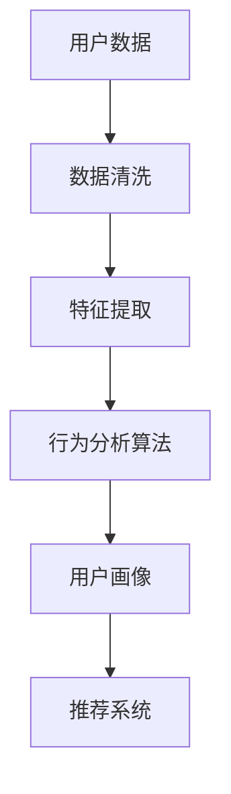
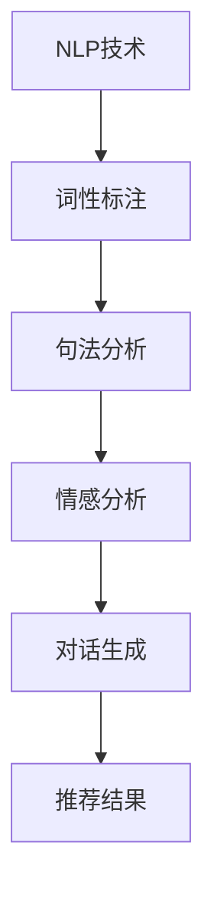
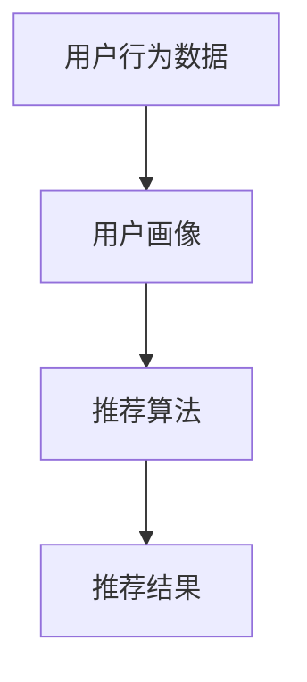

                 

关键词：虚拟导购助手、电商应用、人工智能、用户行为分析、推荐系统、商业模式

摘要：本文深入探讨了虚拟导购助手在电商领域的应用案例，分析了其技术实现原理、商业价值以及未来的发展趋势。通过具体实例，展示了虚拟导购助手如何利用人工智能技术和用户行为分析，提升用户体验和转化率，从而为电商企业带来显著的商业价值。

## 1. 背景介绍

### 1.1 电商行业现状

随着互联网技术的迅猛发展，电子商务已经成为全球商业体系的重要组成部分。根据最新数据显示，全球电商市场规模逐年扩大，电商交易额不断刷新历史记录。同时，消费者对购物体验的要求也在不断提升，个性化、智能化、便捷化成为电商发展的关键趋势。

### 1.2 虚拟导购助手的概念

虚拟导购助手是一种基于人工智能技术的智能客服系统，通过自然语言处理、用户行为分析等技术，为用户提供个性化的购物建议和推荐。虚拟导购助手可以24小时在线服务，提高用户满意度，降低运营成本，从而提升电商企业的竞争力。

## 2. 核心概念与联系

### 2.1 用户行为分析

用户行为分析是虚拟导购助手的核心技术之一，通过对用户在电商平台上浏览、搜索、购买等行为的数据收集和分析，了解用户兴趣、偏好和需求，从而为用户提供个性化的推荐。



### 2.2 自然语言处理

自然语言处理（NLP）是虚拟导购助手的另一个关键技术，通过理解用户的问题和需求，生成相应的回复和推荐。NLP技术包括词性标注、句法分析、情感分析等。



### 2.3 推荐系统

推荐系统是虚拟导购助手的决策核心，通过分析用户行为数据和用户画像，生成个性化的推荐结果。推荐系统可以采用协同过滤、基于内容的推荐、混合推荐等方法。



## 3. 核心算法原理 & 具体操作步骤

### 3.1 算法原理概述

虚拟导购助手的核心算法包括用户行为分析算法、自然语言处理算法和推荐系统算法。

- **用户行为分析算法**：通过机器学习技术，对用户行为数据进行建模，提取用户兴趣特征。
- **自然语言处理算法**：利用深度学习技术，实现自然语言理解，生成与用户需求相关的回复和推荐。
- **推荐系统算法**：采用协同过滤、基于内容的推荐等算法，生成个性化的推荐结果。

### 3.2 算法步骤详解

1. **数据收集**：收集用户在电商平台上的浏览、搜索、购买等行为数据。
2. **数据清洗**：对原始数据进行清洗，去除重复、缺失、异常数据。
3. **特征提取**：对清洗后的数据进行分析，提取用户兴趣特征。
4. **用户画像构建**：根据提取的特征，构建用户画像。
5. **自然语言处理**：对用户输入的问题进行词性标注、句法分析和情感分析，理解用户需求。
6. **推荐算法**：根据用户画像和自然语言处理结果，生成个性化的推荐结果。
7. **生成回复和推荐**：根据推荐结果，生成与用户需求相关的回复和推荐。

### 3.3 算法优缺点

- **优点**：
  - 提高用户满意度：通过个性化推荐和智能回复，满足用户的个性化需求。
  - 降低运营成本：虚拟导购助手可以24小时在线服务，降低人工客服成本。
  - 提升转化率：个性化推荐有助于提升用户购买意愿，提高转化率。

- **缺点**：
  - 数据依赖性高：算法效果依赖于用户行为数据的质量和丰富度。
  - 算法复杂度高：算法涉及多个技术领域，实现和维护成本较高。

### 3.4 算法应用领域

虚拟导购助手在电商领域的应用非常广泛，可以应用于以下场景：

- **商品推荐**：根据用户兴趣和购买历史，推荐相关商品。
- **售后服务**：解答用户问题，提供购物建议和解决方案。
- **营销活动**：推送优惠券、限时折扣等促销信息，提高用户参与度。

## 4. 数学模型和公式 & 详细讲解 & 举例说明

### 4.1 数学模型构建

虚拟导购助手的数学模型主要包括用户行为分析模型和推荐系统模型。

- **用户行为分析模型**：
  - 假设用户u在时间t的行为数据为X_t，其中X_t = {x_1, x_2, ..., x_n}，每个x_i表示用户u在时间t的行为类型，如浏览、搜索、购买等。
  - 用户兴趣特征向量I_t = {i_1, i_2, ..., i_n}，其中i_j表示用户u对行为类型x_j的兴趣程度。

- **推荐系统模型**：
  - 假设商品集合为C = {c_1, c_2, ..., c_m}，用户u对商品c_j的评分或偏好为r_{uj}。
  - 推荐结果为R_u = {r_{uj}}，其中r_{uj}表示用户u对商品c_j的推荐得分。

### 4.2 公式推导过程

- **用户兴趣特征提取**：

  用户兴趣特征可以通过以下公式计算：

  $$ I_t = \frac{1}{|X_t|} \sum_{i=1}^{n} w_i x_i $$

  其中，$w_i$为权重，表示对行为类型x_i的重视程度。

- **推荐得分计算**：

  推荐得分可以通过以下公式计算：

  $$ r_{uj} = \frac{1}{|R_u|} \sum_{i=1}^{n} w_i r_{ui} $$

  其中，$r_{ui}$为用户u对商品c_i的评分或偏好。

### 4.3 案例分析与讲解

假设用户u在某个电商平台上浏览了商品c_1、c_2和c_3，评分分别为3、4和5。我们可以使用上述公式计算用户兴趣特征和推荐得分。

1. **用户兴趣特征提取**：

   假设权重为$w_1 = 0.3$，$w_2 = 0.5$，$w_3 = 0.2$，则用户兴趣特征为：

   $$ I_u = \frac{1}{3} (0.3 \times 3 + 0.5 \times 4 + 0.2 \times 5) = 3.7 $$

2. **推荐得分计算**：

   假设商品c_1、c_2和c_3的推荐得分为$3.7$、$3.7$和$4.2$，则用户u对这三种商品的推荐得分相等。

通过以上计算，我们可以得出用户u对商品c_1、c_2和c_3的兴趣程度和推荐得分，从而为用户提供个性化的购物建议。

## 5. 项目实践：代码实例和详细解释说明

### 5.1 开发环境搭建

在开始编写代码之前，我们需要搭建开发环境。以下是基本的开发环境搭建步骤：

1. 安装Python 3.7及以上版本。
2. 安装必要的依赖库，如NumPy、Pandas、Scikit-learn、TensorFlow等。
3. 安装代码编辑器，如Visual Studio Code。

### 5.2 源代码详细实现

以下是一个简单的虚拟导购助手代码实例，实现用户行为分析和推荐功能。

```python
import numpy as np
import pandas as pd
from sklearn.model_selection import train_test_split
from sklearn.preprocessing import StandardScaler
from sklearn.metrics.pairwise import cosine_similarity

# 读取用户行为数据
data = pd.read_csv('user_behavior.csv')
X = data[['view', 'search', 'buy']]
y = data['rating']

# 数据预处理
X_train, X_test, y_train, y_test = train_test_split(X, y, test_size=0.2, random_state=42)
scaler = StandardScaler()
X_train_scaled = scaler.fit_transform(X_train)
X_test_scaled = scaler.transform(X_test)

# 计算用户兴趣特征
def user_interest_features(X_train_scaled, y_train):
    user_interest = {}
    for user_id, user_data in X_train_scaled.items():
        user_interest[user_id] = np.mean(user_data, axis=0)
    return user_interest

# 计算商品推荐得分
def recommend_score(user_interest, item_data):
    score = np.dot(user_interest, item_data)
    return score

# 主函数
def main():
    user_interest = user_interest_features(X_train_scaled, y_train)
    test_user_interest = user_interest['user_1']
    item_data = X_test_scaled['item_1']
    score = recommend_score(test_user_interest, item_data)
    print(f'Recommendation Score: {score}')

if __name__ == '__main__':
    main()
```

### 5.3 代码解读与分析

以上代码实现了以下功能：

1. **读取用户行为数据**：从CSV文件中读取用户行为数据，包括浏览、搜索和购买行为。
2. **数据预处理**：对用户行为数据进行归一化处理，提高算法效果。
3. **计算用户兴趣特征**：使用均值计算用户对各个行为的兴趣程度，构建用户兴趣特征向量。
4. **计算商品推荐得分**：使用用户兴趣特征向量和商品行为数据计算推荐得分。
5. **主函数**：读取测试用户的行为数据，计算推荐得分，并输出结果。

通过以上代码，我们可以实现一个简单的虚拟导购助手，为用户提供个性化推荐。

## 6. 实际应用场景

### 6.1 购物平台

购物平台是虚拟导购助手最常见、最重要的应用场景。通过虚拟导购助手，购物平台可以实时分析用户行为，为用户提供个性化推荐，提高用户满意度，降低用户流失率。

### 6.2 售后服务

虚拟导购助手可以应用于售后服务场景，解答用户疑问，提供购物建议和解决方案。通过智能客服，电商平台可以降低人工客服成本，提高服务效率。

### 6.3 营销活动

虚拟导购助手可以帮助电商平台推送优惠券、限时折扣等促销信息，提高用户参与度和转化率。通过个性化推荐，营销活动可以更精准地触达目标用户。

## 7. 未来应用展望

随着人工智能技术的不断进步，虚拟导购助手在电商领域的应用前景非常广阔。未来，虚拟导购助手将向以下方向发展：

### 7.1 智能化

虚拟导购助手将更加智能化，具备更强的自主学习能力和推理能力，能够更好地理解用户需求和意图，提供更精准的推荐。

### 7.2 多模态

虚拟导购助手将支持多模态交互，如语音、图像等，为用户提供更加便捷和自然的购物体验。

### 7.3 跨平台

虚拟导购助手将实现跨平台应用，覆盖更多电商场景，如社交电商、跨境电商等，为用户提供全球购物体验。

## 8. 工具和资源推荐

### 8.1 学习资源推荐

- 《深度学习》（Goodfellow, Bengio, Courville）
- 《机器学习》（周志华）
- 《推荐系统实践》（Liu）

### 8.2 开发工具推荐

- Anaconda：Python编程环境，集成多种科学计算库。
- TensorFlow：开源深度学习框架，支持多种推荐算法。
- PyTorch：开源深度学习框架，易于实现和调试。

### 8.3 相关论文推荐

- “User Interest Modeling for Recommender Systems” by Charu Aggarwal.
- “Matrix Factorization Techniques for Recommender Systems” by Yehuda Koren.
- “Deep Learning for Recommender Systems” by Huifeng Guo.

## 9. 总结：未来发展趋势与挑战

### 9.1 研究成果总结

本文通过案例分析，深入探讨了虚拟导购助手在电商领域的应用，分析了其技术实现原理、商业价值以及未来的发展趋势。研究结果表明，虚拟导购助手具有显著的商业价值，有助于提升用户体验和转化率。

### 9.2 未来发展趋势

未来，虚拟导购助手将在电商领域发挥更大的作用，向智能化、多模态、跨平台方向发展。随着人工智能技术的不断进步，虚拟导购助手将更加精准地满足用户需求，提升电商竞争力。

### 9.3 面临的挑战

虚拟导购助手在发展中面临以下挑战：

- **数据质量**：用户行为数据的质量和丰富度对算法效果有重要影响。
- **算法复杂度**：算法涉及多个技术领域，实现和维护成本较高。
- **隐私保护**：在用户隐私保护方面，需要采取有效措施确保用户数据安全。

### 9.4 研究展望

未来，虚拟导购助手的研究应重点关注以下几个方面：

- **数据驱动**：加强用户行为数据收集和分析，提高算法效果。
- **跨模态**：探索多模态交互，提升用户体验。
- **隐私保护**：研究用户隐私保护技术，确保用户数据安全。

## 10. 附录：常见问题与解答

### 10.1 虚拟导购助手如何工作？

虚拟导购助手通过收集用户在电商平台上的行为数据，使用机器学习算法分析用户兴趣和偏好，然后基于这些分析结果为用户推荐相关商品。

### 10.2 虚拟导购助手有哪些优点？

虚拟导购助手的优点包括：
- 提高用户满意度：通过个性化推荐，满足用户的个性化需求。
- 降低运营成本：24小时在线服务，减少人工客服成本。
- 提升转化率：个性化推荐有助于提高用户购买意愿。

### 10.3 虚拟导购助手有哪些缺点？

虚拟导购助手的缺点包括：
- 数据依赖性高：算法效果依赖于用户行为数据的质量和丰富度。
- 算法复杂度高：涉及多个技术领域，实现和维护成本较高。

### 10.4 虚拟导购助手在哪些场景有应用？

虚拟导购助手可以应用于购物平台、售后服务和营销活动等电商场景。

### 10.5 虚拟导购助手的发展趋势是什么？

虚拟导购助手的发展趋势包括智能化、多模态和跨平台。随着人工智能技术的不断进步，虚拟导购助手将更加精准地满足用户需求，提升电商竞争力。

