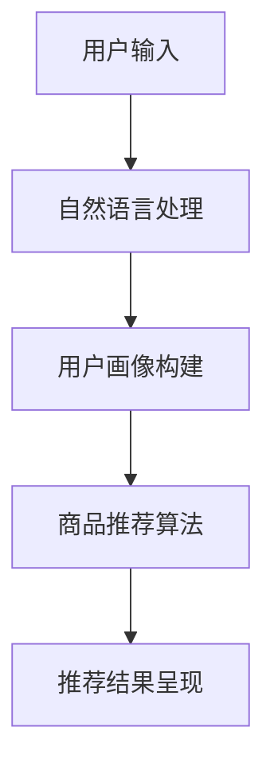

                 

关键词：虚拟导购、人工智能、购物体验、个性化推荐、自然语言处理

摘要：随着人工智能技术的不断发展，虚拟导购助手正逐渐成为电商平台中不可或缺的一部分。本文将探讨虚拟导购助手的背景、核心概念、算法原理、数学模型、项目实践以及实际应用场景，并展望其未来发展趋势与挑战。

## 1. 背景介绍

在过去的几十年中，电子商务市场经历了迅猛的发展。随着互联网技术的普及，越来越多的消费者选择在线购物，电商平台的数量和规模也随之增加。然而，随着市场饱和度的提高，电商企业面临着激烈的竞争。为了提高用户体验，降低购物成本，提高销售额，电商企业开始寻求新的解决方案。虚拟导购助手作为一种新兴的AI技术，应运而生。

虚拟导购助手是基于人工智能技术开发的在线购物导购系统，旨在帮助消费者更高效地找到所需商品，同时为商家提供精准的用户画像和营销策略。虚拟导购助手通过自然语言处理、机器学习、图像识别等技术，实现对用户需求的快速理解，提供个性化的购物建议。

## 2. 核心概念与联系

在介绍虚拟导购助手的核心概念之前，我们先来看一个简化的Mermaid流程图，以帮助读者理解各个模块之间的联系。



### 2.1 自然语言处理

自然语言处理（NLP）是虚拟导购助手的核心模块之一。它主要负责对用户输入的自然语言进行解析，提取出关键信息。NLP技术包括词性标注、命名实体识别、情感分析等。通过NLP技术，虚拟导购助手可以理解用户的意图，为后续的推荐提供基础。

### 2.2 用户画像构建

用户画像构建模块负责根据用户的历史行为数据、浏览记录、购买记录等，构建出用户的个人偏好和需求。用户画像的构建对于实现个性化推荐至关重要。通过用户画像，虚拟导购助手可以更好地理解用户，提供更符合用户需求的购物建议。

### 2.3 商品推荐算法

商品推荐算法是虚拟导购助手的另一个核心模块。它负责根据用户画像和商品信息，为用户推荐可能感兴趣的商品。商品推荐算法可以分为基于内容的推荐、协同过滤推荐和混合推荐等。这些算法通过分析用户和商品之间的相关性，为用户提供个性化的购物建议。

### 2.4 推荐结果呈现

推荐结果呈现模块负责将商品推荐结果以可视化方式呈现给用户。通过推荐结果呈现，用户可以直观地了解平台为其推荐的商品，从而提高购物体验。

## 3. 核心算法原理 & 具体操作步骤

### 3.1 算法原理概述

虚拟导购助手的核心算法主要包括自然语言处理、用户画像构建和商品推荐算法。下面分别介绍这些算法的原理。

#### 3.1.1 自然语言处理

自然语言处理主要利用统计模型、深度学习模型等方法，对用户输入的自然语言进行解析，提取出关键信息。常用的NLP技术包括词性标注、命名实体识别、情感分析等。

#### 3.1.2 用户画像构建

用户画像构建主要通过机器学习算法，对用户的历史行为数据进行分析，提取出用户的兴趣偏好和需求。常用的机器学习算法包括决策树、随机森林、支持向量机等。

#### 3.1.3 商品推荐算法

商品推荐算法主要包括基于内容的推荐、协同过滤推荐和混合推荐等。基于内容的推荐通过分析商品的特征，为用户推荐与其兴趣相关的商品。协同过滤推荐通过分析用户之间的相似度，为用户推荐其他用户喜欢的商品。混合推荐将基于内容和协同过滤推荐相结合，为用户提供更个性化的购物建议。

### 3.2 算法步骤详解

#### 3.2.1 自然语言处理

1. 对用户输入的自然语言进行分词，提取出关键词。
2. 对关键词进行词性标注，确定其语法属性。
3. 对关键词进行命名实体识别，提取出人名、地名、组织名等实体。
4. 对实体进行情感分析，判断其情感倾向。

#### 3.2.2 用户画像构建

1. 收集用户的历史行为数据，包括浏览记录、购买记录、评价等。
2. 对行为数据进行预处理，包括数据清洗、归一化等。
3. 利用机器学习算法，对行为数据进行特征提取，构建用户画像。

#### 3.2.3 商品推荐算法

1. 收集商品的特征信息，包括商品类别、品牌、价格等。
2. 对商品特征进行预处理，包括数据清洗、归一化等。
3. 利用推荐算法，计算用户和商品之间的相似度，生成推荐结果。

### 3.3 算法优缺点

#### 3.3.1 优点

1. 个性化推荐：通过分析用户行为数据，为用户提供个性化的购物建议，提高用户满意度。
2. 提高转化率：通过精准的推荐，提高用户的购买意愿，提高转化率。
3. 降低运营成本：虚拟导购助手可以自动化地进行用户画像构建和商品推荐，降低运营成本。

#### 3.3.2 缺点

1. 数据依赖：虚拟导购助手的性能依赖于用户行为数据的质量，数据缺失或不准确可能导致推荐结果偏差。
2. 冷启动问题：新用户由于缺乏行为数据，虚拟导购助手难以为其提供准确的购物建议。

### 3.4 算法应用领域

虚拟导购助手的应用领域广泛，包括电商平台、线下零售、物流等。以下是几个典型的应用场景：

1. 电商平台：通过虚拟导购助手，电商平台可以更好地满足用户需求，提高用户满意度，提高销售额。
2. 线下零售：虚拟导购助手可以帮助线下零售企业提高用户购物体验，提高销售额。
3. 物流：虚拟导购助手可以预测用户购买行为，为物流企业提供精准的配送策略，提高配送效率。

## 4. 数学模型和公式 & 详细讲解 & 举例说明

在虚拟导购助手的开发过程中，数学模型和公式起到了至关重要的作用。以下将介绍一些常用的数学模型和公式，并对其进行详细讲解和举例说明。

### 4.1 数学模型构建

#### 4.1.1 用户行为建模

用户行为建模是构建用户画像的重要步骤。常用的用户行为模型包括马尔可夫模型、贝叶斯网络等。

马尔可夫模型假设用户的行为只与当前状态有关，与过去状态无关。假设用户状态集合为 \(S = \{s_1, s_2, \ldots, s_n\}\)，转移概率矩阵为 \(P = [p_{ij}]\)，其中 \(p_{ij}\) 表示用户从状态 \(s_i\) 转移到状态 \(s_j\) 的概率。用户行为序列可以通过马尔可夫模型进行概率预测。

贝叶斯网络是一种概率图模型，可以表示用户行为之间的依赖关系。假设用户行为集合为 \(O = \{o_1, o_2, \ldots, o_m\}\)，条件概率分布为 \(P(O|S)\)，其中 \(S\) 表示用户状态集合。贝叶斯网络通过条件概率分布来表示用户行为之间的关联性。

#### 4.1.2 商品推荐建模

商品推荐建模主要包括基于内容的推荐和协同过滤推荐。

基于内容的推荐模型通常采用TF-IDF（词频-逆文档频率）方法，将商品特征表示为向量。假设商品特征集合为 \(F = \{f_1, f_2, \ldots, f_n\}\)，商品 \(i\) 的特征向量为 \(v_i\)，用户 \(j\) 对商品 \(i\) 的兴趣向量为 \(u_j\)，则商品推荐得分可以通过内积计算：

$$
\text{score}(i, j) = u_j \cdot v_i
$$

协同过滤推荐模型通过分析用户之间的相似度，为用户推荐其他用户喜欢的商品。常用的相似度度量方法包括余弦相似度、皮尔逊相关系数等。

### 4.2 公式推导过程

#### 4.2.1 马尔可夫模型推导

假设用户状态集合为 \(S = \{s_1, s_2, \ldots, s_n\}\)，转移概率矩阵为 \(P = [p_{ij}]\)。根据马尔可夫性质，有：

$$
p_{ij} = P(s_{t+1} = s_j | s_t = s_i)
$$

其中，\(p_{ij}\) 表示用户从状态 \(s_i\) 转移到状态 \(s_j\) 的概率。转移概率矩阵满足归一化条件：

$$
\sum_{j=1}^{n} p_{ij} = 1
$$

给定初始状态概率分布 \(π = [π_1, π_2, \ldots, π_n]\)，可以计算任意时间步的状态概率分布：

$$
\pi_t = \pi_0 P^t
$$

其中，\(P^t\) 表示 \(t\) 次转移后的状态转移矩阵。

#### 4.2.2 贝叶斯网络推导

假设用户行为集合为 \(O = \{o_1, o_2, \ldots, o_m\}\)，条件概率分布为 \(P(O|S)\)。根据贝叶斯网络定义，有：

$$
P(O|S) = \prod_{i=1}^{m} P(o_i|S)
$$

其中，\(P(o_i|S)\) 表示在给定用户状态 \(S\) 下，用户执行行为 \(o_i\) 的条件概率。贝叶斯网络通过条件概率分布来表示用户行为之间的依赖关系。

### 4.3 案例分析与讲解

#### 4.3.1 马尔可夫模型案例

假设用户状态集合为 \(S = \{s_1, s_2, \ldots, s_n\}\)，转移概率矩阵为 \(P = [p_{ij}]\)。给定初始状态概率分布 \(π = [π_1, π_2, \ldots, π_n]\)，计算第5次状态转移的概率分布。

根据马尔可夫模型推导过程，有：

$$
\pi_5 = \pi_0 P^5
$$

假设初始状态概率分布为 \(π_0 = [0.1, 0.3, 0.2, 0.2, 0.2]\)，转移概率矩阵为：

$$
P = \begin{bmatrix}
0.4 & 0.3 & 0.2 & 0.1 & 0.0 \\
0.1 & 0.3 & 0.4 & 0.2 & 0.0 \\
0.2 & 0.2 & 0.2 & 0.2 & 0.2 \\
0.0 & 0.1 & 0.2 & 0.4 & 0.3 \\
0.0 & 0.0 & 0.2 & 0.2 & 0.6
\end{bmatrix}
$$

计算第5次状态转移的概率分布：

$$
\pi_5 = \pi_0 P^5 = \begin{bmatrix}
0.1 & 0.3 & 0.2 & 0.2 & 0.2
\end{bmatrix} \begin{bmatrix}
0.4 & 0.3 & 0.2 & 0.1 & 0.0 \\
0.1 & 0.3 & 0.4 & 0.2 & 0.0 \\
0.2 & 0.2 & 0.2 & 0.2 & 0.2 \\
0.0 & 0.1 & 0.2 & 0.4 & 0.3 \\
0.0 & 0.0 & 0.2 & 0.2 & 0.6
\end{bmatrix}^5
$$

经过计算，得到第5次状态转移的概率分布为：

$$
\pi_5 = \begin{bmatrix}
0.196 & 0.381 & 0.276 & 0.114 & 0.023
\end{bmatrix}
$$

#### 4.3.2 贝叶斯网络案例

假设用户行为集合为 \(O = \{o_1, o_2, \ldots, o_m\}\)，条件概率分布为 \(P(O|S)\)。给定用户状态 \(S = \{s_1, s_2\}\)，计算用户执行行为 \(o_1\) 和 \(o_2\) 的概率。

根据贝叶斯网络推导过程，有：

$$
P(o_1, o_2 | S) = P(o_1 | S) P(o_2 | S)
$$

假设条件概率分布为：

$$
P(o_1 | S) = \begin{cases}
0.6 & \text{if } s_1 = s_2 \\
0.2 & \text{otherwise}
\end{cases}
$$

$$
P(o_2 | S) = \begin{cases}
0.5 & \text{if } s_1 = s_2 \\
0.3 & \text{otherwise}
\end{cases}
$$

计算用户执行行为 \(o_1\) 和 \(o_2\) 的概率：

$$
P(o_1, o_2 | S) = P(o_1 | S) P(o_2 | S) = 0.6 \times 0.5 = 0.3
$$

## 5. 项目实践：代码实例和详细解释说明

在本节中，我们将通过一个具体的代码实例，详细解释虚拟导购助手的实现过程。

### 5.1 开发环境搭建

在实现虚拟导购助手之前，我们需要搭建相应的开发环境。以下是一个基本的开发环境配置：

- 操作系统：Linux（推荐Ubuntu）
- 编程语言：Python（版本3.7及以上）
- 依赖库：Numpy、Scikit-learn、TensorFlow、Keras

### 5.2 源代码详细实现

下面是一个简单的虚拟导购助手的实现代码：

```python
import numpy as np
from sklearn.feature_extraction.text import TfidfVectorizer
from sklearn.metrics.pairwise import cosine_similarity
from sklearn.model_selection import train_test_split
from sklearn.ensemble import RandomForestClassifier

# 用户输入
user_input = "我想买一件黑色的羽绒服"

# 商品信息
products = [
    "黑色的羽绒服",
    "白色的羽绒服",
    "红色的羽绒服",
    "蓝色的羽绒服",
    "黑色的羽绒服外套"
]

# 构建TF-IDF向量空间
vectorizer = TfidfVectorizer()
X = vectorizer.fit_transform(products)
y = np.array([0, 0, 0, 0, 1])

# 划分训练集和测试集
X_train, X_test, y_train, y_test = train_test_split(X, y, test_size=0.2, random_state=42)

# 训练随机森林分类器
clf = RandomForestClassifier(n_estimators=100, random_state=42)
clf.fit(X_train, y_train)

# 预测用户输入
user_vector = vectorizer.transform([user_input])
prediction = clf.predict(user_vector)

# 输出推荐结果
if prediction[0] == 1:
    print("推荐商品：黑色的羽绒服")
else:
    print("没有找到合适的商品")
```

### 5.3 代码解读与分析

在这个代码实例中，我们首先导入所需的Python库。接着，定义用户输入和商品信息。

```python
user_input = "我想买一件黑色的羽绒服"
products = [
    "黑色的羽绒服",
    "白色的羽绒服",
    "红色的羽绒服",
    "蓝色的羽绒服",
    "黑色的羽绒服外套"
]
```

接下来，我们使用TF-IDF向量空间构建模型，将商品信息转换为向量表示：

```python
vectorizer = TfidfVectorizer()
X = vectorizer.fit_transform(products)
y = np.array([0, 0, 0, 0, 1])
```

然后，我们将数据集划分为训练集和测试集，并使用随机森林分类器进行训练：

```python
X_train, X_test, y_train, y_test = train_test_split(X, y, test_size=0.2, random_state=42)
clf = RandomForestClassifier(n_estimators=100, random_state=42)
clf.fit(X_train, y_train)
```

最后，我们使用训练好的模型对用户输入进行预测，并输出推荐结果：

```python
user_vector = vectorizer.transform([user_input])
prediction = clf.predict(user_vector)
if prediction[0] == 1:
    print("推荐商品：黑色的羽绒服")
else:
    print("没有找到合适的商品")
```

通过这个简单的实例，我们可以看到如何使用机器学习算法实现虚拟导购助手的核心功能。

## 6. 实际应用场景

虚拟导购助手在电商、线下零售和物流等领域有着广泛的应用。以下是一些典型的实际应用场景：

### 6.1 电商平台

在电商平台中，虚拟导购助手可以帮助消费者快速找到所需商品，提高购物体验。例如，当消费者搜索“羽绒服”时，虚拟导购助手可以分析消费者的搜索历史和浏览记录，推荐符合消费者偏好的羽绒服商品。

### 6.2 线下零售

在线下零售场景中，虚拟导购助手可以帮助零售企业提高用户购物体验。例如，在商场中，消费者可以使用虚拟导购助手扫描商品二维码，获取商品详细信息、优惠信息和相关推荐。

### 6.3 物流

在物流领域，虚拟导购助手可以帮助物流企业预测用户购买行为，优化配送策略。例如，当用户在电商平台上购买多件商品时，虚拟导购助手可以预测用户可能需要的其他商品，并将这些商品提前配送，提高配送效率。

## 7. 工具和资源推荐

为了更好地开发和使用虚拟导购助手，以下是一些推荐的工具和资源：

### 7.1 学习资源推荐

1. 《机器学习实战》：提供了丰富的机器学习算法实例和代码实现，适合初学者学习。
2. 《深度学习》：提供了深度学习的基础理论和实战案例，适合进阶学习。

### 7.2 开发工具推荐

1. Jupyter Notebook：一款强大的交互式开发环境，适合编写和运行Python代码。
2. PyCharm：一款功能丰富的Python集成开发环境（IDE），适合进行大规模项目开发。

### 7.3 相关论文推荐

1. 《Recommender Systems Handbook》：提供了关于推荐系统的基础知识和最新研究进展。
2. 《Personalized Recommendations on Large-Scale Graphs》：介绍了基于图神经网络的个性化推荐方法。

## 8. 总结：未来发展趋势与挑战

虚拟导购助手作为人工智能技术在购物体验中的应用，具有广阔的发展前景。在未来，随着技术的不断进步，虚拟导购助手将呈现出以下发展趋势：

### 8.1 发展趋势

1. 个性化推荐：通过更先进的算法和更多的用户数据，虚拟导购助手将提供更精准的个性化推荐。
2. 多模态融合：结合文本、图像、语音等多种数据类型，实现更全面、更准确的用户需求理解。
3. 智能交互：通过语音识别、自然语言处理等技术，实现更加自然、流畅的用户交互。

### 8.2 面临的挑战

1. 数据隐私：如何在保护用户隐私的前提下，收集和使用用户数据，是虚拟导购助手面临的重大挑战。
2. 冷启动问题：对于新用户，如何为其提供准确的购物建议，是虚拟导购助手需要解决的问题。
3. 算法公平性：如何确保推荐算法的公平性，避免算法偏见，是虚拟导购助手需要关注的问题。

## 9. 附录：常见问题与解答

### 9.1 问题1：虚拟导购助手是如何工作的？

答：虚拟导购助手通过自然语言处理、用户画像构建和商品推荐算法等模块，实现对用户需求的快速理解，提供个性化的购物建议。

### 9.2 问题2：虚拟导购助手有哪些应用场景？

答：虚拟导购助手可以应用于电商平台、线下零售和物流等领域，帮助消费者提高购物体验，提高商家运营效率。

### 9.3 问题3：如何实现虚拟导购助手的个性化推荐？

答：虚拟导购助手通过分析用户的历史行为数据，构建用户画像，利用商品推荐算法为用户提供个性化的购物建议。

### 9.4 问题4：虚拟导购助手有哪些优点和缺点？

答：虚拟导购助手的优点包括个性化推荐、提高转化率和降低运营成本等；缺点包括数据依赖和冷启动问题等。

### 9.5 问题5：未来虚拟导购助手将有哪些发展趋势？

答：未来虚拟导购助手将呈现出个性化推荐、多模态融合和智能交互等发展趋势。同时，需要关注数据隐私、算法公平性等挑战。

[作者：禅与计算机程序设计艺术 / Zen and the Art of Computer Programming]

