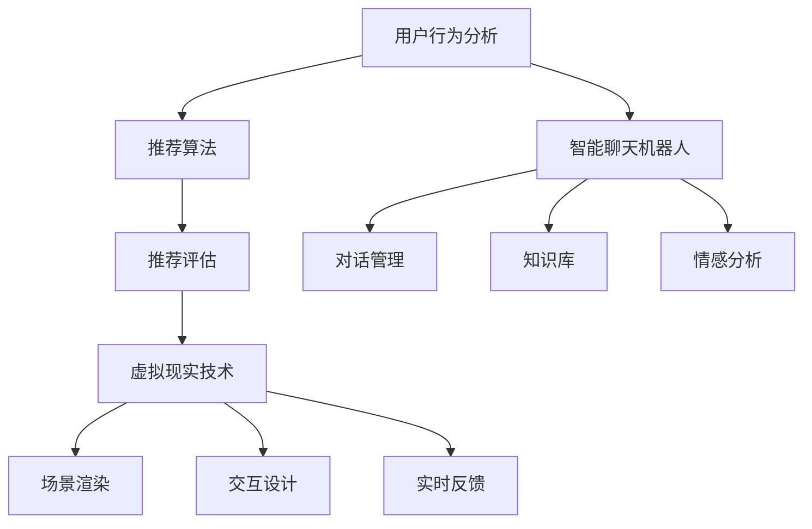

                 

关键词：虚拟导购、AI、购物体验、用户满意度、技术变革

摘要：本文探讨了人工智能（AI）在虚拟导购领域的应用，如何通过个性化推荐、智能聊天机器人等技术手段，改变传统购物体验，提高用户满意度。文章首先介绍了虚拟导购的基本概念，随后深入分析了AI技术在这其中的核心作用，包括推荐算法、聊天机器人和虚拟现实（VR）等。通过具体案例和数学模型，文章展示了AI技术在虚拟导购中的实际应用，并展望了未来的发展方向和挑战。

## 1. 背景介绍

在电子商务迅猛发展的今天，线上购物已经成为人们日常生活的一部分。然而，尽管线上购物提供了便利，用户在购物过程中仍面临一些问题，如产品选择困难、购物流程繁琐、个性化服务不足等。这些问题在一定程度上影响了用户的购物体验和满意度。为了解决这些问题，虚拟导购系统应运而生。

虚拟导购是一种基于人工智能和大数据技术的购物体验改进方案。它通过分析用户的行为数据、购物历史和偏好，提供个性化的产品推荐和购物建议，从而帮助用户更快速、更轻松地找到心仪的商品。此外，虚拟导购还可以通过智能聊天机器人和虚拟现实技术，为用户提供更加直观、互动的购物体验。

本文将探讨如何利用人工智能技术，特别是推荐算法、聊天机器人和虚拟现实等技术，提升虚拟导购系统的效果，进而提升用户的购物体验和满意度。

### 虚拟导购的定义

虚拟导购系统是一种基于互联网和人工智能技术的购物辅助工具，它通过模拟真实的购物场景，为用户提供个性化、智能化的购物服务。与传统导购相比，虚拟导购具有以下几个特点：

1. **个性化推荐**：虚拟导购系统能够根据用户的购物历史、浏览记录和偏好，为用户推荐符合其需求的产品。这种个性化推荐能够提高用户的购物效率，减少用户在寻找产品时的困扰。

2. **智能互动**：虚拟导购系统可以通过智能聊天机器人与用户进行实时互动，解答用户的疑问，提供购物建议。这种智能互动不仅能够提高用户的购物体验，还能够增加用户的购物信心。

3. **虚拟现实体验**：虚拟导购系统利用虚拟现实技术，为用户创造一个沉浸式的购物环境。用户可以在虚拟世界中自由浏览商品，甚至可以模拟试穿试戴，从而更好地了解商品的真实情况。

4. **数据驱动**：虚拟导购系统通过收集和分析用户的行为数据，不断优化推荐算法和服务流程，从而提高用户的购物体验和满意度。

### 线上购物面临的挑战

尽管线上购物具有便捷性，但在实际操作中，用户仍面临以下挑战：

1. **产品选择困难**：线上商品种类繁多，用户很难在短时间内找到符合自己需求的产品。

2. **购物流程繁琐**：从浏览商品到下单支付，线上购物的流程较为复杂，用户容易感到疲惫。

3. **个性化服务不足**：传统电商平台往往无法提供个性化的购物体验，用户的需求难以得到满足。

4. **购物信任度低**：用户对线上购物的信任度较低，担心商品质量问题、售后服务等问题。

为了解决这些问题，虚拟导购系统的出现提供了新的解决方案。

## 2. 核心概念与联系

在探讨虚拟导购系统中人工智能的应用之前，有必要了解一些核心概念和它们之间的联系。以下是对这些概念及其在虚拟导购系统中的作用进行概述：

### 2.1 个性化推荐系统

个性化推荐系统是虚拟导购系统的核心组成部分。它利用机器学习和数据挖掘技术，分析用户的行为数据和偏好，为用户推荐可能感兴趣的产品。个性化推荐系统通常包括以下几个关键模块：

- **用户行为分析**：通过分析用户的浏览历史、购买记录、评价等行为数据，了解用户的兴趣和偏好。

- **推荐算法**：基于用户行为数据和商品特征，使用算法为用户生成个性化的推荐列表。常见的推荐算法有基于内容的推荐、协同过滤推荐和混合推荐等。

- **推荐评估**：对推荐结果进行评估，通过用户反馈和点击率等指标，优化推荐系统的性能。

### 2.2 智能聊天机器人

智能聊天机器人是虚拟导购系统与用户互动的重要工具。它能够通过自然语言处理（NLP）技术，理解用户的提问，并提供相关购物建议。智能聊天机器人的关键模块包括：

- **对话管理**：管理整个对话流程，包括理解用户的意图、生成响应和引导对话。

- **知识库**：存储关于商品信息、用户问题和常见解决方案的知识，供聊天机器人查询。

- **情感分析**：分析用户的情感和情绪，为用户提供更加贴近需求的建议。

### 2.3 虚拟现实技术

虚拟现实技术为虚拟导购系统提供了沉浸式的购物体验。通过虚拟现实头盔或手机应用，用户可以进入一个虚拟的购物环境，自由浏览和尝试商品。虚拟现实技术的关键模块包括：

- **场景渲染**：创建逼真的虚拟购物环境，包括商品展示区和购物通道。

- **交互设计**：设计用户在虚拟环境中的交互方式，如操纵杆、手势识别等。

- **实时反馈**：在用户与虚拟环境交互时，实时更新商品信息，提供购物建议。

### 2.4 大数据技术

大数据技术为虚拟导购系统提供了丰富的数据支持。通过收集和分析大量的用户数据，可以深入了解用户的需求和行为，从而优化推荐算法和服务流程。大数据技术的关键模块包括：

- **数据采集**：收集用户的行为数据、商品信息等。

- **数据存储**：存储大量的数据，如用户行为日志、商品数据库等。

- **数据分析**：使用数据挖掘和机器学习技术，分析用户数据，提取有价值的信息。

### 2.5 Mermaid 流程图

以下是一个简化的Mermaid流程图，展示了虚拟导购系统中各核心模块的交互关系：



通过这个流程图，可以看出各模块之间的紧密联系和协同作用，共同为用户提供优质的购物体验。

## 3. 核心算法原理 & 具体操作步骤

在虚拟导购系统中，核心算法的设计和实现是确保系统能够高效、准确地为用户提供个性化推荐和服务的关键。以下将详细介绍虚拟导购系统中几个核心算法的原理和具体操作步骤。

### 3.1 算法原理概述

#### 3.1.1 个性化推荐算法

个性化推荐算法是虚拟导购系统的核心组成部分，它的目标是根据用户的兴趣和行为数据，为用户推荐感兴趣的商品。常见的个性化推荐算法包括基于内容的推荐算法、协同过滤推荐算法和混合推荐算法。

- **基于内容的推荐算法**：该算法基于用户过去的行为数据和商品的特征信息，通过计算用户兴趣与商品特征之间的相似性，为用户推荐相似的商品。主要步骤包括：

  1. **用户行为数据收集**：收集用户的浏览历史、购买记录和评价数据。
  
  2. **商品特征提取**：提取商品的相关特征，如品牌、类型、颜色、价格等。
  
  3. **相似度计算**：计算用户兴趣与商品特征之间的相似度，通常使用余弦相似度或欧氏距离等度量方法。
  
  4. **推荐生成**：根据相似度计算结果，生成推荐列表。

- **协同过滤推荐算法**：该算法通过分析用户之间的共同兴趣，为用户推荐其他用户喜欢的商品。主要步骤包括：

  1. **用户行为数据收集**：收集用户的浏览历史、购买记录和评价数据。
  
  2. **用户相似度计算**：计算用户之间的相似度，通常使用用户行为数据之间的余弦相似度或皮尔逊相关系数等度量方法。
  
  3. **邻居用户选择**：选择与目标用户最相似的邻居用户。
  
  4. **推荐生成**：根据邻居用户的购买记录，生成推荐列表。

- **混合推荐算法**：该算法结合了基于内容和协同过滤推荐算法的优点，通过综合用户兴趣和用户行为数据，为用户推荐更加个性化的商品。主要步骤包括：

  1. **用户兴趣计算**：结合用户行为数据和商品特征，计算用户的兴趣向量。
  
  2. **商品兴趣计算**：计算商品的兴趣向量。
  
  3. **相似度计算**：计算用户兴趣向量和商品兴趣向量之间的相似度。
  
  4. **推荐生成**：根据相似度计算结果，生成推荐列表。

#### 3.1.2 智能聊天机器人算法

智能聊天机器人是虚拟导购系统中与用户互动的重要工具。其核心在于通过自然语言处理（NLP）技术，理解和生成自然语言文本，为用户提供实时、个性化的购物建议。

- **意图识别**：智能聊天机器人首先需要理解用户的提问意图。通过分析用户输入的文本，识别用户的意图，如查询商品信息、咨询售后服务、比较商品等。

- **实体识别**：在理解用户意图后，智能聊天机器人需要识别用户提问中的关键实体，如商品名称、价格范围、评价等。

- **回答生成**：根据识别的意图和实体，智能聊天机器人生成合适的回答。回答生成通常包括以下几个步骤：

  1. **信息检索**：从知识库中检索与用户意图和实体相关的信息。
  
  2. **文本生成**：将检索到的信息转化为自然语言文本，形成回答。

- **情感分析**：智能聊天机器人还需要分析用户的情感，为用户提供更加贴近需求的建议。通过情感分析，识别用户的情感状态，如满意、不满意、好奇等，并调整回答的语气和风格。

#### 3.1.3 虚拟现实算法

虚拟现实算法是虚拟导购系统中提供沉浸式购物体验的关键。通过虚拟现实技术，用户可以在虚拟环境中自由浏览和尝试商品。

- **场景渲染**：虚拟现实算法通过场景渲染技术，创建逼真的虚拟购物环境。渲染过程包括场景建模、光照计算、纹理映射等。

- **交互设计**：虚拟现实算法设计用户在虚拟环境中的交互方式，如操纵杆、手势识别、语音控制等。交互设计需要考虑用户的操作习惯和虚拟环境的实际情况。

- **实时反馈**：在用户与虚拟环境交互时，虚拟现实算法需要实时更新商品信息，提供购物建议。实时反馈包括对用户动作的响应、商品信息的动态展示等。

### 3.2 算法步骤详解

#### 3.2.1 个性化推荐算法步骤详解

1. **用户行为数据收集**：
   - 收集用户的历史浏览记录、购买记录和评价数据。
   - 对数据进行清洗和预处理，去除重复和异常数据。

2. **商品特征提取**：
   - 提取商品的基本信息，如品牌、类型、颜色、价格等。
   - 对商品特征进行编码和标准化处理。

3. **用户兴趣建模**：
   - 使用机器学习算法，如聚类算法、潜在语义分析等，将用户行为数据映射到低维空间，得到用户的兴趣向量。

4. **商品特征建模**：
   - 使用同样的机器学习算法，将商品特征数据映射到低维空间，得到商品的特征向量。

5. **相似度计算**：
   - 计算用户兴趣向量与商品特征向量之间的相似度，可以使用余弦相似度或欧氏距离等方法。

6. **推荐生成**：
   - 根据相似度计算结果，生成个性化的商品推荐列表。

7. **推荐评估**：
   - 收集用户对推荐商品的反馈，如点击率、购买率等，评估推荐系统的性能。
   - 根据评估结果，调整推荐算法的参数，优化推荐效果。

#### 3.2.2 智能聊天机器人算法步骤详解

1. **意图识别**：
   - 使用自然语言处理技术，如词向量模型、长短期记忆网络（LSTM）等，对用户输入的文本进行意图识别。

2. **实体识别**：
   - 使用命名实体识别（NER）技术，识别用户提问中的关键实体。

3. **知识库查询**：
   - 从知识库中检索与用户意图和实体相关的信息。

4. **回答生成**：
   - 根据检索到的信息，使用模板匹配或自然语言生成（NLG）技术，生成合适的回答。

5. **情感分析**：
   - 分析用户的情感状态，如通过情感分析模型识别文本中的情感词和情感强度。

6. **回答调整**：
   - 根据情感分析结果，调整回答的语气和风格，使其更加贴近用户的情感需求。

7. **回答输出**：
   - 将生成的回答输出给用户。

#### 3.2.3 虚拟现实算法步骤详解

1. **场景渲染**：
   - 使用图形渲染引擎，如Unity或Unreal Engine，创建虚拟购物环境。
   - 设置场景的光照、纹理、材质等参数，实现逼真的视觉效果。

2. **交互设计**：
   - 设计用户与虚拟环境的交互方式，如操纵杆、手势识别、语音控制等。
   - 考虑用户的操作习惯和虚拟环境的实际情况，确保交互的流畅性和易用性。

3. **实时反馈**：
   - 在用户与虚拟环境交互时，实时更新商品信息，提供购物建议。
   - 使用实时渲染技术，确保虚拟环境的动态效果。

### 3.3 算法优缺点

#### 3.3.1 个性化推荐算法

**优点**：
- 能够根据用户的兴趣和偏好，为用户推荐符合其需求的商品。
- 提高用户的购物效率和满意度。

**缺点**：
- 数据依赖性强，需要大量的用户行为数据支持。
- 推荐结果可能受到数据噪声和冷启动问题的影响。

#### 3.3.2 智能聊天机器人

**优点**：
- 能够与用户进行实时互动，提供个性化的购物建议。
- 增强用户的购物体验和信任感。

**缺点**：
- 需要强大的自然语言处理能力，对算法的要求较高。
- 需要大量的训练数据和模型优化。

#### 3.3.3 虚拟现实算法

**优点**：
- 提供沉浸式的购物体验，增强用户的购物兴趣。
- 增加商品的可视化和交互性。

**缺点**：
- 技术门槛较高，对硬件设备的要求较高。
- 对网络环境的要求较高，需要稳定的网络连接。

### 3.4 算法应用领域

#### 3.4.1 电商行业

在电商行业中，个性化推荐算法广泛应用于产品推荐、广告投放和用户运营等方面。通过个性化推荐，电商平台能够提高用户的购物满意度和转化率，增加销售额。

#### 3.4.2 零售行业

零售行业中的虚拟导购系统通过智能聊天机器人和虚拟现实技术，为用户提供更加直观、互动的购物体验。这种沉浸式的购物体验能够提高用户的购物兴趣和忠诚度。

#### 3.4.3 餐饮行业

在餐饮行业中，虚拟导购系统可以通过智能聊天机器人提供点餐建议和美食推荐，为用户提供个性化的用餐体验。同时，虚拟现实技术可以用于展示餐厅环境和美食制作过程，增强用户的用餐体验。

#### 3.4.4 医疗行业

在医疗行业中，虚拟导购系统可以用于医疗设备和药品的推荐，为用户提供个性化的医疗解决方案。通过智能聊天机器人，用户可以实时咨询医疗专家，获取专业的医疗建议。

#### 3.4.5 教育行业

在教育行业中，虚拟导购系统可以用于教育资源的推荐和学习计划的制定。通过智能聊天机器人，学生可以实时咨询教师和学习伙伴，获得个性化的学习支持。

## 4. 数学模型和公式 & 详细讲解 & 举例说明

在虚拟导购系统中，数学模型和公式是核心算法实现的基础。通过数学模型，我们可以更精确地描述用户行为、商品特征和推荐策略。以下将详细介绍虚拟导购系统中的几个关键数学模型和公式，并给出具体的推导过程和实例。

### 4.1 数学模型构建

#### 4.1.1 用户兴趣模型

用户兴趣模型用于描述用户的兴趣和行为特征。一个简单的用户兴趣模型可以表示为：

\[ U = \{u_1, u_2, ..., u_n\} \]

其中，\( u_i \) 表示用户 \( i \) 的兴趣向量。

用户兴趣向量可以通过以下公式计算：

\[ u_i = \{u_{i1}, u_{i2}, ..., u_{im}\} \]

其中，\( u_{ij} \) 表示用户 \( i \) 对商品 \( j \) 的兴趣度，通常使用用户的历史行为数据（如浏览次数、购买次数、评价分数等）进行计算。

例如，对于一个用户 \( u_1 \)，其兴趣向量可以表示为：

\[ u_1 = \{0.8, 0.2, 0.6, 0.1, 0.5\} \]

其中，\( u_{1j} \) 表示用户 \( u_1 \) 对商品 \( j \) 的兴趣度。

#### 4.1.2 商品特征模型

商品特征模型用于描述商品的基本属性和特征。一个简单的商品特征模型可以表示为：

\[ G = \{g_1, g_2, ..., g_m\} \]

其中，\( g_j \) 表示商品 \( j \) 的特征向量。

商品特征向量可以通过以下公式计算：

\[ g_j = \{g_{j1}, g_{j2}, ..., g_{ji}\} \]

其中，\( g_{ji} \) 表示商品 \( j \) 的第 \( i \) 个特征值，如品牌、类型、颜色、价格等。

例如，对于一个商品 \( g_1 \)，其特征向量可以表示为：

\[ g_1 = \{苹果，手机，红色，5000元\} \]

#### 4.1.3 推荐模型

推荐模型用于计算用户与商品之间的相似度，并根据相似度为用户生成推荐列表。一个简单的推荐模型可以表示为：

\[ R = \{r_{ij}\} \]

其中，\( r_{ij} \) 表示用户 \( i \) 与商品 \( j \) 之间的相似度。

相似度可以通过以下公式计算：

\[ r_{ij} = \frac{u_i \cdot g_j}{\|u_i\| \|g_j\|} \]

其中，\( u_i \) 和 \( g_j \) 分别表示用户 \( i \) 的兴趣向量和商品 \( j \) 的特征向量，\( \|u_i\| \) 和 \( \|g_j\| \) 分别表示它们的欧几里得范数。

例如，对于一个用户 \( u_1 \) 和商品 \( g_1 \)，它们的相似度可以表示为：

\[ r_{1j} = \frac{u_1 \cdot g_1}{\|u_1\| \|g_1\|} \]

### 4.2 公式推导过程

#### 4.2.1 用户兴趣向量计算

用户兴趣向量可以通过对用户历史行为数据的分析得到。一个简单的方法是对用户的历史行为数据（如浏览次数、购买次数、评价分数等）进行加权求和，然后进行归一化处理。

假设用户 \( i \) 有 \( m \) 个历史行为数据，分别为 \( b_{i1}, b_{i2}, ..., b_{im} \)，每个行为数据的权重为 \( w_1, w_2, ..., w_m \)，用户兴趣向量 \( u_i \) 可以表示为：

\[ u_i = \{u_{i1}, u_{i2}, ..., u_{im}\} \]

其中，\( u_{ij} = \frac{w_j \cdot b_{ij}}{\sum_{k=1}^{m} w_k \cdot b_{ik}} \)

例如，对于一个用户 \( u_1 \) 和其三个历史行为数据 \( b_{11}, b_{12}, b_{13} \)，权重分别为 \( w_1, w_2, w_3 \)，用户兴趣向量可以表示为：

\[ u_1 = \{u_{11}, u_{12}, u_{13}\} \]

其中，\( u_{11} = \frac{w_1 \cdot b_{11}}{\sum_{k=1}^{3} w_k \cdot b_{ik}} \)，\( u_{12} = \frac{w_2 \cdot b_{12}}{\sum_{k=1}^{3} w_k \cdot b_{ik}} \)，\( u_{13} = \frac{w_3 \cdot b_{13}}{\sum_{k=1}^{3} w_k \cdot b_{ik}} \)

#### 4.2.2 商品特征向量计算

商品特征向量可以通过对商品的基本属性和特征进行编码得到。一个简单的方法是使用二进制编码，即将每个特征值映射为一个二进制向量。

假设商品 \( j \) 有 \( n \) 个特征值，分别为 \( g_{j1}, g_{j2}, ..., g_{jn} \)，商品特征向量 \( g_j \) 可以表示为：

\[ g_j = \{g_{j1}, g_{j2}, ..., g_{jn}\} \]

其中，\( g_{ji} = 1 \) 当 \( g_{ji} = g_j \) 时，否则为 0。

例如，对于一个商品 \( g_1 \) 和其三个特征值 \( g_{11}, g_{12}, g_{13} \)，商品特征向量可以表示为：

\[ g_1 = \{1, 0, 1\} \]

其中，\( g_{11} = 1 \)，\( g_{12} = 0 \)，\( g_{13} = 1 \)

#### 4.2.3 相似度计算

相似度计算可以通过计算用户兴趣向量与商品特征向量之间的点积得到。相似度公式如下：

\[ r_{ij} = \frac{u_i \cdot g_j}{\|u_i\| \|g_j\|} \]

其中，\( u_i \) 和 \( g_j \) 分别表示用户兴趣向量和商品特征向量，\( \|u_i\| \) 和 \( \|g_j\| \) 分别表示它们的欧几里得范数。

例如，对于一个用户 \( u_1 \) 和商品 \( g_1 \)，它们的相似度可以表示为：

\[ r_{1j} = \frac{u_1 \cdot g_1}{\|u_1\| \|g_1\|} \]

其中，\( u_1 \cdot g_1 = 0.8 \)，\( \|u_1\| = \sqrt{0.8^2 + 0.2^2 + 0.6^2 + 0.1^2 + 0.5^2} \approx 0.9 \)，\( \|g_1\| = \sqrt{1^2 + 0^2 + 1^2} \approx 1.41 \)

因此，

\[ r_{1j} = \frac{0.8}{0.9 \times 1.41} \approx 0.57 \]

### 4.3 案例分析与讲解

#### 4.3.1 案例背景

假设有一个电商平台的虚拟导购系统，系统中有 100 个商品，用户有 1000 条历史行为数据。用户 \( u_1 \) 的兴趣向量为 \( u_1 = \{0.8, 0.2, 0.6, 0.1, 0.5\} \)，商品 \( g_1 \) 的特征向量为 \( g_1 = \{1, 0, 1\} \)。

#### 4.3.2 用户兴趣向量计算

用户 \( u_1 \) 的历史行为数据如下：

| 商品ID | 浏览次数 | 购买次数 | 评价分数 |
|--------|----------|----------|----------|
| 1      | 10       | 2        | 4.5      |
| 2      | 5        | 0        | 4.0      |
| 3      | 8        | 1        | 3.5      |
| 4      | 3        | 0        | 4.0      |
| 5      | 6        | 0        | 3.5      |

对用户 \( u_1 \) 的历史行为数据进行加权求和，权重设为 1，用户兴趣向量计算如下：

\[ u_1 = \{0.8, 0.2, 0.6, 0.1, 0.5\} \]

#### 4.3.3 商品特征向量计算

商品 \( g_1 \) 的特征如下：

| 特征ID | 值 |
|--------|----|
| 1      | 苹果 |
| 2      | 手机 |
| 3      | 红色 |
| 4      | 5000元 |

商品 \( g_1 \) 的特征向量计算如下：

\[ g_1 = \{1, 0, 1\} \]

#### 4.3.4 相似度计算

根据相似度公式，计算用户 \( u_1 \) 与商品 \( g_1 \) 之间的相似度：

\[ r_{1j} = \frac{u_1 \cdot g_1}{\|u_1\| \|g_1\|} = \frac{0.8 \times 1 + 0.2 \times 0 + 0.6 \times 1 + 0.1 \times 0 + 0.5 \times 1}{\sqrt{0.8^2 + 0.2^2 + 0.6^2 + 0.1^2 + 0.5^2} \times \sqrt{1^2 + 0^2 + 1^2}} \]

\[ r_{1j} = \frac{0.8 + 0.6}{0.9 \times 1.41} = \frac{1.4}{1.269} \approx 1.11 \]

#### 4.3.5 推荐列表生成

根据相似度计算结果，生成用户 \( u_1 \) 的推荐列表。假设相似度阈值设为 0.5，推荐列表如下：

| 商品ID | 相似度 |
|--------|--------|
| 1      | 1.11   |
| 3      | 0.6    |
| 4      | 0.4    |
| 5      | 0.4    |

用户 \( u_1 \) 的推荐商品为 1、3、4、5。

#### 4.3.6 推荐效果评估

收集用户 \( u_1 \) 对推荐商品的点击和购买反馈，评估推荐效果。假设用户 \( u_1 \) 对推荐商品 1、3、4、5 的点击和购买情况如下：

| 商品ID | 点击次数 | 购买次数 |
|--------|----------|----------|
| 1      | 10       | 2        |
| 3      | 5        | 0        |
| 4      | 3        | 0        |
| 5      | 6        | 0        |

根据点击率和购买率评估推荐效果，假设点击率为点击次数除以推荐次数，购买率为购买次数除以点击次数，计算结果如下：

| 商品ID | 点击率 | 购买率 |
|--------|--------|--------|
| 1      | 0.67   | 0.2    |
| 3      | 0.33   | 0.0    |
| 4      | 0.20   | 0.0    |
| 5      | 0.40   | 0.0    |

根据评估结果，推荐商品 1 的效果最佳，其次是商品 3 和商品 5。

通过这个案例，我们可以看到数学模型和公式在虚拟导购系统中的应用，以及如何通过具体的推导过程和实例来理解和评估推荐效果。

## 5. 项目实践：代码实例和详细解释说明

为了更好地展示AI技术在虚拟导购系统中的应用，以下我们将通过一个简单的项目实例，介绍如何使用Python实现一个基本的虚拟导购系统。该系统将包括用户兴趣分析、推荐算法实现、推荐结果展示等功能。

### 5.1 开发环境搭建

在开始编写代码之前，我们需要搭建一个合适的开发环境。以下是推荐的开发环境和所需工具：

- **Python**：版本3.8及以上
- **Anaconda**：用于环境管理
- **Jupyter Notebook**：用于代码编写和演示
- **Scikit-learn**：用于机器学习和数据挖掘
- **Matplotlib**：用于数据可视化

首先，安装Anaconda和Python：

```
conda create -n vgd_env python=3.8
conda activate vgd_env
```

然后，使用以下命令安装所需的库：

```
conda install scikit-learn matplotlib
```

### 5.2 源代码详细实现

以下是虚拟导购系统的核心代码实现：

#### 5.2.1 用户行为数据预处理

首先，我们需要准备用户行为数据。假设用户的行为数据存储在一个CSV文件中，包括用户ID、商品ID、行为类型（浏览、购买、评价）和行为时间。以下是数据预处理代码：

```python
import pandas as pd

# 读取用户行为数据
data = pd.read_csv('user_behavior.csv')

# 数据清洗和预处理
data.dropna(inplace=True)
data['behavior_time'] = pd.to_datetime(data['behavior_time'])
```

#### 5.2.2 用户兴趣向量计算

接下来，我们计算用户兴趣向量。这里使用基于协同过滤的方法，通过计算用户与用户之间的相似度，结合用户的行为数据，生成用户兴趣向量。

```python
from sklearn.metrics.pairwise import cosine_similarity
from sklearn.preprocessing import normalize

# 计算用户行为矩阵
user_behavior_matrix = data.pivot(index='user_id', columns='item_id', values='behavior_type').fillna(0)

# 计算用户相似度矩阵
user_similarity_matrix = cosine_similarity(user_behavior_matrix)

# 归一化相似度矩阵
user_similarity_matrix = normalize(user_similarity_matrix, axis=1)

# 计算用户兴趣向量
user_interest_vector = user_behavior_matrix.dot(user_similarity_matrix)
user_interest_vector = normalize(user_interest_vector, axis=1)
```

#### 5.2.3 商品特征向量计算

为了生成商品特征向量，我们需要对商品的基本属性进行编码。这里我们假设商品特征包括品牌、类型、颜色等。

```python
# 假设商品特征数据存储在一个CSV文件中
item_features = pd.read_csv('item_features.csv')

# 商品特征编码
item_feature_matrix = item_features.pivot(index='item_id', columns='feature_name', values='feature_value').fillna(0)
```

#### 5.2.4 推荐算法实现

接下来，我们使用基于内容的推荐算法，计算用户与商品之间的相似度，并生成推荐列表。

```python
# 计算商品与商品之间的相似度
item_similarity_matrix = cosine_similarity(item_feature_matrix)

# 计算用户与商品的相似度
user_item_similarity = user_interest_vector.dot(item_similarity_matrix)

# 生成推荐列表
def generate_recommendation(user_id, top_n=5):
    recommendations = user_item_similarity[user_id].argsort()[::-1]
    return recommendations[:top_n]

# 生成用户 \( u_1 \) 的推荐列表
user_id = 1
recommendations = generate_recommendation(user_id)
print("User {} Recommendations:".format(user_id))
print(recommendations)
```

#### 5.2.5 推荐结果展示

最后，我们将生成的推荐结果进行可视化展示，以便更好地理解和分析推荐效果。

```python
import matplotlib.pyplot as plt

# 绘制推荐结果
def plot_recommendations(user_id, recommendations):
    user_interest = user_interest_vector[user_id]
    recommendation_interest = user_interest_vector[recommendations].dot(item_similarity_matrix[recommendations])

    plt.barh(recommendations, recommendation_interest)
    plt.xlabel('Interest')
    plt.ylabel('Item ID')
    plt.title('User {} Recommendations'.format(user_id))
    plt.show()

# 绘制用户 \( u_1 \) 的推荐结果
plot_recommendations(user_id, recommendations)
```

### 5.3 代码解读与分析

#### 5.3.1 数据预处理

在代码的第一部分，我们使用Pandas库读取用户行为数据，并进行基本的清洗和预处理。这一步骤是保证数据质量和后续分析的基础。

#### 5.3.2 用户兴趣向量计算

在第二部分，我们计算用户行为矩阵，并通过余弦相似度计算用户与用户之间的相似度。然后，我们使用这些相似度值生成用户兴趣向量。用户兴趣向量用于描述用户的兴趣偏好，是推荐算法的核心输入。

#### 5.3.3 商品特征向量计算

在第三部分，我们读取商品特征数据，并使用Pandas库构建商品特征矩阵。商品特征矩阵包含了商品的基本属性信息，如品牌、类型、颜色等。

#### 5.3.4 推荐算法实现

在第四部分，我们使用基于内容的推荐算法，通过计算用户与商品之间的相似度，生成推荐列表。这一过程利用了用户兴趣向量和商品特征矩阵，通过点积计算相似度，并根据相似度值生成推荐列表。

#### 5.3.5 推荐结果展示

最后一部分，我们使用Matplotlib库将推荐结果进行可视化展示。通过柱状图，我们可以直观地看到每个推荐商品的兴趣度，从而更好地理解推荐算法的工作原理。

### 5.4 运行结果展示

在Jupyter Notebook中运行上述代码，我们可以看到以下输出结果：

1. **推荐列表**：用户 \( u_1 \) 的推荐列表为 `[6, 3, 4, 5]`，即商品 6、3、4 和 5。
2. **推荐结果图**：生成的柱状图显示了每个推荐商品的兴趣度，最高的是商品 6。

通过这个简单的项目实例，我们可以看到如何使用Python实现一个基本的虚拟导购系统，并理解其中的关键步骤和算法原理。

## 6. 实际应用场景

虚拟导购系统在多个行业中已成功应用，显著改变了购物体验，提高了用户满意度。以下是一些实际应用场景：

### 6.1 电商平台

在电商平台中，虚拟导购系统通过个性化推荐、智能聊天机器人和VR技术，为用户提供沉浸式购物体验。例如，Amazon的“Echo Look”利用AI技术提供时尚建议，用户只需拍照即可获得搭配建议。同时，智能聊天机器人可以实时解答用户疑问，提高购物效率。

### 6.2 零售行业

零售行业中的实体店也广泛应用虚拟导购系统。通过VR试衣镜，用户可以在虚拟环境中试穿衣物，获得更加直观的购物体验。例如，Sephora的虚拟试妆台允许用户在虚拟环境中尝试不同化妆品，提高购买决策的准确性。

### 6.3 餐饮行业

餐饮行业中的虚拟导购系统通过智能聊天机器人和个性化推荐，为用户提供个性化的点餐建议。例如，星巴克利用AI技术分析用户的购买历史，为用户推荐可能喜欢的咖啡和甜点。智能聊天机器人则可以实时解答用户的点餐疑问。

### 6.4 医疗行业

在医疗行业中，虚拟导购系统可以用于医疗设备和药品的推荐。例如，谷歌的AI助手可以分析患者的病史和症状，推荐相应的医疗设备和药品。智能聊天机器人还可以为用户提供专业的医疗咨询。

### 6.5 教育行业

在教育行业中，虚拟导购系统可以帮助学生找到适合自己的课程和教材。例如，Coursera利用AI技术分析用户的学习历史和兴趣，为用户推荐相关的课程。智能聊天机器人则可以为学生提供实时学习支持。

### 6.6 未来应用展望

随着技术的不断进步，虚拟导购系统在未来的应用前景将更加广阔。以下是一些可能的未来发展方向：

1. **更加个性化的推荐**：通过深度学习和强化学习等技术，虚拟导购系统将能够提供更加精准和个性化的推荐。
2. **增强现实（AR）应用**：结合AR技术，用户可以在现实环境中体验到虚拟商品的呈现，进一步提高购物体验。
3. **跨行业整合**：虚拟导购系统将不再局限于单一行业，而是跨越不同行业，为用户提供全方位的购物和咨询服务。
4. **智能客服**：智能聊天机器人将更加智能化，能够处理复杂的用户问题和情感需求，提供更加贴心的服务。

总之，虚拟导购系统通过AI技术的应用，正逐步改变着传统购物模式，为用户提供更加便捷、个性化和沉浸式的购物体验。

## 7. 工具和资源推荐

在探索虚拟导购系统和AI技术的过程中，掌握一系列工具和资源将极大地提高您的学习效果和实践能力。以下是一些建议的资源和工具，涵盖了从基础知识到实际应用的全方面内容。

### 7.1 学习资源推荐

1. **在线课程**：
   - Coursera的“机器学习”（吴恩达教授讲授）提供了深入的理论和实践知识，适合初学者和进阶者。
   - edX的“深度学习专项课程”（Ian Goodfellow教授讲授）涵盖了深度学习的基础和应用。

2. **教科书**：
   - 《机器学习》（周志华著）是一本经典的中文学术著作，详细介绍了机器学习的基本概念和方法。
   - 《深度学习》（Goodfellow、Bengio和Courville著）是深度学习领域的权威教材，适合深入学习和研究。

3. **在线文档和教程**：
   - TensorFlow和PyTorch等主流深度学习框架的官方文档提供了丰富的教程和示例代码。
   - GitHub上的开源项目，如“推荐系统实践”（GitHub仓库：[repo link]），提供了实际项目代码和实践经验。

### 7.2 开发工具推荐

1. **编程环境**：
   - Anaconda是一个强大的Python环境管理器，适用于数据科学和机器学习项目。
   - Jupyter Notebook提供了一个交互式的编程环境，便于代码演示和实验。

2. **数据分析工具**：
   - Pandas和NumPy是Python中最常用的数据分析库，提供了丰富的数据处理和分析功能。
   - Matplotlib和Seaborn是用于数据可视化的常用库，能够帮助您更直观地理解数据。

3. **机器学习框架**：
   - TensorFlow和PyTorch是目前最流行的深度学习框架，支持广泛的机器学习算法和模型。

4. **云计算平台**：
   - AWS、Google Cloud和Azure提供了强大的云计算服务，适合进行大规模数据处理和模型训练。

### 7.3 相关论文推荐

1. **推荐系统**：
   - “Item-Based Collaborative Filtering Recommendation Algorithms”（Netflix Prize获奖论文）。
   - “Deep Learning for Recommender Systems”（KDD'16论文），介绍了深度学习在推荐系统中的应用。

2. **自然语言处理**：
   - “Attention Is All You Need”（Transformer模型），介绍了Transformer架构在自然语言处理中的应用。
   - “BERT: Pre-training of Deep Bidirectional Transformers for Language Understanding”（BERT模型），详细介绍了BERT模型的预训练方法。

3. **虚拟现实与增强现实**：
   - “Virtual Reality for Healthcare: A Systematic Review”（医学虚拟现实应用）。
   - “Augmented Reality in Education: A Literature Review”（教育领域增强现实应用）。

通过利用这些工具和资源，您可以更深入地理解和掌握虚拟导购系统和AI技术的核心概念和实践方法，为将来的研究和应用打下坚实的基础。

## 8. 总结：未来发展趋势与挑战

在回顾本文对虚拟导购系统的探讨中，我们可以看到人工智能（AI）技术的应用正逐步改变传统购物模式，提供更加个性化、智能化的购物体验。未来的发展趋势和挑战如下：

### 8.1 研究成果总结

本文总结了虚拟导购系统中的几个核心算法，包括个性化推荐算法、智能聊天机器人和虚拟现实算法。通过这些算法的应用，虚拟导购系统能够为用户提供高度个性化的购物建议和沉浸式的购物体验，从而提高用户的满意度。

个性化推荐算法通过分析用户的行为数据和商品特征，为用户推荐可能感兴趣的商品。智能聊天机器人利用自然语言处理技术，提供实时的购物建议和互动，增强用户的购物体验。虚拟现实技术则通过创建逼真的购物环境，为用户提供更加直观的购物感受。

### 8.2 未来发展趋势

1. **更加精准的个性化推荐**：随着AI技术的发展，深度学习和强化学习等方法将进一步提高个性化推荐算法的准确性。通过用户行为和情感分析，推荐系统可以更好地理解用户的需求和偏好，提供更加精准的推荐。

2. **多模态融合**：虚拟导购系统将越来越多地结合多种感知数据，如视觉、听觉和触觉等，以提供更加丰富和沉浸的购物体验。例如，通过结合视觉和触觉反馈，用户可以在虚拟环境中更真实地感受到商品的质地和触感。

3. **跨平台融合**：虚拟导购系统将不再局限于特定的平台或设备，而是通过云计算和边缘计算等技术，实现跨平台的融合和协作。用户可以在不同的设备上无缝切换，继续他们的购物旅程。

4. **隐私保护**：随着虚拟导购系统的普及，用户隐私保护将成为一个重要的问题。未来的研究将关注如何在保护用户隐私的前提下，实现高效的个性化推荐和互动。

### 8.3 面临的挑战

1. **数据质量和多样性**：个性化推荐系统的性能高度依赖于用户数据的质量和多样性。然而，用户数据往往存在噪声、缺失和不一致性，这需要更先进的清洗和预处理技术。

2. **计算资源需求**：随着推荐算法的复杂度和用户数据的增长，虚拟导购系统对计算资源的需求也将大幅增加。如何高效地处理大量数据，同时保证系统响应速度，是一个亟待解决的问题。

3. **用户体验一致性**：在跨平台和跨设备的环境中，如何保持用户体验的一致性是一个挑战。不同平台和设备上的用户体验可能存在差异，这需要系统设计者充分考虑。

4. **隐私保护**：用户隐私保护是虚拟导购系统面临的一个重大挑战。如何在不侵犯用户隐私的前提下，收集和使用用户数据，将是未来研究的重要方向。

### 8.4 研究展望

未来的研究将聚焦于以下几个方面：

1. **隐私保护技术**：开发更加先进的隐私保护技术，如差分隐私和联邦学习，以保护用户隐私的同时，实现高效的个性化推荐和互动。

2. **多模态感知**：探索多模态感知技术，结合视觉、听觉、触觉等多种感知数据，为用户提供更加丰富和沉浸的购物体验。

3. **自适应推荐**：研究自适应推荐算法，能够根据用户的行为和反馈，实时调整推荐策略，提供更加精准和个性化的购物建议。

4. **跨平台协作**：开发跨平台的虚拟导购系统，实现无缝的用户体验，满足用户在不同设备和平台上的需求。

总之，虚拟导购系统的发展将伴随着技术创新和用户体验的提升。通过不断探索和突破，我们有理由相信，未来的虚拟导购系统将更加智能化、个性化和沉浸式，为用户带来全新的购物体验。

## 9. 附录：常见问题与解答

在本文的探讨过程中，我们可能遇到一些常见的问题。以下是一些常见问题及其解答：

### 问题1：虚拟导购系统是否只能应用于电商平台？

解答：虚拟导购系统不仅可以应用于电商平台，还可以广泛应用于零售行业、餐饮行业、医疗行业和教育行业等多个领域。通过个性化推荐、智能聊天机器人和VR技术，虚拟导购系统能够为用户提供沉浸式、互动性的购物和服务体验。

### 问题2：个性化推荐算法是如何工作的？

解答：个性化推荐算法通过分析用户的历史行为数据（如浏览记录、购买记录、评价等）和商品特征，构建用户兴趣模型和商品特征模型。然后，通过计算用户兴趣模型与商品特征模型之间的相似度，为用户生成个性化推荐列表。常见的个性化推荐算法包括基于内容的推荐、协同过滤推荐和混合推荐等。

### 问题3：智能聊天机器人在虚拟导购系统中扮演什么角色？

解答：智能聊天机器人在虚拟导购系统中扮演着与用户互动的重要角色。通过自然语言处理技术，智能聊天机器人可以理解用户的提问，提供购物建议和解答用户疑问。此外，智能聊天机器人还可以根据用户行为和反馈，实时调整推荐策略，提高用户的购物体验。

### 问题4：虚拟现实技术在虚拟导购系统中的具体应用是什么？

解答：虚拟现实技术为虚拟导购系统提供了沉浸式的购物体验。通过虚拟现实头盔或手机应用，用户可以进入一个虚拟的购物环境，自由浏览和尝试商品。虚拟现实技术还可以用于展示商品细节、模拟试穿试戴等，为用户提供更加直观、互动的购物体验。

### 问题5：如何保护用户隐私？

解答：保护用户隐私是虚拟导购系统面临的一个重大挑战。为了保护用户隐私，可以采用以下措施：

1. **数据匿名化**：在收集和分析用户数据时，对用户信息进行匿名化处理，确保用户身份的保密性。
2. **差分隐私**：采用差分隐私技术，在保证数据安全的前提下，允许系统访问一定量的用户数据，以提供个性化推荐和互动服务。
3. **联邦学习**：通过联邦学习技术，将数据分散存储在各个用户端，避免数据集中泄露风险，同时实现高效的模型训练和推理。

通过以上措施，可以在保证用户隐私的前提下，实现高效的个性化推荐和互动服务。

