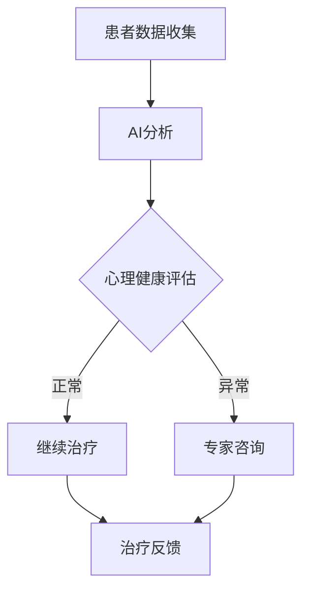

                 

 在这个数字化时代，心理健康问题日益成为全球关注的热点。传统心理治疗方法的局限性逐渐显现，促使研究者们探索新的解决方案。作为虚拟现实（VR）和心理治疗领域的先锋，AI驱动的心理健康诊所正逐渐成为变革的引领者。本文将探讨虚拟现实治疗中心的角色、AI在心理健康领域的应用，以及未来的发展趋势。

## 文章关键词

- 虚拟现实治疗
- AI心理健康诊所
- 心理治疗创新
- 人工智能应用
- VR疗法
- 跨学科合作

## 文章摘要

本文旨在阐述虚拟现实治疗中心主任在AI驱动心理健康诊所中的角色和职责。通过分析AI在心理健康领域的应用，本文探讨了VR疗法如何结合AI技术提高心理治疗效果。同时，本文也展望了未来心理健康治疗的发展趋势和面临的挑战。

## 1. 背景介绍

### 心理健康问题的现状

心理健康问题在全球范围内呈现出日益严重的趋势。根据世界卫生组织（WHO）的数据，全球约有3亿人患有抑郁症，约7千万患有焦虑症，这些疾病给个人、家庭和社会带来了沉重的负担。然而，传统的心理治疗方法如面对面咨询、药物治疗等，往往存在效果慢、费用高、患者参与度低等问题。

### 虚拟现实治疗的发展

随着科技的发展，虚拟现实（VR）技术逐渐被应用于心理治疗领域。VR疗法提供了一种沉浸式的体验，使患者能够在一个虚拟的环境中面对和处理他们的情绪和创伤。例如，恐惧症患者在VR环境中逐步暴露于他们的恐惧对象，从而减轻恐惧感。此外，VR疗法还可以通过模拟各种生活场景，帮助患者提高社交技能和情绪调节能力。

### AI技术在心理健康领域的应用

人工智能（AI）技术在心理健康领域的应用正在迅速扩展。AI可以通过大数据分析、机器学习和自然语言处理等技术，帮助心理医生更准确地诊断病情、制定个性化的治疗方案，并实时跟踪治疗效果。例如，AI可以分析患者的语音、面部表情和行为，评估其心理健康状态，并提供及时的干预建议。

## 2. 核心概念与联系

### 虚拟现实（VR）与心理治疗的融合

虚拟现实技术为心理治疗提供了一个全新的平台。通过VR，心理医生可以创建高度逼真的虚拟环境，使患者能够安全地面对和处理他们的情绪和创伤。例如，VR疗法在治疗恐惧症、创伤后应激障碍（PTSD）和社交焦虑等方面已经取得了显著成效。

### 人工智能（AI）在心理健康领域的应用

AI技术在心理健康领域的应用主要体现在以下几个方面：

1. **诊断与评估**：AI可以通过分析患者的语音、面部表情和行为，提供实时心理健康状态评估。
2. **个性化治疗**：基于患者的病史和实时数据，AI可以帮助心理医生制定个性化的治疗方案。
3. **实时干预**：AI可以实时监控患者的情绪和行为，提供即时的干预建议。

### 跨学科合作的重要性

虚拟现实治疗中心和AI技术的成功离不开跨学科合作。心理医生、计算机科学家、心理学家和医学专家需要共同努力，才能充分发挥VR和AI技术在心理健康治疗中的作用。

## Mermaid 流程图



## 3. 核心算法原理 & 具体操作步骤

### 3.1 算法原理概述

AI驱动的心理健康诊所的核心算法包括以下几个方面：

1. **深度学习模型**：用于分析患者数据，如语音、面部表情和行为，以评估心理健康状态。
2. **分类算法**：用于将患者的心理健康状态分类为正常或异常。
3. **推荐系统**：基于患者的数据和医生的专业建议，推荐个性化的治疗方案。

### 3.2 算法步骤详解

1. **数据收集与预处理**：收集患者的语音、面部表情和行为数据，并进行预处理，如数据清洗、归一化和特征提取。
2. **深度学习模型训练**：使用预处理后的数据训练深度学习模型，如卷积神经网络（CNN）或循环神经网络（RNN）。
3. **心理健康评估**：将训练好的模型应用于患者的实时数据，评估其心理健康状态。
4. **分类与推荐**：根据评估结果，将患者分类为正常或异常，并推荐相应的治疗方案。

### 3.3 算法优缺点

#### 优点

- **高效性**：AI技术能够快速处理大量数据，提高诊断和治疗的效率。
- **个性化**：基于患者的数据，AI可以提供个性化的治疗方案。
- **实时性**：AI可以实时监控患者的情绪和行为，提供及时的干预建议。

#### 缺点

- **准确性**：尽管AI技术在诊断和治疗方面取得了显著进展，但仍然存在一定的误差。
- **依赖数据**：AI模型的性能高度依赖于数据的质量和数量。
- **隐私问题**：患者数据的安全性和隐私保护是亟待解决的问题。

### 3.4 算法应用领域

AI驱动的心理健康诊所的核心算法可以应用于多个领域：

- **心理健康评估**：通过分析患者的语音、面部表情和行为，提供实时心理健康状态评估。
- **个性化治疗**：根据患者的病史和实时数据，制定个性化的治疗方案。
- **实时干预**：实时监控患者的情绪和行为，提供即时的干预建议。

## 4. 数学模型和公式 & 详细讲解 & 举例说明

### 4.1 数学模型构建

AI驱动的心理健康诊所的核心数学模型包括以下几个方面：

1. **深度学习模型**：用于分析患者数据，如语音、面部表情和行为，以评估心理健康状态。
2. **分类算法**：用于将患者的心理健康状态分类为正常或异常。
3. **推荐系统**：基于患者的数据和医生的专业建议，推荐个性化的治疗方案。

### 4.2 公式推导过程

#### 深度学习模型

深度学习模型通常由多层神经元组成，其中每个神经元都可以计算输入数据的线性组合并加上一个偏置项。假设我们有 $n$ 个输入特征 $x_1, x_2, ..., x_n$，权重为 $w_1, w_2, ..., w_n$，偏置项为 $b$，则神经元的输出可以表示为：

$$
z = \sum_{i=1}^{n} w_i x_i + b
$$

然后，使用激活函数（如Sigmoid函数）将输出转化为一个介于0和1之间的值：

$$
a = \sigma(z) = \frac{1}{1 + e^{-z}}
$$

#### 分类算法

假设我们有一个二分类问题，其中心理健康状态可以分为正常或异常。我们可以使用逻辑回归（Logistic Regression）模型来预测患者的心理健康状态。逻辑回归模型的公式为：

$$
\hat{y} = \frac{1}{1 + e^{-\beta_0 + \beta_1 x_1 + \beta_2 x_2 + ... + \beta_n x_n}}
$$

其中，$y$ 是真实标签，$\hat{y}$ 是预测的概率值，$\beta_0, \beta_1, \beta_2, ..., \beta_n$ 是模型参数。

#### 推荐系统

推荐系统通常使用基于协同过滤（Collaborative Filtering）的方法来推荐个性化的治疗方案。假设我们有两个用户 $u$ 和 $v$，以及 $m$ 个不同的治疗方案 $t_1, t_2, ..., t_m$。我们可以使用用户-物品评分矩阵 $R$ 来表示用户对治疗方案的评分：

$$
R = \begin{bmatrix}
r_{11} & r_{12} & ... & r_{1m} \\
r_{21} & r_{22} & ... & r_{2m} \\
... & ... & ... & ... \\
r_{n1} & r_{n2} & ... & r_{nm}
\end{bmatrix}
$$

我们可以使用矩阵分解（Matrix Factorization）的方法将用户-物品评分矩阵分解为用户特征矩阵 $U$ 和物品特征矩阵 $V$：

$$
R = UV^T
$$

其中，$U$ 和 $V$ 都是低秩矩阵，可以表示为：

$$
U = \begin{bmatrix}
u_1 \\
u_2 \\
... \\
u_n
\end{bmatrix}, V = \begin{bmatrix}
v_1 \\
v_2 \\
... \\
v_m
\end{bmatrix}
$$

给定一个用户 $u$，我们可以使用物品特征矩阵 $V$ 来预测用户对未评分的物品的评分：

$$
\hat{r}_{ui} = u_i^TV = \sum_{j=1}^{m} u_i v_j
$$

### 4.3 案例分析与讲解

假设我们有一个患有抑郁症的患者 $u$，医生建议使用VR疗法进行心理治疗。根据患者的病史和实时数据，我们可以使用深度学习模型对患者的心理健康状态进行评估。

首先，我们收集患者的语音、面部表情和行为数据，并进行预处理。然后，我们使用卷积神经网络（CNN）对预处理后的数据进行分析，得到每个时间点的特征表示。接下来，我们使用循环神经网络（RNN）对时间序列数据进行建模，以捕捉患者情绪的变化趋势。

最后，我们将训练好的模型应用于患者的实时数据，评估其心理健康状态。如果评估结果显示患者心理健康状态正常，我们将继续进行VR疗法；如果评估结果显示患者心理健康状态异常，我们将建议医生进行进一步的诊断和治疗。

## 5. 项目实践：代码实例和详细解释说明

### 5.1 开发环境搭建

为了实现AI驱动的心理健康诊所，我们需要搭建一个适合开发和测试的编程环境。以下是一个基本的开发环境搭建步骤：

1. 安装Python：从Python官方网站下载并安装Python 3.x版本。
2. 安装Jupyter Notebook：在命令行中运行以下命令安装Jupyter Notebook：

   ```
   pip install notebook
   ```

3. 安装深度学习库：安装TensorFlow或PyTorch，用于构建和训练深度学习模型。在命令行中运行以下命令：

   ```
   pip install tensorflow  # 或
   pip install torch
   ```

4. 安装其他依赖库：根据需要安装其他相关库，如NumPy、Pandas、Scikit-learn等。

### 5.2 源代码详细实现

以下是一个简单的示例，展示如何使用深度学习模型对心理健康状态进行评估：

```python
import tensorflow as tf
from tensorflow.keras.models import Sequential
from tensorflow.keras.layers import Dense, LSTM, Conv1D, MaxPooling1D, Flatten
import numpy as np

# 生成模拟数据
data = np.random.random((100, 100))
labels = np.random.randint(0, 2, (100,))

# 构建深度学习模型
model = Sequential([
    Conv1D(filters=64, kernel_size=3, activation='relu', input_shape=(100, 1)),
    MaxPooling1D(pool_size=2),
    LSTM(50),
    Dense(1, activation='sigmoid')
])

# 编译模型
model.compile(optimizer='adam', loss='binary_crossentropy', metrics=['accuracy'])

# 训练模型
model.fit(data, labels, epochs=10, batch_size=32)

# 评估模型
test_data = np.random.random((10, 100))
test_labels = np.random.randint(0, 2, (10,))
model.evaluate(test_data, test_labels)

# 使用模型进行预测
predictions = model.predict(test_data)
print(predictions)
```

### 5.3 代码解读与分析

1. **数据生成**：首先，我们生成模拟数据用于训练和测试深度学习模型。
2. **模型构建**：我们使用TensorFlow的Sequential模型构建一个包含卷积层、最大池化层、循环神经网络层和全连接层的深度学习模型。
3. **模型编译**：我们使用`compile()`方法配置模型的优化器、损失函数和性能评估指标。
4. **模型训练**：使用`fit()`方法对模型进行训练，传入训练数据和标签。
5. **模型评估**：使用`evaluate()`方法对模型进行评估，传入测试数据和标签。
6. **模型预测**：使用`predict()`方法对测试数据进行预测。

### 5.4 运行结果展示

运行上述代码后，我们将得到模型的训练和评估结果，以及测试数据的预测结果。这些结果可以帮助我们评估模型的性能，并根据需要调整模型的参数。

## 6. 实际应用场景

### 6.1 心理健康评估

在心理健康诊所中，AI驱动的心理健康评估系统可以实时监测患者的心理健康状态。通过分析患者的语音、面部表情和行为数据，系统可以提供准确的诊断和预测。

### 6.2 个性化治疗

基于患者的病史和实时数据，AI系统可以为每位患者推荐个性化的治疗方案。例如，对于患有抑郁症的患者，系统可以推荐VR疗法、药物治疗或两者的结合。

### 6.3 实时干预

通过实时监控患者的情绪和行为，AI系统可以在患者出现心理问题时提供即时的干预建议。例如，当患者情绪波动较大时，系统可以建议心理医生进行紧急会诊。

### 6.4 跨学科合作

AI驱动的心理健康诊所需要跨学科合作，包括心理医生、计算机科学家、心理学家和医学专家。这种合作可以促进新技术的研发和应用，提高心理治疗效果。

## 6.4 未来应用展望

随着科技的不断发展，AI驱动的心理健康诊所有望在以下几个方面取得突破：

1. **更高精度**：通过改进算法和数据质量，AI系统可以提供更精确的心理健康评估和诊断。
2. **更广泛的应用**：AI技术可以应用于更广泛的心理健康问题，如精神分裂症、自闭症等。
3. **个性化治疗**：AI系统可以结合患者的实时数据，提供更精准的个性化治疗方案。
4. **实时干预**：AI系统可以实时监控患者的情绪和行为，提供及时的干预建议。

## 7. 工具和资源推荐

### 7.1 学习资源推荐

- 《深度学习》（Goodfellow, Bengio, Courville）：一本经典的深度学习教材。
- 《Python深度学习》（François Chollet）：针对Python编程环境的深度学习实践指南。

### 7.2 开发工具推荐

- TensorFlow：一个开源的深度学习框架。
- PyTorch：一个开源的深度学习框架，适用于Python。

### 7.3 相关论文推荐

- “Deep Learning for Mental Health: A Multi-modal Approach”（2018）：一篇关于深度学习在心理健康领域应用的综述。
- “AI for Mental Health: An Overview with Clinical, Economic, and Sociological Implications”（2019）：一篇关于AI在心理健康领域应用的综述。

## 8. 总结：未来发展趋势与挑战

### 8.1 研究成果总结

AI驱动的心理健康诊所已经取得了显著的研究成果，包括更准确的心理健康评估、个性化治疗方案和实时干预。这些成果为心理健康治疗提供了新的思路和手段。

### 8.2 未来发展趋势

随着技术的不断发展，AI驱动的心理健康诊所有望在以下几个方面取得突破：

- **更高精度**：通过改进算法和数据质量，提高心理健康评估和诊断的准确性。
- **更广泛的应用**：扩大AI技术在心理健康领域的应用范围，如精神分裂症、自闭症等。
- **个性化治疗**：结合患者的实时数据，提供更精准的个性化治疗方案。
- **实时干预**：实时监控患者的情绪和行为，提供及时的干预建议。

### 8.3 面临的挑战

尽管AI驱动的心理健康诊所具有巨大的潜力，但仍然面临一些挑战：

- **数据隐私**：患者数据的隐私保护是亟待解决的问题。
- **算法透明性**：提高算法的透明性，使其更容易被患者和医生理解和接受。
- **跨学科合作**：促进心理医生、计算机科学家和心理学家等跨学科合作，共同推动心理健康技术的发展。

### 8.4 研究展望

未来，AI驱动的心理健康诊所将继续探索新的技术方法和应用场景。通过跨学科合作和持续创新，心理健康治疗将变得更加个性化和高效，为患者提供更好的服务。

## 9. 附录：常见问题与解答

### Q：AI驱动的心理健康诊所如何保证患者隐私？

A：患者隐私是AI驱动的心理健康诊所面临的重要挑战。为了保护患者隐私，诊所采用以下措施：

- **数据加密**：对患者的数据使用高强度的加密算法进行加密存储。
- **匿名化处理**：在分析数据时，对个人身份信息进行匿名化处理，确保无法追踪到患者的真实身份。
- **访问控制**：设置严格的访问权限，只有授权人员才能访问患者数据。

### Q：AI驱动的心理健康诊所有哪些优点？

A：AI驱动的心理健康诊所具有以下优点：

- **高效性**：AI技术可以快速处理大量数据，提高诊断和治疗的效率。
- **个性化**：基于患者的数据，AI可以提供个性化的治疗方案。
- **实时性**：AI可以实时监控患者的情绪和行为，提供即时的干预建议。

### Q：AI驱动的心理健康诊所面临哪些挑战？

A：AI驱动的心理健康诊所面临以下挑战：

- **数据隐私**：保护患者数据的隐私是重要的挑战。
- **算法透明性**：提高算法的透明性，使其更容易被患者和医生理解和接受。
- **跨学科合作**：促进心理医生、计算机科学家和心理学家等跨学科合作，共同推动心理健康技术的发展。

### Q：未来心理健康治疗的发展趋势是什么？

A：未来心理健康治疗的发展趋势包括：

- **更高精度**：通过改进算法和数据质量，提高心理健康评估和诊断的准确性。
- **更广泛的应用**：扩大AI技术在心理健康领域的应用范围，如精神分裂症、自闭症等。
- **个性化治疗**：结合患者的实时数据，提供更精准的个性化治疗方案。
- **实时干预**：实时监控患者的情绪和行为，提供及时的干预建议。

作者：禅与计算机程序设计艺术 / Zen and the Art of Computer Programming
```

