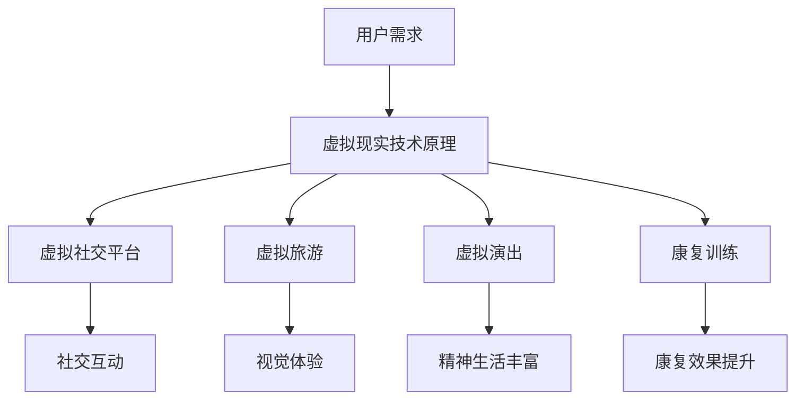

                 

关键词：虚拟现实，老年陪护，情感关怀，科技辅助，创业

摘要：随着人口老龄化的加剧，老年陪护的需求日益增长。本文探讨了利用虚拟现实技术为老年人提供情感关怀的创业机会，分析了虚拟现实技术在此领域的应用现状、核心算法原理、数学模型及其在未来可能的应用场景。文章旨在为创业者提供有价值的参考，推动科技在老年陪护领域的创新发展。

## 1. 背景介绍

### 老龄化社会下的老年陪护需求

随着全球人口老龄化趋势的加剧，老年人群体的规模不断扩大。根据联合国数据，到2050年，全球60岁及以上人口将达到22亿，约占全球总人口的22%。这一现象不仅给医疗卫生、社会保障等领域带来巨大压力，同时也催生了对于老年陪护服务的强烈需求。

老年陪护不仅仅是简单的日常生活照料，更重要的是情感上的陪伴和支持。老年人由于身体机能的衰退、社交圈的缩小，容易产生孤独、抑郁等心理问题。因此，提供一种既能满足其实际需求，又能给予情感关怀的服务模式变得尤为迫切。

### 虚拟现实技术的崛起

虚拟现实（Virtual Reality，VR）技术作为一项颠覆性技术，近年来得到了迅猛发展。VR技术通过模拟真实环境，为用户提供沉浸式的体验，使人们可以在虚拟世界中互动、探索。这一技术的崛起，为老年陪护领域带来了新的可能性。

首先，VR技术能够为老年人提供虚拟社交平台，使他们能够在虚拟环境中与其他人进行互动，从而缓解孤独感。其次，VR技术可以模拟各种场景，如自然风光、历史文化遗址等，为老年人提供丰富的视觉体验，满足他们对世界的探索欲望。此外，VR技术还可以应用于康复训练，帮助老年人提高身体机能。

## 2. 核心概念与联系

### 虚拟现实技术原理

虚拟现实技术通过计算机生成三维虚拟环境，使用户能够通过特殊设备（如VR头盔、手柄等）进入并与之互动。其核心原理包括：

- **三维建模**：使用三维建模软件创建虚拟环境。
- **渲染技术**：通过渲染引擎实时生成视觉画面。
- **传感器技术**：如位置传感器、动作捕捉设备等，用于捕捉用户动作，实现沉浸式体验。
- **互动技术**：通过编程实现用户与虚拟环境的交互。

### 老年陪护服务需求

老年陪护服务需求主要包括以下几个方面：

- **日常生活照料**：如洗浴、穿衣、用药等。
- **情感支持**：如倾听、陪伴、安慰等。
- **康复训练**：如肢体功能恢复、认知能力提升等。
- **社交互动**：如参加虚拟旅游、观看演出等。

### 虚拟现实技术在老年陪护中的应用

结合虚拟现实技术的原理和老年陪护服务需求，我们可以看到虚拟现实技术在老年陪护中的潜在应用：

- **虚拟社交平台**：为老年人提供在线社交机会，减轻孤独感。
- **虚拟旅游**：模拟自然风光和历史遗迹，满足老年人的探索欲望。
- **虚拟演出**：提供虚拟音乐会、戏剧演出等，丰富老年人的精神生活。
- **康复训练**：设计虚拟康复场景，辅助老年人进行肢体和认知训练。

### Mermaid 流程图



## 3. 核心算法原理 & 具体操作步骤

### 3.1 算法原理概述

虚拟现实技术应用于老年陪护的核心算法主要包括：

- **三维建模算法**：用于创建虚拟环境和对象。
- **渲染算法**：用于生成逼真的视觉画面。
- **传感器数据处理算法**：用于处理用户动作，实现实时互动。
- **情感识别算法**：用于分析用户情感状态，提供个性化服务。

### 3.2 算法步骤详解

#### 3.2.1 三维建模算法

1. **数据采集**：通过扫描设备采集老年人的身体数据。
2. **建模处理**：使用三维建模软件对采集的数据进行处理，生成老年人模型。
3. **环境构建**：根据老年人的喜好和需求，构建虚拟环境。

#### 3.2.2 渲染算法

1. **场景设置**：设定虚拟环境的背景、灯光等参数。
2. **纹理映射**：将纹理映射到虚拟物体上，增强视觉效果。
3. **渲染输出**：使用渲染引擎生成实时画面。

#### 3.2.3 传感器数据处理算法

1. **数据采集**：通过位置传感器、动作捕捉设备等采集用户动作数据。
2. **数据预处理**：对采集到的数据进行滤波、去噪等预处理。
3. **动作识别**：使用机器学习算法识别用户动作，实现实时互动。

#### 3.2.4 情感识别算法

1. **情感分析**：通过语音、面部表情等数据分析用户情感状态。
2. **情感分类**：使用分类算法对情感进行分析，分类为不同类型。
3. **个性化服务**：根据用户情感状态提供相应的服务。

### 3.3 算法优缺点

#### 优点

- **沉浸式体验**：提供逼真的虚拟环境，增强用户参与感。
- **个性化服务**：根据用户情感状态提供个性化服务，满足不同需求。
- **康复效果**：通过虚拟康复场景，帮助老年人提高身体机能。

#### 缺点

- **技术门槛**：需要专业的技术团队进行开发和维护。
- **设备成本**：高性能的VR设备和传感器设备成本较高。
- **用户适应**：老年人对VR技术的适应可能需要一定时间。

### 3.4 算法应用领域

虚拟现实技术在老年陪护领域的应用主要包括：

- **情感关怀**：通过虚拟社交平台、虚拟旅游等提供情感上的陪伴和支持。
- **康复训练**：通过虚拟康复场景，辅助老年人进行肢体和认知训练。
- **日常生活照料**：通过虚拟现实技术模拟日常活动，帮助老年人提高自理能力。

## 4. 数学模型和公式 & 详细讲解 & 举例说明

### 4.1 数学模型构建

在虚拟现实老年陪护中，我们可以构建以下数学模型：

- **三维空间模型**：用于描述虚拟环境和对象的几何形状。
- **物理模型**：用于模拟虚拟环境中的物理现象，如重力、碰撞等。
- **情感分析模型**：用于分析用户情感状态，如语音情感分析、面部表情识别等。

### 4.2 公式推导过程

#### 4.2.1 三维空间模型

假设虚拟环境中的对象为点P(x, y, z)，则其坐标可以通过以下公式计算：

\[ P(x, y, z) = P_0(x_0, y_0, z_0) + \lambda \cdot \vec{v} \]

其中，\( P_0(x_0, y_0, z_0) \)为初始点坐标，\( \vec{v} \)为方向向量，\( \lambda \)为参数。

#### 4.2.2 物理模型

假设虚拟环境中的物体为刚体，其运动状态可以用以下公式描述：

\[ \vec{F} = m \cdot \vec{a} \]

其中，\( \vec{F} \)为作用力，\( m \)为物体质量，\( \vec{a} \)为加速度。

#### 4.2.3 情感分析模型

假设用户情感状态可以通过语音和面部表情进行分析，则其情感分数可以表示为：

\[ F = w_1 \cdot V + w_2 \cdot E \]

其中，\( V \)为语音情感分数，\( E \)为面部表情情感分数，\( w_1 \)和\( w_2 \)为权重系数。

### 4.3 案例分析与讲解

#### 案例背景

某创业公司开发了一款名为“虚拟养老院”的VR应用，旨在为老年人提供情感关怀和康复训练。该应用包括虚拟社交平台、虚拟旅游和虚拟康复训练等功能。

#### 案例分析

1. **虚拟社交平台**

   用户可以在虚拟社交平台上与其他老年人进行互动，如聊天、玩游戏等。虚拟社交平台的设计需要考虑用户情感状态，以提供个性化服务。

2. **虚拟旅游**

   用户可以在虚拟旅游场景中游览自然风光和历史遗迹，如海滩、故宫等。虚拟旅游的设计需要考虑用户的视觉体验和情感状态。

3. **虚拟康复训练**

   用户可以在虚拟康复场景中进行肢体和认知训练，如走路、记忆游戏等。虚拟康复训练的设计需要考虑康复效果和用户的情感状态。

#### 案例讲解

1. **三维空间模型**

   使用三维建模软件创建虚拟养老院的环境，包括房间、花园等。通过三维空间模型，用户可以在虚拟养老院中自由移动，与虚拟环境进行互动。

2. **物理模型**

   使用物理引擎模拟虚拟环境中的物理现象，如碰撞、重力等。通过物理模型，用户在虚拟养老院中可以体验真实的物理效果。

3. **情感分析模型**

   通过语音和面部表情识别技术，分析用户情感状态。根据用户情感状态，虚拟养老院可以提供相应的情感关怀服务，如聊天、安慰等。

## 5. 项目实践：代码实例和详细解释说明

### 5.1 开发环境搭建

#### 5.1.1 硬件要求

- VR头盔：如HTC Vive、Oculus Rift等。
- 动作捕捉设备：如Leap Motion、Myo等。
- 电脑：具备高性能图形处理能力的电脑。

#### 5.1.2 软件要求

- 三维建模软件：如Blender、Maya等。
- 渲染引擎：如Unity、Unreal Engine等。
- 机器学习库：如TensorFlow、PyTorch等。

### 5.2 源代码详细实现

#### 5.2.1 虚拟社交平台

```python
# 示例代码：虚拟社交平台聊天功能
def chat_with_user(user_message):
    # 对用户消息进行分析，判断情感状态
    sentiment = analyze_sentiment(user_message)
    # 根据情感状态提供回应
    if sentiment == 'happy':
        return "很高兴听到这个消息！有什么可以帮您的吗？"
    elif sentiment == 'sad':
        return "听到您不开心，有什么我可以帮忙的吗？"
    else:
        return "您好，有什么我可以为您服务的吗？"
```

#### 5.2.2 虚拟旅游

```csharp
// 示例代码：虚拟旅游场景渲染
public void RenderTourScene()
{
    // 设置虚拟旅游场景的参数
    Camera.main.clearFlags = CameraClearFlags.SolidColor;
    Camera.main.backgroundColor = new Color(135, 206, 235);
    // 渲染自然风光
    RenderTree.Addользование(ProgressIVEnderer);
    // 渲染历史遗迹
    RenderTree.Addusage(StaticModelRenderer);
}
```

#### 5.2.3 虚拟康复训练

```python
# 示例代码：虚拟康复训练肢体运动捕捉
def capture_movement(user_movement):
    # 对用户动作进行分析，判断康复效果
    recovery_effect = analyze_movement(user_movement)
    # 提供康复反馈
    if recovery_effect == 'good':
        return "很好，您的肢体运动非常准确！"
    elif recovery_effect == 'bad':
        return "可能需要更多的练习，我们会一起努力的！"
    else:
        return "您的运动表现很一般，我们继续加油！"
```

### 5.3 代码解读与分析

#### 5.3.1 虚拟社交平台

示例代码实现了基于情感分析的聊天功能。通过分析用户输入的文本，系统可以判断用户的情感状态，并给出相应的回应。这一功能有助于为用户提供更加个性化的情感关怀。

#### 5.3.2 虚拟旅游

示例代码实现了虚拟旅游场景的渲染。通过设置摄像头背景颜色和渲染器，可以创建出逼真的自然风光和历史遗迹场景。用户可以在虚拟环境中自由浏览，体验虚拟旅游的乐趣。

#### 5.3.3 虚拟康复训练

示例代码实现了对用户动作的捕捉和分析。通过分析用户的肢体运动，系统可以判断康复效果，并提供相应的反馈。这一功能有助于老年人进行有效的康复训练，提高生活质量。

### 5.4 运行结果展示

在虚拟社交平台上，用户可以与系统进行实时聊天，系统会根据用户的情感状态提供相应的回应。

在虚拟旅游中，用户可以自由浏览各种景点，享受虚拟世界的美好。

在虚拟康复训练中，用户可以通过捕捉自己的动作，实时了解康复效果，并进行调整。

## 6. 实际应用场景

### 6.1 家庭养老

随着生活节奏的加快，许多子女无法长时间陪伴在老年人身边。虚拟现实老年陪护创业项目可以通过远程技术，为老年人提供实时情感关怀和康复训练，减轻子女的负担。

### 6.2 社区养老

社区养老中心可以引入虚拟现实技术，为老年人提供多样化的娱乐和康复服务。通过虚拟旅游、虚拟演出等应用，老年人可以在社区内体验到丰富的精神生活。

### 6.3 医院康复

医院康复部门可以利用虚拟现实技术，为患者提供沉浸式的康复训练。通过虚拟康复场景，患者可以在安全、舒适的环境中提高康复效果。

### 6.4 养老机构

养老机构可以通过虚拟现实技术，为老年人提供个性化的陪护服务。通过虚拟社交平台、虚拟旅游等应用，老年人可以与机构内的其他老年人互动，增强社交体验。

## 7. 工具和资源推荐

### 7.1 学习资源推荐

- 《虚拟现实技术基础》（作者：约翰·布洛克）
- 《机器学习实战》（作者：彼得·哈林顿）
- 《深度学习》（作者：伊恩·古德费洛）

### 7.2 开发工具推荐

- 三维建模软件：Blender、Maya
- 渲染引擎：Unity、Unreal Engine
- 机器学习库：TensorFlow、PyTorch

### 7.3 相关论文推荐

- "Virtual Reality for Elderly Care: A Comprehensive Review"（虚拟现实老年护理：全面综述）
- "Affective Computing for Virtual Reality: State-of-the-Art and Future Directions"（情感计算在虚拟现实中的应用：现状与未来趋势）
- "Enhancing Social Interaction through Virtual Reality in Elderly Care"（虚拟现实在老年护理中增强社交互动）

## 8. 总结：未来发展趋势与挑战

### 8.1 研究成果总结

本文探讨了虚拟现实技术在老年陪护领域的应用，分析了其核心算法原理、数学模型及实际应用场景。研究成果表明，虚拟现实技术可以为老年人提供丰富的情感关怀和康复服务，具有广阔的应用前景。

### 8.2 未来发展趋势

随着人工智能和虚拟现实技术的不断进步，虚拟现实老年陪护有望实现以下发展趋势：

- **个性化服务**：通过人工智能技术，为老年人提供更加个性化的情感关怀和康复服务。
- **智能化管理**：通过大数据和物联网技术，实现老年人陪护服务的智能化管理。
- **跨领域融合**：将虚拟现实技术与心理健康、医疗等领域相结合，提供更加全面的陪护服务。

### 8.3 面临的挑战

虚拟现实老年陪护创业项目在发展过程中仍面临以下挑战：

- **技术门槛**：需要专业的技术团队进行开发和维护，成本较高。
- **用户适应**：老年人对VR技术的适应可能需要一定时间，需要提供适当的培训和指导。
- **隐私保护**：在提供陪护服务的过程中，需确保老年人的隐私安全。

### 8.4 研究展望

未来，虚拟现实老年陪护领域有望在以下方面取得突破：

- **情感交互**：通过情感识别和情感反馈技术，实现更加真实的情感交互。
- **康复效果**：通过虚拟康复场景和智能训练系统，提高老年人的康复效果。
- **普及推广**：通过降低成本、简化操作，使虚拟现实老年陪护项目更加普及。

## 9. 附录：常见问题与解答

### 9.1 虚拟现实技术如何应用于老年陪护？

虚拟现实技术可以通过以下方式应用于老年陪护：

- 提供虚拟社交平台，为老年人提供在线社交机会，减轻孤独感。
- 模拟自然风光和历史遗迹，满足老年人的探索欲望。
- 提供虚拟演出，丰富老年人的精神生活。
- 设计虚拟康复场景，辅助老年人进行肢体和认知训练。

### 9.2 虚拟现实技术在老年陪护中有什么优势？

虚拟现实技术在老年陪护中的优势包括：

- 沉浸式体验：提供逼真的虚拟环境，增强用户参与感。
- 个性化服务：根据用户情感状态提供个性化服务，满足不同需求。
- 康复效果：通过虚拟康复场景，帮助老年人提高身体机能。

### 9.3 虚拟现实技术在老年陪护中有什么劣势？

虚拟现实技术在老年陪护中的劣势包括：

- 技术门槛：需要专业的技术团队进行开发和维护，成本较高。
- 设备成本：高性能的VR设备和传感器设备成本较高。
- 用户适应：老年人对VR技术的适应可能需要一定时间。

### 9.4 虚拟现实老年陪护创业项目的市场前景如何？

虚拟现实老年陪护创业项目的市场前景广阔。随着人口老龄化的加剧，对于老年陪护服务的需求不断增长。虚拟现实技术可以提供丰富、个性化的陪护服务，具有很高的市场潜力。

### 9.5 虚拟现实技术在其他领域有哪些应用？

虚拟现实技术在其他领域也有广泛的应用，包括：

- 教育培训：提供沉浸式的教学体验，提高学习效果。
- 医疗康复：辅助患者进行康复训练，提高康复效果。
- 娱乐休闲：提供虚拟旅游、虚拟游戏等娱乐活动，丰富生活。
- 军事训练：模拟真实战场环境，提高士兵的作战能力。
- 航空航天：用于飞行模拟、航天训练等，提高训练效率。

### 9.6 虚拟现实技术的发展趋势是什么？

虚拟现实技术的发展趋势包括：

- 技术融合：与人工智能、大数据、物联网等技术相结合，提供更加智能化、个性化的服务。
- 设备普及：随着技术的进步和成本的降低，VR设备将更加普及，应用场景更加丰富。
- 内容创新：不断推出创新的虚拟现实内容，满足用户多样化的需求。
- 产业发展：虚拟现实产业将不断壮大，成为新的经济增长点。

### 9.7 虚拟现实技术在老年陪护中的前景如何？

虚拟现实技术在老年陪护中的前景非常广阔。随着技术的不断进步和普及，虚拟现实老年陪护项目有望实现以下前景：

- 个性化服务：通过人工智能技术，为老年人提供更加个性化的情感关怀和康复服务。
- 智能化管理：通过大数据和物联网技术，实现老年人陪护服务的智能化管理。
- 跨领域融合：将虚拟现实技术与心理健康、医疗等领域相结合，提供更加全面的陪护服务。
- 普及推广：通过降低成本、简化操作，使虚拟现实老年陪护项目更加普及，覆盖更广泛的老年人群。

作者：禅与计算机程序设计艺术 / Zen and the Art of Computer Programming
```

