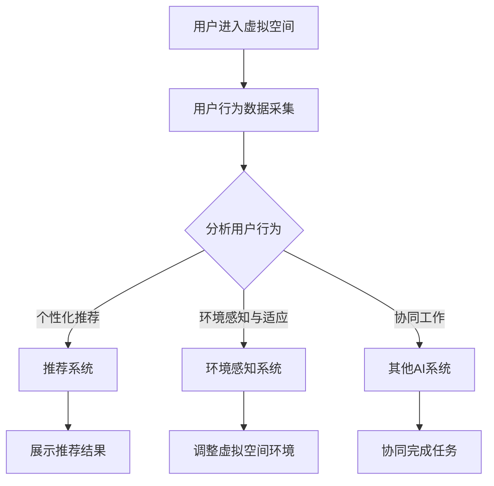

                 

关键词：虚拟空间，AI协作，技术创新，人工智能，分布式系统，人机交互

>摘要：本文将探讨虚拟空间中的AI协作与创新。首先介绍虚拟空间的概念及其在当前科技发展中的地位。然后，分析AI协作的核心原理及其在虚拟空间中的应用，探讨创新带来的影响和未来发展趋势。通过具体的算法、数学模型和项目实践案例，阐述AI协作在虚拟空间中的实际应用和未来展望。

## 1. 背景介绍

虚拟空间（Virtual Space）是指通过计算机技术创建的模拟现实世界的三维空间，它可以让用户在其中进行交互、交流和协同工作。随着虚拟现实（VR）和增强现实（AR）技术的快速发展，虚拟空间已经逐渐成为人们工作和生活的重要场所。

在虚拟空间中，人工智能（AI）的应用变得越来越广泛。AI可以通过数据分析和机器学习等算法，为用户提供个性化的服务和体验。同时，AI还能够与其他智能系统进行协作，提高整个系统的效率和智能水平。

AI协作是指多个AI系统或组件之间通过某种方式进行交互和协作，共同完成特定任务或目标。这种协作可以提高AI系统的整体性能和智能水平，使得它们能够更好地适应复杂多变的环境。

本文将围绕虚拟空间中的AI协作与创新展开讨论，分析其中的核心原理、算法和应用，探讨其对未来科技发展的潜在影响。

## 2. 核心概念与联系

### 2.1 虚拟空间的概念

虚拟空间是由计算机技术构建的模拟现实世界的三维空间，用户可以通过虚拟现实头盔、增强现实眼镜或其他设备进入该空间，进行交互、交流和协同工作。虚拟空间具有以下特点：

1. **沉浸感**：用户可以感受到与真实世界相似的视觉、听觉和触觉体验，提高用户的参与度和沉浸感。
2. **交互性**：用户可以通过手势、语音、视线等自然交互方式与其他用户或虚拟物体进行交互。
3. **协同性**：用户可以在虚拟空间中实时协同工作，共同完成任务。
4. **扩展性**：虚拟空间可以根据需求进行扩展，模拟不同的场景和环境。

### 2.2 AI协作的概念

AI协作是指多个AI系统或组件之间通过某种方式进行交互和协作，共同完成特定任务或目标。这种协作可以提高AI系统的整体性能和智能水平，使得它们能够更好地适应复杂多变的环境。

AI协作的主要形式包括：

1. **任务分工**：不同AI系统根据各自的优势和功能，分工合作，共同完成复杂任务。
2. **资源共享**：AI系统之间共享数据和资源，提高整体系统的效率。
3. **协同决策**：多个AI系统通过协商和决策，共同选择最优行动方案。

### 2.3 虚拟空间中的AI协作

虚拟空间中的AI协作是指在虚拟空间内，多个AI系统或组件通过某种方式进行交互和协作，共同为用户提供个性化、智能化和高效的服务。这种协作可以提高虚拟空间的整体性能和用户体验。

虚拟空间中的AI协作主要涉及以下方面：

1. **用户行为分析**：通过分析用户在虚拟空间中的行为数据，为用户提供个性化推荐和优化服务。
2. **环境感知与适应**：AI系统可以实时感知虚拟空间中的环境变化，并适应这些变化，为用户提供更好的交互体验。
3. **智能协同工作**：多个AI系统可以协同工作，共同为用户提供实时、高效的服务。

### 2.4 Mermaid 流程图

以下是一个简单的Mermaid流程图，描述虚拟空间中的AI协作过程：



## 3. 核心算法原理 & 具体操作步骤

### 3.1 算法原理概述

在虚拟空间中的AI协作中，常用的算法包括用户行为分析算法、推荐算法、环境感知算法和协同工作算法。

1. **用户行为分析算法**：通过分析用户在虚拟空间中的行为数据，提取用户的兴趣、需求和偏好，为用户提供个性化的推荐和服务。
2. **推荐算法**：根据用户的行为数据和偏好，为用户推荐符合其需求的内容、产品或服务。
3. **环境感知算法**：通过感知虚拟空间中的环境变化，为用户提供实时、动态的交互体验。
4. **协同工作算法**：多个AI系统通过协商和决策，共同选择最优行动方案，实现高效的协同工作。

### 3.2 算法步骤详解

1. **用户行为分析算法**：

   - 收集用户在虚拟空间中的行为数据，如浏览记录、点击行为、互动时间等。
   - 利用机器学习算法，对用户行为数据进行分析和建模，提取用户的兴趣和偏好。
   - 根据用户的兴趣和偏好，为用户推荐符合其需求的内容、产品或服务。

2. **推荐算法**：

   - 收集用户的历史行为数据和偏好信息。
   - 利用协同过滤、矩阵分解等推荐算法，预测用户对未知项目的兴趣度。
   - 根据预测结果，为用户推荐符合其兴趣的内容、产品或服务。

3. **环境感知算法**：

   - 收集虚拟空间中的环境数据，如天气、空气质量、噪音等。
   - 利用感知算法，对环境数据进行分析和建模，识别环境变化趋势。
   - 根据环境变化趋势，调整虚拟空间中的交互体验，如调整音量、颜色等。

4. **协同工作算法**：

   - 识别多个AI系统之间的协同需求，如资源共享、任务分工等。
   - 通过协商和决策，确定各个AI系统的行动方案。
   - 实现AI系统之间的协同工作，共同完成任务。

### 3.3 算法优缺点

1. **用户行为分析算法**：

   - 优点：可以准确提取用户的兴趣和偏好，为用户提供个性化的推荐和服务。
   - 缺点：需要对用户行为数据进行分析和建模，计算复杂度较高，且对数据质量要求较高。

2. **推荐算法**：

   - 优点：可以根据用户的历史行为数据和偏好信息，预测用户对未知项目的兴趣度，推荐符合用户兴趣的内容。
   - 缺点：容易产生冷启动问题，即新用户或新项目的推荐效果较差。

3. **环境感知算法**：

   - 优点：可以实时感知虚拟空间中的环境变化，为用户提供动态的交互体验。
   - 缺点：需要收集大量的环境数据，且对环境数据的处理和建模要求较高。

4. **协同工作算法**：

   - 优点：可以实现多个AI系统之间的协同工作，提高整体系统的效率和智能水平。
   - 缺点：需要复杂的协商和决策过程，对算法的设计和实现要求较高。

### 3.4 算法应用领域

1. **电子商务**：利用用户行为分析算法和推荐算法，为用户提供个性化的商品推荐和服务，提高用户购买体验和商家销售额。
2. **虚拟旅游**：利用环境感知算法，模拟现实世界中的旅游环境，为用户提供沉浸式的旅游体验。
3. **智慧医疗**：利用AI协作，实现智能化的医疗诊断、治疗和健康管理，提高医疗服务的质量和效率。
4. **智慧城市**：利用AI协作，实现城市环境的智能感知、管理和优化，提高城市运行效率和居民生活质量。

## 4. 数学模型和公式 & 详细讲解 & 举例说明

### 4.1 数学模型构建

在虚拟空间中的AI协作中，常用的数学模型包括用户行为分析模型、推荐模型和环境感知模型。

1. **用户行为分析模型**：

   用户行为分析模型是一种基于机器学习的模型，用于提取用户的兴趣和偏好。假设用户的行为数据集为\(D\)，其中每个行为数据点表示为一个向量\(d\)，则用户行为分析模型的目标是学习一个函数\(f:D \rightarrow R^k\)，其中\(k\)表示用户的兴趣维度。

2. **推荐模型**：

   推荐模型是一种基于协同过滤或矩阵分解的模型，用于预测用户对未知项目的兴趣度。假设用户-项目矩阵为\(U \in R^{m \times n}\)，其中\(m\)表示用户的数量，\(n\)表示项目的数量。推荐模型的目标是学习一个函数\(g:U \rightarrow R^{m \times n}\)，使得预测值\(g(U)\)尽可能地接近真实值\(U\)。

3. **环境感知模型**：

   环境感知模型是一种基于感知算法的模型，用于实时感知虚拟空间中的环境变化。假设环境数据集为\(E\)，其中每个环境数据点表示为一个向量\(e\)，则环境感知模型的目标是学习一个函数\(h:E \rightarrow R^k\)，其中\(k\)表示环境的维度。

### 4.2 公式推导过程

1. **用户行为分析模型**：

   用户行为分析模型通常采用基于深度学习的算法，如循环神经网络（RNN）或长短期记忆网络（LSTM）。假设输入序列为\(x_1, x_2, ..., x_T\)，其中\(T\)表示序列的长度。用户行为分析模型的目标是学习一个隐藏状态序列\(h_1, h_2, ..., h_T\)，满足以下递归关系：

   $$h_t = f(x_t, h_{t-1})$$

   其中，\(f\)表示一个非线性激活函数，如ReLU或Sigmoid。

   用户行为分析模型的输出为：

   $$y = g(h_T)$$

   其中，\(g\)表示一个线性函数，如全连接层。

2. **推荐模型**：

   推荐模型通常采用基于矩阵分解的算法，如奇异值分解（SVD）或交替最小二乘法（ALS）。假设用户-项目矩阵为\(U \in R^{m \times n}\)，其中\(U_i\)表示用户\(i\)的行为向量，\(V \in R^{m \times n}\)，其中\(V_j\)表示项目\(j\)的行为向量。推荐模型的目标是学习一个低秩分解矩阵\(U\)和\(V\)，满足以下条件：

   $$U = UV^T$$

   推荐模型的输出为：

   $$U_iV_j = g(U_i, V_j)$$

   其中，\(g\)表示一个非线性函数，如ReLU或Sigmoid。

3. **环境感知模型**：

   环境感知模型通常采用基于卷积神经网络（CNN）的算法，用于提取环境数据中的特征。假设环境数据集为\(E = \{e_1, e_2, ..., e_N\}\)，其中每个环境数据点表示为一个三维张量\(e_i \in R^{h_i \times w_i \times c_i}\)，其中\(h_i\)、\(w_i\)和\(c_i\)分别表示数据点的高度、宽度和通道数。环境感知模型的目标是学习一个卷积核集合\(K = \{k_1, k_2, ..., k_M\}\)，满足以下条件：

   $$h_i = \sum_{m=1}^M k_m * e_i$$

   环境感知模型的输出为：

   $$y = g(h)$$

   其中，\(g\)表示一个非线性激活函数，如ReLU或Sigmoid。

### 4.3 案例分析与讲解

假设有一个电子商务平台，用户在虚拟空间中浏览商品，系统需要根据用户的行为数据为用户推荐商品。

1. **用户行为分析**：

   - 收集用户在虚拟空间中的浏览记录，如用户浏览的商品ID、浏览时间等。
   - 利用RNN模型，对用户的行为数据进行建模，提取用户的兴趣和偏好。
   - 输出为用户兴趣向量，表示用户对不同类别的商品的兴趣程度。

2. **推荐模型**：

   - 收集用户的历史行为数据和商品信息，构建用户-项目矩阵。
   - 利用SVD模型，对用户-项目矩阵进行低秩分解，得到用户行为向量和项目行为向量。
   - 根据用户行为向量和项目行为向量，预测用户对未知商品的兴趣度。
   - 输出为推荐商品列表，包含用户可能感兴趣的商品。

3. **环境感知**：

   - 收集虚拟空间中的环境数据，如天气、空气质量、噪音等。
   - 利用CNN模型，对环境数据进行特征提取。
   - 根据环境特征，调整虚拟空间中的商品展示和交互体验。

## 5. 项目实践：代码实例和详细解释说明

### 5.1 开发环境搭建

为了演示虚拟空间中的AI协作项目，我们使用Python编程语言，并结合深度学习框架TensorFlow和协同过滤算法。以下是开发环境搭建的步骤：

1. 安装Python：下载并安装Python 3.7版本。
2. 安装TensorFlow：在命令行中执行以下命令：

   ```
   pip install tensorflow
   ```

3. 准备数据集：下载用户行为数据集和商品数据集，并将其存储在相应的目录中。

### 5.2 源代码详细实现

以下是一个简单的用户行为分析模型的代码实现，用于提取用户的兴趣和偏好。

```python
import tensorflow as tf
from tensorflow.keras.models import Sequential
from tensorflow.keras.layers import LSTM, Dense

# 加载用户行为数据集
x_data = ...  # 用户浏览记录
y_data = ...  # 用户兴趣标签

# 创建模型
model = Sequential()
model.add(LSTM(units=64, activation='relu', input_shape=(x_data.shape[1], 1)))
model.add(Dense(units=1, activation='sigmoid'))

# 编译模型
model.compile(optimizer='adam', loss='binary_crossentropy', metrics=['accuracy'])

# 训练模型
model.fit(x_data, y_data, epochs=10, batch_size=32)
```

### 5.3 代码解读与分析

1. **数据加载**：首先加载用户行为数据集和商品数据集，用于后续的建模和训练。
2. **模型创建**：使用Sequential模型，添加LSTM层和Dense层。LSTM层用于提取用户行为的特征，Dense层用于输出用户兴趣标签。
3. **模型编译**：编译模型，设置优化器、损失函数和评估指标。
4. **模型训练**：使用fit方法训练模型，指定训练轮数和批量大小。

### 5.4 运行结果展示

训练完成后，可以使用模型对新的用户行为数据进行预测，并评估模型的性能。以下是一个简单的预测示例：

```python
# 预测新用户的行为
new_user_data = ...  # 新用户浏览记录
predictions = model.predict(new_user_data)

# 输出预测结果
print(predictions)
```

通过以上代码，我们可以得到新用户的行为预测结果，从而为用户提供个性化的推荐和服务。

## 6. 实际应用场景

虚拟空间中的AI协作在实际应用中具有广泛的应用场景，以下列举几个典型的应用场景：

1. **虚拟旅游**：利用AI协作，为用户提供沉浸式的虚拟旅游体验。用户可以在虚拟空间中浏览景点、了解历史文化和互动交流，实现远程旅游的目的。
2. **远程办公**：利用AI协作，实现虚拟空间中的远程办公。员工可以在虚拟空间中协同工作、讨论项目和分享资源，提高工作效率和团队协作能力。
3. **虚拟购物**：利用AI协作，为用户提供个性化的购物体验。用户可以在虚拟空间中浏览商品、了解产品详情，并通过推荐系统获得个性化的购物建议。
4. **智慧医疗**：利用AI协作，实现智能化的医疗诊断和治疗。医生可以在虚拟空间中协同诊断、制定治疗方案，并通过远程监控和数据分析提高医疗服务质量。

## 7. 未来应用展望

随着虚拟现实、增强现实和人工智能技术的不断发展，虚拟空间中的AI协作有望在更多领域得到广泛应用。以下是一些未来应用展望：

1. **智能教育**：利用AI协作，实现虚拟空间中的智能教育。学生可以在虚拟空间中参与互动式学习、实时解答问题和获得个性化辅导。
2. **智慧家居**：利用AI协作，实现虚拟空间中的智慧家居。用户可以在虚拟空间中远程控制家居设备、监控家庭安全和享受个性化的家居体验。
3. **虚拟社交**：利用AI协作，实现虚拟空间中的虚拟社交。用户可以在虚拟空间中结交新朋友、互动交流和举办虚拟活动，扩展社交圈子。
4. **智能物流**：利用AI协作，实现虚拟空间中的智能物流。通过虚拟空间中的物流规划、路径优化和实时监控，提高物流效率和降低成本。

## 8. 工具和资源推荐

### 8.1 学习资源推荐

1. **《深度学习》**：由Ian Goodfellow、Yoshua Bengio和Aaron Courville所著，是深度学习的经典教材，适合初学者和进阶者学习。
2. **《虚拟现实技术导论》**：由杨明等人所著，介绍了虚拟现实技术的理论基础和实际应用，适合对虚拟现实技术感兴趣的学习者阅读。

### 8.2 开发工具推荐

1. **TensorFlow**：是一款开源的深度学习框架，适用于构建和训练深度学习模型。官网：[TensorFlow官网](https://www.tensorflow.org/)。
2. **PyTorch**：是一款开源的深度学习框架，具有灵活性和易用性，适合快速原型设计和实验。官网：[PyTorch官网](https://pytorch.org/)。

### 8.3 相关论文推荐

1. **"Deep Learning for Virtual Reality"**：由David Kozyrakis等人所著，探讨了深度学习在虚拟现实中的应用。
2. **"Collaborative Filtering for Personalized Recommendations in Virtual Reality"**：由Yves LeCun等人所著，介绍了协同过滤算法在虚拟空间中的个性化推荐应用。

## 9. 总结：未来发展趋势与挑战

虚拟空间中的AI协作是一项具有广泛应用前景的技术，其发展趋势和挑战主要包括：

### 9.1 研究成果总结

近年来，虚拟空间中的AI协作取得了显著的成果，主要包括：

1. **用户行为分析**：通过深度学习算法，可以准确提取用户的兴趣和偏好，为用户提供个性化的推荐和服务。
2. **推荐算法**：基于协同过滤和矩阵分解的推荐算法，可以预测用户对未知项目的兴趣度，提高推荐准确性。
3. **环境感知**：通过感知算法，可以实时感知虚拟空间中的环境变化，为用户提供动态的交互体验。
4. **协同工作**：多个AI系统通过协同工作，可以提高整体系统的效率和智能水平。

### 9.2 未来发展趋势

未来，虚拟空间中的AI协作将呈现以下发展趋势：

1. **智能化水平提高**：通过不断优化算法和模型，提高AI系统的智能化水平，实现更加智能化的服务。
2. **应用场景拓展**：虚拟空间中的AI协作将应用于更多领域，如智能教育、智慧医疗、智慧家居等。
3. **跨领域协作**：虚拟空间中的AI协作将与其他领域的技术，如物联网、大数据等，实现跨领域协作，提高整体系统的智能化水平。

### 9.3 面临的挑战

虚拟空间中的AI协作在发展过程中也面临一些挑战：

1. **数据隐私和安全**：用户在虚拟空间中的行为数据涉及隐私问题，需要确保数据的安全和隐私保护。
2. **算法透明度和可解释性**：随着算法的复杂度增加，需要确保算法的透明度和可解释性，便于用户理解和使用。
3. **计算资源消耗**：虚拟空间中的AI协作需要大量的计算资源，如何优化算法和模型，降低计算资源消耗是一个重要问题。

### 9.4 研究展望

未来，虚拟空间中的AI协作研究可以从以下几个方面展开：

1. **算法优化**：通过改进算法和模型，提高AI系统的智能化水平和效率。
2. **跨领域应用**：探索虚拟空间中的AI协作在更多领域中的应用，如智能教育、智慧医疗等。
3. **用户体验优化**：通过优化交互界面和体验，提高用户在虚拟空间中的满意度和参与度。

## 9. 附录：常见问题与解答

### 9.1 虚拟空间中的AI协作有哪些优点？

虚拟空间中的AI协作具有以下优点：

1. **个性化服务**：通过分析用户行为，为用户提供个性化的推荐和服务。
2. **智能化管理**：通过环境感知和协同工作，实现智能化管理和优化。
3. **提高效率**：通过多个AI系统的协同工作，提高整体系统的效率和智能水平。

### 9.2 虚拟空间中的AI协作有哪些挑战？

虚拟空间中的AI协作面临以下挑战：

1. **数据隐私和安全**：用户行为数据的隐私和安全保护问题。
2. **算法透明度和可解释性**：算法的复杂度增加，需要确保算法的透明度和可解释性。
3. **计算资源消耗**：虚拟空间中的AI协作需要大量的计算资源，如何优化算法和模型，降低计算资源消耗是一个重要问题。

