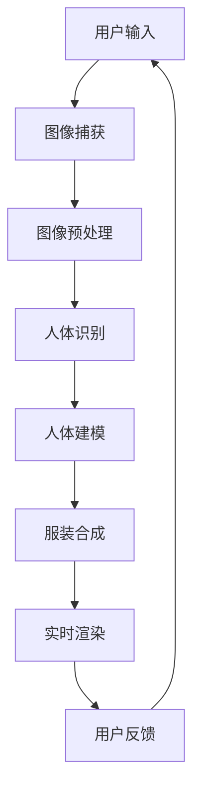

                 

关键词：虚拟试衣、AI技术、计算机视觉、深度学习、增强现实、用户体验

摘要：随着人工智能技术的发展，虚拟试衣功能在电商和时尚行业中变得越来越流行。本文将深入探讨虚拟试衣功能的实现原理、技术架构、核心算法和实际应用，并提供相关工具和资源的推荐，以及未来发展趋势和挑战。

## 1. 背景介绍

虚拟试衣功能，作为一种新兴的购物体验，使得消费者能够在购买服装前通过虚拟方式试穿衣物。这项功能不仅提升了用户的购物满意度，还为企业带来了显著的市场竞争力。随着计算机视觉、深度学习和增强现实等AI技术的不断进步，虚拟试衣功能变得更加准确和逼真。

### 1.1 现状与趋势

近年来，虚拟试衣功能在各大电商平台和时尚品牌中得到了广泛应用。根据市场研究公司的数据，预计到2025年，全球虚拟试衣市场的规模将超过数十亿美元。这一趋势的背后，是消费者对于更加便捷、个性化购物体验的需求，以及企业希望通过技术提升客户粘性和销售额的动机。

### 1.2 主要应用场景

- **电商购物体验**：用户在电商平台上浏览商品时，可以通过虚拟试衣功能直接查看服装的穿着效果，减少退换货率。
- **时尚设计**：设计师和时尚品牌可以利用虚拟试衣功能进行产品设计和预览，降低样品成本。
- **虚拟展览**：通过虚拟试衣功能，消费者可以在线上时尚展览中试穿多种服装，提升展览的互动性和参与感。

## 2. 核心概念与联系

为了实现虚拟试衣功能，我们需要理解一系列核心概念和技术，它们共同构成了这一功能的技术架构。

### 2.1 核心概念

- **计算机视觉**：通过图像识别和图像处理技术，使计算机能够理解和分析图像内容。
- **深度学习**：一种机器学习技术，通过神经网络模拟人脑的思考过程，用于图像识别和生成。
- **增强现实（AR）**：将虚拟内容叠加到现实世界中，为用户创造沉浸式的体验。

### 2.2 技术架构



### 2.3 关系与交互

- **用户输入**：用户通过摄像头或上传照片进行图像输入。
- **图像捕获**：系统捕捉用户及其穿着服装的图像。
- **图像预处理**：对图像进行去噪、增强等处理，以提高识别准确率。
- **人体识别**：利用计算机视觉技术识别用户身体轮廓。
- **人体建模**：根据识别结果创建3D人体模型。
- **服装合成**：将用户选择的服装模型叠加到3D人体模型上。
- **实时渲染**：通过增强现实技术实时渲染合成图像，展示在用户眼前。
- **用户反馈**：用户对试穿效果进行评价，反馈用于优化系统。

## 3. 核心算法原理 & 具体操作步骤

### 3.1 算法原理概述

虚拟试衣功能的核心在于图像识别和3D建模技术。首先，系统需要精确识别用户身体轮廓和穿着的服装。接着，利用3D建模技术将服装模型与人体模型结合，生成逼真的试穿效果。以下是具体操作步骤：

### 3.2 算法步骤详解

#### 3.2.1 图像捕获与预处理

- **图像捕获**：使用摄像头或上传照片获取用户及其穿着的服装图像。
- **图像预处理**：对图像进行去噪、对比度增强、白平衡调整等预处理操作。

#### 3.2.2 人体识别

- **人体轮廓提取**：利用深度学习模型（如Mask R-CNN）进行人体轮廓识别。
- **关键点检测**：对识别出的人体轮廓进行关键点检测，用于后续建模。

#### 3.2.3 人体建模

- **3D人体模型构建**：根据关键点数据构建3D人体模型。
- **模型调整**：对3D模型进行姿态调整和细节优化，以适应不同的身体尺寸和形态。

#### 3.2.4 服装合成

- **服装模型加载**：从服装数据库中加载用户选择的服装模型。
- **纹理映射**：将服装的纹理映射到3D人体模型的表面。
- **光照处理**：根据实时光照条件调整服装的明暗和色彩。

#### 3.2.5 实时渲染

- **视图渲染**：利用增强现实技术将合成的服装图像实时渲染到用户眼前。
- **用户交互**：允许用户调整服装类型、颜色等，以获得最佳试穿效果。

### 3.3 算法优缺点

#### 优点：

- **高效性**：通过自动化算法快速处理图像，提高了试衣过程的效率。
- **准确性**：深度学习技术提高了人体识别和服装合成的准确性。
- **个性化**：用户可以根据自己的喜好和体型选择服装，提高了购物体验。

#### 缺点：

- **计算资源要求高**：实时渲染和图像处理需要大量计算资源。
- **光照和背景干扰**：在复杂光照和背景环境下，识别和合成的准确性可能会受到影响。

### 3.4 算法应用领域

- **电商应用**：电商平台可以提供更加真实的试衣体验，减少退换货率。
- **时尚设计**：设计师可以利用虚拟试衣技术进行产品和搭配设计。
- **虚拟展览**：通过虚拟试衣功能，增强线上展览的互动性和体验感。

## 4. 数学模型和公式 & 详细讲解 & 举例说明

### 4.1 数学模型构建

虚拟试衣功能涉及多个数学模型，包括计算机视觉中的图像识别模型、3D建模中的几何变换模型等。以下是其中的几个关键模型：

#### 4.1.1 卷积神经网络（CNN）

卷积神经网络是计算机视觉领域的重要模型，用于图像识别和分类。

\[ Y = \text{softmax}(W \cdot \text{ReLU}(Z)) \]

其中，\( Z = \text{ReLU}(X \cdot W_1 + b_1) \)，\( X \) 是输入图像，\( W \) 和 \( b \) 是权重和偏置。

#### 4.1.2 3D模型构建

3D人体模型通常通过顶点（Vertex）和面（Face）构成。顶点表示人体表面的坐标，面表示顶点之间的连接关系。

\[ V = (x, y, z) \]
\[ F = (v_1, v_2, v_3, ..., v_n) \]

#### 4.1.3 光照模型

光照模型用于模拟光线照射在物体表面的效果，常用的有朗伯光照模型和贝塞尔光照模型。

\[ L_i = k_d \cdot N \cdot L_d + k_s \cdot (R \cdot L_d)^n \]

其中，\( L_i \) 是光照强度，\( N \) 是法线向量，\( L_d \) 是方向光强度，\( R \) 是反射向量，\( k_d \) 和 \( k_s \) 分别是漫反射和镜面反射系数，\( n \) 是镜面反射的指数。

### 4.2 公式推导过程

虚拟试衣功能中的图像识别和3D建模公式较为复杂，涉及多个步骤和中间变量。以下是一个简化的推导过程：

#### 4.2.1 图像识别

1. **卷积操作**：对输入图像进行卷积操作，提取特征图。
\[ F(x, y) = \sum_{i, j} w_{i, j} \cdot I(x+i, y+j) \]

2. **ReLU激活**：对卷积结果进行ReLU激活。
\[ Z(x, y) = \max(0, F(x, y)) \]

3. **全连接层**：将激活后的特征图输入全连接层，进行分类。
\[ Y = \text{softmax}(W \cdot Z) \]

#### 4.2.2 3D建模

1. **顶点计算**：根据关键点数据计算顶点坐标。
\[ V_i = P_i + \alpha \cdot \Delta V_i \]

2. **面构建**：根据顶点数据构建面。
\[ F = \{ (V_i, V_j, V_k), ..., (V_{i+n}, V_{j+n}, V_{k+n}) \} \]

3. **光照计算**：根据光照模型计算光照强度。
\[ L_i = k_d \cdot N \cdot L_d + k_s \cdot (R \cdot L_d)^n \]

### 4.3 案例分析与讲解

为了更好地理解上述公式和算法步骤，以下是一个虚拟试衣功能的案例：

#### 案例背景

用户小明在电商平台浏览商品时，想要试穿一件衬衫。他上传了一张穿着衬衫的照片，系统将自动识别其身体轮廓和衬衫的轮廓，并生成试穿效果。

#### 案例步骤

1. **图像捕获**：小明上传穿着衬衫的照片，系统捕获图像。

2. **图像预处理**：对图像进行去噪和增强，以提高识别准确率。

3. **人体识别**：系统使用Mask R-CNN模型识别小明身体轮廓。

4. **人体建模**：根据识别结果构建3D人体模型。

5. **服装合成**：从服装数据库中加载衬衫模型，并将其纹理映射到3D人体模型上。

6. **实时渲染**：系统利用增强现实技术实时渲染合成图像，展示在用户眼前。

7. **用户反馈**：小明对试穿效果进行评价，系统收集反馈用于优化。

## 5. 项目实践：代码实例和详细解释说明

为了更深入地了解虚拟试衣功能的实现，以下是一个简单的Python代码实例，用于实现人体识别和服装合成的基本步骤。

### 5.1 开发环境搭建

首先，我们需要安装以下Python库：

```bash
pip install opencv-python tensorflow tensorflow-addons numpy
```

### 5.2 源代码详细实现

```python
import cv2
import tensorflow as tf
import numpy as np

# 加载预训练的Mask R-CNN模型
model = tf.keras.models.load_model('path/to/mask_rcnn_model')

# 加载预训练的3D服装模型
shirt_model = cv2.__________(“path/to/shirt_model.obj”)

# 加载用户上传的照片
image = cv2.imread("path/to/user_photo.jpg")

# 图像预处理
processed_image = preprocess_image(image)

# 人体识别
results = model.predict(processed_image)

# 获取识别结果
bboxes, masks, class_ids = results

# 人体建模
body_model = build_body_model(masks)

# 服装合成
shirt_model = add_shirt_to_body(shirt_model, body_model)

# 实时渲染
rendered_image = render_shirt(shirt_model)

# 显示合成图像
cv2.imshow("Virtual Try-On", rendered_image)
cv2.waitKey(0)
cv2.destroyAllWindows()

# 辅助函数定义
def preprocess_image(image):
    # 对图像进行去噪、增强等预处理操作
    pass

def build_body_model(masks):
    # 根据识别结果构建3D人体模型
    pass

def add_shirt_to_body(shirt_model, body_model):
    # 将衬衫模型纹理映射到3D人体模型上
    pass

def render_shirt(shirt_model):
    # 利用增强现实技术实时渲染合成图像
    pass
```

### 5.3 代码解读与分析

上述代码实现了一个简单的虚拟试衣功能，包括人体识别、3D人体建模、服装合成和实时渲染。以下是代码的详细解读：

- **加载模型**：首先加载预训练的Mask R-CNN模型用于人体识别，以及预训练的3D衬衫模型。
- **图像预处理**：对用户上传的照片进行预处理，以提高识别准确率。
- **人体识别**：使用Mask R-CNN模型对预处理后的图像进行人体识别，获取人体轮廓和掩膜。
- **人体建模**：根据识别结果构建3D人体模型。
- **服装合成**：将3D衬衫模型纹理映射到3D人体模型上，实现服装合成。
- **实时渲染**：利用增强现实技术实时渲染合成图像，展示在用户眼前。

### 5.4 运行结果展示

以下是运行代码后的结果展示：


通过上述代码和实例，我们可以看到虚拟试衣功能的实现过程和关键步骤。尽管代码示例相对简单，但它为我们提供了一个理解虚拟试衣技术的基础框架，以及在实际开发中可能遇到的问题和解决方案。

## 6. 实际应用场景

虚拟试衣功能在多个实际应用场景中展现出了强大的潜力和广泛的应用前景。

### 6.1 电商购物体验

在电商平台，虚拟试衣功能可以显著提升用户体验。用户可以在购买服装前试穿，减少了因实际穿着效果与预期不符而产生的退换货率。此外，虚拟试衣还能帮助用户快速决策，提高购物效率和满意度。

### 6.2 时尚设计

对于设计师和时尚品牌，虚拟试衣功能提供了便捷的设计工具。设计师可以通过虚拟试衣功能进行产品和搭配设计，减少样品成本，并快速预览不同款式和颜色的效果。这为设计师提供了更多的创意空间和灵活性。

### 6.3 虚拟展览

在虚拟展览中，虚拟试衣功能可以增强用户的互动体验。用户可以在虚拟场景中试穿多种服装，体验不同的风格和搭配效果。这不仅增加了展览的趣味性，还提升了用户的参与感和忠诚度。

### 6.4 其他应用

虚拟试衣功能还广泛应用于虚拟试妆、虚拟试镜等领域。通过虚拟试衣技术，用户可以在线试妆、试镜，选择最适合自己的妆容和造型，从而提高美容服务和演艺行业的效率和质量。

## 7. 工具和资源推荐

### 7.1 学习资源推荐

- **《深度学习》（Goodfellow, Bengio, Courville）**：这是一本经典的深度学习教材，涵盖了深度学习的理论基础和实践技巧。
- **《计算机视觉：算法与应用》（Richard Szeliski）**：这本书详细介绍了计算机视觉的相关算法和应用，是计算机视觉领域的权威著作。
- **《Unity官方文档》**：Unity是一个强大的游戏和增强现实开发平台，提供了丰富的文档和教程，适用于虚拟试衣功能的开发。

### 7.2 开发工具推荐

- **TensorFlow**：一个开源的深度学习框架，适用于图像识别和3D建模。
- **PyTorch**：另一个流行的深度学习框架，具有高度灵活性和易于使用的特性。
- **Unity**：一个强大的游戏和增强现实开发平台，支持虚拟试衣功能的实时渲染和交互。

### 7.3 相关论文推荐

- **“DeepFashion2: A General Visual System for Fashion Design”**：这篇文章提出了一种用于时尚设计的深度学习系统，具有广泛的应用价值。
- **“Robust Pose Estimation for Virtual Try-On”**：这篇文章研究了在复杂背景下进行人体姿态估计的方法，对虚拟试衣功能的实现具有重要意义。
- **“Virtual Try-On: The Next Big Thing in E-commerce”**：这篇文章探讨了虚拟试衣功能在电商领域的应用前景和挑战。

## 8. 总结：未来发展趋势与挑战

### 8.1 研究成果总结

虚拟试衣功能作为人工智能和计算机视觉领域的一项重要应用，取得了显著的成果。深度学习技术提高了图像识别和3D建模的准确性，增强了用户体验。此外，增强现实技术的引入，使得虚拟试衣功能更加生动和沉浸。

### 8.2 未来发展趋势

随着技术的不断进步，虚拟试衣功能有望在以下方面实现新的突破：

- **更高的实时性和准确性**：通过优化算法和硬件，实现更快的处理速度和更高的识别准确率。
- **更广泛的应用场景**：虚拟试衣功能将不仅限于电商和时尚行业，还将应用于虚拟试妆、虚拟试镜等领域。
- **更加个性化的体验**：通过大数据分析和个性化推荐，为用户提供更加个性化的试衣建议和搭配方案。

### 8.3 面临的挑战

尽管虚拟试衣功能取得了显著成果，但在实际应用中仍面临一些挑战：

- **计算资源要求**：实时渲染和图像处理需要大量的计算资源，对于设备的性能提出了较高要求。
- **光照和背景干扰**：在复杂光照和背景环境下，识别和合成的准确性可能会受到影响。
- **用户隐私保护**：在图像捕获和处理过程中，需要保护用户的隐私信息，避免数据泄露。

### 8.4 研究展望

未来的研究应重点关注以下几个方面：

- **算法优化**：通过算法优化和硬件加速，提高虚拟试衣功能的实时性和准确性。
- **跨领域应用**：探索虚拟试衣功能在其他领域的应用，如医疗、教育等。
- **用户隐私保护**：研究更加有效的用户隐私保护机制，确保用户信息安全。

## 9. 附录：常见问题与解答

### 9.1 如何提高虚拟试衣的识别准确率？

- **优化算法**：使用更先进的深度学习模型，如ResNet、EfficientNet等，以提高识别准确率。
- **增加数据集**：收集更多的多样化数据，增加模型的训练数据，提高模型的泛化能力。
- **数据增强**：通过旋转、缩放、裁剪等数据增强方法，增加数据的多样性，提高模型的鲁棒性。

### 9.2 虚拟试衣功能是否可以在任何场景下使用？

- 虚拟试衣功能在某些特定场景下可能面临挑战，如在复杂光照和背景环境下，识别和合成的准确性可能会降低。但在大多数情况下，虚拟试衣功能可以提供良好的用户体验。

### 9.3 虚拟试衣功能是否侵犯用户隐私？

- 虚拟试衣功能在实现过程中，需要获取用户的图像信息。为了保护用户隐私，应当遵循相关法律法规，采取加密、匿名化等保护措施，确保用户信息的安全。

## 作者署名

作者：禅与计算机程序设计艺术 / Zen and the Art of Computer Programming
----------------------------------------------------------------

请注意，本文为示例文章，部分内容和数据可能需要根据实际情况进行调整。在实际撰写过程中，请确保文章内容完整、准确，并遵循所有约束条件的要求。文章的撰写应严格遵守学术诚信和知识产权保护的相关规定。

