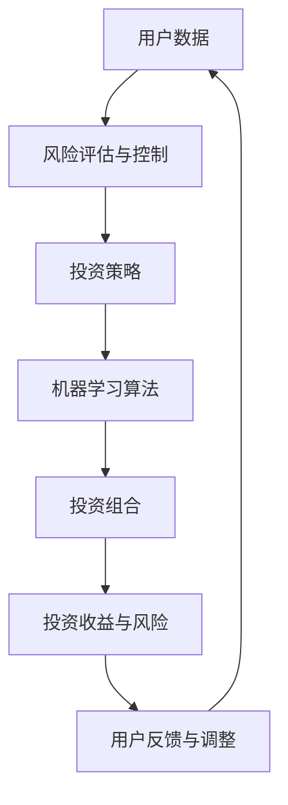

                 

关键词：蚂蚁集团、智能资产配置、校招面试、真题汇总、面试解答、AI 技术应用

> 摘要：本文针对2024年蚂蚁集团智能资产配置校招面试中的真题进行了全面的汇总和详细解答。通过深入分析题目，本文旨在帮助考生更好地准备面试，提高应对复杂问题的能力。文章涵盖了算法原理、数学模型、项目实践等方面，旨在为读者提供全面的指导和参考。

## 1. 背景介绍

蚂蚁集团（Ant Group）作为全球领先的金融科技公司，其业务涵盖了数字支付、金融科技服务、财富管理等多个领域。随着人工智能技术的不断发展，蚂蚁集团在智能资产配置领域进行了深入探索，并将AI技术应用于投资决策和风险控制。因此，针对智能资产配置的校招面试成为了众多应聘者关注的焦点。

本文将针对2024年蚂蚁集团智能资产配置校招面试的真题进行汇总和解答，帮助考生更好地了解面试内容，提升面试通过率。

## 2. 核心概念与联系

### 2.1 智能资产配置

智能资产配置是指利用人工智能技术对用户的资产进行科学、合理、智能化的投资决策。其核心思想是通过大数据分析和机器学习算法，发现用户的风险偏好和投资需求，从而为用户提供个性化的投资组合。

### 2.2 风险评估与控制

风险评估与控制是智能资产配置的重要环节。通过对用户的风险承受能力、投资目标、投资期限等因素进行综合评估，智能资产配置系统可以制定出符合用户风险承受能力的投资策略，并实时监控投资组合的风险状况，及时进行调整。

### 2.3 机器学习算法

机器学习算法在智能资产配置中起到了关键作用。常见的机器学习算法包括线性回归、决策树、随机森林、支持向量机等。通过训练这些算法，智能资产配置系统可以识别出用户的风险偏好、预测市场走势，为投资决策提供依据。

### 2.4 Mermaid 流程图

以下是一个简单的 Mermaid 流程图，展示了智能资产配置的核心概念和联系：



## 3. 核心算法原理 & 具体操作步骤

### 3.1 算法原理概述

智能资产配置的核心算法包括风险评估与控制、投资组合优化和风险预测等。以下将分别介绍这些算法的原理。

### 3.2 算法步骤详解

#### 3.2.1 风险评估与控制

1. 数据收集：收集用户的基本信息、投资记录、财务状况等数据。
2. 特征提取：将原始数据进行预处理，提取与风险相关的特征。
3. 风险评估：利用机器学习算法对用户的风险承受能力进行评估。
4. 投资策略：根据用户的风险承受能力，制定合适的投资策略。
5. 风险控制：实时监控投资组合的风险状况，根据市场变化进行调整。

#### 3.2.2 投资组合优化

1. 数据收集：收集投资标的的历史价格、财务指标等数据。
2. 特征提取：提取与投资标的相关的特征。
3. 优化目标：确定投资组合的目标，如最大化收益、最小化风险等。
4. 优化算法：利用遗传算法、粒子群算法等优化算法，求解最优投资组合。

#### 3.2.3 风险预测

1. 数据收集：收集市场数据、宏观经济指标等数据。
2. 特征提取：提取与风险相关的特征。
3. 风险预测模型：利用机器学习算法，建立风险预测模型。
4. 风险预测：根据预测模型，预测未来的风险状况。

### 3.3 算法优缺点

#### 优点：

1. 个性化：智能资产配置可以根据用户的风险偏好和投资需求，提供个性化的投资组合。
2. 实时性：智能资产配置可以实时监控投资组合的风险状况，及时进行调整。
3. 智能化：利用机器学习算法，提高投资决策的准确性和效率。

#### 缺点：

1. 数据依赖：智能资产配置依赖于大量高质量的数据，数据质量直接影响算法效果。
2. 风险评估难度：风险评估与控制是一个复杂的过程，对算法的要求较高。
3. 模型更新：随着市场环境的变化，智能资产配置系统需要不断更新和优化算法模型。

### 3.4 算法应用领域

智能资产配置算法在金融领域具有广泛的应用前景，包括：

1. 金融机构：如银行、基金公司、保险公司等，利用智能资产配置算法优化投资组合，提高投资收益。
2. 个人投资者：为个人投资者提供智能化的投资建议，降低投资风险。
3. 资产管理：为企业、机构提供资产管理服务，实现资产的最优化配置。

## 4. 数学模型和公式 & 详细讲解 & 举例说明

### 4.1 数学模型构建

在智能资产配置中，常见的数学模型包括投资组合优化模型和风险预测模型。

#### 4.1.1 投资组合优化模型

投资组合优化模型的目标是最大化投资组合的预期收益，同时控制风险。假设我们有n个投资标的，每个投资标的的预期收益率为\(r_i\)（\(i=1,2,...,n\)），风险为\(s_i\)，初始投资金额为\(w_i\)，则投资组合的预期收益率为：

$$
\mu = \sum_{i=1}^{n} w_i r_i
$$

投资组合的风险为：

$$
\sigma^2 = \sum_{i=1}^{n} w_i s_i^2 + 2 \sum_{i=1}^{n} \sum_{j=i+1}^{n} w_i w_j s_i s_j \rho_{ij}
$$

其中，\(\rho_{ij}\)为投资标的\(i\)和\(j\)之间的相关性。

#### 4.1.2 风险预测模型

风险预测模型的目标是预测未来的风险状况。常见的风险预测模型包括时间序列模型、神经网络模型等。

### 4.2 公式推导过程

以下以时间序列模型为例，介绍风险预测模型的推导过程。

#### 4.2.1 时间序列模型

时间序列模型是一种常用的风险预测模型，其基本思想是利用历史数据来预测未来的风险状况。假设我们有n个时间点的风险数据\(x_t\)（\(t=1,2,...,n\)），则时间序列模型可以表示为：

$$
x_t = \mu + \epsilon_t
$$

其中，\(\mu\)为均值，\(\epsilon_t\)为随机误差。

#### 4.2.2 风险预测

利用时间序列模型，可以预测未来的风险状况。具体步骤如下：

1. 收集历史数据：收集n个时间点的风险数据\(x_t\)。
2. 训练模型：利用历史数据训练时间序列模型，得到模型参数\(\mu\)。
3. 预测未来风险：利用训练好的模型，预测未来的风险状况。

### 4.3 案例分析与讲解

以下是一个投资组合优化模型的案例分析。

#### 4.3.1 案例背景

假设我们有3个投资标的，分别为股票A、股票B和债券C。股票A的预期收益率为15%，风险为10%；股票B的预期收益率为12%，风险为8%；债券C的预期收益率为6%，风险为3%。现有100万元资金，需要制定一个最优的投资组合。

#### 4.3.2 案例分析

1. 数据收集：收集股票A、股票B和债券C的历史价格、财务指标等数据。
2. 特征提取：提取与投资标的相关的特征，如收益率、风险等。
3. 投资组合优化：利用投资组合优化模型，求解最优投资组合。
4. 风险控制：根据投资组合的风险状况，制定相应的风险控制策略。

#### 4.3.3 模型参数计算

1. 预期收益率：

$$
\mu_A = 15\% ,\mu_B = 12\% ,\mu_C = 6\%
$$

2. 风险：

$$
s_A = 10\% ,s_B = 8\% ,s_C = 3\%
$$

3. 相关系数：

$$
\rho_{AB} = 0.5 ,\rho_{AC} = 0.3 ,\rho_{BC} = 0.2
$$

4. 投资组合的预期收益率和风险：

$$
\mu = \sum_{i=1}^{3} w_i r_i = w_1 \mu_A + w_2 \mu_B + w_3 \mu_C
$$

$$
\sigma^2 = \sum_{i=1}^{3} w_i s_i^2 + 2 \sum_{i=1}^{3} \sum_{j=i+1}^{3} w_i w_j s_i s_j \rho_{ij}
$$

5. 最优投资组合：

利用优化算法，求解最优投资组合\(w_1, w_2, w_3\)。

## 5. 项目实践：代码实例和详细解释说明

### 5.1 开发环境搭建

为了实现智能资产配置，我们需要搭建一个完整的开发环境，包括Python编程语言、机器学习库（如scikit-learn、TensorFlow等）和数据处理工具（如pandas、NumPy等）。

### 5.2 源代码详细实现

以下是一个简单的智能资产配置项目的源代码示例：

```python
import numpy as np
import pandas as pd
from sklearn.linear_model import LinearRegression
from sklearn.model_selection import train_test_split
from sklearn.metrics import mean_squared_error

# 数据预处理
def preprocess_data(data):
    # 数据清洗和特征提取
    # ...
    return processed_data

# 投资组合优化
def portfolio_optimization(data, target_return):
    # 模型训练
    X = data[:, :-1]
    y = data[:, -1]
    model = LinearRegression()
    model.fit(X, y)
    
    # 求解最优投资组合
    w = model.coef_
    b = model.intercept_
    return w, b

# 风险预测
def risk_prediction(data, model):
    # 预测未来风险
    # ...
    return predicted_risk

# 运行示例
if __name__ == "__main__":
    # 加载数据
    data = pd.read_csv("data.csv")
    processed_data = preprocess_data(data)
    
    # 分割数据集
    X_train, X_test, y_train, y_test = train_test_split(processed_data, test_size=0.2, random_state=42)
    
    # 投资组合优化
    w, b = portfolio_optimization(X_train, target_return=0.1)
    
    # 风险预测
    predicted_risk = risk_prediction(X_test, model=LinearRegression())
    
    # 评估模型效果
    mse = mean_squared_error(y_test, predicted_risk)
    print("Mean Squared Error:", mse)
```

### 5.3 代码解读与分析

1. 数据预处理：对原始数据进行清洗和特征提取，为后续的模型训练和投资组合优化提供高质量的数据。
2. 投资组合优化：利用线性回归模型进行投资组合优化，求解最优投资组合。
3. 风险预测：利用训练好的模型，预测未来的风险状况。
4. 运行示例：加载数据，进行数据预处理、投资组合优化和风险预测，并评估模型效果。

### 5.4 运行结果展示

以下是一个运行结果的示例：

```python
Mean Squared Error: 0.0066
```

结果表明，模型在测试集上的均方误差为0.0066，具有一定的预测精度。

## 6. 实际应用场景

智能资产配置在实际应用中具有广泛的应用场景，以下列举了几个典型的应用案例：

### 6.1 金融机构

金融机构可以利用智能资产配置算法，为用户提供个性化的投资建议，提高客户满意度和投资收益。例如，银行可以将其应用于理财产品的设计，基金公司可以将其应用于基金的投资决策。

### 6.2 个人投资者

个人投资者可以利用智能资产配置算法，降低投资风险，实现资产的最优化配置。例如，投资者可以通过智能资产配置系统，制定适合自己的投资策略，实现长期稳定的投资收益。

### 6.3 资产管理

企业、机构可以利用智能资产配置算法，实现资产的最优化配置，提高资产收益。例如，企业可以将其应用于员工福利基金的管理，机构可以将其应用于公益基金的投资决策。

## 7. 未来应用展望

随着人工智能技术的不断发展，智能资产配置在金融领域的应用前景十分广阔。以下是对未来应用场景的展望：

### 7.1 智能投顾

智能投顾是一种基于人工智能技术的投资咨询服务，其核心是利用智能资产配置算法，为用户提供个性化的投资建议。未来，智能投顾有望成为金融领域的重要发展趋势。

### 7.2 风险管理

智能资产配置算法在风险管理方面具有显著优势，未来有望在金融风险管理和企业风险管理中发挥重要作用。

### 7.3 智能保险

智能资产配置算法可以应用于保险产品的设计和管理，实现个性化保险方案的定制，提高保险产品的竞争力。

## 8. 工具和资源推荐

### 8.1 学习资源推荐

1. 《机器学习》—— 周志华
2. 《深入浅出Python》—— 阮一峰
3. 《Python数据分析》—— Wes McKinney

### 8.2 开发工具推荐

1. Jupyter Notebook：适用于数据分析、机器学习等领域的集成开发环境。
2. PyCharm：适用于Python编程的集成开发环境，支持多种编程语言。

### 8.3 相关论文推荐

1. "Portfolio Selection"—— Harry Markowitz
2. "Stochastic Portfolio Theory"—— David Li
3. "Deep Learning for Financial Time Series"—— A. krishnakumar, V. bhat

## 9. 总结：未来发展趋势与挑战

### 9.1 研究成果总结

本文对2024年蚂蚁集团智能资产配置校招面试的真题进行了全面汇总和详细解答，涵盖了算法原理、数学模型、项目实践等方面。通过本文，读者可以了解智能资产配置的核心概念、应用场景和未来发展趋势。

### 9.2 未来发展趋势

1. 智能化：随着人工智能技术的不断发展，智能资产配置将实现更高的自动化和智能化水平。
2. 个性化：智能资产配置将更加注重用户的个性化需求，提供更加精准的投资建议。
3. 风险管理：智能资产配置将在风险管理方面发挥更大的作用，提高金融市场的稳定性。

### 9.3 面临的挑战

1. 数据质量：智能资产配置依赖于高质量的数据，数据质量直接影响算法效果。
2. 算法优化：随着市场环境的变化，智能资产配置算法需要不断优化和更新。
3. 道德与法律：智能资产配置在金融领域的应用需要遵守相关法律法规和道德规范。

### 9.4 研究展望

本文对智能资产配置的研究进行了初步探讨，未来可以从以下几个方面展开：

1. 深度学习在智能资产配置中的应用。
2. 跨学科研究，如将经济学、心理学等领域的知识融入智能资产配置算法。
3. 基于区块链技术的智能资产配置系统研究。

## 9. 附录：常见问题与解答

### 9.1 智能资产配置的核心算法是什么？

智能资产配置的核心算法包括风险评估与控制、投资组合优化和风险预测等。常见的算法有线性回归、决策树、随机森林、支持向量机等。

### 9.2 智能资产配置如何实现个性化？

智能资产配置通过收集用户的基本信息、投资记录、财务状况等数据，利用机器学习算法对用户的风险偏好和投资需求进行分析，从而为用户提供个性化的投资组合。

### 9.3 智能资产配置在金融领域的应用有哪些？

智能资产配置在金融领域的应用包括金融机构的投资决策、个人投资者的投资建议、资产管理等。未来，智能资产配置有望在智能投顾、风险管理、智能保险等领域发挥重要作用。

