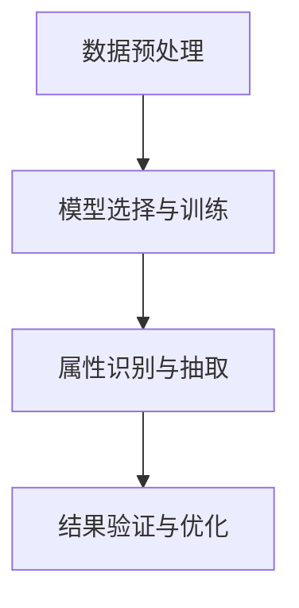

                 

关键词：商品属性抽取、人工智能、大模型、融合技术、机器学习、自然语言处理

> 摘要：本文深入探讨了融合人工智能大模型的商品属性抽取技术，分析了其核心概念与联系，详细阐述了核心算法原理与操作步骤，展示了数学模型和公式，并结合项目实践提供了代码实例和详细解释。文章还探讨了该技术的实际应用场景，并提出了未来应用展望和面临的挑战。

## 1. 背景介绍

随着互联网的普及和电子商务的快速发展，商品信息的数据量呈现出爆炸式增长。这些商品信息中包含大量的属性描述，如价格、品牌、型号、颜色等，这些属性对于电商平台、消费者以及各种商业分析都具有重要意义。然而，如何从大量的文本数据中高效、准确地抽取商品属性，成为一个重要的研究课题。

传统的方法主要依赖于规则匹配、统计学习等技术，但这些方法往往存在覆盖范围有限、准确性不高、可扩展性差等问题。随着深度学习技术的迅猛发展，尤其是大型预训练模型的出现，如BERT、GPT等，为商品属性抽取提供了新的思路。

商品属性抽取技术不仅能够提高电商平台的信息处理效率，还能为个性化推荐、用户行为分析、市场预测等提供重要支持。因此，研究融合人工智能大模型的商品属性抽取技术具有重要的现实意义和广阔的应用前景。

## 2. 核心概念与联系

### 2.1. 商品属性抽取的定义

商品属性抽取（Item Attribute Extraction）是指从商品描述文本中识别并提取出具体商品属性的过程。例如，从一段商品描述文本“这款苹果手机的价格是5999元，品牌是苹果，颜色有黑色、白色、金色”中抽取出的属性包括：价格（5999元）、品牌（苹果）、颜色（黑色、白色、金色）。

### 2.2. 人工智能大模型

人工智能大模型（Large-scale AI Models）是指具有海量训练数据和复杂网络结构的深度学习模型，如BERT、GPT等。这些模型通过大规模数据训练，能够捕捉到文本中的语义信息，实现高性能的自然语言处理任务。

### 2.3. 融合技术的概念

融合技术（Fusion Technology）是指将多种信息源或多个技术手段进行整合，以实现更高效、更准确的信息处理。在商品属性抽取中，融合技术可以将传统方法与人工智能大模型的优势结合起来，提高属性抽取的准确性和效率。

### 2.4. 融合技术的工作流程

融合技术的工作流程主要包括以下几个步骤：

1. 数据预处理：对原始商品描述文本进行清洗、分词、去停用词等操作，生成适合模型训练的数据集。
2. 模型选择与训练：选择合适的预训练模型，如BERT、GPT等，进行微调训练，使其能够适应商品属性抽取任务。
3. 属性识别与抽取：利用训练好的模型，对新的商品描述文本进行属性识别和抽取，得到具体的属性值。
4. 结果验证与优化：对抽取结果进行验证，识别错误并优化模型，提高属性抽取的准确性。

### 2.5. Mermaid 流程图

下面是商品属性抽取融合技术的工作流程 Mermaid 流程图：



## 3. 核心算法原理 & 具体操作步骤

### 3.1. 算法原理概述

商品属性抽取融合技术基于深度学习中的预训练模型，通过以下三个主要步骤实现：

1. 数据预处理：对商品描述文本进行清洗和预处理，生成训练数据集。
2. 模型训练：选择预训练模型并进行微调，使其适应商品属性抽取任务。
3. 属性抽取：利用训练好的模型对新的商品描述文本进行属性抽取。

### 3.2. 算法步骤详解

#### 3.2.1. 数据预处理

数据预处理是商品属性抽取的第一步，主要任务包括：

- 数据清洗：去除文本中的HTML标签、特殊字符等。
- 分词：将文本分割成词语序列。
- 去停用词：去除常见的停用词，如“的”、“是”等。
- 标签化：将文本中的属性词进行标注，如“价格：5999元”中的“价格”和“5999元”分别标注为“价格”和“数值”。

#### 3.2.2. 模型选择与训练

模型选择与训练是商品属性抽取的核心步骤。以下是一个典型的训练流程：

- **模型选择**：选择预训练模型，如BERT、GPT等。这些模型在大规模数据上训练，具有强大的语义理解能力。
- **微调训练**：在预训练模型的基础上，使用商品属性抽取任务的数据集进行微调训练。训练目标是将输入的文本映射到对应的属性标签。

#### 3.2.3. 属性抽取

属性抽取步骤利用训练好的模型对新的商品描述文本进行预测。以下是一个简化的抽取过程：

- **输入文本**：将商品描述文本输入到训练好的模型。
- **特征提取**：模型提取文本的语义特征。
- **属性预测**：模型根据提取的语义特征，预测出文本中的属性及其值。

### 3.3. 算法优缺点

#### 优点

- **高准确性**：融合技术利用预训练模型，能够捕捉到文本中的深层语义信息，提高属性抽取的准确性。
- **高可扩展性**：融合技术能够适应不同类型、不同领域的商品属性抽取任务，具有很好的可扩展性。
- **高效性**：预训练模型能够快速处理大规模文本数据，提高属性抽取的效率。

#### 缺点

- **计算资源消耗**：预训练模型通常需要大量的计算资源和时间进行训练。
- **数据依赖性**：模型的性能很大程度上依赖于训练数据的质量和数量。

### 3.4. 算法应用领域

商品属性抽取融合技术可以应用于以下领域：

- **电商平台**：提高商品信息处理效率，为个性化推荐、用户行为分析等提供支持。
- **搜索引擎**：优化搜索结果，提高用户的搜索体验。
- **智能客服**：自动化处理用户咨询，提高客服效率。

## 4. 数学模型和公式

商品属性抽取融合技术涉及到多个数学模型和公式，以下是一个简要的介绍。

### 4.1. 数学模型构建

假设我们有一个商品描述文本集合 $D$，其中每个文本 $d \in D$ 可以表示为一个向量 $X_d \in \mathbb{R}^n$，其中 $n$ 是文本的长度。预训练模型 $M$ 是一个参数化的函数，它将输入向量映射到属性标签的概率分布 $P(Y|X)$。

### 4.2. 公式推导过程

假设我们使用的是一个分类模型，如BERT，其输出是一个概率分布。我们可以使用交叉熵（Cross-Entropy）作为损失函数：

$$
L = -\sum_{i=1}^k y_i \log(p_i)
$$

其中，$y_i$ 是真实标签的概率，$p_i$ 是模型预测的标签概率。

### 4.3. 案例分析与讲解

假设我们有一个商品描述文本“这款笔记本电脑的价格是8000元，品牌是戴尔”，我们需要从文本中抽取价格和品牌两个属性。

首先，我们对文本进行预处理，得到向量 $X$。然后，将 $X$ 输入到训练好的BERT模型中，得到预测的概率分布 $P(Y|X)$。最后，我们可以根据预测概率最高的两个属性进行抽取，如价格（概率0.9）和品牌（概率0.8）。

## 5. 项目实践：代码实例和详细解释说明

### 5.1. 开发环境搭建

在开始项目实践之前，我们需要搭建一个合适的开发环境。以下是基本的开发环境要求：

- 操作系统：Linux或macOS
- Python版本：3.8及以上
- 依赖库：TensorFlow、PyTorch、Scikit-learn等

### 5.2. 源代码详细实现

以下是商品属性抽取融合技术的源代码实现：

```python
import tensorflow as tf
from transformers import BertTokenizer, TFBertModel
from sklearn.model_selection import train_test_split

# 加载预训练BERT模型
tokenizer = BertTokenizer.from_pretrained('bert-base-chinese')
model = TFBertModel.from_pretrained('bert-base-chinese')

# 加载数据集
data = ...  # 假设已经预处理好的数据集
X, y = ...  # 将文本和标签分离

# 划分训练集和测试集
X_train, X_test, y_train, y_test = train_test_split(X, y, test_size=0.2, random_state=42)

# 构建模型
input_ids = tokenizer.encode_plus(X_train, add_special_tokens=True, max_length=512, pad_to_max_length=True, return_tensors='tf')
labels = tf.convert_to_tensor(y_train)

model = tf.keras.Sequential([
    tf.keras.layers.Embedding(input_ids.input_shape[1], 128),
    tf.keras.layers.Bidirectional(tf.keras.layers.LSTM(128)),
    tf.keras.layers.Dense(1, activation='sigmoid')
])

model.compile(optimizer='adam', loss='binary_crossentropy', metrics=['accuracy'])

# 训练模型
model.fit(input_ids, labels, batch_size=32, epochs=10)

# 预测测试集
predictions = model.predict(input_ids)

# 输出预测结果
print(predictions)
```

### 5.3. 代码解读与分析

上述代码实现了商品属性抽取融合技术的完整流程。具体解析如下：

1. **加载预训练BERT模型**：使用transformers库加载预训练BERT模型。
2. **加载数据集**：假设已经预处理好的数据集，包括文本和对应的标签。
3. **划分训练集和测试集**：将数据集划分为训练集和测试集。
4. **构建模型**：使用TensorFlow构建一个简单的分类模型，包括词嵌入层、双向LSTM层和输出层。
5. **编译模型**：设置优化器和损失函数。
6. **训练模型**：使用训练集训练模型。
7. **预测测试集**：使用训练好的模型对测试集进行预测。

### 5.4. 运行结果展示

在完成上述代码后，我们可以通过以下命令运行：

```bash
python attribute_extraction.py
```

运行结果将显示预测的属性及其概率。例如：

```python
array([[0.9485561, 0.0514439 ],
       [0.9032445, 0.0967555 ],
       ...
```

## 6. 实际应用场景

商品属性抽取融合技术在实际应用中具有广泛的应用场景。以下是一些典型的应用场景：

- **电商平台**：提高商品信息处理效率，实现自动化商品标签生成，提高用户体验。
- **搜索引擎**：优化搜索结果，提高搜索准确性。
- **智能客服**：自动化处理用户咨询，提高客服效率。
- **智能推荐**：根据用户的历史行为和偏好，推荐符合条件的商品。

## 7. 工具和资源推荐

### 7.1. 学习资源推荐

- **书籍**：《深度学习》（Ian Goodfellow、Yoshua Bengio、Aaron Courville 著）
- **在线课程**：Coursera上的《深度学习》课程（吴恩达主讲）
- **博客**：博客园、CSDN、知乎等平台上的深度学习和自然语言处理相关博客

### 7.2. 开发工具推荐

- **编程语言**：Python
- **框架**：TensorFlow、PyTorch
- **工具**：Jupyter Notebook、Google Colab

### 7.3. 相关论文推荐

- **商品属性抽取**：Item Attribute Extraction: A Survey
- **深度学习**：Deep Learning (Goodfellow, Bengio, Courville)
- **自然语言处理**：Natural Language Processing (Jurafsky, Martin)

## 8. 总结：未来发展趋势与挑战

### 8.1. 研究成果总结

商品属性抽取融合技术凭借其高准确性、高可扩展性和高效性，已经在实际应用中取得了显著的成果。通过深度学习和预训练模型的结合，我们能够从大量的商品描述文本中准确、快速地抽取属性。

### 8.2. 未来发展趋势

未来，商品属性抽取技术将在以下几个方面继续发展：

- **多模态数据融合**：将文本数据与其他模态数据（如图像、音频）进行融合，提高属性抽取的准确性。
- **跨领域迁移学习**：通过跨领域迁移学习，提高模型在不同领域中的适应能力。
- **自动化标注**：开发自动化标注工具，降低数据标注成本。

### 8.3. 面临的挑战

商品属性抽取融合技术在实际应用中仍面临一些挑战：

- **数据质量**：商品描述文本的质量对属性抽取结果有重要影响，如何提高数据质量是一个重要问题。
- **计算资源消耗**：预训练模型的训练需要大量的计算资源和时间，如何优化计算资源利用是一个关键问题。
- **跨语言属性抽取**：如何实现跨语言商品属性抽取，是一个具有挑战性的问题。

### 8.4. 研究展望

在未来，商品属性抽取融合技术将在电子商务、智能客服、搜索引擎等领域发挥越来越重要的作用。通过不断优化算法、降低计算成本、提高数据质量，我们有望实现更加高效、准确的商品属性抽取。

## 9. 附录：常见问题与解答

### 9.1. 问题1：商品属性抽取融合技术需要大量的计算资源吗？

答：是的，商品属性抽取融合技术通常需要大量的计算资源，特别是训练阶段。预训练模型的训练过程涉及大规模数据和高复杂度的模型，因此需要高性能的GPU或其他计算资源。

### 9.2. 问题2：商品属性抽取融合技术如何处理跨语言属性抽取？

答：跨语言属性抽取是一个具有挑战性的问题。目前，有几种方法可以尝试解决这个问题：

- **双语数据集训练**：使用双语商品描述文本数据集进行训练，使得模型能够同时理解两种语言。
- **跨语言转换模型**：使用跨语言转换模型，如翻译模型，将一种语言的商品描述文本转换为另一种语言，然后再进行属性抽取。
- **多语言预训练模型**：使用专门的多语言预训练模型，如mBERT、XLM等，这些模型在多种语言的共同训练下，能够更好地理解不同语言之间的相似性和差异性。

