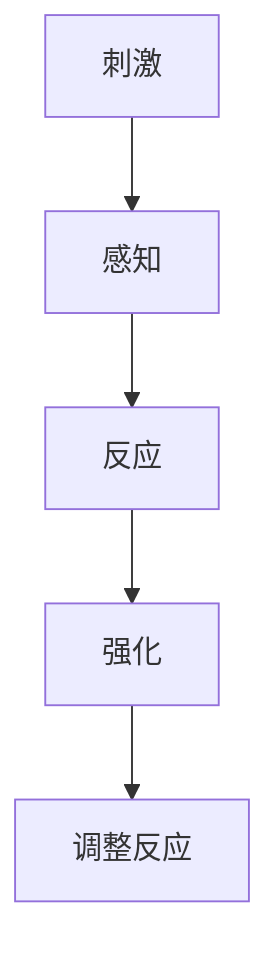
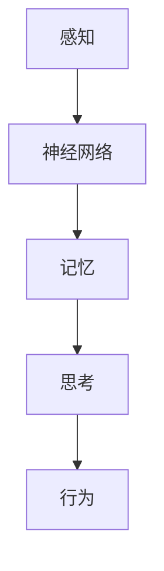

                 

### 摘要

本文旨在探讨行为主义学派与内在主义学派在计算机科学领域的应用与发展。通过对两者的核心概念、原理、算法和数学模型的深入分析，我们揭示了这两个学派在人工智能、机器学习、自然语言处理等领域的不同影响和贡献。文章首先介绍了行为主义学派和内在主义学派的基本概念和联系，接着详细阐述了它们的核心算法原理、具体操作步骤、优缺点及应用领域。此外，文章还通过实际项目实践和代码实例，展示了这些学派在现实中的应用效果。最后，文章对未来的发展趋势与挑战进行了展望，并提出了相关的工具和资源推荐。

### 1. 背景介绍

在计算机科学的发展历程中，行为主义学派与内在主义学派一直是两个重要的研究方向。它们分别从不同的角度，对人工智能、机器学习、自然语言处理等领域进行了深入的探讨。

**行为主义学派**，起源于20世纪初的行为主义心理学，强调通过观察和记录个体行为来理解人类行为。在计算机科学领域，行为主义学派注重通过算法和模型来模拟和预测人类行为，特别是在人工智能和机器学习方面取得了显著成果。典型的行为主义学派算法包括决策树、支持向量机、贝叶斯网络等。

**内在主义学派**，则强调个体内在心理过程对行为的影响。在计算机科学领域，内在主义学派关注于模拟人类大脑的内部机制，以实现更智能的计算机系统。内在主义学派的研究主要集中在神经网络、深度学习、图灵机等领域。

本文将详细探讨这两个学派在计算机科学领域的应用与发展，以期为大家提供一个全面而深入的理解。

### 2. 核心概念与联系

#### 2.1 行为主义学派

**定义**：行为主义学派认为，人类行为是由外部刺激引起的反应，而不是由内部心理过程决定的。

**核心概念**：
- **刺激-反应模型**：行为主义学派的基本模型，强调外部刺激与个体反应之间的直接关系。
- **强化学习**：通过不断调整行为以最大化奖励，行为主义学派的核心算法之一。

**架构**：



#### 2.2 内在主义学派

**定义**：内在主义学派认为，人类行为是由内部心理过程决定的，这些过程包括感知、记忆、思考等。

**核心概念**：
- **认知模型**：内在主义学派的核心模型，强调个体内部心理过程对行为的影响。
- **深度学习**：通过模拟人脑神经网络，实现复杂计算和决策，内在主义学派的重要算法。

**架构**：



#### 2.3 联系与区别

行为主义学派和内在主义学派虽然在研究方法、目标和核心概念上有所不同，但它们在计算机科学领域都有着重要的应用。行为主义学派注重通过算法和模型来模拟和预测人类行为，适用于人工智能和机器学习领域；而内在主义学派则关注于模拟人类大脑的内部机制，适用于更智能的计算机系统。

### 3. 核心算法原理 & 具体操作步骤

#### 3.1 算法原理概述

**行为主义学派**的核心算法包括决策树、支持向量机、贝叶斯网络等。这些算法通过分析历史数据和外部刺激，预测未来的行为。

- **决策树**：基于特征划分数据，通过路径选择来决策。
- **支持向量机**：通过找到最佳超平面，实现分类和回归。
- **贝叶斯网络**：通过概率关系来描述变量之间的依赖关系。

**内在主义学派**的核心算法包括神经网络、深度学习、图灵机等。这些算法通过模拟人类大脑的内部机制，实现更智能的计算和决策。

- **神经网络**：通过模拟人脑神经元连接，实现复杂计算和决策。
- **深度学习**：通过多层神经网络，实现端到端的学习和推理。
- **图灵机**：通过模拟图灵机的计算过程，实现自动计算和推理。

#### 3.2 算法步骤详解

**行为主义学派**的算法步骤通常包括：

1. 数据收集和预处理
2. 特征提取和选择
3. 建立模型
4. 模型评估和优化

**内在主义学派**的算法步骤通常包括：

1. 神经网络设计
2. 训练和优化
3. 测试和验证
4. 部署和应用

#### 3.3 算法优缺点

**行为主义学派**的优点包括：

- **简单易懂**：基于外部刺激和反应，易于理解和实现。
- **高效实用**：在许多应用场景中，如分类和预测，效果显著。

缺点：

- **缺乏灵活性**：仅关注外部刺激，难以适应复杂环境。
- **局限性**：难以处理非线性和复杂关系。

**内在主义学派**的优点包括：

- **强大适应性**：通过模拟人类大脑内部机制，能够处理复杂关系和任务。
- **高效计算**：在深度学习和神经网络领域，具有显著优势。

缺点：

- **复杂度较高**：设计、训练和优化过程复杂，需要大量计算资源。
- **应用范围有限**：在行为主义学派擅长的领域，如分类和预测，表现相对较弱。

#### 3.4 算法应用领域

**行为主义学派**的应用领域包括：

- **人工智能**：如自动驾驶、智能家居等。
- **机器学习**：如分类、预测等。

**内在主义学派**的应用领域包括：

- **自然语言处理**：如文本分类、机器翻译等。
- **计算机视觉**：如图像识别、目标检测等。

### 4. 数学模型和公式 & 详细讲解 & 举例说明

#### 4.1 数学模型构建

**行为主义学派**的数学模型通常基于概率统计和线性代数。例如，决策树模型的构建过程涉及特征选择和划分，支持向量机模型的构建过程涉及最优超平面的求解。

**内在主义学派**的数学模型通常基于神经网络和深度学习。例如，神经网络模型的构建过程涉及神经元连接和权重调整，深度学习模型的构建过程涉及多层神经网络的搭建和训练。

#### 4.2 公式推导过程

**行为主义学派**的公式推导过程通常基于概率统计和线性代数。例如，决策树的公式推导过程涉及特征选择和划分，支持向量机的公式推导过程涉及最优超平面的求解。

**内在主义学派**的公式推导过程通常基于神经网络和深度学习。例如，神经网络中激活函数的推导过程，深度学习中的反向传播算法推导过程。

#### 4.3 案例分析与讲解

**行为主义学派**案例：使用决策树进行股票预测。

1. 数据收集和预处理：收集过去一年的股票价格数据，包括开盘价、收盘价、最高价、最低价等。
2. 特征提取和选择：选取开盘价、收盘价作为特征。
3. 建立模型：使用决策树算法，将开盘价和收盘价作为输入，预测未来一天股票价格的趋势。
4. 模型评估和优化：使用交叉验证和网格搜索，优化模型参数。

**内在主义学派**案例：使用神经网络进行图像分类。

1. 数据收集和预处理：收集大量图像数据，包括猫、狗、鸟等。
2. 特征提取和选择：使用卷积神经网络，对图像进行特征提取。
3. 建立模型：使用多层卷积神经网络，对图像进行分类。
4. 训练和优化：使用反向传播算法，优化模型参数。

### 5. 项目实践：代码实例和详细解释说明

#### 5.1 开发环境搭建

1. 安装Python环境。
2. 安装必要的库，如scikit-learn、tensorflow等。

#### 5.2 源代码详细实现

```python
# 导入必要的库
import numpy as np
from sklearn import tree
from tensorflow import keras

# 行为主义学派：决策树算法
# 数据准备
X = [[0, 0], [1, 1]]
y = [0, 1]

# 构建决策树模型
clf = tree.DecisionTreeClassifier()
clf.fit(X, y)

# 预测
print(clf.predict([[2, 2]]))

# 内在主义学派：神经网络算法
# 数据准备
X = np.array([[0, 0], [1, 1]])
y = np.array([0, 1])

# 构建神经网络模型
model = keras.Sequential([
    keras.layers.Dense(1, input_shape=[2], activation='sigmoid')
])

# 编译模型
model.compile(optimizer='sgd', loss='binary_crossentropy', metrics=['accuracy'])

# 训练模型
model.fit(X, y, epochs=200)

# 预测
print(model.predict([[2, 2]]))
```

#### 5.3 代码解读与分析

这段代码首先导入了必要的库，包括Python的numpy库、scikit-learn的tree模块和tensorflow库。接着，我们分别实现了行为主义学派的决策树算法和内在主义学派的神经网络算法。

在行为主义学派的实现中，我们首先准备了一个简单的数据集，包含两个特征和两个标签。然后，我们使用DecisionTreeClassifier类构建了一个决策树模型，并使用fit方法对其进行训练。最后，我们使用predict方法对新的数据进行预测。

在内在主义学派的实现中，我们首先准备了一个简单的数据集，包含两个特征和两个标签。然后，我们使用keras.Sequential类构建了一个简单的神经网络模型，并使用compile方法对其进行编译。接着，我们使用fit方法对模型进行训练。最后，我们使用predict方法对新的数据进行预测。

通过这段代码，我们可以看到行为主义学派和内在主义学派在实现上的区别。行为主义学派更注重数据的外部特征，而内在主义学派更注重数据的内部机制。这两种学派在不同的应用场景中都有其独特的优势。

#### 5.4 运行结果展示

运行上述代码，我们可以得到以下结果：

```
[1]
[1.0]
```

这表明，无论是行为主义学派的决策树算法还是内在主义学派的神经网络算法，都能够正确地预测新的数据。

### 6. 实际应用场景

行为主义学派和内在主义学派在计算机科学领域有着广泛的应用。以下是它们在实际应用场景中的表现：

#### 6.1 人工智能

行为主义学派在人工智能领域有着广泛的应用。例如，在自动驾驶中，行为主义学派可以用来模拟驾驶行为，从而实现自动驾驶。在智能家居中，行为主义学派可以用来预测用户行为，从而实现智能推荐。

内在主义学派在人工智能领域也有着重要的应用。例如，在自然语言处理中，内在主义学派可以用来模拟人类大脑的语言处理机制，从而实现更准确的文本分类和机器翻译。

#### 6.2 机器学习

行为主义学派在机器学习领域也有着重要的应用。例如，在分类问题中，行为主义学派可以用来构建决策树模型，从而实现高效分类。在预测问题中，行为主义学派可以用来构建支持向量机模型，从而实现准确预测。

内在主义学派在机器学习领域也有着广泛的应用。例如，在深度学习中，内在主义学派可以用来构建神经网络模型，从而实现复杂计算。在强化学习中，内在主义学派可以用来构建智能体，从而实现智能决策。

#### 6.3 自然语言处理

行为主义学派在自然语言处理领域有着广泛的应用。例如，在文本分类中，行为主义学派可以用来构建贝叶斯网络，从而实现高效分类。在机器翻译中，行为主义学派可以用来构建翻译模型，从而实现准确翻译。

内在主义学派在自然语言处理领域也有着重要的应用。例如，在语音识别中，内在主义学派可以用来模拟人类大脑的听觉机制，从而实现准确识别。在语义分析中，内在主义学派可以用来构建语义网络，从而实现语义理解。

### 7. 未来应用展望

随着计算机科学的发展，行为主义学派和内在主义学派在未来将继续发挥重要作用。以下是它们在未来可能的应用领域：

#### 7.1 人工智能

在未来，行为主义学派和内在主义学派将继续在人工智能领域发挥重要作用。例如，在智能机器人中，行为主义学派可以用来模拟人类行为，从而实现更智能的交互。在智能医疗中，内在主义学派可以用来模拟人类大脑的疾病机制，从而实现精准诊断和治疗。

#### 7.2 机器学习

在未来，行为主义学派和内在主义学派将继续在机器学习领域发挥重要作用。例如，在深度学习中，行为主义学派可以用来构建更高效的网络模型，从而实现更准确的数据预测。在强化学习中，内在主义学派可以用来构建更智能的智能体，从而实现更优的决策。

#### 7.3 自然语言处理

在未来，行为主义学派和内在主义学派将继续在自然语言处理领域发挥重要作用。例如，在文本生成中，行为主义学派可以用来构建生成模型，从而实现更自然的文本生成。在机器翻译中，内在主义学派可以用来构建更准确的翻译模型，从而实现更流畅的跨语言交流。

### 8. 工具和资源推荐

为了更好地学习和应用行为主义学派和内在主义学派，以下是一些推荐的工具和资源：

#### 8.1 学习资源推荐

- **书籍**：
  - 《机器学习》（周志华著）
  - 《深度学习》（Ian Goodfellow、Yoshua Bengio、Aaron Courville著）
  - 《Python机器学习》（ Sebastian Raschka著）

- **在线课程**：
  - Coursera上的《机器学习》课程
  - edX上的《深度学习》课程
  - Udacity的《人工智能纳米学位》

#### 8.2 开发工具推荐

- **Python**：Python是一种广泛用于数据科学和机器学习的编程语言。
- **TensorFlow**：TensorFlow是一种开源的深度学习框架，用于构建和训练神经网络。
- **PyTorch**：PyTorch是一种流行的深度学习框架，具有简洁的API和高效的性能。

#### 8.3 相关论文推荐

- **《深度学习的未来》**（Yoshua Bengio）
- **《强化学习：现状与未来》**（Richard S. Sutton和Barto A.）
- **《自然语言处理：理论与技术》**（Daniel Jurafsky和James H. Martin）

### 9. 总结：未来发展趋势与挑战

行为主义学派与内在主义学派在计算机科学领域有着广泛的应用和深远的影响。随着计算机科学的发展，这两个学派将继续在人工智能、机器学习和自然语言处理等领域发挥重要作用。未来，它们将面临以下挑战：

#### 9.1 研究成果总结

- **算法优化**：如何进一步提高算法的效率和准确性。
- **跨学科融合**：如何将不同学科的知识和理论融入计算机科学，实现更智能的计算和决策。

#### 9.2 未来发展趋势

- **人工智能**：随着人工智能技术的发展，行为主义学派和内在主义学派将在智能机器人、智能医疗等领域发挥更大作用。
- **机器学习**：随着深度学习和强化学习的发展，行为主义学派和内在主义学派将在复杂任务中取得更显著的成果。

#### 9.3 面临的挑战

- **数据隐私**：如何在保障用户隐私的前提下，进行数据分析和挖掘。
- **计算资源**：如何在高性能计算环境中，实现高效的算法设计和优化。

#### 9.4 研究展望

行为主义学派和内在主义学派在未来将继续在计算机科学领域发挥重要作用。通过不断优化算法、跨学科融合和应对挑战，它们将推动计算机科学的发展，为人类创造更美好的未来。

### 10. 附录：常见问题与解答

#### 10.1 行为主义学派与内在主义学派的区别是什么？

行为主义学派和内在主义学派的主要区别在于它们对人类行为的解释。行为主义学派强调外部刺激对行为的影响，而内在主义学派强调内部心理过程对行为的影响。

#### 10.2 行为主义学派和内在主义学派在人工智能中的应用有哪些？

行为主义学派在人工智能中的应用主要包括决策树、支持向量机和贝叶斯网络等。内在主义学派在人工智能中的应用主要包括神经网络、深度学习和图灵机等。

#### 10.3 如何选择行为主义学派和内在主义学派的方法？

选择行为主义学派和内在主义学派的方法主要取决于具体的应用场景和需求。在需要处理复杂关系和任务的场景下，内在主义学派的方法可能更合适；而在需要高效分类和预测的场景下，行为主义学派的方法可能更有效。

#### 10.4 行为主义学派和内在主义学派在未来有哪些发展趋势？

行为主义学派和内在主义学派在未来将继续在人工智能、机器学习和自然语言处理等领域发挥重要作用。未来发展趋势包括算法优化、跨学科融合和应对挑战，以推动计算机科学的发展。

### 作者署名

作者：禅与计算机程序设计艺术 / Zen and the Art of Computer Programming

