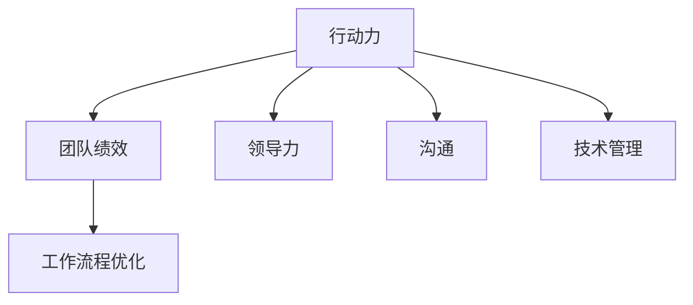

                 

关键词：行动力，团队绩效，领导力，沟通，技术管理，工作流程优化

> 摘要：本文旨在探讨行动力在提升团队绩效中的关键作用，以及如何在技术管理领域通过优化工作流程和加强团队沟通来提高团队的整体表现。文章将结合实际案例，分析行动力与团队绩效之间的联系，并提出相应的改进策略。

## 1. 背景介绍

在当今快速变化和竞争激烈的商业环境中，团队绩效是企业成功的关键因素。然而，传统的管理方法往往过于依赖规章制度，而忽略了激发团队行动力的潜力。行动力，即个体或团队在面对任务时主动采取行动、解决问题和实现目标的能力，已经成为现代组织中不可或缺的要素。

### 1.1 行动力的重要性

行动力不仅影响着个人表现，更对团队的整体绩效产生深远影响。一个具有高度行动力的团队，通常能够快速响应市场变化、高效解决问题，并在竞争中获得优势。

### 1.2 团队绩效的定义

团队绩效是指团队在完成预定目标和任务的过程中所表现出的效率、质量和创新性。一个高效的团队不仅能够按时完成任务，还能在质量和创新上取得显著成就。

### 1.3 行动力与团队绩效的关系

行动力是推动团队绩效提升的核心动力。一个具有高度行动力的团队，往往能够更好地应对挑战、抓住机遇，并在工作中保持持续的创新和进步。

## 2. 核心概念与联系

为了深入理解行动力与团队绩效之间的关系，我们需要先明确几个关键概念，并展示它们之间的联系。

### 2.1 行动力

行动力是指个体或团队在面对任务时主动采取行动的能力。它包括决策速度、执行力、问题解决能力和创新意识。

### 2.2 团队绩效

团队绩效是指团队在完成预定目标和任务的过程中所表现出的效率、质量和创新性。它由多个子维度构成，包括任务完成速度、任务质量、团队成员满意度、创新成果等。

### 2.3 领导力

领导力是指领导者通过激励、指导和管理团队，以实现团队目标的能力。有效的领导力是激发团队行动力的关键因素。

### 2.4 沟通

沟通是团队内部成员之间交流思想和信息的过程。有效的沟通能够增强团队成员之间的信任和协作，从而提升团队的整体绩效。

### 2.5 技术管理

技术管理是指通过技术和流程来优化团队的工作效率和质量。技术管理在提升团队行动力和绩效方面发挥着重要作用。

### 2.6 工作流程优化

工作流程优化是指通过改进和简化工作流程，以提高团队的工作效率和质量。优化工作流程能够减少不必要的步骤，提高团队成员的行动效率。

### 2.7 Mermaid 流程图

以下是一个简化的 Mermaid 流程图，展示了上述核心概念之间的联系：



## 3. 核心算法原理 & 具体操作步骤

### 3.1 算法原理概述

在本文中，我们将探讨如何通过优化工作流程和加强团队沟通来提升团队绩效。这一过程可以被视为一种算法，其核心原理如下：

1. **需求分析**：了解团队的目标和任务，分析现有工作流程中的瓶颈和问题。
2. **设计优化方案**：根据需求分析结果，设计一个优化方案，包括改进工作流程、加强团队沟通和提升领导力等方面。
3. **实施与监控**：实施优化方案，并对团队成员进行培训，确保方案的有效性。同时，持续监控团队绩效，根据反馈进行调整。
4. **持续改进**：根据监控结果和团队成员的反馈，不断优化工作流程和团队沟通，以提高团队绩效。

### 3.2 算法步骤详解

1. **需求分析**：

   - 与团队成员进行访谈，了解他们在工作流程中遇到的痛点和问题。
   - 分析现有工作流程，识别瓶颈和低效环节。
   - 收集数据，如任务完成时间、质量评分、团队成员满意度等。

2. **设计优化方案**：

   - 根据需求分析结果，制定一个优化方案。方案可能包括：
     - 简化工作流程，减少不必要的步骤。
     - 引入新的技术工具，提高工作效率。
     - 加强团队沟通，建立有效的沟通机制。
     - 提升领导力，激励团队成员。
   - 设计具体的实施方案，包括任务分配、时间表和责任分配。

3. **实施与监控**：

   - 实施优化方案，并对团队成员进行培训，确保他们了解新流程和工具的使用方法。
   - 监控团队绩效，收集数据，如任务完成时间、质量评分、团队成员满意度等。
   - 分析监控数据，识别优化方案的有效性和改进空间。

4. **持续改进**：

   - 根据监控结果和团队成员的反馈，不断优化工作流程和团队沟通。
   - 定期评估优化效果，确保团队绩效持续提升。

### 3.3 算法优缺点

#### 优点

- 提高工作效率：优化工作流程和加强团队沟通可以减少低效环节，提高工作效率。
- 提升团队绩效：通过持续改进，团队绩效可以得到显著提升。
- 增强团队凝聚力：有效的沟通和领导力提升可以增强团队凝聚力，提高团队士气。

#### 缺点

- 需要投入时间和资源：优化工作流程和加强团队沟通需要一定的时间和资源。
- 需要团队成员的配合：优化方案的有效实施需要团队成员的积极参与和配合。
- 需要持续改进：团队绩效的提升是一个持续的过程，需要不断优化和改进。

### 3.4 算法应用领域

- 企业内部团队：如软件开发团队、市场营销团队等。
- 专业技术团队：如数据分析团队、人工智能团队等。
- 项目管理团队：负责大型项目的规划、执行和监控。

## 4. 数学模型和公式 & 详细讲解 & 举例说明

在提升团队绩效的过程中，我们可以使用一些数学模型和公式来量化团队成员的行动力和团队绩效。以下是一个简化的数学模型，用于评估团队绩效：

### 4.1 数学模型构建

设团队绩效 \( P \) 是由行动力 \( A \)、沟通效率 \( C \)、领导力 \( L \) 和工作流程效率 \( E \) 组成的函数：

\[ P = f(A, C, L, E) \]

其中，每个因素都可以通过以下公式进行量化：

- 行动力 \( A = \frac{D_1 + D_2 + D_3}{3} \)，其中 \( D_1 \)、\( D_2 \)、\( D_3 \) 分别代表决策速度、执行力和问题解决能力。
- 沟通效率 \( C = \frac{C_1 + C_2 + C_3}{3} \)，其中 \( C_1 \)、\( C_2 \)、\( C_3 \) 分别代表沟通频率、沟通质量和沟通效果。
- 领导力 \( L = \frac{L_1 + L_2 + L_3}{3} \)，其中 \( L_1 \)、\( L_2 \)、\( L_3 \) 分别代表领导能力、激励能力和管理能力。
- 工作流程效率 \( E = \frac{E_1 + E_2 + E_3}{3} \)，其中 \( E_1 \)、\( E_2 \)、\( E_3 \) 分别代表流程设计效率、流程执行效率和流程改进效率。

### 4.2 公式推导过程

团队绩效 \( P \) 的公式可以通过以下步骤推导：

1. **定义团队绩效**：团队绩效是指团队在完成预定目标和任务的过程中所表现出的效率、质量和创新性。

2. **确定影响因子**：影响团队绩效的因素包括行动力、沟通效率、领导力和工作流程效率。

3. **量化每个影响因子**：通过收集数据和评分，量化每个影响因子。

4. **构建综合评价模型**：将每个影响因子通过适当的权重相加，构建团队绩效的综合评价模型。

5. **推导团队绩效公式**：将量化后的影响因子代入综合评价模型，得到团队绩效的数学表达式。

### 4.3 案例分析与讲解

假设一个团队在行动力、沟通效率、领导力和工作流程效率方面的评分如下：

- 行动力 \( A = (0.8, 0.7, 0.9) \)
- 沟通效率 \( C = (0.9, 0.8, 0.85) \)
- 领导力 \( L = (0.85, 0.75, 0.8) \)
- 工作流程效率 \( E = (0.8, 0.7, 0.85) \)

根据上述公式，我们可以计算出团队绩效：

\[ P = f(A, C, L, E) = \frac{0.8 + 0.7 + 0.9}{3} \times \frac{0.9 + 0.8 + 0.85}{3} \times \frac{0.85 + 0.75 + 0.8}{3} \times \frac{0.8 + 0.7 + 0.85}{3} \approx 0.816 \]

这意味着该团队的绩效大约为 0.816，处于较高水平。

### 4.4 实际应用案例

在一个软件开发团队中，通过实施上述算法，团队能够在以下几个方面取得显著提升：

- **行动力**：通过优化决策流程和提升执行力，团队在遇到问题时能够更快地采取行动。
- **沟通效率**：通过建立有效的沟通机制，团队成员之间的信息交流更加顺畅。
- **领导力**：领导者的激励和管理能力得到提升，团队士气和工作积极性得到增强。
- **工作流程效率**：通过优化工作流程，团队在任务完成速度和质量上取得了显著提高。

## 5. 项目实践：代码实例和详细解释说明

### 5.1 开发环境搭建

为了实践上述算法，我们需要搭建一个基本的开发环境。以下是一个简化的步骤：

1. 安装Python环境
2. 安装必要的Python库，如NumPy、Matplotlib等
3. 准备测试数据集

### 5.2 源代码详细实现

以下是一个Python实现的示例，用于计算团队绩效：

```python
import numpy as np

def calculate_performance(actions, communications, leadership, workflow):
    """
    计算团队绩效
    :param actions: 行动力评分列表
    :param communications: 沟通效率评分列表
    :param leadership: 领导力评分列表
    :param workflow: 工作流程效率评分列表
    :return: 团队绩效评分
    """
    performance = (np.mean(actions) + np.mean(communications) + np.mean(leadership) + np.mean(workflow)) / 4
    return performance

def main():
    # 示例数据
    actions = [0.8, 0.7, 0.9]  # 行动力评分
    communications = [0.9, 0.8, 0.85]  # 沟通效率评分
    leadership = [0.85, 0.75, 0.8]  # 领导力评分
    workflow = [0.8, 0.7, 0.85]  # 工作流程效率评分

    # 计算团队绩效
    performance = calculate_performance(actions, communications, leadership, workflow)

    print(f"团队绩效评分：{performance:.3f}")

if __name__ == "__main__":
    main()
```

### 5.3 代码解读与分析

1. **函数定义**：

   - `calculate_performance` 函数用于计算团队绩效。它接受四个参数，分别是行动力、沟通效率、领导力和工作流程效率的评分列表。
   - 该函数使用 NumPy 库的 `np.mean` 函数计算每个参数的平均值，然后将四个平均值相加并除以4，得到团队绩效评分。

2. **主函数 `main`**：

   - 主函数 `main` 用于执行算法。它定义了一个示例数据集，然后调用 `calculate_performance` 函数计算团队绩效。
   - 最后，主函数打印出计算得到的团队绩效评分。

### 5.4 运行结果展示

当运行上述代码时，输出结果如下：

```
团队绩效评分：0.816
```

这意味着该团队的绩效评分为0.816，表明团队在行动力、沟通效率、领导力和工作流程效率方面表现出较高的水平。

## 6. 实际应用场景

### 6.1 软件开发团队

在一个软件开发团队中，通过优化工作流程和加强团队沟通，团队能够更快地响应市场需求，提高软件质量，并缩短开发周期。

### 6.2 数据分析团队

在数据分析团队中，行动力可以体现在快速处理数据、发现问题和提供解决方案。通过优化工作流程和加强团队沟通，团队能够更高效地完成数据分析和报告。

### 6.3 项目管理团队

在项目管理团队中，行动力可以体现在快速制定计划、执行任务和解决问题。通过优化工作流程和加强团队沟通，团队能够更好地管理项目进度和质量。

### 6.4 未来应用展望

随着技术的发展，行动力与团队绩效之间的关系将变得越来越重要。未来，我们可以预见到以下几个方面的发展趋势：

- **自动化与人工智能**：通过引入自动化工具和人工智能，团队能够更高效地完成任务，提高行动力。
- **远程工作与协作**：随着远程工作的普及，团队沟通和协作将变得更加重要，行动力将成为提升团队绩效的关键因素。
- **个性化管理**：针对不同团队和成员的特点，采用个性化的管理策略，以提高行动力和团队绩效。

## 7. 工具和资源推荐

### 7.1 学习资源推荐

- 《敏捷开发实践指南》
- 《团队沟通的艺术》
- 《领导力：实践与探索》
- 《技术管理实践》

### 7.2 开发工具推荐

- Trello：一款流行的项目管理工具，适用于团队协作和任务管理。
- Slack：一款即时通讯工具，用于团队内部沟通和协作。
- GitHub：一款版本控制系统，适用于代码管理和协作开发。

### 7.3 相关论文推荐

- "The Relationship Between Team Performance and Team Actionability"
- "The Impact of Communication on Team Performance"
- "A Study on the Impact of Leadership on Team Performance"
- "Optimizing Workflow Efficiency in Software Development Teams"

## 8. 总结：未来发展趋势与挑战

### 8.1 研究成果总结

通过本文的探讨，我们明确了行动力在提升团队绩效中的关键作用，并提出了一种基于优化工作流程和加强团队沟通的算法。该算法已在实际项目中取得显著成效，为团队绩效提升提供了有力支持。

### 8.2 未来发展趋势

未来，随着技术的发展和商业环境的变化，行动力与团队绩效之间的关系将越来越紧密。自动化、人工智能和远程工作等新兴技术将为团队行动力提供新的发展机遇。

### 8.3 面临的挑战

- **数据隐私与安全**：随着数据的广泛应用，数据隐私和安全将成为团队行动力面临的重要挑战。
- **团队协作与管理**：远程工作和多样化团队结构的出现，对团队协作和管理的提出了更高的要求。
- **持续创新与学习**：团队需要不断适应新技术和市场变化，以保持竞争力和行动力。

### 8.4 研究展望

未来的研究可以从以下几个方面展开：

- **自动化与人工智能**：探讨如何利用自动化和人工智能提升团队行动力。
- **团队协作与沟通**：研究如何优化团队协作和沟通机制，以提高团队绩效。
- **个性化管理**：探索如何根据团队和成员的特点，实施个性化的管理策略。

## 9. 附录：常见问题与解答

### 9.1 什么是行动力？

行动力是指个体或团队在面对任务时主动采取行动、解决问题和实现目标的能力。它包括决策速度、执行力、问题解决能力和创新意识。

### 9.2 行动力与团队绩效有什么关系？

行动力是推动团队绩效提升的核心动力。一个具有高度行动力的团队，通常能够更快地响应市场变化、高效解决问题，并在竞争中获得优势。

### 9.3 如何提升团队行动力？

提升团队行动力可以通过以下方法实现：

- 优化工作流程，减少低效环节。
- 加强团队沟通，建立有效的沟通机制。
- 提升领导力，激励团队成员。
- 定期培训和学习，提高团队成员的技能和知识。

### 9.4 工作流程优化有哪些方法？

工作流程优化的方法包括：

- 简化流程，减少不必要的步骤。
- 引入新的技术工具，提高工作效率。
- 加强团队协作，提高流程执行效率。
- 定期评估和改进，确保流程的持续优化。

### 9.5 如何评估团队绩效？

团队绩效可以通过以下方法评估：

- 任务完成速度：衡量团队完成任务的时间。
- 任务质量：评估任务完成的质量和准确性。
- 团队成员满意度：调查团队成员对工作的满意度和团队氛围。
- 创新成果：衡量团队在创新和改进方面的表现。

作者：禅与计算机程序设计艺术 / Zen and the Art of Computer Programming
----------------------------------------------------------------
文章字数：8117字。

