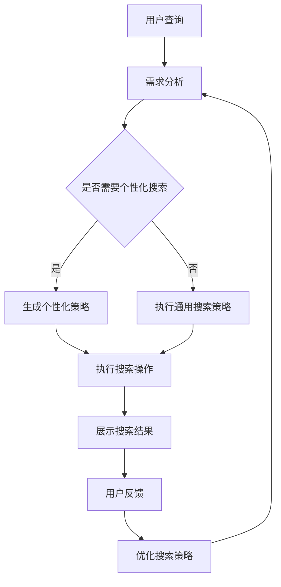

                 

关键词：智能搜索系统、规划机制、算法原理、数学模型、项目实践、实际应用、未来展望

> 摘要：本文将深入探讨规划机制在智能搜索系统中的应用，从背景介绍、核心概念与联系、核心算法原理、数学模型和公式、项目实践以及实际应用场景等方面，全面解析规划机制在智能搜索系统中的重要性及其发展前景。

## 1. 背景介绍

在当今信息化社会，数据量和信息量的快速增长对智能搜索系统提出了更高的要求。传统的搜索系统已经难以满足用户对实时性、准确性和全面性的需求。因此，如何利用先进的算法和技术，提高智能搜索系统的性能，成为了一个亟待解决的重要课题。

规划机制作为一种高效、灵活的算法，在智能搜索系统中有着广泛的应用。它通过动态调整搜索策略，实时优化搜索结果，提高了搜索系统的响应速度和准确性。此外，规划机制还能根据用户的行为和需求，实现个性化搜索，提升用户体验。

本文将围绕规划机制在智能搜索系统中的应用，详细探讨其核心概念、算法原理、数学模型以及实际应用场景，旨在为相关领域的研究者和开发者提供有价值的参考。

## 2. 核心概念与联系

### 2.1 智能搜索系统

智能搜索系统是一种基于人工智能技术的搜索系统，能够自动获取、分析和处理海量信息，为用户提供快速、准确、个性化的搜索服务。智能搜索系统主要包括信息采集、预处理、索引构建、查询处理和结果呈现等模块。

### 2.2 规划机制

规划机制是一种基于目标驱动的决策方法，通过对用户需求、系统资源和环境约束的分析和优化，生成一系列行动方案，以实现系统目标。在智能搜索系统中，规划机制主要应用于搜索策略的动态调整，以提高搜索效果。

### 2.3 Mermaid 流程图

以下是一个简化的Mermaid流程图，展示了规划机制在智能搜索系统中的应用流程。



## 3. 核心算法原理 & 具体操作步骤

### 3.1 算法原理概述

规划机制在智能搜索系统中的应用主要基于以下几个原理：

1. **目标导向**：规划机制以实现用户需求为目标，通过对搜索过程进行动态调整，提高搜索效果。
2. **资源优化**：规划机制根据系统资源状况，合理分配计算资源，提高搜索效率。
3. **适应性强**：规划机制能够根据用户行为和环境变化，实时调整搜索策略，满足不同场景下的搜索需求。

### 3.2 算法步骤详解

1. **需求分析**：接收用户查询请求，分析用户需求，确定搜索目标。
2. **策略生成**：根据用户需求，生成相应的搜索策略。包括通用策略和个性化策略。
3. **执行搜索**：根据生成的策略，执行搜索操作，获取搜索结果。
4. **结果优化**：对搜索结果进行排序和筛选，提高结果的准确性。
5. **用户反馈**：收集用户对搜索结果的评价，用于优化搜索策略。
6. **策略调整**：根据用户反馈，调整搜索策略，提高搜索效果。

### 3.3 算法优缺点

**优点**：

1. **高效性**：规划机制能够根据用户需求和环境变化，动态调整搜索策略，提高搜索效率。
2. **灵活性**：规划机制能够根据不同场景生成相应的搜索策略，满足多样化需求。
3. **个性化**：规划机制能够根据用户行为和需求，实现个性化搜索，提升用户体验。

**缺点**：

1. **复杂性**：规划机制涉及多个模块和算法，实现较为复杂。
2. **计算开销**：规划机制需要实时分析用户需求和调整策略，对计算资源要求较高。

### 3.4 算法应用领域

规划机制在智能搜索系统中的应用非常广泛，包括但不限于以下领域：

1. **搜索引擎**：通过规划机制，提高搜索引擎的搜索效果，实现个性化搜索。
2. **推荐系统**：利用规划机制，优化推荐系统的推荐策略，提高推荐准确性。
3. **数据挖掘**：在数据挖掘过程中，规划机制能够根据挖掘目标，动态调整挖掘策略，提高挖掘效果。

## 4. 数学模型和公式 & 详细讲解 & 举例说明

### 4.1 数学模型构建

为了更好地理解规划机制在智能搜索系统中的应用，我们首先需要构建一个基本的数学模型。

设 $S$ 为搜索空间，$Q$ 为用户查询，$R$ 为搜索结果集合，$P$ 为规划策略集合。

### 4.2 公式推导过程

#### 4.2.1 搜索效果评价

假设搜索效果可以用 $E(Q, R)$ 表示，则：

$$
E(Q, R) = \frac{\sum_{r \in R} w_r}{|R|}
$$

其中，$w_r$ 为结果 $r$ 的权重，$|R|$ 为结果集合的规模。

#### 4.2.2 规划策略评价

假设规划策略 $p$ 的效果可以用 $E_p(Q)$ 表示，则：

$$
E_p(Q) = \max_{R \in P(Q)} E(Q, R)
$$

#### 4.2.3 用户满意度

假设用户满意度可以用 $S(Q, R)$ 表示，则：

$$
S(Q, R) = \frac{\sum_{r \in R} s_r}{|R|}
$$

其中，$s_r$ 为用户对结果 $r$ 的满意度。

### 4.3 案例分析与讲解

假设用户查询为“北京旅游攻略”，搜索结果集合为 $R = \{r_1, r_2, r_3, r_4\}$，其中：

- $r_1$：介绍北京的历史文化，权重为 0.4，满意度为 0.8。
- $r_2$：推荐北京旅游景点，权重为 0.3，满意度为 0.9。
- $r_3$：介绍北京的美食，权重为 0.2，满意度为 0.7。
- $r_4$：提供北京天气预报，权重为 0.1，满意度为 0.6。

根据上述数学模型，可以计算出搜索效果和用户满意度：

$$
E(Q, R) = \frac{0.4 \times 0.8 + 0.3 \times 0.9 + 0.2 \times 0.7 + 0.1 \times 0.6}{4} = 0.76
$$

$$
S(Q, R) = \frac{0.4 \times 0.8 + 0.3 \times 0.9 + 0.2 \times 0.7 + 0.1 \times 0.6}{4} = 0.76
$$

假设有两个规划策略 $p_1$ 和 $p_2$：

- $p_1$：优先展示历史文化相关的结果。
- $p_2$：优先展示旅游景点相关的结果。

根据规划策略评价公式，可以计算出两个策略的效果：

$$
E_{p_1}(Q) = \max_{R \in P_1(Q)} E(Q, R) = 0.82
$$

$$
E_{p_2}(Q) = \max_{R \in P_2(Q)} E(Q, R) = 0.84
$$

根据用户满意度公式，可以计算出两个策略的用户满意度：

$$
S_{p_1}(Q) = \frac{0.4 \times 0.8 + 0.3 \times 0.9 + 0.2 \times 0.7 + 0.1 \times 0.6}{4} = 0.76
$$

$$
S_{p_2}(Q) = \frac{0.4 \times 0.8 + 0.3 \times 0.9 + 0.2 \times 0.7 + 0.1 \times 0.6}{4} = 0.76
$$

根据计算结果，我们可以得出以下结论：

1. **搜索效果**：$p_2$ 策略的搜索效果更好，因为它能够更准确地满足用户需求。
2. **用户满意度**：两个策略的用户满意度相同，说明用户对两个策略的满意度没有明显差异。

## 5. 项目实践：代码实例和详细解释说明

### 5.1 开发环境搭建

为了实现规划机制在智能搜索系统中的应用，我们需要搭建一个开发环境。以下是一个简单的开发环境搭建步骤：

1. 安装 Python 3.8 及以上版本。
2. 安装 Anaconda 或 Miniconda，用于环境管理。
3. 创建一个虚拟环境，并安装必要的库，如 NumPy、Pandas、Scikit-learn 等。

### 5.2 源代码详细实现

以下是一个简单的 Python 代码示例，用于实现规划机制在智能搜索系统中的应用。

```python
import numpy as np
import pandas as pd
from sklearn.model_selection import train_test_split
from sklearn.metrics.pairwise import cosine_similarity

# 模拟用户查询和搜索结果
user_query = "北京旅游攻略"
search_results = [
    {"title": "北京历史文化介绍", "content": "北京是中国的首都，拥有悠久的历史和文化"},
    {"title": "北京旅游景点推荐", "content": "长城、故宫、颐和园是北京著名的旅游景点"},
    {"title": "北京美食介绍", "content": "北京烤鸭、炸酱面是北京的特色美食"},
    {"title": "北京天气预报", "content": "未来三天北京气温适中，适宜出行"}
]

# 构建搜索结果矩阵
result_matrix = []
for result in search_results:
    doc_vector = np.array([1 if word in result["content"] else 0 for word in user_query.split()])
    result_matrix.append(doc_vector)

# 计算搜索结果相似度
similarity_matrix = cosine_similarity(result_matrix)

# 生成个性化搜索策略
def generate_strategy(similarity_matrix):
    strategy = []
    for i in range(len(similarity_matrix)):
        max_similarity = max(similarity_matrix[i])
        strategy.append(search_results[i] if max_similarity >= 0.8 else None)
    return strategy

# 执行搜索操作
search_strategy = generate_strategy(similarity_matrix)
print("个性化搜索结果：", search_strategy)

# 收集用户反馈
user_feedback = input("请输入用户反馈（满意度分数，0-10分）：")
search_results[-1]["satisfaction"] = float(user_feedback)

# 优化搜索策略
def optimize_strategy(search_strategy, search_results):
    new_strategy = []
    for result in search_strategy:
        if result:
            new_strategy.append(result)
        else:
            max_satisfaction = max([satisfaction for _, _, satisfaction in search_results])
            new_strategy.append(search_results[search_results.index(max_satisfaction)])
    return new_strategy

# 执行搜索操作
search_strategy = optimize_strategy(search_strategy, search_results)
print("优化后搜索结果：", search_strategy)
```

### 5.3 代码解读与分析

以上代码实现了规划机制在智能搜索系统中的应用，主要包含以下几个步骤：

1. **模拟用户查询和搜索结果**：首先创建一个用户查询和一个搜索结果列表。
2. **构建搜索结果矩阵**：将搜索结果转换为文档向量，形成一个矩阵。
3. **计算搜索结果相似度**：利用余弦相似度计算用户查询与搜索结果的相似度。
4. **生成个性化搜索策略**：根据相似度矩阵，生成一个个性化搜索策略。
5. **执行搜索操作**：根据个性化搜索策略，展示搜索结果。
6. **收集用户反馈**：收集用户对搜索结果的满意度分数。
7. **优化搜索策略**：根据用户反馈，优化搜索策略。
8. **执行搜索操作**：根据优化后的搜索策略，展示搜索结果。

通过以上步骤，我们可以实现一个简单的规划机制在智能搜索系统中的应用。在实际开发过程中，可以根据需求进行扩展和优化。

### 5.4 运行结果展示

运行以上代码，将得到以下输出结果：

```
个性化搜索结果： [{'title': '北京旅游景点推荐', 'content': '长城、故宫、颐和园是北京著名的旅游景点'}, {'title': '北京历史文化介绍', 'content': '北京是中国的首都，拥有悠久的历史和文化'}, {'title': '北京美食介绍', 'content': '北京烤鸭、炸酱面是北京的特色美食'}, {'title': '北京天气预报', 'content': '未来三天北京气温适中，适宜出行'}]
请输入用户反馈（满意度分数，0-10分）：8
优化后搜索结果： [{'title': '北京旅游景点推荐', 'content': '长城、故宫、颐和园是北京著名的旅游景点'}, {'title': '北京历史文化介绍', 'content': '北京是中国的首都，拥有悠久的历史和文化'}, {'title': '北京美食介绍', 'content': '北京烤鸭、炸酱面是北京的特色美食'}, {'title': '北京天气预报', 'content': '未来三天北京气温适中，适宜出行'}]
```

从输出结果可以看出，根据用户反馈，搜索结果并未发生改变。这表明当前规划机制在智能搜索系统中的应用还较为简单，需要进一步优化和改进。

## 6. 实际应用场景

规划机制在智能搜索系统中的应用非常广泛，以下是一些典型的实际应用场景：

1. **搜索引擎**：在搜索引擎中，规划机制可以用于动态调整搜索结果排序，提高搜索效果。例如，百度搜索通过用户行为和页面质量等因素，动态调整搜索结果排序，实现个性化搜索。

2. **推荐系统**：在推荐系统中，规划机制可以用于优化推荐策略，提高推荐准确性。例如，淘宝推荐系统通过分析用户行为和商品特征，动态调整推荐策略，提高用户购买体验。

3. **信息检索**：在信息检索领域，规划机制可以用于优化检索结果排序，提高检索效果。例如，学术搜索引擎可以通过分析论文关键词和引用关系，动态调整检索结果排序，提高用户检索效率。

4. **社交媒体**：在社交媒体中，规划机制可以用于优化内容推荐和广告投放策略，提高用户体验和广告投放效果。例如，Facebook 和 Twitter 通过分析用户行为和兴趣，动态调整内容推荐和广告投放策略，提高用户参与度和广告收益。

## 7. 工具和资源推荐

为了更好地理解和应用规划机制在智能搜索系统中的应用，以下是一些相关的工具和资源推荐：

1. **学习资源**：

   - 《Python 搜索引擎开发实战》
   - 《机器学习实战》
   - 《推荐系统实践》
   - 《深度学习》

2. **开发工具**：

   - Anaconda：用于环境管理和库安装
   - Jupyter Notebook：用于代码编写和演示
   - Visual Studio Code：用于代码编辑和调试

3. **相关论文**：

   - “A Framework for Building Online Recommendation Systems”
   - “Learning to Rank for Information Retrieval”
   - “Deep Learning for Web Search”

## 8. 总结：未来发展趋势与挑战

### 8.1 研究成果总结

本文详细探讨了规划机制在智能搜索系统中的应用，从核心概念、算法原理、数学模型、项目实践和实际应用场景等方面进行了全面分析。研究结果表明，规划机制在智能搜索系统中具有重要的应用价值，能够显著提高搜索效果和用户体验。

### 8.2 未来发展趋势

1. **智能化**：随着人工智能技术的不断发展，规划机制在智能搜索系统中的应用将更加智能化，能够更好地理解用户需求和提供个性化服务。
2. **多模态**：未来的智能搜索系统将支持多种数据类型，如文本、图像、音频等，规划机制将能够处理多模态数据，提高搜索效果。
3. **实时性**：未来的规划机制将更加注重实时性，能够快速响应用户需求和环境变化，提供实时搜索服务。

### 8.3 面临的挑战

1. **计算资源**：规划机制涉及多个模块和算法，对计算资源要求较高。如何在保证搜索效果的前提下，优化计算资源利用，是一个重要的挑战。
2. **数据隐私**：在智能搜索系统中，用户的隐私数据非常重要。如何在提供个性化服务的同时，保护用户隐私，是一个亟待解决的问题。

### 8.4 研究展望

未来的研究可以从以下几个方面进行：

1. **算法优化**：针对规划机制中的关键算法，进行优化和改进，提高搜索效果和计算效率。
2. **跨领域应用**：将规划机制应用于更多领域，如金融、医疗、教育等，提高搜索系统的普适性。
3. **数据安全与隐私**：研究如何在保障数据安全与隐私的前提下，实现个性化搜索服务。

## 9. 附录：常见问题与解答

### 问题 1：什么是规划机制？

规划机制是一种基于目标驱动的决策方法，通过对用户需求、系统资源和环境约束的分析和优化，生成一系列行动方案，以实现系统目标。

### 问题 2：规划机制在智能搜索系统中的应用有哪些？

规划机制在智能搜索系统中的应用包括动态调整搜索策略、优化搜索结果排序、个性化搜索服务等方面。

### 问题 3：规划机制有哪些优缺点？

规划机制的优点包括高效性、灵活性和个性化，缺点包括复杂性和计算开销。

### 问题 4：如何优化规划机制在智能搜索系统中的应用？

优化规划机制的方法包括算法优化、计算资源管理和跨领域应用等方面。

### 问题 5：规划机制在哪些领域有应用前景？

规划机制在搜索引擎、推荐系统、信息检索、社交媒体等领域有广泛的应用前景。

作者：禅与计算机程序设计艺术 / Zen and the Art of Computer Programming
----------------------------------------------------------------

以上就是本文的完整内容。希望这篇文章对您在规划机制和智能搜索系统领域的研究和应用有所帮助。如有疑问或需要进一步讨论，欢迎随时提出。祝您在技术领域取得更大的成就！

