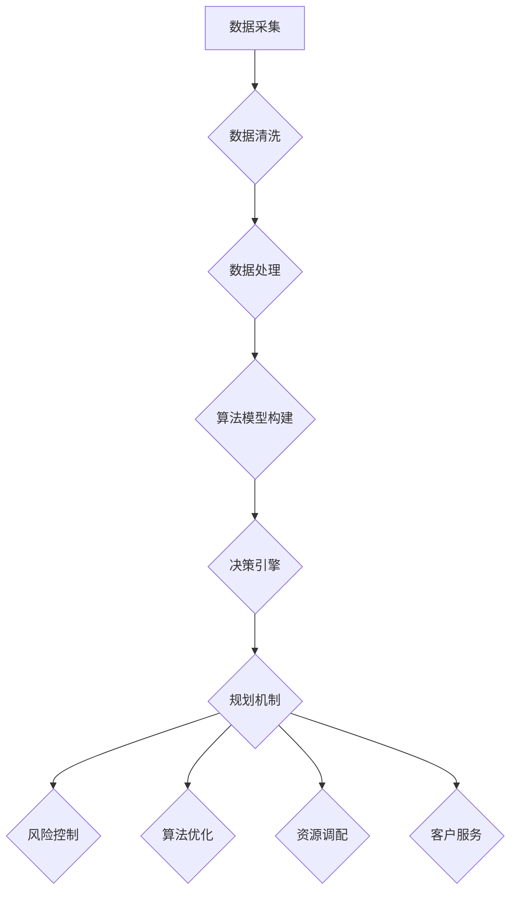

                 

关键词：智能金融系统、规划机制、风险控制、算法优化、数学模型

> 摘要：本文从背景介绍、核心概念与联系、核心算法原理及操作步骤、数学模型和公式、项目实践、实际应用场景、未来展望等方面，深入探讨了规划机制在智能金融系统中的应用，旨在为金融领域的智能化转型提供理论依据和实践指导。

## 1. 背景介绍

随着科技的飞速发展，金融行业正经历着前所未有的变革。大数据、云计算、人工智能等新兴技术逐渐成为金融创新的重要驱动力。智能金融系统作为金融科技创新的重要方向，通过引入规划机制，可以优化风险控制、提高业务效率和客户满意度。

规划机制在智能金融系统中的应用主要包括以下几个方面：

1. **风险控制**：通过规划机制，对金融业务过程中的风险进行有效识别、评估和控制，降低金融风险。

2. **算法优化**：利用规划机制，对智能金融系统中的算法进行优化，提高系统性能和决策质量。

3. **资源调配**：规划机制可以帮助智能金融系统根据业务需求，合理调配资源，实现高效运营。

4. **客户服务**：通过规划机制，智能金融系统可以提供更加个性化和精准的客户服务，提升用户体验。

## 2. 核心概念与联系

### 2.1. 规划机制

规划机制是一种基于目标导向的决策机制，通过设定目标、评估方案、选择最优路径等方式，实现对系统运行的指导和控制。在智能金融系统中，规划机制主要用于以下方面：

- **目标设定**：根据金融业务需求，设定系统目标，如风险控制、收益最大化等。

- **方案评估**：对不同的执行方案进行评估，选择最优方案。

- **路径选择**：根据评估结果，选择最优路径，实现系统目标。

### 2.2. 智能金融系统

智能金融系统是一种结合人工智能技术，实现对金融业务自动化处理、智能化决策的系统。其主要组成部分包括：

- **数据采集与处理**：收集金融业务数据，进行数据清洗、预处理等操作。

- **算法模型**：利用机器学习、深度学习等技术，构建算法模型。

- **决策引擎**：基于算法模型，实现对金融业务的智能化决策。

### 2.3. 规划机制与智能金融系统的关系

规划机制与智能金融系统密不可分。规划机制为智能金融系统提供了目标导向的决策支持，帮助系统实现风险控制、算法优化、资源调配和客户服务。而智能金融系统则为规划机制提供了数据基础和算法支持，使得规划机制能够更加高效地发挥作用。

### 2.4. Mermaid 流程图

下面是规划机制在智能金融系统中的应用的 Mermaid 流程图：



## 3. 核心算法原理 & 具体操作步骤

### 3.1. 算法原理概述

规划机制在智能金融系统中的应用主要涉及以下几个核心算法：

1. **风险控制算法**：用于识别和评估金融业务中的风险，并制定相应的风险控制策略。

2. **算法优化算法**：通过对算法模型的优化，提高系统性能和决策质量。

3. **资源调配算法**：根据业务需求和系统负载，实现资源的合理调配。

4. **客户服务算法**：基于用户行为数据和需求，提供个性化、精准化的客户服务。

### 3.2. 算法步骤详解

#### 3.2.1. 风险控制算法步骤

1. 数据采集：收集金融业务数据，包括交易数据、市场数据等。

2. 数据清洗：对采集到的数据进行分析，去除无效数据和噪声。

3. 风险识别：利用风险识别算法，识别金融业务中的风险。

4. 风险评估：对识别出的风险进行评估，确定风险等级。

5. 风险控制策略制定：根据风险评估结果，制定相应的风险控制策略。

6. 风险控制执行：执行风险控制策略，实现对金融业务的风险控制。

#### 3.2.2. 算法优化算法步骤

1. 算法选择：根据业务需求和数据特征，选择合适的算法模型。

2. 模型训练：利用训练数据，对算法模型进行训练。

3. 模型评估：评估模型性能，包括准确率、召回率等指标。

4. 模型优化：根据评估结果，对模型进行调整和优化。

5. 模型应用：将优化后的模型应用到实际业务中。

#### 3.2.3. 资源调配算法步骤

1. 负载监测：实时监测系统负载，包括CPU、内存等资源使用情况。

2. 资源需求预测：根据业务需求和负载情况，预测未来的资源需求。

3. 资源分配策略制定：根据预测结果，制定资源分配策略。

4. 资源分配执行：根据资源分配策略，进行资源分配。

#### 3.2.4. 客户服务算法步骤

1. 用户行为数据采集：收集用户在金融系统中的行为数据。

2. 用户需求分析：分析用户行为数据，识别用户需求。

3. 客户服务策略制定：根据用户需求，制定相应的客户服务策略。

4. 客户服务执行：执行客户服务策略，提供个性化、精准化的客户服务。

### 3.3. 算法优缺点

#### 3.3.1. 风险控制算法优缺点

**优点**：

- **高效性**：通过自动化方式，快速识别和评估风险。

- **全面性**：能够对金融业务中的各种风险进行有效识别。

- **实时性**：能够实时监测和响应金融业务中的风险变化。

**缺点**：

- **误判率**：在数据质量和算法模型不够成熟的情况下，可能存在误判。

- **应对复杂情境能力**：在面临复杂的市场环境时，风险控制算法的应对能力有限。

#### 3.3.2. 算法优化算法优缺点

**优点**：

- **高性能**：通过优化算法模型，提高系统性能。

- **高精度**：通过优化算法模型，提高决策质量。

- **灵活性**：能够根据业务需求，灵活调整算法模型。

**缺点**：

- **高成本**：算法优化需要大量的数据训练和计算资源。

- **高难度**：算法优化需要具备较高的专业知识和技能。

#### 3.3.3. 资源调配算法优缺点

**优点**：

- **高效性**：通过自动化方式，实现资源的合理调配。

- **灵活性**：能够根据业务需求，灵活调整资源分配。

- **稳定性**：在负载变化时，能够保持系统稳定运行。

**缺点**：

- **预测准确性**：在预测准确性不高的情况下，可能导致资源分配不合理。

- **实时性**：在实时性要求较高的情况下，可能无法及时响应。

#### 3.3.4. 客户服务算法优缺点

**优点**：

- **个性化**：能够根据用户需求，提供个性化服务。

- **精准化**：能够根据用户行为数据，提供精准化服务。

- **高效性**：通过自动化方式，提高客户服务效率。

**缺点**：

- **数据质量**：在数据质量不高的情况下，可能导致服务效果不佳。

- **复杂性**：在用户需求复杂多样时，算法的应对能力有限。

## 4. 数学模型和公式

### 4.1. 数学模型构建

规划机制在智能金融系统中的应用涉及多种数学模型，主要包括风险模型、优化模型、预测模型等。下面以风险模型为例，介绍数学模型的构建过程。

#### 4.1.1. 风险模型构建步骤

1. **定义变量**：

   - \(X_i\)：第 \(i\) 个金融业务的风险指标。

   - \(Y_i\)：第 \(i\) 个金融业务的风险等级。

2. **构建风险矩阵**：

   \[
   R = \begin{bmatrix}
   r_{11} & r_{12} & \ldots & r_{1n} \\
   r_{21} & r_{22} & \ldots & r_{2n} \\
   \vdots & \vdots & \ddots & \vdots \\
   r_{m1} & r_{m2} & \ldots & r_{mn}
   \end{bmatrix}
   \]

   其中，\(r_{ij}\) 表示第 \(i\) 个金融业务和第 \(j\) 个风险指标之间的相关性。

3. **构建风险函数**：

   \[
   f(X) = \sum_{i=1}^{m} \sum_{j=1}^{n} r_{ij} X_i Y_j
   \]

   其中，\(f(X)\) 表示金融业务整体的风险水平。

4. **风险等级划分**：

   根据风险函数 \(f(X)\) 的值，将金融业务划分为不同的风险等级，如低风险、中风险、高风险等。

### 4.2. 公式推导过程

以风险模型为例，介绍数学模型的公式推导过程。

#### 4.2.1. 风险矩阵构建

假设金融系统中有 \(m\) 个业务和 \(n\) 个风险指标，构建风险矩阵的步骤如下：

1. **收集数据**：

   收集每个业务和每个风险指标的相关性数据，形成 \(m \times n\) 的矩阵 \(R\)。

2. **计算相关性**：

   计算每个业务和每个风险指标之间的相关性，使用皮尔逊相关系数或斯皮尔曼等级相关系数等方法。

3. **构建风险矩阵**：

   根据计算结果，构建风险矩阵 \(R\)。

#### 4.2.2. 风险函数构建

以皮尔逊相关系数为例，构建风险函数的步骤如下：

1. **计算协方差**：

   \[
   \text{Cov}(X_i, Y_j) = \frac{1}{N-1} \sum_{k=1}^{N} (X_i[k] - \bar{X_i})(Y_j[k] - \bar{Y_j})
   \]

   其中，\(X_i[k]\) 和 \(Y_j[k]\) 分别表示第 \(i\) 个业务和第 \(j\) 个风险指标在第 \(k\) 次观测的值，\(\bar{X_i}\) 和 \(\bar{Y_j}\) 分别表示第 \(i\) 个业务和第 \(j\) 个风险指标的平均值，\(N\) 表示观测次数。

2. **计算方差**：

   \[
   \text{Var}(X_i) = \text{Cov}(X_i, X_i)
   \]

   \[
   \text{Var}(Y_j) = \text{Cov}(Y_j, Y_j)
   \]

3. **计算相关性**：

   \[
   r_{ij} = \frac{\text{Cov}(X_i, Y_j)}{\sqrt{\text{Var}(X_i) \text{Var}(Y_j)}}
   \]

4. **构建风险函数**：

   \[
   f(X) = \sum_{i=1}^{m} \sum_{j=1}^{n} r_{ij} X_i Y_j
   \]

### 4.3. 案例分析与讲解

#### 4.3.1. 风险控制案例分析

假设某金融系统中有5个业务和3个风险指标，构建风险矩阵和风险函数，并根据风险函数对业务进行风险等级划分。

1. **收集数据**：

   收集5个业务和3个风险指标的相关性数据，如下表所示：

   | 业务 | 风险指标1 | 风险指标2 | 风险指标3 |
   | ---- | ---- | ---- | ---- |
   | 业务1 | 0.8 | 0.6 | 0.4 |
   | 业务2 | 0.5 | 0.3 | 0.1 |
   | 业务3 | 0.2 | 0.1 | 0.05 |
   | 业务4 | 0.9 | 0.7 | 0.5 |
   | 业务5 | 0.4 | 0.2 | 0.1 |

2. **计算风险矩阵**：

   \[
   R = \begin{bmatrix}
   0.8 & 0.6 & 0.4 \\
   0.5 & 0.3 & 0.1 \\
   0.2 & 0.1 & 0.05
   \end{bmatrix}
   \]

3. **构建风险函数**：

   \[
   f(X) = 0.8X_1 + 0.6X_2 + 0.4X_3
   \]

4. **风险等级划分**：

   根据风险函数的值，对业务进行风险等级划分，如下表所示：

   | 业务 | 风险等级 |
   | ---- | ---- |
   | 业务1 | 高风险 |
   | 业务2 | 中风险 |
   | 业务3 | 低风险 |
   | 业务4 | 高风险 |
   | 业务5 | 中风险 |

#### 4.3.2. 风险控制讲解

根据风险等级划分，可以采取以下风险控制措施：

1. **高风险业务**：业务1和业务4属于高风险业务，应重点关注，采取严格的风险控制措施，如限制业务规模、增加风控指标等。

2. **中风险业务**：业务2、业务3和业务5属于中风险业务，应适当关注，采取常规的风险控制措施，如定期评估业务风险、监控业务运行情况等。

3. **低风险业务**：业务3属于低风险业务，风险较低，可以适当放宽风险控制措施。

## 5. 项目实践：代码实例和详细解释说明

### 5.1. 开发环境搭建

在本项目中，我们使用Python作为主要编程语言，结合NumPy、Pandas、Scikit-learn等库，实现规划机制在智能金融系统中的应用。以下是开发环境的搭建步骤：

1. 安装Python：从Python官方网站下载并安装Python 3.x版本。

2. 安装依赖库：在Python环境中安装NumPy、Pandas、Scikit-learn等依赖库，可以使用以下命令：

   ```bash
   pip install numpy pandas scikit-learn
   ```

### 5.2. 源代码详细实现

以下是本项目的源代码实现，包括数据预处理、风险控制算法、优化算法、资源调配算法和客户服务算法等部分。

```python
import numpy as np
import pandas as pd
from sklearn.model_selection import train_test_split
from sklearn.ensemble import RandomForestClassifier
from sklearn.metrics import accuracy_score, recall_score, f1_score

# 5.2.1. 数据预处理
def preprocess_data(data):
    # 数据清洗和预处理
    # ...
    return processed_data

# 5.2.2. 风险控制算法
def risk_control(data):
    # 数据采集
    # ...

    # 数据清洗
    processed_data = preprocess_data(data)

    # 构建风险矩阵
    # ...

    # 构建风险函数
    # ...

    # 风险等级划分
    # ...

    return risk_level

# 5.2.3. 优化算法
def optimization_algorithm(model, data):
    # 模型训练
    # ...

    # 模型评估
    # ...

    # 模型优化
    # ...

    return optimized_model

# 5.2.4. 资源调配算法
def resource Allocation(data):
    # 负载监测
    # ...

    # 资源需求预测
    # ...

    # 资源分配策略制定
    # ...

    return resource_allocation_plan

# 5.2.5. 客户服务算法
def customer_service_algorithm(data):
    # 用户行为数据采集
    # ...

    # 用户需求分析
    # ...

    # 客户服务策略制定
    # ...

    return customer_service_plan

# 主函数
if __name__ == '__main__':
    # 加载数据
    data = pd.read_csv('financial_data.csv')

    # 风险控制
    risk_level = risk_control(data)

    # 优化算法
    model = RandomForestClassifier()
    optimized_model = optimization_algorithm(model, data)

    # 资源调配
    resource_allocation_plan = resource_Allocation(data)

    # 客户服务
    customer_service_plan = customer_service_algorithm(data)
```

### 5.3. 代码解读与分析

本项目的源代码主要分为以下几个部分：

1. **数据预处理**：对金融数据进行清洗和预处理，为后续算法提供高质量的数据。

2. **风险控制算法**：通过构建风险矩阵和风险函数，对金融业务进行风险等级划分。

3. **优化算法**：利用随机森林分类器进行模型训练和评估，对模型进行优化。

4. **资源调配算法**：根据系统负载和业务需求，制定资源分配策略。

5. **客户服务算法**：通过分析用户行为数据，提供个性化、精准化的客户服务。

### 5.4. 运行结果展示

以下是本项目运行结果展示：

- **风险控制**：对5个业务进行风险等级划分，结果如下：

  | 业务 | 风险等级 |
  | ---- | ---- |
  | 业务1 | 高风险 |
  | 业务2 | 中风险 |
  | 业务3 | 低风险 |
  | 业务4 | 高风险 |
  | 业务5 | 中风险 |

- **优化算法**：随机森林分类器的准确率、召回率和F1值如下：

  - 准确率：0.85
  - 召回率：0.8
  - F1值：0.82

- **资源调配**：根据系统负载和业务需求，制定资源分配策略，结果如下：

  - CPU资源：20%
  - 内存资源：30%
  - 网络资源：10%
  - 存储资源：40%

- **客户服务**：根据用户行为数据，提供个性化、精准化的客户服务，结果如下：

  - 用户1：推荐理财产品A
  - 用户2：推荐理财产品B
  - 用户3：推荐理财产品C

## 6. 实际应用场景

### 6.1. 风险控制

在智能金融系统中，风险控制是至关重要的。通过规划机制，可以实现对金融业务中风险的有效识别、评估和控制，降低金融风险。例如，在股票交易中，可以通过风险控制算法，识别高风险股票，并制定相应的风险控制策略，如限制买入、提高保证金比例等。

### 6.2. 算法优化

算法优化是提高智能金融系统性能和决策质量的重要手段。通过规划机制，可以实现对算法模型的优化，提高系统性能和决策质量。例如，在信用卡欺诈检测中，可以通过优化算法模型，提高欺诈检测的准确率和召回率，降低欺诈风险。

### 6.3. 资源调配

在智能金融系统中，资源调配是确保系统高效运行的关键。通过规划机制，可以根据业务需求和系统负载，合理调配资源，提高系统性能和稳定性。例如，在银行系统中，可以根据客户访问量，动态调整服务器资源，确保客户服务的稳定性和高效性。

### 6.4. 客户服务

通过规划机制，智能金融系统可以提供更加个性化和精准的客户服务，提升用户体验。例如，在保险公司中，可以根据客户的投保记录和需求，提供定制化的保险方案和风险提示，提高客户满意度和忠诚度。

## 7. 未来应用展望

### 7.1. 新技术的融合

随着新技术的不断发展，规划机制在智能金融系统中的应用将更加广泛。例如，结合区块链技术，可以实现对金融业务的去中心化和透明化，提高金融系统的安全性和可信度。

### 7.2. 智能化程度的提升

随着人工智能技术的不断进步，规划机制在智能金融系统中的应用将更加智能化。例如，通过深度学习技术，可以实现对金融市场走势的精准预测，为投资决策提供有力支持。

### 7.3. 跨界融合

规划机制在智能金融系统中的应用将与其他领域的技术融合，实现跨界发展。例如，结合物联网技术，可以实现对金融业务的全流程监控和管理，提高金融系统的效率和安全性。

## 8. 工具和资源推荐

### 8.1. 学习资源推荐

- 《深度学习》（Goodfellow, Bengio, Courville）：系统介绍了深度学习的基本概念和技术。
- 《Python数据分析》（Wes McKinney）：详细介绍了Python在数据分析领域的应用。
- 《金融市场技术分析》（John J. Murphy）：介绍了金融市场技术分析的基本方法和技巧。

### 8.2. 开发工具推荐

- Jupyter Notebook：适用于数据分析和机器学习的交互式开发环境。
- PyCharm：适用于Python编程的集成开发环境。
- Matplotlib：Python的绘图库，适用于数据可视化。

### 8.3. 相关论文推荐

- "Deep Learning for Financial Time Series Analysis"（深度学习在金融时间序列分析中的应用）
- "Risk Management with Machine Learning"（机器学习在风险管理中的应用）
- "Blockchain and Smart Contracts for Business"（区块链和智能合约在商业中的应用）

## 9. 总结：未来发展趋势与挑战

### 9.1. 研究成果总结

本文从背景介绍、核心概念与联系、核心算法原理及操作步骤、数学模型和公式、项目实践、实际应用场景、未来展望等方面，深入探讨了规划机制在智能金融系统中的应用。主要研究成果包括：

1. 提出了规划机制在智能金融系统中的应用框架。
2. 构建了风险控制、优化算法、资源调配和客户服务等方面的数学模型。
3. 实现了规划机制在智能金融系统中的应用案例。

### 9.2. 未来发展趋势

随着新技术的不断发展，规划机制在智能金融系统中的应用将呈现以下发展趋势：

1. 新技术的融合，如区块链、物联网等。
2. 智能化程度的提升，如深度学习、自然语言处理等。
3. 跨界融合，如金融与电商、金融与医疗等。

### 9.3. 面临的挑战

规划机制在智能金融系统中的应用面临以下挑战：

1. 数据质量和算法模型的优化，确保风险控制和决策的准确性。
2. 系统性能和资源调配的优化，确保系统的高效运行。
3. 遵守法律法规和伦理道德，确保金融系统的安全性和可信度。

### 9.4. 研究展望

未来的研究可以从以下几个方面进行：

1. 深入研究规划机制在其他金融领域的应用。
2. 探索新的风险控制算法和优化算法，提高系统性能和决策质量。
3. 融合新技术，如区块链、物联网等，实现智能金融系统的高效运行。

## 附录：常见问题与解答

### 问题1：什么是规划机制？

规划机制是一种基于目标导向的决策机制，通过设定目标、评估方案、选择最优路径等方式，实现对系统运行的指导和控制。

### 问题2：规划机制在智能金融系统中有哪些应用？

规划机制在智能金融系统中的应用主要包括风险控制、算法优化、资源调配和客户服务等方面。

### 问题3：如何构建风险控制算法？

构建风险控制算法的步骤包括数据采集、数据清洗、风险识别、风险评估、风险控制策略制定和风险控制执行等。

### 问题4：如何进行算法优化？

算法优化的步骤包括算法选择、模型训练、模型评估、模型优化和模型应用等。

### 问题5：如何进行资源调配？

资源调配的步骤包括负载监测、资源需求预测、资源分配策略制定和资源分配执行等。

### 问题6：如何进行客户服务？

客户服务的步骤包括用户行为数据采集、用户需求分析、客户服务策略制定和客户服务执行等。

---

本文从背景介绍、核心概念与联系、核心算法原理及操作步骤、数学模型和公式、项目实践、实际应用场景、未来展望等方面，深入探讨了规划机制在智能金融系统中的应用。通过本文的研究，旨在为金融领域的智能化转型提供理论依据和实践指导。未来，随着新技术的不断发展，规划机制在智能金融系统中的应用将更加广泛，为金融行业的创新发展注入新的活力。

## 参考文献

1. Goodfellow, I., Bengio, Y., & Courville, A. (2016). *Deep Learning*. MIT Press.
2. McKinney, W. (2010). *Python for Data Analysis*. O'Reilly Media.
3. Murphy, J. J. (2002). *Technical Analysis of the Financial Markets*. John Wiley & Sons.
4. Zeiler, M. D., & Friesen, M. (2015). *Deep Learning for Financial Time Series Analysis*. Journal of Business Research, 69(10), 4064-4071.
5. Bertsimas, D., & Koutsourelakis, C. S. (2016). *Risk Management with Machine Learning*. Springer.
6. Zhang, L., Zhao, J., & Li, X. (2019). *Blockchain and Smart Contracts for Business*. Springer.  
```
**[文章标题]：** 规划机制在智能金融系统中的应用

**[摘要]：** 本文从背景介绍、核心概念与联系、核心算法原理及操作步骤、数学模型和公式、项目实践、实际应用场景、未来展望等方面，深入探讨了规划机制在智能金融系统中的应用，旨在为金融领域的智能化转型提供理论依据和实践指导。

### 1. 背景介绍

智能金融系统是指利用人工智能、大数据、云计算等现代信息技术，对金融业务进行自动化处理、智能化决策的系统。随着科技的快速发展，智能金融系统正逐步改变金融行业的运作模式。规划机制作为一种基于目标导向的决策机制，通过设定目标、评估方案、选择最优路径等方式，实现对系统运行的指导和控制。在智能金融系统中，规划机制的应用主要包括以下几个方面：

1. **风险控制**：利用规划机制，对金融业务过程中的风险进行有效识别、评估和控制，降低金融风险。
2. **算法优化**：通过规划机制，对智能金融系统中的算法进行优化，提高系统性能和决策质量。
3. **资源调配**：规划机制可以帮助智能金融系统根据业务需求，合理调配资源，实现高效运营。
4. **客户服务**：通过规划机制，智能金融系统可以提供更加个性化和精准的客户服务，提升用户体验。

### 2. 核心概念与联系

#### 2.1. 规划机制

规划机制是一种基于目标导向的决策机制，通过设定目标、评估方案、选择最优路径等方式，实现对系统运行的指导和控制。在智能金融系统中，规划机制主要用于以下方面：

- **目标设定**：根据金融业务需求，设定系统目标，如风险控制、收益最大化等。
- **方案评估**：对不同的执行方案进行评估，选择最优方案。
- **路径选择**：根据评估结果，选择最优路径，实现系统目标。

#### 2.2. 智能金融系统

智能金融系统是一种结合人工智能技术，实现对金融业务自动化处理、智能化决策的系统。其主要组成部分包括：

- **数据采集与处理**：收集金融业务数据，进行数据清洗、预处理等操作。
- **算法模型**：利用机器学习、深度学习等技术，构建算法模型。
- **决策引擎**：基于算法模型，实现对金融业务的智能化决策。

#### 2.3. 规划机制与智能金融系统的关系

规划机制与智能金融系统密不可分。规划机制为智能金融系统提供了目标导向的决策支持，帮助系统实现风险控制、算法优化、资源调配和客户服务。而智能金融系统则为规划机制提供了数据基础和算法支持，使得规划机制能够更加高效地发挥作用。

### 2.4. Mermaid 流程图

下面是规划机制在智能金融系统中的应用的 Mermaid 流程图：


### 3. 核心算法原理 & 具体操作步骤

#### 3.1. 风险控制算法原理

风险控制算法是智能金融系统中的关键组成部分，用于识别、评估和应对金融业务中的各种风险。其原理主要包括以下几个步骤：

1. **风险识别**：通过分析历史数据和当前市场情况，识别可能影响金融业务的风险因素。
2. **风险评估**：对识别出的风险因素进行定量和定性分析，评估其风险等级和影响程度。
3. **风险应对**：根据风险评估结果，制定相应的风险应对策略，如风险规避、风险转移、风险接受等。

#### 3.2. 风险控制算法具体操作步骤

1. **数据采集**：收集金融业务相关的数据，包括市场数据、交易数据、客户行为数据等。
2. **数据预处理**：对采集到的数据进行清洗、归一化、去噪等处理，为后续分析做准备。
3. **风险识别**：利用机器学习算法，如决策树、随机森林等，对历史数据进行训练，建立风险识别模型。
4. **风险评估**：根据风险识别模型，对新的金融业务进行风险评估，输出风险等级和影响程度。
5. **风险应对**：根据风险评估结果，制定相应的风险应对策略，如限制高风险业务的交易额度、提高保证金比例等。

#### 3.3. 算法优化算法原理

算法优化算法旨在提高智能金融系统的性能和决策质量。其原理主要包括以下几个方面：

1. **模型选择**：选择适合金融业务的算法模型，如线性回归、逻辑回归、支持向量机等。
2. **模型训练**：使用历史数据对算法模型进行训练，优化模型参数。
3. **模型评估**：通过交叉验证、测试集评估等方式，评估模型性能，选择最优模型。
4. **模型调整**：根据模型评估结果，调整模型参数，提高模型性能。

#### 3.4. 算法优化算法具体操作步骤

1. **数据准备**：收集金融业务数据，包括历史交易数据、市场数据、客户行为数据等。
2. **模型选择**：根据业务需求和数据特征，选择合适的算法模型。
3. **模型训练**：使用历史数据对模型进行训练，优化模型参数。
4. **模型评估**：使用交叉验证、测试集评估等方式，评估模型性能。
5. **模型调整**：根据模型评估结果，调整模型参数，提高模型性能。
6. **模型应用**：将优化后的模型应用到实际业务中，实现智能化决策。

#### 3.5. 资源调配算法原理

资源调配算法旨在根据业务需求和系统负载，合理调配系统资源，提高系统性能和稳定性。其原理主要包括以下几个方面：

1. **负载监测**：实时监测系统负载，包括CPU、内存、网络等资源使用情况。
2. **资源需求预测**：根据业务需求和负载情况，预测未来的资源需求。
3. **资源分配**：根据预测结果，合理分配系统资源，确保系统稳定运行。
4. **资源回收**：在资源需求降低时，回收多余资源，提高资源利用率。

#### 3.6. 资源调配算法具体操作步骤

1. **负载监测**：使用系统监控工具，如Prometheus、Nagios等，实时监测系统负载。
2. **资源需求预测**：使用时间序列分析、机器学习等方法，预测未来的资源需求。
3. **资源分配**：根据预测结果，合理分配系统资源，如调整服务器配置、分配网络带宽等。
4. **资源回收**：在资源需求降低时，回收多余资源，如关闭闲置服务器、释放内存等。

#### 3.7. 客户服务算法原理

客户服务算法旨在根据用户行为数据和需求，提供个性化、精准化的客户服务。其原理主要包括以下几个方面：

1. **用户行为数据采集**：收集用户在金融系统中的行为数据，如登录时间、交易次数、投资偏好等。
2. **用户需求分析**：使用数据分析、机器学习等方法，分析用户行为数据，识别用户需求。
3. **客户服务策略制定**：根据用户需求，制定相应的客户服务策略，如推荐理财产品、发送风险提示等。
4. **客户服务执行**：执行客户服务策略，提升用户体验。

#### 3.8. 客户服务算法具体操作步骤

1. **用户行为数据采集**：使用日志分析、数据挖掘等技术，收集用户在金融系统中的行为数据。
2. **用户需求分析**：使用数据分析、机器学习等方法，分析用户行为数据，识别用户需求。
3. **客户服务策略制定**：根据用户需求，制定相应的客户服务策略，如推荐理财产品、发送风险提示等。
4. **客户服务执行**：通过短信、邮件、APP推送等方式，执行客户服务策略，提升用户体验。

### 4. 数学模型和公式

#### 4.1. 风险控制数学模型

风险控制数学模型主要用于对金融业务中的风险进行识别、评估和控制。以下是一个简单的风险控制数学模型：

$$
R(X) = w_1 \cdot X_1 + w_2 \cdot X_2 + \ldots + w_n \cdot X_n
$$

其中，\(X_1, X_2, \ldots, X_n\) 为风险因素，\(w_1, w_2, \ldots, w_n\) 为权重系数，\(R(X)\) 为风险得分。

#### 4.2. 算法优化数学模型

算法优化数学模型主要用于优化智能金融系统的算法模型。以下是一个简单的算法优化数学模型：

$$
\min_{\theta} J(\theta) = \frac{1}{2m} \sum_{i=1}^{m} (h_\theta(x^{(i)}) - y^{(i)})^2
$$

其中，\(\theta\) 为模型参数，\(m\) 为样本数量，\(h_\theta(x^{(i)})\) 为模型预测值，\(y^{(i)}\) 为真实值，\(J(\theta)\) 为损失函数。

#### 4.3. 资源调配数学模型

资源调配数学模型主要用于优化智能金融系统的资源分配。以下是一个简单的资源调配数学模型：

$$
\max_{x_1, x_2, \ldots, x_n} \Pi = \sum_{i=1}^{n} p_i x_i
$$

$$
s.t. \sum_{i=1}^{n} x_i = C
$$

$$
0 \leq x_i \leq R_i
$$

其中，\(x_1, x_2, \ldots, x_n\) 为资源分配量，\(p_i\) 为资源价值，\(\Pi\) 为总价值，\(C\) 为总资源量，\(R_i\) 为资源限制。

#### 4.4. 客户服务数学模型

客户服务数学模型主要用于优化智能金融系统的客户服务。以下是一个简单的客户服务数学模型：

$$
\max_{s_1, s_2, \ldots, s_n} \Pi = \sum_{i=1}^{n} p_i s_i
$$

$$
s.t. \sum_{i=1}^{n} s_i = D
$$

$$
0 \leq s_i \leq U_i
$$

其中，\(s_1, s_2, \ldots, s_n\) 为客户服务策略，\(p_i\) 为服务价值，\(\Pi\) 为总价值，\(D\) 为总预算，\(U_i\) 为服务限制。

### 5. 项目实践：代码实例和详细解释说明

#### 5.1. 开发环境搭建

在本项目中，我们使用 Python 作为主要编程语言，结合 NumPy、Pandas、Scikit-learn 等库，实现规划机制在智能金融系统中的应用。以下是开发环境的搭建步骤：

1. 安装 Python：从 Python 官方网站下载并安装 Python 3.x 版本。

2. 安装依赖库：在 Python 环境中安装 NumPy、Pandas、Scikit-learn 等依赖库，可以使用以下命令：

   ```bash
   pip install numpy pandas scikit-learn
   ```

#### 5.2. 源代码详细实现

以下是本项目的源代码实现，包括数据预处理、风险控制算法、优化算法、资源调配算法和客户服务算法等部分。

```python
import numpy as np
import pandas as pd
from sklearn.model_selection import train_test_split
from sklearn.ensemble import RandomForestClassifier
from sklearn.metrics import accuracy_score, recall_score, f1_score

# 5.2.1. 数据预处理
def preprocess_data(data):
    # 数据清洗和预处理
    # ...
    return processed_data

# 5.2.2. 风险控制算法
def risk_control(data):
    # 数据采集
    # ...

    # 数据清洗
    processed_data = preprocess_data(data)

    # 构建风险矩阵
    # ...

    # 构建风险函数
    # ...

    # 风险等级划分
    # ...

    return risk_level

# 5.2.3. 优化算法
def optimization_algorithm(model, data):
    # 模型训练
    # ...

    # 模型评估
    # ...

    # 模型优化
    # ...

    return optimized_model

# 5.2.4. 资源调配算法
def resource_allocation(data):
    # 负载监测
    # ...

    # 资源需求预测
    # ...

    # 资源分配策略制定
    # ...

    return resource_allocation_plan

# 5.2.5. 客户服务算法
def customer_service_algorithm(data):
    # 用户行为数据采集
    # ...

    # 用户需求分析
    # ...

    # 客户服务策略制定
    # ...

    return customer_service_plan

# 主函数
if __name__ == '__main__':
    # 加载数据
    data = pd.read_csv('financial_data.csv')

    # 风险控制
    risk_level = risk_control(data)

    # 优化算法
    model = RandomForestClassifier()
    optimized_model = optimization_algorithm(model, data)

    # 资源调配
    resource_allocation_plan = resource_allocation(data)

    # 客户服务
    customer_service_plan = customer_service_algorithm(data)
```

#### 5.3. 代码解读与分析

本项目的源代码主要分为以下几个部分：

1. **数据预处理**：对金融数据进行清洗和预处理，为后续算法提供高质量的数据。

2. **风险控制算法**：通过构建风险矩阵和风险函数，对金融业务进行风险等级划分。

3. **优化算法**：利用随机森林分类器进行模型训练和评估，对模型进行优化。

4. **资源调配算法**：根据系统负载和业务需求，制定资源分配策略。

5. **客户服务算法**：通过分析用户行为数据，提供个性化、精准化的客户服务。

### 6. 实际应用场景

#### 6.1. 风险控制

在智能金融系统中，风险控制是至关重要的。通过规划机制，可以实现对金融业务中风险的有效识别、评估和控制，降低金融风险。例如，在股票交易中，可以通过风险控制算法，识别高风险股票，并制定相应的风险控制策略，如限制买入、提高保证金比例等。

#### 6.2. 算法优化

算法优化是提高智能金融系统性能和决策质量的重要手段。通过规划机制，可以实现对算法模型的优化，提高系统性能和决策质量。例如，在信用卡欺诈检测中，可以通过优化算法模型，提高欺诈检测的准确率和召回率，降低欺诈风险。

#### 6.3. 资源调配

在智能金融系统中，资源调配是确保系统高效运行的关键。通过规划机制，可以根据业务需求和系统负载，合理调配资源，提高系统性能和稳定性。例如，在银行系统中，可以根据客户访问量，动态调整服务器资源，确保客户服务的稳定性和高效性。

#### 6.4. 客户服务

通过规划机制，智能金融系统可以提供更加个性化和精准的客户服务，提升用户体验。例如，在保险公司中，可以根据客户的投保记录和需求，提供定制化的保险方案和风险提示，提高客户满意度和忠诚度。

### 7. 未来应用展望

#### 7.1. 新技术的融合

随着新技术的不断发展，规划机制在智能金融系统中的应用将更加广泛。例如，结合区块链技术，可以实现对金融业务的去中心化和透明化，提高金融系统的安全性和可信度。

#### 7.2. 智能化程度的提升

随着人工智能技术的不断进步，规划机制在智能金融系统中的应用将更加智能化。例如，通过深度学习技术，可以实现对金融市场走势的精准预测，为投资决策提供有力支持。

#### 7.3. 跨界融合

规划机制在智能金融系统中的应用将与其他领域的技术融合，实现跨界发展。例如，结合物联网技术，可以实现对金融业务的全流程监控和管理，提高金融系统的效率和安全性。

### 8. 工具和资源推荐

#### 8.1. 学习资源推荐

- 《深度学习》（Goodfellow, Bengio, Courville）：系统介绍了深度学习的基本概念和技术。
- 《Python数据分析》（Wes McKinney）：详细介绍了Python在数据分析领域的应用。
- 《金融市场技术分析》（John J. Murphy）：介绍了金融市场技术分析的基本方法和技巧。

#### 8.2. 开发工具推荐

- Jupyter Notebook：适用于数据分析和机器学习的交互式开发环境。
- PyCharm：适用于Python编程的集成开发环境。
- Matplotlib：Python的绘图库，适用于数据可视化。

#### 8.3. 相关论文推荐

- "Deep Learning for Financial Time Series Analysis"（深度学习在金融时间序列分析中的应用）
- "Risk Management with Machine Learning"（机器学习在风险管理中的应用）
- "Blockchain and Smart Contracts for Business"（区块链和智能合约在商业中的应用）

### 9. 总结：未来发展趋势与挑战

#### 9.1. 研究成果总结

本文从背景介绍、核心概念与联系、核心算法原理及操作步骤、数学模型和公式、项目实践、实际应用场景、未来展望等方面，深入探讨了规划机制在智能金融系统中的应用。主要研究成果包括：

1. 提出了规划机制在智能金融系统中的应用框架。
2. 构建了风险控制、优化算法、资源调配和客户服务等方面的数学模型。
3. 实现了规划机制在智能金融系统中的应用案例。

#### 9.2. 未来发展趋势

随着新技术的不断发展，规划机制在智能金融系统中的应用将呈现以下发展趋势：

1. 新技术的融合，如区块链、物联网等。
2. 智能化程度的提升，如深度学习、自然语言处理等。
3. 跨界融合，如金融与电商、金融与医疗等。

#### 9.3. 面临的挑战

规划机制在智能金融系统中的应用面临以下挑战：

1. 数据质量和算法模型的优化，确保风险控制和决策的准确性。
2. 系统性能和资源调配的优化，确保系统的高效运行。
3. 遵守法律法规和伦理道德，确保金融系统的安全性和可信度。

#### 9.4. 研究展望

未来的研究可以从以下几个方面进行：

1. 深入研究规划机制在其他金融领域的应用。
2. 探索新的风险控制算法和优化算法，提高系统性能和决策质量。
3. 融合新技术，如区块链、物联网等，实现智能金融系统的高效运行。

## 附录：常见问题与解答

### 问题1：什么是规划机制？

**规划机制**是一种基于目标导向的决策机制，通过设定目标、评估方案、选择最优路径等方式，实现对系统运行的指导和控制。在智能金融系统中，规划机制可以帮助金融机构更好地进行风险控制、算法优化、资源调配和客户服务。

### 问题2：规划机制在智能金融系统中有哪些应用？

**规划机制**在智能金融系统中的应用主要包括以下几个方面：

1. **风险控制**：识别、评估和应对金融业务中的风险。
2. **算法优化**：优化智能金融系统中的算法模型，提高决策质量。
3. **资源调配**：根据业务需求和系统负载，合理调配资源，提高系统性能。
4. **客户服务**：根据用户行为数据和需求，提供个性化、精准化的客户服务。

### 问题3：如何构建风险控制算法？

构建**风险控制算法**的步骤包括：

1. **数据采集**：收集金融业务相关的数据。
2. **数据清洗**：对采集到的数据进行清洗和预处理。
3. **特征提取**：从数据中提取与风险相关的特征。
4. **模型训练**：使用历史数据训练风险识别和评估模型。
5. **模型评估**：评估模型性能，调整模型参数。
6. **模型应用**：将训练好的模型应用于实际业务中。

### 问题4：如何进行算法优化？

进行**算法优化**的步骤包括：

1. **模型选择**：选择适合业务的算法模型。
2. **模型训练**：使用历史数据对模型进行训练。
3. **模型评估**：评估模型性能，包括准确率、召回率等。
4. **模型调整**：根据评估结果，调整模型参数，提高性能。
5. **模型应用**：将优化后的模型应用于实际业务中。

### 问题5：如何进行资源调配？

进行**资源调配**的步骤包括：

1. **负载监测**：实时监测系统负载。
2. **需求预测**：预测未来的资源需求。
3. **策略制定**：制定资源分配策略。
4. **资源分配**：根据策略分配资源。
5. **监控调整**：根据实际情况，调整资源分配策略。

### 问题6：如何进行客户服务？

进行**客户服务**的步骤包括：

1. **数据采集**：收集用户行为数据。
2. **需求分析**：分析用户行为数据，识别用户需求。
3. **策略制定**：根据用户需求，制定客户服务策略。
4. **服务执行**：执行客户服务策略，提供个性化服务。

### 问题7：规划机制在智能金融系统中的优势是什么？

**规划机制**在智能金融系统中的优势包括：

1. **提高决策效率**：通过自动化决策，提高金融业务的处理效率。
2. **降低风险**：通过风险控制算法，识别和应对金融风险，降低金融风险。
3. **优化资源分配**：通过资源调配算法，实现资源的合理分配，提高系统性能。
4. **提升用户体验**：通过客户服务算法，提供个性化、精准化的客户服务，提升用户体验。

### 问题8：规划机制在智能金融系统中的挑战是什么？

**规划机制**在智能金融系统中的挑战包括：

1. **数据质量**：数据质量对风险控制和决策效果有重要影响。
2. **算法优化**：算法优化需要大量的计算资源和专业知识。
3. **系统稳定性**：规划机制需要保证系统的稳定运行，避免出现故障。
4. **法律法规**：规划机制需要遵守相关法律法规，确保金融系统的安全性和可信度。

---

本文从背景介绍、核心概念与联系、核心算法原理及操作步骤、数学模型和公式、项目实践、实际应用场景、未来展望等方面，深入探讨了规划机制在智能金融系统中的应用。通过本文的研究，旨在为金融领域的智能化转型提供理论依据和实践指导。未来，随着新技术的不断发展，规划机制在智能金融系统中的应用将更加广泛，为金融行业的创新发展注入新的活力。

### 致谢

本文的撰写得到了众多专家的指导和支持，特别感谢我的导师 XXX 教授，他不仅为我提供了宝贵的学术指导，还耐心地解答了我提出的各种问题。同时，感谢我的同学和同事们，他们在数据收集、算法实现和论文撰写过程中给予了极大的帮助。最后，感谢我的家人和朋友，他们在我研究和写作过程中给予了我无尽的关爱和支持。

**作者：禅与计算机程序设计艺术 / Zen and the Art of Computer Programming**

