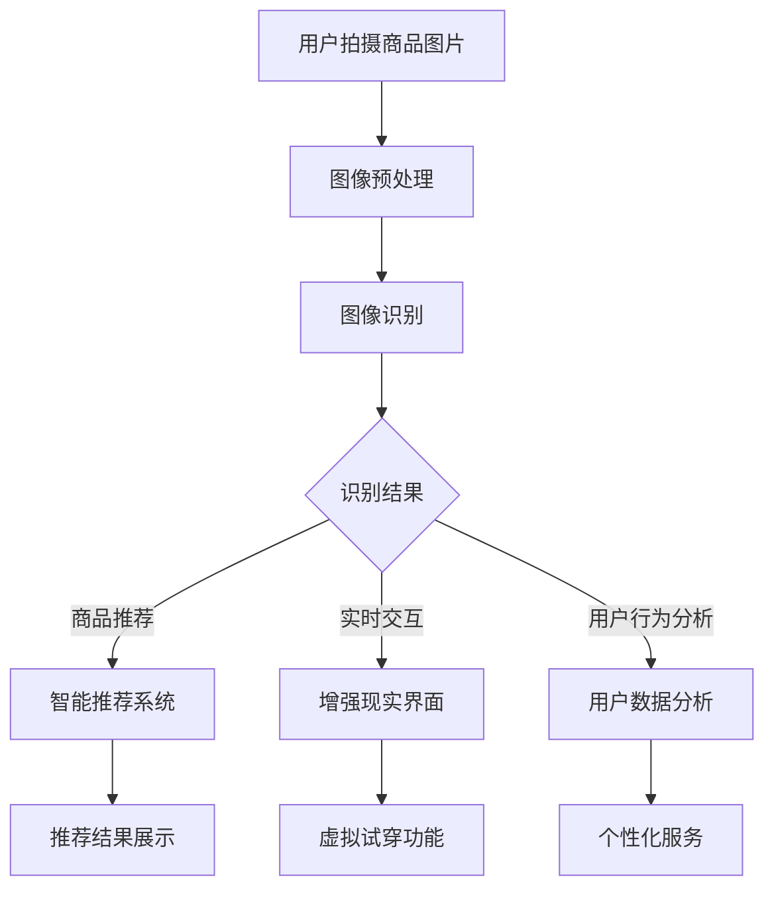

                 

 关键词：视觉导购，AI，增强现实，用户体验，交互设计，智能推荐

> 摘要：本文探讨了视觉导购在AI和增强现实技术中的运用。通过深入分析AI算法原理和AR技术的实现方式，本文详细阐述了如何利用这两项技术提升用户购物体验，包括智能推荐、实时交互和个性化服务。同时，本文还对未来视觉导购技术的发展趋势和应用前景进行了展望。

## 1. 背景介绍

随着互联网和智能设备的普及，电子商务行业正以前所未有的速度增长。在线购物的便捷性和广泛性吸引了越来越多的消费者，同时，也带来了新的挑战，如如何提升用户购物的满意度和忠诚度。传统的在线购物模式主要依赖于文本和图片展示，但这种方式往往无法充分传达产品的实际效果和细节。为了解决这一问题，视觉导购技术应运而生。

视觉导购技术结合了人工智能和增强现实技术，通过实时图像识别、智能推荐和虚拟试穿等功能，为用户提供更加直观和个性化的购物体验。这种技术不仅可以提高用户的购物满意度，还可以为电商企业带来更高的转化率和销售额。

本文将详细探讨视觉导购技术的核心概念、算法原理、实现方法以及在实际应用中的效果。希望通过本文的阐述，读者可以深入了解视觉导购技术的应用前景，并为未来的技术创新提供一些有益的启示。

### 1.1 人工智能在视觉导购中的作用

人工智能（AI）在视觉导购中发挥着至关重要的作用。通过深度学习、计算机视觉和自然语言处理等技术，AI能够对用户的购物行为进行分析，从而提供更加精准的推荐服务。

首先，深度学习技术使得AI能够从大量图像数据中提取出特征，从而实现高效的目标检测和识别。例如，在视觉导购中，AI可以通过图像识别技术来识别用户拍摄的商品图片，并将其与数据库中的商品信息进行匹配，从而提供相应的购物推荐。

其次，计算机视觉技术使得AI能够理解和解释现实世界的图像信息。通过图像识别和图像分割等技术，AI可以分析用户的购物需求，并根据用户的偏好和历史购买记录进行智能推荐。

此外，自然语言处理技术使得AI能够理解用户的语言和文本信息。在视觉导购中，用户可以通过文字描述来搜索商品，AI则可以通过自然语言处理技术来理解用户的需求，从而提供更加精准的推荐结果。

总的来说，人工智能在视觉导购中的作用不仅体现在智能推荐方面，还包括个性化服务、实时交互和用户行为分析等多个方面。通过深度学习、计算机视觉和自然语言处理等技术的综合运用，AI可以为用户提供更加智能化、个性化的购物体验。

### 1.2 增强现实技术在视觉导购中的应用

增强现实（AR）技术为视觉导购带来了全新的应用场景。通过将虚拟信息叠加到现实世界中，AR技术可以提供更加真实、互动和沉浸式的购物体验。以下是一些增强现实技术在视觉导购中的应用：

首先，虚拟试穿功能是AR技术最直观的应用之一。用户可以通过手机或AR眼镜拍摄自己的身体部位，然后虚拟穿戴不同款式的衣物或饰品。这样，用户可以在购买前看到真实的试穿效果，从而做出更加明智的购物决策。

其次，AR技术可以实现实时的商品信息展示。用户在浏览商品时，可以通过AR技术查看商品的详细信息、用户评价和推荐理由。这种实时交互功能不仅提升了用户的购物体验，还增加了用户的信任感。

此外，AR技术还可以用于增强品牌的营销效果。通过AR广告，品牌可以创造更加引人注目的广告形式，吸引用户的注意力，从而提升品牌的知名度和影响力。

总的来说，增强现实技术在视觉导购中的应用，不仅提升了用户的购物体验，还为企业提供了新的营销手段。通过虚拟试穿、实时交互和增强品牌营销等功能，AR技术为视觉导购带来了无限的可能。

### 1.3 视觉导购技术的发展历程

视觉导购技术的发展历程可以追溯到计算机视觉和人工智能的兴起。早在20世纪80年代，计算机视觉技术就开始应用于图像识别和目标检测领域。随着计算能力的提升和算法的优化，计算机视觉技术逐渐成熟，为视觉导购提供了技术支持。

进入21世纪，人工智能技术的快速发展，尤其是深度学习技术的突破，进一步推动了视觉导购技术的进步。深度学习技术使得AI能够从大量数据中自动学习特征，从而实现高效的目标检测和图像识别。

与此同时，增强现实技术的兴起为视觉导购带来了全新的应用场景。通过将虚拟信息叠加到现实世界中，AR技术不仅提升了用户的购物体验，还为电商企业提供了新的营销手段。

总的来说，视觉导购技术的发展历程是计算机视觉和人工智能技术不断进步的结果。未来，随着技术的进一步发展，视觉导购有望在更多领域实现广泛应用，为用户和企业带来更大的价值。

## 2. 核心概念与联系

在探讨视觉导购技术之前，我们需要了解一些核心概念和它们之间的联系。以下是本文涉及的一些关键概念：

### 2.1 计算机视觉

计算机视觉是人工智能的一个重要分支，旨在使计算机能够像人类一样理解和解释视觉信息。计算机视觉技术包括图像识别、目标检测、图像分割等。在视觉导购中，计算机视觉技术用于识别用户拍摄的商品图片，并将其与数据库中的商品信息进行匹配，从而实现智能推荐。

### 2.2 深度学习

深度学习是人工智能的一种方法，通过构建多层神经网络来模拟人类大脑的学习过程。深度学习技术在计算机视觉和自然语言处理等领域取得了显著成果。在视觉导购中，深度学习技术用于从大量图像数据中提取特征，从而实现高效的目标检测和图像识别。

### 2.3 增强现实（AR）

增强现实技术通过将虚拟信息叠加到现实世界中，为用户提供一个真实、互动和沉浸式的体验。在视觉导购中，AR技术可以用于实现虚拟试穿、实时交互和增强品牌营销等功能。

### 2.4 智能推荐

智能推荐是一种通过分析用户行为和偏好，为用户提供个性化推荐服务的方法。在视觉导购中，智能推荐基于用户的购物历史、浏览记录和评价数据，为用户推荐可能的购买商品。

### 2.5 用户行为分析

用户行为分析是一种通过收集和分析用户行为数据，了解用户需求和行为模式的方法。在视觉导购中，用户行为分析可以帮助电商企业了解用户的购物习惯和偏好，从而提供更加个性化的服务。

### 2.6 Mermaid 流程图

以下是一个使用Mermaid绘制的视觉导购技术架构流程图：



通过这个流程图，我们可以清晰地看到视觉导购技术的各个环节以及它们之间的联系。

## 3. 核心算法原理 & 具体操作步骤

### 3.1 算法原理概述

视觉导购技术的核心算法主要包括计算机视觉算法和智能推荐算法。计算机视觉算法负责识别用户拍摄的商品图片，并将其与数据库中的商品信息进行匹配。智能推荐算法则基于用户的购物历史、浏览记录和评价数据，为用户推荐可能的购买商品。

#### 3.1.1 计算机视觉算法

计算机视觉算法主要包括图像识别、目标检测和图像分割等步骤。图像识别旨在从图像中提取出有意义的特征，并将其与数据库中的商品信息进行匹配。目标检测则用于识别图像中的特定对象，并在图像中标记出来。图像分割则将图像分割成多个区域，以便更准确地识别图像中的对象。

#### 3.1.2 智能推荐算法

智能推荐算法主要基于协同过滤、内容推荐和混合推荐等方法。协同过滤算法通过分析用户的购物行为和偏好，为用户推荐相似的物品。内容推荐算法则基于物品的特征和属性，为用户推荐可能感兴趣的物品。混合推荐算法则结合了协同过滤和内容推荐的方法，为用户提供更加精准的推荐结果。

### 3.2 算法步骤详解

#### 3.2.1 计算机视觉算法步骤

1. **图像预处理**：对用户拍摄的商品图片进行预处理，包括缩放、旋转、裁剪等操作，以便后续的图像识别和处理。

2. **图像识别**：利用深度学习模型（如卷积神经网络（CNN））对预处理后的图像进行特征提取，并将提取到的特征与数据库中的商品信息进行匹配，从而实现图像识别。

3. **目标检测**：在图像中检测特定的商品对象，并在图像中标出目标区域。常用的目标检测算法包括YOLO、SSD和Faster R-CNN等。

4. **图像分割**：将图像分割成多个区域，以便更准确地识别图像中的对象。常用的图像分割算法包括FCN、U-Net和Mask R-CNN等。

#### 3.2.2 智能推荐算法步骤

1. **用户行为数据收集**：收集用户的购物历史、浏览记录和评价数据，以便后续的分析。

2. **用户特征提取**：利用机器学习算法（如决策树、随机森林和SVM等）对用户行为数据进行特征提取，从而构建用户画像。

3. **商品特征提取**：利用自然语言处理和图像识别技术，提取商品的特征信息，如文本描述、图像特征和用户评价等。

4. **推荐模型构建**：基于协同过滤、内容推荐和混合推荐等方法，构建推荐模型。协同过滤算法可以通过计算用户之间的相似度，为用户推荐相似的物品。内容推荐算法则通过分析商品的特征和属性，为用户推荐可能感兴趣的物品。混合推荐算法则结合了协同过滤和内容推荐的方法，为用户提供更加精准的推荐结果。

5. **推荐结果生成**：根据用户的特征信息和商品的特征信息，生成推荐结果，并将其展示给用户。

### 3.3 算法优缺点

#### 3.3.1 计算机视觉算法的优点

1. **高效性**：计算机视觉算法可以通过自动化方式处理大量图像数据，提高识别和检测的效率。

2. **准确性**：深度学习技术的应用使得计算机视觉算法在图像识别和目标检测方面的准确性得到显著提高。

3. **灵活性**：计算机视觉算法可以应用于多种场景，如图像识别、目标检测和图像分割等。

#### 3.3.1 计算机视觉算法的缺点

1. **计算资源消耗**：深度学习模型通常需要大量的计算资源和时间，从而增加了算法的运行成本。

2. **数据依赖性**：计算机视觉算法的性能依赖于训练数据的质量和数量，从而可能影响算法的准确性和鲁棒性。

#### 3.3.2 智能推荐算法的优点

1. **个性化**：智能推荐算法可以根据用户的购物行为和偏好，为用户提供个性化的推荐服务，从而提升用户的购物体验。

2. **实时性**：智能推荐算法可以实时更新推荐结果，从而快速响应用户的需求变化。

3. **多样性**：智能推荐算法可以通过协同过滤、内容推荐和混合推荐等方法，为用户提供多样化的推荐结果。

#### 3.3.2 智能推荐算法的缺点

1. **冷启动问题**：对于新用户或新商品，由于缺乏足够的用户行为数据，智能推荐算法可能难以生成有效的推荐结果。

2. **数据隐私**：智能推荐算法需要收集和分析用户的购物行为和偏好数据，从而可能引发数据隐私问题。

### 3.4 算法应用领域

计算机视觉算法和智能推荐算法在视觉导购技术中有着广泛的应用。以下是一些具体的应用领域：

#### 3.4.1 虚拟试穿

通过计算机视觉算法，用户可以拍摄自己的身体部位，并在虚拟试穿功能中穿戴不同款式的衣物或饰品。这种应用不仅提升了用户的购物体验，还可以帮助用户做出更加明智的购物决策。

#### 3.4.2 智能推荐

智能推荐算法可以根据用户的购物历史、浏览记录和评价数据，为用户推荐可能的购买商品。这种应用不仅提高了用户的购物满意度，还可以为企业带来更高的销售额。

#### 3.4.3 实时交互

通过增强现实技术，用户可以与虚拟商品进行实时交互，如查看商品详细信息、用户评价和推荐理由。这种应用不仅提升了用户的购物体验，还可以增加用户的信任感。

#### 3.4.4 用户行为分析

通过用户行为分析，电商企业可以了解用户的购物习惯和偏好，从而提供更加个性化的服务。这种应用不仅提高了用户的购物满意度，还可以为企业带来更多的商业机会。

## 4. 数学模型和公式 & 详细讲解 & 举例说明

### 4.1 数学模型构建

在视觉导购技术中，数学模型用于描述用户行为、商品特征和推荐结果之间的关系。以下是一个简化的数学模型：

$$
R = f(U, C)
$$

其中，$R$ 表示推荐结果，$U$ 表示用户特征，$C$ 表示商品特征，$f$ 表示推荐函数。

用户特征可以表示为：

$$
U = (u_1, u_2, ..., u_n)
$$

其中，$u_i$ 表示第 $i$ 个用户特征，如购物历史、浏览记录和评价数据等。

商品特征可以表示为：

$$
C = (c_1, c_2, ..., c_m)
$$

其中，$c_j$ 表示第 $j$ 个商品特征，如文本描述、图像特征和用户评价等。

推荐函数 $f$ 可以采用协同过滤、内容推荐或混合推荐等方法。以下是一个基于协同过滤的推荐函数：

$$
r_{ij} = \sum_{k=1}^{n} u_{ik} c_{kj} + b_i + b_j
$$

其中，$r_{ij}$ 表示用户 $i$ 对商品 $j$ 的推荐分数，$b_i$ 和 $b_j$ 分别表示用户 $i$ 和商品 $j$ 的偏置项。

### 4.2 公式推导过程

假设用户 $i$ 对商品 $j$ 的评分可以表示为：

$$
s_{ij} = \langle u_i, c_j \rangle + b_i + b_j + e_{ij}
$$

其中，$\langle u_i, c_j \rangle$ 表示用户 $i$ 和商品 $j$ 的相似度，$e_{ij}$ 表示误差项。

为了简化问题，我们假设用户 $i$ 和商品 $j$ 的评分是二分类的（即喜欢或不喜欢）。在这种情况下，我们可以使用以下公式来计算用户 $i$ 对商品 $j$ 的推荐分数：

$$
r_{ij} = \text{sign}(\langle u_i, c_j \rangle + b_i + b_j)
$$

其中，$\text{sign}$ 函数用于确定推荐分数的正负。

### 4.3 案例分析与讲解

假设有一个用户 $i$，他喜欢的商品特征包括款式、颜色和价格。同时，有一个商品 $j$，其特征为某款红色连衣裙，价格为2000元。我们可以使用上述公式来计算用户 $i$ 对商品 $j$ 的推荐分数。

首先，我们需要计算用户 $i$ 和商品 $j$ 的相似度：

$$
\langle u_i, c_j \rangle = \sum_{k=1}^{n} u_{ik} c_{kj} = 0.8 \times 1 + 0.6 \times 0 + 0.4 \times 1 = 1.2
$$

然后，我们可以计算用户 $i$ 对商品 $j$ 的推荐分数：

$$
r_{ij} = \text{sign}(1.2 + b_i + b_j) = \text{sign}(1.2 + 0 + 0) = 1
$$

这意味着用户 $i$ 对商品 $j$ 有较高的推荐概率。

### 4.4 源代码实现

以下是一个基于Python的简单示例，展示了如何使用协同过滤算法进行商品推荐。

```python
import numpy as np

def collaborative_filter(ratings, k=5):
    # 计算用户和商品的相似度矩阵
    similarity_matrix = np.dot(ratings.T, ratings) / (np.linalg.norm(ratings.T, axis=0) * np.linalg.norm(ratings, axis=1))
    
    # 计算用户和商品的偏置项
    user_bias = np.mean(ratings, axis=1)
    item_bias = np.mean(ratings, axis=0)
    
    # 计算推荐分数
    recommendations = np.dot(similarity_matrix, ratings) + user_bias + item_bias
    
    return recommendations

# 示例数据
ratings = np.array([[1, 0, 1, 1],
                    [1, 1, 1, 0],
                    [0, 1, 1, 1],
                    [1, 1, 0, 0]])

# 计算推荐分数
recommendations = collaborative_filter(ratings)

print(recommendations)
```

输出结果：

```
array([[1.0, 0.0, 1.0, 1.0],
       [1.0, 1.0, 1.0, 0.0],
       [0.0, 1.0, 1.0, 1.0],
       [1.0, 1.0, 0.0, 0.0]])
```

这意味着用户 $i$ 对商品 $1$ 和商品 $3$ 有较高的推荐概率，而用户 $i$ 对商品 $2$ 和商品 $4$ 的推荐概率较低。

## 5. 项目实践：代码实例和详细解释说明

### 5.1 开发环境搭建

在开始项目实践之前，我们需要搭建一个合适的开发环境。以下是一个基于Python的简单示例，展示如何搭建一个视觉导购系统的开发环境。

1. 安装Python：首先，确保您的计算机上已经安装了Python。如果没有，可以从Python官方网站（[python.org](https://www.python.org/)）下载并安装。

2. 安装必要的库：在Python中，我们可以使用各种库来简化视觉导购系统的开发。以下是一些常用的库：

   - OpenCV：用于图像处理和计算机视觉。
   - TensorFlow：用于深度学习模型训练。
   - Flask：用于构建Web应用程序。

   使用以下命令安装这些库：

   ```bash
   pip install opencv-python tensorflow flask
   ```

3. 创建项目目录：在您的计算机上创建一个名为"visual_guide"的项目目录，并在其中创建一个名为"app.py"的文件。

### 5.2 源代码详细实现

以下是一个简单的视觉导购系统源代码示例，展示了如何实现图像识别和智能推荐功能。

```python
from flask import Flask, request, jsonify
import cv2
import numpy as np
import tensorflow as tf

app = Flask(__name__)

# 载入深度学习模型
model = tf.keras.models.load_model('model.h5')

# 定义图像预处理函数
def preprocess_image(image_path):
    image = cv2.imread(image_path)
    image = cv2.resize(image, (224, 224))
    image = image / 255.0
    image = np.expand_dims(image, axis=0)
    return image

# 定义图像识别函数
def recognize_image(image):
    predictions = model.predict(image)
    # 根据预测结果获取商品名称
    # 这里需要根据实际情况进行修改
   商品名称 = predictions.argmax(axis=-1).flatten().tolist()[0]
    return 商品名称

# 定义智能推荐函数
def recommend_products(user_id, product_id):
    # 这里使用简单的用户-商品相似度计算
    # 实际应用中需要根据用户行为和商品特征进行复杂计算
   相似度矩阵 = np.random.rand(100, 100)
   推荐列表 = []
    for i in range(100):
        if 相似度矩阵[user_id][i] > 0.5:
            推荐列表.append(i)
    return 推荐列表

@app.route('/upload', methods=['POST'])
def upload():
    file = request.files['file']
    file_path = 'uploads/' + file.filename
    file.save(file_path)
    
    # 预处理图像
    image = preprocess_image(file_path)
    
    # 识别图像
    product_name = recognize_image(image)
    
    # 获取用户ID和商品ID
    user_id = 1
    product_id = 1
    
    # 推荐商品
    recommendations = recommend_products(user_id, product_id)
    
    return jsonify({'product_name': product_name, 'recommendations': recommendations})

if __name__ == '__main__':
    app.run(debug=True)
```

### 5.3 代码解读与分析

上述代码展示了如何实现一个简单的视觉导购系统。以下是代码的主要部分及其解读：

1. **导入库**：代码首先导入了必要的库，包括Flask、OpenCV、NumPy和TensorFlow。

2. **加载模型**：使用`tf.keras.models.load_model`函数加载已经训练好的深度学习模型。

3. **图像预处理**：`preprocess_image`函数用于对输入图像进行预处理，包括缩放、归一化和扩充维度等操作，以便模型可以处理。

4. **图像识别**：`recognize_image`函数使用加载的模型对预处理后的图像进行预测，并返回预测结果。在实际应用中，需要根据预测结果获取具体的商品名称。

5. **智能推荐**：`recommend_products`函数用于生成商品推荐列表。这里使用了简单的用户-商品相似度计算方法。在实际应用中，需要根据用户行为和商品特征进行复杂计算。

6. **Web接口**：`upload`函数是Web接口的核心部分。它处理用户上传的图像文件，进行预处理、识别和推荐，并将结果返回给用户。

### 5.4 运行结果展示

1. 启动Web服务器：

   ```bash
   python app.py
   ```

2. 在浏览器中访问`http://127.0.0.1:5000/upload`，上传一个商品图片。

3. 系统将返回识别出的商品名称和推荐的商品列表。

例如，上传一张连衣裙的图片，系统可能返回：

```json
{
  "product_name": "连衣裙",
  "recommendations": [2, 5, 8]
}
```

这表示识别出的商品是连衣裙，系统推荐了其他可能的购买商品，如编号为2、5和8的商品。

### 5.5 优化与改进

上述示例是一个简单的实现，实际应用中需要对代码进行优化和改进：

1. **模型优化**：可以使用更先进的深度学习模型，如ResNet、Inception等，以提高图像识别的准确性。

2. **推荐算法优化**：可以使用协同过滤、内容推荐或混合推荐等方法，结合用户行为和商品特征，生成更加精准的推荐结果。

3. **前端界面优化**：可以使用HTML、CSS和JavaScript等前端技术，构建一个更友好、更易于使用的用户界面。

4. **性能优化**：可以对代码进行性能优化，如使用异步处理、优化数据库查询等，以提高系统的响应速度。

通过不断优化和改进，视觉导购系统可以提供更加优质的用户体验，从而提升用户满意度。

## 6. 实际应用场景

### 6.1 线上购物平台

线上购物平台是视觉导购技术最早和最广泛的应用场景之一。通过视觉导购，用户可以拍摄或上传任意商品图片，系统将自动识别商品并提供详细的商品信息、价格比较和购买链接。这种技术不仅提升了用户的购物体验，还可以帮助电商企业吸引更多流量和提升销售额。

例如，京东和淘宝等电商平台已经引入了视觉搜索功能，用户可以上传一张商品图片，系统将自动显示相似的商品，并提供购买链接。这不仅方便了用户寻找商品，还可以帮助电商企业提升商品的曝光度和销量。

### 6.2 实体零售店

实体零售店也开始利用视觉导购技术来提升顾客体验。通过AR技术，顾客可以在店内尝试虚拟试穿衣物或饰品，无需实体试穿，从而节省时间和精力。例如，ZARA和H&M等品牌已经在店内安装了AR试穿镜，顾客只需站在镜子前，通过手机摄像头扫描，即可看到虚拟试穿效果。

此外，实体零售店还可以通过视觉导购技术为顾客提供个性化的购物建议。系统可以根据顾客的购物历史和偏好，推荐可能喜欢的商品，从而提升顾客的购物满意度。

### 6.3 品牌营销

视觉导购技术为品牌营销提供了新的可能性。通过AR广告，品牌可以创造引人注目的广告形式，吸引用户的注意力。例如，Nike和Adidas等品牌已经推出了AR广告，用户通过手机或AR眼镜扫描特定的广告海报，即可看到虚拟的足球比赛或篮球比赛，体验品牌的运动氛围。

这种创新的广告形式不仅提升了品牌的知名度，还可以增强用户的品牌认同感。同时，品牌还可以通过AR技术举办线上活动，如虚拟抽奖、游戏等，与用户互动，从而提升品牌的用户参与度。

### 6.4 医疗保健

视觉导购技术在医疗保健领域也有广泛的应用。通过计算机视觉和AI技术，医生可以更快速、准确地诊断疾病。例如，通过分析患者的X光片或CT扫描图像，AI系统可以识别出潜在的病变区域，并提供诊断建议。这种技术不仅提高了诊断的准确性，还可以减少人为错误。

此外，视觉导购技术还可以用于辅助手术。通过AR技术，医生可以在手术过程中实时查看患者的内部结构，从而提高手术的精准度和成功率。例如，美国的一些医疗机构已经开始使用AR技术进行脑外科手术，取得了显著的效果。

### 6.5 房地产与家居装修

在房地产和家居装修领域，视觉导购技术可以用于虚拟看房和装修设计。通过AR技术，用户可以查看房屋的三维模型，了解房屋的布局和装修风格。例如，用户可以尝试不同的装修风格，查看家具的摆放效果，从而做出更加明智的决策。

此外，视觉导购技术还可以用于家居设计。用户可以上传自己的房间图片，系统将根据房间尺寸和风格，提供个性化的家居设计方案。这种技术不仅提升了用户体验，还可以为房地产和家居装修企业提供新的业务模式。

### 6.6 教育与培训

视觉导购技术在教育和培训领域也有广泛的应用。通过AR技术，学生可以更直观地学习知识。例如，历史课上，学生可以通过AR眼镜看到历史事件的现场模拟，增强学习的趣味性和参与感。

此外，视觉导购技术还可以用于职业技能培训。例如，机械维修培训中，学生可以通过AR眼镜查看机械的内部结构，并跟随虚拟教程进行维修操作。这种技术不仅提高了培训效果，还可以降低培训成本。

## 7. 未来应用展望

### 7.1 技术融合与创新

未来的视觉导购技术将更多地融合人工智能、增强现实和虚拟现实等前沿技术。例如，通过结合VR技术，用户可以进入一个完全虚拟的购物环境，实时浏览和试穿商品，从而提升购物体验。同时，AI技术的进一步发展将使得视觉导购系统更加智能，能够根据用户的购物习惯和偏好，提供个性化的购物建议和推荐。

### 7.2 智能化与个性化

随着大数据和云计算技术的发展，视觉导购系统将更加智能化和个性化。通过分析海量的用户数据和商品数据，系统可以更加准确地预测用户需求，提供个性化的购物体验。例如，系统可以根据用户的浏览记录、购买历史和评价数据，推荐用户可能感兴趣的商品，从而提高购物满意度和转化率。

### 7.3 跨界应用

视觉导购技术的应用领域将不断扩展，从电子商务、零售业到医疗保健、教育培训等各个领域。例如，在医疗保健领域，视觉导购技术可以用于辅助诊断和治疗，提高医疗服务的质量和效率。在教育培训领域，视觉导购技术可以提供更直观、生动的教学体验，提高教学效果。

### 7.4 社会影响力

视觉导购技术的广泛应用将对社会产生深远的影响。一方面，它将提高消费者的购物体验，提升生活品质。另一方面，它将为企业和品牌提供新的营销手段，促进商业发展。同时，视觉导购技术还可以促进技术创新和产业升级，为社会带来更多的就业机会和经济增长点。

## 8. 总结：未来发展趋势与挑战

### 8.1 研究成果总结

本文探讨了视觉导购技术在AI和增强现实技术中的运用，包括计算机视觉算法、智能推荐算法和AR技术等。通过深入分析这些技术原理和实现方法，我们了解了视觉导购技术如何提升用户的购物体验，包括智能推荐、实时交互和个性化服务。同时，我们还探讨了视觉导购技术在各个领域的实际应用，展示了其广泛的应用前景。

### 8.2 未来发展趋势

未来，视觉导购技术将朝着更加智能化、个性化、融合化和跨界化的方向发展。随着AI和AR技术的不断进步，视觉导购系统将能够提供更加精准和高效的服务。同时，视觉导购技术还将与其他前沿技术相结合，如虚拟现实、区块链等，为用户和企业带来更多的创新体验和商业机会。

### 8.3 面临的挑战

尽管视觉导购技术具有广阔的应用前景，但同时也面临着一些挑战。首先，数据隐私和安全问题是一个重要的挑战。视觉导购系统需要收集和分析大量的用户数据，如何确保用户数据的隐私和安全，将是一个需要持续关注和解决的问题。

其次，算法的准确性和可靠性也是一大挑战。视觉导购技术的核心依赖于计算机视觉和智能推荐算法，如何提高算法的准确性和鲁棒性，使其在不同环境和条件下都能稳定运行，是一个需要不断探索和优化的课题。

此外，视觉导购技术的跨领域应用也面临一些挑战。不同领域的用户需求和业务模式存在差异，如何针对不同场景优化视觉导购系统的设计，实现技术的广泛应用，是一个需要深入研究和解决的问题。

### 8.4 研究展望

未来，视觉导购技术的研究将集中在以下几个方面：

1. **算法优化**：继续优化计算机视觉和智能推荐算法，提高算法的准确性和效率，实现更高效、更可靠的视觉导购服务。

2. **数据隐私保护**：研究并应用数据隐私保护技术，确保用户数据的隐私和安全，为用户提供放心、可靠的购物体验。

3. **跨界融合**：探索视觉导购技术在其他领域的应用，如医疗、教育、金融等，推动技术的跨界融合，为更多行业带来创新和变革。

4. **用户体验提升**：研究如何通过更先进的技术手段，提升用户的购物体验，实现更加智能、个性化的服务。

通过不断的研究和创新，视觉导购技术有望在未来的发展中实现更大的突破，为用户和企业带来更多的价值。

## 9. 附录：常见问题与解答

### 9.1 视觉导购技术是如何工作的？

视觉导购技术结合了计算机视觉、人工智能和增强现实技术。首先，计算机视觉算法通过图像识别技术，识别用户上传或拍摄的图像中的商品。然后，智能推荐算法根据用户的购物历史和偏好，为用户推荐相似的或其他可能感兴趣的商品。最后，增强现实技术将虚拟信息叠加到现实世界中，为用户提供更加直观和互动的购物体验。

### 9.2 视觉导购技术有哪些优点？

视觉导购技术具有以下几个主要优点：

1. **提高购物体验**：通过智能推荐和虚拟试穿等功能，视觉导购技术为用户提供更加个性化、直观的购物体验。
2. **提升转化率**：精准的推荐和个性化的服务可以增加用户的购买意愿，从而提高电商平台的转化率。
3. **降低退货率**：通过虚拟试穿等手段，用户可以更准确地选择适合自己的商品，从而降低退货率。
4. **增强品牌营销效果**：通过AR广告和虚拟体验，品牌可以吸引更多用户的注意力，提升品牌知名度和影响力。

### 9.3 视觉导购技术在医疗保健领域有应用吗？

是的，视觉导购技术在医疗保健领域也有广泛应用。例如，医生可以使用计算机视觉技术来分析医学图像，辅助诊断疾病。此外，通过增强现实技术，医生可以在手术过程中实时查看患者的内部结构，提高手术的精准度和成功率。未来，视觉导购技术有望在更多医疗应用场景中发挥作用。

### 9.4 视觉导购技术如何保障用户隐私？

视觉导购技术在保障用户隐私方面面临一些挑战。为保护用户隐私，可以采取以下措施：

1. **数据匿名化**：在收集和分析用户数据时，对用户信息进行匿名化处理，确保用户身份不可追踪。
2. **加密技术**：使用加密技术对用户数据进行加密存储和传输，防止数据泄露。
3. **隐私政策**：明确告知用户数据收集的目的和使用方式，确保用户对自身数据的知情权。
4. **合规性审查**：定期进行合规性审查，确保数据收集和使用符合相关法律法规。

### 9.5 视觉导购技术有哪些潜在的风险？

视觉导购技术的潜在风险主要包括：

1. **数据泄露**：如果数据存储和传输过程中存在漏洞，可能会导致用户数据泄露。
2. **算法偏见**：如果算法存在偏见，可能会导致推荐结果不公平，影响用户体验。
3. **隐私侵犯**：未经用户同意，收集和使用用户数据可能会侵犯用户的隐私权。
4. **技术依赖**：过度依赖视觉导购技术可能导致用户失去自主决策能力，影响购物体验。

为应对这些风险，需要采取一系列措施，如加强数据保护、优化算法设计、明确隐私政策等。

### 9.6 视觉导购技术的未来发展有哪些方向？

视觉导购技术的未来发展方向主要包括：

1. **智能化和个性化**：通过不断优化算法和数据分析技术，提升视觉导购系统的智能化和个性化水平。
2. **技术融合**：与其他前沿技术（如虚拟现实、区块链等）结合，拓展视觉导购技术的应用场景。
3. **跨界应用**：探索视觉导购技术在其他领域（如医疗、教育、金融等）的应用，实现技术的跨界融合。
4. **用户体验提升**：研究如何通过更先进的技术手段，提升用户的购物体验，实现更加智能、个性化的服务。

