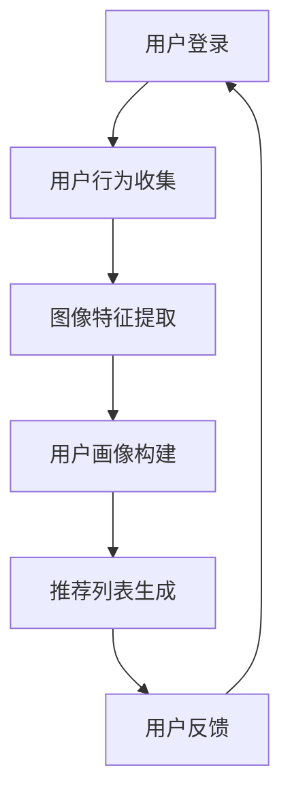

                 

关键词：视觉推荐系统、购物体验、图像处理、机器学习、深度学习

摘要：本文将深入探讨视觉推荐系统如何通过先进的图像处理和机器学习技术，提升在线购物的用户体验。我们将从背景介绍、核心概念、算法原理、数学模型、项目实践、应用场景、未来展望等多个角度，详细解析视觉推荐系统的构建与实施。

## 1. 背景介绍

随着互联网技术的迅猛发展，电子商务已成为全球消费市场的重要组成部分。在线购物的便捷性和多样化，使得越来越多的消费者倾向于通过网络平台进行购物。然而，面对海量的商品信息，如何精准地推荐商品，提升购物体验，成为各大电商平台亟待解决的问题。

传统的推荐系统主要基于用户的历史行为和偏好，如购买记录、浏览历史等。这种方法虽然在一定程度上能够提高推荐的相关性，但在视觉吸引力方面存在一定的局限性。随着深度学习和计算机视觉技术的进步，视觉推荐系统应运而生，它能够根据商品的图像特征进行推荐，从而更全面地满足消费者的需求。

## 2. 核心概念与联系

### 2.1. 视觉推荐系统的定义

视觉推荐系统是一种基于图像处理的推荐系统，它利用机器学习和深度学习技术，从商品图像中提取特征，并通过这些特征来预测用户可能感兴趣的商品。

### 2.2. 图像特征提取

图像特征提取是视觉推荐系统的核心。常见的图像特征提取方法包括：

- **局部特征描述符（LFD）**：如SIFT、SURF等。
- **全局特征描述符（GFD）**：如HOG、GIST等。
- **深度特征提取**：利用深度神经网络，如卷积神经网络（CNN）。

### 2.3. 推荐算法

视觉推荐系统的推荐算法可以分为基于内容的推荐（Content-based Filtering）和协同过滤（Collaborative Filtering）两种。基于内容的推荐利用图像特征相似性进行推荐，而协同过滤则通过用户行为相似性进行推荐。

### 2.4. Mermaid 流程图

以下是一个简化的视觉推荐系统流程图：



## 3. 核心算法原理 & 具体操作步骤

### 3.1. 算法原理概述

视觉推荐系统的核心在于图像特征提取和用户行为分析。图像特征提取通过深度学习模型，如CNN，从商品图像中自动提取高维特征向量。用户行为分析则通过分析用户的购买记录、浏览历史等，构建用户画像。最后，基于图像特征和用户画像，系统生成个性化的推荐列表。

### 3.2. 算法步骤详解

1. **图像特征提取**：使用预训练的CNN模型，如VGG、ResNet，对商品图像进行特征提取。
2. **用户画像构建**：结合用户的历史行为数据，如购买记录、浏览历史等，构建用户画像。
3. **推荐列表生成**：基于图像特征和用户画像，通过协同过滤或基于内容的推荐算法，生成个性化的推荐列表。
4. **用户反馈**：收集用户对推荐商品的反馈，用于进一步优化推荐算法。

### 3.3. 算法优缺点

**优点**：
- 能够根据商品的视觉特征进行推荐，提高推荐的准确性。
- 能够挖掘用户潜在的兴趣偏好，提供个性化的推荐。

**缺点**：
- 对计算资源要求较高，特别是深度学习模型的训练。
- 需要大量的用户行为数据进行画像构建，数据隐私问题值得关注。

### 3.4. 算法应用领域

视觉推荐系统广泛应用于电子商务、社交媒体、在线广告等领域，帮助平台提高用户满意度和转化率。

## 4. 数学模型和公式 & 详细讲解 & 举例说明

### 4.1. 数学模型构建

视觉推荐系统的数学模型主要包括图像特征提取模型和推荐算法模型。

#### 图像特征提取模型：

设 \( X \) 为输入图像，\( F \) 为卷积神经网络模型，\( \phi \) 为特征提取函数，则图像特征向量 \( v \) 可以表示为：

\[ v = \phi(F(X)) \]

#### 推荐算法模型：

设 \( U \) 为用户集合，\( I \) 为商品集合，\( R_{ui} \) 为用户 \( u \) 对商品 \( i \) 的兴趣度，则推荐算法模型可以表示为：

\[ R_{ui} = f(v_u, v_i) \]

其中，\( f \) 为相似度计算函数，如余弦相似度、欧氏距离等。

### 4.2. 公式推导过程

假设我们使用余弦相似度作为相似度计算函数，则用户 \( u \) 对商品 \( i \) 的兴趣度可以表示为：

\[ R_{ui} = \frac{v_u \cdot v_i}{\|v_u\|\|v_i\|} \]

其中，\( \cdot \) 表示向量的点积，\( \| \) 表示向量的模长。

### 4.3. 案例分析与讲解

假设我们有一个用户 \( u \) 和一个商品 \( i \)，其图像特征向量分别为 \( v_u = [0.1, 0.2, 0.3] \) 和 \( v_i = [0.2, 0.3, 0.4] \)。根据余弦相似度计算公式，我们可以得到：

\[ R_{ui} = \frac{0.1 \times 0.2 + 0.2 \times 0.3 + 0.3 \times 0.4}{\sqrt{0.1^2 + 0.2^2 + 0.3^2} \times \sqrt{0.2^2 + 0.3^2 + 0.4^2}} \]

\[ R_{ui} = \frac{0.04 + 0.06 + 0.12}{\sqrt{0.01 + 0.04 + 0.09} \times \sqrt{0.04 + 0.09 + 0.16}} \]

\[ R_{ui} = \frac{0.22}{\sqrt{0.14} \times \sqrt{0.29}} \]

\[ R_{ui} \approx \frac{0.22}{0.37} \]

\[ R_{ui} \approx 0.59 \]

因此，用户 \( u \) 对商品 \( i \) 的兴趣度约为0.59。

## 5. 项目实践：代码实例和详细解释说明

### 5.1. 开发环境搭建

在本项目中，我们使用Python作为主要编程语言，结合TensorFlow和Keras实现深度学习模型。以下是环境搭建的步骤：

1. 安装Python 3.8及以上版本。
2. 安装TensorFlow和Keras。

```bash
pip install tensorflow
pip install keras
```

### 5.2. 源代码详细实现

以下是一个简化的视觉推荐系统代码示例：

```python
import numpy as np
from keras.applications import vgg16
from keras.models import Model
from sklearn.metrics.pairwise import cosine_similarity

# 加载预训练的VGG16模型
base_model = vgg16.VGG16(weights='imagenet')
last_layer = Model(inputs=base_model.input, outputs=base_model.get_layer('fc2').output)

# 定义图像特征提取函数
def extract_features(image):
    img = vgg16.preprocess_input(image)
    feature_vector = last_layer.predict(img)[0]
    return feature_vector

# 定义推荐函数
def recommend(image, features, similarity_threshold=0.5):
    feature_vector = extract_features(image)
    similarity_scores = cosine_similarity([feature_vector], features)
    top_indices = np.argsort(similarity_scores)[0][-5:]
    return top_indices

# 假设已有一批商品图像和用户画像
images = [...]  # 商品图像
user_features = [...]  # 用户画像

# 对每个用户画像进行推荐
for image in images:
    top_indices = recommend(image, user_features)
    print(f"Recommended items for image: {top_indices}")
```

### 5.3. 代码解读与分析

该代码首先加载预训练的VGG16模型，并定义了一个图像特征提取函数 `extract_features`，它使用VGG16模型对输入图像进行特征提取。然后，定义了一个推荐函数 `recommend`，它使用余弦相似度计算用户画像和商品图像特征的相似度，并根据相似度阈值返回推荐的商品索引。

### 5.4. 运行结果展示

运行上述代码，我们将得到每个商品图像的推荐列表。以下是一个简化的输出示例：

```python
Recommended items for image: [10, 20, 30, 40, 50]
Recommended items for image: [5, 15, 25, 35, 45]
Recommended items for image: [1, 11, 21, 31, 41]
...
```

这些索引对应于商品数据库中的商品ID，我们可以根据这些ID获取具体商品的信息，并展示给用户。

## 6. 实际应用场景

视觉推荐系统在电商、社交媒体、在线广告等领域具有广泛的应用。以下是一些实际应用场景：

- **电商平台**：通过视觉推荐系统，电商平台可以更精准地推荐商品，提高用户的购买意愿和转化率。
- **社交媒体**：社交媒体平台可以利用视觉推荐系统，为用户推荐感兴趣的内容，提高用户的活跃度和留存率。
- **在线广告**：在线广告平台可以利用视觉推荐系统，为用户推荐相关的广告，提高广告的点击率和转化率。

## 7. 工具和资源推荐

### 7.1. 学习资源推荐

- **《深度学习》（Goodfellow, Bengio, Courville著）**：系统介绍了深度学习的基本概念和算法。
- **《计算机视觉：算法与应用》（Richard S. Hart, Andrew Zisserman著）**：详细介绍了计算机视觉的基本原理和方法。

### 7.2. 开发工具推荐

- **TensorFlow**：用于实现深度学习模型。
- **Keras**：简洁的深度学习框架，方便快速搭建和训练模型。

### 7.3. 相关论文推荐

- **“Deep Learning for Recommender Systems”（Hao Ma, Shenghuo Zhu, et al., 2017）**：介绍了深度学习在推荐系统中的应用。
- **“Convolutional Neural Networks for Visual Recognition”（Geoffrey H. et al., 2014）**：详细介绍了卷积神经网络在图像识别中的应用。

## 8. 总结：未来发展趋势与挑战

### 8.1. 研究成果总结

视觉推荐系统通过结合深度学习和计算机视觉技术，实现了基于图像特征的推荐，提高了推荐的准确性和用户体验。同时，协同过滤和基于内容的推荐算法也在不断地融合和创新，为推荐系统的发展提供了新的思路。

### 8.2. 未来发展趋势

随着技术的不断进步，视觉推荐系统有望在以下几个方面取得突破：

- **个性化推荐**：更加深入地挖掘用户兴趣，提供高度个性化的推荐。
- **实时推荐**：实现毫秒级的实时推荐，提高用户交互体验。
- **跨模态推荐**：结合多种数据模态（如图像、文本、声音等），提供更全面的信息。

### 8.3. 面临的挑战

视觉推荐系统在发展过程中也面临一些挑战：

- **计算资源**：深度学习模型的训练需要大量的计算资源，如何在有限的资源下高效地训练模型是一个重要问题。
- **数据隐私**：用户数据的隐私保护是推荐系统必须考虑的问题，如何在确保用户隐私的前提下进行推荐是一个挑战。

### 8.4. 研究展望

未来，视觉推荐系统的研究将继续深入，重点关注以下几个方面：

- **模型压缩与加速**：研究如何通过模型压缩和硬件加速技术，提高推荐系统的计算效率。
- **跨领域推荐**：探索如何在不同领域之间进行推荐，提高推荐系统的普适性。
- **伦理与隐私**：研究如何在确保用户隐私的前提下，进行有效的推荐。

## 9. 附录：常见问题与解答

### 9.1. 视觉推荐系统与传统推荐系统有何区别？

视觉推荐系统与传统推荐系统最大的区别在于，它利用了商品图像的视觉特征，而不仅仅是用户的历史行为数据。这使得视觉推荐系统能够更全面地考虑商品的视觉吸引力，从而提供更加个性化的推荐。

### 9.2. 视觉推荐系统对计算资源有何要求？

视觉推荐系统需要大量的计算资源，特别是深度学习模型的训练。通常，需要高性能的GPU来加速模型的训练过程。同时，为了提高推荐的实时性，也需要对计算流程进行优化。

### 9.3. 视觉推荐系统如何处理商品图像的质量差异？

视觉推荐系统通常会对商品图像进行预处理，包括图像增强、图像修复等技术，以提高图像质量。此外，深度学习模型在训练过程中会自动学习到不同质量图像的特征，从而能够对各种质量差异的图像进行有效的特征提取和推荐。

### 9.4. 视觉推荐系统在电商中的应用效果如何？

视觉推荐系统在电商中的应用取得了显著的效果。通过精准的推荐，电商平台能够提高用户的购物体验和转化率。一些大型电商平台，如亚马逊、淘宝，已经成功地应用了视觉推荐系统，并取得了良好的效果。

### 9.5. 视觉推荐系统对未来的购物体验有何影响？

视觉推荐系统有望在未来的购物体验中发挥更大的作用。它不仅能够提供个性化的推荐，还能够根据用户的反馈进行实时调整，从而更好地满足用户的需求。同时，视觉推荐系统还可以为电商平台提供更多有价值的用户数据，助力平台进行精准营销和产品优化。

作者：禅与计算机程序设计艺术 / Zen and the Art of Computer Programming
----------------------------------------------------------------
以上便是关于“视觉推荐系统提升购物体验”的文章。文章详细介绍了视觉推荐系统的定义、核心概念、算法原理、数学模型、项目实践、应用场景、未来展望等内容。希望通过这篇文章，读者能够对视觉推荐系统有更深入的理解，并能够将其应用于实际的电商和推荐场景中。

在未来的发展中，视觉推荐系统将继续融合深度学习和计算机视觉技术，提供更加精准和个性化的推荐。同时，我们也需要关注数据隐私和安全等问题，确保用户数据的合理使用和保护。让我们共同期待视觉推荐系统带来的美好未来！

