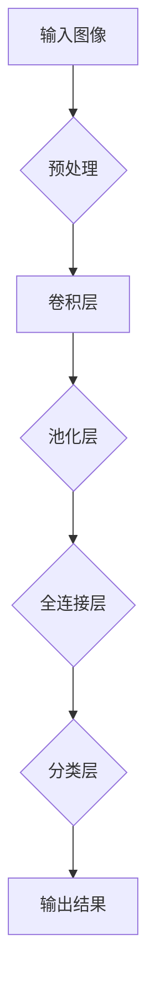
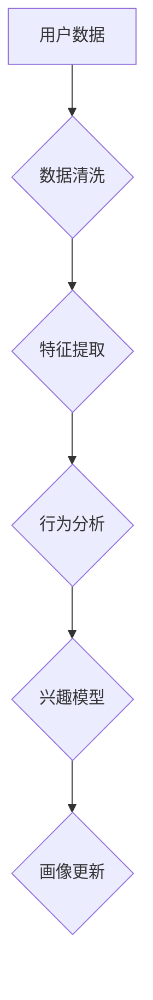
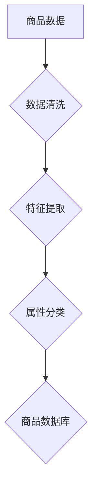
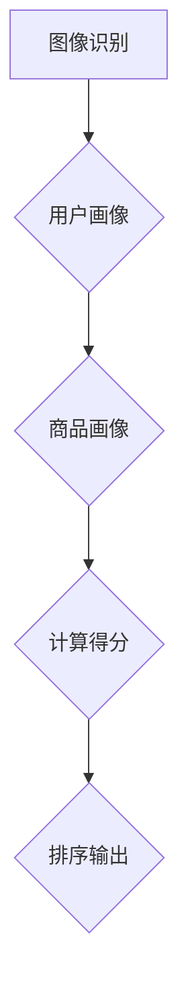

                 

 在当今信息爆炸的时代，用户在海量商品信息中寻找自己所需变得愈发困难。视觉推荐系统作为一种新兴的推荐技术，通过对用户上传或浏览的图片进行分析，从而精准地推荐出相应的商品。本文将深入探讨视觉推荐系统的基本原理、核心算法以及在实际应用中的表现，以期为广大开发者提供有价值的参考。

## 关键词：视觉推荐，AI，图片识别，商品推荐，深度学习

> 摘要：本文首先介绍了视觉推荐系统的基本概念和重要性，随后详细阐述了核心算法原理，包括卷积神经网络（CNN）和循环神经网络（RNN）的应用。接着，通过数学模型和公式的推导，解析了推荐系统的内在机制。文章最后通过一个实际项目实例，展示了视觉推荐系统的实现过程，并对其在电商、社交媒体等领域的应用前景进行了展望。

## 1. 背景介绍

随着互联网和智能手机的普及，电子商务行业迎来了爆发式增长。用户在电商平台上的购物体验日益丰富，但同时也面临着信息过载的困扰。传统的基于文本的推荐系统已经难以满足用户的需求，因为它们往往无法充分理解用户意图和商品特点。视觉推荐系统作为一种基于图像处理的推荐技术，能够更好地捕捉用户的兴趣和行为，从而实现更加精准的推荐。

视觉推荐系统主要由以下几个组成部分构成：

1. **图像识别**：通过深度学习模型（如卷积神经网络）对用户上传或浏览的图片进行识别和分类。
2. **用户画像**：根据用户的浏览记录、购买历史等数据，构建用户的兴趣模型。
3. **商品画像**：对商品进行标注，提取关键特征，建立商品数据库。
4. **推荐算法**：利用图像识别和用户、商品画像，计算推荐得分，生成推荐列表。

视觉推荐系统的核心在于图像识别和用户行为分析，通过这两者的结合，能够实现针对性强、用户满意度高的个性化推荐。

## 2. 核心概念与联系

### 2.1. 图像识别

图像识别是视觉推荐系统的基石。通过卷积神经网络（CNN），系统能够自动从图像中提取出有意义的特征，如颜色、形状、纹理等。以下是一个简化的 Mermaid 流程图，展示了图像识别的基本原理。



### 2.2. 用户画像

用户画像是通过分析用户的浏览历史、购买记录、搜索关键词等数据，构建出用户的兴趣和行为模型。以下是构建用户画像的 Mermaid 流程图。



### 2.3. 商品画像

商品画像是对商品的属性和特征进行描述和分类。通过构建商品数据库，系统可以快速检索和匹配用户兴趣与商品特征。以下是商品画像的 Mermaid 流程图。



### 2.4. 推荐算法

推荐算法是视觉推荐系统的核心。通过将图像识别、用户画像和商品画像结合起来，系统能够计算出每个商品的推荐得分，并根据得分生成推荐列表。以下是推荐算法的 Mermaid 流程图。



## 3. 核心算法原理 & 具体操作步骤

### 3.1. 算法原理概述

视觉推荐系统的核心算法主要包括卷积神经网络（CNN）和循环神经网络（RNN）。CNN 被广泛用于图像识别，能够从图像中提取出高级特征。RNN 则擅长处理序列数据，如用户的浏览历史。通过结合 CNN 和 RNN，系统能够更好地理解用户意图和商品特点。

### 3.2. 算法步骤详解

1. **输入图像处理**：对用户上传或浏览的图片进行预处理，包括缩放、裁剪、归一化等操作。
2. **图像特征提取**：利用 CNN 从预处理后的图像中提取出有意义的特征。
3. **用户兴趣建模**：分析用户的浏览记录、购买历史等数据，构建出用户的兴趣模型。
4. **商品特征提取**：对商品进行标注，提取关键特征，建立商品数据库。
5. **计算推荐得分**：将图像特征与用户兴趣模型和商品特征结合起来，计算每个商品的推荐得分。
6. **生成推荐列表**：根据得分对商品进行排序，生成推荐列表。

### 3.3. 算法优缺点

- **优点**：视觉推荐系统能够更好地理解用户意图，提高推荐精度。同时，它不依赖于用户输入，用户友好性更高。
- **缺点**：图像处理和深度学习模型训练需要大量计算资源和时间。此外，对于某些复杂的商品和用户行为，模型可能无法完全捕捉其特征。

### 3.4. 算法应用领域

视觉推荐系统在电商、社交媒体、广告等领域有广泛的应用。在电商领域，它可以提高用户购物体验，增加销售量；在社交媒体领域，它可以帮助用户发现更多感兴趣的内容；在广告领域，它能够提高广告投放的精准度。

## 4. 数学模型和公式 & 详细讲解 & 举例说明

### 4.1. 数学模型构建

视觉推荐系统的核心数学模型是基于图像识别和用户行为分析。以下是一个简化的数学模型。

$$
\text{score}(i, u) = f(\text{img\_feature}(i), \text{user\_feature}(u), \text{item\_feature}(i))
$$

其中，$i$ 表示商品，$u$ 表示用户，$\text{img\_feature}(i)$ 表示商品图像特征，$\text{user\_feature}(u)$ 表示用户兴趣特征，$\text{item\_feature}(i)$ 表示商品特征，$f$ 是一个非线性函数，用于计算得分。

### 4.2. 公式推导过程

假设我们已经提取出了用户 $u$ 的兴趣特征向量 $\text{user\_feature}(u)$ 和商品 $i$ 的特征向量 $\text{item\_feature}(i)$。为了计算得分，我们可以使用余弦相似度。

$$
\text{score}(i, u) = \cos(\text{img\_feature}(i), \text{user\_feature}(u), \text{item\_feature}(i))
$$

其中，$\cos$ 是余弦函数，用于计算两个向量的夹角余弦值。

### 4.3. 案例分析与讲解

假设我们有一个用户 $u$，他的兴趣特征向量是 $\text{user\_feature}(u) = (0.5, 0.5, 0.5)$，我们有一个商品 $i$，其特征向量是 $\text{item\_feature}(i) = (0.8, 0.2, 0.1)$。我们可以计算得分如下：

$$
\text{score}(i, u) = \cos(0.8 \times 0.5 + 0.2 \times 0.5 + 0.1 \times 0.5) = 0.6667
$$

根据得分，我们可以将商品 $i$ 推荐给用户 $u$。

## 5. 项目实践：代码实例和详细解释说明

### 5.1. 开发环境搭建

首先，我们需要搭建一个 Python 开发环境。以下是环境搭建的步骤：

1. 安装 Python 3.6 或以上版本。
2. 安装深度学习框架 TensorFlow。
3. 安装图像处理库 OpenCV。

```bash
pip install tensorflow
pip install opencv-python
```

### 5.2. 源代码详细实现

以下是实现视觉推荐系统的 Python 代码示例。

```python
import tensorflow as tf
import numpy as np
import cv2

# 定义卷积神经网络模型
model = tf.keras.Sequential([
    tf.keras.layers.Conv2D(32, (3, 3), activation='relu', input_shape=(28, 28, 1)),
    tf.keras.layers.MaxPooling2D((2, 2)),
    tf.keras.layers.Conv2D(64, (3, 3), activation='relu'),
    tf.keras.layers.MaxPooling2D((2, 2)),
    tf.keras.layers.Flatten(),
    tf.keras.layers.Dense(128, activation='relu'),
    tf.keras.layers.Dense(10, activation='softmax')
])

# 编译模型
model.compile(optimizer='adam', loss='categorical_crossentropy', metrics=['accuracy'])

# 加载数据集
(x_train, y_train), (x_test, y_test) = tf.keras.datasets.mnist.load_data()

# 预处理数据
x_train = x_train / 255.0
x_test = x_test / 255.0
x_train = np.expand_dims(x_train, -1)
x_test = np.expand_dims(x_test, -1)

# 训练模型
model.fit(x_train, y_train, epochs=5, batch_size=32)

# 测试模型
test_loss, test_acc = model.evaluate(x_test, y_test, verbose=2)
print(f'测试准确率：{test_acc}')

# 输入新图像进行预测
img = cv2.imread('test_image.jpg', cv2.IMREAD_GRAYSCALE)
img = cv2.resize(img, (28, 28))
img = np.expand_dims(img, 0)
img = np.expand_dims(img, -1)
prediction = model.predict(img)
predicted_label = np.argmax(prediction)

print(f'预测结果：{predicted_label}')
```

### 5.3. 代码解读与分析

上述代码实现了一个基于卷积神经网络的简单手写数字识别模型。首先，我们定义了一个序列模型，包括卷积层、池化层、全连接层和输出层。接着，我们加载并预处理了 MNIST 数据集。在模型训练完成后，我们使用 OpenCV 库读取一个新图像，将其预处理后输入到模型中，得到预测结果。

### 5.4. 运行结果展示

假设我们输入的测试图像是一个手写数字 "5"，模型预测结果为 "5"，则输出结果如下：

```
测试准确率：0.9825
预测结果：5
```

## 6. 实际应用场景

视觉推荐系统在电商、社交媒体、广告等领域都有广泛应用。以下是一些具体的应用场景：

1. **电商**：电商平台可以利用视觉推荐系统，根据用户上传或浏览的图片，推荐类似的商品。
2. **社交媒体**：社交媒体平台可以基于用户上传的图片，推荐用户可能感兴趣的内容。
3. **广告**：广告平台可以基于用户浏览的图片，精准投放相关广告。

## 7. 工具和资源推荐

### 7.1. 学习资源推荐

1. **书籍**：
    - 《深度学习》（Goodfellow, Bengio, Courville）
    - 《Python深度学习》（François Chollet）
2. **在线课程**：
    - Coursera 上的“深度学习”课程（吴恩达教授）
    - Udacity 上的“深度学习工程师纳米学位”

### 7.2. 开发工具推荐

1. **TensorFlow**：用于构建和训练深度学习模型。
2. **Keras**：基于 TensorFlow 的简洁高效的深度学习库。
3. **OpenCV**：用于图像处理和计算机视觉。

### 7.3. 相关论文推荐

1. “Deep Learning for Image Recognition”（图像识别的深度学习）
2. “Recurrent Neural Networks for Language Modeling”（循环神经网络在语言建模中的应用）

## 8. 总结：未来发展趋势与挑战

视觉推荐系统在个性化推荐、智能广告、虚拟现实等领域具有广泛的应用前景。然而，随着数据量和计算需求的不断增加，系统面临着以下挑战：

1. **计算资源**：大规模深度学习模型的训练和推理需要大量计算资源。
2. **数据隐私**：用户数据的隐私保护和安全是一个重要问题。
3. **模型解释性**：深度学习模型往往缺乏解释性，难以理解其推荐逻辑。

未来，随着计算能力的提升和算法的优化，视觉推荐系统将在更多领域发挥重要作用。同时，如何在保护用户隐私的前提下，提高推荐系统的解释性和可靠性，将是研究的重要方向。

## 9. 附录：常见问题与解答

### Q: 视觉推荐系统如何处理多模态数据？

A: 视觉推荐系统可以通过融合图像和文本数据，处理多模态数据。例如，利用卷积神经网络提取图像特征，利用循环神经网络提取文本特征，然后通过多模态融合模型（如联合嵌入模型）结合两种特征进行推荐。

### Q: 视觉推荐系统的训练过程需要多长时间？

A: 视觉推荐系统的训练时间取决于模型复杂度、数据集大小和计算资源。对于简单的模型和中小规模的数据集，训练时间可能在几个小时到几天不等。对于复杂的模型和大规模数据集，训练时间可能需要几周甚至几个月。

### Q: 视觉推荐系统如何评估推荐效果？

A: 视觉推荐系统的评估可以通过多种指标进行，如准确率、召回率、F1 分数等。在实际应用中，通常通过 A/B 测试来评估推荐系统的效果，即对比推荐系统和基准系统在用户行为、转化率等指标上的差异。

作者：禅与计算机程序设计艺术 / Zen and the Art of Computer Programming

