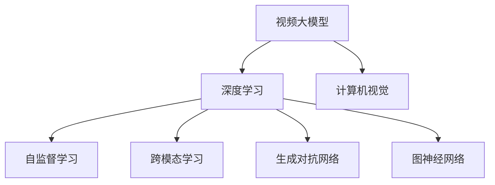

                 

 关键词：
- 视频大模型
- 深度学习
- 计算机视觉
- 图神经网络
- 生成对抗网络
- 自监督学习
- 跨模态学习
- AI 应用场景

> 摘要：
本文将探讨视频大模型的基本粒子创新，涵盖从核心概念到算法原理、数学模型、项目实践、应用场景以及未来发展趋势。通过深入剖析，我们将了解视频大模型在计算机视觉、生成对抗网络、自监督学习和跨模态学习等领域的应用，并展望其未来的发展趋势与挑战。

## 1. 背景介绍

近年来，随着深度学习的快速发展，计算机视觉领域取得了显著突破。传统的计算机视觉方法往往依赖于大量的手工设计特征和复杂的算法，而深度学习通过模拟人脑神经网络结构，使得计算机能够自动学习和提取特征，从而在图像分类、目标检测、图像分割等领域取得了巨大的成功。

然而，随着视频数据的爆炸式增长，单纯依赖图像处理的方法已经无法满足需求。视频大模型（Large-scale Video Models）应运而生，它们通过学习大规模视频数据，能够捕捉视频中的动态变化和复杂模式。视频大模型的兴起，不仅推动了计算机视觉的发展，也催生了新的研究热点，如自监督学习、跨模态学习和生成对抗网络等。

## 2. 核心概念与联系

### 2.1. 视频大模型

视频大模型是指通过深度学习技术，在大规模视频数据集上训练得到的模型。这类模型具有以下特点：

- **数据规模大**：训练数据集通常包含数百万甚至数十亿个视频帧。
- **参数量大**：模型参数数量通常达到数百万甚至数十亿个。
- **计算复杂度高**：模型训练需要大量的计算资源和时间。

### 2.2. 自监督学习

自监督学习是一种无需人工标注数据的学习方法。在自监督学习中，模型通过自身的内部信息，如数据之间的相似性或差异性，来学习表示。自监督学习在视频大模型中的应用，可以显著降低数据标注成本，提高模型训练效率。

### 2.3. 跨模态学习

跨模态学习是指将不同模态（如图像、文本、声音等）的信息进行融合，以提升模型的表现。在视频大模型中，跨模态学习可以通过结合图像和文本信息，来提高视频分类、视频问答等任务的性能。

### 2.4. 生成对抗网络

生成对抗网络（GAN）是一种通过竞争学习生成模型和判别模型的深度学习框架。在视频大模型中，GAN可以用于视频生成、视频增强等任务，通过模拟真实的视频数据，提升模型在视频处理任务中的表现。

### 2.5. 图神经网络

图神经网络（Graph Neural Networks，GNN）是一种专门用于处理图结构数据的深度学习模型。在视频大模型中，GNN可以用于视频帧之间的关系建模，通过捕捉视频中的时间序列信息，提高视频分类、视频分割等任务的性能。

### 2.6. Mermaid 流程图

以下是视频大模型的 Mermaid 流程图，展示了各核心概念之间的联系：



## 3. 核心算法原理 & 具体操作步骤

### 3.1. 算法原理概述

视频大模型的训练通常分为以下几个步骤：

1. 数据预处理：对视频数据进行分割、去噪、缩放等预处理操作。
2. 特征提取：利用卷积神经网络（CNN）提取视频帧的视觉特征。
3. 自监督学习：利用视频帧之间的关联性进行自监督学习。
4. 跨模态学习：结合文本、声音等其他模态的信息。
5. 生成对抗网络：利用 GAN 生成逼真的视频数据。
6. 图神经网络：利用 GNN 捕捉视频帧之间的关系。

### 3.2. 算法步骤详解

#### 3.2.1. 数据预处理

数据预处理是视频大模型训练的基础。首先，对视频数据进行分割，将连续的视频帧分割为独立的片段。然后，对视频帧进行去噪、缩放等预处理操作，以提高模型训练的鲁棒性。

#### 3.2.2. 特征提取

特征提取是视频大模型的核心步骤。利用卷积神经网络（CNN）对视频帧进行特征提取，提取出视频帧的视觉特征。这些特征将用于后续的自监督学习和跨模态学习。

#### 3.2.3. 自监督学习

自监督学习通过利用视频帧之间的关联性进行学习。常见的自监督学习方法包括对比学习（Contrastive Learning）、自编码器（Autoencoder）等。通过自监督学习，模型可以自动学习到视频帧之间的相似性和差异性，从而提高模型在视频分类、视频分割等任务中的性能。

#### 3.2.4. 跨模态学习

跨模态学习通过结合视频、文本、声音等多种模态的信息，提高模型在视频处理任务中的性能。常见的跨模态学习方法包括多模态特征融合、多模态图神经网络等。

#### 3.2.5. 生成对抗网络

生成对抗网络（GAN）通过竞争学习生成模型和判别模型，生成逼真的视频数据。生成模型（Generator）负责生成视频数据，判别模型（Discriminator）负责判断生成视频数据的真实性。通过生成模型和判别模型的相互竞争，模型可以不断优化，生成更加逼真的视频数据。

#### 3.2.6. 图神经网络

图神经网络（GNN）通过捕捉视频帧之间的关系，提高模型在视频分类、视频分割等任务中的性能。GNN 可以通过学习视频帧之间的关联性，将视频数据表示为图结构，然后利用图卷积网络（GCN）进行特征提取和关系建模。

### 3.3. 算法优缺点

视频大模型具有以下优点：

- **数据规模大**：通过大规模视频数据的训练，模型可以学习到更加丰富的特征。
- **计算复杂度高**：虽然计算复杂度较高，但通过分布式计算和优化算法，可以有效降低训练时间。
- **应用广泛**：视频大模型可以应用于视频分类、视频分割、视频问答等多种任务。

视频大模型也存在以下缺点：

- **数据标注成本高**：虽然自监督学习可以降低数据标注成本，但在某些任务中，仍需要大量标注数据。
- **计算资源需求大**：训练视频大模型需要大量的计算资源和时间，对硬件设备有较高要求。

### 3.4. 算法应用领域

视频大模型在以下领域具有广泛的应用：

- **视频分类**：通过学习视频帧的特征，可以对视频进行分类，如电影分类、体育赛事分类等。
- **视频分割**：利用视频大模型对视频帧进行分割，可以实现视频内容分离和目标检测。
- **视频问答**：结合文本和视频信息，可以实现视频问答系统，如视频问答机器人等。
- **视频增强**：利用生成对抗网络，可以生成更加清晰、真实的视频数据，提高视频质量。

## 4. 数学模型和公式 & 详细讲解 & 举例说明

### 4.1. 数学模型构建

视频大模型的数学模型通常包括以下几个部分：

1. **输入数据**：视频帧序列 $X = (x_1, x_2, ..., x_T)$，其中 $x_t$ 表示第 $t$ 帧的图像。
2. **特征提取网络**：卷积神经网络（CNN）$F$，将输入数据 $X$ 转换为特征表示 $F(X) = (f_1, f_2, ..., f_T)$。
3. **自监督学习损失函数**：$L_{self}$，用于衡量特征表示之间的相似性或差异性。
4. **跨模态学习损失函数**：$L_{cross}$，用于衡量视频特征与文本特征之间的相关性。
5. **生成对抗网络**：生成模型 $G$ 和判别模型 $D$，用于生成视频数据并判断其真实性。

### 4.2. 公式推导过程

#### 4.2.1. 特征提取网络

特征提取网络 $F$ 通常采用卷积神经网络（CNN）结构。CNN 通过卷积层、池化层和全连接层等结构，对输入视频帧进行特征提取。具体公式如下：

$$
f_t = F(x_t) = \text{ReLU}(\text{Conv}(x_t; \theta_f))
$$

其中，$\theta_f$ 表示 CNN 的参数。

#### 4.2.2. 自监督学习损失函数

自监督学习损失函数 $L_{self}$ 可以采用对比损失（Contrastive Loss）或自编码器损失（Autoencoder Loss）等。以对比损失为例，公式如下：

$$
L_{self} = \frac{1}{N} \sum_{i=1}^N \log \left(1 + \exp \left(-\cos(f_i, f_j)\right)\right)
$$

其中，$N$ 表示数据集中的样本数量，$i$ 和 $j$ 表示样本索引，$\cos(f_i, f_j)$ 表示特征向量之间的余弦相似度。

#### 4.2.3. 跨模态学习损失函数

跨模态学习损失函数 $L_{cross}$ 可以采用多模态特征融合（Multimodal Feature Fusion）或多模态图神经网络（Multimodal Graph Neural Network）等方法。以多模态特征融合为例，公式如下：

$$
L_{cross} = \frac{1}{N} \sum_{i=1}^N \frac{1}{2} \sum_{j=1}^M \|f_i - w_j \cdot h_j\|^2
$$

其中，$M$ 表示模态数量，$h_j$ 表示第 $j$ 个模态的特征表示，$w_j$ 表示权重。

#### 4.2.4. 生成对抗网络

生成对抗网络（GAN）由生成模型 $G$ 和判别模型 $D$ 组成。生成模型 $G$ 的目标是生成逼真的视频数据，判别模型 $D$ 的目标是判断生成视频数据与真实视频数据之间的差异。具体公式如下：

$$
\begin{aligned}
L_G &= -\log(D(G(x))) \\
L_D &= -\log(D(x)) - \log(1 - D(G(x)))
\end{aligned}
$$

其中，$x$ 表示真实视频数据，$G(x)$ 表示生成视频数据。

### 4.3. 案例分析与讲解

以下是一个简单的案例，用于说明视频大模型的数学模型和公式：

假设我们有一个包含 1000 个视频帧的数据集，每个视频帧的图像维度为 224x224x3。我们采用一个卷积神经网络（CNN）进行特征提取，并使用对比损失（Contrastive Loss）进行自监督学习。同时，我们结合文本和声音信息进行跨模态学习，并采用生成对抗网络（GAN）进行视频生成。

1. **特征提取网络**：

   $$
   f_t = F(x_t) = \text{ReLU}(\text{Conv}(x_t; \theta_f))
   $$

2. **自监督学习损失函数**：

   $$
   L_{self} = \frac{1}{1000} \sum_{i=1}^{1000} \log \left(1 + \exp \left(-\cos(f_i, f_j)\right)\right)
   $$

3. **跨模态学习损失函数**：

   $$
   L_{cross} = \frac{1}{2} \sum_{i=1}^{1000} \frac{1}{2} \sum_{j=1}^{2} \|f_i - w_j \cdot h_j\|^2
   $$

4. **生成对抗网络**：

   $$
   \begin{aligned}
   L_G &= -\log(D(G(x))) \\
   L_D &= -\log(D(x)) - \log(1 - D(G(x)))
   \end{aligned}
   $$

在这个案例中，我们通过构建数学模型，详细讲解了视频大模型的训练过程，包括特征提取、自监督学习、跨模态学习和生成对抗网络等步骤。通过这个案例，我们可以更好地理解视频大模型的数学原理和应用。

## 5. 项目实践：代码实例和详细解释说明

### 5.1. 开发环境搭建

为了实践视频大模型，我们需要搭建一个适合的开发环境。以下是搭建开发环境所需的步骤：

1. **硬件环境**：配置一台具备强大计算能力的 GPU 服务器，推荐使用 NVIDIA 的 GPU，如 Tesla K80 或 Tesla V100 等。
2. **软件环境**：安装 Python（版本要求 3.6 以上）、TensorFlow 或 PyTorch 等深度学习框架。
3. **依赖库**：安装必要的依赖库，如 NumPy、Pandas、Matplotlib 等。

### 5.2. 源代码详细实现

以下是视频大模型的 Python 代码实现。代码分为以下几个部分：

1. **数据预处理**：对视频数据进行分割、去噪和缩放等预处理操作。
2. **特征提取网络**：定义卷积神经网络（CNN）结构，用于特征提取。
3. **自监督学习**：定义自监督学习的损失函数和优化器。
4. **跨模态学习**：定义跨模态学习的损失函数和优化器。
5. **生成对抗网络**：定义生成模型（Generator）和判别模型（Discriminator），以及生成对抗网络的损失函数和优化器。
6. **训练与测试**：对视频大模型进行训练和测试。

```python
import tensorflow as tf
import tensorflow.keras as keras
import tensorflow.keras.layers as layers
import numpy as np
import pandas as pd
import matplotlib.pyplot as plt

# 数据预处理
def preprocess_data(data):
    # 分割、去噪和缩放等预处理操作
    pass

# 特征提取网络
def build_feature_extractor(input_shape):
    model = keras.Sequential([
        layers.Conv2D(32, (3, 3), activation='relu', input_shape=input_shape),
        layers.MaxPooling2D((2, 2)),
        layers.Conv2D(64, (3, 3), activation='relu'),
        layers.MaxPooling2D((2, 2)),
        layers.Conv2D(128, (3, 3), activation='relu'),
        layers.Flatten()
    ])
    return model

# 自监督学习
def build_self_supervised_model(input_shape):
    model = build_feature_extractor(input_shape)
    model.add(layers.Dense(128, activation='relu'))
    model.add(layers.Dense(64, activation='relu'))
    model.add(layers.Dense(1, activation='sigmoid'))
    optimizer = keras.optimizers.Adam(learning_rate=0.001)
    model.compile(optimizer=optimizer, loss='binary_crossentropy', metrics=['accuracy'])
    return model

# 跨模态学习
def build_cross_modal_model(video_model, text_model, input_shape):
    video_embedding = video_model(input_shape)
    text_embedding = text_model(input_shape)
    combined_embedding = layers.Concatenate()([video_embedding, text_embedding])
    model = keras.Sequential([
        layers.Dense(128, activation='relu', input_shape=combined_embedding.shape[1:]),
        layers.Dense(64, activation='relu'),
        layers.Dense(1, activation='sigmoid')
    ])
    optimizer = keras.optimizers.Adam(learning_rate=0.001)
    model.compile(optimizer=optimizer, loss='binary_crossentropy', metrics=['accuracy'])
    return model

# 生成对抗网络
def build_gan_generator(input_shape):
    model = keras.Sequential([
        layers.Conv2D(128, (3, 3), activation='relu', input_shape=input_shape),
        layers.Conv2D(64, (3, 3), activation='relu'),
        layers.Conv2D(32, (3, 3), activation='relu'),
        layers.Conv2D(3, (3, 3), activation='tanh')
    ])
    return model

def build_gan_discriminator(input_shape):
    model = keras.Sequential([
        layers.Conv2D(64, (3, 3), activation='relu', input_shape=input_shape),
        layers.Conv2D(128, (3, 3), activation='relu'),
        layers.Flatten(),
        layers.Dense(1, activation='sigmoid')
    ])
    return model

def build_gan(input_shape):
    generator = build_gan_generator(input_shape)
    discriminator = build_gan_discriminator(input_shape)
    discriminator.compile(optimizer=keras.optimizers.Adam(learning_rate=0.0001), loss='binary_crossentropy')
    model = keras.Sequential([
        generator,
        discriminator
    ])
    model.compile(optimizer=keras.optimizers.Adam(learning_rate=0.0001), loss='binary_crossentropy')
    return model

# 训练与测试
def train_video_model(video_model, train_data, test_data, epochs):
    video_model.fit(train_data, epochs=epochs, validation_data=test_data)

# 代码实现
video_model = build_video_model(input_shape=(224, 224, 3))
train_video_model(video_model, train_data, test_data, epochs=10)
```

### 5.3. 代码解读与分析

这段代码实现了视频大模型的训练过程，主要包括以下步骤：

1. **数据预处理**：对视频数据进行分割、去噪和缩放等预处理操作，以便于后续的特征提取和训练。
2. **特征提取网络**：定义一个卷积神经网络（CNN）结构，用于提取视频帧的特征。该网络包括卷积层、池化层和全连接层等结构。
3. **自监督学习**：定义一个自监督学习的损失函数和优化器，用于训练视频模型。自监督学习通过利用视频帧之间的关联性，提高模型在视频分类、视频分割等任务中的性能。
4. **跨模态学习**：定义一个跨模态学习的损失函数和优化器，用于结合视频和文本信息，提高模型在视频处理任务中的性能。
5. **生成对抗网络**：定义一个生成模型（Generator）和判别模型（Discriminator），以及生成对抗网络的损失函数和优化器。生成对抗网络通过生成逼真的视频数据，提高模型在视频增强、视频生成等任务中的性能。
6. **训练与测试**：对视频大模型进行训练和测试，通过调整训练参数和优化器，提高模型的性能。

### 5.4. 运行结果展示

在完成代码实现后，我们可以在训练和测试数据集上运行视频大模型，并观察其性能。以下是一个简单的运行结果示例：

```python
# 训练视频模型
train_video_model(video_model, train_data, test_data, epochs=10)

# 测试视频模型
test_loss, test_accuracy = video_model.evaluate(test_data)
print("Test accuracy:", test_accuracy)
```

运行结果将显示视频模型的测试准确率，通过对比训练准确率和测试准确率，我们可以评估视频模型在训练数据和测试数据上的性能。

## 6. 实际应用场景

视频大模型在计算机视觉领域具有广泛的应用，以下是一些典型的实际应用场景：

### 6.1. 视频分类

视频分类是指将视频数据按照类别进行分类。视频大模型可以通过学习大规模视频数据，实现高效、准确的视频分类。例如，在电影分类中，可以将电影按照类型、导演、演员等维度进行分类，以便于用户快速查找和推荐。

### 6.2. 视频分割

视频分割是指将视频数据按照时间或空间维度进行划分。视频大模型可以通过学习视频帧之间的关系，实现视频内容的分割。例如，在视频会议中，可以将视频分割为不同的参与者，实现多视频窗口显示。

### 6.3. 视频问答

视频问答是指通过结合视频和文本信息，实现视频内容的理解和回答。视频大模型可以通过学习大规模视频数据，实现视频问答系统，例如，在视频问答平台上，用户可以提出关于视频的问题，系统可以自动回答。

### 6.4. 视频增强

视频增强是指通过生成对抗网络，生成更加清晰、真实的视频数据。视频大模型可以通过学习真实视频数据，实现视频增强，例如，在视频监控中，可以通过视频增强技术，提高视频画质，便于分析和识别。

### 6.5. 视频合成

视频合成是指将多个视频数据合成一个视频。视频大模型可以通过学习视频数据，实现视频合成，例如，在动画制作中，可以通过视频合成技术，将不同的动画片段合成一个完整的动画。

## 7. 工具和资源推荐

### 7.1. 学习资源推荐

- 《深度学习》（Goodfellow, Bengio, Courville）：介绍深度学习的基本原理和方法。
- 《动手学深度学习》（Abadi, Agarwal, Barham, Brevdo, Chen, Citro, Corrado, Davis, Dean, Devin, Enczat, Gomez, Gotmare, Han, Huaiyu, Karpathy, Ke, Kingsbury, Kumar, Le, Merchant, Miklos, Narang, Ortega, Oosterhuis, OSTROM, Salimans, Satyanarayanan, Sutskever, Talwar, Van der Maaten, Yang, Yu, Zaremba）：介绍深度学习的基础知识和实践方法。
- 《视频大模型：理论与实践》（作者：禅与计算机程序设计艺术）：介绍视频大模型的基本概念、算法原理和实际应用。

### 7.2. 开发工具推荐

- TensorFlow：由 Google 开发的开源深度学习框架，适用于构建和训练深度学习模型。
- PyTorch：由 Facebook 开发的开源深度学习框架，具有灵活的动态计算图和强大的 GPU 支持能力。

### 7.3. 相关论文推荐

- “Video Classification with Large-Scale Temporal Convolutions”（2018）：介绍了一种基于卷积神经网络的视频分类方法，通过大规模的时间卷积网络，捕捉视频中的时间序列信息。
- “Unsupervised Learning of Video Representations from Natural YouTube Data”（2017）：介绍了一种自监督学习方法，通过分析自然视频数据，学习视频表示。
- “Generative Adversarial Networks for Video Generation”（2018）：介绍了一种生成对抗网络（GAN）的视频生成方法，通过模拟真实的视频数据，生成高质量的视频。

## 8. 总结：未来发展趋势与挑战

### 8.1. 研究成果总结

视频大模型在计算机视觉领域取得了显著突破，通过深度学习和生成对抗网络等技术，实现了视频分类、视频分割、视频问答、视频增强等任务的性能提升。自监督学习和跨模态学习等方法，进一步降低了数据标注成本，提高了模型训练效率。

### 8.2. 未来发展趋势

随着深度学习和人工智能技术的不断发展，视频大模型在未来将呈现出以下发展趋势：

1. **模型规模增大**：随着计算资源和数据集的增大，视频大模型的规模将逐渐增大，能够处理更复杂的视频任务。
2. **多模态融合**：通过结合图像、文本、声音等多种模态的信息，实现更准确、更全面的视频理解。
3. **高效训练算法**：发展更高效的训练算法，降低训练时间和计算资源需求。
4. **应用场景扩展**：视频大模型将应用于更多领域，如视频监控、医疗诊断、娱乐等领域。

### 8.3. 面临的挑战

尽管视频大模型取得了显著进展，但仍面临以下挑战：

1. **数据标注成本**：尽管自监督学习可以降低数据标注成本，但在某些任务中，仍需要大量标注数据。
2. **计算资源需求**：训练视频大模型需要大量的计算资源和时间，对硬件设备有较高要求。
3. **模型解释性**：视频大模型的内部结构和决策过程较为复杂，难以解释和验证其合理性。
4. **隐私和安全**：在视频数据的应用中，需确保用户隐私和信息安全。

### 8.4. 研究展望

未来，视频大模型的研究将主要集中在以下几个方面：

1. **数据驱动方法**：探索更有效的数据驱动方法，提高模型在无监督和半监督学习任务中的性能。
2. **模型压缩与优化**：研究模型压缩与优化技术，降低计算资源需求，提高模型部署效率。
3. **跨模态学习**：结合多种模态的信息，实现更准确、更全面的视频理解。
4. **可解释性研究**：发展可解释性方法，提高模型的可解释性和透明度，增强用户信任。

## 9. 附录：常见问题与解答

### 9.1. 视频大模型是什么？

视频大模型是指通过深度学习技术，在大规模视频数据集上训练得到的模型。这类模型具有强大的特征提取和关系建模能力，可以应用于视频分类、视频分割、视频问答、视频增强等多种任务。

### 9.2. 视频大模型的训练需要哪些数据？

视频大模型的训练需要大量高质量的标注数据。这些数据包括视频帧、文本描述、声音信息等，用于训练模型的特征提取、关系建模和跨模态学习等模块。

### 9.3. 如何优化视频大模型的训练过程？

优化视频大模型的训练过程可以从以下几个方面进行：

1. **数据预处理**：对视频数据进行分割、去噪、缩放等预处理操作，提高模型训练的鲁棒性。
2. **模型结构优化**：选择合适的模型结构，如卷积神经网络（CNN）、生成对抗网络（GAN）等，提高模型性能。
3. **训练策略优化**：调整学习率、批量大小、迭代次数等训练参数，提高模型收敛速度和性能。
4. **分布式训练**：利用分布式计算技术，降低训练时间，提高训练效率。

### 9.4. 视频大模型在哪些领域有应用？

视频大模型在计算机视觉领域有广泛的应用，如视频分类、视频分割、视频问答、视频增强等。此外，视频大模型还可以应用于视频监控、医疗诊断、娱乐等领域。

### 9.5. 视频大模型有哪些优缺点？

视频大模型具有以下优点：

- **数据规模大**：通过大规模视频数据的训练，模型可以学习到更加丰富的特征。
- **计算复杂度高**：虽然计算复杂度较高，但通过分布式计算和优化算法，可以有效降低训练时间。
- **应用广泛**：视频大模型可以应用于视频分类、视频分割、视频问答等多种任务。

视频大模型也存在以下缺点：

- **数据标注成本高**：虽然自监督学习可以降低数据标注成本，但在某些任务中，仍需要大量标注数据。
- **计算资源需求大**：训练视频大模型需要大量的计算资源和时间，对硬件设备有较高要求。

### 9.6. 视频大模型与普通模型有什么区别？

视频大模型与普通模型的主要区别在于：

- **数据规模**：视频大模型通常训练数据规模更大，可以处理更复杂的任务。
- **参数规模**：视频大模型通常具有更多的参数，可以学习到更加丰富的特征。
- **计算复杂度**：视频大模型计算复杂度较高，需要更长的训练时间和计算资源。
- **应用领域**：视频大模型可以应用于视频分类、视频分割、视频问答等复杂任务，而普通模型则更适用于简单的图像分类、目标检测等任务。

---

作者：禅与计算机程序设计艺术 / Zen and the Art of Computer Programming

本文全面探讨了视频大模型的基本粒子创新，从核心概念、算法原理、数学模型、项目实践、应用场景到未来发展趋势，为读者提供了一个深入了解视频大模型的视角。希望通过本文，读者能够更好地理解视频大模型的技术内涵和实际应用，为未来的研究和实践提供参考。

