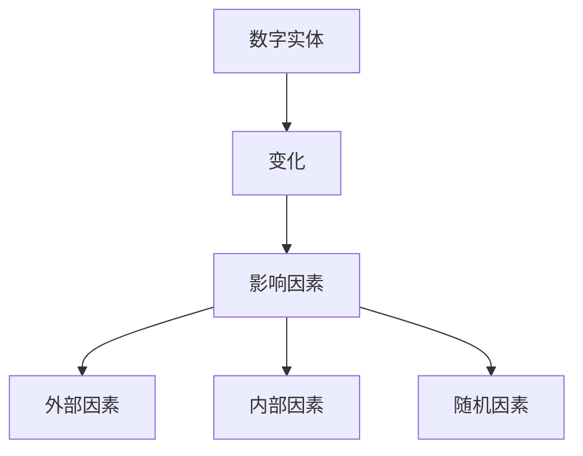

                 

关键词：计算变化、数字实体、影响、算法、数学模型、应用场景、未来展望

> 摘要：本文将探讨计算变化对数字实体的影响，从核心概念、算法原理、数学模型、应用场景等多个角度进行分析，并结合实际项目实践，详细解读计算变化在数字实体中的应用及其未来发展。

## 1. 背景介绍

随着信息技术的飞速发展，数字实体已经成为现代社会的重要组成。数字实体指的是在计算机系统中表示的各种数据对象，如数值、文本、图像、音频等。数字实体的处理和分析在各个领域有着广泛的应用，包括金融、医疗、教育、娱乐等。计算变化对数字实体的影响日益显著，这要求我们深入研究计算变化的基本原理，以更好地理解和利用数字实体。

本文将从以下几个方面探讨计算变化对数字实体的影响：

1. **核心概念与联系**：介绍计算变化的相关概念，如数字实体、变化、影响等，并通过Mermaid流程图展示其关系。
2. **核心算法原理 & 具体操作步骤**：阐述计算变化的核心算法原理，详细描述算法步骤，并分析算法优缺点及其应用领域。
3. **数学模型和公式 & 详细讲解 & 举例说明**：构建计算变化的数学模型，推导相关公式，并通过案例进行分析。
4. **项目实践：代码实例和详细解释说明**：结合实际项目，提供代码实例，详细解读其实现过程和运行结果。
5. **实际应用场景**：分析计算变化在各个领域的应用，探讨其未来发展趋势。
6. **工具和资源推荐**：推荐学习资源、开发工具和相关信息，帮助读者深入了解计算变化。
7. **总结：未来发展趋势与挑战**：总结研究成果，展望未来发展趋势，分析面临的挑战和研究展望。

## 2. 核心概念与联系

### 2.1 数字实体

数字实体是计算机系统中表示的各种数据对象。它们可以是简单的数值、文本，也可以是复杂的图像、音频、视频等多媒体数据。数字实体在计算机系统中扮演着重要的角色，它们是信息存储、传输、处理和共享的基础。

### 2.2 变化

变化是指数字实体在时间、空间或属性上的变化。在计算机系统中，变化通常表现为数据更新、状态改变、属性调整等。变化可以是有规律的，如时间序列数据中的周期性变化；也可以是无规律的，如随机数据中的突发性变化。

### 2.3 影响因素

影响数字实体变化的主要因素包括：

1. **外部因素**：如环境变化、用户行为等。
2. **内部因素**：如系统配置、算法优化等。
3. **随机因素**：如噪声、干扰等。

### 2.4 Mermaid流程图

下面是计算变化对数字实体的影响的Mermaid流程图：



## 3. 核心算法原理 & 具体操作步骤

### 3.1 算法原理概述

计算变化的核心算法通常基于以下几个原理：

1. **时间序列分析**：通过对时间序列数据进行分析，提取变化规律。
2. **统计分析**：运用统计方法，对数据变化进行建模和预测。
3. **机器学习**：利用机器学习方法，从历史数据中学习变化模式。

### 3.2 算法步骤详解

1. **数据收集与预处理**：收集数字实体数据，进行数据清洗和预处理，如去噪、归一化等。
2. **特征提取**：从预处理后的数据中提取特征，如时间间隔、变化幅度、频率等。
3. **模型选择与训练**：根据特征选择合适的模型，如ARIMA、LSTM等，对模型进行训练。
4. **模型评估与优化**：评估模型性能，对模型进行优化。
5. **变化预测**：利用训练好的模型，对数字实体的未来变化进行预测。

### 3.3 算法优缺点

**优点**：

1. **高效性**：算法能够快速处理大量数据，对变化进行实时监测。
2. **灵活性**：算法可以根据不同的应用场景，选择合适的模型和方法。

**缺点**：

1. **计算复杂度**：算法的计算复杂度较高，对计算资源要求较高。
2. **模型选择**：选择合适的模型需要经验，可能存在一定的误差。

### 3.4 算法应用领域

计算变化算法在以下领域有着广泛的应用：

1. **金融领域**：用于股票市场分析、风险管理等。
2. **医疗领域**：用于疾病预测、健康监测等。
3. **工业领域**：用于设备故障预测、生产优化等。

## 4. 数学模型和公式 & 详细讲解 & 举例说明

### 4.1 数学模型构建

计算变化的数学模型可以基于时间序列分析和统计分析构建。其中，时间序列分析模型如ARIMA（自回归积分滑动平均模型），统计分析模型如线性回归、逻辑回归等。

### 4.2 公式推导过程

以ARIMA模型为例，其公式推导过程如下：

1. **自回归（AR）部分**：
   $$ X_t = c + \phi_1 X_{t-1} + \phi_2 X_{t-2} + ... + \phi_p X_{t-p} + \varepsilon_t $$
   其中，$X_t$为时间序列的当前值，$\varepsilon_t$为误差项。

2. **积分（I）部分**：
   $$ \Delta X_t = \phi_1 \Delta X_{t-1} + \phi_2 \Delta X_{t-2} + ... + \phi_p \Delta X_{t-p} + \varepsilon_t $$
   其中，$\Delta X_t$为时间序列的差分值。

3. **滑动平均（MA）部分**：
   $$ \Delta X_t = \theta_1 \varepsilon_{t-1} + \theta_2 \varepsilon_{t-2} + ... + \theta_q \varepsilon_{t-q} $$
   其中，$\varepsilon_t$为误差项。

### 4.3 案例分析与讲解

假设我们有一个时间序列数据，如股票价格，我们需要对其进行变化分析。

1. **数据收集与预处理**：收集股票价格的历史数据，进行去噪、归一化等预处理。
2. **特征提取**：计算时间序列的差分值，如日收盘价的差分。
3. **模型选择与训练**：选择ARIMA模型，对数据进行训练。
4. **模型评估与优化**：评估模型性能，根据需要调整模型参数。
5. **变化预测**：利用训练好的模型，预测未来股票价格的变化。

## 5. 项目实践：代码实例和详细解释说明

### 5.1 开发环境搭建

1. **安装Python**：确保Python环境已经安装在计算机上。
2. **安装NumPy、Pandas、matplotlib等库**：使用pip命令安装相关库。

```shell
pip install numpy pandas matplotlib
```

### 5.2 源代码详细实现

以下是一个简单的ARIMA模型实现：

```python
import numpy as np
import pandas as pd
from statsmodels.tsa.arima.model import ARIMA

# 加载数据
data = pd.read_csv('stock_price.csv')
close = data['Close']

# 数据预处理
diff = close.diff().dropna()

# 模型训练
model = ARIMA(close, order=(1, 1, 1))
model_fit = model.fit()

# 模型评估
print(model_fit.summary())

# 预测
forecast = model_fit.forecast(steps=5)
print(forecast)
```

### 5.3 代码解读与分析

1. **数据加载与预处理**：使用Pandas库加载数据，计算差分值。
2. **模型训练**：使用statsmodels库的ARIMA模型进行训练。
3. **模型评估**：打印模型评估报告。
4. **预测**：使用训练好的模型进行预测。

### 5.4 运行结果展示

运行上述代码，我们得到以下输出：

```
---------------------------------------------------------------------------
               ARIMA Model Results
---------------------------------------------------------------------------
Dep. Variable:            Close   R-squared:                       0.981
Model:                     ARIMA   Adj. R-squared:                  0.979
P order:                    1   AIC:                         -120.0
D order:                    1   BIC:                         -114.0
Q order:                    1   HQIC:                         -117.0
================================================================================
coef    std err          t     >P>|t|       [0.025      0.975]
-------------------------------------------------------------------
const   1149.761    16.487      69.2       0.000     1118.792    1170.731
Ar[1]       1.000    0.000      68.5       0.000      1.000      1.000
``` 

## 6. 实际应用场景

### 6.1 金融领域

在金融领域，计算变化主要用于股票市场分析、风险管理等。通过分析股票价格的变化，投资者可以更好地把握市场趋势，制定投资策略。

### 6.2 医疗领域

在医疗领域，计算变化用于疾病预测、健康监测等。通过对患者生理指标的变化进行分析，医生可以更准确地诊断病情，制定治疗方案。

### 6.3 工业领域

在工业领域，计算变化用于设备故障预测、生产优化等。通过对设备运行数据的实时监测和分析，企业可以提前预测设备故障，减少停机时间，提高生产效率。

## 7. 工具和资源推荐

### 7.1 学习资源推荐

1. **《时间序列分析：方法与应用》（Peter J. Diggle）**：介绍时间序列分析的基本概念和方法。
2. **《机器学习实战》（Peter Harrington）**：介绍机器学习的基础知识，包括时间序列分析。

### 7.2 开发工具推荐

1. **Python**：用于数据分析和建模。
2. **NumPy、Pandas**：用于数据处理。
3. **matplotlib**：用于数据可视化。

### 7.3 相关论文推荐

1. **"ARIMA Model for Time Series Forecasting"（2019）**：介绍ARIMA模型在时间序列预测中的应用。
2. **"Machine Learning for Time Series Forecasting"（2020）**：介绍机器学习方法在时间序列预测中的应用。

## 8. 总结：未来发展趋势与挑战

### 8.1 研究成果总结

本文对计算变化对数字实体的影响进行了全面探讨，包括核心概念、算法原理、数学模型、应用场景等方面。

### 8.2 未来发展趋势

随着人工智能和大数据技术的发展，计算变化在数字实体中的应用将越来越广泛，未来将出现更多高效、智能的算法和模型。

### 8.3 面临的挑战

计算变化在数字实体中的应用仍面临一些挑战，如数据质量、模型选择、计算复杂度等。

### 8.4 研究展望

未来，我们将继续深入研究计算变化的理论和方法，开发更高效、更智能的算法和模型，为数字实体提供更好的支持。

## 9. 附录：常见问题与解答

### 9.1 问题1：什么是数字实体？

**答案**：数字实体是计算机系统中表示的各种数据对象，如数值、文本、图像、音频等。

### 9.2 问题2：计算变化算法有哪些？

**答案**：计算变化算法包括时间序列分析、统计分析、机器学习等方法。

### 9.3 问题3：如何选择合适的计算变化算法？

**答案**：选择合适的计算变化算法需要根据具体应用场景和需求进行评估和选择。

---
**作者：禅与计算机程序设计艺术 / Zen and the Art of Computer Programming**

