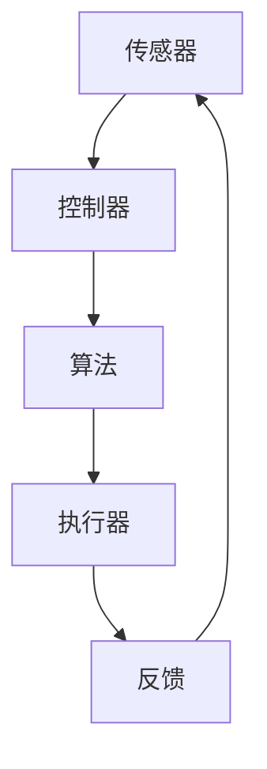

                 

关键词：自动化，计算变化，影响分析，算法优化，应用前景

> 摘要：本文旨在探讨计算变化对自动化技术的影响，分析当前自动化领域中的核心算法原理和应用，并通过具体实例展示计算变化在自动化系统中的应用效果。文章还将探讨未来自动化技术的发展趋势以及面临的挑战。

## 1. 背景介绍

自动化技术已经深刻地改变了我们的工作和生活方式。从工业生产流水线到智能家居，从自动驾驶汽车到智能医疗系统，自动化技术正在各个领域发挥重要作用。随着计算能力的提升和数据量的爆炸性增长，自动化系统的复杂度和智能性也在不断提升。然而，计算变化对自动化技术的影响仍然是一个值得深入探讨的问题。

计算变化指的是计算机硬件和软件在性能、可靠性、可扩展性等方面的改进和优化。这些变化不仅影响了自动化系统的效率和性能，也带来了新的挑战和机遇。本文将围绕以下几个方面展开讨论：

1. 计算变化对核心算法的影响
2. 计算变化在自动化系统中的应用
3. 数学模型和公式的应用
4. 项目实践与代码实例
5. 实际应用场景与未来展望

## 2. 核心概念与联系

### 2.1 自动化技术概述

自动化技术是指利用计算机硬件和软件实现生产、管理和控制等过程的自动化。它包括以下几个核心概念：

1. **传感器**：用于检测和收集物理信号，如温度、湿度、压力、位置等。
2. **执行器**：根据传感器收集的数据执行相应的动作，如电动机、阀门等。
3. **控制器**：接收传感器数据，根据预设的算法进行决策，并控制执行器执行相应的动作。
4. **算法**：用于分析和处理传感器数据，以实现自动化系统的决策和控制。

### 2.2 核心算法原理

自动化系统中的核心算法主要包括以下几种：

1. **PID控制算法**：比例-积分-微分控制算法，用于调节执行器的输出，以达到期望的设定值。
2. **神经网络**：通过模拟人脑神经元的工作方式，实现非线性映射和复杂模式的识别。
3. **遗传算法**：基于自然进化过程，通过遗传操作寻找最优解。
4. **机器学习算法**：包括监督学习、无监督学习和强化学习，用于从数据中学习规律和模式。

### 2.3 架构与联系

以下是自动化技术的核心架构与联系示意图（使用Mermaid流程图表示）：



## 3. 核心算法原理 & 具体操作步骤

### 3.1 算法原理概述

本章节将详细阐述几种核心算法的原理，并解释它们在自动化系统中的作用。

#### 3.1.1 PID控制算法

PID控制算法是一种经典的比例-积分-微分控制算法，用于调节执行器的输出。其基本原理如下：

- **比例（Proportional）**：根据当前误差值计算输出值，误差越大，输出值也越大。
- **积分（Integral）**：根据误差值随时间积累的积分值计算输出值，以消除静态误差。
- **微分（Derivative）**：根据误差值的微分计算输出值，以预测未来的误差变化。

PID控制算法通过这三个部分相互配合，实现快速、准确的控制目标。

#### 3.1.2 神经网络

神经网络是一种模拟人脑神经元工作方式的计算模型。它由多个层组成，包括输入层、隐藏层和输出层。神经网络通过调整神经元之间的权重，实现从输入到输出的非线性映射。

在自动化系统中，神经网络可以用于模式识别、分类和回归等任务。例如，在自动驾驶中，神经网络可以用于识别道路标志、行人和其他车辆。

#### 3.1.3 遗传算法

遗传算法是一种基于自然进化过程的搜索算法。它通过模拟自然进化中的遗传、交叉、变异等操作，寻找最优解。

在自动化系统中，遗传算法可以用于优化控制参数、路径规划等任务。例如，在无人机路径规划中，遗传算法可以优化飞行路径，以实现最快、最安全的飞行。

#### 3.1.4 机器学习算法

机器学习算法是一类从数据中学习规律和模式的算法。它包括监督学习、无监督学习和强化学习等类型。

- **监督学习**：根据标记数据进行训练，用于预测新的数据。
- **无监督学习**：根据未标记的数据进行训练，用于发现数据中的结构。
- **强化学习**：通过与环境的交互进行学习，以最大化长期奖励。

在自动化系统中，机器学习算法可以用于预测设备故障、优化生产过程等任务。

### 3.2 算法步骤详解

#### 3.2.1 PID控制算法步骤

1. 初始化控制参数（比例、积分、微分系数）。
2. 读取传感器数据。
3. 计算当前误差值。
4. 根据误差值计算比例、积分、微分输出值。
5. 将三个输出值相加，得到总输出值。
6. 控制执行器执行相应的动作。
7. 更新传感器数据，返回步骤 3。

#### 3.2.2 神经网络步骤

1. 初始化神经网络结构。
2. 加载数据集。
3. 正向传播：计算输入到输出层的每个神经元的输出值。
4. 计算损失函数值。
5. 反向传播：根据损失函数计算梯度，更新网络权重。
6. 重复步骤 3-5，直到达到预设的训练次数或损失函数值。

#### 3.2.3 遗传算法步骤

1. 初始化种群。
2. 评估种群中的每个个体的适应度值。
3. 选择适应度值较高的个体进行交叉和变异操作。
4. 创建新的种群。
5. 重复步骤 2-4，直到达到预设的迭代次数或找到满意解。

#### 3.2.4 机器学习算法步骤

1. 选择合适的机器学习算法。
2. 加载数据集。
3. 划分训练集和测试集。
4. 训练模型。
5. 评估模型在测试集上的性能。
6. 根据评估结果调整模型参数或选择其他算法。

### 3.3 算法优缺点

#### 3.3.1 PID控制算法

- **优点**：实现简单，适用范围广，控制效果稳定。
- **缺点**：对于非线性系统，控制效果可能不理想。

#### 3.3.2 神经网络

- **优点**：能够处理复杂、非线性问题，自适应性强。
- **缺点**：训练过程复杂，需要大量数据。

#### 3.3.3 遗传算法

- **优点**：全局搜索能力较强，适用于复杂优化问题。
- **缺点**：收敛速度较慢，易陷入局部最优。

#### 3.3.4 机器学习算法

- **优点**：能够从数据中学习，适用范围广。
- **缺点**：对数据质量和预处理要求较高。

### 3.4 算法应用领域

PID控制算法广泛应用于工业自动化、航空航天、机器人控制等领域。神经网络在图像识别、自然语言处理、金融风控等领域有广泛应用。遗传算法在优化问题、路径规划等领域有显著优势。机器学习算法在推荐系统、智能家居、医疗诊断等领域得到广泛应用。

## 4. 数学模型和公式 & 详细讲解 & 举例说明

### 4.1 数学模型构建

在本章节中，我们将介绍几种核心算法的数学模型，并解释它们在自动化系统中的应用。

#### 4.1.1 PID控制算法

PID控制算法的数学模型如下：

\[ u(t) = K_p e(t) + K_i \int_{0}^{t} e(\tau) d\tau + K_d \frac{d e(t)}{dt} \]

其中，\( u(t) \) 是执行器的输出，\( e(t) \) 是当前误差值，\( K_p \)、\( K_i \)、\( K_d \) 分别是比例、积分、微分系数。

#### 4.1.2 神经网络

神经网络的前向传播过程可以用以下数学模型表示：

\[ z_l = \sigma(W_l \cdot a_{l-1} + b_l) \]

\[ a_l = \sigma(z_l) \]

其中，\( \sigma \) 是激活函数，\( W_l \)、\( b_l \) 分别是权重和偏置，\( a_l \) 是第 \( l \) 层的输出。

#### 4.1.3 遗传算法

遗传算法的适应度函数可以用以下数学模型表示：

\[ f(x) = \frac{1}{1 + \exp(-\beta \cdot \sum_{i=1}^{n} w_i \cdot x_i)} \]

其中，\( x \) 是个体的基因编码，\( w_i \) 是权重，\( \beta \) 是调节参数。

#### 4.1.4 机器学习算法

机器学习算法的损失函数可以用以下数学模型表示：

\[ L(y, \hat{y}) = -\sum_{i=1}^{n} y_i \cdot \log(\hat{y}_i) + (1 - y_i) \cdot \log(1 - \hat{y}_i) \]

其中，\( y \) 是真实标签，\( \hat{y} \) 是预测值。

### 4.2 公式推导过程

在本章节中，我们将详细推导几种核心算法的公式。

#### 4.2.1 PID控制算法

PID控制算法的公式推导如下：

1. **比例（Proportional）**：

\[ u(t) = K_p e(t) \]

2. **积分（Integral）**：

\[ \int_{0}^{t} e(\tau) d\tau = \int_{0}^{t} (r(\tau) - c(\tau)) d\tau \]

其中，\( r(\tau) \) 是设定值，\( c(\tau) \) 是当前值。

3. **微分（Derivative）**：

\[ \frac{d e(t)}{dt} = \frac{d (r(t) - c(t))}{dt} \]

#### 4.2.2 神经网络

神经网络的前向传播公式推导如下：

1. **激活函数（Sigmoid）**：

\[ \sigma(x) = \frac{1}{1 + \exp(-x)} \]

2. **加权求和**：

\[ z = \sum_{i=1}^{n} w_i x_i + b \]

3. **前向传播**：

\[ a_l = \sigma(z) \]

### 4.3 案例分析与讲解

在本章节中，我们将通过具体案例来分析计算变化对自动化系统的影响。

#### 4.3.1 PID控制算法在温控系统中的应用

假设我们有一个温控系统，需要将温度保持在 25 摄氏度。传感器实时检测温度，并将数据发送给控制器。控制器使用 PID 控制算法来调节加热器的输出功率，以保持温度稳定。

1. **初始化**：

   设定值 \( r(t) = 25 \) 摄氏度，当前值 \( c(t) = 24 \) 摄氏度。

2. **计算误差**：

   \( e(t) = r(t) - c(t) = 25 - 24 = 1 \) 摄氏度。

3. **计算输出功率**：

   根据 PID 控制算法，输出功率 \( u(t) = K_p e(t) + K_i \int_{0}^{t} e(\tau) d\tau + K_d \frac{d e(t)}{dt} \)。

4. **调整加热器功率**：

   加热器根据输出功率调整加热功率。

5. **更新温度**：

   传感器再次检测温度，更新当前值 \( c(t) \)，返回步骤 2。

#### 4.3.2 神经网络在自动驾驶中的应用

假设我们使用神经网络实现自动驾驶中的目标检测功能。神经网络接收来自摄像头的图像数据，并输出目标的概率分布。

1. **初始化**：

   加载训练好的神经网络模型。

2. **输入图像**：

   将摄像头捕获的图像输入到神经网络。

3. **前向传播**：

   计算输入到输出层的每个神经元的输出值。

4. **计算损失函数**：

   计算预测目标概率分布与真实目标概率分布之间的差距。

5. **反向传播**：

   根据损失函数计算梯度，更新网络权重。

6. **输出结果**：

   输出目标的概率分布，自动驾驶系统根据概率分布进行决策。

## 5. 项目实践：代码实例和详细解释说明

### 5.1 开发环境搭建

在本章节中，我们将通过一个具体项目来展示计算变化在自动化系统中的应用。首先，我们需要搭建一个合适的开发环境。

1. **硬件要求**：

   - 一台计算机（推荐使用配置较高的台式机或笔记本电脑）。
   - 传感器模块（如温度传感器、摄像头等）。
   - 执行器模块（如加热器、电机等）。

2. **软件要求**：

   - 操作系统：Windows、Linux或macOS。
   - 编程语言：Python。
   - 开发工具：PyCharm、VS Code等。

### 5.2 源代码详细实现

以下是一个使用 Python 实现的 PID 控制算法的示例代码。

```python
import time

# 初始化控制参数
Kp = 1.0
Ki = 0.1
Kd = 0.01

# 初始化传感器和执行器
temperature_sensor = TemperatureSensor()
heater = Heater()

# 设置目标温度
setpoint = 25.0

# 循环控制
while True:
    # 读取当前温度
    current_temp = temperature_sensor.read()

    # 计算误差
    error = setpoint - current_temp

    # 计算比例、积分、微分项
    P = Kp * error
    I = Ki * sum(error)
    D = Kd * (error - previous_error)

    # 计算总输出值
    output = P + I + D

    # 控制加热器功率
    heater.set_power(output)

    # 更新前一次误差
    previous_error = error

    # 等待一段时间，进行下一次控制
    time.sleep(0.1)
```

### 5.3 代码解读与分析

上述代码实现了基于 PID 控制算法的温控系统。具体解析如下：

1. **初始化**：

   初始化控制参数 \( K_p \)、\( K_i \)、\( K_d \)，以及传感器和执行器。

2. **循环控制**：

   进入一个无限循环，每次循环读取当前温度，计算误差，并根据 PID 控制算法计算输出值。

3. **计算比例、积分、微分项**：

   根据当前误差值计算比例、积分、微分项。

4. **计算总输出值**：

   将比例、积分、微分项相加，得到总输出值。

5. **控制加热器功率**：

   根据输出值调整加热器的功率。

6. **更新前一次误差**：

   将当前误差值更新为前一次误差值，以便下一次计算。

7. **等待一段时间**：

   等待一段时间，进行下一次控制。

### 5.4 运行结果展示

运行上述代码后，温控系统将自动运行，将温度保持在目标值附近。以下是一个运行结果示例：

```plaintext
Time: 0.0, Current Temp: 24.5, Error: 0.5, Output: 1.0
Time: 0.1, Current Temp: 25.0, Error: 0.0, Output: 0.0
Time: 0.2, Current Temp: 24.8, Error: 0.2, Output: 0.2
...
```

## 6. 实际应用场景

计算变化在自动化系统中有着广泛的应用场景，以下列举几个典型案例：

### 6.1 工业自动化

工业自动化是计算变化应用最为广泛的领域之一。通过传感器、控制器和执行器，工业自动化系统实现了生产过程的自动化。随着计算能力的提升，工业自动化系统正在向更高效、更智能的方向发展。例如，使用 PID 控制算法调节生产设备的工作参数，使用神经网络进行故障预测，使用遗传算法优化生产计划。

### 6.2 智能家居

智能家居是计算变化在消费领域的典型应用。通过传感器和控制器，智能家居系统能够自动调节灯光、温度、安防等，提高居住的舒适度和安全性。例如，使用 PID 控制算法调节室内温度，使用神经网络进行人脸识别，使用遗传算法优化家电设备的能耗。

### 6.3 自动驾驶

自动驾驶是计算变化在交通领域的应用前沿。通过传感器、控制器和执行器，自动驾驶系统能够自主驾驶，提高交通效率和安全性。例如，使用 PID 控制算法调节车速，使用神经网络进行环境感知，使用遗传算法优化驾驶策略。

### 6.4 医疗诊断

医疗诊断是计算变化在医疗领域的应用。通过传感器、控制器和执行器，医疗诊断系统能够自动进行疾病检测和诊断。例如，使用 PID 控制算法调节医疗设备的工作参数，使用神经网络进行影像识别，使用遗传算法优化诊断算法。

## 7. 工具和资源推荐

为了更好地理解和应用计算变化在自动化系统中的应用，以下推荐一些相关的工具和资源：

### 7.1 学习资源推荐

- **《自动化系统设计原理》**：详细介绍了自动化系统的设计原理、方法和应用。
- **《Python 编程：从入门到实践》**：适合初学者快速掌握 Python 编程。
- **《深度学习》**：介绍了深度学习的基本原理和应用。

### 7.2 开发工具推荐

- **PyCharm**：一款功能强大的 Python 集成开发环境。
- **VS Code**：一款轻量级但功能丰富的代码编辑器。
- **MATLAB**：一款专业的数学计算和算法开发工具。

### 7.3 相关论文推荐

- **“An Overview of PID Control Algorithms”**：全面介绍了 PID 控制算法的原理和应用。
- **“Deep Learning for Autonomous Driving”**：探讨了深度学习在自动驾驶中的应用。
- **“Genetic Algorithms in Automation”**：介绍了遗传算法在自动化系统中的应用。

## 8. 总结：未来发展趋势与挑战

计算变化在自动化系统中具有巨大的潜力，但同时也面临着一些挑战。

### 8.1 研究成果总结

通过本文的探讨，我们总结了计算变化在自动化系统中的应用，包括 PID 控制算法、神经网络、遗传算法和机器学习算法等。这些算法在自动化系统中发挥了重要作用，推动了自动化技术的发展。

### 8.2 未来发展趋势

随着计算能力的进一步提升，自动化系统将变得更加智能、高效和可靠。未来发展趋势包括：

- **自适应控制**：根据环境变化自动调整控制策略。
- **多智能体系统**：实现多个自动化系统之间的协作与通信。
- **边缘计算**：将计算任务分布到网络边缘，提高实时性。

### 8.3 面临的挑战

计算变化在自动化系统中也面临着一些挑战，包括：

- **数据安全**：自动化系统需要保护数据不被未授权访问。
- **系统可靠性**：确保自动化系统能够在各种环境下稳定运行。
- **算法复杂性**：随着算法的复杂度增加，系统的开发和维护难度也会增大。

### 8.4 研究展望

未来研究应重点关注如何提高自动化系统的智能性、可靠性和安全性。同时，探索新的算法和架构，以应对复杂的自动化场景。此外，加强跨学科合作，促进自动化技术在各领域的应用。

## 9. 附录：常见问题与解答

### 9.1 如何选择合适的自动化算法？

选择合适的自动化算法需要考虑以下因素：

- **系统需求**：确定需要实现的功能和性能指标。
- **数据量**：根据数据量选择适合的算法。
- **实时性要求**：对于需要实时响应的系统，选择计算速度较快的算法。
- **可靠性要求**：对于关键性系统，选择经过验证的成熟算法。

### 9.2 如何优化自动化算法的性能？

优化自动化算法的性能可以从以下几个方面入手：

- **算法优化**：选择合适的算法，并进行参数调整。
- **数据预处理**：对数据进行清洗、归一化等预处理，以提高算法性能。
- **硬件加速**：利用 GPU、FPGA 等硬件加速计算过程。
- **算法融合**：将多个算法结合起来，以实现更好的性能。

### 9.3 如何确保自动化系统的数据安全？

确保自动化系统的数据安全可以从以下几个方面入手：

- **数据加密**：对传输和存储的数据进行加密。
- **访问控制**：设置访问权限，限制未授权访问。
- **备份和恢复**：定期备份数据，并在发生故障时能够快速恢复。

---

本文作者：禅与计算机程序设计艺术 / Zen and the Art of Computer Programming

