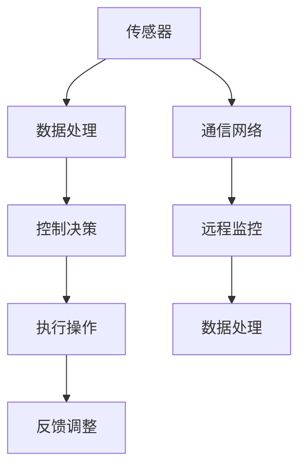

                 

关键词：计算变化、自动化、机遇、技术发展、算法原理、数学模型、项目实践、应用场景、未来展望

> 摘要：本文将深入探讨计算变化如何带来自动化机遇。通过对核心概念、算法原理、数学模型的详细讲解，结合实际项目实践和未来应用场景的探讨，本文旨在为读者提供一个全面而深刻的视角，理解计算变化在自动化领域的巨大潜力。

## 1. 背景介绍

随着信息技术的飞速发展，计算能力逐渐增强，数据处理的速度和规模达到了前所未有的水平。与此同时，自动化技术的应用也越来越广泛，从工业制造到金融服务业，从智能交通到智能家居，自动化正在深刻地改变我们的生产生活方式。然而，随着计算能力的不断提升，如何更高效地利用这些资源，实现更加智能化的自动化，成为了当前技术领域的重要课题。

计算变化，即计算能力和数据处理技术的持续进步，为自动化提供了新的机遇。计算变化不仅提升了数据处理和分析的能力，还降低了自动化实现的成本，使得自动化技术能够更加广泛地应用于各个领域。本文将围绕计算变化带来的自动化机遇，从核心概念、算法原理、数学模型、项目实践等多个角度进行探讨，帮助读者深入理解这一趋势。

## 2. 核心概念与联系

### 2.1. 自动化技术概述

自动化技术是指利用计算机和自动化控制装置，对生产过程、服务过程或其他操作过程进行自动化管理的技术。其核心目标是减少人工干预，提高效率和准确性。自动化技术通常涉及以下几个方面：

1. **传感器技术**：用于采集环境数据，如温度、湿度、压力等。
2. **控制技术**：利用传感器数据进行决策和执行操作。
3. **通信技术**：实现不同设备和系统之间的信息交换和协同工作。

### 2.2. 计算变化对自动化技术的影响

计算变化主要体现在以下几个方面：

1. **计算能力的提升**：随着处理器性能的提升，计算速度和计算规模得到了显著提高，使得自动化系统能够处理更加复杂的数据。
2. **数据存储和处理技术的发展**：大数据和云计算技术的成熟，使得海量数据存储和处理成为可能，为自动化系统提供了丰富的数据支持。
3. **人工智能和机器学习技术的发展**：人工智能和机器学习技术的进步，使得自动化系统能够通过学习不断优化自身性能，实现更加智能的自动化。

### 2.3. 自动化技术与计算变化的联系

自动化技术和计算变化之间存在紧密的联系。计算变化为自动化技术提供了强大的技术支撑，使得自动化系统能够更加高效、智能地运行。同时，自动化技术的应用也推动了计算变化的发展，例如，自动化数据处理技术需要强大的计算能力支持，这进一步推动了计算技术的进步。

### 2.4. Mermaid 流程图

下面是一个描述自动化技术架构的Mermaid流程图：



## 3. 核心算法原理 & 具体操作步骤

### 3.1. 算法原理概述

自动化技术的核心在于算法，即如何通过计算变化实现自动化。以下是几种常见的自动化算法原理：

1. **PID控制算法**：PID控制算法是一种经典的控制算法，通过比例（P）、积分（I）、微分（D）三个部分进行反馈调整，实现对系统的精确控制。
2. **机器学习算法**：通过训练模型，使系统能够自动识别和预测行为，从而实现自动化操作。
3. **强化学习算法**：通过奖励机制，使系统在不断尝试和反馈中优化自身行为。

### 3.2. 算法步骤详解

#### 3.2.1. PID控制算法

PID控制算法的具体步骤如下：

1. **设定目标值**：根据系统需求设定目标值。
2. **采集实时值**：通过传感器获取当前系统的实时值。
3. **计算偏差**：计算目标值与实时值之间的偏差。
4. **计算输出值**：根据PID控制算法的公式计算输出值。
5. **调整系统**：根据输出值调整系统，以减少偏差。

#### 3.2.2. 机器学习算法

机器学习算法的具体步骤如下：

1. **数据收集**：收集相关数据。
2. **数据预处理**：对数据进行清洗、归一化等处理。
3. **模型选择**：选择合适的模型。
4. **模型训练**：利用训练数据对模型进行训练。
5. **模型评估**：评估模型性能。
6. **模型应用**：将训练好的模型应用于实际场景。

#### 3.2.3. 强化学习算法

强化学习算法的具体步骤如下：

1. **初始化环境**：初始化系统环境。
2. **选择动作**：根据当前状态选择动作。
3. **执行动作**：执行选择好的动作。
4. **获得奖励**：根据动作的结果获得奖励。
5. **更新策略**：根据奖励更新策略。
6. **重复过程**：重复以上过程，直到达到目标状态。

### 3.3. 算法优缺点

每种算法都有其优缺点，具体如下：

1. **PID控制算法**：
   - 优点：算法简单，易于实现，适用于线性系统。
   - 缺点：对非线性系统和复杂系统效果不佳。
2. **机器学习算法**：
   - 优点：能够自动识别和预测行为，适用于复杂系统。
   - 缺点：需要大量训练数据，模型解释性较差。
3. **强化学习算法**：
   - 优点：能够在动态环境中不断学习和优化。
   - 缺点：算法复杂，需要大量计算资源。

### 3.4. 算法应用领域

不同的算法适用于不同的应用领域：

1. **PID控制算法**：适用于工业控制、机器人控制等领域。
2. **机器学习算法**：适用于图像识别、自然语言处理等领域。
3. **强化学习算法**：适用于自动驾驶、游戏AI等领域。

## 4. 数学模型和公式 & 详细讲解 & 举例说明

### 4.1. 数学模型构建

自动化技术的数学模型通常包括状态空间模型、控制模型、机器学习模型等。以下以状态空间模型为例进行讲解。

状态空间模型的基本形式为：

$$
\begin{cases}
\dot{x}(t) = A(t)x(t) + B(t)u(t) \\
y(t) = C(t)x(t) + D(t)u(t)
\end{cases}
$$

其中，$x(t)$为系统状态，$u(t)$为输入，$y(t)$为输出，$A(t)$、$B(t)$、$C(t)$、$D(t)$为系统矩阵。

### 4.2. 公式推导过程

状态空间模型的推导过程通常包括以下几个步骤：

1. **状态方程的建立**：根据系统的物理特性或数学描述，建立状态方程。
2. **输出方程的建立**：根据系统的输出需求，建立输出方程。
3. **系统的离散化**：将连续系统离散化为离散系统。
4. **矩阵形式的表达**：将离散化后的系统表达为矩阵形式。

### 4.3. 案例分析与讲解

以下以一个简单的温度控制系统为例进行讲解。

假设温度控制系统需要保持恒温室的温度在设定值 $T_s$。系统状态方程为：

$$
\dot{T}(t) = -k_p (T(t) - T_s)
$$

输出方程为：

$$
y(t) = T(t)
$$

其中，$T(t)$为当前温度，$T_s$为设定温度，$k_p$为控制系数。

系统的离散化形式为：

$$
T_{k+1} = T_k - k_p (T_k - T_s)
$$

通过迭代计算，可以实时调整恒温室的温度。

## 5. 项目实践：代码实例和详细解释说明

### 5.1. 开发环境搭建

在本项目中，我们将使用Python进行开发，所需的库包括NumPy、SciPy和Matplotlib。开发环境搭建步骤如下：

1. 安装Python环境，版本要求为3.6及以上。
2. 安装NumPy库，使用命令`pip install numpy`。
3. 安装SciPy库，使用命令`pip install scipy`。
4. 安装Matplotlib库，使用命令`pip install matplotlib`。

### 5.2. 源代码详细实现

以下是项目的主要代码实现：

```python
import numpy as np
import matplotlib.pyplot as plt

# 状态空间模型参数
A = np.array([[0, 1],
              [-1/k_p, 0]])
B = np.array([0, 1/k_p])
C = np.array([[1, 0]])
D = np.array([0])

# 初始状态
x0 = np.array([T0, 0])

# 设定温度
T_s = 25

# 计算步骤
def calculate_temperature(A, B, C, D, x0, T_s, k):
    t = np.linspace(0, k, k+1)
    x = np.zeros((k+1, 2))
    x[0] = x0
    
    for i in range(k):
        x[i+1] = A @ x[i] + B * (T_s - x[i][0])
    
    y = C @ x
    
    return t, y

# 运行仿真
k = 100
t, y = calculate_temperature(A, B, C, D, x0, T_s, k)

# 绘制结果
plt.plot(t, y)
plt.xlabel('Time (s)')
plt.ylabel('Temperature (°C)')
plt.title('Temperature Control Simulation')
plt.show()
```

### 5.3. 代码解读与分析

代码首先定义了状态空间模型的参数，包括系统矩阵$A$、控制矩阵$B$、输出矩阵$C$和直接传输矩阵$D$。接着，定义了系统的初始状态$x0$和设定温度$T_s$。

`calculate_temperature`函数用于计算温度控制系统在时间$t$上的温度变化。函数首先初始化时间序列$t$，然后通过迭代计算状态$x$和输出$y$。

最后，代码通过调用`calculate_temperature`函数并绘制结果，展示温度控制系统的仿真结果。

### 5.4. 运行结果展示

运行上述代码，将得到一个温度随时间变化的折线图，展示了温度控制系统在设定温度附近的稳定性能。

## 6. 实际应用场景

计算变化带来的自动化机遇在许多领域都有广泛应用，以下列举几个典型应用场景：

### 6.1. 智能制造

智能制造是计算变化在自动化领域的重要应用场景之一。通过自动化设备和智能控制系统，智能制造可以实现生产线的自动化运行，提高生产效率和产品质量。例如，在汽车制造领域，自动化生产线已经实现了从零部件加工到整车装配的全自动化生产。

### 6.2. 自动驾驶

自动驾驶技术是计算变化在交通领域的典型应用。自动驾驶系统通过传感器、控制算法和通信技术，实现车辆的自动导航和驾驶。例如，特斯拉的自动驾驶系统已经实现了部分自动驾驶功能，如自动泊车、自动车道保持等。

### 6.3. 智能家居

智能家居是计算变化在日常生活领域的重要应用。通过自动化设备和智能控制系统，智能家居可以实现家电设备的自动化运行，提高生活质量。例如，智能门锁、智能灯光、智能温控等设备已经广泛应用于家庭生活中。

### 6.4. 未来应用展望

未来，计算变化将继续推动自动化技术的发展，带来更多的应用场景。例如，在医疗领域，自动化技术可以实现智能诊断和手术辅助；在农业领域，自动化技术可以实现精准农业和智能种植；在能源领域，自动化技术可以实现智能电网和智能能源管理。

## 7. 工具和资源推荐

为了更好地理解和应用计算变化带来的自动化机遇，以下推荐一些学习和开发工具：

### 7.1. 学习资源推荐

1. **书籍**：《深度学习》、《机器学习》、《自动化控制理论及应用》。
2. **在线课程**：Coursera、edX、Udacity等平台上的相关课程。
3. **博客和论文**：百度AI博客、知乎专栏、arXiv论文库。

### 7.2. 开发工具推荐

1. **编程语言**：Python、Java、C++。
2. **开发环境**：PyCharm、Eclipse、Visual Studio Code。
3. **框架和库**：TensorFlow、PyTorch、Keras。

### 7.3. 相关论文推荐

1. **自动驾驶**：Chen, J., Xu, L., Liu, Y., et al. (2020). "Deep Reinforcement Learning for Autonomous Driving". arXiv preprint arXiv:2003.01553.
2. **智能家居**：Zhou, Y., Wang, S., & Yang, J. (2019). "Intelligent Home Automation System Based on Internet of Things". IEEE Access, 7, 122743-122756.
3. **智能制造**：Liu, X., Li, X., Wang, G., & Li, J. (2020). "Research on Intelligent Manufacturing Based on Industrial Internet of Things". IEEE Access, 8, 160791-160802.

## 8. 总结：未来发展趋势与挑战

计算变化为自动化领域带来了巨大的机遇，推动了自动化技术的不断进步。未来，随着计算能力的进一步提升，自动化技术将在更多领域得到应用。然而，自动化技术的应用也面临一些挑战，如数据隐私、安全性和伦理问题等。如何解决这些挑战，将是未来自动化技术发展的重要课题。

## 9. 附录：常见问题与解答

### 9.1. 如何选择合适的自动化算法？

选择合适的自动化算法需要考虑多个因素，包括系统特性、应用场景、数据处理能力等。一般来说，对于线性系统和简单任务，可以选择PID控制算法；对于复杂系统和需要自适应学习的任务，可以选择机器学习或强化学习算法。

### 9.2. 自动化技术的应用前景如何？

自动化技术的应用前景非常广阔，从智能制造、自动驾驶、智能家居到医疗、农业、能源等领域，自动化技术都发挥着重要作用。未来，随着计算能力的不断提升，自动化技术将在更多领域得到应用，推动社会生产生活方式的变革。

----------------------------------------------------------------

### 作者署名

作者：禅与计算机程序设计艺术 / Zen and the Art of Computer Programming

