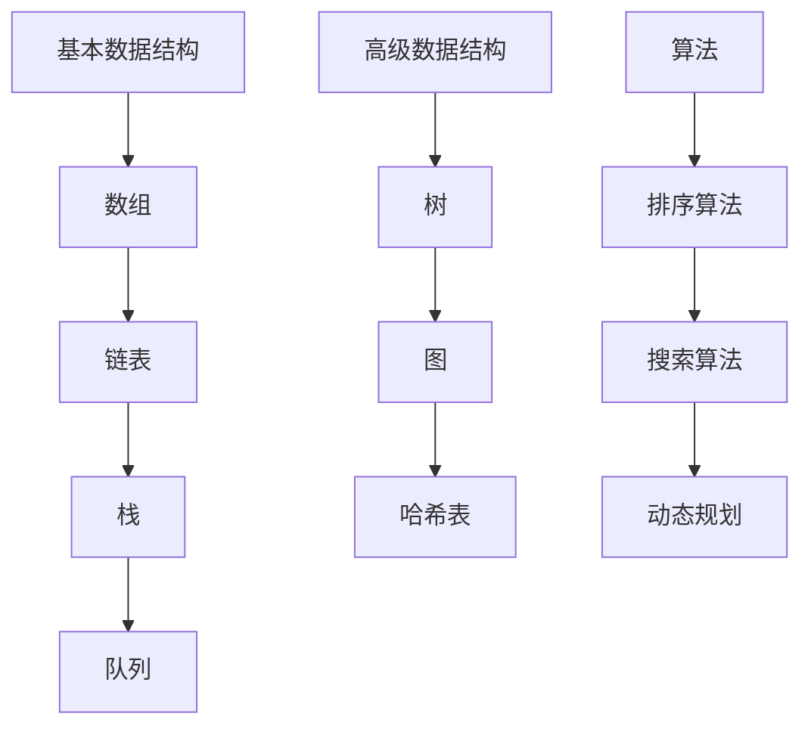
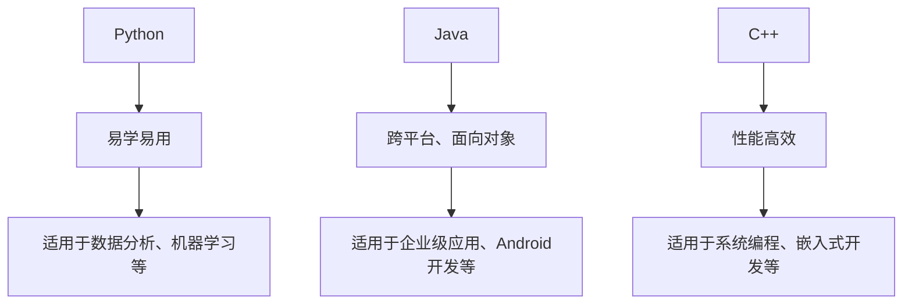
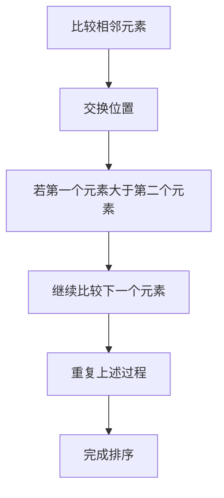
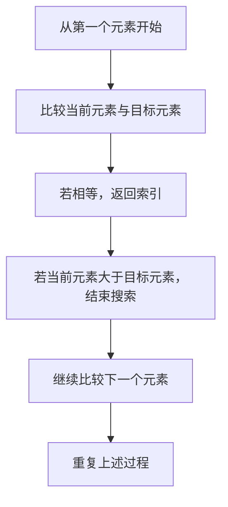

                 

关键词：计算机科学，AI，基础，开发者，算法，数学模型，实践，工具，资源，展望

> 摘要：本文旨在为AI开发者提供一份系统性的计算机科学基础指南。我们将深入探讨核心概念、算法原理、数学模型以及实际应用，帮助开发者更好地理解和应用计算机科学知识，为未来的AI开发打下坚实的基础。

## 1. 背景介绍

随着人工智能技术的迅猛发展，AI开发者已经成为当前最热门的职业之一。然而，要想成为一名合格的AI开发者，掌握计算机科学的基础知识是不可或缺的。计算机科学作为AI发展的基石，涵盖了算法、数据结构、数学、编程语言等多个领域。本文将围绕这些核心内容，为AI开发者提供一份系统性的知识指南。

## 2. 核心概念与联系

为了更好地理解计算机科学的基础知识，我们首先需要了解一些核心概念。以下是计算机科学中的一些基本概念及其相互关系：

### 2.1 计算机系统架构

计算机系统架构是计算机科学的基础，它描述了计算机硬件和软件的组成及其相互关系。以下是计算机系统架构的Mermaid流程图：

```mermaid
graph TD
A[硬件] --> B[中央处理器(CPU)]
B --> C[内存]
C --> D[输入输出设备]
E[操作系统] --> B
E --> F[应用程序]
F --> B
```

### 2.2 数据结构与算法

数据结构与算法是计算机科学的核心。数据结构是指数据的组织形式，而算法则是解决问题的步骤。以下是数据结构与算法的基本分类及其相互关系：



### 2.3 编程语言与工具

编程语言是计算机科学的重要组成部分。不同的编程语言适用于不同的应用场景。以下是几种常见的编程语言及其特点：



## 3. 核心算法原理 & 具体操作步骤

### 3.1 算法原理概述

算法是计算机科学中的核心概念，它描述了解决问题的步骤。以下是几种常见的算法及其原理：

#### 3.1.1 排序算法

排序算法用于对数据进行排序。常见的排序算法包括冒泡排序、选择排序、插入排序、快速排序等。以下是冒泡排序的原理：



#### 3.1.2 搜索算法

搜索算法用于在数据结构中查找特定元素。常见的搜索算法包括线性搜索、二分搜索等。以下是线性搜索的原理：



### 3.2 算法步骤详解

#### 3.2.1 冒泡排序

冒泡排序是一种简单的排序算法。以下是冒泡排序的具体步骤：

1. 从第一个元素开始，比较相邻的两个元素。
2. 若第一个元素大于第二个元素，交换它们的位置。
3. 继续比较下一个元素，直到第一个元素与最后一个元素比较完成。
4. 重复上述过程，直到整个数组排序完成。

#### 3.2.2 线性搜索

线性搜索是一种基本的搜索算法。以下是线性搜索的具体步骤：

1. 从第一个元素开始，依次比较每个元素与目标元素。
2. 若当前元素与目标元素相等，返回当前元素的索引。
3. 若所有元素比较完毕，仍未找到目标元素，返回-1。

### 3.3 算法优缺点

每种算法都有其优缺点。以下是冒泡排序和线性搜索的优缺点：

#### 3.3.1 冒泡排序

- 优点：实现简单，易于理解。
- 缺点：时间复杂度高，适用于小规模数据。

#### 3.3.2 线性搜索

- 优点：实现简单，适用于小规模数据。
- 缺点：时间复杂度高，不适用于大规模数据。

### 3.4 算法应用领域

排序算法和搜索算法广泛应用于各种领域，如数据分析、数据库管理、算法竞赛等。

## 4. 数学模型和公式 & 详细讲解 & 举例说明

### 4.1 数学模型构建

数学模型是计算机科学中重要的工具，它可以帮助我们更好地理解和分析问题。以下是构建数学模型的基本步骤：

1. 确定问题背景和目标。
2. 收集相关数据和信息。
3. 建立数学模型。
4. 求解数学模型，分析结果。

### 4.2 公式推导过程

数学模型的建立通常需要使用各种数学公式。以下是几种常见的数学公式及其推导过程：

#### 4.2.1 欧氏距离

欧氏距离是衡量两个向量之间距离的常用公式：

$$
d(p_1, p_2) = \sqrt{(x_1 - x_2)^2 + (y_1 - y_2)^2}
$$

推导过程：设两个向量 $p_1 = (x_1, y_1)$ 和 $p_2 = (x_2, y_2)$，则它们的欧氏距离为两点之间的距离，即：

$$
d(p_1, p_2) = \sqrt{(x_1 - x_2)^2 + (y_1 - y_2)^2}
$$

#### 4.2.2 矩阵乘法

矩阵乘法是线性代数中的重要运算，它是构建数学模型的基础。以下是矩阵乘法的公式：

$$
C = AB
$$

推导过程：设两个矩阵 $A$ 和 $B$，它们的乘积 $C$ 是一个新矩阵，其每个元素 $c_{ij}$ 是矩阵 $A$ 的第 $i$ 行与矩阵 $B$ 的第 $j$ 列对应元素的乘积之和，即：

$$
c_{ij} = \sum_{k=1}^{n} a_{ik}b_{kj}
$$

### 4.3 案例分析与讲解

为了更好地理解数学模型和公式的应用，我们来看一个实际案例。

#### 4.3.1 问题背景

假设我们要分析一个城市的交通流量，以便优化交通路线。我们收集了每个时间段每个路段的流量数据。

#### 4.3.2 数学模型构建

我们建立如下数学模型：

1. 定义变量：设 $T$ 为时间段，$L$ 为路段，$v_{TL}$ 为时间段 $T$ 内路段 $L$ 的流量。
2. 收集数据：根据实际收集的数据，计算每个时间段每个路段的流量。
3. 建立线性规划模型：最小化总交通流量，约束条件为每个时间段每个路段的流量不超过最大流量。

#### 4.3.3 公式推导过程

我们使用线性规划公式来求解交通流量优化问题：

$$
\min \sum_{T} \sum_{L} v_{TL}
$$

subject to

$$
v_{TL} \leq v_{max}, \quad \forall T, L
$$

其中，$v_{max}$ 为最大流量。

#### 4.3.4 案例分析与讲解

根据实际数据，我们求解线性规划模型，得到每个时间段每个路段的最优流量。通过分析结果，我们可以优化交通路线，减少交通拥堵。

## 5. 项目实践：代码实例和详细解释说明

### 5.1 开发环境搭建

为了方便读者进行实践，我们使用Python作为编程语言，搭建以下开发环境：

1. 安装Python：从 [Python官网](https://www.python.org/downloads/) 下载并安装Python。
2. 安装Anaconda：从 [Anaconda官网](https://www.anaconda.com/products/distribution) 下载并安装Anaconda。
3. 创建虚拟环境：在Anaconda Prompt中执行以下命令创建虚拟环境：

```bash
conda create -n myenv python=3.8
```

4. 激活虚拟环境：

```bash
conda activate myenv
```

### 5.2 源代码详细实现

以下是一个简单的Python代码示例，用于实现冒泡排序算法：

```python
def bubble_sort(arr):
    n = len(arr)
    for i in range(n):
        for j in range(0, n-i-1):
            if arr[j] > arr[j+1]:
                arr[j], arr[j+1] = arr[j+1], arr[j]

# 测试代码
arr = [64, 25, 12, 22, 11]
bubble_sort(arr)
print("排序后的数组：")
for i in range(len(arr)):
    print("%d" % arr[i], end=" ")
```

### 5.3 代码解读与分析

在上述代码中，我们定义了一个名为 `bubble_sort` 的函数，用于实现冒泡排序算法。函数接收一个数组 `arr` 作为参数。接下来，我们使用两个嵌套的 `for` 循环来实现排序过程。

首先，我们使用外部循环 `for i in range(n)` 遍历数组。内部循环 `for j in range(0, n-i-1)` 用于比较相邻元素并交换位置。如果 `arr[j]` 大于 `arr[j+1]`，则交换它们的位置。通过重复这个过程，数组逐渐变得有序。

最后，我们在测试代码中使用一个示例数组 `[64, 25, 12, 22, 11]` 调用 `bubble_sort` 函数，并打印排序后的数组。

### 5.4 运行结果展示

在开发环境中运行上述代码，输出结果如下：

```
排序后的数组：
11 12 22 25 64
```

## 6. 实际应用场景

### 6.1 数据分析

数据分析是计算机科学的重要应用领域。通过使用排序算法和搜索算法，我们可以快速查找和排序大量数据，以便进行进一步分析。例如，在金融领域，我们可以使用这些算法来分析股票市场数据，预测股票走势。

### 6.2 图像处理

图像处理是计算机视觉的重要组成部分。通过使用数学模型和公式，我们可以对图像进行各种操作，如边缘检测、图像增强、图像分割等。这些算法在医疗诊断、安防监控、人脸识别等领域有着广泛的应用。

### 6.3 自然语言处理

自然语言处理（NLP）是人工智能的重要分支。通过使用数学模型和算法，我们可以对自然语言进行理解和生成。例如，我们可以使用分类算法来构建情感分析模型，分析用户评论的情感倾向。

## 7. 工具和资源推荐

### 7.1 学习资源推荐

1. 《算法导论》（Introduction to Algorithms）：这是一本经典的算法教材，详细介绍了各种算法及其应用。
2. 《深度学习》（Deep Learning）：这是一本关于深度学习的权威教材，涵盖了深度学习的基础知识、算法和应用。
3. 《Python编程：从入门到实践》（Python Crash Course）：这是一本适合初学者的Python编程教材，适合想要学习Python的开发者。

### 7.2 开发工具推荐

1. Jupyter Notebook：这是一个强大的交互式开发环境，适合进行数据分析和机器学习项目。
2. PyCharm：这是一个功能强大的Python集成开发环境（IDE），提供丰富的编程工具和插件。
3. TensorFlow：这是一个开源的深度学习框架，适用于构建和训练神经网络模型。

### 7.3 相关论文推荐

1. "A Tutorial on Deep Learning for NLP"：这是一篇关于深度学习在自然语言处理领域应用的综述性论文。
2. "ImageNet Classification with Deep Convolutional Neural Networks"：这是一篇关于卷积神经网络在图像识别领域应用的经典论文。
3. "Recurrent Neural Networks for Language Modeling"：这是一篇关于循环神经网络在语言建模领域应用的论文。

## 8. 总结：未来发展趋势与挑战

### 8.1 研究成果总结

随着计算机科学和人工智能技术的不断发展，我们已经取得了许多重要的研究成果。例如，深度学习算法在图像识别、自然语言处理等领域取得了显著的成果；大数据技术使得数据处理和分析变得更加高效；量子计算的发展有望带来计算能力的巨大提升。

### 8.2 未来发展趋势

未来，计算机科学和人工智能技术将继续快速发展。以下是几个可能的发展趋势：

1. 深度学习算法的优化和扩展，以适应更多应用场景。
2. 大数据和云计算的结合，提供更强大的数据处理和分析能力。
3. 量子计算的应用，解决传统计算机难以处理的问题。

### 8.3 面临的挑战

尽管计算机科学和人工智能技术取得了显著成果，但仍然面临着一些挑战：

1. 数据隐私和安全：随着数据规模的不断扩大，如何保护用户隐私和数据安全成为重要问题。
2. 人才短缺：随着技术的发展，对专业人才的需求越来越大，但现有的人才储备难以满足需求。
3. 法律和伦理问题：随着人工智能技术的应用，如何制定合理的法律和伦理规范，确保技术发展与社会价值观相协调。

### 8.4 研究展望

为了应对这些挑战，我们需要在以下几个方面进行深入研究：

1. 发展更高效、更安全的算法和模型。
2. 培养更多的专业人才，提高人才储备。
3. 制定合理的法律和伦理规范，引导技术发展。

## 9. 附录：常见问题与解答

### 9.1 问题1

**问题**：如何选择合适的编程语言？

**解答**：选择编程语言时，应考虑以下几个因素：

1. 应用场景：根据项目需求，选择适用于特定应用场景的编程语言。
2. 性能要求：如果项目对性能有较高要求，应选择性能高效的编程语言，如C++。
3. 生态系统：考虑编程语言的生态系统，如库、框架、工具等，以便于开发和维护。
4. 个人技能：选择自己熟悉的编程语言，可以提高开发效率。

### 9.2 问题2

**问题**：如何优化算法性能？

**解答**：以下是一些优化算法性能的方法：

1. 选择合适的算法和数据结构：根据问题特点，选择合适的算法和数据结构，以降低时间复杂度和空间复杂度。
2. 代码优化：对代码进行优化，减少不必要的计算和内存使用，提高执行效率。
3. 并行计算：利用多核处理器和分布式计算资源，实现并行计算，提高算法性能。
4. 预处理和后处理：对输入数据和处理结果进行预处理和后处理，减少不必要的计算。

### 9.3 问题3

**问题**：如何学习计算机科学知识？

**解答**：以下是一些建议：

1. 学习基础知识：掌握计算机科学的基本概念和原理，如算法、数据结构、数学等。
2. 阅读教材和论文：阅读经典的教材和最新的论文，了解前沿技术和研究成果。
3. 练习编程：通过编写代码，实践所学知识，提高编程能力。
4. 参与项目：参与实际项目，锻炼解决问题的能力，积累实践经验。
5. 与他人交流：参加技术交流会议、论坛，与其他开发者交流经验，拓展视野。

---

**作者：禅与计算机程序设计艺术 / Zen and the Art of Computer Programming**

