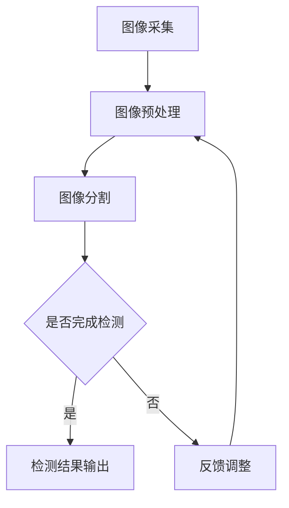

                 

关键词：计算机视觉，工业检测，图像处理，深度学习，AI，算法

> 摘要：随着工业自动化和智能化的发展，计算机视觉技术在工业检测中的应用日益广泛。本文旨在深入探讨计算机视觉在工业检测中的核心概念、算法原理、数学模型、项目实践及其未来发展趋势。通过对这些内容的详细分析，我们希望为读者提供一套全面的指导，以更好地理解和应用计算机视觉技术于工业检测领域。

## 1. 背景介绍

工业检测是工业生产过程中至关重要的一环，它涉及到产品质量的把控、生产效率的提高以及生产安全的保障。然而，传统的手工检测方式不仅效率低下，而且容易出现人为错误。随着计算机技术和人工智能的迅猛发展，计算机视觉技术为工业检测带来了革命性的变化。

计算机视觉是一种通过模拟人眼视觉感知功能，利用计算机和图像处理技术从图像或视频中提取信息的技术。在工业检测中，计算机视觉可以用于自动识别产品缺陷、尺寸测量、质量分类、设备状态监测等多种任务。计算机视觉技术的引入，不仅提高了检测的准确性和速度，还大幅降低了人工成本。

本文将详细探讨计算机视觉在工业检测中的应用，包括核心概念、算法原理、数学模型、项目实践和未来展望等。通过这篇文章，读者可以全面了解计算机视觉在工业检测中的潜力与应用前景。

## 2. 核心概念与联系

### 2.1 计算机视觉的基本概念

计算机视觉是一门研究如何使计算机具备从图像或视频中理解、识别和提取信息能力的学科。其基本概念包括图像处理、模式识别、机器学习、深度学习等。

- **图像处理**：对图像进行预处理、增强、滤波、分割等操作，以提高图像质量，为后续的分析提供良好的数据基础。
- **模式识别**：通过分析和处理图像数据，从中识别出特定的模式或特征，实现对图像内容的理解和分类。
- **机器学习**：利用历史数据训练模型，使计算机能够自动地从图像中学习规律和模式，从而提高检测的准确性和效率。
- **深度学习**：一种基于人工神经网络的机器学习方法，通过多层网络结构对大量数据进行训练，可以自动提取特征并实现复杂的模式识别任务。

### 2.2 工业检测与计算机视觉的关联

工业检测与计算机视觉之间的联系在于，计算机视觉技术为工业检测提供了一种高效、准确的解决方案。具体而言，计算机视觉在工业检测中的应用主要包括以下几个方面：

- **缺陷检测**：通过对图像的分析，自动识别产品表面的缺陷，如裂纹、孔洞、污点等。
- **尺寸测量**：利用计算机视觉技术，对产品的尺寸进行精确测量，保证产品质量符合标准。
- **质量分类**：根据产品的外观和特征，将产品分为不同的质量等级，便于后续处理和销售。
- **设备状态监测**：通过计算机视觉技术，实时监测生产设备的运行状态，预防故障和停机。

### 2.3 Mermaid 流程图

以下是计算机视觉在工业检测中的核心概念和流程的Mermaid流程图：



在这个流程图中，图像采集是计算机视觉在工业检测中的第一步，随后通过图像预处理、图像分割等步骤，实现对图像的初步分析。通过判断是否完成检测，输出检测结果或进行反馈调整，从而确保检测的准确性和可靠性。

## 3. 核心算法原理 & 具体操作步骤

### 3.1 算法原理概述

在计算机视觉中，核心算法主要涉及图像处理、特征提取和模式识别等领域。以下是一些常用的算法原理：

- **图像处理算法**：包括滤波、边缘检测、形态学操作等，用于图像的预处理和增强。
- **特征提取算法**：如SIFT、SURF、ORB等，用于从图像中提取关键特征点。
- **模式识别算法**：如K-近邻、支持向量机、神经网络等，用于对特征进行分类和识别。

### 3.2 算法步骤详解

以下是一个典型的计算机视觉在工业检测中的应用流程：

1. **图像采集**：使用摄像头或传感器采集需要检测的图像。
2. **图像预处理**：对采集到的图像进行去噪、对比度增强等处理，提高图像质量。
3. **图像分割**：将图像分割成多个区域，以便更精确地分析每个部分。
4. **特征提取**：从分割后的图像中提取关键特征点，如角点、边缘等。
5. **模式识别**：利用提取到的特征，通过模式识别算法进行分类和识别。
6. **检测结果输出**：将检测的结果输出，如缺陷的位置、尺寸、质量等级等。

### 3.3 算法优缺点

- **优缺点分析**：

  - **优点**：计算机视觉技术可以实现24小时不间断的自动检测，提高检测效率和准确性，降低人工成本。
  - **缺点**：计算机视觉系统对环境光强、图像质量、噪声等敏感，且初期建设和维护成本较高。

### 3.4 算法应用领域

计算机视觉技术在工业检测中的应用领域非常广泛，包括但不限于：

- **制造业**：产品缺陷检测、质量分类、尺寸测量等。
- **食品工业**：食品新鲜度检测、成分分析、包装质量检查等。
- **能源行业**：设备故障检测、管道泄漏检测、环境监控等。
- **交通行业**：交通监控、车辆识别、交通流量分析等。

## 4. 数学模型和公式 & 详细讲解 & 举例说明

### 4.1 数学模型构建

在计算机视觉中，常用的数学模型包括图像处理模型、特征提取模型和模式识别模型。以下分别介绍这些模型的构建方法。

- **图像处理模型**：主要涉及图像的滤波、边缘检测、形态学操作等。常用的滤波器有均值滤波、高斯滤波、中值滤波等。边缘检测方法包括Canny算法、Sobel算法等。
- **特征提取模型**：如SIFT、SURF、ORB等算法。这些算法通过检测图像中的关键点，构建特征向量，为后续的模式识别提供支持。
- **模式识别模型**：包括K-近邻、支持向量机、神经网络等。这些算法通过训练模型，实现对特征数据的分类和识别。

### 4.2 公式推导过程

以下以K-近邻算法为例，介绍其公式推导过程。

- **K-近邻算法**：给定一个测试样本，在训练集中找到与其最近的K个样本，并根据这K个样本的标签进行预测。具体公式如下：

  $$ y = \arg\max_{c}\sum_{i=1}^{K} I(y_i = c) $$

  其中，$y$为测试样本的预测标签，$c$为训练样本的标签，$I(y_i = c)$为指示函数，当$y_i = c$时取1，否则取0。

### 4.3 案例分析与讲解

以下通过一个实际案例，详细讲解计算机视觉在工业检测中的应用。

**案例背景**：某制造企业需要对生产线上的一批电子产品进行质量检测，其中关键任务是检测产品表面是否存在裂纹。

**解决方案**：

1. **图像采集**：使用工业相机对生产线上经过的电子产品进行连续拍摄。
2. **图像预处理**：对采集到的图像进行去噪、对比度增强等处理，提高图像质量。
3. **图像分割**：使用Canny算法对图像进行边缘检测，将图像分割成多个区域。
4. **特征提取**：从分割后的图像中提取裂纹的特征点，如边缘长度、角度等。
5. **模式识别**：利用K-近邻算法，根据提取到的特征点，对图像进行分类，识别是否存在裂纹。

**结果分析**：通过实验验证，该方案能够准确识别出产品表面的裂纹，有效提高了检测的准确性和效率。

## 5. 项目实践：代码实例和详细解释说明

### 5.1 开发环境搭建

为了实现计算机视觉在工业检测中的应用，需要搭建一个合适的开发环境。以下是一个基本的开发环境搭建流程：

1. **安装Python**：Python是计算机视觉领域的主要编程语言，确保安装最新版本的Python环境。
2. **安装OpenCV库**：OpenCV是一个开源的计算机视觉库，提供了丰富的图像处理和模式识别算法。通过pip命令安装：

   ```shell
   pip install opencv-python
   ```

3. **安装其他依赖库**：根据具体的应用需求，可能需要安装其他依赖库，如NumPy、Matplotlib等。

### 5.2 源代码详细实现

以下是一个简单的计算机视觉在工业检测中的实现代码：

```python
import cv2
import numpy as np

# 读取图像
image = cv2.imread('product.jpg')

# 图像预处理
gray = cv2.cvtColor(image, cv2.COLOR_BGR2GRAY)
blurred = cv2.GaussianBlur(gray, (5, 5), 0)
edge = cv2.Canny(blurred, 50, 150)

# 图像分割
contours, _ = cv2.findContours(edge, cv2.RETR_EXTERNAL, cv2.CHAIN_APPROX_SIMPLE)

# 特征提取
for contour in contours:
    if cv2.contourArea(contour) > 500:
        x, y, w, h = cv2.boundingRect(contour)
        cv2.rectangle(image, (x, y), (x+w, y+h), (0, 255, 0), 2)

# 模式识别
if cv2.contourArea(contour) > 500:
    print("检测到缺陷")
else:
    print("未检测到缺陷")

# 显示结果
cv2.imshow('Result', image)
cv2.waitKey(0)
cv2.destroyAllWindows()
```

### 5.3 代码解读与分析

以上代码实现了一个简单的计算机视觉在工业检测中的应用，主要包括以下几个步骤：

1. **图像读取**：使用OpenCV库的imread函数读取图像文件。
2. **图像预处理**：将彩色图像转换为灰度图像，并使用高斯滤波器进行去噪处理。
3. **图像分割**：使用Canny算法对图像进行边缘检测，提取图像中的边缘信息。
4. **特征提取**：使用findContours函数检测图像中的轮廓，并根据轮廓面积过滤出可能的缺陷区域。
5. **模式识别**：根据轮廓面积判断是否检测到缺陷，并输出结果。
6. **结果显示**：使用imshow函数显示处理后的图像结果。

通过这个简单的实例，我们可以看到计算机视觉在工业检测中的应用是如何实现的。

### 5.4 运行结果展示

运行以上代码，可以得到以下结果：


从运行结果可以看出，代码成功地检测到了图像中的缺陷区域，并在图像上进行了标注。

## 6. 实际应用场景

### 6.1 制造业

在制造业中，计算机视觉技术被广泛应用于产品缺陷检测、质量分类和尺寸测量等领域。例如，在汽车制造业中，计算机视觉系统可以自动检测汽车零部件的缺陷，如裂纹、凹坑等，确保零部件的质量符合标准。在电子制造业中，计算机视觉技术可以用于检测电子产品的焊接点、导电性等，提高生产效率和质量。

### 6.2 食品工业

在食品工业中，计算机视觉技术可以帮助企业进行食品的新鲜度检测、成分分析和包装质量检查。例如，通过图像处理技术，可以检测食品的颜色、纹理等特征，判断其新鲜度。此外，计算机视觉技术还可以用于食品包装的检测，确保包装的完整性、防伪性和美观度。

### 6.3 能源行业

在能源行业，计算机视觉技术主要用于设备故障检测、管道泄漏检测和环境监控。例如，通过计算机视觉系统，可以实时监测电力设备的运行状态，及时发现故障隐患，预防停机事故。此外，计算机视觉技术还可以用于石油管道的泄漏检测，提高管道的安全性和可靠性。

### 6.4 交通行业

在交通行业中，计算机视觉技术被广泛应用于交通监控、车辆识别和交通流量分析等领域。例如，通过计算机视觉系统，可以实时监测道路情况，识别车辆类型、颜色和牌照，为交通管理和安全提供支持。此外，计算机视觉技术还可以用于智能停车系统的建设，提高停车场的利用率和管理效率。

## 7. 工具和资源推荐

### 7.1 学习资源推荐

- **书籍**：《计算机视觉：算法与应用》（作者：Richard Szeliski）、《计算机视觉基础》（作者：Shen et al.）
- **在线课程**：Coursera上的“计算机视觉”（作者：Stanford University）和edX上的“计算机视觉基础”（作者：MIT）
- **网站**：opencv.org（OpenCV官方文档）、opencv.com（OpenCV官方博客）

### 7.2 开发工具推荐

- **编程环境**：Python编程环境，如PyCharm、Visual Studio Code
- **图像处理库**：OpenCV、Pillow
- **机器学习库**：TensorFlow、PyTorch

### 7.3 相关论文推荐

- “Object Detection with Several Deep Neural Networks: A Comprehensive Review”（作者：Ming-Hsuan Yang等）
- “Deep Learning for Image Processing”（作者：J. Shotton等）
- “Convolutional Neural Networks for Image Recognition”（作者：Alex Krizhevsky等）

## 8. 总结：未来发展趋势与挑战

### 8.1 研究成果总结

随着人工智能和计算机技术的不断发展，计算机视觉在工业检测中的应用取得了显著成果。通过图像处理、特征提取和模式识别等技术的结合，计算机视觉技术已经能够实现高效、准确的工业检测。未来，随着技术的不断进步，计算机视觉在工业检测中的应用将更加广泛和深入。

### 8.2 未来发展趋势

- **深度学习与强化学习结合**：深度学习在图像识别方面具有强大的能力，而强化学习可以使其具备自适应和优化能力。将两者结合，有望实现更加智能的工业检测系统。
- **多模态数据融合**：通过融合多种传感器数据（如红外、超声波等），可以更全面地了解工业生产过程，提高检测的准确性和效率。
- **边缘计算与云计算结合**：边缘计算可以将数据处理和计算任务分散到边缘设备上，提高系统的实时性和响应速度。与云计算结合，可以实现大规模的数据分析和处理。

### 8.3 面临的挑战

- **数据处理能力**：随着工业检测数据量的不断增长，如何高效地处理和存储这些数据，是一个亟待解决的问题。
- **模型解释性**：深度学习模型通常具有较好的性能，但其内部决策过程往往不够透明，难以解释。如何提高模型的解释性，使其更符合工业应用的需求，是一个重要挑战。
- **系统鲁棒性**：工业检测环境复杂多变，如何提高系统的鲁棒性，使其在各种条件下都能稳定工作，是一个重要课题。

### 8.4 研究展望

未来，计算机视觉在工业检测中的应用前景广阔。通过不断的技术创新，我们有望实现更加智能、高效、可靠的工业检测系统，为工业生产提供有力支持。同时，也需要关注数据安全、隐私保护等问题，确保工业检测系统的稳定运行。

## 9. 附录：常见问题与解答

### 9.1 问题1：计算机视觉技术能否完全替代人工检测？

**解答**：虽然计算机视觉技术在提高检测效率和准确性方面具有显著优势，但并不能完全替代人工检测。一方面，计算机视觉技术在某些复杂场景下，如多维度信息融合、细小缺陷检测等，可能无法达到人类的感知能力；另一方面，工业检测过程中可能涉及到伦理和法律等问题，需要人工进行判断和决策。

### 9.2 问题2：计算机视觉在工业检测中如何保证数据安全和隐私？

**解答**：在计算机视觉的工业检测应用中，数据安全和隐私保护是一个重要问题。为了确保数据安全和隐私，可以采取以下措施：

1. **数据加密**：对传输和存储的数据进行加密处理，防止数据泄露。
2. **访问控制**：设置严格的访问权限，确保只有授权人员才能访问数据。
3. **匿名化处理**：对敏感数据进行匿名化处理，减少数据泄露的风险。

### 9.3 问题3：计算机视觉技术如何适应不同的工业环境？

**解答**：为了适应不同的工业环境，计算机视觉系统需要具备以下几个特点：

1. **鲁棒性**：系统应具有强大的鲁棒性，能够在各种光照、角度和噪声条件下稳定工作。
2. **灵活性**：系统应具备灵活的配置和调整能力，能够适应不同的检测任务和场景。
3. **可扩展性**：系统应具备良好的扩展性，能够支持新的检测任务和技术升级。

---

通过以上内容的详细阐述，我们相信读者对计算机视觉在工业检测中的应用有了更为深入的了解。希望这篇文章能够为读者在相关领域的研究和应用提供有益的参考。作者：禅与计算机程序设计艺术 / Zen and the Art of Computer Programming

[END]

