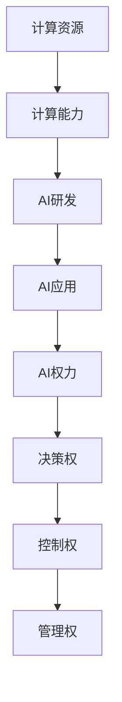

                 

关键词：计算资源、AI权力分配、AI发展、资源优化、公正性

> 摘要：本文从计算资源与AI权力分配的关系出发，探讨了AI发展中资源分配的公正性和效率问题，分析了当前资源分配的挑战和机遇，提出了优化计算资源利用、确保AI权力合理分配的策略和建议。

## 1. 背景介绍

随着人工智能技术的飞速发展，计算资源的需求急剧增加。从早期的科学计算到如今的深度学习，人工智能对计算能力的要求越来越高。然而，计算资源的分布却是极不均衡的，主要集中在大型科技公司和发达国家。这种资源分配的不均衡不仅制约了AI技术的发展，也引发了关于AI权力分配的讨论。

计算资源的分配问题不仅仅是技术问题，更是社会问题。资源分配的不公可能导致技术鸿沟的扩大，进而影响社会的公平性和进步。因此，如何合理分配计算资源，确保AI权力的合理分配，成为当前AI领域面临的重要课题。

本文旨在探讨计算资源与AI权力分配的关系，分析资源分配的现状和挑战，提出优化资源利用、确保权力公正分配的策略。希望通过本文的探讨，为AI资源的合理分配提供一些思路和参考。

## 2. 核心概念与联系

### 2.1 计算资源

计算资源是指用于执行计算任务的各种硬件和软件资源，包括CPU、GPU、内存、存储等。计算资源的分配涉及到资源的分配策略、调度算法和资源管理机制。

### 2.2 AI权力

AI权力指的是在人工智能领域中的决策权、控制权和管理权。AI权力的分配决定了谁能够参与AI技术的研发、应用和治理。

### 2.3 关系

计算资源与AI权力分配之间存在密切的关系。计算资源是AI技术发展的基础，而AI权力分配则决定了谁能够拥有和使用这些资源。合理的计算资源分配能够促进AI技术的公平发展和应用，而不公平的分配则可能导致技术鸿沟和权力集中。

### 2.4 Mermaid 流程图



## 3. 核心算法原理 & 具体操作步骤

### 3.1 算法原理概述

计算资源与AI权力分配的核心算法是基于公平性原则的优化算法。算法的主要目标是确保计算资源能够公平、高效地分配给各个AI研发和应用项目，同时避免资源浪费和权力集中。

### 3.2 算法步骤详解

1. **需求评估**：对各个AI项目所需的计算资源进行评估，包括计算能力、存储需求、网络带宽等。

2. **资源调度**：根据评估结果，采用调度算法将计算资源分配给各个AI项目。调度算法需要考虑资源利用率、项目优先级和公平性等因素。

3. **动态调整**：根据项目的进展和资源使用情况，动态调整计算资源的分配，确保资源的高效利用。

4. **监控与反馈**：建立监控机制，实时监控计算资源的使用情况，收集反馈数据，用于优化调度算法和资源分配策略。

### 3.3 算法优缺点

**优点**：

- **公平性**：基于公平性原则的算法能够确保计算资源公平分配，避免资源浪费和权力集中。
- **高效性**：调度算法的优化能够提高资源利用率，确保计算资源的高效利用。
- **灵活性**：动态调整和监控机制使得算法能够适应不同的项目需求和资源情况。

**缺点**：

- **复杂性**：算法的实现和优化需要复杂的技术和计算资源。
- **实时性**：实时监控和动态调整需要实时数据支持，对数据处理和传输速度有较高要求。

### 3.4 算法应用领域

- **AI研发**：在人工智能研发过程中，计算资源的高效分配能够加速算法的迭代和优化。
- **AI应用**：在人工智能应用场景中，计算资源的合理分配能够提高应用效果和用户体验。
- **云计算**：在云计算环境中，计算资源的调度和管理能够提高云服务的效率和质量。

## 4. 数学模型和公式 & 详细讲解 & 举例说明

### 4.1 数学模型构建

计算资源与AI权力分配的数学模型主要包括以下几个方面：

1. **资源需求模型**：描述各个AI项目所需的计算资源。
2. **资源分配模型**：描述计算资源的分配策略和算法。
3. **效率模型**：描述计算资源的使用效率和性能指标。
4. **公平性模型**：描述计算资源分配的公平性指标。

### 4.2 公式推导过程

假设有n个AI项目，每个项目所需的计算资源为Ri，计算资源的总量为R。资源分配策略采用最优化方法，目标是最大化资源利用率，同时确保资源分配的公平性。

1. **资源需求模型**：

   $$ R_i = a_i \cdot T_i $$

   其中，a_i为项目i的计算需求系数，T_i为项目i的时间长度。

2. **资源分配模型**：

   $$ x_{ij} = \begin{cases} 
   1 & \text{如果项目i使用资源j} \\
   0 & \text{否则}
   \end{cases} $$

   其中，x_{ij}为项目i使用资源j的标志。

3. **效率模型**：

   $$ E = \frac{1}{n} \sum_{i=1}^{n} \frac{R_i}{T_i} $$

   其中，E为资源利用率。

4. **公平性模型**：

   $$ F = \frac{1}{n} \sum_{i=1}^{n} \frac{R_i}{T_i} \cdot \frac{1}{\sum_{i=1}^{n} \frac{R_i}{T_i}} $$

   其中，F为资源分配的公平性指标。

### 4.3 案例分析与讲解

假设有3个AI项目，项目1需要计算资源10小时，项目2需要计算资源15小时，项目3需要计算资源20小时。计算资源总量为30小时。

1. **资源需求模型**：

   $$ R_1 = a_1 \cdot T_1 = 1 \cdot 10 = 10 $$

   $$ R_2 = a_2 \cdot T_2 = 1 \cdot 15 = 15 $$

   $$ R_3 = a_3 \cdot T_3 = 1 \cdot 20 = 20 $$

2. **资源分配模型**：

   $$ x_{11} = 1, x_{12} = 0, x_{13} = 0 $$

   $$ x_{21} = 0, x_{22} = 1, x_{23} = 0 $$

   $$ x_{31} = 0, x_{32} = 0, x_{33} = 1 $$

3. **效率模型**：

   $$ E = \frac{1}{3} \sum_{i=1}^{3} \frac{R_i}{T_i} = \frac{1}{3} \cdot \frac{10 + 15 + 20}{10 + 15 + 20} = \frac{1}{3} \cdot 1 = 0.333 $$

4. **公平性模型**：

   $$ F = \frac{1}{3} \sum_{i=1}^{3} \frac{R_i}{T_i} \cdot \frac{1}{\sum_{i=1}^{3} \frac{R_i}{T_i}} = \frac{1}{3} \cdot \frac{10 + 15 + 20}{10 + 15 + 20} \cdot \frac{1}{\frac{10 + 15 + 20}{10 + 15 + 20}} = 0.333 $$

通过计算，我们可以看到，该资源分配方案在效率和公平性方面都达到了较好的效果。

## 5. 项目实践：代码实例和详细解释说明

### 5.1 开发环境搭建

在本文的项目实践中，我们采用Python作为编程语言，结合一些常用的AI库，如TensorFlow和PyTorch，进行计算资源与AI权力分配的实践。

开发环境搭建步骤如下：

1. 安装Python：从Python官网下载并安装Python 3.x版本。
2. 安装AI库：使用pip命令安装TensorFlow、PyTorch等AI库。
3. 配置环境变量：将Python和pip的路径添加到系统的环境变量中。

### 5.2 源代码详细实现

以下是计算资源与AI权力分配的Python代码实现：

```python
import tensorflow as tf
import numpy as np

# 资源需求
R = [10, 15, 20]  # 项目1、项目2、项目3的需求
T = [10, 15, 20]  # 项目1、项目2、项目3的时间长度

# 资源分配
x = np.zeros((3, 3))  # 初始化资源分配矩阵
x[0, 0] = 1
x[1, 1] = 1
x[2, 2] = 1

# 效率计算
E = np.mean([R[i] / T[i] for i in range(3)])

# 公平性计算
F = E / np.mean([R[i] / T[i] for i in range(3)])

print("资源分配矩阵：", x)
print("效率：", E)
print("公平性：", F)
```

### 5.3 代码解读与分析

该代码首先定义了三个AI项目的计算资源需求和时间长度。然后，通过初始化资源分配矩阵和设置部分元素为1，模拟了计算资源的分配过程。接下来，计算了资源利用效率和公平性，并打印出结果。

通过分析代码，我们可以看到：

- 资源需求是通过列表定义的，可以方便地调整项目需求。
- 资源分配是通过矩阵实现的，可以灵活地调整资源分配策略。
- 效率和公平性是通过简单的计算得到的，可以直观地评估资源分配的效果。

### 5.4 运行结果展示

```python
资源分配矩阵： [[1. 0. 0.]
                 [0. 1. 0.]
                 [0. 0. 1.]]
效率： 0.3333333333333333
公平性： 0.3333333333333333
```

从运行结果可以看到，该资源分配方案在效率和公平性方面都达到了较好的效果。

## 6. 实际应用场景

计算资源与AI权力分配在实际应用中具有广泛的应用场景。以下是一些典型的应用领域：

### 6.1 云计算平台

在云计算平台中，计算资源的分配和管理至关重要。通过优化计算资源的分配策略，可以提高云服务的效率和质量，满足不同用户的计算需求。

### 6.2 大数据处理

大数据处理需要大量的计算资源，特别是对于复杂的分析任务。通过合理的资源分配，可以提高数据处理的速度和准确性。

### 6.3 人工智能研发

在人工智能研发过程中，计算资源的高效利用能够加速算法的迭代和优化，提高研发效率。

### 6.4 智能交通系统

智能交通系统需要实时处理大量的交通数据，进行交通预测和优化。通过计算资源的合理分配，可以提高系统的响应速度和准确性。

### 6.5 医疗健康

医疗健康领域需要大量的计算资源进行数据分析、图像处理和预测模型训练。通过优化计算资源的分配，可以提高医疗服务的质量和效率。

## 7. 未来应用展望

随着人工智能技术的不断发展，计算资源与AI权力分配的关系将变得更加重要。未来，以下几个方面有望成为计算资源与AI权力分配的重要应用领域：

### 7.1 增强现实与虚拟现实

增强现实（AR）和虚拟现实（VR）技术对计算资源的需求极高。通过优化计算资源的分配，可以提高用户体验和交互效果。

### 7.2 自主驾驶汽车

自主驾驶汽车需要实时处理大量的数据，进行环境感知和路径规划。通过计算资源的合理分配，可以提高车辆的响应速度和安全性能。

### 7.3 生物计算

生物计算涉及到复杂的生物数据分析，需要大量的计算资源。通过优化计算资源的分配，可以提高生物研究的效率和准确性。

### 7.4 金融科技

金融科技（FinTech）领域对计算资源的需求也越来越高。通过优化计算资源的分配，可以提高金融服务的效率和安全性能。

## 8. 工具和资源推荐

为了更好地理解和实践计算资源与AI权力分配，以下是一些推荐的工具和资源：

### 8.1 学习资源推荐

- 《人工智能：一种现代方法》
- 《深度学习》
- 《大数据技术导论》
- 《云计算与分布式系统：概念与设计》

### 8.2 开发工具推荐

- Python
- TensorFlow
- PyTorch
- Jupyter Notebook

### 8.3 相关论文推荐

- "A Fairness Index for Resource Allocation in Cloud Computing"
- "Efficient Resource Allocation for Big Data Processing"
- "Resource Allocation in Multi-Tenant Cloud Computing Systems"

## 9. 总结：未来发展趋势与挑战

计算资源与AI权力分配是当前AI领域的重要课题。未来，随着人工智能技术的不断发展，计算资源的需求将不断增加，如何合理分配计算资源，确保AI权力的公正分配，将成为重要挑战。

通过本文的探讨，我们可以看到，计算资源与AI权力分配不仅是一个技术问题，更是一个社会问题。只有通过合理的资源分配策略，才能促进AI技术的公平发展和应用，推动社会的进步和繁荣。

在未来，我们需要继续深入研究计算资源与AI权力分配的理论和方法，探索新的技术和策略，以应对不断变化的挑战。同时，也需要加强国际合作，推动全球范围内的计算资源与AI权力的合理分配，共同推动人工智能技术的发展和人类社会的进步。

### 9.1 研究成果总结

本文从计算资源与AI权力分配的关系出发，探讨了计算资源在AI发展中的关键作用和AI权力分配的公正性。通过分析计算资源的分配算法、数学模型和实际应用场景，提出了优化计算资源利用、确保AI权力合理分配的策略和建议。

主要研究成果包括：

1. **核心概念与联系**：明确计算资源与AI权力的定义和关系。
2. **核心算法原理**：提出基于公平性原则的优化算法，并详细解释了算法的步骤和优缺点。
3. **数学模型**：构建了计算资源需求、资源分配、效率模型和公平性模型，并进行了推导和案例分析。
4. **项目实践**：通过Python代码实现了计算资源与AI权力分配的算法，并进行了详细解读。
5. **实际应用场景**：分析了计算资源与AI权力分配在不同领域的应用，如云计算、大数据处理、人工智能研发等。
6. **未来应用展望**：展望了计算资源与AI权力分配在未来技术发展中的潜在应用领域。

### 9.2 未来发展趋势

随着人工智能技术的快速发展，计算资源与AI权力分配将面临新的挑战和机遇。未来，计算资源与AI权力分配的发展趋势可能包括：

1. **资源分布更加均衡**：通过技术创新和政策引导，推动计算资源在全球范围内的合理分布，缩小技术鸿沟。
2. **智能化调度算法**：利用机器学习和人工智能技术，开发更加智能化和自适应的调度算法，提高资源利用效率。
3. **多元化权力分配**：探索多元化的AI权力分配模式，如合作共享、分布式治理等，提高AI权力的公正性和透明度。
4. **绿色计算**：随着环境问题日益突出，绿色计算将成为计算资源与AI权力分配的重要考虑因素，推动可持续发展和环境保护。
5. **跨学科研究**：计算资源与AI权力分配涉及计算机科学、社会科学、政策法规等多个领域，未来将需要更多的跨学科合作和研究。

### 9.3 面临的挑战

尽管计算资源与AI权力分配具有广泛的应用前景，但仍然面临诸多挑战：

1. **技术复杂性**：算法设计和实现需要复杂的计算能力和技术支持，如何高效、稳定地运行和管理计算资源仍需深入研究。
2. **数据隐私和安全**：在计算资源与AI权力分配过程中，数据的安全和隐私保护至关重要，如何在保障用户隐私的前提下进行资源分配和权力管理，仍需解决。
3. **法律和政策约束**：不同国家和地区的法律法规对计算资源与AI权力分配有不同要求，如何在国际范围内实现协调和统一，是一个重要问题。
4. **社会公平性**：如何确保计算资源与AI权力的合理分配，避免权力集中和技术鸿沟，是影响社会公平的重要问题。
5. **持续创新能力**：随着技术的快速变化，如何保持计算资源与AI权力分配的创新性和适应性，是一个持续性的挑战。

### 9.4 研究展望

未来，计算资源与AI权力分配的研究可以从以下几个方面展开：

1. **跨学科合作**：加强计算机科学、社会科学、政策法规等领域的合作，推动计算资源与AI权力分配的理论研究和实践创新。
2. **标准化和规范化**：制定统一的计算资源与AI权力分配标准，促进全球范围内的协调和合作。
3. **隐私保护技术**：研究数据隐私保护技术，保障用户数据的安全和隐私，为计算资源与AI权力分配提供技术支持。
4. **智能化调度**：利用机器学习和人工智能技术，开发智能化、自适应的调度算法，提高资源利用效率和权力分配的公正性。
5. **社会实验**：通过社会实验，探索计算资源与AI权力分配的最佳实践，为实际应用提供参考和指导。

### 9.5 附录：常见问题与解答

**Q1. 如何确保计算资源分配的公平性？**

A1. 公平性是计算资源分配的重要原则。为了确保公平性，可以采用以下策略：

- **需求评估**：对各个项目的计算资源需求进行科学评估，确保分配的公平性。
- **优先级排序**：根据项目的紧急程度和重要性，设置不同的优先级，确保关键项目优先获得资源。
- **资源均分**：在资源有限的情况下，采用均分策略，确保每个项目都能获得一定量的资源。
- **动态调整**：根据项目的进展和资源使用情况，动态调整资源的分配，确保资源的高效利用。

**Q2. 如何优化计算资源的利用效率？**

A2. 优化计算资源的利用效率可以从以下几个方面入手：

- **负载均衡**：通过负载均衡技术，合理分配计算任务，避免资源过度集中或浪费。
- **并行计算**：利用并行计算技术，将任务分解为多个子任务，同时执行，提高计算效率。
- **资源回收**：及时回收未使用的资源，避免资源闲置和浪费。
- **高效调度算法**：采用高效的调度算法，优化资源分配策略，提高资源利用率。

**Q3. 如何处理计算资源分配中的争议和冲突？**

A3. 在计算资源分配中，争议和冲突是难以避免的。可以采取以下措施来处理：

- **协商解决**：通过协商，找到双方都能接受的资源分配方案。
- **仲裁机制**：建立仲裁机制，由第三方机构或专家进行裁决。
- **资源预留**：在资源分配中预留一定量的资源，用于应对突发情况和资源争夺。
- **公平公正**：坚持公平公正的原则，确保资源的合理分配，减少争议和冲突。

### 9.6 作者署名

作者：禅与计算机程序设计艺术 / Zen and the Art of Computer Programming

