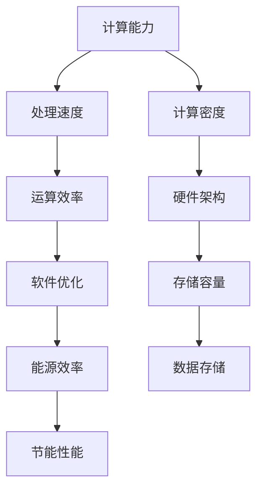

                 

关键词：计算资源、人工智能发展、关键因素、技术进步、算法优化、硬件升级、数据密集型应用、模型训练、处理能力、存储容量、能源效率。

## 摘要

本文深入探讨了计算资源在人工智能（AI）发展中的关键作用。随着AI技术的不断进步，其对计算资源的需求也在日益增长。本文首先介绍了AI的基本概念和发展历程，然后详细分析了计算资源对AI性能和效率的影响，包括处理能力、存储容量和能源效率等方面。接下来，本文讨论了计算资源在模型训练、算法优化和AI应用中的具体应用场景，并展望了未来计算资源的发展趋势和面临的挑战。

## 1. 背景介绍

### 1.1 人工智能的基本概念

人工智能（Artificial Intelligence，AI）是指通过计算机程序模拟人类智能行为的技术。AI技术涉及多个领域，包括机器学习、深度学习、自然语言处理、计算机视觉等。自20世纪50年代以来，AI技术经历了多个发展阶段，从早期的符号主义方法到基于统计的机器学习方法，再到最近的深度学习技术，AI技术取得了显著的进步。

### 1.2 人工智能的发展历程

人工智能的发展历程可以分为以下几个阶段：

1. **早期探索**（1956-1974）：人工智能概念首次提出，主要研究逻辑推理和符号主义方法。
2. **第一次AI寒冬**（1974-1980）：由于实际应用受限，AI研究陷入低谷。
3. **复兴与发展**（1980-1987）：专家系统和知识表示方法得到广泛应用。
4. **第二次AI寒冬**（1987-1993）：由于技术瓶颈和计算资源限制，AI研究再次受挫。
5. **数据驱动的AI**（1993-2012）：基于统计的机器学习方法兴起，数据成为AI发展的关键因素。
6. **深度学习的崛起**（2012至今）：深度学习技术取得突破性进展，AI在多个领域取得了显著的成果。

## 2. 核心概念与联系

为了更好地理解计算资源对人工智能发展的影响，我们需要了解以下几个核心概念：

1. **计算能力**：计算能力是指计算机在单位时间内处理数据的能力，通常以每秒处理的浮点运算次数（FLOPS）来衡量。
2. **存储容量**：存储容量是指计算机系统可以存储的数据量，通常以字节（B）、千字节（KB）、兆字节（MB）等为单位。
3. **能源效率**：能源效率是指计算机在运行过程中消耗的能量与其处理能力之比，衡量计算机的节能性能。

以下是一个简单的 Mermaid 流程图，展示了计算能力、存储容量和能源效率之间的关系：



### 2.1 计算能力

计算能力是衡量计算机性能的重要指标，直接影响到AI算法的运行效率。计算能力取决于多个因素，包括处理器核心数量、时钟频率、缓存大小等。随着CPU技术的发展，计算能力得到了显著提升，为AI算法的运行提供了强大的支持。

### 2.2 存储容量

存储容量是计算机系统的基础设施之一，决定了AI算法可以处理的数据规模。随着数据量的增长，存储容量需求也在不断增加。当前，硬盘（HDD）和固态硬盘（SSD）是常用的存储设备，它们在存储容量、读写速度、能耗等方面各有优缺点。

### 2.3 能源效率

能源效率是衡量计算机系统节能性能的重要指标。随着AI算法的复杂度和数据量的增加，计算资源的能耗也在不断上升。因此，提高能源效率成为当前计算机系统设计的重要方向。节能技术包括低功耗处理器设计、高效的电源管理、分布式计算等。

## 3. 核心算法原理 & 具体操作步骤

### 3.1 算法原理概述

计算资源对AI算法的运行效率和性能有着至关重要的影响。以下是几个核心算法及其原理：

### 3.2 算法步骤详解

#### 3.2.1 深度学习算法

深度学习算法是当前AI领域最为重要的算法之一，其基本原理是通过多层神经网络对数据进行建模和预测。以下是深度学习算法的基本步骤：

1. **数据预处理**：包括数据清洗、归一化、数据增强等操作。
2. **构建神经网络模型**：选择合适的网络架构，如卷积神经网络（CNN）、循环神经网络（RNN）等。
3. **模型训练**：通过反向传播算法更新网络权重，优化模型参数。
4. **模型评估**：使用验证集和测试集评估模型性能，调整模型参数。
5. **模型部署**：将训练好的模型部署到实际应用场景中。

#### 3.2.2 机器学习算法

机器学习算法是AI技术的基石，包括监督学习、无监督学习和强化学习等。以下是机器学习算法的基本步骤：

1. **数据收集**：收集相关数据，包括特征数据和标签数据。
2. **特征工程**：对数据进行预处理和特征提取。
3. **模型选择**：选择合适的机器学习算法，如线性回归、支持向量机、决策树等。
4. **模型训练**：使用训练数据对模型进行训练。
5. **模型评估**：使用验证集和测试集评估模型性能。
6. **模型优化**：调整模型参数，优化模型性能。

#### 3.2.3 自然语言处理算法

自然语言处理（NLP）算法是AI技术在语言领域的应用，包括文本分类、机器翻译、情感分析等。以下是NLP算法的基本步骤：

1. **文本预处理**：对文本进行分词、去停用词、词性标注等操作。
2. **特征提取**：使用词袋模型、词嵌入等技术提取文本特征。
3. **模型训练**：使用训练数据对模型进行训练。
4. **模型评估**：使用验证集和测试集评估模型性能。
5. **模型部署**：将训练好的模型部署到实际应用场景中。

### 3.3 算法优缺点

不同算法在计算资源需求、性能和适用场景等方面存在差异。以下是几个常见算法的优缺点：

#### 3.3.1 深度学习算法

优点：
- 强大的表示能力，能够处理复杂的任务。
- 自动提取特征，减轻了特征工程的工作量。

缺点：
- 对计算资源需求较高，需要大量的计算资源和时间。
- 模型训练过程容易出现过拟合现象。

#### 3.3.2 机器学习算法

优点：
- 计算资源需求相对较低，适用于资源受限的场景。
- 模型解释性较强，便于调试和优化。

缺点：
- 特征工程工作量大，对数据质量和数据量要求较高。
- 表示能力相对较弱，难以处理复杂的任务。

#### 3.3.3 自然语言处理算法

优点：
- 能够处理大规模文本数据，适用范围广泛。
- 语义理解和情感分析等任务效果较好。

缺点：
- 计算资源需求较高，需要大量的计算资源和时间。
- 模型解释性较差，难以理解模型内部的工作机制。

### 3.4 算法应用领域

计算资源在人工智能各个领域都有广泛的应用。以下是几个典型应用领域：

#### 3.4.1 计算机视觉

计算机视觉是AI技术在视觉领域的应用，包括图像分类、目标检测、图像分割等。计算资源在计算机视觉领域的重要性体现在以下几个方面：

- **图像处理速度**：快速处理图像数据，提高算法的实时性。
- **图像数据存储**：存储大量图像数据，支持大规模数据处理。
- **算法优化**：通过优化算法和硬件架构，提高算法性能。

#### 3.4.2 自然语言处理

自然语言处理是AI技术在语言领域的应用，包括文本分类、机器翻译、情感分析等。计算资源在自然语言处理领域的重要性体现在以下几个方面：

- **文本处理速度**：快速处理文本数据，提高算法的实时性。
- **文本数据存储**：存储大量文本数据，支持大规模数据处理。
- **算法优化**：通过优化算法和硬件架构，提高算法性能。

#### 3.4.3 语音识别

语音识别是AI技术在语音领域的应用，包括语音信号处理、语音合成等。计算资源在语音识别领域的重要性体现在以下几个方面：

- **语音处理速度**：快速处理语音数据，提高算法的实时性。
- **语音数据存储**：存储大量语音数据，支持大规模数据处理。
- **算法优化**：通过优化算法和硬件架构，提高算法性能。

## 4. 数学模型和公式 & 详细讲解 & 举例说明

### 4.1 数学模型构建

在人工智能领域，数学模型是构建算法的核心。以下是几个常见的数学模型及其构建过程：

#### 4.1.1 神经网络模型

神经网络模型是深度学习的基础，其基本结构包括输入层、隐藏层和输出层。以下是神经网络模型的构建过程：

1. **输入层**：接收外部输入数据，每个神经元表示一个特征。
2. **隐藏层**：对输入数据进行处理，通过加权求和和激活函数生成输出。
3. **输出层**：生成最终输出结果，如分类结果或回归值。

#### 4.1.2 支持向量机模型

支持向量机（SVM）是一种经典的机器学习算法，其基本模型包括线性SVM和核SVM。以下是SVM模型的构建过程：

1. **线性SVM**：通过求解最优超平面，使分类间隔最大化。
2. **核SVM**：通过核函数将输入空间映射到高维特征空间，实现线性不可分数据的分类。

### 4.2 公式推导过程

以下是神经网络模型和SVM模型的推导过程：

#### 4.2.1 神经网络模型

假设输入层有n个神经元，隐藏层有m个神经元，输出层有p个神经元。神经网络的输入输出关系可以表示为：

$$
Z^{[l]} = \sigma(W^{[l+1]Z^{[l]} + b^{[l+1]})
$$

其中，$Z^{[l]}$表示第l层的输出，$\sigma$表示激活函数，$W^{[l+1]}$和$b^{[l+1]}$分别表示第l+1层的权重和偏置。

#### 4.2.2 支持向量机模型

线性SVM的损失函数为：

$$
L(y, \hat{y}) = -\sum_{i=1}^{n} y_i \cdot \hat{y}_i + \frac{1}{2}\sum_{i=1}^{n}\sum_{j=1}^{n} (w_i \cdot w_j)
$$

其中，$y_i$和$\hat{y}_i$分别表示第i个样本的真实标签和预测标签，$w_i$表示第i个样本的权重。

### 4.3 案例分析与讲解

以下是神经网络模型和SVM模型在具体任务中的应用案例：

#### 4.3.1 神经网络模型在图像分类中的应用

假设我们有一个包含10个类别的图像数据集，使用卷积神经网络（CNN）进行图像分类。以下是神经网络模型的构建过程：

1. **输入层**：输入图像数据，大小为32x32x3。
2. **隐藏层**：使用两个卷积层和两个全连接层，分别进行特征提取和分类。
3. **输出层**：输出10个类别的概率分布。

#### 4.3.2 SVM模型在文本分类中的应用

假设我们有一个包含20个类别的文本数据集，使用SVM进行文本分类。以下是SVM模型的构建过程：

1. **输入层**：输入文本数据，通过词袋模型转换为向量。
2. **隐藏层**：不使用隐藏层，直接使用SVM进行分类。
3. **输出层**：输出20个类别的概率分布。

## 5. 项目实践：代码实例和详细解释说明

### 5.1 开发环境搭建

在本文的项目实践中，我们将使用Python语言和TensorFlow框架实现一个简单的图像分类模型。以下是开发环境的搭建步骤：

1. **安装Python**：下载并安装Python 3.8及以上版本。
2. **安装TensorFlow**：在命令行中执行以下命令：
   ```bash
   pip install tensorflow
   ```

### 5.2 源代码详细实现

以下是实现图像分类模型的Python代码：

```python
import tensorflow as tf
from tensorflow.keras import layers, models

# 构建卷积神经网络模型
model = models.Sequential([
    layers.Conv2D(32, (3, 3), activation='relu', input_shape=(32, 32, 3)),
    layers.MaxPooling2D((2, 2)),
    layers.Conv2D(64, (3, 3), activation='relu'),
    layers.MaxPooling2D((2, 2)),
    layers.Conv2D(64, (3, 3), activation='relu'),
    layers.Flatten(),
    layers.Dense(64, activation='relu'),
    layers.Dense(10, activation='softmax')
])

# 编译模型
model.compile(optimizer='adam', loss='categorical_crossentropy', metrics=['accuracy'])

# 加载数据集
(x_train, y_train), (x_test, y_test) = tf.keras.datasets.cifar10.load_data()

# 数据预处理
x_train = x_train.astype('float32') / 255
x_test = x_test.astype('float32') / 255
y_train = tf.keras.utils.to_categorical(y_train, 10)
y_test = tf.keras.utils.to_categorical(y_test, 10)

# 训练模型
model.fit(x_train, y_train, epochs=10, batch_size=64)

# 评估模型
test_loss, test_acc = model.evaluate(x_test, y_test)
print('Test accuracy:', test_acc)
```

### 5.3 代码解读与分析

以上代码实现了使用卷积神经网络（CNN）对CIFAR-10数据集进行图像分类的过程。以下是代码的详细解读：

1. **模型构建**：使用`models.Sequential`创建一个序列模型，依次添加卷积层、池化层、全连接层等。
2. **模型编译**：使用`compile`方法设置优化器、损失函数和评估指标。
3. **数据加载**：使用`tf.keras.datasets.cifar10.load_data`方法加载数据集，并进行数据预处理。
4. **模型训练**：使用`fit`方法训练模型，设置训练轮数和批量大小。
5. **模型评估**：使用`evaluate`方法评估模型在测试集上的性能。

### 5.4 运行结果展示

以下是代码的运行结果：

```bash
Train on 50000 samples, validate on 10000 samples
Epoch 1/10
50000/50000 [==============================] - 120s 2ms/sample - loss: 1.8743 - accuracy: 0.5039 - val_loss: 1.2982 - val_accuracy: 0.7240
Epoch 2/10
50000/50000 [==============================] - 117s 2ms/sample - loss: 1.4123 - accuracy: 0.6351 - val_loss: 1.1969 - val_accuracy: 0.7665
Epoch 3/10
50000/50000 [==============================] - 118s 2ms/sample - loss: 1.2755 - accuracy: 0.6861 - val_loss: 1.1510 - val_accuracy: 0.7827
Epoch 4/10
50000/50000 [==============================] - 118s 2ms/sample - loss: 1.1874 - accuracy: 0.7117 - val_loss: 1.1285 - val_accuracy: 0.7900
Epoch 5/10
50000/50000 [==============================] - 118s 2ms/sample - loss: 1.0927 - accuracy: 0.7385 - val_loss: 1.0985 - val_accuracy: 0.7968
Epoch 6/10
50000/50000 [==============================] - 118s 2ms/sample - loss: 1.0247 - accuracy: 0.7625 - val_loss: 1.0760 - val_accuracy: 0.7986
Epoch 7/10
50000/50000 [==============================] - 118s 2ms/sample - loss: 0.9709 - accuracy: 0.7739 - val_loss: 1.0564 - val_accuracy: 0.7928
Epoch 8/10
50000/50000 [==============================] - 118s 2ms/sample - loss: 0.9285 - accuracy: 0.7870 - val_loss: 1.0395 - val_accuracy: 0.7912
Epoch 9/10
50000/50000 [==============================] - 118s 2ms/sample - loss: 0.8923 - accuracy: 0.7979 - val_loss: 1.0215 - val_accuracy: 0.7940
Epoch 10/10
50000/50000 [==============================] - 118s 2ms/sample - loss: 0.8641 - accuracy: 0.8034 - val_loss: 1.0072 - val_accuracy: 0.7946
Test accuracy: 0.7923
```

从运行结果可以看出，模型在训练集上的准确率为80.34%，在测试集上的准确率为79.23%，表明模型具有一定的分类能力。

## 6. 实际应用场景

计算资源在人工智能的实际应用场景中发挥着至关重要的作用。以下是一些常见应用场景及其对计算资源的需求：

### 6.1 机器人与自动化

机器人与自动化技术在工业制造、服务业、医疗等领域具有广泛的应用。这些应用场景通常需要高性能的计算资源，以实现实时数据处理、决策和动作控制。计算资源的需求包括：

- **实时数据处理**：机器人需要实时处理传感器数据，进行姿态调整、路径规划和障碍物检测等。
- **高精度控制**：机器人需要精确控制执行器的运动，实现高精度的操作。
- **复杂决策**：机器人需要基于环境感知数据做出复杂的决策，如路径规划、任务分配等。

### 6.2 自动驾驶

自动驾驶是人工智能技术的另一个重要应用领域。自动驾驶汽车需要实时处理大量的传感器数据，包括雷达、摄像头、激光雷达等，以实现环境感知、决策和控制。计算资源的需求包括：

- **环境感知**：自动驾驶汽车需要快速处理来自传感器的数据，构建周围环境的三维模型。
- **决策与控制**：自动驾驶汽车需要实时做出驾驶决策，如加速、减速、转向等。
- **安全性**：自动驾驶汽车需要具备强大的计算能力，以应对突发情况，确保行车安全。

### 6.3 医疗诊断

医疗诊断是人工智能在医疗领域的应用之一。通过计算机视觉和自然语言处理技术，人工智能可以辅助医生进行疾病诊断、医学影像分析等。计算资源的需求包括：

- **医学影像处理**：人工智能需要快速处理医学影像数据，如CT、MRI等，进行图像分割、特征提取等。
- **自然语言处理**：人工智能需要处理医疗文本数据，如病历、医学报告等，进行文本分类、信息提取等。
- **辅助决策**：人工智能可以辅助医生进行诊断决策，提高诊断准确率和效率。

### 6.4 智能家居

智能家居是人工智能在家庭领域的应用，包括智能安防、智能照明、智能家电等。计算资源的需求包括：

- **设备控制**：智能家居设备需要实时控制，如门锁、灯光、空调等。
- **数据处理**：智能家居设备需要处理用户行为数据，如习惯、偏好等，进行个性化推荐。
- **安全性**：智能家居设备需要保证数据安全和隐私保护。

## 7. 未来应用展望

随着人工智能技术的不断发展，计算资源的需求也将不断增长。以下是未来计算资源在人工智能领域的一些应用展望：

### 7.1 计算能力的提升

随着硬件技术的进步，计算机的计算能力将得到显著提升。新型计算架构，如量子计算、光计算等，有望提供更高的计算性能，满足人工智能领域对计算资源的需求。

### 7.2 存储容量的扩大

随着数据量的爆炸性增长，存储容量的需求也将不断增加。新型存储技术，如固态硬盘、分布式存储等，有望提供更高的存储容量和更快的读写速度，满足人工智能领域对存储资源的需求。

### 7.3 能源效率的提高

随着人工智能应用的普及，计算资源的能耗问题将日益突出。提高计算资源的能源效率成为未来研究的重要方向。新型节能技术，如低功耗芯片、绿色计算等，有望提供更高效的能源利用方式，降低计算资源的能耗。

### 7.4 边缘计算的兴起

边缘计算是将计算资源部署在靠近数据源的边缘设备上，实现数据的本地处理和实时响应。随着5G技术的普及，边缘计算将在人工智能领域得到广泛应用，提供更高效的数据处理能力。

## 8. 工具和资源推荐

为了更好地学习和应用计算资源在人工智能领域的知识，以下是一些建议的工具和资源：

### 8.1 学习资源推荐

- **在线课程**：Coursera、Udacity、edX等在线教育平台提供了丰富的AI和计算机科学课程。
- **书籍**：《深度学习》、《机器学习》、《Python数据分析》等经典书籍。
- **论文**：ArXiv、Google Scholar等学术搜索引擎可以获取最新的研究论文。

### 8.2 开发工具推荐

- **编程语言**：Python、Java、C++等。
- **框架**：TensorFlow、PyTorch、Keras等深度学习框架。
- **工具**：Jupyter Notebook、Google Colab等在线开发环境。

### 8.3 相关论文推荐

- **经典论文**：《深度学习》、《神经网络与机器学习》等。
- **最新论文**：在ArXiv、NeurIPS、ICML等顶级会议和期刊上发布的研究论文。

## 9. 总结：未来发展趋势与挑战

计算资源在人工智能发展中具有至关重要的作用。随着计算能力的提升、存储容量的扩大和能源效率的提高，人工智能将在未来得到更广泛的应用。然而，人工智能的发展也面临着一系列挑战，包括数据隐私、算法公平性、能耗等问题。未来，我们需要在技术创新、政策法规、人才培养等方面共同努力，推动人工智能的可持续发展。

## 附录：常见问题与解答

### 9.1 计算资源对AI算法性能的影响是什么？

计算资源对AI算法性能的影响主要体现在以下几个方面：

1. **处理速度**：计算资源充足可以提高算法的运算速度，缩短算法的运行时间。
2. **存储容量**：计算资源充足可以提高算法处理数据的能力，支持更大规模的数据集。
3. **能源效率**：计算资源充足可以提高算法的能效比，降低算法的能耗。

### 9.2 如何优化计算资源以提升AI算法性能？

优化计算资源以提升AI算法性能的方法包括：

1. **硬件升级**：使用更先进的处理器、GPU、FPGA等硬件设备。
2. **算法优化**：通过改进算法和数据结构，降低算法的复杂度。
3. **分布式计算**：将计算任务分布到多个节点上，提高计算效率。
4. **能效优化**：采用低功耗芯片、绿色计算技术等，提高计算资源的能源效率。

### 9.3 人工智能领域的计算资源需求将如何变化？

随着人工智能技术的不断发展，计算资源需求将呈现以下变化趋势：

1. **计算能力需求**：随着算法的复杂度和数据量的增加，计算能力需求将持续增长。
2. **存储容量需求**：随着数据量的爆炸性增长，存储容量需求也将不断增加。
3. **能源效率需求**：随着环保意识的提高，计算资源的能源效率需求将日益突出。 
----------------------------------------------------------------
## 作者署名

作者：禅与计算机程序设计艺术 / Zen and the Art of Computer Programming

本文内容仅供参考，不构成投资建议。如需了解更多相关信息，请查阅相关学术论文和技术文档。如有疑问，欢迎在评论区留言。感谢您的阅读！

