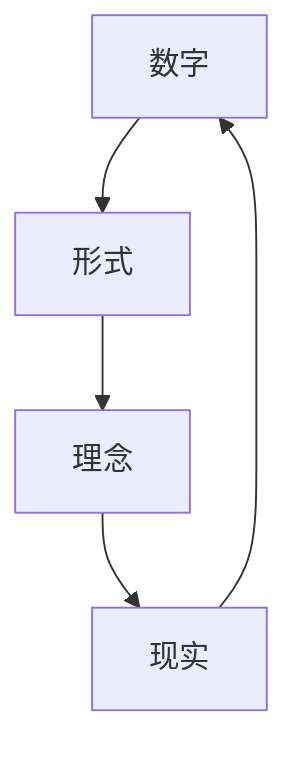

                 

关键词：计算历史，毕达哥拉斯，柏拉图，理想世界，数学哲学，计算机科学基础，算法原理，人工智能

摘要：本文从数学哲学的角度出发，探讨计算的历史渊源，聚焦于毕达哥拉斯和柏拉图的思考，揭示他们在探索数字与形式之美中的深远影响。通过对计算基础的深入剖析，文章旨在为读者理解现代计算机科学提供一条清晰的历史路径。

## 1. 背景介绍

计算，作为一种处理信息的方法，其根源可以追溯到古代文明。从最初的计数工具，到古希腊数学家毕达哥拉斯对数学的深入研究，再到柏拉图对理念世界的构想，计算的诞生和发展经历了漫长的历程。本文将重点讨论毕达哥拉斯和柏拉图对计算概念的贡献，以及这些思想如何影响了现代计算机科学的形成。

### 1.1 毕达哥拉斯的发现

毕达哥拉斯，作为古希腊哲学家和数学家，他的研究成果在数学领域具有里程碑意义。最为人所知的是毕达哥拉斯定理，即直角三角形的两条直角边平方和等于斜边平方。这一发现不仅揭示了数字之间的关系，也激发了人们对数学美的追求。

### 1.2 柏拉图的理想世界

柏拉图，作为西方哲学的奠基人之一，他在《理想国》中提出了理想世界的构想。在柏拉图的理念世界中，存在一个完美的数字王国，数字本身是永恒不变的，而现实世界中的数字只是这些完美数字的影子。柏拉图的思想为后来的形式主义哲学和数学基础理论奠定了基础。

## 2. 核心概念与联系

为了更好地理解毕达哥拉斯和柏拉图的思想，我们首先需要了解一些核心概念。在本节中，我们将使用Mermaid流程图来展示这些概念之间的关系。



在这个流程图中，我们可以看到数字、形式、理念和现实之间的相互联系。数字是抽象的，它们存在于形式世界中；形式世界中的完美数字构成了理念；而现实世界中的数字只是理念世界的反映。

### 2.1 数字与形式

毕达哥拉斯认为，数字不仅仅是用来计数的工具，而是宇宙的本质。他发现，通过数学公式，可以描述自然界中许多现象。这种对形式的追求，体现了数学的统一性和普适性。

### 2.2 理念与现实

柏拉图则进一步提出了理念与现实的关系。他认为，现实世界中的物体只是理念世界的影子，而理念世界是完美和永恒的。这种思想影响了后来的形式主义哲学，认为数学的基础不在于现实，而在于抽象的形式。

### 2.3 形式与计算

将柏拉图的理念带入到计算中，我们可以发现，计算机科学的本质就是对形式的处理。计算机程序通过对形式的操作，实现了对信息的处理和计算。这种处理方式与柏拉图的理念世界有着异曲同工之妙。

## 3. 核心算法原理 & 具体操作步骤

在理解了毕达哥拉斯和柏拉图的思想后，我们接下来将探讨核心算法的原理和具体操作步骤。

### 3.1 算法原理概述

算法，是计算机科学中最核心的概念之一。它是一系列解决问题的步骤，具有确定性、有效性和可理解性。算法的原理可以追溯到古希腊数学家的研究，他们通过公理和定义，建立了数学体系。

### 3.2 算法步骤详解

算法的步骤通常包括输入、处理和输出。首先，算法需要接收输入，这些输入可以是具体的数值、条件或者数据集合。然后，算法通过对输入进行处理，实现特定的计算或操作。最后，算法输出结果，这些结果可以是数值、文本或者图像。

### 3.3 算法优缺点

算法的优点在于其确定性、高效性和普适性。确定性意味着算法的每一步都是确定的，不会产生随机结果；高效性意味着算法能够在有限的时间内完成计算；普适性意味着算法可以应用于不同的领域和问题。然而，算法也存在一些缺点，如对输入的依赖性、算法的复杂性和可扩展性。

### 3.4 算法应用领域

算法的应用领域非常广泛，包括计算机科学、物理学、经济学、生物学等。在计算机科学中，算法被广泛应用于排序、搜索、图形处理、人工智能等领域。

## 4. 数学模型和公式 & 详细讲解 & 举例说明

数学模型和公式是计算的核心组成部分。在本节中，我们将使用LaTeX格式来展示一些重要的数学模型和公式，并进行详细讲解。

### 4.1 数学模型构建

数学模型是通过对现实世界的抽象和简化，构建出一个数学体系。例如，牛顿的运动定律就是一个简单的数学模型，它描述了物体在受力作用下的运动。

### 4.2 公式推导过程

公式的推导过程通常包括假设、推导和验证。例如，牛顿-莱布尼茨公式是微积分中最重要的公式之一，它描述了微分和积分之间的关系。

$$
\int_{a}^{b} f(x) \, dx = F(b) - F(a)
$$

### 4.3 案例分析与讲解

为了更好地理解数学模型和公式的应用，我们来看一个简单的案例：计算矩形的面积。

假设矩形的长度为L，宽度为W，则矩形的面积S可以表示为：

$$
S = L \times W
$$

这个公式非常简单，但它在几何学中有着广泛的应用。例如，在建筑和工程领域中，计算矩形的面积对于设计结构非常重要。

## 5. 项目实践：代码实例和详细解释说明

在本节中，我们将通过一个简单的Python代码实例，来展示如何实现一个基本的计算功能。

### 5.1 开发环境搭建

首先，我们需要搭建一个Python开发环境。您可以选择使用PyCharm、Visual Studio Code等IDE进行开发。此外，Python的安装也非常简单，可以通过Python官方网站下载并安装。

### 5.2 源代码详细实现

以下是实现一个计算矩形的面积的Python代码：

```python
def calculate_area(length, width):
    return length * width

length = float(input("请输入矩形的长度："))
width = float(input("请输入矩形的宽度："))
area = calculate_area(length, width)
print("矩形的面积为：", area)
```

### 5.3 代码解读与分析

这段代码首先定义了一个名为`calculate_area`的函数，它接收长度和宽度作为参数，并返回它们的乘积。然后，代码通过`input`函数接收用户输入的长度和宽度，并调用`calculate_area`函数进行计算。最后，代码输出计算结果。

### 5.4 运行结果展示

当您运行这段代码时，它会提示您输入矩形的长度和宽度。例如，如果您输入长度为4，宽度为3，则运行结果将显示“矩形的面积为：12”。

## 6. 实际应用场景

计算在现代科技中有着广泛的应用。例如，在人工智能领域，计算用于处理大量数据，实现图像识别、自然语言处理等任务。在物理学中，计算用于模拟宇宙的演化、物质的性质等。在工程领域，计算用于设计结构、分析材料等。

### 6.1 人工智能

人工智能是计算的一个关键应用领域。通过算法和计算，人工智能系统能够学习和模拟人类的思维过程。例如，深度学习算法通过计算大量的数据，实现了图像识别、语音识别等功能。

### 6.2 物理学

物理学中的许多问题需要通过计算来解决。例如，计算宇宙的演化、物质的性质等。这些计算通常涉及到复杂的数学模型和公式，需要高性能的计算机和算法来处理。

### 6.3 工程领域

在工程领域，计算用于设计结构、分析材料等。例如，在建筑设计中，计算用于确定结构的强度和稳定性。在材料科学中，计算用于研究材料的微观结构和性质。

## 7. 未来应用展望

随着计算技术的发展，未来应用前景广阔。例如，量子计算有望解决当前计算机难以处理的问题，如大型数据集的分析和复杂问题的求解。此外，计算在医疗、金融、交通等领域的应用也将不断深入。

### 7.1 量子计算

量子计算是一种基于量子力学原理的计算方式，它利用量子位（qubit）进行计算，具有超越经典计算机的潜力。量子计算有望解决某些复杂问题，如密码破解、药物设计等。

### 7.2 医疗

计算在医疗领域的应用日益广泛。例如，计算可以用于疾病预测、基因分析、药物研发等。通过大数据分析和机器学习，医疗领域有望实现个性化治疗和精准医疗。

### 7.3 金融

金融领域也受益于计算技术的发展。例如，计算可以用于风险分析、投资策略制定等。通过大数据分析和人工智能，金融领域有望实现更高效和智能的投资决策。

### 7.4 交通

计算在交通领域有着广泛的应用。例如，计算可以用于智能交通系统、自动驾驶汽车等。通过优化路线、提高交通效率，计算有望改善人们的出行体验。

## 8. 总结：未来发展趋势与挑战

计算作为一门学科，具有广阔的发展前景和重要的应用价值。然而，未来计算也面临一些挑战，如量子计算的发展、数据隐私和安全等。

### 8.1 研究成果总结

在过去的几十年中，计算领域取得了许多重要的研究成果。例如，计算机体系结构的优化、算法理论的突破、人工智能的快速发展等。

### 8.2 未来发展趋势

未来计算的发展趋势包括量子计算、边缘计算、人工智能的深度融合等。这些技术有望推动计算领域的创新和应用。

### 8.3 面临的挑战

计算领域面临的挑战包括量子计算的安全、数据隐私保护、算法公平性等。这些挑战需要我们共同努力，推动计算技术的可持续发展和应用。

### 8.4 研究展望

在未来的研究中，我们需要关注量子计算、人工智能、生物计算等前沿领域。通过多学科交叉与合作，我们有望解决计算领域中的关键问题，推动计算技术的进步。

## 9. 附录：常见问题与解答

### 9.1 什么是计算？

计算是指通过算法和计算机系统处理信息的过程。它包括数据的输入、处理和输出。

### 9.2 计算机科学的核心是什么？

计算机科学的核心包括算法、数据结构、计算机体系结构、操作系统、编程语言等。

### 9.3 量子计算是什么？

量子计算是一种基于量子力学原理的计算方式，利用量子位（qubit）进行计算，具有超越经典计算机的潜力。

### 9.4 人工智能是什么？

人工智能是指通过算法和计算机系统模拟人类智能的过程。它包括机器学习、深度学习、自然语言处理等。

### 9.5 计算在医学中的应用有哪些？

计算在医学中的应用包括疾病预测、基因分析、药物研发、医疗影像分析等。

### 9.6 计算在金融中的应用有哪些？

计算在金融中的应用包括风险分析、投资策略制定、交易系统、量化交易等。

### 9.7 计算在交通中的应用有哪些？

计算在交通中的应用包括智能交通系统、自动驾驶汽车、交通流量分析、出行规划等。

## 作者署名

作者：禅与计算机程序设计艺术 / Zen and the Art of Computer Programming

----------------------------------------------------------------

以上就是本文的完整内容，感谢您的阅读。希望这篇文章能够帮助您更好地理解计算的历史、原理和应用。如果您有任何疑问或建议，欢迎在评论区留言。再次感谢您的关注和支持！

