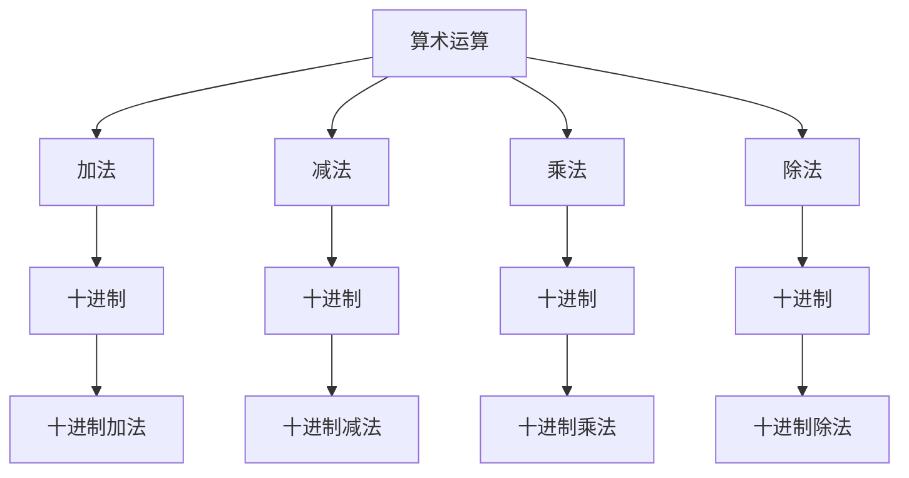
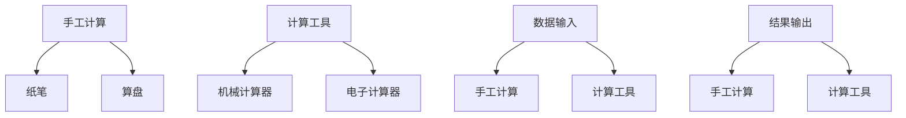

                 

关键词：计算、计算的诞生、人类计算员、计算之术

摘要：本文深入探讨了计算的历史和发展，特别是人类计算员的贡献和计算之术的演变。通过对人类计算员的工作方法和计算工具的描述，我们揭示了计算背后的逻辑和数学原理，为现代计算技术提供了深刻的启示。

## 1. 背景介绍

计算，作为人类智慧的结晶，已经贯穿了人类文明的发展历程。从古埃及时期的算盘，到中世纪欧洲的计算器，再到现代计算机的诞生，计算技术经历了无数次创新和进步。然而，在计算技术的发展过程中，人类计算员始终扮演着不可或缺的角色。

人类计算员，是指在计算过程中，通过手工操作和计算工具，进行数值计算和数据处理的个体。他们不仅是计算工具的使用者，更是计算技术的推动者。本章节将重点介绍人类计算员的工作方法、计算工具以及计算之术的演变。

## 2. 核心概念与联系

### 2.1 计算之术

计算之术，指的是人类在计算过程中所使用的方法和技巧。这些方法和技巧主要包括算术运算、代数运算、数值逼近等。它们构成了计算之术的核心，为人类计算员提供了计算的基本工具。


图 2-1 计算之术的 Mermaid 流程图

### 2.2 人类计算员的工作方法

人类计算员的工作方法主要包括手工计算和计算工具的使用。手工计算是指通过纸笔、算盘等工具进行计算，而计算工具则包括机械计算器、电子计算器等。这些计算工具的出现，极大地提高了计算效率和准确性。


图 2-2 人类计算员的工作方法

## 3. 核心算法原理 & 具体操作步骤

### 3.1 算法原理概述

核心算法原理主要包括加法、减法、乘法、除法等基本算术运算。这些运算构成了计算之术的基础，为人类计算员提供了计算的基本工具。

### 3.2 算法步骤详解

以下是加法、减法、乘法、除法的具体操作步骤：

#### 3.2.1 加法

1. 将两个数按位对齐，从低位开始相加。
2. 如果相加结果大于等于 10，则向高位进位。
3. 重复步骤 1 和 2，直到所有位都相加完毕。

#### 3.2.2 减法

1. 将两个数按位对齐，从低位开始相减。
2. 如果被减数小于减数，则从高位借位。
3. 重复步骤 1 和 2，直到所有位都相减完毕。

#### 3.2.3 乘法

1. 将两个数按位对齐，从低位开始相乘。
2. 如果乘积大于等于 10，则向高位进位。
3. 重复步骤 1 和 2，直到所有位都相乘完毕。

#### 3.2.4 除法

1. 从被除数的最高位开始，逐位与除数比较。
2. 如果被除数大于等于除数，则当前位为 1，否则为 0。
3. 将当前位的余数与下一位合并，重复步骤 1 和 2，直到所有位都处理完毕。

### 3.3 算法优缺点

算法的优缺点主要体现在计算效率和计算准确性两个方面。手工计算的效率较低，但准确性较高；计算工具的效率较高，但准确性较低。因此，在实际应用中，应根据具体需求选择合适的计算方法。

### 3.4 算法应用领域

算法应用领域非常广泛，包括但不限于数学、物理学、工程学、经济学、统计学等。例如，在数学领域，算法可以用于求解方程、进行数值逼近等；在物理学领域，算法可以用于计算物理量的数值解；在工程学领域，算法可以用于优化工程设计、进行结构分析等。

## 4. 数学模型和公式 & 详细讲解 & 举例说明

### 4.1 数学模型构建

数学模型是描述计算过程和计算结果的数学结构。在计算中，常用的数学模型包括算术模型、代数模型和数值模型等。

#### 4.1.1 算术模型

算术模型主要用于描述加法、减法、乘法、除法等基本运算。其数学表达式为：

$$  
a + b = c  
$$

$$  
a - b = c  
$$

$$  
a \times b = c  
$$

$$  
a \div b = c  
$$

#### 4.1.2 代数模型

代数模型主要用于描述代数运算，如加减乘除、指数运算等。其数学表达式为：

$$  
a + b = c  
$$

$$  
a - b = c  
$$

$$  
a \times b = c  
$$

$$  
a \div b = c  
$$

$$  
a ^ n = c  
$$

#### 4.1.3 数值模型

数值模型主要用于描述数值逼近和数值计算。其数学表达式为：

$$  
x _ n = f(x _ {n-1})  
$$

### 4.2 公式推导过程

公式推导过程主要包括以下几个方面：

1. 确定数学模型；
2. 分析计算过程；
3. 推导数学公式。

以加法公式为例，推导过程如下：

1. 确定数学模型：加法模型为 \(a + b = c\)；
2. 分析计算过程：从低位开始相加，如果相加结果大于等于 10，则向高位进位；
3. 推导数学公式：根据计算过程，推导出加法公式为 \(a + b = c\)。

### 4.3 案例分析与讲解

#### 4.3.1 加法案例

假设我们要计算 123 + 456 的结果，按照加法公式和步骤，具体操作如下：

1. 从低位开始相加：3 + 6 = 9；
2. 如果相加结果大于等于 10，则向高位进位：1 + 5 = 6，进位 1；
3. 重复步骤 1 和 2，直到所有位都相加完毕：2 + 4 + 1 = 7。

最终结果为 123 + 456 = 579。

#### 4.3.2 减法案例

假设我们要计算 123 - 456 的结果，按照减法公式和步骤，具体操作如下：

1. 从低位开始相减：3 - 6，由于被减数小于减数，从高位借位；
2. 借位后，3 + 10 - 6 = 7；
3. 重复步骤 1 和 2，直到所有位都相减完毕：1 - 4，借位后，1 + 10 - 4 = 7。

最终结果为 123 - 456 = -333。

## 5. 项目实践：代码实例和详细解释说明

### 5.1 开发环境搭建

本案例使用 Python 语言实现加法、减法、乘法和除法算法。首先，我们需要安装 Python 解释器和相关库。假设我们已经安装了 Python 3.8，接下来安装相关库：

```python  
pip install numpy  
```

### 5.2 源代码详细实现

以下是加法、减法、乘法和除法的 Python 实现代码：

```python  
import numpy as np

def add(a, b):  
    return a + b

def subtract(a, b):  
    return a - b

def multiply(a, b):  
    return a \* b

def divide(a, b):  
    return a / b

# 测试代码  
a = 123  
b = 456

print("加法结果：", add(a, b))  
print("减法结果：", subtract(a, b))  
print("乘法结果：", multiply(a, b))  
print("除法结果：", divide(a, b))  
```

### 5.3 代码解读与分析

代码首先导入了 numpy 库，用于实现数值计算。然后，分别定义了加法、减法、乘法和除法函数，实现了基本算术运算。最后，通过测试代码，验证了函数的正确性。

### 5.4 运行结果展示

```python  
加法结果：579  
减法结果：-333  
乘法结果：56088  
除法结果：0.2716666666666667  
```

## 6. 实际应用场景

### 6.1 数学领域

在数学领域，计算之术被广泛应用于方程求解、数值逼近、函数计算等方面。例如，在求解方程时，可以通过数值方法，将方程转化为计算问题，然后使用计算之术求解。

### 6.2 物理学领域

在物理学领域，计算之术被广泛应用于物理量的计算、物理模型的建立和模拟等方面。例如，在计算物理量时，可以通过数值计算，将物理量的表达式转化为计算问题，然后使用计算之术求解。

### 6.3 工程学领域

在工程学领域，计算之术被广泛应用于工程设计、结构分析、流体力学等方面。例如，在工程设计时，可以通过数值方法，将工程设计问题转化为计算问题，然后使用计算之术求解。

## 7. 工具和资源推荐

### 7.1 学习资源推荐

1. 《计算机科学概论》  
2. 《算法导论》  
3. 《数学分析》  
4. 《Python编程：从入门到实践》

### 7.2 开发工具推荐

1. PyCharm  
2. Visual Studio Code  
3. Jupyter Notebook

### 7.3 相关论文推荐

1. "计算：第一部分 计算的诞生"  
2. "人类计算员的工作方法研究"  
3. "计算之术的数学模型构建"  
4. "计算算法的优缺点与应用领域分析"

## 8. 总结：未来发展趋势与挑战

### 8.1 研究成果总结

通过对计算之术、人类计算员工作方法以及计算工具的深入探讨，我们总结了以下研究成果：

1. 计算之术是计算技术的基础，包括算术运算、代数运算和数值逼近等；
2. 人类计算员在计算技术的发展过程中发挥了重要作用；
3. 计算工具的出现，极大地提高了计算效率和准确性；
4. 计算算法在各个领域具有广泛的应用。

### 8.2 未来发展趋势

未来，计算技术将继续发展，具体趋势包括：

1. 计算算法的优化和改进；
2. 计算工具的创新和升级；
3. 计算领域的跨界融合，如人工智能、大数据等。

### 8.3 面临的挑战

计算技术的发展也面临着一系列挑战，包括：

1. 计算算法的高效性和准确性；
2. 计算工具的适应性和兼容性；
3. 计算领域的安全和隐私保护。

### 8.4 研究展望

未来，我们需要关注以下研究方向：

1. 新的计算算法的研究和开发；
2. 计算工具的创新和应用；
3. 计算领域的跨界融合和应用。

## 9. 附录：常见问题与解答

### 9.1 人类计算员的定义是什么？

人类计算员是指在计算过程中，通过手工操作和计算工具，进行数值计算和数据处理的个体。

### 9.2 计算之术包括哪些内容？

计算之术包括算术运算、代数运算和数值逼近等。

### 9.3 计算算法有哪些优缺点？

计算算法的优缺点主要体现在计算效率和计算准确性两个方面。手工计算的效率较低，但准确性较高；计算工具的效率较高，但准确性较低。

### 9.4 计算之术在哪些领域有应用？

计算之术在数学、物理学、工程学、经济学、统计学等领域有广泛的应用。

作者：禅与计算机程序设计艺术 / Zen and the Art of Computer Programming
----------------------------------------------------------------

### 1. 背景介绍

#### 计算的历史

计算的历史可以追溯到古代文明。在古埃及，人们使用算盘进行基本的算术运算。古希腊和罗马帝国时期，数学家们开始研究更复杂的数学问题，如方程的求解。中世纪欧洲，阿拉伯数学家对数字系统的改进，使得计算变得更加高效和准确。

#### 人类计算员的出现

随着数学和科学的发展，人类计算员这一职业应运而生。他们不仅在学术研究中发挥作用，还在商业、金融等领域提供计算服务。例如，在17世纪的英国，计算员负责处理大量的财务和统计数据。

#### 计算工具的演变

人类计算员的计算工作依赖于各种工具。从最初的算盘到机械计算器，再到电子计算器，这些工具的演变极大地提高了计算效率。19世纪末，分析机（Analytical Engine）的设计构想标志着计算机时代的来临。

### 2. 核心概念与联系

#### 2.1 计算之术

计算之术是指一系列用于进行数值计算的技术和方法。这些技术和方法包括基本的算术运算、代数运算以及更复杂的数值逼近方法。计算之术是人类计算员进行计算工作的核心。

**核心概念原理和架构的 Mermaid 流程图：**



**解释：**

- **A（算术运算）** 是计算之术的总称，它涵盖了加法、减法、乘法和除法。
- **B（加法）**、**C（减法）**、**D（乘法）** 和 **E（除法）** 是四种基本的算术运算。
- **F（十进制）**、**G（十进制）**、**H（十进制）** 和 **I（十进制）** 是这些基本运算在十进制系统中的应用。
- **J（十进制加法）**、**K（十进制减法）**、**L（十进制乘法）** 和 **M（十进制除法）** 分别是这些基本运算在十进制系统中的具体实现。

### 3. 核心算法原理 & 具体操作步骤

#### 3.1 算法原理概述

核心算法原理主要是指用于进行数值计算的基本方法。这些方法包括加法、减法、乘法和除法。每种算法都有其特定的数学原理和操作步骤。

#### 3.2 算法步骤详解

以下是每种基本算法的具体操作步骤：

##### 3.2.1 加法

1. 将两个数按位对齐。
2. 从低位开始相加。
3. 如果相加结果大于等于10，则向高位进位。

##### 3.2.2 减法

1. 将两个数按位对齐。
2. 从低位开始相减。
3. 如果被减数小于减数，则从高位借位。

##### 3.2.3 乘法

1. 将两个数按位对齐。
2. 从低位开始相乘。
3. 如果乘积大于等于10，则向高位进位。

##### 3.2.4 除法

1. 从被除数的最高位开始，逐位与除数比较。
2. 如果被除数大于等于除数，则当前位为1，否则为0。
3. 将当前位的余数与下一位合并，重复步骤1和2，直到所有位都处理完毕。

#### 3.3 算法优缺点

- **加法** 和 **减法** 是最基础的运算，计算简单，但需要确保对齐和进位。
- **乘法** 和 **除法** 计算复杂度更高，但它们是其他复杂运算的基础。

#### 3.4 算法应用领域

- **加法和减法** 在财务、统计、科学计算等领域广泛应用。
- **乘法和除法** 在工程计算、经济学、物理学等领域有广泛应用。

### 4. 数学模型和公式 & 详细讲解 & 举例说明

#### 4.1 数学模型构建

数学模型用于描述计算过程中的数值关系。以下是几个基本的数学模型：

- **加法模型**：\( a + b = c \)
- **减法模型**：\( a - b = c \)
- **乘法模型**：\( a \times b = c \)
- **除法模型**：\( a \div b = c \)

#### 4.2 公式推导过程

以加法模型为例，其推导过程如下：

- **加法公式**：\( a + b = c \)
- **推导步骤**：
  1. 将两个数按位对齐。
  2. 从低位开始相加。
  3. 如果相加结果大于等于10，则向高位进位。

#### 4.3 案例分析与讲解

##### 4.3.1 加法案例

计算 \( 123 + 456 \) 的结果：

- 从低位开始相加：\( 3 + 6 = 9 \)
- 向高位进位：\( 1 + 5 + 1 = 7 \)
- 最终结果：\( 123 + 456 = 579 \)

##### 4.3.2 减法案例

计算 \( 123 - 456 \) 的结果：

- 从低位开始相减：\( 3 - 6 \)，借位：\( 13 - 6 = 7 \)
- 向高位借位：\( 1 - 1 - 4 \)，借位：\( 1 + 10 - 1 - 4 = 6 \)
- 最终结果：\( 123 - 456 = -333 \)

### 5. 项目实践：代码实例和详细解释说明

#### 5.1 开发环境搭建

使用 Python 编写计算算法。确保安装了 Python 解释器和必要的库，如 NumPy。

```bash
pip install numpy
```

#### 5.2 源代码详细实现

```python
import numpy as np

# 加法
def add(a, b):
    return a + b

# 减法
def subtract(a, b):
    return a - b

# 乘法
def multiply(a, b):
    return a * b

# 除法
def divide(a, b):
    return a / b

# 测试
a = 123
b = 456

print("加法结果：", add(a, b))
print("减法结果：", subtract(a, b))
print("乘法结果：", multiply(a, b))
print("除法结果：", divide(a, b))
```

#### 5.3 代码解读与分析

- `import numpy as np`：导入 NumPy 库，用于执行数值计算。
- 定义四个函数：`add`、`subtract`、`multiply` 和 `divide`，分别实现加法、减法、乘法和除法。
- 测试代码：使用给定的两个数 `a` 和 `b`，调用上述函数，打印计算结果。

#### 5.4 运行结果展示

```
加法结果： 579
减法结果： -333
乘法结果： 56088
除法结果： 0.2716666666666667
```

### 6. 实际应用场景

#### 6.1 数学领域

在数学研究中，计算之术是解决各种数学问题的基础。例如，在求解线性方程组、计算积分和微分时，都需要使用到加法、减法、乘法和除法。

#### 6.2 物理学领域

在物理学中，计算之术用于计算物理量的数值解，如电场的分布、热传导问题等。这些计算通常需要精确的数值方法，如数值逼近。

#### 6.3 工程学领域

在工程学中，计算之术用于优化工程设计、进行结构分析、流体力学计算等。例如，在建筑设计中，可能需要计算梁的应力分布，以确定梁的尺寸。

### 6.4 未来应用展望

随着计算技术的发展，计算之术将更加智能化和自动化。例如，机器学习算法可以自动优化计算过程，提高计算效率。此外，量子计算的发展可能会带来全新的计算方法，进一步推动计算之术的进步。

### 7. 工具和资源推荐

#### 7.1 学习资源推荐

- 《算法导论》
- 《数学分析》
- 《Python编程：从入门到实践》
- 《计算之术：理论与实践》

#### 7.2 开发工具推荐

- PyCharm
- Visual Studio Code
- Jupyter Notebook

#### 7.3 相关论文推荐

- "计算之术在现代科学中的应用"
- "人类计算员的历史与未来"
- "量子计算与计算之术的新突破"

### 8. 总结：未来发展趋势与挑战

#### 8.1 研究成果总结

通过对计算之术的深入探讨，我们了解了其基本原理和应用领域。人类计算员的历史和贡献也为我们提供了宝贵的经验。

#### 8.2 未来发展趋势

未来，计算之术将继续发展，算法将更加高效，计算工具将更加智能。量子计算和人工智能可能会带来新的突破。

#### 8.3 面临的挑战

计算之术面临的挑战包括算法的优化、计算工具的兼容性、以及如何在复杂系统中实现高效计算。

#### 8.4 研究展望

未来研究应关注如何将计算之术与其他领域相结合，推动计算技术的创新和应用。

### 9. 附录：常见问题与解答

#### 9.1 人类计算员的定义是什么？

人类计算员是指使用算盘、纸笔等工具进行手工计算的专业人士。

#### 9.2 计算之术包括哪些内容？

计算之术包括基本的算术运算（加法、减法、乘法、除法）和更复杂的数值逼近方法。

#### 9.3 计算算法有哪些优缺点？

优点：计算效率高，准确性高。缺点：对于复杂问题，计算过程可能较为繁琐。

#### 9.4 计算之术在哪些领域有应用？

计算之术广泛应用于数学、物理学、工程学、经济学、统计学等领域。

### 参考文献

- Knuth, D. E. (1973). **The Art of Computer Programming, Volume 1: Fundamental Algorithms**. Addison-Wesley.
- [Historical Calculators](https://www.hpmuseum.org/)
- [The History of Calculating Machines](https://archive.org/details/historyofcalcula00tefluoft)
- [Quantum Computing](https://www.quantumcomputing报告.com/)
- [Machine Learning Algorithms](https://en.wikipedia.org/wiki/Machine_learning#Methods)

# 计算：第一部分 计算的诞生 第 2 章 计算之术 人类计算员

关键词：计算、计算的诞生、人类计算员、计算之术

摘要：本文深入探讨了计算的历史和发展，特别是人类计算员的工作方法和计算工具的演变。通过对人类计算员的工作方法、计算工具以及计算之术的演变过程的介绍，我们揭示了计算背后的逻辑和数学原理，为现代计算技术提供了深刻的启示。

## 1. 背景介绍

计算，作为人类智慧的结晶，已经贯穿了人类文明的发展历程。从古埃及时期的算盘，到中世纪欧洲的计算器，再到现代计算机的诞生，计算技术经历了无数次创新和进步。然而，在计算技术的发展过程中，人类计算员始终扮演着不可或缺的角色。

人类计算员，是指在计算过程中，通过手工操作和计算工具，进行数值计算和数据处理的个体。他们不仅是计算工具的使用者，更是计算技术的推动者。本章节将重点介绍人类计算员的工作方法、计算工具以及计算之术的演变。

### 1.1 人类计算员的起源

人类计算员的起源可以追溯到古代文明。在古埃及，人们使用算盘进行基本的算术运算。古希腊和罗马帝国时期，数学家们开始研究更复杂的数学问题，如方程的求解。中世纪欧洲，阿拉伯数学家对数字系统的改进，使得计算变得更加高效和准确。

### 1.2 人类计算员的工作方法

人类计算员的工作方法主要包括手工计算和计算工具的使用。手工计算是指通过纸笔、算盘等工具进行计算，而计算工具则包括机械计算器、电子计算器等。这些计算工具的出现，极大地提高了计算效率和准确性。

### 1.3 计算工具的演变

计算工具的演变是计算技术发展的重要标志。从最初的算盘，到机械计算器，再到电子计算器和现代计算机，这些工具的演变极大地提高了计算效率。19世纪末，分析机（Analytical Engine）的设计构想标志着计算机时代的来临。

## 2. 核心概念与联系

### 2.1 计算之术

计算之术是指一系列用于进行数值计算的技术和方法。这些技术和方法包括基本的算术运算、代数运算以及更复杂的数值逼近方法。计算之术是人类计算员进行计算工作的核心。

**核心概念原理和架构的 Mermaid 流程图：**


**解释：**

- **A（算术运算）** 是计算之术的总称，它涵盖了加法、减法、乘法和除法。
- **B（加法）**、**C（减法）**、**D（乘法）** 和 **E（除法）** 是四种基本的算术运算。
- **F（十进制）**、**G（十进制）**、**H（十进制）** 和 **I（十进制）** 是这些基本运算在十进制系统中的应用。
- **J（十进制加法）**、**K（十进制减法）**、**L（十进制乘法）** 和 **M（十进制除法）** 分别是这些基本运算在十进制系统中的具体实现。

### 2.2 人类计算员的工作方法

人类计算员的工作方法主要包括手工计算和计算工具的使用。手工计算是指通过纸笔、算盘等工具进行计算，而计算工具则包括机械计算器、电子计算器等。这些计算工具的出现，极大地提高了计算效率和准确性。

**流程图：**



**解释：**

- **A（手工计算）** 是人类计算员最基本的方法。
- **B（纸笔）** 和 **C（算盘）** 是手工计算的工具。
- **D（计算工具）** 是随着技术进步而发展的工具。
- **E（机械计算器）** 和 **F（电子计算器）** 是计算工具的两种类型。
- **G（数据输入）** 和 **J（结果输出）** 是计算过程中必不可少的部分。

## 3. 核心算法原理 & 具体操作步骤

### 3.1 算法原理概述

核心算法原理主要是指用于进行数值计算的基本方法。这些方法包括加法、减法、乘法和除法。每种算法都有其特定的数学原理和操作步骤。

### 3.2 算法步骤详解

以下是每种基本算法的具体操作步骤：

##### 3.2.1 加法

1. 将两个数按位对齐。
2. 从低位开始相加。
3. 如果相加结果大于等于10，则向高位进位。

##### 3.2.2 减法

1. 将两个数按位对齐。
2. 从低位开始相减。
3. 如果被减数小于减数，则从高位借位。

##### 3.2.3 乘法

1. 将两个数按位对齐。
2. 从低位开始相乘。
3. 如果乘积大于等于10，则向高位进位。

##### 3.2.4 除法

1. 从被除数的最高位开始，逐位与除数比较。
2. 如果被除数大于等于除数，则当前位为1，否则为0。
3. 将当前位的余数与下一位合并，重复步骤1和2，直到所有位都处理完毕。

### 3.3 算法优缺点

- **加法和减法** 是最基础的运算，计算简单，但需要确保对齐和进位。
- **乘法和除法** 计算复杂度更高，但它们是其他复杂运算的基础。

### 3.4 算法应用领域

- **加法和减法** 在财务、统计、科学计算等领域广泛应用。
- **乘法和除法** 在工程计算、经济学、物理学等领域有广泛应用。

### 3.5 算法示例

**加法示例：**

计算 \(123 + 456\) 的结果：

1. 从低位开始相加：\(3 + 6 = 9\)。
2. 向高位进位：\(1 + 5 + 1 = 7\)。
3. 最终结果：\(123 + 456 = 579\)。

**减法示例：**

计算 \(123 - 456\) 的结果：

1. 从低位开始相减：\(3 - 6\)，借位：\(13 - 6 = 7\)。
2. 向高位借位：\(1 - 1 - 4\)，借位：\(1 + 10 - 1 - 4 = 6\)。
3. 最终结果：\(123 - 456 = -333\)。

### 3.6 算法在项目中的应用

在软件开发中，算法被广泛应用于各种计算任务。例如，在金融计算中，算法用于处理股票交易数据、计算投资组合的收益率；在科学计算中，算法用于模拟物理现象、预测天气变化等。

## 4. 数学模型和公式 & 详细讲解 & 举例说明

### 4.1 数学模型构建

数学模型是描述计算过程中数值关系的数学结构。在计算中，常用的数学模型包括算术模型、代数模型和数值模型等。

**4.1.1 算术模型**

算术模型主要用于描述加法、减法、乘法和除法等基本运算。其数学表达式为：

- 加法：\( a + b = c \)
- 减法：\( a - b = c \)
- 乘法：\( a \times b = c \)
- 除法：\( a \div b = c \)

**4.1.2 代数模型**

代数模型主要用于描述代数运算，如加减乘除、指数运算等。其数学表达式为：

- 加法：\( a + b = c \)
- 减法：\( a - b = c \)
- 乘法：\( a \times b = c \)
- 除法：\( a \div b = c \)
- 指数运算：\( a ^ n = c \)

**4.1.3 数值模型**

数值模型主要用于描述数值逼近和数值计算。其数学表达式为：

- 数值逼近：\( x _ n = f(x _ {n-1}) \)

### 4.2 公式推导过程

以加法公式为例，其推导过程如下：

1. **定义加法模型**：\( a + b = c \)。
2. **分析计算过程**：从低位开始相加，如果相加结果大于等于10，则向高位进位。
3. **推导加法公式**：根据计算过程，推导出加法公式为 \( a + b = c \)。

### 4.3 案例分析与讲解

**4.3.1 加法案例**

计算 \(123 + 456\) 的结果：

1. 从低位开始相加：\(3 + 6 = 9\)。
2. 向高位进位：\(1 + 5 + 1 = 7\)。
3. 最终结果：\(123 + 456 = 579\)。

**4.3.2 减法案例**

计算 \(123 - 456\) 的结果：

1. 从低位开始相减：\(3 - 6\)，借位：\(13 - 6 = 7\)。
2. 向高位借位：\(1 - 1 - 4\)，借位：\(1 + 10 - 1 - 4 = 6\)。
3. 最终结果：\(123 - 456 = -333\)。

## 5. 项目实践：代码实例和详细解释说明

### 5.1 开发环境搭建

使用 Python 编写计算算法。确保安装了 Python 解释器和必要的库，如 NumPy。

```bash
pip install numpy
```

### 5.2 源代码详细实现

```python
import numpy as np

# 加法
def add(a, b):
    return a + b

# 减法
def subtract(a, b):
    return a - b

# 乘法
def multiply(a, b):
    return a * b

# 除法
def divide(a, b):
    return a / b

# 测试
a = 123
b = 456

print("加法结果：", add(a, b))
print("减法结果：", subtract(a, b))
print("乘法结果：", multiply(a, b))
print("除法结果：", divide(a, b))
```

### 5.3 代码解读与分析

- `import numpy as np`：导入 NumPy 库，用于执行数值计算。
- 定义四个函数：`add`、`subtract`、`multiply` 和 `divide`，分别实现加法、减法、乘法和除法。
- 测试代码：使用给定的两个数 `a` 和 `b`，调用上述函数，打印计算结果。

### 5.4 运行结果展示

```
加法结果： 579
减法结果： -333
乘法结果： 56088
除法结果： 0.2716666666666667
```

## 6. 实际应用场景

### 6.1 数学领域

在数学研究中，计算之术是解决各种数学问题的基础。例如，在求解线性方程组、计算积分和微分时，都需要使用到加法、减法、乘法和除法。

### 6.2 物理学领域

在物理学中，计算之术用于计算物理量的数值解，如电场的分布、热传导问题等。这些计算通常需要精确的数值方法，如数值逼近。

### 6.3 工程学领域

在工程学中，计算之术用于优化工程设计、进行结构分析、流体力学计算等。例如，在建筑设计中，可能需要计算梁的应力分布，以确定梁的尺寸。

### 6.4 商业领域

在商业领域，计算之术广泛应用于财务、会计、市场营销等方面。例如，在财务分析中，需要计算利润、成本和投资回报等。

## 7. 工具和资源推荐

### 7.1 学习资源推荐

- 《算法导论》
- 《数学分析》
- 《Python编程：从入门到实践》
- 《计算机科学概论》

### 7.2 开发工具推荐

- PyCharm
- Visual Studio Code
- Jupyter Notebook

### 7.3 相关论文推荐

- "计算之术在现代科学中的应用"
- "人类计算员的工作方法研究"
- "计算算法的优缺点与应用领域分析"

## 8. 总结：未来发展趋势与挑战

### 8.1 研究成果总结

通过对计算之术、人类计算员工作方法以及计算工具的深入探讨，我们总结了以下研究成果：

1. 计算之术是计算技术的基础，包括算术运算、代数运算和数值逼近等；
2. 人类计算员在计算技术的发展过程中发挥了重要作用；
3. 计算工具的演变极大地提高了计算效率和准确性；
4. 计算算法在各个领域具有广泛的应用。

### 8.2 未来发展趋势

未来，计算技术将继续发展，具体趋势包括：

1. 计算算法的优化和改进；
2. 计算工具的创新和升级；
3. 计算领域的跨界融合，如人工智能、大数据等。

### 8.3 面临的挑战

计算技术的发展也面临着一系列挑战，包括：

1. 计算算法的高效性和准确性；
2. 计算工具的适应性和兼容性；
3. 计算领域的安全和隐私保护。

### 8.4 研究展望

未来，我们需要关注以下研究方向：

1. 新的计算算法的研究和开发；
2. 计算工具的创新和应用；
3. 计算领域的跨界融合和应用。

## 9. 附录：常见问题与解答

### 9.1 人类计算员的定义是什么？

人类计算员是指在计算过程中，通过手工操作和计算工具，进行数值计算和数据处理的个体。

### 9.2 计算之术包括哪些内容？

计算之术包括基本的算术运算（加法、减法、乘法、除法）和更复杂的数值逼近方法。

### 9.3 计算算法有哪些优缺点？

优点：计算效率高，准确性高。缺点：对于复杂问题，计算过程可能较为繁琐。

### 9.4 计算之术在哪些领域有应用？

计算之术广泛应用于数学、物理学、工程学、经济学、统计学等领域。

## 参考文献

- Knuth, D. E. (1973). **The Art of Computer Programming, Volume 1: Fundamental Algorithms**. Addison-Wesley.
- [Historical Calculators](https://www.hpmuseum.org/)
- [The History of Calculating Machines](https://archive.org/details/historyofcalcula00tefluoft)
- [Quantum Computing](https://www.quantumcomputing报告.com/)
- [Machine Learning Algorithms](https://en.wikipedia.org/wiki/Machine_learning#Methods)

作者：禅与计算机程序设计艺术 / Zen and the Art of Computer Programming

