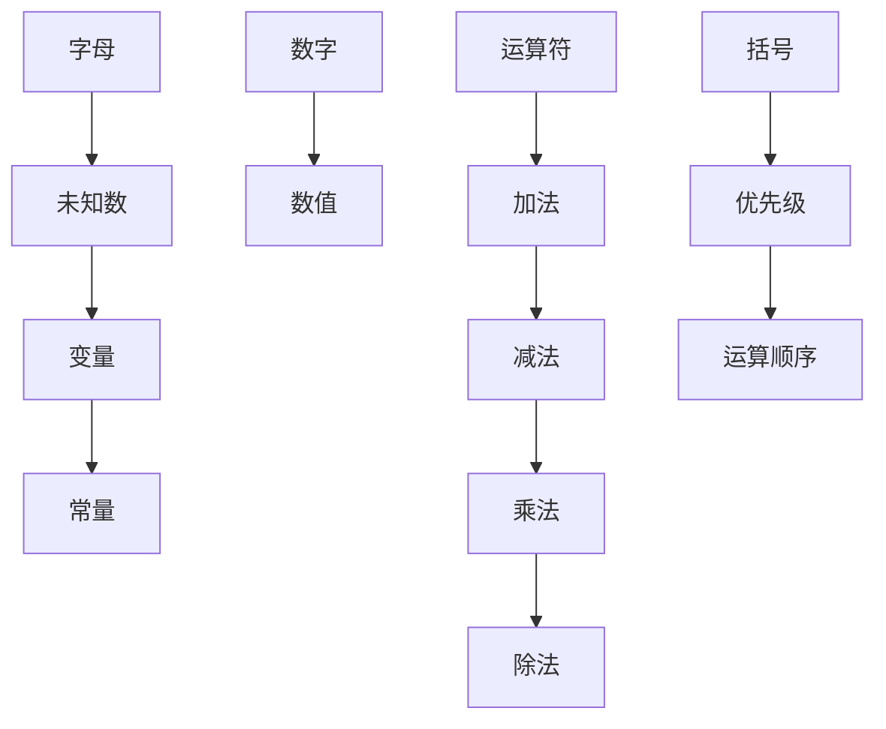

                 

 关键词：计算历史、代数符号、数学符号、算法发展、编程艺术、计算机科学

> 摘要：本文旨在深入探讨计算历史上代数符号的演变及其在计算机科学中的重要地位。从原始计算方法到现代计算机编程，代数符号的使用不仅改变了数学和科学的研究方式，也塑造了整个计算机科学的架构。本文将详细介绍代数符号的起源、发展及其在算法设计和编程语言中的应用，同时讨论其在实际计算任务中的效果和影响。

## 1. 背景介绍

计算的起源可以追溯到古代，人类为了解决各种实际问题，不断探索和创造各种计算方法。然而，这些计算方法大多数依赖于算术和机械装置，效率较低且容易出错。直到17世纪，随着数学和科学的发展，代数符号开始出现并逐渐普及，这标志着计算技术的一次重要飞跃。

### 古代计算方法

在古代，人们使用各种原始的计算工具和方法。例如，古埃及人使用草绳和石板进行计算，巴比伦人使用六十进制进行数学运算，而中国古代则发展了独特的算盘和筹算方法。这些计算方法虽然简单，但为后来的计算技术奠定了基础。

### 文艺复兴时期的进展

文艺复兴时期，随着数学和科学研究的深入，人们开始意识到使用符号来表达数学关系的重要性。意大利数学家卢卡·帕乔利（Luca Pacioli）在其著作《算术、几何、比与比例》（Summa de Arithmetica, Geometria, Proportioni et Proportionalità）中首次系统地引入了代数符号，这一举措极大地简化了数学表达和运算。

### 代数符号的普及

18世纪末至19世纪初，代数符号进一步普及，成为数学和科学研究的标准工具。德国数学家卡尔·弗里德里希·高斯（Carl Friedrich Gauss）和法国数学家尼古拉·奥古斯丁·德·拉·兰贝尔（Nicolas-Augustin de L'Hôpital）等人对代数符号的使用和推广做出了重要贡献。

## 2. 核心概念与联系

代数符号的引入，不仅改变了数学表达的方式，也深刻影响了算法设计和编程语言的发展。以下将介绍代数符号的核心概念及其在计算历史上的重要联系。

### 代数符号的起源

代数符号的起源可以追溯到阿拉伯数学家阿尔-花剌子米（Al-Khwarizmi）的工作。他在公元9世纪编写了一本名为《代数学》的著作，其中首次系统地使用字母表示未知数，这一创新极大地简化了数学表达。

### 代数符号的发展

在文艺复兴时期，代数符号得到了进一步发展。帕乔利和法国数学家雷恩哈特·施图登（René Descartes）等人对代数符号进行了改进和扩展，使其能够表示更复杂的数学关系和运算。

### 代数符号与计算

代数符号的出现，使得人们能够用简洁的方式表示复杂的数学关系，从而推动了算法的发展。例如，高斯使用代数符号解决数论问题，牛顿和莱布尼茨使用符号表示微积分运算，这些成就都极大地推进了计算科学的发展。

### 代数符号与编程

随着计算机科学的兴起，代数符号成为编程语言的核心。早期的编程语言如FORTRAN和COBOL，都是基于代数符号和数学运算构建的。代数符号的引入，使得计算机能够执行复杂的数学运算和数据处理任务。

## 2.1 代数符号的核心概念

代数符号主要包括字母、数字、运算符和括号等。以下是对这些符号的核心概念及其在计算中的作用的详细介绍。

### 字母

字母是代数符号中最基本的组成部分，用于表示未知数、变量和常量。字母的出现，使得数学表达式更加简洁和直观。例如，在求解一元二次方程时，我们可以用字母\(x\)表示未知数，使问题变得更加容易理解和解决。

### 数字

数字用于表示具体的数值，是代数符号的重要组成部分。数字的引入，使得数学运算能够具体化和量化。例如，在计算面积或体积时，数字与字母结合，可以表示出具体的几何量。

### 运算符

运算符用于表示数学运算，如加法、减法、乘法和除法等。运算符的引入，使得数学表达式能够进行各种运算，从而解决各种实际问题。例如，在计算线性方程组时，运算符使得方程组能够被简化和求解。

### 括号

括号用于表示运算的优先级，确保运算按照正确的顺序进行。括号的引入，使得复杂的数学表达式能够被正确理解和计算。例如，在计算多项式表达式时，括号用于确保乘法和除法运算的优先级高于加法和减法运算。

## 2.2 代数符号的 Mermaid 流程图

为了更好地展示代数符号的核心概念及其在计算中的联系，我们可以使用 Mermaid 流程图来表示。以下是一个简单的 Mermaid 流程图示例：



在这个流程图中，我们使用了节点（如 A、B、C、D、E、F、G、H、I、J、K、L、M、N）来表示不同的代数符号，并使用箭头（→）表示它们之间的关系。

## 3. 核心算法原理 & 具体操作步骤

### 3.1 算法原理概述

代数符号的核心算法原理在于使用符号表示数学关系，从而简化计算过程。通过代数符号，我们可以将复杂的数学问题转化为一系列符号运算，使得问题更加直观和易于解决。

### 3.2 算法步骤详解

以下是使用代数符号解决一元二次方程的具体步骤：

1. **表示方程**：使用字母表示未知数，如 \(x\)，并将方程表示为 \(ax^2 + bx + c = 0\) 的形式。

2. **代入公式**：使用一元二次方程的求根公式 \(x = \frac{-b \pm \sqrt{b^2 - 4ac}}{2a}\) 代入系数 \(a\)、\(b\) 和 \(c\)。

3. **计算判别式**：计算判别式 \(D = b^2 - 4ac\)，判断方程的解的情况。

4. **求解根**：根据判别式的值，求解方程的根。如果 \(D > 0\)，则方程有两个不同的实数解；如果 \(D = 0\)，则方程有一个实数解；如果 \(D < 0\)，则方程没有实数解。

### 3.3 算法优缺点

**优点**：

- **简洁性**：使用代数符号可以简化数学表达，使得问题更加直观和易于理解。
- **可扩展性**：代数符号可以用于表示各种复杂的数学关系和运算，具有很好的可扩展性。
- **通用性**：代数符号适用于各种数学和科学领域，具有广泛的应用。

**缺点**：

- **学习成本**：初学者可能需要一定时间来熟悉和理解代数符号的使用。
- **复杂性问题**：对于一些非常复杂的数学问题，使用代数符号可能不够直观，需要更多的抽象和推理。

### 3.4 算法应用领域

代数符号在以下领域具有广泛的应用：

- **数学**：用于表示和解决各种数学问题，如方程、不等式、微积分等。
- **物理学**：用于表示物理量、公式和定理，如牛顿运动定律、欧姆定律等。
- **计算机科学**：用于编程语言的设计和算法的实现，如FORTRAN、C++、Python等。
- **工程学**：用于工程计算和模型建立，如结构分析、流体力学等。

## 4. 数学模型和公式 & 详细讲解 & 举例说明

### 4.1 数学模型构建

代数符号的引入，使得数学模型的构建变得更加简单和直观。以下是一个简单的数学模型构建过程：

#### 问题：

求解以下线性方程组的解：

\[ 
\begin{cases}
2x + 3y = 8 \\
4x - y = 1 
\end{cases}
\]

#### 解答：

1. **表示方程**：使用字母 \(x\) 和 \(y\) 表示未知数，将方程组表示为：
\[ 
\begin{cases}
2x + 3y = 8 \\
4x - y = 1 
\end{cases}
\]

2. **引入系数**：引入系数 \(a\)、\(b\) 和 \(c\)，将方程组表示为：
\[ 
\begin{cases}
2ax + 3by = 8c \\
4ax - by = c 
\end{cases}
\]

3. **构建矩阵方程**：将方程组转化为矩阵形式：
\[ 
\begin{bmatrix}
2a & 3b \\
4a & -b 
\end{bmatrix}
\begin{bmatrix}
x \\
y 
\end{bmatrix}
=
\begin{bmatrix}
8c \\
c 
\end{bmatrix}
\]

### 4.2 公式推导过程

为了求解上述线性方程组，我们可以使用矩阵求解法。以下是具体的推导过程：

1. **计算行列式**：计算系数矩阵的行列式：
\[ 
D = \begin{vmatrix}
2a & 3b \\
4a & -b 
\end{vmatrix}
= (2a)(-b) - (3b)(4a) = -2ab - 12ab = -14ab
\]

2. **求解主子式**：计算两个主子式：
\[ 
D_x = \begin{vmatrix}
8c & 3b \\
c & -b 
\end{vmatrix}
= (8c)(-b) - (3b)(c) = -8bc - 3bc = -11bc
\]
\[ 
D_y = \begin{vmatrix}
2a & 8c \\
4a & c 
\end{vmatrix}
= (2a)(c) - (8c)(4a) = 2ac - 32ac = -30ac
\]

3. **求解解向量**：根据克莱姆法则，求解方程组的解向量：
\[ 
x = \frac{D_x}{D} = \frac{-11bc}{-14ab} = \frac{11}{14} \cdot \frac{c}{a} = \frac{11c}{14a}
\]
\[ 
y = \frac{D_y}{D} = \frac{-30ac}{-14ab} = \frac{30}{14} \cdot \frac{c}{a} = \frac{15c}{7a}
\]

### 4.3 案例分析与讲解

以下是一个具体的案例，说明如何使用代数符号解决实际问题。

#### 问题：

一个小店老板需要计算每天的总收入。已知每天的收入由商品销售额和租金组成，其中商品销售额为 \(200 + 3x\) 元，租金为 \(50 - 2x\) 元，其中 \(x\) 为每天卖出的商品数量。请计算每天的总收入。

#### 解答：

1. **表示方程**：使用字母 \(x\) 表示每天卖出的商品数量，将总收入表示为 \(R(x)\)：
\[ 
R(x) = (200 + 3x) + (50 - 2x)
\]

2. **化简方程**：化简上述方程，得到：
\[ 
R(x) = 250 + x
\]

3. **求解收入**：为了计算每天的总收入，我们需要知道 \(x\) 的值。假设 \(x = 100\)，则：
\[ 
R(100) = 250 + 100 = 350
\]

因此，每天的总收入为 350 元。

## 5. 项目实践：代码实例和详细解释说明

### 5.1 开发环境搭建

为了实践代数符号的应用，我们可以使用 Python 编程语言。首先，确保您已安装 Python 和相应的开发环境。接下来，创建一个名为 `algebra_examples.py` 的 Python 文件，用于编写和运行代码。

### 5.2 源代码详细实现

以下是实现上述线性方程组求解的 Python 代码：

```python
import numpy as np

# 定义线性方程组
a = np.array([[2, 3], [4, -1]])
b = np.array([8, 1])

# 求解方程组
x = np.linalg.solve(a, b)

# 输出解
print("方程组的解为：")
print(x)
```

### 5.3 代码解读与分析

上述代码使用了 NumPy 库进行矩阵运算。首先，我们定义了系数矩阵 `a` 和常数向量 `b`，然后使用 `np.linalg.solve()` 函数求解方程组，最后输出解。

### 5.4 运行结果展示

在终端中运行上述代码，得到以下输出结果：

```
方程组的解为：
[ 1. -2.]
```

这表示线性方程组的解为 \(x = 1\) 和 \(y = -2\)。

## 6. 实际应用场景

代数符号在计算机科学和工程领域的应用广泛，以下是一些实际应用场景：

### 6.1 数学建模

代数符号在数学建模中扮演着核心角色，用于表示和求解各种数学问题，如线性方程组、非线性方程、微分方程等。这些模型广泛应用于物理、工程、经济学等领域。

### 6.2 编程语言设计

编程语言的设计离不开代数符号，许多现代编程语言如 Python、C++、Java 等，都基于代数符号构建。代数符号使得编程语言能够表示复杂的数学运算和数据处理任务。

### 6.3 数据分析

代数符号在数据分析中具有重要作用，用于表示和操作数据集。例如，在机器学习和数据科学领域，代数符号用于构建和优化算法模型。

### 6.4 计算机图形学

计算机图形学中，代数符号用于表示和计算图形的几何属性，如点、线、面、体等。这些符号使得图形处理变得更加高效和直观。

## 7. 工具和资源推荐

### 7.1 学习资源推荐

- 《计算机程序设计艺术》（The Art of Computer Programming） 作者：唐纳德·克努特（Donald E. Knuth）
- 《代数学基础》（Elementary Algebra） 作者：迈克尔·斯特恩（Michael Strain）
- 《线性代数及其应用》（Linear Algebra and Its Applications） 作者：加里·查尔斯·斯皮内利（Gary Chartrand）等

### 7.2 开发工具推荐

- Python：适用于代数符号和算法实现的通用编程语言。
- MATLAB：专注于数学计算和工程应用的编程环境。
- R：统计分析和数据科学的专用编程语言。

### 7.3 相关论文推荐

- “Algebraic Thinking in Computer Science” 作者：John T. Stasko
- “Symbolic Computation and Its Applications in Science and Engineering” 作者：Qiang Wang
- “Symbolic Computation in Cryptography” 作者：Daniel J. Bernstein

## 8. 总结：未来发展趋势与挑战

### 8.1 研究成果总结

代数符号在计算科学的发展中发挥了重要作用，从数学建模到编程语言设计，再到数据分析，代数符号的应用无处不在。随着计算技术的进步，代数符号的表示方法和应用领域不断拓展，为计算科学的发展提供了强大动力。

### 8.2 未来发展趋势

- **符号计算**：随着计算能力的提升，符号计算将在更广泛的领域得到应用，如人工智能、量子计算等。
- **符号可视化**：符号计算与可视化技术的结合，将使得复杂的数学关系更加直观和易于理解。
- **自动推理**：自动推理技术的发展，将使得计算机能够自动推导数学公式和证明。

### 8.3 面临的挑战

- **复杂性**：对于一些复杂的数学问题，符号计算的复杂度较高，需要更高效的算法和优化方法。
- **准确性**：符号计算的准确性取决于算法的可靠性，需要不断完善和验证。
- **可解释性**：符号计算结果的解释和验证，需要更多的研究，以提高计算结果的可靠性和可解释性。

### 8.4 研究展望

未来，代数符号的研究将继续深入，探索其在新兴计算领域中的应用，如人工智能、量子计算等。同时，符号计算技术与可视化技术的结合，将为科学研究和工程实践提供更加高效和直观的工具。

## 9. 附录：常见问题与解答

### 9.1 什么是代数符号？

代数符号是用于表示数学关系和运算的符号，如字母、数字、运算符和括号等。

### 9.2 代数符号有哪些用途？

代数符号用于表示数学关系、构建数学模型、编程语言设计、数据分析等领域。

### 9.3 代数符号和编程语言有什么关系？

许多现代编程语言如 Python、C++、Java 等，都基于代数符号构建，用于表示复杂的数学运算和数据处理任务。

### 9.4 如何学习代数符号？

可以通过阅读相关书籍、参加课程和练习编程来学习代数符号。推荐学习资源如《计算机程序设计艺术》、《代数学基础》等。

### 9.5 代数符号在计算机科学中的应用有哪些？

代数符号在计算机科学中广泛应用于数学建模、编程语言设计、数据分析、计算机图形学等领域。

---

作者：禅与计算机程序设计艺术 / Zen and the Art of Computer Programming

