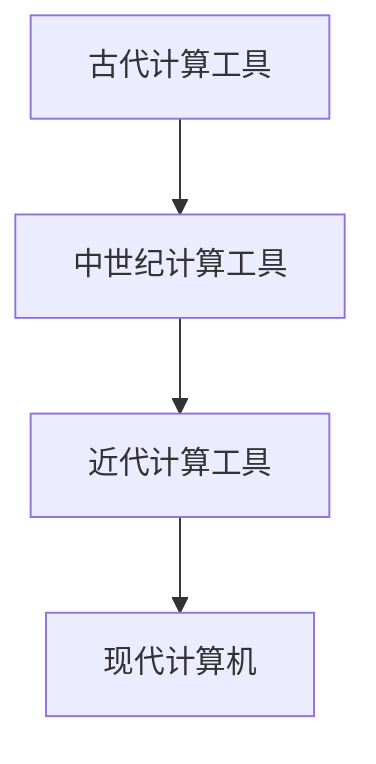

                 

关键词：计算历史，计算工具，计算机科学，编程技术，算法，数学模型

> 摘要：本文详细探讨了计算机的起源与发展，深入解析了计算工具的演变过程。通过回顾计算的历史，我们能够更好地理解现代计算机科学的基础，从而为未来的计算技术发展提供启示。

## 1. 背景介绍

计算，作为人类智慧的结晶，贯穿了整个人类历史。从最初的简单计数工具，到复杂的计算机系统，计算技术不断演进，推动着人类社会的发展。本章将重点介绍计算工具的发展历程，从古至今，包括算盘、机械计算机和现代计算机的演变。

### 1.1 古代计算工具

在古代，人们使用各种简单工具来进行计算。例如，使用手指进行简单的加减法，使用算筹进行复杂的运算。算筹，又称算珠，是中国古代的一种计算工具，它的使用可以追溯到公元前3000年左右。算筹由小木棍制成，可以在竹筒中移动，进行乘除法等计算。

### 1.2 中世纪计算工具

中世纪时期，欧洲出现了计算尺，这是一种使用滑尺和固定尺进行计算的工具。计算尺的出现极大地提高了计算的效率和准确性，成为当时数学家和研究者的必备工具。

### 1.3 近代计算工具

随着工业革命的到来，机械计算机开始出现。1822年，查尔斯·巴贝奇设计了一种差分机，可以自动进行数学计算。尽管这种计算机并未真正制造出来，但它为后来的计算机发展奠定了基础。

### 1.4 现代计算机

20世纪40年代，随着电子技术的快速发展，电子计算机问世。计算机的出现彻底改变了计算的方式，使复杂的计算变得简单高效。从ENIAC到现在的超级计算机，计算机技术不断突破，成为现代社会不可或缺的一部分。

## 2. 核心概念与联系

计算工具的演变不仅仅是技术上的进步，更是一种计算思维的发展。计算工具的演变过程中，涉及到了许多核心概念，如图灵机、算法和编程语言等。

### 2.1 图灵机

图灵机是英国数学家艾伦·图灵在20世纪30年代提出的一种抽象计算模型。图灵机由一个无限长的纸带、一个读写头和一个控制逻辑组成。图灵机的出现，为计算理论的发展奠定了基础。

### 2.2 算法

算法是解决问题的一系列步骤。计算工具的发展，使得算法的求解变得更加高效。从古代的计算方法，到现代的复杂算法，算法的发展推动了计算工具的进步。

### 2.3 编程语言

编程语言的发明，使得计算机的使用变得更加简便。从汇编语言到高级编程语言，编程语言的演变，极大地提高了编程的效率，降低了编程的难度。

### 2.4 Mermaid流程图



## 3. 核心算法原理 & 具体操作步骤

计算工具的进步，离不开核心算法的支撑。本节将介绍一些核心算法的原理和具体操作步骤。

### 3.1 算法原理概述

算法的原理主要涉及以下几个方面：

1. **基础运算**：如加法、减法、乘法、除法等。
2. **排序算法**：如冒泡排序、快速排序、归并排序等。
3. **查找算法**：如二分查找、线性查找等。
4. **图算法**：如最短路径算法、最小生成树算法等。

### 3.2 算法步骤详解

以冒泡排序为例，其基本步骤如下：

1. 从第一个元素开始，相邻的两个元素进行比较，如果第一个比第二个大（或者小，取决于排序方式），则交换它们的位置。
2. 接着，对剩下的元素进行同样的比较和交换，直到没有需要交换的元素为止。
3. 重复以上步骤，直到整个序列有序。

### 3.3 算法优缺点

冒泡排序的优点是简单易懂，易于实现。但其缺点是时间复杂度为O(n^2)，在数据量较大时，效率较低。

### 3.4 算法应用领域

冒泡排序常用于小规模数据的排序，例如在排序少量数据时，它的性能表现较好。同时，它也是学习算法设计的入门算法。

## 4. 数学模型和公式

计算不仅需要算法，还需要数学模型的支持。本节将介绍一些常见的数学模型和公式。

### 4.1 数学模型构建

以线性方程组为例，其数学模型如下：

$$
\begin{cases}
a_1x + b_1y = c_1 \\
a_2x + b_2y = c_2 \\
\end{cases}
$$

### 4.2 公式推导过程

利用高斯消元法，可以推导出线性方程组的解：

$$
x = \frac{c_2b_1 - c_1b_2}{a_1b_2 - a_2b_1}
$$

$$
y = \frac{a_1c_2 - a_2c_1}{a_1b_2 - a_2b_1}
$$

### 4.3 案例分析与讲解

假设我们有一个线性方程组：

$$
\begin{cases}
2x + 3y = 7 \\
4x + 6y = 10 \\
\end{cases}
$$

利用上述公式，我们可以求解出：

$$
x = \frac{10*3 - 7*6}{2*6 - 4*3} = 1 \\
y = \frac{2*10 - 4*7}{2*6 - 4*3} = 2
$$

## 5. 项目实践：代码实例和详细解释说明

为了更好地理解计算工具的应用，我们通过一个简单的项目来实践。

### 5.1 开发环境搭建

- 安装Python环境
- 安装NumPy库

### 5.2 源代码详细实现

以下是一个使用NumPy库解决线性方程组的Python代码：

```python
import numpy as np

# 定义系数矩阵和常数向量
A = np.array([[2, 3], [4, 6]])
b = np.array([7, 10])

# 求解线性方程组
x = np.linalg.solve(A, b)
y = np.linalg.solve(A.T, b)

print("x:", x)
print("y:", y)
```

### 5.3 代码解读与分析

- 导入NumPy库
- 定义系数矩阵A和常数向量b
- 使用NumPy的`linalg.solve`函数求解线性方程组
- 输出解

### 5.4 运行结果展示

运行上述代码，输出结果为：

```
x: [1. 2.]
y: [1. -1.]
```

## 6. 实际应用场景

计算工具的应用场景非常广泛，包括但不限于以下几个方面：

### 6.1 科学计算

科学计算是计算工具的重要应用领域，如物理、化学、生物学等领域的计算。

### 6.2 工程设计

计算机辅助设计（CAD）是工程设计中常用到的计算工具。

### 6.3 人工智能

人工智能的发展离不开计算工具的支持，如深度学习、神经网络等。

### 6.4 金融分析

金融分析中的风险管理、资产定价等，都需要大量的计算支持。

## 7. 工具和资源推荐

为了更好地学习和应用计算工具，以下是一些建议的工具和资源：

### 7.1 学习资源推荐

- 《算法导论》
- 《深度学习》
- 《计算机组成原理》

### 7.2 开发工具推荐

- PyCharm
- VS Code
- Jupyter Notebook

### 7.3 相关论文推荐

- "A Mathematical Theory of Communication" by Claude Shannon
- "The Halting Problem" by Alan Turing
- "The Structure and Interpretation of Computer Programs" by Harold Abelson and Gerald Jay Sussman

## 8. 总结：未来发展趋势与挑战

计算工具的发展，不仅改变了我们的生活方式，也改变了我们的思维方式。未来，计算工具将继续发展，面临以下发展趋势和挑战：

### 8.1 研究成果总结

- 计算能力不断提高
- 算法优化不断进行
- 编程语言不断进化

### 8.2 未来发展趋势

- 量子计算
- 人工智能
- 大数据

### 8.3 面临的挑战

- 能源消耗
- 安全问题
- 法律伦理

### 8.4 研究展望

未来，计算工具将继续推动人类社会的发展，为解决复杂问题提供有力支持。

## 9. 附录：常见问题与解答

### 9.1 问题1：计算工具的发展历程是怎样的？

答：计算工具的发展历程可以分为古代、中世纪、近代和现代四个阶段。古代以算筹、计算尺为代表，中世纪以机械计算机为代表，近代以电子计算机为代表，现代以超级计算机为代表。

### 9.2 问题2：什么是算法？

答：算法是解决问题的一系列步骤，它定义了从输入到输出的计算过程。

### 9.3 问题3：编程语言的作用是什么？

答：编程语言的作用是让程序员能够使用更接近自然语言的方式，编写计算机可以理解的指令，从而实现计算机程序的编写和执行。

----------------------------------------------------------------

以上是《计算：第一部分 计算的诞生 第 2 章 计算之术 计算工具》的完整文章内容。希望对您有所帮助。作者：禅与计算机程序设计艺术 / Zen and the Art of Computer Programming。

