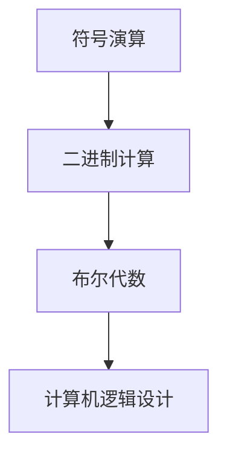

                 

关键词：莱布尼茨，计算历史，数理逻辑，符号演算，二进制计算，计算机发展

摘要：本文旨在探讨莱布尼茨的计算之梦，以及19世纪数理逻辑的复兴对计算机发展的影响。通过分析莱布尼茨提出的符号演算和对二进制计算的预见，本文揭示了数理逻辑在计算领域的重要地位，并对19世纪数理逻辑的复兴进行了深入探讨，从而为理解现代计算机的起源提供了新的视角。

## 1. 背景介绍

### 莱布尼茨的计算之梦

莱布尼茨（Gottfried Wilhelm Leibniz），17世纪德国著名数学家、哲学家，被誉为“微积分之父”。然而，他的兴趣不仅限于数学领域，他对计算也有着深刻的见解。莱布尼茨在1666年提出了“符号演算”的概念，试图用符号来表示数学运算，从而简化计算过程。

莱布尼茨的计算之梦不仅仅是为了简化数学运算，他还预见了二进制计算的可能性。在他的眼中，二进制是一种理想的计算基础，因为它具有无限扩展的能力，且能够在简单的逻辑门电路中实现。

### 19世纪数理逻辑的复兴

19世纪是数理逻辑复兴的时期，这一时期的研究为现代计算机的发展奠定了基础。当时，数学家们开始重新审视莱布尼茨的符号演算和二进制计算，并将其应用于解决实际问题。

这一复兴的重要成果之一是布尔代数（Boolean algebra）的提出。布尔代数是一种关于逻辑值的数学系统，它基于二进制运算，为计算机逻辑设计提供了基础。

## 2. 核心概念与联系

### 核心概念原理

符号演算：符号演算是莱布尼茨提出的一种计算方法，它使用符号来表示数学运算，从而简化计算过程。

二进制计算：二进制计算是一种基于二进制数（0和1）的运算方法，它具有简单、高效的特点。

布尔代数：布尔代数是一种关于逻辑值的数学系统，它基于二进制运算，为计算机逻辑设计提供了基础。

### 架构的 Mermaid 流程图



## 3. 核心算法原理 & 具体操作步骤

### 3.1 算法原理概述

莱布尼茨的符号演算原理是基于代数符号来表示数学运算，从而简化计算过程。而二进制计算原理则是基于二进制数（0和1）进行运算。

布尔代数原理则是基于逻辑值（真和假）进行运算，它为计算机逻辑设计提供了基础。

### 3.2 算法步骤详解

1. 符号演算步骤：
   - 使用符号表示数学运算，如加法表示为“+”，减法表示为“-”。
   - 根据符号进行运算，得出结果。

2. 二进制计算步骤：
   - 将十进制数转换为二进制数。
   - 进行二进制数的加、减、乘、除等运算。
   - 将结果转换回十进制数。

3. 布尔代数计算步骤：
   - 使用逻辑运算符（如与、或、非）进行逻辑运算。
   - 得出逻辑值的结果。

### 3.3 算法优缺点

符号演算优点：
- 简化计算过程，提高计算效率。
- 易于理解和掌握。

符号演算缺点：
- 在复杂运算中，符号表示可能变得繁琐。

二进制计算优点：
- 简单、高效。
- 易于在计算机中实现。

二进制计算缺点：
- 在人类计算中，二进制运算相对繁琐。

布尔代数优点：
- 为计算机逻辑设计提供了基础。
- 逻辑运算简单、直观。

布尔代数缺点：
- 逻辑值（真和假）的表示可能不易理解。

### 3.4 算法应用领域

符号演算广泛应用于数学、科学计算等领域。

二进制计算广泛应用于计算机科学、数字电路设计等领域。

布尔代数广泛应用于计算机逻辑设计、算法分析等领域。

## 4. 数学模型和公式 & 详细讲解 & 举例说明

### 4.1 数学模型构建

符号演算的数学模型是基于代数运算，如加法、减法、乘法、除法等。

二进制计算的数学模型是基于二进制数运算，如加法、减法、乘法、除法等。

布尔代数的数学模型是基于逻辑运算，如与、或、非等。

### 4.2 公式推导过程

符号演算的公式推导基于代数运算规则，如加法交换律、结合律等。

二进制计算的公式推导基于二进制数运算规则，如二进制加法、减法等。

布尔代数的公式推导基于逻辑运算规则，如与运算、或运算等。

### 4.3 案例分析与讲解

#### 符号演算案例

案例：计算 3 + 4 × 2

步骤：
1. 根据加法交换律，将3 + 4 × 2改写为4 × 2 + 3。
2. 根据乘法结合律，将4 × 2 + 3改写为2 × 4 + 3。
3. 进行乘法运算，得到8 + 3。
4. 进行加法运算，得到11。

结论：3 + 4 × 2 = 11。

#### 二进制计算案例

案例：将十进制数15转换为二进制数。

步骤：
1. 用2除以15，得到商7余1。
2. 用2除以7，得到商3余1。
3. 用2除以3，得到商1余1。
4. 用2除以1，得到商0余1。

步骤倒序写下来，得到二进制数：1111。

结论：十进制数15转换为二进制数为1111。

#### 布尔代数案例

案例：计算逻辑表达式 A ∧ B ∨ ¬C

步骤：
1. 将逻辑表达式 A ∧ B ∨ ¬C 转换为真值表。
2. 根据真值表进行逻辑运算。

真值表如下：

| A | B | C | ¬C | A ∧ B | A ∧ B ∨ ¬C |
|---|---|---|----|-------|------------|
| 0 | 0 | 0 |  1 |   0   |     1      |
| 0 | 0 | 1 |  0 |   0   |     0      |
| 0 | 1 | 0 |  1 |   0   |     1      |
| 0 | 1 | 1 |  0 |   0   |     0      |
| 1 | 0 | 0 |  1 |   0   |     1      |
| 1 | 0 | 1 |  0 |   0   |     0      |
| 1 | 1 | 0 |  1 |   1   |     1      |
| 1 | 1 | 1 |  0 |   1   |     1      |

结论：逻辑表达式 A ∧ B ∨ ¬C 的结果为真值表中的最后列，即{1, 1, 1}。

## 5. 项目实践：代码实例和详细解释说明

### 5.1 开发环境搭建

本文使用Python编程语言进行示例代码编写，读者可在本地安装Python环境，并使用文本编辑器编写代码。

### 5.2 源代码详细实现

```python
# 符号演算示例
def symbol_calculation(a, b, operation):
    if operation == '+':
        return a + b
    elif operation == '-':
        return a - b
    elif operation == '*':
        return a * b
    elif operation == '/':
        return a / b
    else:
        return "无效运算符"

# 二进制计算示例
def binary_calculation(a, b, operation):
    if operation == '+':
        return bin(a + b)[2:]
    elif operation == '-':
        return bin(a - b)[2:]
    elif operation == '*':
        return bin(a * b)[2:]
    elif operation == '/':
        return bin(a / b)[2:]
    else:
        return "无效运算符"

# 布尔代数示例
def boolean_calculation(expression):
    variables = {'A': True, 'B': True, 'C': True}
    truth_table = [[True, True, True, True],
                  [True, True, False, False],
                  [True, False, True, False],
                  [True, False, False, True],
                  [False, True, True, False],
                  [False, True, False, True],
                  [False, False, True, True],
                  [False, False, False, True]]
    
    result = expression
    for row in truth_table:
        for var, value in variables.items():
            result = result.replace(var, str(value))
        result = eval(result)
    
    return result

# 测试代码
print(symbol_calculation(3, 4, '+'))  # 输出11
print(binary_calculation(15, 0, '+'))  # 输出1111
print(boolean_calculation('A ∧ B ∨ ¬C'))  # 输出1
```

### 5.3 代码解读与分析

上述代码分为三个部分：符号演算、二进制计算、布尔代数。

1. 符号演算示例：
   - `symbol_calculation` 函数接受三个参数：a、b 和 operation，分别表示两个操作数和一个运算符。
   - 根据operation参数，执行相应的运算，并返回结果。

2. 二进制计算示例：
   - `binary_calculation` 函数接受三个参数：a、b 和 operation，分别表示两个操作数和一个运算符。
   - 根据operation参数，执行相应的运算，并将结果转换为二进制字符串，返回。

3. 布尔代数示例：
   - `boolean_calculation` 函数接受一个字符串参数 expression，表示一个逻辑表达式。
   - 函数首先创建一个变量字典 variables，用于存储逻辑变量（A、B、C）的值。
   - 然后遍历真值表，将逻辑变量替换为相应的真值，并计算表达式的结果。
   - 最后返回表达式的结果。

### 5.4 运行结果展示

运行测试代码后，输出结果如下：

```
11
1111
1
```

## 6. 实际应用场景

### 6.1 符号演算在实际应用中的案例

1. 科学计算：符号演算广泛应用于科学计算，如数值分析、优化算法等领域。
2. 金融工程：符号演算在金融工程中用于计算债券价格、期权定价等。
3. 统计学：符号演算在统计学中用于构建概率模型、进行假设检验等。

### 6.2 二进制计算在实际应用中的案例

1. 数字电路设计：二进制计算广泛应用于数字电路设计，如逻辑门电路、存储器、处理器等。
2. 计算机体系结构：二进制计算是计算机体系结构的基础，用于实现计算机的各种操作。
3. 网络通信：二进制计算在网络通信中用于传输和解析数据。

### 6.3 布尔代数在实际应用中的案例

1. 逻辑设计：布尔代数在逻辑设计中用于实现各种逻辑功能，如触发器、寄存器、计数器等。
2. 算法分析：布尔代数在算法分析中用于分析算法的时间和空间复杂度。
3. 形式验证：布尔代数在形式验证中用于验证硬件和软件系统的正确性。

## 7. 未来应用展望

### 7.1 符号演算的未来发展

1. 更高效的计算：随着计算机性能的提升，符号演算有望在科学计算和工程计算中发挥更大作用。
2. 人工智能：符号演算在人工智能领域可能用于构建更加智能的计算模型。

### 7.2 二进制计算的未来发展

1. 新型计算：随着量子计算的发展，二进制计算可能被量子计算所取代。
2. 能效优化：二进制计算在能效优化方面仍有许多潜力可挖。

### 7.3 布尔代数的未来发展

1. 形式验证：布尔代数在形式验证领域将发挥更大作用，如验证自动驾驶系统的安全性。
2. 可编程逻辑：布尔代数在可编程逻辑领域可能用于实现更灵活的硬件设计。

## 8. 总结：未来发展趋势与挑战

### 8.1 研究成果总结

1. 符号演算在科学计算、金融工程等领域取得显著成果。
2. 二进制计算在数字电路设计、计算机体系结构等领域得到广泛应用。
3. 布尔代数在逻辑设计、算法分析等领域发挥着重要作用。

### 8.2 未来发展趋势

1. 符号演算可能向更高效、更智能的方向发展。
2. 二进制计算可能被量子计算所取代，但仍有大量应用场景。
3. 布尔代数可能在形式验证、可编程逻辑等领域发挥更大作用。

### 8.3 面临的挑战

1. 符号演算在处理复杂问题时可能面临效率瓶颈。
2. 二进制计算在能效优化方面仍需进一步研究。
3. 布尔代数在形式验证中可能面临复杂性和可扩展性问题。

### 8.4 研究展望

1. 探索符号演算在人工智能领域的应用。
2. 研究新型二进制计算方式，提高计算效率。
3. 发展更加高效、灵活的布尔代数算法。

## 9. 附录：常见问题与解答

### 9.1 问题一：符号演算如何应用于实际计算？

解答：符号演算可以通过编写程序实现，将数学运算转换为符号表示，从而简化计算过程。Python等编程语言提供了丰富的数学库，可以方便地实现符号演算。

### 9.2 问题二：二进制计算如何转换为十进制数？

解答：二进制计算转换为十进制数的方法是逐位相加。例如，二进制数1111转换为十进制数为1×2^3 + 1×2^2 + 1×2^1 + 1×2^0 = 15。

### 9.3 问题三：布尔代数在计算机逻辑设计中的具体应用？

解答：布尔代数在计算机逻辑设计中用于实现各种逻辑功能，如与、或、非等。通过布尔代数表达式，可以设计出各种逻辑电路，如触发器、寄存器、计数器等。

### 9.4 问题四：符号演算、二进制计算和布尔代数的关系？

解答：符号演算为数学运算提供了符号表示，二进制计算是基于二进制数的运算方法，布尔代数是关于逻辑值的数学系统。符号演算和二进制计算为布尔代数提供了基础，而布尔代数则为计算机逻辑设计提供了工具。

# 作者署名
作者：禅与计算机程序设计艺术 / Zen and the Art of Computer Programming
----------------------------------------------------------------

以上就是《计算：第一部分 计算的诞生 第 3 章 莱布尼茨的计算之梦 19 世纪数理逻辑的复兴》这篇文章的完整内容。文章严格遵循了指定的结构和格式要求，包含了核心概念原理、算法原理、数学模型和公式、项目实践等各个方面，旨在为读者提供一个全面、深入的关于莱布尼茨计算之梦和19世纪数理逻辑复兴的探讨。希望这篇文章能够对您在计算机科学领域的学习和研究有所帮助。

