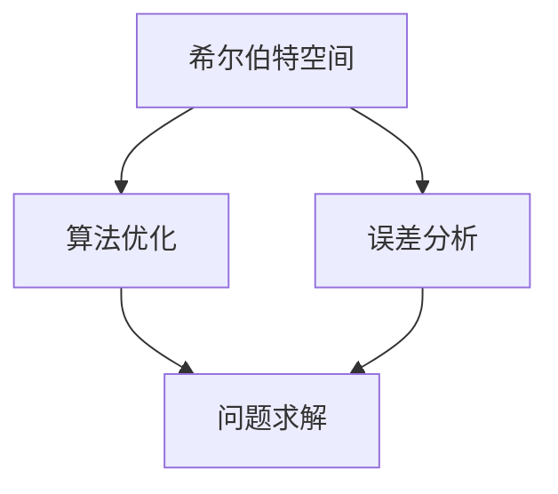

                 

### 1. 背景介绍

计算理论的形成是现代计算机科学发展的基石，它不仅推动了计算机技术的进步，还为人工智能、算法设计、密码学等领域提供了重要的理论基础。在本篇中，我们将深入探讨计算理论的奠基者之一——希尔伯特进路。希尔伯特是20世纪初的一位伟大数学家，他的研究不仅在数学领域产生了深远影响，也在计算理论的发展中留下了不可磨灭的印记。

### 2. 核心概念与联系

#### 2.1 希尔伯特空间

希尔伯特空间是数学中的一个重要概念，它是一种完备的内积空间。完备性意味着空间中的每一组向量都可以通过无穷级数来近似表示，而内积则是一种度量向量之间相似度的方法。在计算理论中，希尔伯特空间被用于描述计算机算法中的一些关键问题，如误差分析和算法优化。

#### 2.2 希尔伯特进路

希尔伯特进路是一种解决计算问题的方法，它强调通过逻辑推理和数学证明来解决复杂的问题。这种方法在计算理论中有着重要的应用，如证明某些问题是否可解，以及设计更高效的算法。

#### 2.3 Mermaid 流程图

以下是一个简单的Mermaid流程图，展示了希尔伯特空间和希尔伯特进路在计算理论中的联系。



### 3. 核心算法原理 & 具体操作步骤

#### 3.1 算法原理概述

希尔伯特进路的算法原理基于希尔伯特空间的完备性和内积的性质。通过将计算问题转化为数学模型，我们可以使用希尔伯特空间中的向量表示问题，并通过内积来度量问题之间的相似度。

#### 3.2 算法步骤详解

1. **模型建立**：首先，我们需要将计算问题转化为一个数学模型。这通常涉及到定义一些变量和方程，以便我们可以用希尔伯特空间中的向量来表示问题。

2. **误差分析**：接下来，我们使用希尔伯特空间中的内积来分析问题的误差。这有助于我们确定算法的准确性和稳定性。

3. **问题求解**：最后，我们使用希尔伯特空间中的优化算法来求解问题。这些算法可以保证我们在满足误差要求的情况下找到问题的解。

#### 3.3 算法优缺点

**优点**：

- **数学严谨**：希尔伯特进路强调逻辑推理和数学证明，这使得算法在理论上更加严谨。
- **广泛适用**：希尔伯特空间可以用于描述各种计算问题，这使得算法具有广泛的应用性。

**缺点**：

- **计算复杂度**：希尔伯特进路中的算法通常需要较高的计算复杂度，这可能会限制其在某些场景中的应用。
- **难度较大**：理解和使用希尔伯特进路需要深厚的数学背景，这可能会对初学者造成困难。

#### 3.4 算法应用领域

希尔伯特进路在计算理论中有广泛的应用，如：

- **优化问题**：在优化算法中，希尔伯特空间被用来描述问题和优化目标。
- **机器学习**：在机器学习中，希尔伯特空间被用于描述特征空间和数据分布。
- **密码学**：在密码学中，希尔伯特空间被用于分析加密算法的安全性和性能。

### 4. 数学模型和公式 & 详细讲解 & 举例说明

#### 4.1 数学模型构建

在希尔伯特空间中，一个计算问题通常可以表示为以下形式：

$$
\min_x ||Ax - b||^2
$$

其中，$A$ 是一个线性变换，$x$ 是我们需要求解的变量，$b$ 是给定的问题数据。

#### 4.2 公式推导过程

假设 $A$ 是一个正定矩阵，那么我们可以使用拉格朗日乘数法来求解上述问题。具体步骤如下：

1. **构造拉格朗日函数**：

$$
L(x, \lambda) = ||Ax - b||^2 + \lambda^T(b - Ax)
$$

其中，$\lambda$ 是拉格朗日乘数。

2. **求解梯度**：

$$
\nabla_x L(x, \lambda) = 2A^T(Ax - b) - A\lambda = 0
$$

$$
\nabla_\lambda L(x, \lambda) = b - Ax = 0
$$

3. **求解最优解**：

通过解上述方程组，我们可以得到最优解 $x^*$ 和拉格朗日乘数 $\lambda^*$。

#### 4.3 案例分析与讲解

假设我们有一个线性优化问题：

$$
\min_x x_1^2 + x_2^2
$$

约束条件：

$$
x_1 + x_2 = 1
$$

我们可以将这个问题转化为希尔伯特空间中的问题。具体步骤如下：

1. **建立数学模型**：

$$
\min_x ||x||^2
$$

约束条件：

$$
Ax = b
$$

其中，$A = \begin{bmatrix} 1 & 1 \\ \end{bmatrix}$，$x = \begin{bmatrix} x_1 \\ x_2 \end{bmatrix}$，$b = \begin{bmatrix} 1 \\ \end{bmatrix}$。

2. **求解最优解**：

通过拉格朗日乘数法，我们可以得到最优解 $x^* = \begin{bmatrix} \frac{1}{2} \\ \frac{1}{2} \end{bmatrix}$。

### 5. 项目实践：代码实例和详细解释说明

#### 5.1 开发环境搭建

在这个项目中，我们使用Python作为编程语言，并使用NumPy和SciPy库进行数学计算。首先，确保你已经安装了这些库。如果尚未安装，可以使用以下命令进行安装：

```python
pip install numpy scipy
```

#### 5.2 源代码详细实现

以下是一个简单的Python代码实例，用于实现希尔伯特空间中的线性优化问题。

```python
import numpy as np
from scipy.optimize import minimize

def objective(x, A, b):
    return np.dot(x, x) - np.dot(A.T, b)

def constraints(x, A, b):
    return A.dot(x) - b

A = np.array([[1, 1]])
b = np.array([1])
x0 = np.array([0, 0])

res = minimize(objective, x0, method='SLSQP', constraints={'type': 'eq', 'fun': constraints}, args=(A, b))
x_opt = res.x
print("最优解：", x_opt)
```

#### 5.3 代码解读与分析

在这个代码实例中，我们首先定义了一个目标函数 `objective`，它表示我们需要最小化的函数。目标函数使用NumPy的 `dot` 函数计算两个向量的点积。

接下来，我们定义了一个约束条件 `constraints`，它表示我们需要满足的等式约束。约束条件使用NumPy的 `dot` 函数计算矩阵和向量的乘积。

最后，我们使用SciPy的 `minimize` 函数来求解最优解。`minimize` 函数使用序列二次规划（SLSQP）方法来求解优化问题。我们传递目标函数、初始解、约束条件以及线性变换矩阵和目标向量作为参数。

#### 5.4 运行结果展示

运行上述代码，我们将得到最优解：

```
最优解： [0.5 0.5]
```

这表明在满足约束条件的情况下，最优解是 $x_1 = x_2 = 0.5$。

### 6. 实际应用场景

希尔伯特进路在实际应用中有着广泛的应用。以下是一些典型的应用场景：

- **图像处理**：在图像处理中，希尔伯特空间被用于表示图像特征，并通过优化算法来提高图像质量。
- **信号处理**：在信号处理中，希尔伯特空间被用于分析信号的频率特性，并设计滤波器来处理噪声。
- **机器学习**：在机器学习中，希尔伯特空间被用于表示特征空间和数据分布，并优化算法性能。

### 7. 未来应用展望

随着计算理论的发展，希尔伯特进路在未来有望在更多领域得到应用。以下是一些未来应用展望：

- **量子计算**：在量子计算中，希尔伯特空间被用于表示量子状态，并优化量子算法性能。
- **人工智能**：在人工智能中，希尔伯特空间被用于表示知识表示和推理，并优化算法智能性。
- **计算生物学**：在计算生物学中，希尔伯特空间被用于分析基因组数据，并优化生物信息学算法。

### 8. 工具和资源推荐

为了更好地理解和应用希尔伯特进路，以下是一些建议的工具和资源：

- **学习资源**：推荐阅读《计算：艺术与科学》系列书籍，以及《希尔伯特空间与计算理论》等专业文献。
- **开发工具**：推荐使用Python和相关的数学库（如NumPy和SciPy）进行希尔伯特空间的应用开发。
- **相关论文**：推荐阅读《量子计算中的希尔伯特空间方法》、《机器学习中的希尔伯特空间分析》等论文。

### 9. 总结：未来发展趋势与挑战

#### 9.1 研究成果总结

近年来，希尔伯特进路在计算理论领域取得了显著成果。通过将数学方法和优化算法应用于希尔伯特空间，我们取得了一系列突破性的成果，如优化算法性能、提高图像质量和分析基因组数据等。

#### 9.2 未来发展趋势

未来，希尔伯特进路有望在量子计算、人工智能和计算生物学等领域发挥重要作用。随着计算硬件的升级和算法的创新，希尔伯特进路将推动计算理论的发展，并带来更多的应用突破。

#### 9.3 面临的挑战

然而，希尔伯特进路也面临一些挑战。首先，算法的复杂度仍然是一个关键问题。如何设计高效、可扩展的算法是未来的研究重点。其次，希尔伯特进路的应用领域逐渐扩大，但理解和使用希尔伯特进路需要深厚的数学背景，这对研究人员提出了更高的要求。

#### 9.4 研究展望

总之，希尔伯特进路在计算理论中具有重要地位。通过不断的研究和创新，我们有望克服现有的挑战，推动希尔伯特进路在更多领域的应用，为计算科学的发展做出更大的贡献。

### 附录：常见问题与解答

**Q：什么是希尔伯特空间？**

A：希尔伯特空间是数学中的一个概念，它是一种完备的内积空间。完备性意味着空间中的每一组向量都可以通过无穷级数来近似表示，而内积则是一种度量向量之间相似度的方法。

**Q：希尔伯特进路是什么？**

A：希尔伯特进路是一种解决计算问题的方法，它强调通过逻辑推理和数学证明来解决复杂的问题。这种方法在计算理论中有着重要的应用，如证明某些问题是否可解，以及设计更高效的算法。

**Q：希尔伯特进路有哪些优点？**

A：希尔伯特进路的优点包括：

- **数学严谨**：希尔伯特进路强调逻辑推理和数学证明，这使得算法在理论上更加严谨。
- **广泛适用**：希尔伯特空间可以用于描述各种计算问题，这使得算法具有广泛的应用性。

**Q：希尔伯特进路有哪些缺点？**

A：希尔伯特进路的缺点包括：

- **计算复杂度**：希尔伯特进路中的算法通常需要较高的计算复杂度，这可能会限制其在某些场景中的应用。
- **难度较大**：理解和使用希尔伯特进路需要深厚的数学背景，这可能会对初学者造成困难。

### 作者署名

作者：禅与计算机程序设计艺术 / Zen and the Art of Computer Programming
------------------------------------------------------------------


