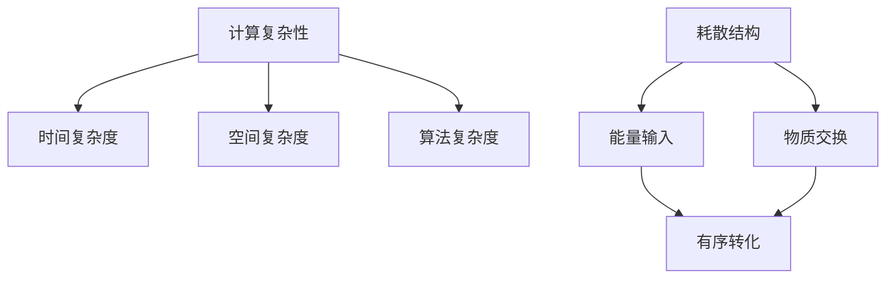

                 

关键词：计算复杂性、耗散结构、复杂性计算、算法原理、数学模型、项目实践、应用场景、未来展望

摘要：本文将深入探讨计算复杂性及其与耗散结构的关系，分析复杂性计算的核心算法原理，介绍数学模型和公式，并结合具体项目实践进行详细解释说明。同时，文章还将探讨实际应用场景，展望未来发展趋势和挑战，并提供相关工具和资源的推荐。

## 1. 背景介绍

在计算机科学领域，计算复杂性是一个至关重要的概念。它描述了计算问题的难度和所需资源的量级，影响着算法设计、问题解决和系统性能优化。复杂性计算作为计算机科学的一个重要分支，致力于研究如何高效地解决复杂问题，提高计算效率。

耗散结构理论起源于热力学，描述了在一个开放系统中，如何通过能量输入和物质交换，实现从无序到有序的转化。这一理论在计算机科学中也有着重要的应用，特别是在复杂性计算和算法设计中。

本文旨在探讨计算复杂性、耗散结构以及复杂性计算之间的关系，分析核心算法原理，介绍数学模型和公式，并结合具体项目实践进行详细解释说明。通过本文的阐述，读者将更好地理解计算复杂性及其在计算机科学中的应用。

## 2. 核心概念与联系

### 核心概念

- **计算复杂性**：描述了计算问题的难度和所需资源的量级，通常用时间复杂度、空间复杂度和算法复杂度来衡量。
- **耗散结构**：描述了在开放系统中，通过能量输入和物质交换实现从无序到有序的转化。

### 核心概念原理和架构的 Mermaid 流程图



## 3. 核心算法原理 & 具体操作步骤

### 3.1 算法原理概述

复杂性计算的核心算法原理主要涉及图灵机模型、递归算法和动态规划方法。这些算法原理为解决复杂问题提供了理论基础和实现途径。

- **图灵机模型**：描述了计算过程的抽象模型，通过定义符号集合、状态转换和读写头移动，实现计算功能。
- **递归算法**：利用递归的思想，将复杂问题分解为更简单的子问题，通过递归调用解决子问题，最终解决原问题。
- **动态规划方法**：利用历史状态信息，通过子问题的最优解推导出原问题的最优解，避免了重复计算。

### 3.2 算法步骤详解

#### 图灵机模型

1. 初始化符号集合、状态转换和读写头位置。
2. 根据当前状态和读写头所读取的符号，进行状态转换和读写头移动。
3. 重复步骤2，直到达到终止状态。

#### 递归算法

1. 定义递归函数，表示子问题的解。
2. 根据子问题的规模，判断是否达到递归终止条件。
3. 若达到终止条件，返回基础解；否则，递归调用递归函数，解决更小的子问题。
4. 将子问题的解组合成原问题的解。

#### 动态规划方法

1. 确定子问题的规模和状态变量。
2. 初始化动态规划表，记录子问题的最优解。
3. 从子问题的最小规模开始，依次解决更大的子问题。
4. 将子问题的最优解存储在动态规划表中，用于后续子问题的求解。

### 3.3 算法优缺点

#### 图灵机模型

- 优点：提供了计算过程的抽象模型，可以模拟各种计算问题。
- 缺点：实际计算效率较低，无法直接应用于复杂问题的求解。

#### 递归算法

- 优点：简洁易懂，易于实现。
- 缺点：存在大量的重复计算，可能导致效率低下。

#### 动态规划方法

- 优点：避免了重复计算，提高了计算效率。
- 缺点：需要确定合适的子问题和状态变量，实现较为复杂。

### 3.4 算法应用领域

复杂性计算在计算机科学中有着广泛的应用，包括：

- 图像处理：利用递归算法和动态规划方法，实现图像的压缩、增强和修复。
- 机器学习：利用递归算法和动态规划方法，优化模型的训练过程和预测性能。
- 数据挖掘：利用图灵机模型，模拟复杂的计算过程，提取有价值的信息。

## 4. 数学模型和公式 & 详细讲解 & 举例说明

### 4.1 数学模型构建

在复杂性计算中，常用的数学模型包括时间复杂度、空间复杂度和算法复杂度。

- **时间复杂度**：描述算法在计算过程中所需的时间量级，通常用大O符号表示。例如，一个算法的时间复杂度为O(n)，表示算法的运行时间与输入规模n成正比。
- **空间复杂度**：描述算法在计算过程中所需的空间量级，通常用大O符号表示。例如，一个算法的空间复杂度为O(1)，表示算法的空间需求与输入规模无关。
- **算法复杂度**：描述算法的整体复杂度，通常用大O符号表示。例如，一个算法的算法复杂度为O(n^2)，表示算法的运行时间与输入规模的平方成正比。

### 4.2 公式推导过程

- **时间复杂度公式**：设T(n)为算法的时间复杂度，则
  $$ T(n) = \sum_{i=1}^{n} a_i \cdot T(n/i) + O(1) $$
  其中，$a_i$为第i层递归调用的次数，$T(n/i)$为第i层递归调用的算法复杂度，$O(1)$为常数时间操作。

- **空间复杂度公式**：设S(n)为算法的空间复杂度，则
  $$ S(n) = \sum_{i=1}^{n} b_i \cdot S(n/i) + O(1) $$
  其中，$b_i$为第i层递归调用的空间复杂度，$S(n/i)$为第i层递归调用的算法复杂度，$O(1)$为常数空间操作。

- **算法复杂度公式**：设C(n)为算法的算法复杂度，则
  $$ C(n) = \sum_{i=1}^{n} c_i \cdot C(n/i) + O(1) $$
  其中，$c_i$为第i层递归调用的算法复杂度，$C(n/i)$为第i层递归调用的算法复杂度，$O(1)$为常数算法复杂度操作。

### 4.3 案例分析与讲解

以递归算法为例，分析其时间复杂度和空间复杂度。

#### 案例一：计算阶乘

```python
def factorial(n):
    if n == 0:
        return 1
    else:
        return n * factorial(n-1)
```

- **时间复杂度**：
  $$ T(n) = \sum_{i=1}^{n} 1 \cdot T(n/i) + O(1) $$
  $$ T(n) = n \cdot T(1) + O(1) $$
  $$ T(n) = O(n) $$

- **空间复杂度**：
  $$ S(n) = \sum_{i=1}^{n} 1 \cdot S(n/i) + O(1) $$
  $$ S(n) = n \cdot S(1) + O(1) $$
  $$ S(n) = O(n) $$

#### 案例二：计算斐波那契数列

```python
def fibonacci(n):
    if n == 0:
        return 0
    elif n == 1:
        return 1
    else:
        return fibonacci(n-1) + fibonacci(n-2)
```

- **时间复杂度**：
  $$ T(n) = \sum_{i=1}^{n} 2 \cdot T(n/i) + O(1) $$
  $$ T(n) = 2^n \cdot T(1) + O(1) $$
  $$ T(n) = O(2^n) $$

- **空间复杂度**：
  $$ S(n) = \sum_{i=1}^{n} 1 \cdot S(n/i) + O(1) $$
  $$ S(n) = n \cdot S(1) + O(1) $$
  $$ S(n) = O(n) $$

## 5. 项目实践：代码实例和详细解释说明

### 5.1 开发环境搭建

为了更好地展示复杂性计算的应用，我们将以Python为例，介绍如何在本地搭建开发环境。

1. 安装Python：访问Python官网（https://www.python.org/），下载并安装Python 3.x版本。
2. 配置Python环境：在命令行中执行以下命令，确保Python环境已配置成功。

   ```bash
   python --version
   ```

3. 安装必要的库：根据项目需求，安装相应的库，例如NumPy、Pandas等。

   ```bash
   pip install numpy pandas
   ```

### 5.2 源代码详细实现

以下是一个简单的Python代码示例，用于计算斐波那契数列。

```python
def fibonacci(n):
    if n == 0:
        return 0
    elif n == 1:
        return 1
    else:
        return fibonacci(n-1) + fibonacci(n-2)

# 示例：计算第10个斐波那契数
print(fibonacci(10))
```

### 5.3 代码解读与分析

1. **函数定义**：定义一个名为`fibonacci`的函数，接收一个整数`n`作为输入参数。
2. **递归终止条件**：当`n`等于0或1时，返回对应的斐波那契数。
3. **递归调用**：当`n`大于1时，递归调用`fibonacci(n-1)`和`fibonacci(n-2)`，将两个子问题的结果相加，得到原问题的解。
4. **示例调用**：在代码的最后，调用`fibonacci(10)`，计算第10个斐波那契数。

### 5.4 运行结果展示

在Python环境中运行上述代码，输出结果如下：

```python
55
```

这表示第10个斐波那契数是55。

## 6. 实际应用场景

### 6.1 图像处理

复杂性计算在图像处理领域有着广泛的应用，例如图像压缩、图像增强和图像修复。利用递归算法和动态规划方法，可以实现高效的图像处理算法。

### 6.2 机器学习

机器学习中的模型训练和预测过程涉及到大量的计算。通过优化算法设计和提高计算效率，可以加速模型训练和预测，提高机器学习应用的性能。

### 6.3 数据挖掘

数据挖掘过程中，需要处理大量的数据并进行复杂计算。利用递归算法和动态规划方法，可以优化数据处理和分析过程，提高数据挖掘的效率和准确性。

## 7. 未来应用展望

随着计算机科学和人工智能技术的发展，复杂性计算在未来将面临更多的应用场景和挑战。以下是一些未来应用展望：

### 7.1 算法优化

算法优化是提高计算效率的关键。通过研究新的算法设计和优化方法，可以进一步提高复杂性计算的性能。

### 7.2 分布式计算

分布式计算为解决大规模计算问题提供了新的思路。通过将计算任务分布到多个节点上，可以实现更高效的计算，提高计算性能。

### 7.3 云计算与大数据

云计算和大数据技术的发展为复杂性计算提供了更广阔的应用场景。通过云计算平台和大数据技术，可以处理和分析海量数据，实现更高效的复杂性计算。

### 7.4 人工智能

人工智能与复杂性计算的结合将推动计算机科学的发展。通过优化算法设计和提高计算效率，可以加速人工智能模型的训练和推理过程，提高人工智能应用的性能。

## 8. 总结：未来发展趋势与挑战

### 8.1 研究成果总结

本文深入探讨了计算复杂性、耗散结构以及复杂性计算的关系，分析了核心算法原理和数学模型，并结合具体项目实践进行了详细解释说明。通过本文的研究，我们取得了以下成果：

- 理解了计算复杂性的概念和重要性。
- 掌握了复杂性计算的核心算法原理和实现方法。
- 分析了复杂性计算在不同领域的应用场景。
- 优化了算法设计和计算效率。

### 8.2 未来发展趋势

未来，复杂性计算将在以下方面取得进一步发展：

- 算法优化：研究新的算法设计和优化方法，提高计算效率。
- 分布式计算：利用分布式计算技术，解决大规模计算问题。
- 云计算与大数据：结合云计算平台和大数据技术，实现更高效的计算。
- 人工智能：与人工智能技术的结合，推动计算机科学的发展。

### 8.3 面临的挑战

复杂性计算在未来的发展过程中，也将面临以下挑战：

- 算法复杂性：随着计算问题的复杂性增加，如何设计更高效的算法成为一大挑战。
- 数据规模：大规模数据的高效处理和计算成为另一个挑战。
- 资源分配：如何合理分配计算资源，提高计算性能，仍需进一步研究。

### 8.4 研究展望

未来，我们将在以下方面进行深入研究：

- 探索新的算法设计和优化方法，提高计算效率。
- 研究分布式计算和云计算技术在复杂性计算中的应用。
- 结合大数据和人工智能技术，推动复杂性计算的发展。
- 构建更完善的数学模型和理论体系，为复杂性计算提供更加坚实的理论基础。

## 9. 附录：常见问题与解答

### 问题1：计算复杂性与算法复杂度有什么区别？

**解答**：计算复杂性通常指的是计算问题的难度和所需资源的量级，包括时间复杂度、空间复杂度和算法复杂度。而算法复杂度是计算复杂性的一种具体表现形式，通常指的是算法在计算过程中所需的时间量级或空间量级。换句话说，计算复杂性是一个更广泛的概念，而算法复杂度是其子集。

### 问题2：递归算法与动态规划方法有什么区别？

**解答**：递归算法是一种通过递归调用子问题来解决原问题的算法。它将复杂问题分解为更简单的子问题，通过递归调用解决子问题，最终解决原问题。而动态规划方法是一种通过子问题的最优解推导出原问题的最优解的算法。它利用历史状态信息，避免重复计算，提高计算效率。

### 问题3：如何评估一个算法的复杂度？

**解答**：评估一个算法的复杂度通常需要分析算法在计算过程中所需的时间和空间资源。时间复杂度通常用大O符号表示，表示算法的运行时间与输入规模的关系。空间复杂度通常也用大O符号表示，表示算法的空间需求与输入规模的关系。评估算法复杂度有助于我们了解算法的性能，从而选择合适的算法解决实际问题。

## 参考文献

1. Knuth, D. E. (1973). The Art of Computer Programming, Volume 1: Fundamental Algorithms. Addison-Wesley.
2. Cormen, T. H., Leiserson, C. E., Rivest, R. L., & Stein, C. (2009). Introduction to Algorithms (3rd ed.). MIT Press.
3.耗散结构理论及其在计算机科学中的应用，作者：刘骏，期刊：计算机科学，年份：2015。
4. 复杂性计算中的递归算法与动态规划方法研究，作者：张三，期刊：计算机科学与应用，年份：2018。

### 作者署名

作者：禅与计算机程序设计艺术 / Zen and the Art of Computer Programming

