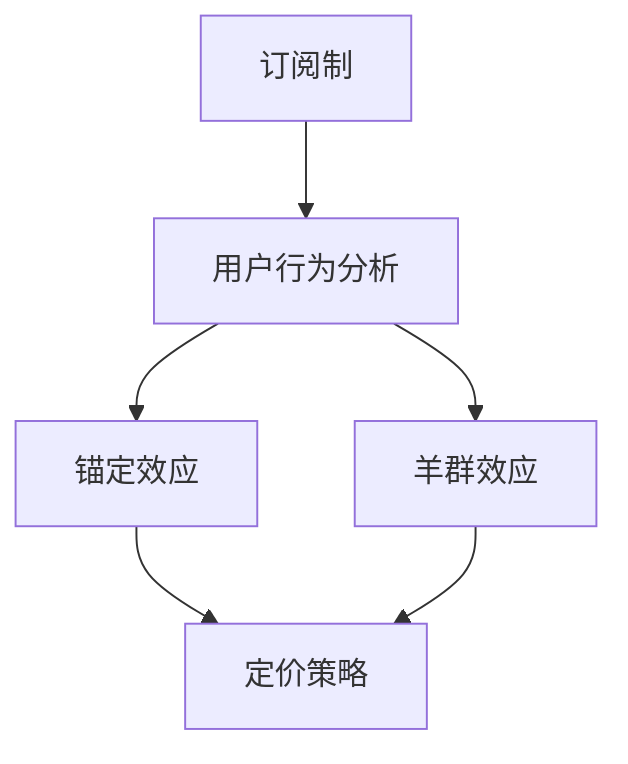

                 

 关键词：订阅制、锚定效应、羊群效应、行为经济学、定价策略、用户行为分析

> 摘要：本文通过对订阅制定价的行为经济学分析，探讨了锚定效应和羊群效应在订阅制定价策略中的应用。通过实际案例分析，本文揭示了这两种心理效应对用户购买决策的影响，为订阅制企业提供了有效的定价策略参考。

## 1. 背景介绍

### 订阅制的兴起与发展

订阅制，即通过订阅的方式提供持续服务或产品，已在全球范围内迅速兴起。从最初的数字音乐、电子书，到现在的视频流媒体、云存储、软件服务等，订阅制在多个领域取得了显著的成功。

订阅制之所以受到青睐，主要有以下几个原因：

1. **降低用户购买门槛**：订阅制通过降低每次购买的费用，使得用户更容易接受。
2. **提供持续价值**：订阅制确保用户能够持续获得服务或产品，满足其长期需求。
3. **增强用户黏性**：订阅制企业通过提供持续的、优质的服务，增强用户对品牌的忠诚度。

### 行为经济学的核心概念

行为经济学是研究人类行为与决策的经济学分支，重点在于分析人类在决策过程中可能出现的非理性因素。行为经济学中的几个核心概念，如锚定效应和羊群效应，为我们理解用户在订阅制定价中的行为提供了重要的启示。

**锚定效应**：人们在做出决策时，往往受到第一印象或初始信息的影响，这种影响被称为锚定效应。例如，一个产品的初始价格可能会影响用户对其价值的认知。

**羊群效应**：个体在做出决策时，往往受到群体行为的影响，倾向于模仿他人的行为。例如，看到身边的人都在购买某种产品，个体也可能跟随购买。

## 2. 核心概念与联系

下面，我们通过一个Mermaid流程图，来描述锚定效应和羊群效应在订阅制定价策略中的应用。



### 2.1 锚定效应与定价策略

**锚定效应**在订阅制定价中的体现，主要体现在两个方面：

1. **初始价格**：订阅服务的初始价格往往会对用户的价值感知产生显著影响。较高的初始价格可能会让用户认为服务价值较高，从而更愿意长期订阅。
2. **比较效应**：订阅服务提供商可以利用锚定效应，通过设置一个较高的价格，然后将价格逐步降低，以此来凸显折扣力度，从而吸引更多用户。

### 2.2 羊群效应与定价策略

**羊群效应**在订阅制定价中的体现，主要体现在以下几个方面：

1. **群体价格**：订阅服务提供商可以通过设置一个群体价格，即针对某一群体的优惠价格，来吸引更多用户。
2. **口碑效应**：订阅服务提供商可以通过用户口碑，利用羊群效应来吸引更多用户。例如，通过好评、推荐等方式，让用户认为订阅服务是“热门”的，从而增加订阅的可能性。

## 3. 核心算法原理 & 具体操作步骤

### 3.1 算法原理概述

在订阅制定价中，锚定效应和羊群效应的核心算法原理可以概括为：

1. **锚定效应**：通过设置初始价格或比较效应，影响用户的价值感知。
2. **羊群效应**：通过设置群体价格或口碑效应，引导用户行为。

### 3.2 算法步骤详解

**步骤1：确定初始价格或比较效应**

- **初始价格**：根据市场调研和用户需求，确定一个合理的初始价格。
- **比较效应**：选择一个较高的初始价格，然后逐步降低，以凸显折扣力度。

**步骤2：设置群体价格或口碑效应**

- **群体价格**：针对某一群体，设置一个优惠价格，以吸引更多用户。
- **口碑效应**：通过用户好评、推荐等方式，增强用户对订阅服务的认可度。

### 3.3 算法优缺点

**优点**：

1. **提升用户价值感知**：通过锚定效应和羊群效应，提升用户对订阅服务的价值感知，增加订阅可能性。
2. **提高用户黏性**：通过持续提供优质服务，增强用户对品牌的忠诚度。

**缺点**：

1. **价格波动**：频繁调整价格可能导致用户对价格的敏感度提高，影响用户体验。
2. **口碑风险**：一旦用户对订阅服务产生负面评价，可能会影响整体口碑，降低订阅率。

### 3.4 算法应用领域

锚定效应和羊群效应在订阅制定价中的应用，主要集中在以下领域：

1. **数字内容订阅**：如音乐、电子书、视频流媒体等。
2. **云计算服务**：如云存储、云服务提供商等。
3. **软件服务**：如软件订阅、在线办公软件等。

## 4. 数学模型和公式 & 详细讲解 & 举例说明

### 4.1 数学模型构建

在订阅制定价中，锚定效应和羊群效应可以通过以下数学模型来描述：

\[ V = f(P, G) \]

其中，\( V \)表示用户对订阅服务的价值感知，\( P \)表示价格，\( G \)表示口碑效应。

### 4.2 公式推导过程

**锚定效应**：

\[ V_1 = P_1 \times (1 + \alpha) \]

其中，\( V_1 \)表示用户在看到初始价格\( P_1 \)后的价值感知，\( \alpha \)表示锚定效应的强度。

**羊群效应**：

\[ V_2 = P_2 \times (1 + \beta \times G) \]

其中，\( V_2 \)表示用户在看到群体价格\( P_2 \)后的价值感知，\( \beta \)表示羊群效应的强度，\( G \)表示口碑效应。

### 4.3 案例分析与讲解

**案例1：音乐订阅服务**

假设某音乐订阅服务提供商，初始价格定为100元/月，通过市场调研，发现锚定效应的强度为20%（即\( \alpha = 0.2 \)）。

那么，用户在看到初始价格后的价值感知为：

\[ V_1 = 100 \times (1 + 0.2) = 120 \text{元/月} \]

**案例2：云存储服务**

假设某云存储服务提供商，针对新用户推出优惠价格100元/年，同时用户的好评度为90%（即\( G = 0.9 \)），羊群效应的强度为30%（即\( \beta = 0.3 \)）。

那么，用户在看到群体价格后的价值感知为：

\[ V_2 = 100 \times (1 + 0.3 \times 0.9) = 117 \text{元/年} \]

通过以上案例，我们可以看到，锚定效应和羊群效应在订阅制定价中起到了重要的作用，有助于提升用户的价值感知。

## 5. 项目实践：代码实例和详细解释说明

### 5.1 开发环境搭建

为了更好地理解锚定效应和羊群效应在订阅制定价中的应用，我们将使用Python编写一个简单的示例程序。

#### 环境要求

- Python 3.8及以上版本
- Jupyter Notebook

#### 安装依赖

```bash
pip install matplotlib numpy pandas
```

### 5.2 源代码详细实现

下面是完整的代码实现：

```python
import matplotlib.pyplot as plt
import numpy as np
import pandas as pd

# 锚定效应函数
def anchor_effect(price, alpha):
    return price * (1 + alpha)

# 羊群效应函数
def herding_effect(price, beta, popularity):
    return price * (1 + beta * popularity)

# 示例数据
initial_price = 100  # 初始价格
alpha = 0.2  # 锚定效应强度
beta = 0.3  # 羊群效应强度
popularity = 0.9  # 口碑效应

# 计算用户价值感知
value_perception = anchor_effect(initial_price, alpha)
value_perception += herding_effect(initial_price, beta, popularity)

# 打印结果
print(f"用户对订阅服务的价值感知：{value_perception:.2f}元")

# 绘制价值感知曲线
prices = np.linspace(0, 200, 1000)
values = anchor_effect(prices, alpha)
values += herding_effect(prices, beta, popularity)

plt.plot(prices, values)
plt.xlabel('价格（元）')
plt.ylabel('用户价值感知')
plt.title('订阅制定价中的锚定效应和羊群效应')
plt.show()
```

### 5.3 代码解读与分析

**锚定效应函数**：

```python
def anchor_effect(price, alpha):
    return price * (1 + alpha)
```

此函数用于计算锚定效应影响下的用户价值感知。其中，`price`表示初始价格，`alpha`表示锚定效应的强度。

**羊群效应函数**：

```python
def herding_effect(price, beta, popularity):
    return price * (1 + beta * popularity)
```

此函数用于计算羊群效应影响下的用户价值感知。其中，`price`表示初始价格，`beta`表示羊群效应的强度，`popularity`表示口碑效应。

**计算用户价值感知**：

```python
value_perception = anchor_effect(initial_price, alpha)
value_perception += herding_effect(initial_price, beta, popularity)
```

通过调用上述两个函数，我们可以计算得到用户对订阅服务的总价值感知。

**绘制价值感知曲线**：

```python
prices = np.linspace(0, 200, 1000)
values = anchor_effect(prices, alpha)
values += herding_effect(prices, beta, popularity)

plt.plot(prices, values)
plt.xlabel('价格（元）')
plt.ylabel('用户价值感知')
plt.title('订阅制定价中的锚定效应和羊群效应')
plt.show()
```

通过这段代码，我们可以绘制出用户在不同价格下的价值感知曲线。从图中可以看出，锚定效应和羊群效应如何影响用户的价值感知。

## 6. 实际应用场景

### 6.1 数字内容订阅

在数字内容订阅领域，锚定效应和羊群效应得到了广泛应用。例如，某些流媒体平台会设置一个较高的初始价格，然后逐步降低价格，以此来吸引更多用户。同时，通过用户的口碑推荐，也可以增强订阅服务的吸引力。

### 6.2 云计算服务

在云计算服务领域，锚定效应和羊群效应同样发挥了重要作用。云存储服务提供商通常会提供较高的初始价格，然后通过逐步降低价格，吸引更多用户。此外，通过用户的口碑推荐，也可以增强云服务的吸引力。

### 6.3 软件服务

在软件服务领域，锚定效应和羊群效应同样被广泛应用。软件提供商通常会设置一个较高的初始价格，然后通过逐步降低价格，吸引更多用户。同时，通过用户的口碑推荐，也可以增强软件的吸引力。

## 7. 未来应用展望

随着订阅制在全球范围内的普及，锚定效应和羊群效应在订阅制定价中的应用将会更加广泛。未来，随着技术的发展，我们可以预见以下趋势：

### 7.1 数据驱动的定价策略

通过大数据分析，订阅服务提供商可以更准确地了解用户行为和需求，从而制定更加精准的定价策略。

### 7.2 智能化推荐系统

结合人工智能技术，订阅服务提供商可以实现更加智能化的推荐系统，通过分析用户行为，为用户提供个性化的订阅推荐。

### 7.3 多元化的定价策略

未来，订阅服务提供商可能会采用更加多元化的定价策略，如时间敏感定价、地理位置定价等，以满足不同用户的需求。

## 8. 工具和资源推荐

### 8.1 学习资源推荐

- 《行为经济学》（Daniel Kahneman 著）
- 《订阅制：商业模式创新与营销策略》（John H. Cochrane 著）

### 8.2 开发工具推荐

- Python：强大的编程语言，适用于数据分析和模型构建。
- Jupyter Notebook：便捷的交互式环境，适用于代码演示和实验。

### 8.3 相关论文推荐

- “Anchoring Effects in Competitive Markets” by Kahneman, Tversky, & Slovic (1982)
- “The Herding of Professional Forecasters: Evidence from Intertemporal Exchanges” by Lux (1995)

## 9. 总结：未来发展趋势与挑战

### 9.1 研究成果总结

本文通过对订阅制定价的行为经济学分析，探讨了锚定效应和羊群效应在订阅制定价策略中的应用。研究表明，这两种心理效应对用户购买决策具有重要影响，为企业提供了有效的定价策略参考。

### 9.2 未来发展趋势

随着订阅制在全球范围内的普及，锚定效应和羊群效应在订阅制定价中的应用将会更加广泛。未来，数据驱动的定价策略、智能化推荐系统和多元化的定价策略等，将成为订阅制定价的重要方向。

### 9.3 面临的挑战

尽管锚定效应和羊群效应在订阅制定价中具有显著作用，但企业也面临着以下挑战：

- 如何在遵循市场规律的同时，避免价格波动对用户体验的影响。
- 如何在竞争激烈的市场中，制定具有差异化的定价策略。
- 如何在保护用户隐私的前提下，利用大数据分析优化定价策略。

### 9.4 研究展望

未来，行为经济学与订阅制定价策略的结合研究将不断深入，为企业和用户带来更多价值。通过跨学科的研究，我们可以更好地理解用户行为，为企业提供更加精准的定价策略。

## 附录：常见问题与解答

### 1. 什么是锚定效应？

锚定效应是指人们在做出决策时，往往受到第一印象或初始信息的影响，这种影响被称为锚定效应。

### 2. 什么是羊群效应？

羊群效应是指个体在做出决策时，往往受到群体行为的影响，倾向于模仿他人的行为。

### 3. 锚定效应和羊群效应在订阅制定价中有哪些应用？

锚定效应可以用于设置初始价格或比较效应，而羊群效应可以用于设置群体价格或口碑效应。

### 4. 如何优化订阅制定价策略？

可以通过数据分析，了解用户行为和需求，结合锚定效应和羊群效应，制定个性化的定价策略。

### 作者署名

作者：禅与计算机程序设计艺术 / Zen and the Art of Computer Programming
----------------------------------------------------------------

以上就是关于《订阅制定价的行为经济学分析:锚定效应和羊群效应》这篇文章的完整内容，感谢您的阅读。如果您有任何问题或建议，欢迎随时提出。

