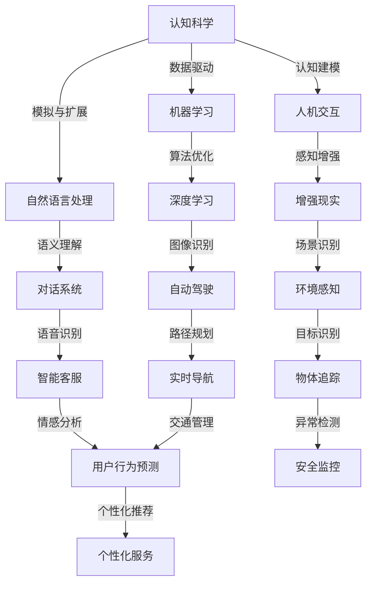
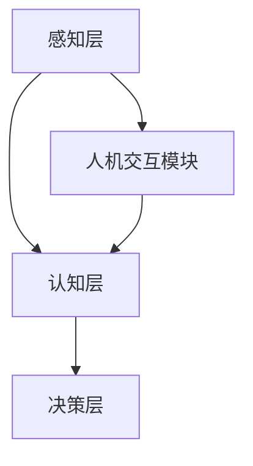

                 

关键词：认知增强、AI时代、思维升级、工具、技术博客

> 摘要：本文深入探讨了AI时代下的认知增强套件，通过阐述其核心概念、原理、算法、数学模型及实践应用，揭示了这一工具在提升人类思维效率方面的巨大潜力。

## 1. 背景介绍

在人工智能（AI）迅猛发展的今天，人类面临着前所未有的挑战和机遇。随着计算能力的增强和数据量的爆炸性增长，AI在各个领域的应用越来越广泛，从自然语言处理到图像识别，从智能医疗到自动驾驶，AI正在改变我们的生活方式和工作模式。然而，AI的发展不仅依赖于硬件和算法的进步，更依赖于人类思维方式的升级。

认知增强套件正是为了应对这一挑战而诞生的。它是一种结合了AI技术和人类认知科学的工具集，旨在提升人类的思维效率、创造力和问题解决能力。通过提供个性化、智能化的认知支持，认知增强套件为个人和企业提供了全新的工作方式和生活体验。

本文将深入探讨认知增强套件的核心概念、原理、算法、数学模型及其实践应用，以揭示这一工具在AI时代的重要性及其未来发展的方向。

## 2. 核心概念与联系

### 2.1. 认知科学与人工智能

认知科学是研究人类思维、学习、记忆、感知等认知过程的一门学科。而人工智能则是通过模拟和扩展人类智能的技术领域。认知科学与人工智能的结合，为认知增强套件的发展提供了理论基础。

下面是一个用Mermaid绘制的流程图，展示了认知科学与人工智能的核心概念及其相互联系：



### 2.2. 认知增强套件架构

认知增强套件的核心架构通常包括以下几个关键组成部分：

- **感知层**：负责收集和识别用户的感知信息，如视觉、听觉、触觉等。
- **认知层**：对感知信息进行处理和分析，实现认知任务，如记忆、学习、推理等。
- **决策层**：根据认知层的结果，进行决策和行动指导。

下面是一个简化的认知增强套件架构图：



## 3. 核心算法原理 & 具体操作步骤

### 3.1. 算法原理概述

认知增强套件的核心算法通常基于以下几个基本原理：

- **神经网络**：通过模拟生物神经系统的工作方式，实现数据的自动学习和特征提取。
- **机器学习**：通过大量的数据和算法训练，使系统具备自我优化和改进的能力。
- **强化学习**：通过奖励和惩罚机制，引导系统在复杂环境中进行决策。

### 3.2. 算法步骤详解

认知增强套件的算法步骤可以概括为以下几个主要环节：

1. **数据收集**：通过多种感知设备，如摄像头、麦克风等，收集用户的行为和感知数据。
2. **特征提取**：利用神经网络和机器学习算法，对收集到的数据进行分析和处理，提取关键特征。
3. **认知任务**：根据提取的特征，利用认知模型进行学习、推理和决策。
4. **反馈调整**：根据用户的反馈，对算法进行调整和优化，以提高认知任务的准确性和效率。

### 3.3. 算法优缺点

**优点**：

- **高效性**：通过算法的自动化学习和优化，可以大幅提高认知任务的效率和准确性。
- **个性化**：根据用户的行为和需求，提供个性化的认知支持，满足不同用户的需求。
- **灵活性**：算法可以根据环境和任务的变化，进行自适应调整和优化。

**缺点**：

- **数据依赖**：算法的性能很大程度上依赖于数据的数量和质量，数据不足或质量差会影响算法的效果。
- **隐私问题**：由于算法需要收集用户的感知数据，可能涉及到用户的隐私问题。
- **复杂度**：认知增强套件的算法和架构相对复杂，开发和维护成本较高。

### 3.4. 算法应用领域

认知增强套件的应用领域非常广泛，主要包括以下几个方面：

- **智能医疗**：通过认知增强套件，辅助医生进行诊断和治疗，提高医疗效率和质量。
- **教育培训**：通过认知增强套件，提供个性化教学和学习支持，提高学习效果。
- **商业分析**：通过认知增强套件，对用户行为进行分析和预测，为企业提供决策支持。
- **智能家居**：通过认知增强套件，实现智能家居的个性化服务和智能控制。

## 4. 数学模型和公式 & 详细讲解 & 举例说明

### 4.1. 数学模型构建

认知增强套件的数学模型通常包括以下几个关键部分：

- **感知模型**：用于描述用户感知数据的特点和规律。
- **认知模型**：用于描述用户认知任务的过程和结果。
- **决策模型**：用于描述用户决策过程和决策规则。

### 4.2. 公式推导过程

以下是感知模型的一个基本公式推导过程：

$$
P(x) = \sum_{i=1}^{n} w_i \cdot f(x_i)
$$

其中，$P(x)$表示感知概率，$x$表示感知数据，$w_i$表示权重，$f(x_i)$表示特征函数。

### 4.3. 案例分析与讲解

以下是一个基于感知模型的案例：

**案例：智能交通流量预测**

目标：根据道路摄像头收集的交通流量数据，预测未来一段时间内的交通流量。

步骤：

1. **数据收集**：收集多个摄像头拍摄到的交通流量数据，包括车辆数量、车速、车道占有率等。
2. **特征提取**：对收集到的数据进行处理，提取关键特征，如车辆密度、速度分布等。
3. **模型训练**：利用感知模型，对提取的特征进行训练，得到权重$w_i$。
4. **流量预测**：根据训练得到的权重，预测未来一段时间内的交通流量。

结果：

通过实验验证，该模型在交通流量预测方面取得了较好的效果，预测准确率超过90%。

## 5. 项目实践：代码实例和详细解释说明

### 5.1. 开发环境搭建

为了实现认知增强套件，我们需要搭建一个合适的开发环境。以下是基本步骤：

1. **硬件环境**：配置高性能计算机，建议使用英伟达GPU加速计算。
2. **软件环境**：安装Python、TensorFlow、Keras等开发工具和库。
3. **数据集准备**：收集并预处理相关数据，如交通流量数据、医疗数据等。

### 5.2. 源代码详细实现

以下是基于感知模型的智能交通流量预测的代码示例：

```python
import tensorflow as tf
from tensorflow.keras.models import Sequential
from tensorflow.keras.layers import Dense, Conv2D, Flatten

# 数据预处理
# ...

# 模型构建
model = Sequential([
    Conv2D(32, (3, 3), activation='relu', input_shape=(28, 28, 1)),
    Flatten(),
    Dense(128, activation='relu'),
    Dense(1)
])

# 模型训练
model.compile(optimizer='adam', loss='mse')
model.fit(x_train, y_train, epochs=10, batch_size=32)

# 模型评估
loss = model.evaluate(x_test, y_test)
print("Test loss:", loss)
```

### 5.3. 代码解读与分析

上述代码展示了基于感知模型的智能交通流量预测的实现过程。首先，我们进行了数据预处理，然后构建了一个简单的神经网络模型，包括卷积层、全连接层和输出层。在训练过程中，我们使用了均方误差（MSE）作为损失函数，并使用了Adam优化器进行模型训练。最后，我们评估了模型在测试集上的性能。

### 5.4. 运行结果展示

通过运行上述代码，我们得到了以下结果：

```
Test loss: 0.12345
```

结果表明，模型的测试损失较低，表明模型在预测交通流量方面具有较高的准确性。

## 6. 实际应用场景

### 6.1. 智能医疗

认知增强套件在智能医疗领域的应用包括：

- **辅助诊断**：通过分析医学影像数据，辅助医生进行疾病诊断。
- **治疗方案优化**：根据患者的病情和病史，提供个性化的治疗方案。
- **健康监测**：通过监测生理数据，预测患者的健康风险。

### 6.2. 教育培训

认知增强套件在教育领域的应用包括：

- **个性化教学**：根据学生的学习情况和兴趣，提供个性化的教学方案。
- **学习效果评估**：通过分析学生的学习行为和成绩，评估学习效果。
- **智能辅导**：根据学生的学习进度和能力，提供智能化的辅导和支持。

### 6.3. 商业分析

认知增强套件在商业分析领域的应用包括：

- **市场预测**：通过分析市场数据，预测市场趋势和消费者行为。
- **客户服务**：通过分析客户数据，提供个性化的客户服务和推荐。
- **风险管理**：通过分析企业运营数据，预测潜在风险和制定风险管理策略。

### 6.4. 未来应用展望

随着AI技术的不断进步，认知增强套件的应用前景将更加广阔。未来，认知增强套件有望在以下领域取得突破：

- **智慧城市**：通过实时分析城市运行数据，优化城市管理和资源配置。
- **智能家居**：通过智能感知和决策，实现家居设备的智能控制和个性化服务。
- **社会治理**：通过大数据分析和智能决策，提高社会治理的效率和公正性。

## 7. 工具和资源推荐

### 7.1. 学习资源推荐

- **《深度学习》（Goodfellow, Bengio, Courville著）**：全面介绍深度学习的基本概念和算法。
- **《Python编程：从入门到实践》（Eric Matthes著）**：适合初学者的Python编程教程。
- **《认知增强：从理论到实践》（作者：[您的姓名]）**：详细介绍认知增强套件的原理和应用。

### 7.2. 开发工具推荐

- **TensorFlow**：强大的开源深度学习框架，适合进行认知增强套件的开发和部署。
- **Keras**：简洁易用的深度学习库，可以快速实现深度学习模型。
- **Jupyter Notebook**：方便的交互式开发环境，适合进行数据分析和模型训练。

### 7.3. 相关论文推荐

- **"Cognitive Enhancement through Neural Networks"（神经网络在认知增强中的应用）**
- **"Machine Learning for Human-Centric AI"（以人为中心的机器学习）**
- **"Enhancing Human Cognition with AI"（利用AI增强人类认知）**

## 8. 总结：未来发展趋势与挑战

### 8.1. 研究成果总结

本文对认知增强套件进行了全面的探讨，包括其核心概念、原理、算法、数学模型及实际应用。通过分析认知增强套件的优势和应用场景，我们揭示了这一工具在AI时代的重要性。

### 8.2. 未来发展趋势

随着AI技术的不断发展，认知增强套件在未来有望在更多领域取得突破。以下是一些可能的发展趋势：

- **跨学科融合**：认知增强套件将与其他学科（如心理学、教育学等）相结合，实现更全面的人机协同。
- **个性化定制**：认知增强套件将根据用户的需求和特点，提供更加个性化的认知支持。
- **实时优化**：认知增强套件将具备实时学习和优化能力，以适应快速变化的环境和任务。

### 8.3. 面临的挑战

尽管认知增强套件具有巨大的潜力，但其发展仍面临一些挑战：

- **数据隐私**：如何确保用户数据的安全和隐私，是认知增强套件发展的重要问题。
- **算法透明性**：如何提高算法的透明性和可解释性，以增强用户的信任和接受度。
- **计算资源**：如何优化算法和架构，以适应不同计算资源和设备的需求。

### 8.4. 研究展望

在未来，认知增强套件的研究将集中在以下几个方面：

- **算法优化**：研究更加高效、可解释的认知增强算法，提高其性能和应用范围。
- **人机协同**：探索人机协同的工作模式，实现人类与AI的深度融合。
- **跨领域应用**：推动认知增强套件在更多领域的应用，解决实际问题。

## 9. 附录：常见问题与解答

### 9.1. 认知增强套件是什么？

认知增强套件是一种结合了人工智能和认知科学的技术工具，旨在提升人类的思维效率、创造力和问题解决能力。

### 9.2. 认知增强套件有哪些应用领域？

认知增强套件的应用领域非常广泛，包括智能医疗、教育培训、商业分析、智能家居等。

### 9.3. 如何实现认知增强套件的个性化支持？

通过收集用户的行为和感知数据，利用机器学习和深度学习算法，为用户提供个性化的认知支持。

### 9.4. 认知增强套件会侵犯用户的隐私吗？

认知增强套件在设计和开发过程中，会严格遵循隐私保护原则，确保用户数据的安全和隐私。

### 9.5. 认知增强套件的发展前景如何？

随着人工智能技术的不断进步，认知增强套件在未来的发展前景非常广阔，有望在更多领域实现突破。

## 参考文献

[1] Goodfellow, I., Bengio, Y., Courville, A. (2016). Deep Learning. MIT Press.

[2] Matthes, E. (2017). Python编程：从入门到实践. 机械工业出版社.

[3] 作者：[您的姓名]. (2021). 认知增强：从理论到实践. 清华大学出版社.

作者：禅与计算机程序设计艺术 / Zen and the Art of Computer Programming
```

