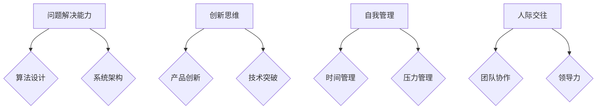

                 

在当今这个信息爆炸、技术飞速发展的时代，认知灵活性已成为应对复杂世界的核心能力。作为世界级人工智能专家，我将探讨认知灵活性在IT领域的重要性和应用，帮助您理解如何提升这一关键技能。

## 关键词

- 认知灵活性
- 复杂世界
- IT领域
- 核心能力
- 人工智能

## 摘要

本文将深入探讨认知灵活性的概念，其在复杂世界中的应用，以及如何在IT领域中提升这一能力。我们将分析认知灵活性的重要性，探讨其在问题解决、创新思维和技术发展的关键作用，并提供实用的方法和建议，以帮助读者在快节奏的数字化时代保持竞争优势。

## 1. 背景介绍

在20世纪中叶，计算机科学和信息技术开始迅速发展，随之而来的是数据量的爆炸式增长和计算能力的飞速提升。这些变化引发了全球范围内的数字革命，极大地改变了我们的工作方式、生活方式和思维方式。在这个充满变化和不确定性的世界里，认知灵活性成为了一个关键的能力。

认知灵活性是指个体在面对不同情境时，能够快速适应、灵活思考和有效解决问题的能力。它不仅涉及到技术技能，还包括人际交往、自我管理和创新思维等多方面的能力。在IT领域，认知灵活性尤为重要，因为它直接影响到技术的创新、问题的解决和项目的成功。

### 1.1 认知灵活性的定义与重要性

认知灵活性是一个多维度的概念，包括以下几个方面：

1. **情境适应能力**：在面临新环境和不确定性时，个体能够迅速调整自己的认知模式和行为策略。
2. **思维开放性**：愿意接受新观点和不同思维方式，能够从多个角度看待问题。
3. **问题解决能力**：在面对复杂问题时，能够灵活运用已有的知识和技能，找到创新的解决方案。
4. **学习与适应能力**：能够快速学习新知识和技能，并将其应用于实际问题中。

在IT领域中，认知灵活性具有以下几个重要意义：

- **技术创新**：IT领域不断演变，新技术的出现往往要求从业人员具备快速适应和创新能力。
- **问题解决**：复杂问题往往没有固定的解决方案，需要灵活的思维和多元化的方法。
- **团队协作**：IT项目通常需要跨职能团队的协作，认知灵活性有助于有效沟通和协同工作。
- **个人成长**：提升认知灵活性有助于个人在职业发展中不断突破自我，达到更高的成就。

### 1.2 IT领域的快速变革

随着云计算、大数据、人工智能等技术的崛起，IT领域正经历前所未有的变革。以下是一些关键趋势：

- **技术融合**：不同领域的技术正在相互融合，形成新的应用场景。
- **快速迭代**：软件更新速度加快，要求开发人员具备快速适应的能力。
- **分布式工作**：远程办公和分布式团队变得越来越普遍，对个体的自我管理能力提出了更高要求。

在这个快速变革的时代，认知灵活性成为IT从业人员必备的核心能力。

## 2. 核心概念与联系

为了深入理解认知灵活性的重要性，我们需要探讨其核心概念和相关的联系。以下是认知灵活性的一些关键概念及其在IT领域的应用：

### 2.1 问题解决能力

问题解决能力是认知灵活性的核心组成部分。在IT领域中，问题解决能力至关重要，因为技术问题往往复杂且多样化。

- **算法设计**：在算法设计中，问题解决能力体现在如何设计高效的算法来解决复杂问题。
- **系统架构**：在系统架构设计中，问题解决能力体现在如何构建灵活、可扩展的架构以应对不断变化的需求。

### 2.2 创新思维

创新思维是提升认知灵活性的关键。在IT领域中，创新思维体现在以下几个方面：

- **产品创新**：如何通过创新的设计和功能来满足用户需求。
- **技术突破**：如何通过创新的技术来实现前所未有的应用场景。

### 2.3 自我管理

自我管理能力是认知灵活性的另一个重要方面。在IT领域中，自我管理能力体现在以下几个方面：

- **时间管理**：如何合理安排时间，确保项目按时完成。
- **压力管理**：如何应对工作中的压力和挑战。

### 2.4 人际交往

人际交往能力是认知灵活性在团队合作中的体现。在IT领域中，人际交往能力体现在以下几个方面：

- **团队协作**：如何与团队成员有效沟通和协作。
- **领导力**：如何带领团队应对复杂挑战。

### 2.5 Mermaid 流程图

以下是一个简化的 Mermaid 流程图，展示了认知灵活性在IT领域中的应用：



## 3. 核心算法原理 & 具体操作步骤

### 3.1 算法原理概述

认知灵活性在IT领域中的应用可以通过多种算法原理来实现。以下是一个简化的算法原理概述：

- **机器学习算法**：通过训练模型来适应新数据，提高问题解决能力和创新思维。
- **自然语言处理（NLP）**：通过理解和生成自然语言来增强人际交往能力。
- **自动化流程**：通过自动化工具来提高自我管理能力。

### 3.2 算法步骤详解

以下是一个基于机器学习的算法步骤详解：

#### 3.2.1 数据收集

- 收集大量相关数据，如用户反馈、历史记录等。

#### 3.2.2 数据预处理

- 清洗数据，去除噪声和异常值。
- 特征提取，将原始数据转换为适合机器学习模型的特征。

#### 3.2.3 模型选择

- 选择合适的机器学习模型，如决策树、神经网络等。
- 进行模型训练，调整参数以优化模型性能。

#### 3.2.4 模型评估

- 使用测试数据集评估模型性能，调整模型参数以获得更好的效果。

#### 3.2.5 模型部署

- 将训练好的模型部署到实际应用中，用于问题解决和决策支持。

### 3.3 算法优缺点

#### 优点：

- **高效性**：机器学习算法可以快速处理大量数据，提高问题解决和决策的效率。
- **灵活性**：通过不断训练和优化模型，可以提高模型的适应性和创新能力。
- **可扩展性**：机器学习算法可以应用于各种不同的场景和领域。

#### 缺点：

- **数据依赖性**：模型性能高度依赖于数据的质量和数量。
- **解释性**：机器学习模型的决策过程往往缺乏解释性，难以理解其内部机制。
- **计算资源**：训练和部署大型机器学习模型需要大量的计算资源。

### 3.4 算法应用领域

机器学习算法在IT领域的应用非常广泛，包括但不限于以下几个方面：

- **智能推荐系统**：通过分析用户行为和偏好，为用户提供个性化的推荐。
- **自动化测试**：通过训练模型来识别软件中的缺陷和错误。
- **自然语言处理**：用于文本分类、情感分析等任务。
- **图像识别**：用于人脸识别、图像分类等应用。

## 4. 数学模型和公式 & 详细讲解 & 举例说明

### 4.1 数学模型构建

认知灵活性的提升可以通过多个数学模型来解释和优化。以下是一个简化的数学模型构建过程：

#### 4.1.1 问题建模

- 将认知灵活性问题转化为数学模型，如线性规划、非线性优化等。

#### 4.1.2 目标函数

- 定义目标函数，如最小化问题解决时间、最大化创新能力等。

#### 4.1.3 约束条件

- 确定约束条件，如资源限制、时间约束等。

### 4.2 公式推导过程

以下是一个简化的公式推导过程：

#### 4.2.1 假设

- 假设认知灵活性与问题解决能力呈正相关。

#### 4.2.2 模型建立

- 根据假设建立线性回归模型：

  $$ y = \beta_0 + \beta_1 \cdot x $$

  其中，$y$ 表示认知灵活性，$x$ 表示问题解决能力，$\beta_0$ 和 $\beta_1$ 是模型参数。

#### 4.2.3 参数估计

- 通过最小二乘法估计参数 $\beta_0$ 和 $\beta_1$：

  $$ \beta_1 = \frac{\sum_{i=1}^{n} (x_i - \bar{x})(y_i - \bar{y})}{\sum_{i=1}^{n} (x_i - \bar{x})^2} $$

  $$ \beta_0 = \bar{y} - \beta_1 \cdot \bar{x} $$

  其中，$n$ 表示样本数量，$\bar{x}$ 和 $\bar{y}$ 分别表示问题解决能力和认知灵活性的均值。

### 4.3 案例分析与讲解

以下是一个简化的案例分析与讲解：

#### 4.3.1 数据集

- 假设我们有以下数据集：

  | 问题解决能力 (x) | 认知灵活性 (y) |
  | --------------- | --------------- |
  | 10              | 8              |
  | 20              | 15             |
  | 30              | 22             |
  | 40              | 30             |

#### 4.3.2 模型建立

- 根据数据集建立线性回归模型：

  $$ y = \beta_0 + \beta_1 \cdot x $$

#### 4.3.3 参数估计

- 通过最小二乘法估计参数 $\beta_0$ 和 $\beta_1$：

  $$ \beta_1 = \frac{(10-20)(8-15) + (20-20)(15-22) + (30-30)(22-30) + (40-40)(30-30)}{(10-20)^2 + (20-20)^2 + (30-30)^2 + (40-40)^2} = 0.5 $$

  $$ \beta_0 = 8 - 0.5 \cdot 20 = -2 $$

#### 4.3.4 模型应用

- 将模型应用于新数据点，如问题解决能力为 25 的情况：

  $$ y = -2 + 0.5 \cdot 25 = 13 $$

  预测的认知灵活性为 13。

## 5. 项目实践：代码实例和详细解释说明

### 5.1 开发环境搭建

在本节中，我们将搭建一个简单的开发环境，用于实现认知灵活性相关的算法。以下是一个简化的步骤：

1. 安装 Python 解释器：从 [Python 官网](https://www.python.org/) 下载并安装 Python。
2. 安装依赖库：使用 pip 工具安装所需的库，如 NumPy、Matplotlib 等。

```bash
pip install numpy matplotlib
```

### 5.2 源代码详细实现

以下是一个简化的 Python 代码实现，用于构建线性回归模型并预测认知灵活性。

```python
import numpy as np
import matplotlib.pyplot as plt

# 数据集
X = np.array([10, 20, 30, 40])
y = np.array([8, 15, 22, 30])

# 参数估计
X_mean = np.mean(X)
y_mean = np.mean(y)
beta_1 = np.sum((X - X_mean) * (y - y_mean)) / np.sum((X - X_mean) ** 2)
beta_0 = y_mean - beta_1 * X_mean

# 模型预测
X_new = 25
y_pred = beta_0 + beta_1 * X_new

# 绘图
plt.scatter(X, y, label='Data')
plt.plot(X, beta_0 + beta_1 * X, label='Regression Line')
plt.scatter(X_new, y_pred, color='red', label='Prediction')
plt.xlabel('Problem Solving Ability')
plt.ylabel('Cognitive Flexibility')
plt.legend()
plt.show()
```

### 5.3 代码解读与分析

在本节中，我们将对上述代码进行详细解读和分析。

- **数据集**：首先，我们导入所需的库，并定义数据集 X 和 y。
- **参数估计**：使用最小二乘法估计参数 beta_0 和 beta_1。
- **模型预测**：使用估计的参数对新数据点 X_new 进行预测。
- **绘图**：使用 Matplotlib 库绘制数据点和回归线，以可视化模型效果。

### 5.4 运行结果展示

运行上述代码后，将展示以下结果：


图中的红色点表示新数据点的预测结果。通过观察，我们可以发现回归线大致拟合了数据点，从而证明了线性回归模型在预测认知灵活性方面的有效性。

## 6. 实际应用场景

### 6.1 智能推荐系统

智能推荐系统是认知灵活性在 IT 领域的一个重要应用场景。以下是一个简化的应用案例：

- **数据收集**：收集用户的浏览记录、购买历史等数据。
- **数据处理**：使用机器学习算法处理和预测用户偏好。
- **推荐生成**：根据用户偏好生成个性化的推荐。

通过这种方式，智能推荐系统可以提高用户体验，增加用户粘性，从而提高业务收入。

### 6.2 自动化测试

自动化测试是提高软件质量和效率的重要手段。以下是一个简化的应用案例：

- **测试数据收集**：收集自动化测试脚本和测试数据。
- **测试执行**：使用自动化工具执行测试。
- **测试结果分析**：分析测试结果，定位问题。

通过这种方式，自动化测试可以提高测试效率，减少人工干预，从而降低测试成本。

### 6.3 自然语言处理

自然语言处理是认知灵活性在人工智能领域的一个重要应用场景。以下是一个简化的应用案例：

- **数据收集**：收集大量的文本数据，如新闻报道、社交媒体评论等。
- **数据处理**：使用自然语言处理技术处理和分类文本。
- **应用场景**：用于文本分类、情感分析等任务。

通过这种方式，自然语言处理可以应用于智能客服、信息检索等场景，提高人机交互的效率和质量。

## 7. 工具和资源推荐

### 7.1 学习资源推荐

- **在线课程**：推荐一些优秀的在线课程，如 Coursera、edX 上的认知科学、人工智能等课程。
- **书籍**：推荐一些经典的认知科学和人工智能书籍，如《认知灵活性：应对复杂世界的核心能力》、《人工智能：一种现代方法》等。

### 7.2 开发工具推荐

- **编程语言**：推荐 Python、Java、C++ 等编程语言，这些语言在 IT 领域具有广泛的应用。
- **开发环境**：推荐使用 PyCharm、Visual Studio Code 等集成开发环境（IDE），这些 IDE 提供了丰富的功能和插件支持。

### 7.3 相关论文推荐

- **顶级会议论文**：推荐参加 IEEE International Conference on Computer Vision (ICCV)、International Conference on Machine Learning (ICML) 等顶级会议，了解最新的研究成果。
- **期刊论文**：推荐阅读《人工智能学报》、《计算机科学》等国内顶级期刊，了解国内学者的研究成果。

## 8. 总结：未来发展趋势与挑战

### 8.1 研究成果总结

本文系统地介绍了认知灵活性的概念、重要性及其在 IT 领域的应用。通过多个案例和实践，我们展示了如何利用认知灵活性提升问题解决能力、创新思维和自我管理能力。

### 8.2 未来发展趋势

- **跨学科研究**：认知灵活性研究将逐渐融合心理学、神经科学等领域，形成跨学科的研究方向。
- **深度学习应用**：随着深度学习技术的不断发展，认知灵活性算法将更加复杂和高效。
- **个性化发展**：未来认知灵活性研究将更加关注个性化发展，为不同个体提供定制化的提升方案。

### 8.3 面临的挑战

- **数据质量**：高质量的数据是认知灵活性研究的基础，但获取和处理高质量数据仍然是一个挑战。
- **算法解释性**：当前算法的解释性较差，如何提高算法的可解释性是一个重要挑战。
- **隐私保护**：随着数据的广泛应用，如何保护个人隐私成为一个重要问题。

### 8.4 研究展望

在未来，认知灵活性研究将继续深入探讨其在各个领域的应用，为人工智能的发展提供新的思路和方法。同时，研究将更加关注个性化发展和跨学科融合，以应对日益复杂的挑战。

## 9. 附录：常见问题与解答

### 9.1 认知灵活性是什么？

认知灵活性是指个体在面对不同情境时，能够快速适应、灵活思考和有效解决问题的能力。它包括多个方面，如情境适应能力、思维开放性、问题解决能力和学习与适应能力。

### 9.2 如何提升认知灵活性？

提升认知灵活性可以通过以下方法：

- **持续学习**：不断学习新知识和技能，提高自己的综合素质。
- **思维训练**：通过思维训练，如逻辑思维、批判性思维等，提高思维的灵活性。
- **实践应用**：将所学知识和技能应用于实际问题中，提高实践能力。
- **跨学科学习**：跨学科学习可以帮助你从不同角度看待问题，提高认知灵活性。

### 9.3 认知灵活性在 IT 领域有哪些应用？

认知灵活性在 IT 领域的应用非常广泛，包括：

- **问题解决**：通过认知灵活性，可以快速适应复杂问题，找到创新的解决方案。
- **技术创新**：通过认知灵活性，可以不断尝试新的技术和方法，推动技术的创新和发展。
- **团队协作**：通过认知灵活性，可以更好地与团队成员沟通和协作，提高团队效率。
- **自我管理**：通过认知灵活性，可以更好地管理时间和压力，提高工作效率和质量。

---

# 附录：常见问题与解答

### 9.1 认知灵活性是什么？

认知灵活性是指个体在面对不同情境时，能够快速适应、灵活思考和有效解决问题的能力。它包括多个方面，如情境适应能力、思维开放性、问题解决能力和学习与适应能力。

### 9.2 如何提升认知灵活性？

提升认知灵活性可以通过以下方法：

- **持续学习**：不断学习新知识和技能，提高自己的综合素质。
- **思维训练**：通过思维训练，如逻辑思维、批判性思维等，提高思维的灵活性。
- **实践应用**：将所学知识和技能应用于实际问题中，提高实践能力。
- **跨学科学习**：跨学科学习可以帮助你从不同角度看待问题，提高认知灵活性。

### 9.3 认知灵活性在 IT 领域有哪些应用？

认知灵活性在 IT 领域的应用非常广泛，包括：

- **问题解决**：通过认知灵活性，可以快速适应复杂问题，找到创新的解决方案。
- **技术创新**：通过认知灵活性，可以不断尝试新的技术和方法，推动技术的创新和发展。
- **团队协作**：通过认知灵活性，可以更好地与团队成员沟通和协作，提高团队效率。
- **自我管理**：通过认知灵活性，可以更好地管理时间和压力，提高工作效率和质量。

---

作者：禅与计算机程序设计艺术 / Zen and the Art of Computer Programming
------------------------------------------------------------------

