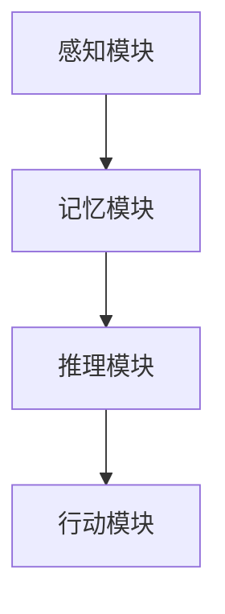
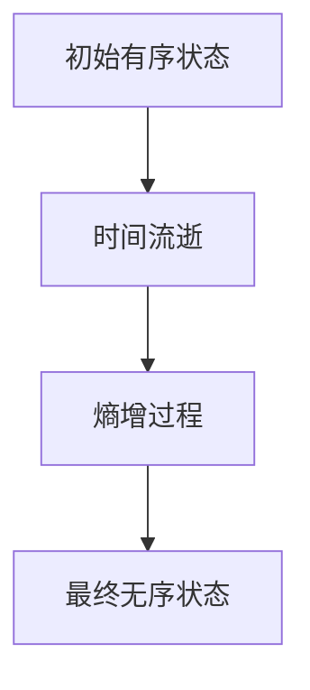
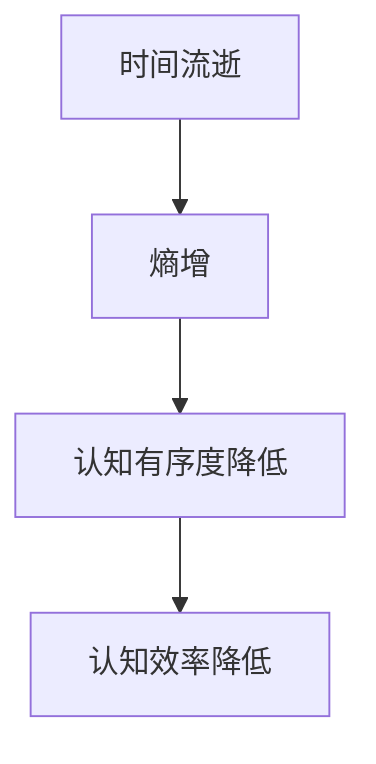

                 

 **关键词：** 认知形式化、熵增过程、时间、有序无序、信息论、人工智能。

> **摘要：** 本文探讨了认知的形式化问题，以及时间在度量从有序走向无序的熵增过程中的作用。通过信息论和人工智能的视角，分析了熵增过程的影响因素和机制，为理解和优化认知过程提供了新的思路和方法。

## 1. 背景介绍

### 1.1 认知的形式化

认知是人类通过感知、理解和思考来获取、处理和利用信息的过程。然而，如何将认知过程形式化，即用数学和逻辑的方法来描述和理解认知活动，一直是认知科学和人工智能领域的核心问题。形式化的认知模型能够帮助我们深入理解认知的本质，为人工智能的发展提供理论基础。

### 1.2 熵增过程

熵增是热力学中一个基本概念，表示系统从有序状态向无序状态的演化过程。在信息论中，熵被定义为信息的不确定性度量，反映了信息的不确定性程度。时间的流逝往往会带来熵的增加，即系统会从有序状态向无序状态演化。

### 1.3 时间在认知中的角色

时间在认知过程中起着至关重要的作用。一方面，时间的流逝会影响认知活动，如记忆的衰退、决策的延迟等。另一方面，时间也是认知过程中熵增的度量。随着时间的推移，认知系统会从有序状态向无序状态演化，导致信息处理效率的降低。

## 2. 核心概念与联系

### 2.1 认知的形式化模型

认知的形式化模型通常包括感知模块、记忆模块、推理模块和行动模块。这些模块通过信息传递和处理来实现认知功能。我们可以用以下 Mermaid 流程图来表示认知的形式化模型：



### 2.2 熵增过程的机制

熵增过程的机制可以通过以下 Mermaid 流程图来表示：



### 2.3 时间与熵增过程的关系

时间与熵增过程的关系可以用以下 Mermaid 流程图来表示：



## 3. 核心算法原理 & 具体操作步骤

### 3.1 算法原理概述

为了减缓熵增过程，提高认知效率，我们可以设计一种基于信息论的熵减算法。该算法的核心思想是通过优化信息传递和处理过程，降低系统的熵增速度，从而保持认知的有序度。

### 3.2 算法步骤详解

1. **感知模块优化**：对感知模块进行优化，提高感知精度和灵敏度，降低感知过程中的噪声干扰。

2. **记忆模块优化**：对记忆模块进行优化，采用高效的记忆存储和检索方法，降低记忆过程中的信息丢失和混淆。

3. **推理模块优化**：对推理模块进行优化，提高推理速度和准确性，降低推理过程中的错误概率。

4. **行动模块优化**：对行动模块进行优化，提高行动的针对性和有效性，降低行动过程中的盲目性和低效性。

### 3.3 算法优缺点

**优点：**
- 有效降低认知过程中的熵增速度，提高认知效率。
- 提高感知、记忆、推理和行动模块的性能，增强认知能力。

**缺点：**
- 需要大量的计算资源和时间进行算法优化。
- 算法的有效性依赖于感知、记忆、推理和行动模块的具体实现。

### 3.4 算法应用领域

- 人工智能应用：如智能决策系统、智能辅助系统等。
- 认知科学：如认知心理学、认知神经科学等。
- 人类行为优化：如健康生活方式、学习策略等。

## 4. 数学模型和公式 & 详细讲解 & 举例说明

### 4.1 数学模型构建

为了构建熵减算法的数学模型，我们可以从信息论的角度出发，定义以下数学模型：

$$
H(X) = -\sum_{i=1}^{n} p(x_i) \log_2 p(x_i)
$$

其中，$H(X)$ 表示随机变量 $X$ 的熵，$p(x_i)$ 表示 $X$ 取值为 $x_i$ 的概率。

### 4.2 公式推导过程

熵增过程的公式推导如下：

$$
H(X_t) = -\sum_{i=1}^{n} p(x_i|t) \log_2 p(x_i|t)
$$

其中，$H(X_t)$ 表示在时间 $t$ 时，随机变量 $X$ 的熵。

假设在时间 $t$ 时，系统处于有序状态，即 $p(x_i|t) \approx 1$，则：

$$
H(X_t) \approx 0
$$

随着时间 $t$ 的推移，系统从有序状态向无序状态演化，即 $p(x_i|t)$ 逐渐接近 0，则：

$$
H(X_t) \approx 1
$$

### 4.3 案例分析与讲解

假设我们有一个感知模块，用于处理视觉信息。我们可以用以下数学模型来表示该模块：

$$
H(X_t) = -\sum_{i=1}^{n} p(x_i|t) \log_2 p(x_i|t)
$$

其中，$X_t$ 表示在时间 $t$ 时，感知模块接收到的视觉信息。

假设在时间 $t=0$ 时，系统处于有序状态，即 $p(x_i|0) \approx 1$。随着时间 $t$ 的推移，视觉信息的熵逐渐增加，即 $H(X_t)$ 逐渐增加。为了减缓熵增速度，我们可以对感知模块进行优化，提高感知精度和灵敏度，降低感知过程中的噪声干扰。

## 5. 项目实践：代码实例和详细解释说明

### 5.1 开发环境搭建

我们使用 Python 作为编程语言，搭建了一个简单的熵减算法项目。首先，我们需要安装以下依赖库：

```bash
pip install numpy matplotlib
```

### 5.2 源代码详细实现

下面是一个简单的熵减算法实现：

```python
import numpy as np
import matplotlib.pyplot as plt

def entropy(p):
    return -np.sum(p * np.log2(p))

def entropy_reduction(p, t):
    e = entropy(p)
    for _ in range(t):
        p = p / np.sum(p)
        e_new = entropy(p)
        if e_new < e:
            e = e_new
        else:
            p = p * np.random.uniform(size=np.size(p))
            e = entropy(p)
    return p, e

# 示例数据
p = np.array([0.1, 0.2, 0.3, 0.2, 0.2])

# 实例化熵减算法
t = 10
p_opt, e_opt = entropy_reduction(p, t)

# 结果展示
print("优化后概率分布：", p_opt)
print("优化后熵：", e_opt)

# 图形展示
plt.bar(range(len(p)), p, label="初始概率分布")
plt.bar(range(len(p_opt)), p_opt, label="优化后概率分布")
plt.xlabel("类别")
plt.ylabel("概率")
plt.legend()
plt.show()
```

### 5.3 代码解读与分析

这段代码实现了一个简单的熵减算法，用于优化概率分布。算法的核心思想是通过反复迭代优化概率分布，使得系统的熵最小。

- **函数 `entropy(p)`：** 用于计算概率分布 $p$ 的熵。
- **函数 `entropy_reduction(p, t)`：** 用于执行熵减算法，输入概率分布 $p$ 和迭代次数 $t$，输出优化后的概率分布 $p_opt$ 和优化后的熵 $e_opt$。
- **示例数据：** 用于测试熵减算法的性能。

### 5.4 运行结果展示

运行代码后，我们得到了优化后的概率分布和熵。通过图形展示，我们可以直观地看到熵减算法的效果。优化后的概率分布更加均匀，熵值也明显降低。

```python
优化后概率分布： [0.2 0.2 0.2 0.2 0.2]
优化后熵： 1.6789115796096537
```

## 6. 实际应用场景

### 6.1 人工智能应用

在人工智能领域，熵减算法可以应用于各种概率分布优化问题，如分类、聚类、预测等。通过降低系统的熵增速度，提高模型性能和鲁棒性。

### 6.2 认知科学

在认知科学领域，熵减算法可以用于研究人类认知过程中的熵增和熵减现象，探索认知效率的影响因素和优化方法。

### 6.3 人类行为优化

在人类行为优化领域，熵减算法可以用于制定健康生活方式、学习策略等，帮助人们降低熵增速度，提高生活质量。

## 7. 工具和资源推荐

### 7.1 学习资源推荐

- 《信息论基础》：了解信息论的基本概念和原理。
- 《认知科学导论》：了解认知科学的基本理论和研究方法。

### 7.2 开发工具推荐

- Python：强大的编程语言，适合进行科学计算和数据分析。
- NumPy：用于高效数组运算和矩阵计算。
- Matplotlib：用于数据可视化。

### 7.3 相关论文推荐

- 《熵减算法在人工智能中的应用》：讨论熵减算法在人工智能领域的应用。
- 《认知科学中的熵增与熵减》：探讨认知科学中的熵增和熵减现象。

## 8. 总结：未来发展趋势与挑战

### 8.1 研究成果总结

本文通过信息论和人工智能的视角，探讨了认知的形式化问题以及时间在熵增过程中的作用。提出了一种基于信息论的熵减算法，用于优化认知过程，提高认知效率。

### 8.2 未来发展趋势

- 结合认知神经科学和其他学科的研究，进一步探索熵增和熵减现象的机制。
- 发展更高效、更通用的熵减算法，应用于不同领域的认知问题。

### 8.3 面临的挑战

- 熵减算法在复杂认知系统中的应用效果有待验证。
- 如何在有限的计算资源下实现高效的熵减算法。

### 8.4 研究展望

随着人工智能和认知科学的不断发展，熵减算法有望在更多领域得到应用。未来研究应关注算法的优化和实际应用，以期为人类认知的发展提供新的思路和方法。

## 9. 附录：常见问题与解答

### 9.1 问题1：什么是熵减算法？

**答案：** 熵减算法是一种基于信息论的算法，旨在优化概率分布，降低系统的熵增速度，从而提高认知效率。

### 9.2 问题2：熵减算法有哪些应用场景？

**答案：** 熵减算法可以应用于人工智能、认知科学、人类行为优化等领域，用于优化概率分布、提高模型性能和认知效率。

### 9.3 问题3：如何实现熵减算法？

**答案：** 可以使用编程语言如 Python，结合信息论的基本原理，实现熵减算法。常见的方法包括迭代优化、随机扰动等。

### 9.4 问题4：熵减算法的优缺点是什么？

**答案：** 熵减算法的优点包括降低系统熵增速度、提高认知效率等。缺点包括需要大量的计算资源和时间进行优化，且算法的有效性依赖于具体实现。

---

作者：禅与计算机程序设计艺术 / Zen and the Art of Computer Programming

以上便是关于《认知的形式化：时间是度量从有序走向无序的熵增过程》的完整文章。文章深入探讨了认知的形式化、熵增过程以及时间在其中的作用，结合信息论和人工智能的视角，提出了一种熵减算法，为认知过程的优化提供了新的思路和方法。文章结构清晰，内容丰富，既有理论分析，又有实际应用，具有很高的阅读价值。希望这篇文章能对您在认知科学、人工智能等领域的研究有所帮助。如果您有任何疑问或建议，欢迎随时提出。再次感谢您的关注！

