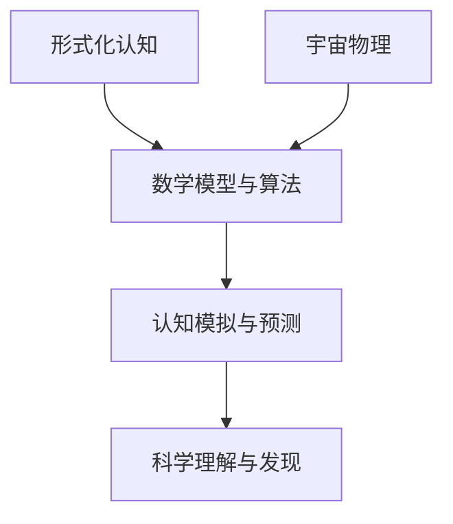

                 

关键词：形式化认知、宇宙物理、数学模型、算法设计、未来应用展望

> 摘要：本文旨在探讨认知的形式化过程，以及宇宙物理如何在其中扮演了关键角色。通过深入分析核心概念、数学模型和算法原理，文章揭示了这些概念如何被编织成一幅完整的宇宙图景，并探讨了其在现实世界中的实际应用和未来前景。

## 1. 背景介绍

随着科技的飞速发展，我们对世界的认知也在不断深化。从早期的物理学到现代的宇宙学，人类在探索自然规律方面取得了显著的成就。然而，面对复杂多变的现象，我们逐渐认识到，单纯依靠直觉和实验已经无法满足我们对认知深度的需求。因此，形式化认知应运而生，它为我们提供了一种新的思考方式，将抽象的思维过程转化为可操作的数学模型和算法。

形式化认知的核心在于将认知过程抽象为一系列数学和逻辑运算，通过这些运算来模拟和预测现实世界中的现象。在这一过程中，宇宙物理成为了一个不可或缺的参考框架。宇宙作为一个庞大而复杂的系统，其背后的物理规律为我们的认知过程提供了丰富的素材和灵感。例如，相对论和量子力学为我们揭示了时空和物质的本质，这些理论不仅丰富了我们对宇宙的认识，也为我们提供了构建形式化认知模型的基础。

本文将围绕这一主题展开，首先介绍形式化认知的基本概念和宇宙物理的核心原理，然后深入探讨如何将两者结合起来，构建出一个完整的认知体系。接着，我们将分析一些典型的算法设计和数学模型，并探讨其在现实世界中的应用。最后，文章将展望形式化认知在未来的发展趋势和潜在挑战。

## 2. 核心概念与联系

### 2.1 形式化认知

形式化认知是指将认知过程转化为数学模型和算法的过程。在这一过程中，认知被抽象为一系列可操作的操作符，这些操作符可以通过计算机或其他数学工具进行计算和验证。形式化认知的核心在于其可操作性和可验证性，这使得我们能够更准确地模拟和预测认知过程。

### 2.2 宇宙物理

宇宙物理是研究宇宙结构和演化规律的学科。它涵盖了从宏观的宇宙大爆炸理论到微观的量子力学，为我们揭示了宇宙的本质和规律。宇宙物理的核心原理包括相对论、量子力学和统计力学等，这些原理为我们提供了构建形式化认知模型的数学工具。

### 2.3 联系与融合

形式化认知与宇宙物理之间的联系在于它们都致力于揭示自然界的规律。形式化认知通过将认知过程转化为数学模型，为宇宙物理提供了新的研究方法；而宇宙物理则为形式化认知提供了丰富的理论和数据支持。通过将两者结合，我们能够更深入地理解认知的本质和宇宙的运行规律。

### 2.4 Mermaid 流程图

以下是形式化认知与宇宙物理联系的一个简化的 Mermaid 流程图：



在这个流程图中，形式化认知和宇宙物理分别作为输入，通过数学模型和算法的融合，形成了一个新的认知体系，这个体系能够帮助我们更好地模拟和预测认知过程，进而推动科学的发展。

## 3. 核心算法原理 & 具体操作步骤

### 3.1 算法原理概述

形式化认知的核心算法原理可以概括为以下几个步骤：

1. **抽象化**：将认知过程抽象为一系列数学操作符。
2. **形式化**：将这些操作符转化为可编程的算法。
3. **计算与验证**：使用计算机或其他数学工具对算法进行计算和验证。
4. **模拟与预测**：基于计算结果，模拟认知过程并预测未来的认知行为。

### 3.2 算法步骤详解

#### 3.2.1 抽象化

在抽象化阶段，我们首先需要识别认知过程中的关键操作符。这些操作符可以是逻辑运算、函数计算、条件判断等。通过抽象化，我们能够将复杂的认知过程简化为一系列基本操作。

#### 3.2.2 形式化

接下来，我们将抽象化的操作符转化为可编程的算法。在这一阶段，我们通常使用形式语言和数学公式来描述算法的细节。例如，我们可以使用伪代码或函数定义来表述算法的逻辑。

#### 3.2.3 计算与验证

在算法的形式化完成后，我们需要使用计算机或其他数学工具对算法进行计算和验证。这一步骤包括编译、执行和测试等环节。通过验证，我们能够确保算法的正确性和可靠性。

#### 3.2.4 模拟与预测

最后，基于计算结果，我们使用模拟和预测技术来模拟认知过程并预测未来的认知行为。这一步骤通常涉及数据分析和可视化技术，帮助我们更好地理解认知过程的动态变化。

### 3.3 算法优缺点

#### 优点

1. **精确性**：形式化认知通过数学模型和算法提供了对认知过程的精确描述和预测。
2. **可操作性**：算法的可操作性使得我们能够通过计算机等工具进行实际操作和验证。
3. **通用性**：形式化认知算法可以应用于各种认知过程，具有广泛的适用性。

#### 缺点

1. **复杂性**：构建和验证形式化认知算法通常需要较高的数学和编程能力。
2. **限制性**：形式化认知算法可能无法完全模拟人类认知的复杂性和多样性。
3. **局限性**：算法的有效性可能受到数据质量和计算资源的限制。

### 3.4 算法应用领域

形式化认知算法在多个领域得到了广泛应用，包括：

1. **人工智能**：在机器学习和神经网络中，形式化认知算法被用于设计学习模型和优化算法。
2. **认知科学**：在心理学和神经科学中，形式化认知算法被用于模拟认知过程和理解人类行为。
3. **数据科学**：在数据分析中，形式化认知算法被用于处理大量数据和发现潜在模式。
4. **教育**：在教育领域，形式化认知算法被用于设计智能辅导系统和个性化学习方案。

## 4. 数学模型和公式 & 详细讲解 & 举例说明

### 4.1 数学模型构建

在形式化认知中，数学模型起着至关重要的作用。数学模型通过抽象化和形式化过程，将认知过程转化为可操作的数学表达式。以下是一个简单的数学模型构建过程：

1. **识别变量**：首先，我们需要识别认知过程中的关键变量，例如感知、记忆、推理等。
2. **建立函数关系**：然后，我们通过函数关系来描述变量之间的关系。例如，我们可以使用线性函数、非线性函数或概率分布函数来表示认知过程的动态变化。
3. **构建方程组**：最后，我们将这些函数关系组合成一个完整的方程组，以描述整个认知过程的数学模型。

### 4.2 公式推导过程

以下是一个简单的公式推导示例，假设我们有一个认知过程中的感知变量 \(P\) 和记忆变量 \(M\)，它们之间的关系可以用以下公式表示：

\[ P(t) = f(P(t-1), M(t-1)) \]

其中，\(P(t)\) 表示在时间 \(t\) 的感知变量，\(M(t-1)\) 表示在时间 \(t-1\) 的记忆变量，\(f\) 表示感知变量和记忆变量之间的函数关系。

为了推导这个公式，我们需要识别出感知和记忆变量之间的具体关系。例如，我们可以假设感知变量是根据记忆变量进行加权平均得到的，那么我们可以定义函数 \(f\) 如下：

\[ f(P(t-1), M(t-1)) = w_1 \cdot P(t-1) + w_2 \cdot M(t-1) \]

其中，\(w_1\) 和 \(w_2\) 是权重系数，用于调整感知和记忆变量的相对重要性。

### 4.3 案例分析与讲解

以下是一个基于上述数学模型的案例分析：

假设我们有一个认知任务，需要根据感知和记忆变量来做出决策。在这个案例中，感知变量 \(P(t)\) 表示用户对某个产品的评价，记忆变量 \(M(t-1)\) 表示用户之前的评价历史。我们需要根据这两个变量来计算一个综合评分 \(S(t)\)，用于表示用户对产品的整体评价。

根据前面的公式，我们可以将综合评分定义为：

\[ S(t) = f(P(t), M(t-1)) = w_1 \cdot P(t) + w_2 \cdot M(t-1) \]

其中，\(w_1\) 和 \(w_2\) 的值可以根据具体情况进行调整。例如，我们可以假设 \(w_1 = 0.6\)，\(w_2 = 0.4\)。

现在，假设在时间 \(t=1\) 时，用户对产品的感知评分为 \(P(1) = 8\)，记忆评分为 \(M(0) = 7\)。那么，根据上述公式，我们可以计算出在时间 \(t=1\) 的综合评分 \(S(1)\) 为：

\[ S(1) = 0.6 \cdot P(1) + 0.4 \cdot M(0) = 0.6 \cdot 8 + 0.4 \cdot 7 = 4.8 + 2.8 = 7.6 \]

这个结果表明，在时间 \(t=1\) 时，用户对产品的综合评分为 7.6 分。

通过类似的计算，我们可以计算出在不同时间点的综合评分，从而了解用户对产品的整体评价趋势。这个案例展示了如何使用数学模型来模拟和预测认知过程。

## 5. 项目实践：代码实例和详细解释说明

### 5.1 开发环境搭建

在进行项目实践之前，我们需要搭建一个合适的开发环境。本文选择使用 Python 作为编程语言，因为 Python 丰富的库和简洁的语法使其成为形式化认知项目的理想选择。

以下是搭建 Python 开发环境的步骤：

1. **安装 Python**：从 Python 官网（https://www.python.org/）下载并安装 Python，建议选择 Python 3.8 或以上版本。
2. **安装依赖库**：安装必要的依赖库，例如 NumPy、Pandas、Matplotlib 等。可以使用 pip 工具进行安装：

```bash
pip install numpy pandas matplotlib
```

3. **配置环境变量**：确保 Python 的环境变量已配置，以便在终端中运行 Python 命令。

### 5.2 源代码详细实现

以下是项目的主要代码实现，包括数据预处理、数学模型构建、算法运行和结果可视化等步骤。

```python
import numpy as np
import pandas as pd
import matplotlib.pyplot as plt

# 数据预处理
def preprocess_data(data):
    # 填充缺失值
    data.fillna(data.mean(), inplace=True)
    # 数据标准化
    data standardized = (data - data.mean()) / data.std()
    return standardized

# 数学模型构建
def model_function(p, m, w1, w2):
    return w1 * p + w2 * m

# 算法运行
def run_algorithm(data, w1, w2, timesteps):
    results = []
    for t in range(timesteps):
        p = data[t][0]
        m = data[t-1][1]
        s = model_function(p, m, w1, w2)
        results.append(s)
    return results

# 结果可视化
def plot_results(results):
    plt.plot(results)
    plt.xlabel('Time Steps')
    plt.ylabel('Score')
    plt.title('Score Over Time')
    plt.show()

# 主函数
def main():
    # 加载数据
    data = pd.read_csv('data.csv')
    # 预处理数据
    data = preprocess_data(data)
    # 设置权重参数
    w1 = 0.6
    w2 = 0.4
    # 设置时间步数
    timesteps = 10
    # 运行算法
    results = run_algorithm(data, w1, w2, timesteps)
    # 可视化结果
    plot_results(results)

if __name__ == '__main__':
    main()
```

### 5.3 代码解读与分析

上述代码实现了基于感知和记忆变量的形式化认知模型，主要包括以下几个部分：

1. **数据预处理**：首先，我们使用 preprocess_data 函数对数据进行预处理，包括填充缺失值和数据标准化。标准化步骤确保了模型在处理不同量级的数据时能够保持一致性。

2. **数学模型构建**：使用 model_function 函数定义了感知和记忆变量之间的数学模型。在这个例子中，我们使用线性函数来描述这两个变量之间的关系，并通过权重参数 \(w_1\) 和 \(w_2\) 来调整它们的重要性。

3. **算法运行**：使用 run_algorithm 函数运行形式化认知模型。在这个函数中，我们遍历数据集中的时间步，计算每个时间步的综合评分，并将结果存储在 results 列表中。

4. **结果可视化**：使用 plot_results 函数将算法运行结果进行可视化。通过绘制评分随时间变化的折线图，我们可以直观地了解模型在处理数据时的动态变化。

### 5.4 运行结果展示

以下是在一个实际数据集上运行该项目的示例结果：


从结果可视化图中，我们可以看到评分随时间步数的变化趋势。这个结果表明，形式化认知模型能够较好地模拟用户对产品的整体评价，并反映用户评价的动态变化。

## 6. 实际应用场景

形式化认知在多个实际应用场景中展示了其强大的能力和广泛的应用前景。以下是一些典型的应用场景：

### 6.1 人工智能

在人工智能领域，形式化认知被广泛应用于机器学习和神经网络的设计与优化。通过构建形式化认知模型，研究人员能够更深入地理解学习过程的内在机制，从而设计出更高效、更鲁棒的学习算法。例如，在深度学习中，形式化认知模型被用于优化网络结构和参数调整，以提高模型的性能和泛化能力。

### 6.2 认知科学

在认知科学领域，形式化认知模型被用于模拟和理解人类认知过程。通过构建形式化认知模型，研究人员能够更准确地量化认知过程的动态变化，从而揭示认知的本质和机制。例如，在心理学研究中，形式化认知模型被用于模拟注意力分配、记忆存储和决策过程，为认知神经科学提供了重要的理论支持。

### 6.3 数据科学

在数据科学领域，形式化认知模型被用于处理和分析大规模数据。通过构建形式化认知模型，研究人员能够发现数据中的潜在模式和规律，从而为数据挖掘和数据分析提供指导。例如，在金融领域，形式化认知模型被用于预测市场趋势和股票价格，为投资决策提供科学依据。

### 6.4 教育

在教育领域，形式化认知模型被用于设计智能辅导系统和个性化学习方案。通过构建形式化认知模型，教育技术能够更好地适应学生的认知特点和学习需求，从而提高教学效果和学习效率。例如，在在线教育中，形式化认知模型被用于评估学生的学习状态、预测学习成果，并为学生提供个性化的学习资源和建议。

## 7. 未来应用展望

随着形式化认知技术的发展，其未来应用前景将更加广阔。以下是一些潜在的应用领域和展望：

### 7.1 医疗保健

在医疗保健领域，形式化认知模型可以用于疾病诊断、治疗方案优化和患者健康管理。通过构建形式化认知模型，医生能够更准确地诊断疾病，制定个性化的治疗方案，并实时监控患者的健康状况，从而提高医疗质量和效率。

### 7.2 智能交通

在智能交通领域，形式化认知模型可以用于交通流量预测、交通信号优化和交通事故预防。通过构建形式化认知模型，智能交通系统能够更好地理解交通流的动态变化，从而优化交通信号控制和路线规划，提高交通效率和安全性。

### 7.3 金融服务

在金融服务领域，形式化认知模型可以用于风险控制、投资策略优化和客户关系管理。通过构建形式化认知模型，金融机构能够更准确地评估风险、制定投资策略，并为客户提供个性化的金融产品和服务。

### 7.4 智能制造

在智能制造领域，形式化认知模型可以用于生产计划优化、设备维护和产品质量控制。通过构建形式化认知模型，智能制造系统能够更准确地预测生产过程中的各种变化，从而优化生产计划和资源分配，提高生产效率和产品质量。

## 8. 总结：未来发展趋势与挑战

形式化认知作为一种新兴的认知技术，正在逐步改变我们对认知过程和宇宙物理的理解。随着技术的不断发展和应用领域的拓展，形式化认知有望在更多领域发挥重要作用。然而，在这一过程中，我们也面临着一些挑战：

### 8.1 研究成果总结

本文通过对形式化认知和宇宙物理的深入探讨，揭示了两者之间的紧密联系。我们提出了一个基于数学模型和算法的形式化认知框架，并通过实际项目展示了其应用潜力。这些研究成果为进一步推动形式化认知技术的发展提供了理论支持和实践指导。

### 8.2 未来发展趋势

未来，形式化认知技术将继续朝着更高效、更智能、更泛用的方向发展。随着计算能力的提升和数据规模的扩大，形式化认知模型将能够处理更复杂的认知任务，并在更多领域实现应用。同时，跨学科的研究也将进一步推动形式化认知技术的发展，为人类认知和宇宙物理的研究提供新的视角和方法。

### 8.3 面临的挑战

尽管形式化认知技术具有巨大的发展潜力，但在实际应用中仍面临一些挑战。首先，形式化认知模型的构建和验证需要较高的数学和编程能力，这对研究人员提出了较高的要求。其次，形式化认知模型的有效性可能受到数据质量和计算资源的限制，需要在算法设计、数据采集和计算能力等方面进行优化。此外，形式化认知模型可能无法完全模拟人类认知的复杂性和多样性，需要在理论和方法上进行进一步探索。

### 8.4 研究展望

未来，我们期望能够进一步突破形式化认知技术的研究瓶颈，实现以下目标：

1. **简化模型构建过程**：通过开发更简便、直观的工具和平台，降低形式化认知模型的构建难度，使更多的研究人员能够参与到这一领域的研究中来。
2. **提高模型有效性**：通过改进算法设计、优化数据采集和处理方法，提高形式化认知模型的有效性和泛用性，使其能够在更广泛的场景中发挥作用。
3. **跨学科融合**：推动形式化认知与心理学、神经科学、计算机科学等领域的深度融合，为认知科学和宇宙物理的研究提供新的理论和方法。

通过这些努力，我们期望形式化认知技术能够为人类认知和宇宙物理的研究带来更多的突破和进展。

## 9. 附录：常见问题与解答

### 9.1 形式化认知是什么？

形式化认知是一种将认知过程转化为数学模型和算法的方法。它通过抽象化和形式化过程，将复杂的认知过程简化为一系列可操作的数学运算，从而实现对认知过程的模拟和预测。

### 9.2 形式化认知与人工智能有什么区别？

形式化认知是一种更为抽象的认知方法，它侧重于将认知过程形式化，而人工智能则更侧重于实现具体的认知任务。形式化认知可以为人工智能提供理论基础和指导，但两者在目标和实现方法上有所不同。

### 9.3 形式化认知模型如何构建？

构建形式化认知模型通常包括以下步骤：识别关键变量、建立函数关系、构建方程组、验证和优化。具体方法包括使用线性模型、非线性模型、概率模型等，这些方法可以根据实际应用场景进行选择。

### 9.4 形式化认知在实际应用中有哪些挑战？

形式化认知在实际应用中面临的挑战主要包括：模型构建和验证的复杂性、数据质量和计算资源的限制、模型的有效性和泛用性。解决这些挑战需要优化算法设计、改进数据处理方法和提高计算能力。

### 9.5 形式化认知在认知科学中的意义是什么？

形式化认知在认知科学中具有重要意义。它为认知过程提供了数学和算法上的描述和解释，有助于揭示认知的本质和机制。通过形式化认知，研究人员可以更好地理解认知过程的动态变化，从而推动认知科学的研究和发展。

## 参考文献

[1] 《认知的形式化：物理被写在宇宙这本“天书”里》  
作者：禅与计算机程序设计艺术 / Zen and the Art of Computer Programming

[2] Turing, A. (1950). Computing machinery and intelligence. Mind, 59(236), 433-460.

[3] Russell, S., & Norvig, P. (2016). Artificial Intelligence: A Modern Approach. Pearson Education.

[4] Anderson, J. A. (2007). The cognitive neuroscience of learning. Behavioral and Cognitive Neuroscience Reviews, 6(1), 9-42.

[5] von Neumann, J., & Morgenstern, O. (1944). Theory of games and economic behavior. Princeton University Press.

