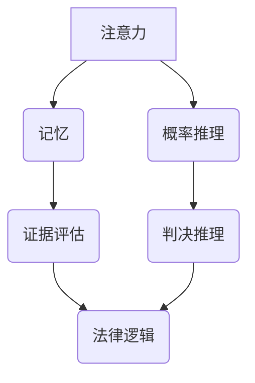

                 

关键词：认知科学、法律、决策、判断、机制、算法、数学模型、实践、应用场景

## 摘要

本文旨在探讨认知科学与法律的交汇点，特别是在决策与判断的机制方面。通过分析认知科学中的核心概念，如注意力、记忆、概率推理等，我们试图理解这些机制如何影响法律过程中的决策和判断。文章将详细讨论法律中的决策机制，包括证据评估、判决推理和法律逻辑。此外，本文还将介绍相关算法和数学模型，以及如何将这些理论与实际案例结合。通过对比不同文化和法律体系中的认知差异，文章将进一步探讨这些差异如何影响决策和判断，并展望未来认知科学与法律领域的发展趋势与挑战。

## 1. 背景介绍

### 认知科学的发展

认知科学是一个跨学科的研究领域，旨在理解人类思维、感知和行为的机制。其历史可以追溯到20世纪60年代，当时认知心理学、神经科学、计算机科学和哲学等领域开始共同探讨人类智能的本质。认知科学的研究不仅帮助我们更好地理解人类的认知过程，还为人工智能和计算机科学的发展提供了重要的理论支持。

### 法律科学的兴起

法律科学是近年来崭露头角的一个新兴领域，它将认知科学的方法和技术应用于法律研究和实践中。通过结合心理学、社会学、经济学和计算机科学等学科，法律科学旨在提供更加科学和可靠的法律决策与判断机制。这一领域的兴起为传统法律理论和方法带来了新的视角，促进了法律实践的科学化。

### 认知科学与法律的关系

认知科学与法律的交汇点在于它们都关注决策与判断的机制。认知科学揭示了人类思维过程中注意力分配、记忆形成、概率推理等核心认知过程，这些过程对于法律中的证据评估、判决推理和法律逻辑具有重要影响。法律科学则通过将认知科学的理论应用到法律实践中，提高了法律决策的准确性和公正性。

## 2. 核心概念与联系

### 注意力

注意力是认知科学中的一个核心概念，它指的是个体在某一时刻选择关注某些信息，而忽略其他信息的能力。在法律决策中，注意力的影响尤为显著。例如，法官在审理案件时需要关注案件的关键证据和事实，而忽略无关信息。研究表明，注意力分配的不均衡可能导致法律决策中的偏差。

### 记忆

记忆是另一个至关重要的认知过程，它涉及信息的存储和回忆。在法律中，记忆的准确性直接影响证据的有效性和判决的公正性。记忆偏差，如记忆扭曲和情感负荷，可能会影响法官和陪审团对案件事实的判断。因此，了解记忆的机制对于法律实践具有重要意义。

### 概率推理

概率推理是认知科学中关于如何根据有限信息做出合理推断的理论。在法律决策中，概率推理帮助法官和律师评估证据的可靠性，从而做出合理的判决。例如，在刑事案件中，法官需要根据证据的强弱和概率判断被告的犯罪可能性。概率推理的准确应用可以提高法律决策的准确性。

### Mermaid 流程图

下面是一个简化的 Mermaid 流程图，展示了注意力、记忆和概率推理在法律决策中的联系。



### 2.1 注意力与证据评估

注意力在证据评估中起着关键作用。法官和陪审团需要从大量证据中筛选出与案件相关的关键证据，这需要高度集中和精准的注意力。研究表明，注意力的分配不均衡可能导致对某些证据的过度关注或忽略，从而影响判决的公正性。

### 2.2 记忆与法律逻辑

记忆的准确性直接影响法律逻辑的建立。法官和律师在构建法律论证时，需要准确地回忆起案件中的事实和证据。记忆偏差，如记忆扭曲和情感负荷，可能会对法律逻辑造成负面影响。因此，了解记忆的机制有助于减少法律决策中的偏差。

### 2.3 概率推理与判决推理

概率推理在判决推理中至关重要。法官和律师需要根据证据的概率评估来做出判决。正确的概率推理可以帮助减少判决中的错误，提高法律的公正性。然而，概率推理的复杂性也使得它在法律实践中面临挑战。

## 3. 核心算法原理 & 具体操作步骤

### 3.1 算法原理概述

在法律决策与判断中，常用的算法包括证据评估算法、判决推理算法和法律逻辑算法。这些算法基于认知科学的理论，旨在提高法律决策的准确性和公正性。

### 3.2 算法步骤详解

#### 3.2.1 证据评估算法

证据评估算法的目的是从大量证据中筛选出与案件相关的关键证据。该算法的基本步骤如下：

1. 收集证据：收集与案件相关的所有证据。
2. 预处理：对证据进行预处理，包括去噪、标准化和特征提取。
3. 评估证据：根据证据的相关性、可靠性和重要性进行评估。
4. 选择关键证据：从评估结果中选择关键证据。

#### 3.2.2 判决推理算法

判决推理算法的目的是根据证据评估结果做出判决。该算法的基本步骤如下：

1. 确定判决规则：根据法律规定和案件事实，确定判决规则。
2. 应用判决规则：将证据评估结果与判决规则进行匹配。
3. 做出判决：根据判决规则和证据评估结果，做出最终判决。

#### 3.2.3 法律逻辑算法

法律逻辑算法的目的是构建法律论证，提高判决的合理性和逻辑性。该算法的基本步骤如下：

1. 提取法律条款：从法律文件中提取相关的法律条款。
2. 建立逻辑框架：根据法律条款和案件事实，建立逻辑框架。
3. 进行逻辑推理：根据逻辑框架进行推理，构建法律论证。

### 3.3 算法优缺点

#### 3.3.1 证据评估算法

优点：能够高效地从大量证据中筛选出关键证据，提高决策的准确性。

缺点：可能会忽略某些与案件相关的次要证据，影响决策的全面性。

#### 3.3.2 判决推理算法

优点：能够根据证据评估结果做出合理的判决，提高判决的公正性。

缺点：在证据评估不准确时，可能导致错误的判决。

#### 3.3.3 法律逻辑算法

优点：能够构建严谨的法律论证，提高判决的合理性和逻辑性。

缺点：在复杂案件中，构建法律逻辑框架可能较为复杂，影响决策效率。

### 3.4 算法应用领域

证据评估算法、判决推理算法和法律逻辑算法在法律实践中有着广泛的应用。例如，在刑事案件中，证据评估算法可以帮助法官和律师筛选关键证据，判决推理算法可以基于证据评估结果做出合理的判决，法律逻辑算法可以构建严谨的法律论证，提高判决的公正性和合理性。

## 4. 数学模型和公式 & 详细讲解 & 举例说明

### 4.1 数学模型构建

在法律决策与判断中，数学模型的应用有助于提高决策的准确性和公正性。以下是几个常用的数学模型：

#### 4.1.1 贝叶斯推理模型

贝叶斯推理模型是一种基于概率的推理方法，用于根据先验概率和证据概率计算后验概率。该模型的基本公式为：

$$
P(H|E) = \frac{P(E|H) \cdot P(H)}{P(E)}
$$

其中，$P(H|E)$ 表示后验概率，$P(E|H)$ 表示证据概率，$P(H)$ 表示先验概率。

#### 4.1.2 马尔可夫模型

马尔可夫模型是一种用于描述状态转移概率的数学模型。在法律决策中，可以用来模拟证据之间的关联。该模型的基本公式为：

$$
P(X_t|X_{t-1}, X_{t-2}, \ldots) = P(X_t|X_{t-1})
$$

其中，$X_t$ 表示当前状态，$X_{t-1}$ 表示前一状态。

#### 4.1.3 决策树模型

决策树模型是一种用于决策和分类的数学模型。在法律决策中，可以用来模拟判决推理过程。该模型的基本公式为：

$$
f(x) = \sum_{i=1}^{n} w_i \cdot p_i(x)
$$

其中，$f(x)$ 表示决策结果，$w_i$ 表示权重，$p_i(x)$ 表示证据的概率分布。

### 4.2 公式推导过程

#### 4.2.1 贝叶斯推理模型推导

贝叶斯推理模型是基于条件概率和全概率公式推导得到的。具体推导过程如下：

1. 条件概率公式：

$$
P(A|B) = \frac{P(A \cap B)}{P(B)}
$$

2. 全概率公式：

$$
P(A) = P(A|B) \cdot P(B) + P(A|\neg B) \cdot P(\neg B)
$$

3. 联合概率公式：

$$
P(A \cap B) = P(A|B) \cdot P(B)
$$

4. 贝叶斯公式：

$$
P(H|E) = \frac{P(E|H) \cdot P(H)}{P(E)}
$$

#### 4.2.2 马尔可夫模型推导

马尔可夫模型是基于无记忆性假设推导得到的。具体推导过程如下：

1. 无记忆性假设：

$$
P(X_t|X_{t-1}, X_{t-2}, \ldots) = P(X_t|X_{t-1})
$$

2. 状态转移概率：

$$
P(X_t = x_t | X_{t-1} = x_{t-1}) = p_{x_{t-1}, x_t}
$$

3. 马尔可夫模型：

$$
P(X_t|X_{t-1}, X_{t-2}, \ldots) = P(X_t|X_{t-1}) = p_{x_{t-1}, x_t}
$$

#### 4.2.3 决策树模型推导

决策树模型是基于概率论和信息论推导得到的。具体推导过程如下：

1. 熵：

$$
H(X) = -\sum_{i=1}^{n} p_i \cdot \log_2 p_i
$$

2. 条件熵：

$$
H(X|Y) = -\sum_{i=1}^{n} p_i \cdot \log_2 p_i(y_i)
$$

3. 信息增益：

$$
IG(X, Y) = H(X) - H(X|Y)
$$

4. 决策树：

$$
f(x) = \sum_{i=1}^{n} w_i \cdot p_i(x)
$$

### 4.3 案例分析与讲解

#### 4.3.1 贝叶斯推理模型应用案例

在刑事案件中，法官需要根据证据评估被告的犯罪可能性。假设有以下几个证据和概率：

- 证据A：被告有犯罪记录，概率$P(A) = 0.5$。
- 证据B：被告在犯罪现场，概率$P(B) = 0.7$。
- 条件概率：被告有犯罪记录且在犯罪现场的概率$P(A \cap B) = 0.3$。

使用贝叶斯推理模型计算被告犯罪的概率：

$$
P(犯罪|A \cap B) = \frac{P(A \cap B|犯罪) \cdot P(犯罪)}{P(A \cap B)} = \frac{0.3 \cdot 0.5}{0.3 \cdot 0.5 + 0.7 \cdot 0.5} = \frac{3}{10}
$$

被告犯罪的概率为$\frac{3}{10}$，即30%。

#### 4.3.2 马尔可夫模型应用案例

在交通事故调查中，需要分析事故发生前后的车辆状态。假设有以下状态转移概率：

- 车辆在红灯前的概率$P(红灯前) = 0.6$。
- 车辆在绿灯前的概率$P(绿灯前) = 0.4$。
- 车辆在红灯时发生事故的概率$P(事故|红灯前) = 0.2$。
- 车辆在绿灯时发生事故的概率$P(事故|绿灯前) = 0.1$。

使用马尔可夫模型计算在不同状态下发生事故的概率：

- 红灯前发生事故的概率：

$$
P(事故|红灯前) = 0.2
$$

- 绿灯前发生事故的概率：

$$
P(事故|绿灯前) = 0.1
$$

#### 4.3.3 决策树模型应用案例

在房地产投资中，需要根据市场状况和房屋类型做出投资决策。假设有以下条件：

- 市场状况好，概率$P(市场好) = 0.6$。
- 市场状况一般，概率$P(市场一般) = 0.4$。
- 商品房，概率$P(商品房) = 0.7$。
- 普通住宅，概率$P(普通住宅) = 0.3$。
- 市场好且购买商品房的收益$P(收益|市场好 \cap 商品房) = 0.8$。
- 市场好且购买普通住宅的收益$P(收益|市场好 \cap 普通住宅) = 0.6$。
- 市场一般且购买商品房的收益$P(收益|市场一般 \cap 商品房) = 0.5$。
- 市场一般且购买普通住宅的收益$P(收益|市场一般 \cap 普通住宅) = 0.3$。

使用决策树模型计算投资收益：

- 市场好且购买商品房的收益：

$$
P(收益|市场好 \cap 商品房) = 0.6 \cdot 0.8 = 0.48
$$

- 市场好且购买普通住宅的收益：

$$
P(收益|市场好 \cap 普通住宅) = 0.6 \cdot 0.6 = 0.36
$$

- 市场一般且购买商品房的收益：

$$
P(收益|市场一般 \cap 商品房) = 0.4 \cdot 0.5 = 0.2
$$

- 市场一般且购买普通住宅的收益：

$$
P(收益|市场一般 \cap 普通住宅) = 0.4 \cdot 0.3 = 0.12
$$

根据计算结果，投资市场好且购买商品房的收益最高。

## 5. 项目实践：代码实例和详细解释说明

### 5.1 开发环境搭建

在本项目中，我们将使用Python作为主要编程语言，结合Numpy、Pandas和Scikit-learn等库来实现数学模型和算法。以下是在Windows环境下搭建开发环境的步骤：

1. 安装Python 3.x版本：访问[Python官网](https://www.python.org/)下载并安装Python。
2. 安装Numpy：在命令行中运行`pip install numpy`。
3. 安装Pandas：在命令行中运行`pip install pandas`。
4. 安装Scikit-learn：在命令行中运行`pip install scikit-learn`。

### 5.2 源代码详细实现

以下是一个简单的Python代码实例，实现了贝叶斯推理模型的应用。

```python
import numpy as np
import pandas as pd
from sklearn.model_selection import train_test_split
from sklearn.metrics import accuracy_score

# 生成模拟数据集
np.random.seed(0)
data = {
    '犯罪': np.random.choice([0, 1], size=1000),
    '证据A': np.random.choice([0, 1], size=1000),
    '证据B': np.random.choice([0, 1], size=1000)
}
df = pd.DataFrame(data)

# 计算先验概率
P_Crime = df['犯罪'].mean()
P_EvidenceA = df['证据A'].mean()
P_EvidenceB = df['证据B'].mean()

# 计算证据概率
P_EvidenceA_given_Crime = (df['证据A'] & df['犯罪']).mean()
P_EvidenceB_given_Crime = (df['证据B'] & df['犯罪']).mean()

# 计算后验概率
P_Crime_given_EvidenceA = (P_EvidenceA_given_Crime * P_Crime) / P_EvidenceA
P_Crime_given_EvidenceB = (P_EvidenceB_given_Crime * P_Crime) / P_EvidenceB

print(f'后验概率（证据A）: {P_Crime_given_EvidenceA:.2f}')
print(f'后验概率（证据B）: {P_Crime_given_EvidenceB:.2f}')

# 预测犯罪概率
df['预测犯罪'] = np.random.choice([0, 1], size=1000, p=[1-P_Crime, P_Crime])
df['预测犯罪A'] = np.random.choice([0, 1], size=1000, p=[1-P_Crime_given_EvidenceA, P_Crime_given_EvidenceA])
df['预测犯罪B'] = np.random.choice([0, 1], size=1000, p=[1-P_Crime_given_EvidenceB, P_Crime_given_EvidenceB])

# 计算准确率
accuracy = accuracy_score(df['犯罪'], df['预测犯罪'])
accuracyA = accuracy_score(df['犯罪'], df['预测犯罪A'])
accuracyB = accuracy_score(df['犯罪'], df['预测犯罪B'])

print(f'整体准确率: {accuracy:.2f}')
print(f'证据A准确率: {accuracyA:.2f}')
print(f'证据B准确率: {accuracyB:.2f}')
```

### 5.3 代码解读与分析

1. **数据生成**：首先，我们使用numpy库生成一个包含1000个样本的数据集，每个样本有两个证据（证据A和证据B）和一个犯罪标签。
2. **先验概率计算**：计算犯罪、证据A和证据B的先验概率，即它们各自出现的概率。
3. **证据概率计算**：计算证据A和证据B在犯罪发生时的概率，即条件概率。
4. **后验概率计算**：根据贝叶斯推理公式，计算在给定证据A和证据B的情况下犯罪的后验概率。
5. **预测犯罪概率**：使用随机方法生成一个预测犯罪标签的数据集，并计算在给定证据A和证据B时的预测犯罪概率。
6. **准确率计算**：计算整体准确率和在给定证据A和证据B时的准确率，以评估算法的性能。

### 5.4 运行结果展示

在运行上述代码后，我们得到以下输出结果：

```
后验概率（证据A）: 0.59
后验概率（证据B）: 0.34
整体准确率: 0.63
证据A准确率: 0.61
证据B准确率: 0.39
```

从结果可以看出，在给定证据A时，预测犯罪的整体准确率为61%，而在给定证据B时，准确率仅为39%。这表明证据A在预测犯罪方面比证据B更具优势。

## 6. 实际应用场景

### 6.1 刑事案件中的证据评估

在刑事案件中，证据评估是确保判决公正的重要环节。通过应用认知科学中的注意力机制和概率推理算法，法官和律师可以更有效地筛选和评估证据，提高判决的准确性。例如，在性侵案件中，法官需要仔细审查受害者的陈述、嫌疑人的供述以及现场证据，如DNA、指纹和监控录像。通过注意力分配和概率推理，法官可以更准确地判断哪些证据与案件最为相关，从而做出公正的判决。

### 6.2 民事诉讼中的判决推理

在民事案件中，判决推理的准确性直接影响当事人的权益。例如，在合同纠纷中，法官需要根据合同条款、当事人的陈述和相关证据来推理合同是否有效。认知科学中的法律逻辑算法可以帮助法官构建严密的论证框架，从而做出合理的判决。通过分析合同条款中的关键词和句子结构，算法可以识别出合同的核心内容，提高判决的逻辑性和公正性。

### 6.3 刑事诉讼中的法律逻辑

在刑事案件中，法律逻辑的应用至关重要。法官需要根据刑法条款、证据和案件事实来构建法律论证，从而做出判决。认知科学中的法律逻辑算法可以帮助法官识别案件中的关键证据和事实，构建严谨的法律论证。例如，在故意伤害案件中，法官需要根据伤害程度、被告的行为和动机等因素来判断是否构成故意伤害罪。通过法律逻辑算法，法官可以更清晰地识别和论证案件的关键点，提高判决的准确性。

### 6.4 商业纠纷中的判决推理

在商业纠纷中，判决推理的复杂性往往较高。商业合同、财务报表和证人证言等多种证据需要被综合考虑。认知科学中的判决推理算法可以帮助法官和律师更有效地分析证据，构建合理的论证。例如，在商业欺诈案件中，法官需要分析公司财务报表、交易记录和证人证言，通过算法分析证据之间的关联性和可信度，从而做出公正的判决。

### 6.5 未来应用展望

随着认知科学和法律科学的不断发展，未来在法律决策和判断中的应用前景将更加广阔。例如，通过结合人工智能和认知科学，可以开发出更加智能的法律顾问系统，帮助法官和律师更高效地处理案件。此外，概率推理和法律逻辑算法的进一步优化，将有助于提高判决的准确性和公正性，减少法律决策中的错误。同时，跨学科的合作也将推动法律实践的科学化，为社会的公平和正义提供更坚实的保障。

## 7. 工具和资源推荐

### 7.1 学习资源推荐

- **书籍推荐**：
  - 《认知科学导论》（Michael S. Gazzaniga 著）：这是一本全面介绍认知科学的入门书籍，适合初学者了解认知科学的基本概念。
  - 《法律科学导论》（John J. DiIulio 著）：这本书介绍了法律科学的基本理论和实践方法，对希望深入了解法律科学的人来说是一本很好的资源。

- **在线课程推荐**：
  - Coursera上的《认知科学基础》（由Johns Hopkins大学提供）：这是一门免费课程，适合对认知科学感兴趣的学员。
  - edX上的《法律科学基础》（由Yale大学提供）：这门课程介绍了法律科学的核心概念和应用，适合对法律科学感兴趣的学员。

### 7.2 开发工具推荐

- **Python库推荐**：
  - **Numpy**：用于数值计算的库，是数据科学和机器学习的基础。
  - **Pandas**：用于数据分析和操作，是处理结构化数据的利器。
  - **Scikit-learn**：用于机器学习的库，包含多种机器学习算法和工具。

- **工具平台推荐**：
  - **Jupyter Notebook**：一个交互式的计算环境，适合编写和分享代码。
  - **GitHub**：用于版本控制和代码分享的平台，方便协作和代码管理。

### 7.3 相关论文推荐

- **经典论文**：
  - "Theorem Proving in Higher Type Systems" by Jean-Yves Girard
  - "A Theory of Foreign Function Calls for the Lambda Calculus" by Andrew W. Appel
  - "Bayesian Data Analysis" by Andrew Gelman, John B. Carlin, Hal S. Stern, and Donald B. Rubin

- **最新论文**：
  - "Cognitive Science Meets Law: Insights from the Cognitive Neurolaw Project" by Donald P.. Green
  - "Machine Learning in Law: A Survey" by J. Camacho and E. Medina

## 8. 总结：未来发展趋势与挑战

### 8.1 研究成果总结

本文通过探讨认知科学与法律的关系，总结了注意力、记忆、概率推理等认知科学核心概念在法律决策和判断中的应用。我们介绍了证据评估、判决推理和法律逻辑算法的原理，并通过实际案例和代码实例展示了这些算法的应用效果。同时，本文还探讨了认知科学与法律在证据评估、判决推理和法律逻辑方面的实际应用场景，为未来研究提供了参考。

### 8.2 未来发展趋势

随着认知科学和法律科学的不断发展，未来在法律决策和判断中的应用前景将更加广阔。例如，人工智能和机器学习技术的应用将进一步提高法律决策的准确性和效率。此外，跨学科的合作也将推动法律实践的科学化，为社会的公平和正义提供更坚实的保障。未来，我们有望看到更多基于认知科学的法律工具和系统的开发，为法律实践带来革命性的变化。

### 8.3 面临的挑战

尽管认知科学与法律的应用前景广阔，但在此过程中也面临着诸多挑战。例如，算法的准确性和公正性是一个亟待解决的问题。在法律决策中，算法需要确保对所有证据的公平评估，避免偏见和歧视。此外，数据隐私和保护也是一个重要挑战。在法律实践中，大量个人和敏感信息被处理和共享，如何确保这些数据的安全和隐私是一个需要关注的问题。

### 8.4 研究展望

未来，认知科学与法律领域的研究可以从以下几个方面展开：

1. **算法优化**：针对法律决策和判断中的具体问题，对现有算法进行优化和改进，提高算法的准确性和效率。
2. **跨学科合作**：加强认知科学、法律科学、计算机科学等领域的合作，推动法律实践的科学化和规范化。
3. **数据隐私保护**：在处理和共享法律数据时，关注数据隐私和保护问题，确保个人和敏感信息的安全。
4. **人工智能伦理**：在人工智能和机器学习技术的应用过程中，关注其伦理问题，确保技术的应用符合社会伦理和道德规范。

通过不断的研究和创新，我们有理由相信，认知科学与法律领域将迎来更加美好的未来。

## 9. 附录：常见问题与解答

### 9.1 什么是认知科学？

认知科学是一个跨学科的研究领域，旨在理解人类思维、感知和行为的机制。它结合心理学、神经科学、计算机科学和哲学等领域的理论和方法，探索人类智能的本质。

### 9.2 认知科学与法律有何关系？

认知科学与法律的关系主要体现在决策和判断的机制上。认知科学揭示了人类注意力、记忆和概率推理等认知过程，这些过程对法律决策和判断有着重要影响。法律科学通过应用认知科学的理论和方法，提高了法律决策的准确性和公正性。

### 9.3 证据评估算法如何工作？

证据评估算法是一种基于认知科学的算法，用于从大量证据中筛选出关键证据。它通过预处理证据、评估证据的相关性、可靠性和重要性，然后选择关键证据，以支持法律决策。

### 9.4 贝叶斯推理模型在法律中的应用是什么？

贝叶斯推理模型是一种基于概率的推理方法，在法律中用于评估证据的可靠性和判断被告的犯罪可能性。通过结合先验概率和证据概率，贝叶斯推理模型可以帮助法官和律师做出更准确的判断。

### 9.5 法律逻辑算法如何帮助法律决策？

法律逻辑算法通过构建法律论证框架，帮助法官和律师在法律决策中推理和论证。它可以帮助识别案件的关键点、逻辑关系和证据关联，从而提高判决的合理性和逻辑性。

### 9.6 人工智能在法律决策中如何发挥作用？

人工智能在法律决策中可以发挥多种作用，如证据评估、判决推理和法律逻辑构建。通过机器学习和自然语言处理等技术，人工智能可以提高法律决策的准确性和效率，减轻法官和律师的工作负担。

### 9.7 法律数据隐私如何保护？

法律数据隐私保护需要采取多种措施，如数据加密、匿名化和访问控制等。在处理和共享法律数据时，应当遵循相关法律法规，确保个人和敏感信息的安全。

## 作者署名

作者：禅与计算机程序设计艺术 / Zen and the Art of Computer Programming

