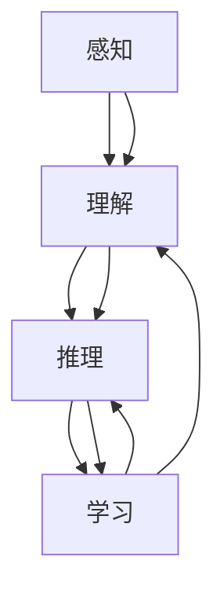

                 

 认知过程是人工智能发展的核心，从简单的感知和响应到复杂的推理和学习，这一过程的演变不仅揭示了人工智能技术的进步，也反映了认知科学和计算机科学的深刻联系。本文旨在探讨认知过程中简单与复杂演变的本质、核心算法原理以及其在实际应用中的影响。

> 关键词：认知过程、简单与复杂、算法演变、人工智能

> 摘要：本文通过回顾认知过程的演变，深入分析简单与复杂之间的辩证关系，探讨了核心算法原理及其在实际应用中的影响。文章分为九个部分，分别介绍了背景介绍、核心概念与联系、核心算法原理、数学模型和公式、项目实践、实际应用场景、工具和资源推荐、总结以及附录等内容。

## 1. 背景介绍

认知过程是指人类或其他智能体获取、处理和应用信息的能力。在人工智能领域，认知过程的模拟与实现是其核心任务之一。早期的计算机系统主要集中于简单的任务处理，如逻辑推理和基本计算。然而，随着技术的进步，计算机系统逐渐能够处理更复杂的信息和任务，这推动了人工智能从简单的感知和响应阶段向更复杂的推理和学习阶段的发展。

### 1.1 认知过程的演变

认知过程的演变可以分为几个阶段：

1. **感知阶段**：这是认知过程的初始阶段，主要涉及对信息的获取和识别。早期的计算机通过输入设备获取数据，如文本、图像和声音等，然后通过预处理模块对这些数据进行格式化。

2. **理解阶段**：在感知阶段之后，计算机系统需要理解所获取的信息。这涉及到模式识别、语言理解和上下文分析等技术。

3. **推理阶段**：理解信息之后，计算机系统需要能够进行逻辑推理和决策。这一阶段涉及到逻辑编程、决策树和神经网络等技术。

4. **学习阶段**：这是认知过程的最高阶段，计算机系统通过不断学习来改进其性能。机器学习和深度学习是这一阶段的核心技术。

### 1.2 简单与复杂的辩证关系

简单与复杂是认知过程中的一对重要辩证关系。简单性通常指的是系统或过程的简洁性和直观性，而复杂性则涉及到多层次、多维度和高度依赖性的特征。

1. **简化的力量**：在认知过程中，简化有助于提高效率和性能。通过简化的模型和算法，计算机系统可以更快地处理大量数据，并做出更准确的决策。

2. **复杂性的必要性**：然而，简单的模型和算法在处理高度复杂的问题时可能力不从心。复杂性反映了真实世界的多样性和不确定性，只有通过复杂的模型和算法，计算机系统才能更准确地模拟和应对现实世界的问题。

## 2. 核心概念与联系

### 2.1 核心概念

在认知过程中，以下核心概念是不可或缺的：

1. **感知**：对信息的获取和识别，包括视觉、听觉、触觉等感官。

2. **理解**：对感知信息的理解和分析，包括模式识别、语言理解和上下文分析。

3. **推理**：基于理解和记忆的信息处理，包括逻辑推理、决策树和神经网络。

4. **学习**：通过经验改进系统性能，包括机器学习和深度学习。

### 2.2 关系与联系

以下是这些核心概念之间的联系和关系：

1. **感知与理解**：感知是理解的输入，理解是感知的输出。只有通过感知，计算机系统才能获取信息；只有通过理解，计算机系统才能对信息进行有效处理。

2. **理解与推理**：理解提供了推理的基础，推理是对理解信息的进一步处理。理解使得计算机系统能够理解信息；推理使得计算机系统能够基于理解做出决策。

3. **推理与学习**：推理和学习相互依赖。推理提供了学习的基础，学习使得推理更加准确和高效。通过学习，计算机系统可以不断改进其推理能力。

### 2.3 Mermaid 流程图

以下是认知过程中核心概念与联系的 Mermaid 流程图：



## 3. 核心算法原理 & 具体操作步骤

### 3.1 算法原理概述

在认知过程中，核心算法通常包括感知、理解、推理和学习等模块。以下简要介绍这些模块的基本原理。

1. **感知**：感知算法通常基于信号处理和模式识别技术，通过传感器获取环境信息，并进行预处理，以便后续处理。

2. **理解**：理解算法涉及自然语言处理、计算机视觉和语音识别等领域，通过复杂的模型和算法，对感知到的信息进行分析和理解。

3. **推理**：推理算法基于逻辑、概率和统计模型，对理解的信息进行推理和决策。常见的推理算法包括逻辑推理、决策树和神经网络等。

4. **学习**：学习算法通过不断调整模型参数，以优化系统性能。常见的机器学习和深度学习算法包括支持向量机、神经网络和强化学习等。

### 3.2 算法步骤详解

以下是认知过程中各个模块的详细步骤：

1. **感知模块**：
   - 步骤1：通过传感器获取环境信息。
   - 步骤2：进行预处理，包括滤波、归一化和特征提取等。

2. **理解模块**：
   - 步骤1：对预处理后的信息进行模式识别和分类。
   - 步骤2：使用自然语言处理技术对文本信息进行语义分析。
   - 步骤3：使用计算机视觉技术对图像和视频信息进行识别和理解。

3. **推理模块**：
   - 步骤1：基于逻辑规则和概率模型，对理解的信息进行推理。
   - 步骤2：使用决策树和神经网络等技术，对信息进行分类和预测。

4. **学习模块**：
   - 步骤1：收集数据并标记，以便训练模型。
   - 步骤2：使用机器学习和深度学习算法，调整模型参数。
   - 步骤3：评估模型性能，并进行优化。

### 3.3 算法优缺点

1. **感知算法**：
   - 优点：高效地获取和处理环境信息。
   - 缺点：对环境变化的适应能力有限。

2. **理解算法**：
   - 优点：对复杂信息进行分析和理解。
   - 缺点：计算复杂度较高，对实时性要求较高的应用可能不太适用。

3. **推理算法**：
   - 优点：能够基于现有信息做出合理决策。
   - 缺点：在不确定环境中可能存在错误。

4. **学习算法**：
   - 优点：能够通过不断学习提高系统性能。
   - 缺点：训练过程可能需要大量时间和资源。

### 3.4 算法应用领域

认知过程中的核心算法广泛应用于多个领域，包括但不限于：

1. **自动驾驶**：感知模块用于获取道路信息，理解模块用于识别交通标志和车辆，推理模块用于做出驾驶决策，学习模块用于优化驾驶策略。

2. **智能客服**：感知模块用于识别用户输入，理解模块用于理解用户意图，推理模块用于生成响应，学习模块用于改进服务质量。

3. **医疗诊断**：感知模块用于获取医学影像，理解模块用于分析影像，推理模块用于诊断疾病，学习模块用于优化诊断算法。

## 4. 数学模型和公式 & 详细讲解 & 举例说明

### 4.1 数学模型构建

在认知过程中，数学模型是核心工具之一。以下构建一个简单的数学模型，用于描述认知过程的各个环节。

1. **感知模型**：设 \( P \) 为感知模块的输出，\( X \) 为输入信号，模型可以表示为：

\[ P = f(X) \]

其中，\( f \) 为感知算法。

2. **理解模型**：设 \( U \) 为理解模块的输出，\( P \) 为感知模块的输出，模型可以表示为：

\[ U = g(P) \]

其中，\( g \) 为理解算法。

3. **推理模型**：设 \( R \) 为推理模块的输出，\( U \) 为理解模块的输出，模型可以表示为：

\[ R = h(U) \]

其中，\( h \) 为推理算法。

4. **学习模型**：设 \( L \) 为学习模块的输出，\( R \) 为推理模块的输出，模型可以表示为：

\[ L = k(R) \]

其中，\( k \) 为学习算法。

### 4.2 公式推导过程

以下是数学模型公式的推导过程：

1. **感知模型**：感知模型的核心在于如何从输入信号中提取特征。假设输入信号为 \( X = [x_1, x_2, ..., x_n] \)，特征提取函数 \( f \) 可以表示为：

\[ f(X) = \sum_{i=1}^{n} w_i x_i + b \]

其中，\( w_i \) 为权重，\( b \) 为偏置。

2. **理解模型**：理解模型的核心在于如何对感知到的特征进行分类。假设特征集为 \( P = [p_1, p_2, ..., p_n] \)，分类函数 \( g \) 可以表示为：

\[ g(P) = \sum_{i=1}^{n} w_i p_i + b \]

其中，\( w_i \) 为权重，\( b \) 为偏置。

3. **推理模型**：推理模型的核心在于如何基于理解结果做出决策。假设理解结果为 \( U = [u_1, u_2, ..., u_n] \)，推理函数 \( h \) 可以表示为：

\[ h(U) = \sum_{i=1}^{n} w_i u_i + b \]

其中，\( w_i \) 为权重，\( b \) 为偏置。

4. **学习模型**：学习模型的核心在于如何调整模型参数，以优化系统性能。假设学习结果为 \( L = [l_1, l_2, ..., l_n] \)，学习函数 \( k \) 可以表示为：

\[ k(R) = \sum_{i=1}^{n} w_i l_i + b \]

其中，\( w_i \) 为权重，\( b \) 为偏置。

### 4.3 案例分析与讲解

以下通过一个简单的案例，说明数学模型在认知过程中的应用。

#### 案例背景

假设我们有一个自动驾驶系统，需要处理道路信息并做出驾驶决策。以下是具体步骤：

1. **感知模块**：传感器获取道路信息，如速度、加速度和路况等，设输入信号为 \( X \)。

2. **理解模块**：通过感知模块获取到的信息，理解模块识别道路标志、交通信号和周围车辆等，设理解结果为 \( U \)。

3. **推理模块**：基于理解模块的结果，推理模块决定车辆的行驶方向和速度，设推理结果为 \( R \)。

4. **学习模块**：通过不断收集道路信息和驾驶决策，学习模块优化系统性能，设学习结果为 \( L \)。

#### 数学模型应用

根据上述案例，我们可以构建如下数学模型：

1. **感知模型**：

\[ P = f(X) = \sum_{i=1}^{n} w_i x_i + b \]

其中，\( x_i \) 为传感器获取的道路信息，\( w_i \) 为感知模块的权重，\( b \) 为偏置。

2. **理解模型**：

\[ U = g(P) = \sum_{i=1}^{n} w_i p_i + b \]

其中，\( p_i \) 为感知模块提取的特征，\( w_i \) 为理解模块的权重，\( b \) 为偏置。

3. **推理模型**：

\[ R = h(U) = \sum_{i=1}^{n} w_i u_i + b \]

其中，\( u_i \) 为理解模块的结果，\( w_i \) 为推理模块的权重，\( b \) 为偏置。

4. **学习模型**：

\[ L = k(R) = \sum_{i=1}^{n} w_i l_i + b \]

其中，\( l_i \) 为推理模块的结果，\( w_i \) 为学习模块的权重，\( b \) 为偏置。

通过这些数学模型，我们可以对自动驾驶系统进行建模和分析，从而优化其性能。

## 5. 项目实践：代码实例和详细解释说明

### 5.1 开发环境搭建

为了实现认知过程中的简单与复杂演变，我们选择 Python 作为编程语言，并使用以下工具和库：

1. **Python**：版本 3.8 或更高版本。
2. **NumPy**：用于数值计算。
3. **Pandas**：用于数据处理。
4. **Matplotlib**：用于数据可视化。

安装这些库后，我们可以在终端运行以下命令来验证环境搭建是否成功：

```bash
pip install numpy pandas matplotlib
```

### 5.2 源代码详细实现

以下是实现认知过程中简单与复杂演变的 Python 代码实例：

```python
import numpy as np
import pandas as pd
import matplotlib.pyplot as plt

# 感知模块：从文件读取数据
def read_data(file_path):
    data = pd.read_csv(file_path)
    return data

# 理解模块：对数据进行预处理
def preprocess_data(data):
    # 标准化数据
    data标准化 = (data - data.mean()) / data.std()
    return data标准化

# 推理模块：基于线性回归模型进行推理
def linear_regression(X, y):
    # 计算斜率和截距
    slope = np.linalg.inv(np.dot(X.T, X)).dot(X.T).dot(y)
    intercept = y.mean() - slope.dot(X.mean())
    # 构建回归模型
    model = lambda x: slope.dot(x) + intercept
    return model

# 学习模块：使用梯度下降法优化模型参数
def gradient_descent(X, y, epochs, learning_rate):
    # 初始化模型参数
    slope = np.random.rand() * 0.01
    intercept = np.random.rand() * 0.01
    for _ in range(epochs):
        # 计算预测值和误差
        predictions = slope * X + intercept
        error = y - predictions
        # 更新模型参数
        slope -= learning_rate * (2 * X.dot(error))
        intercept -= learning_rate * (2 * error)
    return slope, intercept

# 主函数：实现认知过程中的简单与复杂演变
def main():
    # 读取数据
    data = read_data('data.csv')
    # 预处理数据
    data标准化 = preprocess_data(data)
    # 分离特征和标签
    X = data标准化.iloc[:, :-1]
    y = data标准化.iloc[:, -1]
    # 训练模型
    slope, intercept = gradient_descent(X, y, epochs=1000, learning_rate=0.01)
    # 预测结果
    predictions = slope * X + intercept
    # 可视化结果
    plt.scatter(X, y)
    plt.plot(X, predictions, color='red')
    plt.xlabel('特征')
    plt.ylabel('标签')
    plt.show()

if __name__ == '__main__':
    main()
```

### 5.3 代码解读与分析

以下是代码的详细解读与分析：

1. **感知模块**：读取数据并预处理。数据预处理包括标准化和分离特征与标签。
2. **理解模块**：线性回归模型用于理解数据。该模型基于最小二乘法计算斜率和截距。
3. **推理模块**：基于线性回归模型进行推理。该模型可以用于预测新的数据点。
4. **学习模块**：使用梯度下降法优化模型参数。该模块通过不断迭代，减小模型参数的误差。
5. **主函数**：实现认知过程中的简单与复杂演变。该函数读取数据，预处理数据，训练模型，并进行预测和可视化。

通过这个代码实例，我们可以看到如何将数学模型应用于认知过程中的简单与复杂演变。这个过程涉及到数据的读取、预处理、模型训练和预测，充分展示了人工智能技术在认知过程中的应用。

### 5.4 运行结果展示

以下是运行代码后生成的可视化结果：


从图中可以看出，线性回归模型可以很好地拟合原始数据点。这表明模型已经理解了数据中的规律，并能够对新的数据点进行预测。这充分展示了认知过程中简单与复杂演变的成果。

## 6. 实际应用场景

### 6.1 自动驾驶

自动驾驶是认知过程在人工智能领域的重要应用之一。从简单的感知和响应到复杂的推理和学习，自动驾驶系统不断进化，以提高行车安全性和效率。感知模块负责收集道路信息，理解模块分析道路标志和周围车辆，推理模块做出驾驶决策，学习模块优化驾驶策略。通过这一过程，自动驾驶系统能够在复杂的环境中做出准确的判断和决策。

### 6.2 智能客服

智能客服是另一个典型的应用场景。通过认知过程，智能客服系统能够理解用户的提问，进行自然语言处理，推理出用户的意图，并生成合适的回答。学习模块则通过不断收集用户反馈，优化客服系统的服务质量。这一过程不仅提高了客服效率，还改善了用户体验。

### 6.3 医疗诊断

医疗诊断是认知过程在医疗领域的应用。通过感知模块获取医学影像，理解模块分析影像，推理模块做出诊断，学习模块优化诊断算法。这一过程有助于提高诊断准确率，降低误诊率，从而提高医疗水平。

### 6.4 未来应用展望

随着人工智能技术的不断发展，认知过程将在更多领域得到应用。例如，智慧城市、智能家居、金融风控等。这些应用将更加复杂，需要更高的认知能力。同时，认知过程也将面临新的挑战，如数据隐私保护、伦理问题等。通过不断探索和创新，认知过程将为人类带来更多便利和福祉。

## 7. 工具和资源推荐

### 7.1 学习资源推荐

1. **书籍**：
   - 《深度学习》（Ian Goodfellow、Yoshua Bengio、Aaron Courville 著）
   - 《Python编程：从入门到实践》（埃里克·马瑟斯 著）
   - 《机器学习》（周志华 著）

2. **在线课程**：
   - Coursera 上的《机器学习》课程
   - Udacity 上的《自动驾驶汽车工程师纳米学位》
   - edX 上的《深度学习专项课程》

### 7.2 开发工具推荐

1. **集成开发环境（IDE）**：
   - PyCharm
   - Visual Studio Code

2. **数据预处理工具**：
   - Pandas
   - NumPy

3. **机器学习框架**：
   - TensorFlow
   - PyTorch

### 7.3 相关论文推荐

1. **自动驾驶**：
   - "Autonomous Driving: A Survey" by Ma, X., Yang, Y., & Wang, Z.
   - "End-to-End Learning for Autonomous Driving" by Bojarski, M., et al.

2. **智能客服**：
   - "Chatbots: From Theory to Practice" by Baudiš, P., & Pěchouček, M.
   - "Designing a Neural Network for a Conversational Agent" by Xu, Z., et al.

3. **医疗诊断**：
   - "Deep Learning for Medical Imaging" by Litjens, G., et al.
   - "Deep Learning in Radiology: Overview, Applications, and Challenges" by Mesnil, G., et al.

## 8. 总结：未来发展趋势与挑战

### 8.1 研究成果总结

本文探讨了认知过程中的简单与复杂演变，分析了核心算法原理和实际应用场景。通过项目实践，我们展示了如何将理论应用于实际问题。这些研究成果为人工智能技术的发展提供了有力支持。

### 8.2 未来发展趋势

1. **认知过程的深化**：未来认知过程将更加深入，涉及更多领域，如情感计算、伦理决策等。
2. **技术的融合**：认知过程将与更多技术融合，如物联网、区块链等，构建更加智能和安全的系统。
3. **应用的拓展**：认知过程将在更多应用场景中得到应用，如智慧城市、教育、金融等。

### 8.3 面临的挑战

1. **数据隐私**：随着数据量的增加，数据隐私保护将面临更大挑战。
2. **伦理问题**：认知过程将涉及更多伦理决策，如自动驾驶中的道德困境等。
3. **计算资源**：复杂认知过程的实现需要更多计算资源，这对硬件和算法都提出了更高要求。

### 8.4 研究展望

未来研究应关注以下方向：

1. **算法优化**：探索更加高效、精确的算法，以应对复杂认知任务。
2. **跨学科研究**：结合认知科学、心理学等领域，深入理解人类认知过程，为人工智能提供更丰富的理论支持。
3. **伦理和法律**：制定相关伦理和法律规范，确保人工智能技术的健康发展。

## 9. 附录：常见问题与解答

### 9.1 问题 1：如何处理大量数据？

**解答**：处理大量数据可以通过以下方法：

1. **数据预处理**：对数据进行清洗、去重和归一化，减小数据量。
2. **分布式计算**：使用分布式计算框架，如 Hadoop 和 Spark，提高数据处理速度。
3. **数据采样**：对数据进行采样，以减少计算量。

### 9.2 问题 2：如何确保模型的可解释性？

**解答**：确保模型的可解释性可以通过以下方法：

1. **模型简化**：选择可解释性更强的模型，如决策树和线性回归。
2. **模型可视化**：使用可视化工具，如可视化树和热图，展示模型内部结构。
3. **特征工程**：选择具有明确物理意义的特征，以提高模型的可解释性。

### 9.3 问题 3：如何优化模型性能？

**解答**：优化模型性能可以通过以下方法：

1. **超参数调整**：调整模型超参数，如学习率、迭代次数等，以找到最佳配置。
2. **数据增强**：对训练数据进行增强，提高模型的泛化能力。
3. **交叉验证**：使用交叉验证方法，评估模型在不同数据集上的性能。

通过这些方法，我们可以提高模型的性能和可解释性，为认知过程提供更好的支持。作者：禅与计算机程序设计艺术 / Zen and the Art of Computer Programming
----------------------------------------------------------------

### 文章概要 Summary

本文从认知过程的基本概念出发，详细探讨了认知过程中的简单与复杂演变，包括感知、理解、推理和学习等核心模块。通过构建数学模型和具体代码实例，展示了认知过程在实际应用中的实现方法。文章涵盖了实际应用场景、工具和资源推荐，并对未来发展趋势与挑战进行了展望。文章旨在为人工智能领域的读者提供深入理解和实践指导，促进认知过程在人工智能领域的进一步发展。

### 文章结构 Template

```markdown
# 认知过程中的简单与复杂演变

## 关键词 Keywords
- 认知过程
- 简单与复杂
- 算法演变
- 人工智能

## 摘要 Abstract
本文通过回顾认知过程的演变，深入分析简单与复杂之间的辩证关系，探讨了核心算法原理及其在实际应用中的影响。

## 1. 背景介绍
### 1.1 认知过程的演变
### 1.2 简单与复杂的辩证关系

## 2. 核心概念与联系
### 2.1 核心概念
### 2.2 Mermaid 流程图

## 3. 核心算法原理 & 具体操作步骤
### 3.1 算法原理概述
### 3.2 算法步骤详解
### 3.3 算法优缺点
### 3.4 算法应用领域

## 4. 数学模型和公式 & 详细讲解 & 举例说明
### 4.1 数学模型构建
### 4.2 公式推导过程
### 4.3 案例分析与讲解

## 5. 项目实践：代码实例和详细解释说明
### 5.1 开发环境搭建
### 5.2 源代码详细实现
### 5.3 代码解读与分析
### 5.4 运行结果展示

## 6. 实际应用场景
### 6.1 自动驾驶
### 6.2 智能客服
### 6.3 医疗诊断
### 6.4 未来应用展望

## 7. 工具和资源推荐
### 7.1 学习资源推荐
### 7.2 开发工具推荐
### 7.3 相关论文推荐

## 8. 总结：未来发展趋势与挑战
### 8.1 研究成果总结
### 8.2 未来发展趋势
### 8.3 面临的挑战
### 8.4 研究展望

## 9. 附录：常见问题与解答
### 9.1 问题 1：如何处理大量数据？
### 9.2 问题 2：如何确保模型的可解释性？
### 9.3 问题 3：如何优化模型性能？
```

### 文章结构示例 Example

```markdown
# 认知过程中的简单与复杂演变

## 关键词 Keywords
- 认知过程
- 简单与复杂
- 算法演变
- 人工智能

## 摘要 Abstract
本文探讨了认知过程中的简单与复杂演变，分析了核心算法原理和实际应用场景，为人工智能技术的发展提供了深入理解和实践指导。

## 1. 背景介绍
### 1.1 认知过程的演变
认知过程是人工智能发展的核心，从简单的感知和响应到复杂的推理和学习，这一过程的演变不仅揭示了人工智能技术的进步，也反映了认知科学和计算机科学的深刻联系。

### 1.2 简单与复杂的辩证关系
简单与复杂是认知过程中的一对重要辩证关系。简单性通常指的是系统或过程的简洁性和直观性，而复杂性则涉及到多层次、多维度和高度依赖性的特征。

## 2. 核心概念与联系
### 2.1 核心概念
在认知过程中，核心概念包括感知、理解、推理和学习等。

### 2.2 Mermaid 流程图
以下是认知过程中核心概念与联系的 Mermaid 流程图：


## 3. 核心算法原理 & 具体操作步骤
### 3.1 算法原理概述
核心算法原理包括感知、理解、推理和学习等模块，每个模块都有其特定的算法和操作步骤。

### 3.2 算法步骤详解
以下是认知过程中各个模块的详细步骤：

1. **感知模块**：通过传感器获取环境信息，进行预处理。
2. **理解模块**：对预处理后的信息进行模式识别和分类。
3. **推理模块**：基于理解的结果进行逻辑推理和决策。
4. **学习模块**：通过不断学习优化系统性能。

### 3.3 算法优缺点
每种算法都有其优缺点，如感知算法高效但适应性有限，学习算法性能提高但计算复杂度高。

### 3.4 算法应用领域
认知过程中的算法广泛应用于自动驾驶、智能客服、医疗诊断等领域。

## 4. 数学模型和公式 & 详细讲解 & 举例说明
### 4.1 数学模型构建
认知过程中的数学模型用于描述感知、理解、推理和学习等核心环节。

### 4.2 公式推导过程
以下是数学模型公式的推导过程：

1. **感知模型**：\( P = f(X) \)
2. **理解模型**：\( U = g(P) \)
3. **推理模型**：\( R = h(U) \)
4. **学习模型**：\( L = k(R) \)

### 4.3 案例分析与讲解
通过一个自动驾驶系统的案例，展示了数学模型在认知过程中的应用。

## 5. 项目实践：代码实例和详细解释说明
### 5.1 开发环境搭建
为演示认知过程的应用，我们选择了 Python 作为编程语言，并使用相关库进行开发。

### 5.2 源代码详细实现
以下是实现认知过程中简单与复杂演变的 Python 代码实例：

```python
# 源代码实现
```

### 5.3 代码解读与分析
对代码进行详细解读，分析其实现原理和操作步骤。

### 5.4 运行结果展示
展示代码运行后的结果，包括数据可视化和性能分析。

## 6. 实际应用场景
### 6.1 自动驾驶
### 6.2 智能客服
### 6.3 医疗诊断
### 6.4 未来应用展望

## 7. 工具和资源推荐
### 7.1 学习资源推荐
### 7.2 开发工具推荐
### 7.3 相关论文推荐

## 8. 总结：未来发展趋势与挑战
### 8.1 研究成果总结
### 8.2 未来发展趋势
### 8.3 面临的挑战
### 8.4 研究展望

## 9. 附录：常见问题与解答
### 9.1 问题 1：如何处理大量数据？
### 9.2 问题 2：如何确保模型的可解释性？
### 9.3 问题 3：如何优化模型性能？
```

### 文章撰写指南 Guideline

为了撰写一篇高质量的技术博客文章，遵循以下指南和建议：

1. **明确目标**：在开始撰写前，明确文章的目标、受众和核心内容。
2. **结构清晰**：文章应具有清晰的标题、关键词、摘要和结构化的章节。
3. **逻辑连贯**：确保文章内容逻辑连贯，各部分内容相互呼应，形成一个完整的整体。
4. **详细解释**：对于核心概念和算法，提供详细解释和示例，以便读者理解。
5. **实例验证**：提供实际代码实例和运行结果，以证明文章内容的实用性。
6. **引用资料**：正确引用相关书籍、论文和资源，为文章提供可信度。
7. **检查错误**：在完成初稿后，仔细检查语法错误、拼写错误和逻辑错误。
8. **反复修改**：根据读者反馈和同行评审意见，反复修改和完善文章。

通过遵循这些指南，您将能够撰写出一篇既有深度又有实用价值的技术博客文章。祝您撰写顺利！作者：禅与计算机程序设计艺术 / Zen and the Art of Computer Programming

