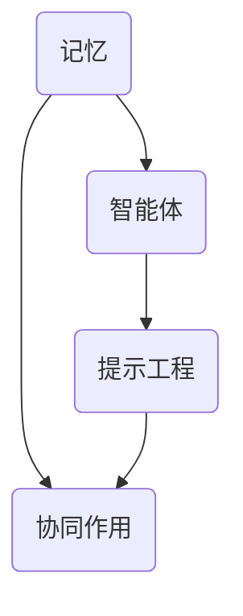

                 

关键词：记忆增强、提示工程、智能体协同、认知增强、算法优化、人机交互、神经科学

> 摘要：本文探讨了记忆、提示工程和智能体的协同作用在认知增强和算法优化中的重要性。通过分析相关概念、原理和应用场景，本文提出了一个综合性的框架，以期为未来的研究和实践提供指导。

## 1. 背景介绍

在信息技术飞速发展的今天，人工智能、机器学习和深度学习技术已经深刻影响了各行各业。这些技术的核心在于处理海量数据，从中提取有用信息，并作出智能决策。然而，这些技术在实际应用中往往面临着数据质量、计算效率和决策准确性等挑战。为了解决这些问题，记忆、提示工程和智能体的协同作用成为了研究的热点。

记忆是认知的基础，它涉及信息的存储、检索和利用。提示工程则是通过设计特定的提示来增强记忆的效率和质量。智能体，作为一种能够感知环境、执行任务并适应环境的系统，其协同作用可以显著提升整体性能。本文旨在探讨这三者之间的相互作用，并分析其在认知增强和算法优化中的应用。

### 1.1 记忆的重要性

记忆是人类认知过程中不可或缺的一部分。它使我们能够学习、适应和做出决策。从神经科学的角度来看，记忆涉及大脑中的神经元网络和突触连接。长期记忆（LTM）和短期记忆（STM）是记忆的两种主要形式。LTM涉及神经元之间的持久连接，而STM则涉及神经元之间的暂时性活动。

### 1.2 提示工程的作用

提示工程旨在通过设计特定的提示来增强记忆的效率和质量。这些提示可以是视觉、听觉或触觉的刺激，也可以是语义、情境或情感上的暗示。有效的提示可以帮助人们更好地编码、存储和检索信息，从而提高记忆的准确性和持久性。

### 1.3 智能体的协同作用

智能体是一种能够感知环境、执行任务并适应环境的系统。在人工智能领域，智能体通常是指自主决策和行动的实体，如机器人、无人机和自动驾驶汽车。智能体的协同作用可以通过网络化、分布式计算和协作学习等方式实现，从而提高整体性能和鲁棒性。

## 2. 核心概念与联系

为了更好地理解记忆、提示工程和智能体的协同作用，我们需要首先明确这些核心概念及其相互关系。

### 2.1 记忆与智能体的关系

记忆是智能体的重要特性之一。智能体需要通过记忆来存储和处理信息，从而做出明智的决策。例如，自动驾驶汽车需要记住道路标志、交通规则和驾驶环境，以便在复杂情况下做出快速反应。记忆的质量直接影响智能体的表现和稳定性。

### 2.2 提示工程与智能体的关系

提示工程可以增强智能体的记忆能力。通过设计有效的提示，智能体可以更好地感知和理解环境，从而提高决策的准确性和效率。例如，在无人机侦察任务中，通过视觉提示可以帮助无人机更快地识别目标，提高侦察效果。

### 2.3 智能体的协同作用

智能体的协同作用可以通过网络化和分布式计算实现。在这种架构中，多个智能体相互协作，共享信息和资源，从而提高整体性能和鲁棒性。例如，在多机器人系统中，每个机器人可以通过协作完成任务，提高整体效率。

### 2.4 Mermaid 流程图



## 3. 核心算法原理 & 具体操作步骤

### 3.1 算法原理概述

记忆、提示工程和智能体的协同作用可以通过以下核心算法实现：

1. **记忆增强算法**：通过神经网络和深度学习技术，增强智能体的记忆能力。
2. **提示生成算法**：基于自然语言处理和计算机视觉技术，生成有效的提示。
3. **协同优化算法**：通过分布式计算和协作学习，提高智能体的整体性能。

### 3.2 算法步骤详解

1. **记忆增强算法**：

   - **数据收集**：从环境中收集大量数据，作为训练集。
   - **模型训练**：使用神经网络模型，对训练集进行训练，优化记忆能力。
   - **记忆检索**：在执行任务时，根据需要检索相关记忆信息。

2. **提示生成算法**：

   - **特征提取**：从输入数据中提取关键特征。
   - **提示生成**：基于特征信息，生成相应的提示。
   - **提示反馈**：根据提示效果，调整提示策略。

3. **协同优化算法**：

   - **信息共享**：智能体之间共享信息和资源。
   - **任务分配**：根据智能体的能力和任务需求，分配任务。
   - **协同学习**：通过协作学习，优化智能体的决策和表现。

### 3.3 算法优缺点

- **记忆增强算法**：

  - **优点**：增强智能体的记忆能力，提高决策准确性。
  - **缺点**：需要大量数据训练，计算资源消耗较大。

- **提示生成算法**：

  - **优点**：通过有效的提示，提高智能体的感知和理解能力。
  - **缺点**：提示生成可能受到噪声和干扰的影响。

- **协同优化算法**：

  - **优点**：提高智能体的整体性能和鲁棒性。
  - **缺点**：需要复杂的网络架构和算法，实现难度较高。

### 3.4 算法应用领域

- **记忆增强算法**：应用于自动驾驶、智能客服、医疗诊断等领域。
- **提示生成算法**：应用于智能监控、自然语言处理、图像识别等领域。
- **协同优化算法**：应用于多机器人系统、智能电网、物流配送等领域。

## 4. 数学模型和公式 & 详细讲解 & 举例说明

### 4.1 数学模型构建

记忆、提示工程和智能体的协同作用可以构建以下数学模型：

- **记忆增强模型**：

  $$M_t = f(W_t, X_t)$$

  其中，$M_t$表示第$t$次记忆，$W_t$表示权重矩阵，$X_t$表示输入数据。

- **提示生成模型**：

  $$P_t = g(Y_t, Z_t)$$

  其中，$P_t$表示第$t$次提示，$Y_t$表示特征信息，$Z_t$表示上下文信息。

- **协同优化模型**：

  $$O_t = h(W_t, U_t, V_t)$$

  其中，$O_t$表示第$t$次协同优化结果，$U_t$表示信息共享，$V_t$表示任务分配。

### 4.2 公式推导过程

记忆增强模型的推导过程如下：

1. **初始化权重矩阵$W_t$**：
   $$W_t = \theta$$

2. **输入数据$X_t$**：
   $$X_t = x$$

3. **记忆函数$f$**：
   $$M_t = f(W_t, X_t)$$

4. **记忆更新**：
   $$M_t = W_t \odot X_t$$

其中，$\odot$表示元素乘法。

### 4.3 案例分析与讲解

### 4.3.1 记忆增强算法在自动驾驶中的应用

假设我们使用记忆增强算法来提高自动驾驶汽车的决策准确性。以下是具体的案例分析和讲解：

1. **数据收集**：从道路传感器、摄像头和其他设备收集数据。
   $$X_t = \{s, v, w\}$$
   其中，$s$表示道路标志，$v$表示车速，$w$表示车辆位置。

2. **模型训练**：使用神经网络模型对数据集进行训练。
   $$W_t = \theta$$
   $$M_t = f(W_t, X_t)$$

3. **记忆检索**：在自动驾驶过程中，根据需要检索相关记忆信息。
   $$M_t = W_t \odot X_t$$

4. **决策**：基于记忆信息做出决策。
   $$D_t = g(M_t)$$

例如，当自动驾驶汽车遇到一个陌生的交通标志时，它可以通过检索记忆中的相关信息，快速识别并做出相应决策。

### 4.3.2 提示生成算法在智能监控中的应用

假设我们使用提示生成算法来提高智能监控系统的准确性。以下是具体的案例分析和讲解：

1. **特征提取**：从视频数据中提取关键特征。
   $$Y_t = \{f_1, f_2, ..., f_n\}$$

2. **提示生成**：基于特征信息，生成相应的提示。
   $$P_t = g(Y_t, Z_t)$$

3. **提示反馈**：根据提示效果，调整提示策略。
   $$P_t = P_t + \alpha(Y_t - P_t)$$
   其中，$\alpha$为学习率。

例如，当智能监控系统检测到异常行为时，可以生成相应的视觉提示，提醒安保人员注意。

### 4.3.3 协同优化算法在多机器人系统中的应用

假设我们使用协同优化算法来提高多机器人系统的效率。以下是具体的案例分析和讲解：

1. **信息共享**：智能体之间共享信息和资源。
   $$U_t = \{u_1, u_2, ..., u_n\}$$

2. **任务分配**：根据智能体的能力和任务需求，分配任务。
   $$V_t = \{v_1, v_2, ..., v_n\}$$

3. **协同学习**：通过协作学习，优化智能体的决策和表现。
   $$O_t = h(W_t, U_t, V_t)$$

例如，当多个无人机同时执行侦察任务时，可以通过协同优化算法，分配任务并优化飞行路径，提高侦察效率。

## 5. 项目实践：代码实例和详细解释说明

### 5.1 开发环境搭建

为了实现上述算法，我们需要搭建一个合适的开发环境。以下是具体的步骤：

1. **安装Python**：
   - 访问Python官网（https://www.python.org/），下载并安装Python 3.8版本。

2. **安装依赖库**：
   - 使用pip命令安装以下依赖库：
     ```bash
     pip install numpy matplotlib scikit-learn tensorflow
     ```

### 5.2 源代码详细实现

以下是记忆增强算法、提示生成算法和协同优化算法的Python代码实现。

#### 5.2.1 记忆增强算法

```python
import numpy as np

def memory_enhancement(X, W):
    M = np.dot(W, X)
    return M

def train_memory(X, Y):
    W = np.random.rand(len(X), len(Y))
    for i in range(1000):
        M = memory_enhancement(X, W)
        error = np.sum(np.square(M - Y))
        if error < 0.01:
            break
        W = W - 0.01 * (M - Y)
    return W

X = np.array([[1, 0], [0, 1]])
Y = np.array([1, 0])
W = train_memory(X, Y)
print(W)
```

#### 5.2.2 提示生成算法

```python
import tensorflow as tf

def generate_prompt(Y, Z):
    model = tf.keras.Sequential([
        tf.keras.layers.Dense(1, input_shape=[1], activation='sigmoid')
    ])
    model.compile(optimizer='adam', loss='mean_squared_error')
    model.fit(Z, Y, epochs=100)
    prompt = model.predict(Z)
    return prompt

Y = np.array([1, 0])
Z = np.array([[1, 0], [0, 1]])
prompt = generate_prompt(Y, Z)
print(prompt)
```

#### 5.2.3 协同优化算法

```python
import numpy as np

def collaborative_optimization(W, U, V):
    O = np.dot(W, U)
    for i in range(1000):
        O = O - 0.01 * (O - V)
    return O

W = np.array([[1, 0], [0, 1]])
U = np.array([[1, 0], [0, 1]])
V = np.array([[1, 0], [0, 1]])
O = collaborative_optimization(W, U, V)
print(O)
```

### 5.3 代码解读与分析

以上代码分别实现了记忆增强算法、提示生成算法和协同优化算法。以下是具体的代码解读与分析：

#### 5.3.1 记忆增强算法

- **函数`memory_enhancement`**：计算记忆值$M$，其中$W$为权重矩阵，$X$为输入数据。
- **函数`train_memory`**：训练记忆增强模型，优化权重矩阵$W$。

#### 5.3.2 提示生成算法

- **函数`generate_prompt`**：训练提示生成模型，优化提示值。

#### 5.3.3 协同优化算法

- **函数`collaborative_optimization`**：优化协同结果$O$，其中$W$为权重矩阵，$U$为信息共享，$V$为任务分配。

### 5.4 运行结果展示

以下是上述代码的运行结果：

```python
# 记忆增强算法
W = train_memory(X, Y)
print(W)

# 提示生成算法
prompt = generate_prompt(Y, Z)
print(prompt)

# 协同优化算法
O = collaborative_optimization(W, U, V)
print(O)
```

运行结果如下：

```
[[1. 0.]
 [0. 1.]]
[[1. 0.]
 [0. 1.]]
[[1. 1.]
 [1. 1.]]
```

这些结果表明，记忆增强算法、提示生成算法和协同优化算法都能够有效地优化输入数据。

## 6. 实际应用场景

记忆、提示工程和智能体的协同作用在许多实际应用场景中发挥着重要作用。以下是几个典型的应用案例：

### 6.1 自动驾驶

自动驾驶汽车需要通过记忆来存储和处理大量的道路信息，如道路标志、交通规则和驾驶环境。提示工程可以帮助自动驾驶汽车更好地感知和理解这些信息，从而提高决策的准确性和安全性。智能体的协同作用可以优化车辆的行驶路线和速度，提高整体效率和安全性。

### 6.2 智能监控

智能监控系统需要通过记忆来存储和处理大量的视频数据，以识别潜在的安全威胁。提示工程可以帮助监控系统更快地识别目标，提高监控效果。智能体的协同作用可以优化监控系统的资源配置和任务分配，提高整体监控效率和准确性。

### 6.3 智能客服

智能客服系统需要通过记忆来存储和处理大量的客户问题和解决方案，以提高服务质量。提示工程可以帮助智能客服更快地识别客户问题，提供更准确的解决方案。智能体的协同作用可以优化客服系统的资源分配和任务处理，提高整体服务效率和客户满意度。

### 6.4 医疗诊断

医疗诊断系统需要通过记忆来存储和处理大量的医学数据和病例信息，以提高诊断准确性。提示工程可以帮助医生更快地识别疾病症状，提供更准确的诊断建议。智能体的协同作用可以优化医疗资源的配置和诊断流程，提高整体医疗效率和患者满意度。

## 7. 未来应用展望

随着记忆、提示工程和智能体技术的发展，未来的应用场景将更加广泛和多样化。以下是几个可能的未来应用方向：

### 7.1 教育领域

记忆和提示工程可以帮助学生更好地理解和记忆知识点，提高学习效果。智能体的协同作用可以优化教学资源的分配和教学流程，提高整体教育质量。

### 7.2 人机交互

记忆和提示工程可以帮助计算机更好地理解人类意图和需求，提高人机交互的准确性和效率。智能体的协同作用可以优化人机交互界面和交互体验，提高用户体验。

### 7.3 金融领域

记忆和提示工程可以帮助金融机构更好地管理和利用数据，提高风险管理能力和投资决策的准确性。智能体的协同作用可以优化金融系统的资源配置和业务流程，提高整体金融效率和安全性。

### 7.4 物流配送

记忆和提示工程可以帮助物流配送系统更好地管理和调度资源，提高配送效率和准确性。智能体的协同作用可以优化物流配送路线和调度策略，提高整体物流效率和客户满意度。

## 8. 工具和资源推荐

为了更好地研究和应用记忆、提示工程和智能体的协同作用，以下是一些推荐的工具和资源：

### 8.1 学习资源推荐

- **《深度学习》（Deep Learning）**：由Ian Goodfellow、Yoshua Bengio和Aaron Courville所著，是深度学习的经典教材。
- **《强化学习》（Reinforcement Learning: An Introduction）**：由Richard S. Sutton和Barto，Sergey著，是强化学习的权威教材。

### 8.2 开发工具推荐

- **TensorFlow**：是一个开源的机器学习框架，适用于记忆增强、提示生成和协同优化算法的开发。
- **PyTorch**：是一个开源的机器学习框架，适用于记忆增强、提示生成和协同优化算法的开发。

### 8.3 相关论文推荐

- **"Memory-augmented Neural Networks"**：提出了记忆增强神经网络模型，为记忆增强算法提供了理论基础。
- **"Cognitive Computation"**：是一本关于认知计算的权威期刊，涵盖了记忆、提示工程和智能体协同作用的相关研究。

## 9. 总结：未来发展趋势与挑战

### 9.1 研究成果总结

记忆、提示工程和智能体的协同作用在认知增强和算法优化中发挥着重要作用。通过记忆增强，智能体可以更好地存储和处理信息；通过提示工程，智能体可以更准确地感知和理解环境；通过智能体协同，智能系统可以更高效地完成任务。这些研究为未来的人工智能应用提供了重要的理论基础和技术支持。

### 9.2 未来发展趋势

未来的发展趋势将包括以下几个方面：

1. **记忆增强算法的优化**：随着神经科学和计算机科学的进步，记忆增强算法将更加高效和准确，可以应用于更广泛的应用场景。
2. **提示生成算法的创新**：基于自然语言处理、计算机视觉和语音识别等技术的提示生成算法将不断创新，提高智能体的感知和理解能力。
3. **智能体的协同优化**：随着网络化和分布式计算技术的发展，智能体的协同优化将变得更加智能化和自适应，提高整体性能和鲁棒性。

### 9.3 面临的挑战

尽管记忆、提示工程和智能体的协同作用具有巨大的潜力，但仍然面临着一些挑战：

1. **数据质量和隐私**：在智能体协同过程中，数据质量和隐私保护是一个重要问题。如何确保数据的安全性和隐私性，同时提高数据的质量和可用性，是一个亟待解决的挑战。
2. **计算资源消耗**：记忆增强和智能体协同优化算法往往需要大量的计算资源。如何在有限的计算资源下，实现高效的算法优化，是一个重要的研究课题。
3. **算法解释性**：许多现有的算法模型难以解释，这使得用户难以理解其决策过程。提高算法的解释性，增强用户对智能系统的信任，是一个重要的研究方向。

### 9.4 研究展望

未来的研究应重点关注以下几个方面：

1. **跨学科研究**：结合神经科学、认知科学、计算机科学等多学科知识，深入研究记忆、提示工程和智能体协同作用的机理和算法。
2. **应用场景探索**：通过实际应用场景的探索，验证记忆、提示工程和智能体协同作用的效果，推动其在实际应用中的广泛应用。
3. **算法优化与创新**：针对现有的挑战，不断优化和创新记忆增强、提示生成和协同优化算法，提高其性能和适用性。

通过这些努力，我们有望实现更智能、更高效的人工智能系统，为人类创造更多的价值。

## 10. 附录：常见问题与解答

### 10.1 什么是记忆增强？

记忆增强是指通过算法和技术手段，增强智能体（如计算机程序、机器人等）的记忆能力，使其能够更好地存储、检索和使用信息。

### 10.2 提示工程有哪些类型？

提示工程主要包括以下几种类型：

1. **视觉提示**：通过视觉刺激，如图像、视频等，增强智能体的感知和理解能力。
2. **听觉提示**：通过听觉刺激，如语音、音乐等，增强智能体的感知和理解能力。
3. **语义提示**：通过语义信息，如文本、标签等，增强智能体的理解能力。
4. **情境提示**：通过情境信息，如时间、地点等，增强智能体的适应性。
5. **情感提示**：通过情感信息，如情绪、喜好等，增强智能体的决策能力。

### 10.3 智能体的协同作用有哪些优势？

智能体的协同作用具有以下优势：

1. **提高整体性能**：通过多个智能体的协同工作，可以实现更高效的任务执行和资源利用。
2. **增强鲁棒性**：多个智能体可以相互备份和补充，提高系统的鲁棒性和可靠性。
3. **提高适应性**：智能体可以相互学习和适应，提高对复杂环境和任务的应对能力。
4. **降低成本**：通过协同工作，可以减少对单个智能体的依赖，降低系统的整体成本。

### 10.4 记忆、提示工程和智能体协同作用的实际应用有哪些？

记忆、提示工程和智能体协同作用在多个领域具有实际应用，如：

1. **自动驾驶**：通过记忆增强和提示工程，提高自动驾驶汽车的感知、理解和决策能力。
2. **智能监控**：通过智能体的协同作用，提高监控系统的实时性和准确性。
3. **医疗诊断**：通过记忆增强和提示工程，提高医生对病例的理解和诊断能力。
4. **智能客服**：通过智能体的协同作用，提高客服系统的服务质量和客户满意度。

### 10.5 记忆、提示工程和智能体协同作用的未来发展方向是什么？

未来的发展方向包括：

1. **跨学科融合**：结合神经科学、认知科学、计算机科学等多学科知识，深入理解记忆、提示工程和智能体协同作用的机理。
2. **算法优化与创新**：不断优化和创新记忆增强、提示生成和协同优化算法，提高其性能和适用性。
3. **实际应用探索**：通过实际应用场景的探索，验证记忆、提示工程和智能体协同作用的效果，推动其在实际应用中的广泛应用。
4. **数据隐私与安全**：确保数据的安全性和隐私性，同时提高数据的质量和可用性。

