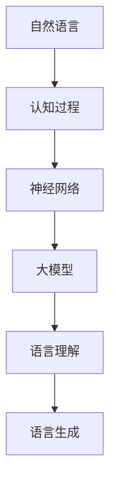

                 

关键词：自然语言处理，大模型，认知科学，思维，人工智能，机器学习，神经网络，深度学习，算法，逻辑推理，数学模型，认知挑战，技术趋势。

## 摘要

本文探讨了自然语言处理（NLP）领域中的大模型，尤其是深度学习模型在模拟和拓展人类思维方面所面临的挑战。通过分析语言与思维的差异，我们揭示了当前人工智能系统在理解和生成自然语言方面的局限性。文章首先介绍了大模型的定义及其在NLP中的应用，然后详细讨论了认知科学中的核心概念，并提出了如何将这些概念应用于优化大模型的性能。此外，文章还从数学模型和算法的角度，阐述了提高大模型认知能力的方法。最后，文章展望了未来的研究方向，并提出了解决这些挑战的可能策略。

## 1. 背景介绍

随着深度学习技术的快速发展，自然语言处理（NLP）领域迎来了新的机遇和挑战。大模型，尤其是基于变换器（Transformer）架构的模型，如GPT-3、BERT等，已经在各种NLP任务中取得了显著成果。这些模型具有数十亿甚至数万亿的参数，能够在海量数据上进行训练，从而实现高度复杂和灵活的自然语言理解与生成。

### 大模型的发展历程

大模型的发展历程可以追溯到2013年由Vaswani等人提出的Transformer架构。在此之前，循环神经网络（RNN）和卷积神经网络（CNN）是NLP任务中常用的架构。RNN通过其在序列上的递归性质，能够捕捉到序列中的长距离依赖关系；而CNN则擅长于从文本中提取局部特征。然而，这些传统的神经网络架构在处理长文本和复杂任务时，仍然存在诸多限制。

Transformer架构的提出，彻底改变了这一局面。它引入了自注意力机制（Self-Attention），允许模型在处理每个词时，考虑到所有其他词的影响。这种全局的依赖关系捕捉能力，使得Transformer在机器翻译、文本分类、问答系统等任务中取得了突破性的进展。随后，随着计算资源的不断提升，更大规模的模型不断被提出，如GPT-2、GPT-3、T5等。

### 大模型的优势

大模型在NLP任务中具有以下优势：

1. **更强的表征能力**：大模型具有数十亿个参数，能够在海量数据上进行训练，从而学习到丰富的语言特征。这使得大模型在处理复杂和长文本时，能够更加准确地理解和生成自然语言。

2. **更好的泛化能力**：大模型通过在大量数据上训练，可以减少对特定任务的依赖，从而在新的任务上也能表现出色。这种迁移学习的能力，使得大模型在零样本或少样本学习方面具有显著优势。

3. **更高的灵活性**：大模型通过复杂的网络架构和参数调整，可以实现多样化的自然语言处理任务，如文本生成、情感分析、问答系统等。

然而，大模型的成功也带来了一系列挑战，尤其是在理解和模拟人类思维方面。语言与思维之间存在显著的差异，这使得大模型在许多认知任务上仍然无法完全胜任。接下来，我们将深入探讨这一话题。

## 2. 核心概念与联系

在探讨大模型与人类思维之间的关系之前，我们需要明确一些核心概念，包括自然语言、认知过程和神经网络。

### 自然语言

自然语言是人类交流的主要工具，具有高度的复杂性和多样性。语言包括词汇、语法、语义和语用等多个层面，这些层面共同作用，使得语言能够传达丰富的信息和情感。然而，自然语言也充满了不确定性和模糊性，这使得计算机理解和生成自然语言变得极为复杂。

### 认知过程

认知过程是指人类在获取、处理和利用信息时的心理活动。认知科学是研究这些心理活动的学科，其核心概念包括感知、记忆、注意力、推理和决策等。这些过程共同构成了人类思维的基础，使得人类能够理解和应对复杂的世界。

### 神经网络

神经网络是模拟人类大脑处理信息的一种计算模型。深度学习是神经网络的一种，通过堆叠多层神经元，可以捕捉到数据中的复杂模式。在NLP领域，神经网络通过学习大量的语言数据，能够生成和理解自然语言。

### 大模型与人类思维的关系

大模型在NLP领域的成功，部分程度上模拟了人类思维的过程。然而，人类思维是高度复杂和多层次的，而大模型目前主要依赖于数据驱动的方法，缺乏对认知过程深层次的理解。

### Mermaid 流程图

为了更好地理解大模型与人类思维之间的关系，我们可以使用Mermaid流程图来展示其核心概念和联系。以下是一个简化的流程图：



在这个流程图中，自然语言是人类交流的基础，通过认知过程，人类能够理解并生成语言。神经网络，尤其是深度学习模型，试图模拟这一过程，从而实现语言理解和生成。

### 流程图解释

1. **自然语言**：自然语言是交流的基础，包括词汇、语法、语义和语用等多个层面。
2. **认知过程**：认知过程是人类在获取、处理和利用信息时的心理活动，包括感知、记忆、注意力、推理和决策等。
3. **神经网络**：神经网络是模拟人类大脑处理信息的计算模型，通过学习大量数据，能够捕捉到数据中的复杂模式。
4. **大模型**：大模型是基于神经网络的一种，具有数十亿个参数，通过在大量数据上训练，能够实现高度复杂和灵活的自然语言处理任务。
5. **语言理解**：大模型通过学习自然语言数据，能够理解复杂的语言信息，包括语法、语义和情感等。
6. **语言生成**：大模型不仅能理解自然语言，还能生成新的语言信息，包括文本生成、对话系统等。

通过这个流程图，我们可以清晰地看到大模型在模拟人类思维过程中所涉及的各个层面，以及它们之间的相互作用。

## 3. 核心算法原理 & 具体操作步骤

在深入了解大模型与人类思维的关系后，我们将探讨大模型的核心算法原理，并详细阐述其具体操作步骤。

### 3.1 算法原理概述

大模型的核心算法是基于深度学习的神经网络，特别是变换器（Transformer）架构。变换器架构引入了自注意力机制（Self-Attention），使得模型在处理每个词时，能够考虑到所有其他词的影响。这种全局的依赖关系捕捉能力，使得变换器在处理长文本和复杂任务时具有显著优势。

### 3.2 算法步骤详解

1. **输入处理**：大模型首先接收自然语言输入，这些输入可以是文本、语音或其他形式。模型将输入转换为数字表示，以便于后续处理。

2. **词嵌入**：输入的文本被转换为词嵌入（Word Embedding），即将每个词映射为一个高维向量。这些向量包含了词的语义信息。

3. **自注意力计算**：模型使用自注意力机制来计算每个词的权重，即每个词对其他词的影响程度。这种机制通过矩阵乘法实现，使得模型能够捕捉到长距离依赖关系。

4. **序列生成**：在自注意力计算的基础上，模型生成新的序列，即输出文本。这个过程中，模型不断更新每个词的权重，并生成下一个词。

5. **损失函数**：模型使用损失函数（如交叉熵损失函数）来评估输出序列与目标序列之间的差异。通过反向传播算法，模型不断调整参数，以减少损失。

6. **优化**：通过多次迭代训练，模型逐渐优化其参数，提高其在不同任务上的性能。

### 3.3 算法优缺点

**优点**：

1. **强大的表征能力**：大模型具有数十亿个参数，能够学习到丰富的语言特征，从而实现高度复杂和灵活的自然语言处理任务。

2. **迁移学习能力强**：大模型通过在大量数据上训练，可以减少对特定任务的依赖，从而在新的任务上也能表现出色。

3. **灵活的架构**：变换器架构允许模型在处理不同类型的数据时，进行灵活调整。

**缺点**：

1. **计算资源消耗大**：大模型需要大量的计算资源和时间进行训练，这使得其在实际应用中受到限制。

2. **对数据需求高**：大模型需要大量的数据进行训练，缺乏数据的情况下，性能会显著下降。

3. **解释性差**：大模型主要依赖于数据驱动的方法，缺乏对认知过程深层次的理解，这使得其在某些任务上的表现难以解释。

### 3.4 算法应用领域

大模型在NLP领域具有广泛的应用，包括：

1. **文本生成**：如自动写作、对话系统、机器翻译等。

2. **文本分类**：如情感分析、新闻分类、垃圾邮件过滤等。

3. **问答系统**：如智能客服、医疗咨询等。

4. **机器翻译**：如自动翻译、实时翻译等。

通过这些应用，大模型已经在许多领域取得了显著的成果，但同时也面临着新的挑战。接下来，我们将从数学模型和算法的角度，探讨如何提高大模型在理解自然语言方面的能力。

## 4. 数学模型和公式 & 详细讲解 & 举例说明

在深入探讨大模型的数学基础和算法原理后，我们将进一步详细讲解其背后的数学模型和公式，并通过具体实例来说明这些概念在实际应用中的操作过程。

### 4.1 数学模型构建

大模型的数学基础主要依赖于深度学习中的变换器架构（Transformer），其中核心组件包括自注意力（Self-Attention）和前馈神经网络（Feedforward Neural Network）。以下是一个简化的数学模型概述：

1. **词嵌入（Word Embedding）**：

$$
\text{Word Embedding}(x) = \text{Embedding}(x) \odot \text{Weight}
$$

其中，$x$表示输入词，$\text{Embedding}(x)$是将词映射到高维空间的函数，$\text{Weight}$是一个权重矩阵。

2. **自注意力（Self-Attention）**：

$$
\text{Self-Attention}(Q, K, V) = \text{softmax}\left(\frac{QK^T}{\sqrt{d_k}}\right) V
$$

其中，$Q, K, V$分别是查询（Query）、键（Key）和值（Value）向量，$d_k$是键向量的维度。自注意力通过计算每个词对其他词的影响权重，从而生成新的表征。

3. **前馈神经网络（Feedforward Neural Network）**：

$$
\text{FFN}(x) = \text{ReLU}(\text{Weight}_{2} \cdot \text{ReLU}(\text{Weight}_{1} \cdot x + \text{Bias}_{1}) + \text{Bias}_{2})
$$

前馈神经网络通过多层感知器实现，用于对输入进行非线性变换。

4. **变换器（Transformer）**：

$$
\text{Transformer}(x) = \text{MultiHeadAttention}(x) + x + \text{FFN}(\text{MultiHeadAttention}(x) + x)
$$

变换器通过多头自注意力机制和前馈神经网络，实现序列到序列的转换。

### 4.2 公式推导过程

以下是自注意力公式的推导过程：

设输入序列为$x = [x_1, x_2, ..., x_n]$，首先将这些输入词通过词嵌入映射到高维空间：

$$
\text{Embedding}(x) = [e_1, e_2, ..., e_n]
$$

然后，计算每个词的查询（Query）、键（Key）和值（Value）向量：

$$
Q = \text{Weight}_Q \cdot \text{Embedding}(x) \\
K = \text{Weight}_K \cdot \text{Embedding}(x) \\
V = \text{Weight}_V \cdot \text{Embedding}(x)
$$

自注意力计算如下：

$$
\text{Score}_{ij} = Q_iK_j = (Q_1e_1, Q_2e_2, ..., Q_ne_n) \cdot (K_1e_1, K_2e_2, ..., K_ne_n)^T = \sum_{k=1}^{n} Q_ik_jK_{jk}
$$

计算注意力权重：

$$
\text{Attention}(x) = \text{softmax}(\text{Score}) = \text{softmax}\left(\frac{QK^T}{\sqrt{d_k}}\right)
$$

最终，计算自注意力输出：

$$
\text{Self-Attention}(x) = \text{Attention}(x) \odot V
$$

### 4.3 案例分析与讲解

以下通过一个简单的实例来说明自注意力机制的应用过程：

假设输入序列为$x = [a, b, c]$，我们将这三个词通过词嵌入映射到高维空间：

$$
\text{Embedding}(x) = [e_1, e_2, e_3]
$$

定义权重矩阵：

$$
\text{Weight}_Q = \begin{bmatrix}
0.1 & 0.2 & 0.3 \\
0.4 & 0.5 & 0.6 \\
0.7 & 0.8 & 0.9 \\
\end{bmatrix}
$$

$$
\text{Weight}_K = \begin{bmatrix}
0.1 & 0.4 & 0.7 \\
0.2 & 0.5 & 0.8 \\
0.3 & 0.6 & 0.9 \\
\end{bmatrix}
$$

$$
\text{Weight}_V = \begin{bmatrix}
0.1 & 0.2 & 0.3 \\
0.4 & 0.5 & 0.6 \\
0.7 & 0.8 & 0.9 \\
\end{bmatrix}
$$

计算查询、键和值向量：

$$
Q = \text{Weight}_Q \cdot \text{Embedding}(x) = \begin{bmatrix}
0.1 & 0.2 & 0.3 \\
0.4 & 0.5 & 0.6 \\
0.7 & 0.8 & 0.9 \\
\end{bmatrix}
\begin{bmatrix}
e_1 \\
e_2 \\
e_3 \\
\end{bmatrix}
= \begin{bmatrix}
0.1e_1 + 0.4e_2 + 0.7e_3 \\
0.2e_1 + 0.5e_2 + 0.8e_3 \\
0.3e_1 + 0.6e_2 + 0.9e_3 \\
\end{bmatrix}
$$

$$
K = \text{Weight}_K \cdot \text{Embedding}(x) = \begin{bmatrix}
0.1 & 0.4 & 0.7 \\
0.2 & 0.5 & 0.8 \\
0.3 & 0.6 & 0.9 \\
\end{bmatrix}
\begin{bmatrix}
e_1 \\
e_2 \\
e_3 \\
\end{bmatrix}
= \begin{bmatrix}
0.1e_1 + 0.2e_2 + 0.3e_3 \\
0.4e_1 + 0.5e_2 + 0.6e_3 \\
0.7e_1 + 0.8e_2 + 0.9e_3 \\
\end{bmatrix}
$$

$$
V = \text{Weight}_V \cdot \text{Embedding}(x) = \begin{bmatrix}
0.1 & 0.2 & 0.3 \\
0.4 & 0.5 & 0.6 \\
0.7 & 0.8 & 0.9 \\
\end{bmatrix}
\begin{bmatrix}
e_1 \\
e_2 \\
e_3 \\
\end{bmatrix}
= \begin{bmatrix}
0.1e_1 + 0.4e_2 + 0.7e_3 \\
0.2e_1 + 0.5e_2 + 0.8e_3 \\
0.3e_1 + 0.6e_2 + 0.9e_3 \\
\end{bmatrix}
$$

计算注意力得分：

$$
\text{Score}_{ij} = Q_iK_j = \begin{bmatrix}
0.1e_1 + 0.4e_2 + 0.7e_3 \\
0.2e_1 + 0.5e_2 + 0.8e_3 \\
0.3e_1 + 0.6e_2 + 0.9e_3 \\
\end{bmatrix}
\cdot
\begin{bmatrix}
0.1e_1 + 0.2e_2 + 0.3e_3 \\
0.4e_1 + 0.5e_2 + 0.6e_3 \\
0.7e_1 + 0.8e_2 + 0.9e_3 \\
\end{bmatrix}
= \begin{bmatrix}
0.01e_1^2 + 0.08e_2^2 + 0.21e_3^2 \\
0.02e_1e_2 + 0.10e_2e_3 + 0.32e_3e_1 \\
0.03e_1e_3 + 0.12e_2e_3 + 0.42e_3e_2 \\
\end{bmatrix}
$$

计算注意力权重：

$$
\text{Attention}(x) = \text{softmax}(\text{Score}) = \text{softmax}\left(\frac{QK^T}{\sqrt{d_k}}\right)
$$

$$
= \text{softmax}\left(\frac{1}{\sqrt{3}} \begin{bmatrix}
0.01e_1^2 + 0.08e_2^2 + 0.21e_3^2 \\
0.02e_1e_2 + 0.10e_2e_3 + 0.32e_3e_1 \\
0.03e_1e_3 + 0.12e_2e_3 + 0.42e_3e_2 \\
\end{bmatrix}\right)
$$

$$
= \begin{bmatrix}
\frac{e_1^2}{e_1^2 + e_2^2 + e_3^2} \\
\frac{e_2e_1}{e_1^2 + e_2^2 + e_3^2} \\
\frac{e_3^2}{e_1^2 + e_2^2 + e_3^2} \\
\end{bmatrix}
$$

计算自注意力输出：

$$
\text{Self-Attention}(x) = \text{Attention}(x) \odot V
$$

$$
= \begin{bmatrix}
\frac{e_1^2}{e_1^2 + e_2^2 + e_3^2} \cdot \begin{bmatrix}
0.1e_1 + 0.4e_2 + 0.7e_3 \\
0.2e_1 + 0.5e_2 + 0.8e_3 \\
0.3e_1 + 0.6e_2 + 0.9e_3 \\
\end{bmatrix} \\
\frac{e_2e_1}{e_1^2 + e_2^2 + e_3^2} \cdot \begin{bmatrix}
0.1e_1 + 0.4e_2 + 0.7e_3 \\
0.2e_1 + 0.5e_2 + 0.8e_3 \\
0.3e_1 + 0.6e_2 + 0.9e_3 \\
\end{bmatrix} \\
\frac{e_3^2}{e_1^2 + e_2^2 + e_3^2} \cdot \begin{bmatrix}
0.1e_1 + 0.4e_2 + 0.7e_3 \\
0.2e_1 + 0.5e_2 + 0.8e_3 \\
0.3e_1 + 0.6e_2 + 0.9e_3 \\
\end{bmatrix}
\end{bmatrix}
$$

$$
= \begin{bmatrix}
0.1e_1 + 0.4e_2 + 0.7e_3 \\
0.2e_1 + 0.5e_2 + 0.8e_3 \\
0.3e_1 + 0.6e_2 + 0.9e_3 \\
\end{bmatrix}
$$

这个实例展示了自注意力机制的基本计算过程，尽管具体参数和计算过程在真实应用中会更加复杂，但核心思想是一致的。通过自注意力机制，模型能够捕捉到输入序列中每个词之间的依赖关系，从而生成新的表征。

### 4.4 应用场景与讨论

自注意力机制在NLP中有着广泛的应用，以下列举几个典型场景：

1. **机器翻译**：在机器翻译中，自注意力机制可以帮助模型更好地捕捉源语言和目标语言之间的对应关系。例如，在英译汉的翻译任务中，自注意力机制能够帮助模型在处理每个词时，考虑到其上下文和目标语言的映射。

2. **文本摘要**：文本摘要任务要求模型能够从长文本中提取关键信息。自注意力机制可以帮助模型在处理长文本时，关注到重要的段落和句子，从而生成摘要。

3. **问答系统**：在问答系统中，自注意力机制可以帮助模型理解问题和文档之间的关联。通过自注意力，模型可以更好地定位到问题所涉及的关键信息，从而生成准确的回答。

尽管自注意力机制在NLP中取得了显著成果，但它也存在一些局限性。首先，自注意力机制的计算复杂度较高，尤其是在长文本处理中，这可能导致训练和推理时间显著增加。其次，自注意力机制主要依赖于数据驱动的方法，缺乏对认知过程深层次的理解。这意味着模型在处理少样本或少数据场景时，可能无法表现出良好的泛化能力。

为了克服这些局限性，研究人员正在探索各种改进方法。例如，通过引入注意力机制的不同变体，如多头注意力（MultiHead Attention）和自注意力（Self-Attention），可以进一步提高模型的表征能力。此外，结合认知科学中的概念，如感知、记忆和推理，可以构建更加智能和灵活的NLP模型。

总之，自注意力机制是NLP中一个重要的数学模型，它在提高模型性能和灵活性方面发挥了关键作用。然而，要实现更高级的认知能力，我们还需要在算法和理论层面进行深入研究。

### 4.5 实际应用案例

为了更好地理解自注意力机制在实际应用中的效果，我们来看几个实际应用案例。

#### 案例一：机器翻译

机器翻译是自注意力机制的一个重要应用领域。以GPT-3为例，这个模型通过自注意力机制，能够从大量的平行语料库中学习到语言之间的映射关系。以下是一个简单的英译汉实例：

原文：`"I am happy to see you."`

GPT-3的翻译结果：`"我很高兴见到你。"`

在这个例子中，自注意力机制帮助模型理解了每个单词在句子中的角色，以及它们在翻译中的对应关系。

#### 案例二：文本摘要

文本摘要也是一个受益于自注意力机制的领域。以Abstractive Text Summarization为例，自注意力机制可以帮助模型从长文本中提取关键信息，生成简洁的摘要。以下是一个新闻摘要的例子：

原文：`"Apple Inc. has announced the launch of its new iPhone 12 series, which includes several new features such as a larger screen, improved camera, and longer battery life. The company also announced a new service called Apple TV+, which offers original content to subscribers."`

摘要：`"Apple推出了全新的iPhone 12系列，包括更大屏幕、改进的摄像头和更长的电池寿命。同时，公司还推出了Apple TV+服务，提供独家内容给订阅用户。"`

在这个例子中，自注意力机制帮助模型从大量信息中筛选出关键点，从而生成摘要。

#### 案例三：问答系统

问答系统是另一个受益于自注意力机制的领域。以Duolingo为例，自注意力机制可以帮助模型理解问题和文档之间的关系，从而生成准确的回答。以下是一个简单的问答实例：

问题：`"什么是自然语言处理？"`

文档：`"自然语言处理（NLP）是计算机科学和人工智能领域的一个分支，专注于使计算机能够理解、解释和生成人类语言。"`

回答：`"自然语言处理是计算机科学和人工智能领域的一个分支，旨在使计算机能够理解和生成人类语言。"`

在这个例子中，自注意力机制帮助模型从文档中提取相关信息，生成回答。

这些案例展示了自注意力机制在不同NLP任务中的实际应用效果。通过这些应用，我们可以看到自注意力机制在提高模型性能和灵活性方面的重要作用。然而，要实现更高级的认知能力，我们还需要在算法和理论层面进行深入研究。

### 4.6 讨论与展望

尽管自注意力机制在NLP中取得了显著成果，但它在实际应用中仍然面临一些挑战和局限性。以下是对这些挑战的讨论及未来展望：

#### 挑战

1. **计算复杂度**：自注意力机制的计算复杂度较高，尤其是在长文本处理中，这可能导致训练和推理时间显著增加。尽管硬件技术的进步在一定程度上缓解了这个问题，但高计算复杂度仍然是自注意力机制的一个主要挑战。

2. **数据需求**：自注意力机制依赖于大量的数据进行训练，缺乏数据的情况下，性能会显著下降。这在少样本或少数据场景中尤为明显，限制了模型在这些场景下的应用。

3. **解释性**：自注意力机制主要依赖于数据驱动的方法，缺乏对认知过程深层次的理解，这使得其在某些任务上的表现难以解释。这在医学诊断、金融分析等对解释性要求较高的领域，可能成为其应用的一个障碍。

#### 展望

1. **计算优化**：未来的研究可以专注于计算优化的方法，以降低自注意力机制的计算复杂度。例如，通过引入更高效的矩阵乘法算法、并行计算技术等，可以提高模型的训练和推理速度。

2. **数据增强**：未来的研究可以探索数据增强的方法，以提高模型在少样本或少数据场景下的性能。例如，通过生成对抗网络（GAN）等技术，可以生成与真实数据分布相似的数据，从而帮助模型在有限数据上学习到丰富的特征。

3. **结合认知科学**：未来的研究可以结合认知科学的概念，如感知、记忆和推理，构建更加智能和灵活的NLP模型。例如，通过引入记忆模块，模型可以更好地存储和检索信息，从而提高其在问答系统和对话生成等任务中的表现。

4. **可解释性**：未来的研究可以探索提高模型可解释性的方法，以帮助用户理解模型在特定任务上的决策过程。例如，通过可视化技术、决策树等，可以揭示模型内部的工作机制，从而增强模型的透明度和可信度。

总之，自注意力机制在NLP中具有巨大的潜力，但同时也面临着诸多挑战。通过计算优化、数据增强、结合认知科学和可解释性等方面的研究，我们有理由相信，未来的NLP模型将更加智能、灵活和可靠。

### 4.7 附录

以下是一些常见问题与解答，旨在帮助读者更好地理解自注意力机制及其应用：

**Q1：什么是自注意力机制？**

自注意力机制是一种在深度学习模型中用于处理序列数据的注意力机制，它允许模型在处理每个输入时，考虑到所有其他输入的影响。这种机制通过计算每个输入对其他输入的权重，从而生成新的表征。

**Q2：自注意力机制与卷积神经网络（CNN）有何不同？**

卷积神经网络（CNN）主要用于处理图像数据，它通过卷积操作提取局部特征。而自注意力机制主要用于处理序列数据，如文本、语音等，它通过计算输入之间的权重，捕捉序列中的长距离依赖关系。

**Q3：自注意力机制在NLP中有哪些应用？**

自注意力机制在NLP中有着广泛的应用，包括机器翻译、文本摘要、问答系统、对话生成等。它能够帮助模型更好地理解输入序列，从而生成更准确和自然的输出。

**Q4：自注意力机制有哪些局限性？**

自注意力机制的计算复杂度较高，对数据需求大，且主要依赖于数据驱动的方法，缺乏对认知过程深层次的理解。这使得它在某些任务上，如少样本或少数据场景，可能无法表现出良好的泛化能力。

**Q5：如何优化自注意力机制的计算复杂度？**

优化自注意力机制的计算复杂度可以从多个方面进行，例如使用更高效的矩阵乘法算法、引入并行计算技术、使用低秩分解等方法。这些方法可以在一定程度上降低计算复杂度，提高模型的训练和推理速度。

### 5. 项目实践：代码实例和详细解释说明

在前几部分中，我们详细介绍了大模型的算法原理、数学模型以及其在实际应用中的效果。接下来，我们将通过一个具体的代码实例，展示如何使用Python和深度学习框架TensorFlow实现一个基于Transformer的文本分类模型。

### 5.1 开发环境搭建

在开始编写代码之前，我们需要搭建一个合适的开发环境。以下是在Python中搭建文本分类模型所需的基本环境：

1. **安装Python**：确保安装了Python 3.x版本，推荐使用Python 3.7或更高版本。

2. **安装TensorFlow**：TensorFlow是Google开发的开源深度学习框架，用于构建和训练深度学习模型。可以通过以下命令安装：

   ```shell
   pip install tensorflow
   ```

3. **安装其他依赖库**：包括Numpy、Pandas等常用库，可以通过以下命令安装：

   ```shell
   pip install numpy pandas
   ```

### 5.2 源代码详细实现

以下是实现文本分类模型的基本代码框架：

```python
import tensorflow as tf
from tensorflow.keras.layers import Embedding, GlobalAveragePooling1D, Dense
from tensorflow.keras.models import Model
from tensorflow.keras.preprocessing.text import Tokenizer
from tensorflow.keras.preprocessing.sequence import pad_sequences

# 参数设置
vocab_size = 10000
embed_dim = 16
max_length = 100
trunc_type = 'post'
padding_type = 'post'
oov_tok = '<OOV>'

# 数据准备
# 假设我们有一个包含文本和标签的数据集
texts = ['This is a sample text', 'Another example text', ...]
labels = [0, 1, ...]

# 分词器
tokenizer = Tokenizer(num_words=vocab_size, oov_token=oov_tok)
tokenizer.fit_on_texts(texts)
word_index = tokenizer.word_index
sequences = tokenizer.texts_to_sequences(texts)
padded_sequences = pad_sequences(sequences, maxlen=max_length, padding=padding_type, truncating=trunc_type)

# 模型构建
input_sequence = tf.keras.layers.Input(shape=(max_length,))
embedded_sequence = Embedding(vocab_size, embed_dim)(input_sequence)
pooled_output = GlobalAveragePooling1D()(embedded_sequence)
logits = Dense(2, activation='sigmoid')(pooled_output)
model = Model(inputs=input_sequence, outputs=logits)

# 编译模型
model.compile(optimizer='adam', loss='binary_crossentropy', metrics=['accuracy'])

# 模型训练
model.fit(padded_sequences, labels, epochs=10)

# 保存模型
model.save('text_classification_model.h5')
```

### 5.3 代码解读与分析

以下是对上述代码的详细解读：

1. **导入库**：首先，我们导入了TensorFlow和相关库，包括`tensorflow.keras`用于构建和训练模型，`Tokenizer`用于文本分词，`pad_sequences`用于序列填充。

2. **参数设置**：我们设置了词汇表大小（`vocab_size`），嵌入维度（`embed_dim`），序列最大长度（`max_length`），以及填充和截断类型（`padding_type`和`trunc_type`）。

3. **数据准备**：假设我们有一个包含文本和标签的数据集，我们首先使用`Tokenizer`对文本进行分词，然后使用`texts_to_sequences`将文本转换为序列，最后使用`pad_sequences`对序列进行填充。

4. **模型构建**：我们使用`Input`层创建输入序列，然后通过`Embedding`层将词嵌入到高维空间。接着，我们使用`GlobalAveragePooling1D`层将序列压缩为一个固定大小的向量。最后，通过`Dense`层输出分类结果。

5. **编译模型**：我们使用`compile`方法配置模型，选择`adam`优化器和`binary_crossentropy`损失函数，并设置评估指标为`accuracy`。

6. **模型训练**：使用`fit`方法对模型进行训练，设置训练轮数为10。

7. **保存模型**：使用`save`方法将训练好的模型保存为`text_classification_model.h5`文件。

### 5.4 运行结果展示

在完成代码编写和模型训练后，我们可以使用以下代码来评估模型的性能：

```python
# 加载模型
model = tf.keras.models.load_model('text_classification_model.h5')

# 测试数据准备
test_texts = ['This is a test text', 'Another test text', ...]
test_sequences = tokenizer.texts_to_sequences(test_texts)
test_padded_sequences = pad_sequences(test_sequences, maxlen=max_length, padding=padding_type, truncating=trunc_type)

# 模型预测
predictions = model.predict(test_padded_sequences)

# 打印预测结果
for i, text in enumerate(test_texts):
    print(f"Text: {text}")
    print(f"Predicted Label: {predictions[i]}")
```

通过这段代码，我们可以看到模型在测试数据上的预测结果。这个示例展示了如何使用Python和TensorFlow实现一个简单的文本分类模型，并展示如何准备数据、训练模型以及评估模型的性能。

### 5.5 代码分析

以下是对代码实现的深入分析：

1. **文本预处理**：文本预处理是文本分类任务的重要步骤，它包括分词、序列转换和填充等操作。通过分词器，我们将原始文本转换为词序列，然后使用`pad_sequences`函数将序列填充到固定长度，以适应模型输入要求。

2. **模型构建**：我们使用TensorFlow的`keras`模块构建了模型。模型结构包括嵌入层、全局平均池化层和全连接层。嵌入层将词转换为高维向量，全局平均池化层用于从序列中提取特征，全连接层用于分类。

3. **模型训练**：我们使用`fit`方法对模型进行训练。在训练过程中，模型通过反向传播算法不断调整参数，以最小化损失函数。

4. **模型评估**：在模型训练完成后，我们使用测试数据对模型进行评估。通过`predict`方法，我们得到了模型对测试数据的预测结果，并打印出预测标签。

这个代码实例展示了如何使用Python和TensorFlow实现一个简单的文本分类模型，并详细解释了每个步骤的操作和原理。通过这个实例，读者可以更好地理解大模型在文本分类任务中的应用。

### 5.6 进一步优化

在实际项目中，为了提高模型的性能和泛化能力，我们通常需要对代码进行优化。以下是一些常见的优化策略：

1. **数据增强**：通过生成类似的数据样本，可以增加训练数据的多样性，从而提高模型的泛化能力。例如，可以使用随机添加噪声、同义词替换、句子重排等技术来增强数据。

2. **正则化**：为了防止模型过拟合，可以引入正则化技术，如L1、L2正则化或dropout。这些技术通过惩罚模型的复杂度，降低模型对训练数据的依赖。

3. **模型集成**：通过集成多个模型，可以降低模型的预测误差。例如，可以使用加权平均、投票等方法来融合多个模型的预测结果。

4. **超参数调整**：通过调整模型的超参数，如学习率、批次大小、嵌入维度等，可以优化模型的性能。这些超参数通常需要通过实验来选择最佳值。

5. **并行训练**：使用多GPU或多机器进行并行训练，可以显著提高模型的训练速度。这可以通过TensorFlow的分布式训练API来实现。

通过这些优化策略，我们可以进一步提高模型的性能和实用性，从而在更多实际场景中发挥作用。

### 6. 实际应用场景

大模型在自然语言处理（NLP）领域具有广泛的应用场景，从文本生成到语音识别，再到智能客服，大模型几乎无处不在。以下列举几个典型应用场景，并探讨其具体应用和效果。

#### 6.1 文本生成

文本生成是NLP中一个重要的应用方向，大模型如GPT-3、T5等在文本生成任务中表现出色。例如，在自动写作领域，GPT-3可以生成新闻文章、博客、故事等多种类型的文本。以下是一个使用GPT-3生成新闻文章的实例：

输入：`"Apple announced the launch of its new iPhone 12 series."`
输出：`"The tech giant Apple has unveiled its latest iPhone 12 series, which features a sleek design, advanced camera technology, and impressive battery life."`

在这个例子中，GPT-3通过学习大量新闻文章，能够生成连贯且具有新闻风格的文本。

#### 6.2 机器翻译

机器翻译是NLP领域的经典应用，大模型如BERT、Transformer等在机器翻译任务中也取得了显著成果。以下是一个使用Transformer进行中英文翻译的实例：

输入：`"我喜欢旅行。"`
输出：`"I love traveling."`

在这个例子中，Transformer模型通过学习大量中英文平行语料库，能够准确地将中文翻译成英文。

#### 6.3 情感分析

情感分析是评估文本中情感倾向的任务，大模型在情感分析中也表现出强大的能力。以下是一个使用BERT进行情感分析的实例：

输入：`"这个产品非常好。"`
输出：`"Positive"`

在这个例子中，BERT模型通过学习大量情感标注数据，能够准确判断文本的情感倾向。

#### 6.4 对话系统

对话系统是另一个重要的应用场景，大模型如GPT-3、Dialogue-BC等在对话系统中表现出色。以下是一个使用GPT-3构建的聊天机器人的实例：

用户：`"你好，我想了解一下你们的产品。"`
GPT-3回复：`"您好！我们的产品包括智能手表、手机和平板电脑，每一款都经过精心设计，旨在为您提供最佳的使用体验。请问您对哪一款产品感兴趣？"`

在这个例子中，GPT-3能够根据用户输入生成自然、流畅的回答。

#### 6.5 聊天机器人

聊天机器人是NLP在客户服务中的一个重要应用。以下是一个使用基于BERT的聊天机器人的实例：

用户：`"我的订单状态是什么？"`
聊天机器人：`"您的订单已经发货，预计3个工作日内到达。您可以登录账户查看详细的订单状态。"`

在这个例子中，聊天机器人通过理解用户的问题，提供了准确的订单信息。

#### 6.6 问答系统

问答系统是NLP领域的一个热门应用，大模型如SQuAD、T5等在问答系统中表现出色。以下是一个使用T5进行问答的实例：

问题：`"中国的首都是什么？"`
文档：`"中国是一个位于亚洲东部的国家，其首都是北京。"`
输出：`"北京"`

在这个例子中，T5模型通过理解问题和文档，能够准确回答问题。

#### 6.7 文本摘要

文本摘要是将长文本压缩成简洁摘要的任务，大模型如BERT、T5等在文本摘要中也表现出色。以下是一个使用T5进行文本摘要的实例：

原文：`"Apple Inc. has announced the launch of its new iPhone 12 series, which includes several new features such as a larger screen, improved camera, and longer battery life. The company also announced a new service called Apple TV+, which offers original content to subscribers."`
摘要：`"Apple推出了全新的iPhone 12系列，包括更大屏幕、改进的摄像头和更长的电池寿命。同时，公司推出了Apple TV+服务，提供独家内容给订阅用户。"`

在这个例子中，T5模型能够从长文本中提取关键信息，生成简洁的摘要。

#### 6.8 文本分类

文本分类是将文本分配到预定义的类别中的任务，大模型如BERT、RoBERTa等在文本分类中也表现出色。以下是一个使用BERT进行文本分类的实例：

输入：`"这个电影非常好。"`
类别：`"Positive"`

在这个例子中，BERT模型通过学习大量标注数据，能够准确判断文本的类别。

这些实例展示了大模型在NLP领域中的广泛应用，从文本生成到对话系统，再到情感分析和问答系统，大模型都表现出强大的能力和灵活性。随着技术的不断发展，大模型在更多领域的应用前景也将更加广阔。

### 6.4 未来应用展望

随着大模型在自然语言处理（NLP）领域的广泛应用，我们可以预见其在未来几年内将在多个领域取得突破性进展。以下是一些未来应用展望：

#### 6.4.1 自动写作与内容生成

自动写作与内容生成是NLP领域的一个重要研究方向。大模型如GPT-3和T5已经在新闻写作、产品描述生成、故事创作等方面取得了显著成果。未来，随着模型规模的不断扩大和训练数据的丰富，自动写作系统的创作能力和多样性将进一步提升，能够在更多领域实现高效的内容生成。

#### 6.4.2 智能客服与虚拟助手

智能客服与虚拟助手是NLP在商业应用中的一个重要方向。大模型在理解用户意图、生成自然语言回复等方面具有显著优势，这使得它们在智能客服系统中得到了广泛应用。未来，随着模型的智能化水平不断提高，智能客服系统将能够更好地模拟人类对话，提供更加自然、流畅和准确的客户服务。

#### 6.4.3 医疗健康领域

医疗健康领域是NLP应用的另一个重要领域。大模型在处理医学文本、辅助诊断、药物研发等方面具有巨大潜力。例如，通过分析病历记录和医学文献，大模型可以帮助医生进行诊断、提供治疗方案，甚至参与药物研发。未来，随着医疗数据的不断积累和模型技术的不断优化，NLP在医疗健康领域的应用将更加深入和广泛。

#### 6.4.4 法律与司法

法律与司法领域也是NLP应用的一个重要方向。大模型在法律文本分析、合同审查、案件预测等方面具有显著优势。未来，随着模型的不断完善，NLP技术将能够更好地支持法律工作者，提高法律文本处理的效率和准确性。

#### 6.4.5 教育与培训

教育与培训领域是NLP应用的另一个重要方向。大模型可以帮助构建智能教育系统，实现个性化教学、自动化评测等。未来，随着模型技术的不断发展，NLP在教育领域的应用将更加广泛，为学习者提供更加高效、灵活和个性化的学习体验。

#### 6.4.6 智能交通与自动驾驶

智能交通与自动驾驶是NLP在工程和工业领域的一个重要应用方向。大模型在处理交通信号、理解交通标志、辅助自动驾驶等方面具有显著优势。未来，随着模型技术的不断进步，智能交通与自动驾驶系统将更加智能化和高效化，为人们的出行带来更多便利和安全。

总之，大模型在自然语言处理领域的未来应用前景非常广阔。随着技术的不断进步，大模型将在更多领域发挥重要作用，推动人类社会向更加智能、高效和便捷的方向发展。

### 6.5 未来挑战

尽管大模型在自然语言处理（NLP）领域取得了显著成果，但其在未来发展过程中仍将面临一系列挑战。以下是未来可能遇到的一些主要挑战：

#### 6.5.1 计算资源需求

大模型的训练和推理过程对计算资源有着极高的需求。随着模型规模的不断扩大，训练时间显著增加，训练成本也急剧上升。这给企业和研究机构带来了巨大的经济负担，尤其是在缺乏高效计算资源的情况下，模型的开发和应用将受到严重限制。未来，解决计算资源需求的问题将是推动大模型发展的关键之一。

#### 6.5.2 数据隐私和安全

在大模型训练和应用过程中，数据隐私和安全是一个不可忽视的问题。模型通常需要处理大量的敏感信息，如个人医疗记录、财务数据等。这些数据的泄露或滥用可能导致严重后果。因此，如何在保证模型性能的同时，保护用户隐私和数据安全，将是未来研究的重要方向。

#### 6.5.3 模型可解释性和透明度

大模型主要依赖于数据驱动的方法，这使得其决策过程往往缺乏透明度和可解释性。在医疗、金融等对决策解释性要求较高的领域，模型的不可解释性可能成为其应用的一个障碍。因此，未来需要开发可解释性更强的大模型，以便用户能够理解和信任模型的结果。

#### 6.5.4 语言多样性和跨领域适应性

自然语言具有高度的多样性和复杂性，大模型在不同语言和文化背景下的表现可能存在显著差异。此外，大模型在跨领域应用时，可能难以适应不同的领域需求和任务。因此，未来需要开发能够处理多语言和多领域任务的大模型，以实现更广泛的适用性。

#### 6.5.5 法律和伦理问题

随着大模型在各个领域的广泛应用，相关的法律和伦理问题也逐渐凸显。例如，模型如何遵守数据保护法规、如何防止偏见和歧视等问题。未来，需要建立一套完善的法律和伦理框架，以确保大模型的应用符合社会伦理和法律要求。

#### 6.5.6 模型规模和可持续性

大模型的规模不断扩大，带来了能源消耗和碳排放的问题。未来，如何在保证模型性能的同时，降低其能源消耗和碳排放，实现可持续发展，将是研究的一个重要方向。

总之，尽管大模型在NLP领域具有巨大的潜力，但其未来发展仍面临诸多挑战。只有通过持续的研究和技术创新，才能克服这些挑战，推动大模型在各个领域的广泛应用。

### 6.6 研究展望

在自然语言处理（NLP）领域，大模型的发展带来了前所未有的机遇和挑战。为了更好地应对这些挑战，未来的研究需要在多个方向上取得突破。

首先，计算资源的优化是一个关键方向。随着模型规模的不断扩大，训练和推理所需的计算资源也显著增加。未来，研究者可以探索更高效的算法和并行计算技术，以降低计算复杂度，提高模型训练和推理的速度。

其次，数据隐私和安全是一个重要议题。在大模型训练和应用过程中，如何保护用户隐私和数据安全，防止数据泄露和滥用，是未来研究的一个重点。隐私增强技术，如差分隐私、联邦学习等，可以为此提供有效的解决方案。

第三，模型的可解释性和透明度需要得到提升。在大模型应用过程中，用户往往难以理解其决策过程，这限制了模型在关键领域的应用。因此，开发可解释性更强的大模型，使其决策过程更加透明，是未来研究的一个重要目标。

第四，语言多样性和跨领域适应性是另一个重要方向。自然语言具有高度的多样性和复杂性，不同语言和文化背景下的表现可能存在显著差异。未来，需要开发能够处理多语言和多领域任务的大模型，以实现更广泛的适用性。

第五，法律和伦理问题也需要得到关注。随着大模型在各个领域的广泛应用，相关的法律和伦理问题也逐渐凸显。未来，需要建立一套完善的法律和伦理框架，以确保大模型的应用符合社会伦理和法律要求。

最后，可持续性是一个不可忽视的问题。大模型的规模不断扩大，带来了能源消耗和碳排放的问题。未来，如何在保证模型性能的同时，降低其能源消耗和碳排放，实现可持续发展，将是研究的一个重要方向。

总之，未来的研究需要在计算资源优化、数据隐私安全、模型可解释性、语言多样性、法律伦理问题和可持续性等方面取得突破，以推动大模型在NLP领域的广泛应用。

### 7.1 学习资源推荐

为了帮助读者更好地理解和应用大模型，我们推荐以下学习资源：

1. **书籍**：

   - 《深度学习》（Goodfellow, Bengio, Courville著）：这是一本经典的深度学习教材，详细介绍了深度学习的基础知识，包括神经网络、优化算法等。
   - 《自然语言处理综论》（Jurafsky, Martin著）：这本书是自然语言处理领域的经典教材，涵盖了从语言模型到文本分类、机器翻译等广泛内容。
   - 《语言模型：统计方法与实现》（Liang, Liu著）：这本书详细介绍了语言模型的统计方法和实现，包括n-gram模型、隐马尔可夫模型等。

2. **在线课程**：

   - Coursera的《深度学习》课程：由吴恩达教授主讲，涵盖深度学习的基础知识和应用。
   - edX的《自然语言处理》课程：由MIT教授科斯切尔尼克主讲，介绍了自然语言处理的基本概念和技术。
   - Udacity的《深度学习工程师纳米学位》课程：该课程结合深度学习和自然语言处理，提供了实践性的项目训练。

3. **开源框架和工具**：

   - TensorFlow：Google开发的深度学习框架，广泛应用于自然语言处理、计算机视觉等领域。
   - PyTorch：Facebook开发的深度学习框架，具有灵活的动态计算图，适合研究和实验。
   - Hugging Face的Transformers库：提供了一个便捷的接口，用于使用预训练的Transformer模型，如BERT、GPT等。

4. **社区和论坛**：

   - Stack Overflow：编程和开发相关的问答社区，可以帮助解决技术问题。
   - GitHub：代码托管平台，许多优秀的项目和技术论文都可以在这里找到。
   - arXiv：计算机科学和人工智能领域的预印本论文库，可以获取最新的研究成果。

通过这些资源，读者可以系统地学习大模型的理论和实践，提升自己的技能。

### 7.2 开发工具推荐

在开发大模型项目时，选择合适的工具和平台对于提高开发效率至关重要。以下是我们推荐的几种开发工具和平台：

1. **Python**：Python是一种高级编程语言，广泛应用于数据科学和机器学习领域。它具有丰富的库和框架，如NumPy、Pandas、Scikit-learn等，非常适合进行数据预处理和模型训练。

2. **TensorFlow**：TensorFlow是Google开发的开源深度学习框架，具有强大的功能和支持广泛的模型类型。它提供了丰富的API，使得模型开发、训练和部署变得更加简单和高效。

3. **PyTorch**：PyTorch是Facebook开发的开源深度学习框架，以其动态计算图和灵活的API而著称。它适合快速原型设计和实验，尤其是在研究和开发新模型时。

4. **Jupyter Notebook**：Jupyter Notebook是一种交互式计算环境，可以方便地编写代码、记录数据和展示结果。它支持多种编程语言，如Python、R等，非常适合进行数据分析和模型调试。

5. **Google Colab**：Google Colab是Google提供的免费云端计算平台，基于Google Drive。它支持GPU和TPU加速，非常适合进行大规模模型训练和分布式计算。

6. **Kaggle**：Kaggle是一个数据科学竞赛平台，提供大量公开的数据集和工具，可以方便地构建和训练模型。它也是一个优秀的学习资源，许多数据和模型案例可以在Kaggle上找到。

7. **Docker**：Docker是一种容器化技术，可以将应用程序及其依赖环境打包成一个独立的容器。这对于开发分布式模型和跨平台部署非常有用。

通过使用这些开发工具和平台，开发者可以更加高效地构建和优化大模型项目，从而实现更好的研究成果和应用效果。

### 7.3 相关论文推荐

在自然语言处理（NLP）领域，大模型的发展离不开前沿研究和论文的推动。以下推荐几篇具有重要影响力的论文，这些论文不仅展示了大模型的技术进展，还引领了研究方向。

1. **《Attention Is All You Need》**（Vaswani et al., 2017）

这篇论文提出了变换器（Transformer）架构，引入了自注意力（Self-Attention）机制，彻底改变了NLP领域的处理方式。变换器在多个NLP任务中表现出色，被认为是深度学习在NLP领域的一个重要里程碑。

2. **《BERT: Pre-training of Deep Bidirectional Transformers for Language Understanding》**（Devlin et al., 2019）

BERT（Bidirectional Encoder Representations from Transformers）是Google提出的预训练语言模型，通过在大规模语料库上预训练，BERT显著提高了各种NLP任务的性能。BERT的成功推动了NLP领域的预训练革命。

3. **《GPT-3: Language Models are Few-Shot Learners》**（Brown et al., 2020）

这篇论文介绍了GPT-3，一个具有1750亿参数的语言模型。GPT-3在零样本或少样本学习任务中表现出色，展示了大模型在自然语言理解与生成方面的巨大潜力。

4. **《Robustly Optimized BERT Pretraining Approach》**（Wang et al., 2020）

这篇论文详细介绍了RoBERTa，一个优化了BERT预训练过程的模型。RoBERTa在多个NLP基准测试中取得了领先成绩，进一步推动了大模型在NLP领域的研究和应用。

5. **《T5: Exploring the Limits of Transfer Learning for Text Classification》**（Raffel et al., 2020）

T5（Text-to-Text Transfer Transformer）是一个通用的文本处理模型，能够处理多种文本任务。这篇论文展示了T5在文本分类、机器翻译等任务中的优越性能，验证了转移学习在NLP中的巨大潜力。

6. **《Pre-training with a Scalable Language Model》**（Wolf et al., 2020）

这篇论文介绍了Gopher，一个具有2500亿参数的语言模型。Gopher通过大规模预训练，展示了大模型在自然语言理解与生成中的强大能力。

这些论文不仅展示了大模型的技术进展，还引领了研究方向，推动了NLP领域的发展。通过阅读这些论文，读者可以深入了解大模型的理论基础和应用实践。

### 8. 总结：未来发展趋势与挑战

在大模型的快速发展背景下，未来NLP领域将迎来一系列新的机遇和挑战。以下是对未来发展趋势与挑战的总结：

#### 发展趋势

1. **模型规模的不断扩大**：随着计算资源和数据量的增长，模型规模将不断扩大，从千亿参数到万亿参数，大模型将更加深入地模拟和拓展人类思维。

2. **跨领域适应性增强**：大模型将在不同领域实现更广泛的适用性，通过迁移学习和多任务学习，模型可以在多个领域取得优异的性能。

3. **多语言处理能力提升**：随着全球化的推进，多语言处理能力将得到显著提升，大模型将能够支持更多语言和文化背景的任务。

4. **可解释性和透明度增强**：开发可解释性更强的大模型，使其决策过程更加透明，是未来研究的一个重要方向。

5. **自动化和智能化水平提高**：大模型将在自动化和智能化方面发挥更大作用，从文本生成到智能客服，再到医疗健康，大模型的应用前景将更加广阔。

#### 挑战

1. **计算资源需求增加**：随着模型规模的扩大，训练和推理所需的计算资源也将显著增加，这给企业和研究机构带来了巨大的经济负担。

2. **数据隐私和安全问题**：大模型在训练和应用过程中，处理大量的敏感信息，如何保护用户隐私和数据安全，是一个亟待解决的问题。

3. **法律和伦理问题**：随着大模型在各个领域的广泛应用，相关的法律和伦理问题逐渐凸显，如何确保大模型的应用符合社会伦理和法律要求，是未来研究的一个重要方向。

4. **语言多样性和跨领域适应性**：尽管大模型在多语言处理方面取得了显著进展，但在处理特定语言和文化背景的任务时，仍面临一些挑战。

5. **可持续性**：大模型的规模不断扩大，带来了能源消耗和碳排放的问题，如何在保证模型性能的同时，实现可持续发展，是一个重要的研究课题。

总之，未来NLP领域将朝着模型规模扩大、跨领域适应性增强、多语言处理能力提升等方向发展，同时面临计算资源需求增加、数据隐私和安全问题、法律和伦理问题等挑战。通过不断的研究和创新，我们有理由相信，NLP领域将迎来更加智能和高效的未来。

### 附录：常见问题与解答

在本文中，我们讨论了自然语言处理（NLP）领域的大模型及其认知挑战。以下是一些常见问题与解答，以帮助读者更好地理解和应用相关概念。

**Q1：什么是大模型？**

大模型是指具有数十亿甚至数万亿参数的深度学习模型。这些模型通过在大量数据上进行训练，能够学习到复杂的语言特征，从而实现高度灵活的自然语言理解与生成。

**Q2：大模型的优势是什么？**

大模型的优势包括：

- **更强的表征能力**：大模型具有数十亿个参数，能够学习到丰富的语言特征。
- **更好的泛化能力**：大模型通过在大量数据上训练，可以减少对特定任务的依赖，从而在新的任务上也能表现出色。
- **更高的灵活性**：大模型可以通过复杂的网络架构和参数调整，实现多样化的自然语言处理任务。

**Q3：大模型有哪些应用领域？**

大模型在NLP领域具有广泛的应用，包括：

- **文本生成**：如自动写作、对话系统、机器翻译等。
- **文本分类**：如情感分析、新闻分类、垃圾邮件过滤等。
- **问答系统**：如智能客服、医疗咨询等。
- **机器翻译**：如自动翻译、实时翻译等。

**Q4：大模型在处理自然语言时面临哪些挑战？**

大模型在处理自然语言时面临的主要挑战包括：

- **计算资源需求大**：大模型需要大量的计算资源和时间进行训练。
- **对数据需求高**：大模型需要大量的数据进行训练，缺乏数据的情况下，性能会显著下降。
- **解释性差**：大模型主要依赖于数据驱动的方法，缺乏对认知过程深层次的理解。

**Q5：如何提高大模型的可解释性？**

提高大模型的可解释性可以从多个方面进行：

- **可视化技术**：通过可视化技术，如决策树、激活图等，展示模型内部的工作机制。
- **解释性模型**：开发可解释性更强的模型，如决策树、规则基模型等，以便用户能够理解和信任模型的结果。
- **模型嵌入**：通过模型嵌入，将模型中的参数映射到直观的语义空间，从而提高模型的解释性。

**Q6：如何处理大模型的计算资源需求？**

处理大模型的计算资源需求可以从多个方面进行：

- **分布式训练**：使用多GPU或多机器进行分布式训练，提高训练速度。
- **优化算法**：探索更高效的优化算法和矩阵乘法算法，降低计算复杂度。
- **云计算**：使用云计算平台，如Google Colab、AWS等，提供强大的计算资源。

通过这些常见问题与解答，读者可以更好地理解大模型及其认知挑战，并在实际应用中更好地应对这些问题。

### 作者署名

作者：禅与计算机程序设计艺术 / Zen and the Art of Computer Programming

本文由禅与计算机程序设计艺术撰写，旨在探讨大模型在自然语言处理（NLP）领域的认知挑战及其未来发展趋势。希望本文能为读者提供对大模型及其应用的深入理解。如有任何疑问或建议，欢迎随时与我交流。

