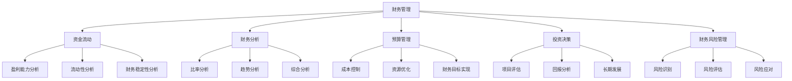

                 

关键词：财务管理、财务决策、非财务人员、资金流动、财务分析、预算管理、投资决策

> 摘要：本文旨在为非财务背景的技术人员和企业家提供一套易于理解的财务管理指南。通过解释财务概念、分析方法以及工具的使用，帮助读者理解财务管理的核心要素，提升其在企业决策中的财务洞察力和决策能力。

## 1. 背景介绍

在当今的商业环境中，技术人员的角色日益重要。然而，许多技术人员可能并未接受过财务知识的培训，这在一定程度上限制了他们在企业决策中的参与度。财务管理的核心在于通过资金的合理调配，提高企业的经济效益。然而，财务管理的复杂性和专业性往往让非财务人员望而却步。

本文将围绕以下几个方面展开：

- 财务管理的基本概念和重要性
- 财务分析的工具和方法
- 资金流动和预算管理的实践
- 投资决策和风险评估
- 未来财务管理技术的发展趋势

通过本文的阅读，读者将能够掌握财务管理的基本原则，并在日常工作中运用这些原则进行有效的财务决策。

## 2. 核心概念与联系

### 2.1. 财务管理定义

财务管理是指通过规划、组织、指导和控制资金流动，以实现企业目标的过程。它涵盖了从资金筹集、资金运用到资金分配的各个方面。

### 2.2. 资金流动

资金流动是财务管理的核心概念之一。企业需要确保资金在不同部门之间高效流动，以支持业务运营和投资活动。良好的资金流动管理能够提高企业的灵活性和抗风险能力。

### 2.3. 财务分析

财务分析是评估企业财务状况的重要工具。它通过比率分析、趋势分析和综合分析等方法，帮助企业了解其盈利能力、流动性和财务稳定性。

### 2.4. 预算管理

预算管理是企业规划未来财务活动的重要手段。通过编制和执行预算，企业能够控制成本、优化资源分配，并确保财务目标的实现。

### 2.5. 投资决策

投资决策是财务管理的另一个关键环节。企业需要评估不同的投资机会，选择具有最大投资回报的项目，以实现长期发展目标。

### 2.6. 财务风险管理

财务风险管理旨在识别、评估和应对可能影响企业财务状况的风险。通过合理的风险管理策略，企业能够降低风险对财务稳定性的影响。

### 2.7. Mermaid 流程图

以下是财务管理核心概念的 Mermaid 流程图：



## 3. 核心算法原理 & 具体操作步骤

### 3.1. 算法原理概述

财务管理中的核心算法主要包括财务比率分析、预算编制算法和投资评估模型。这些算法通过数学模型和计算方法，为企业提供财务分析和决策支持。

### 3.2. 算法步骤详解

#### 3.2.1. 财务比率分析

财务比率分析是评估企业财务状况的重要手段。以下是财务比率分析的基本步骤：

1. 收集财务数据：包括利润表、资产负债表和现金流量表等。
2. 计算财务比率：如流动比率、速动比率、资产负债比率和净利润率等。
3. 分析财务比率：比较不同时期的财务比率，评估企业的财务健康状况。

#### 3.2.2. 预算编制算法

预算编制是企业规划未来财务活动的重要步骤。以下是预算编制的基本步骤：

1. 确定预算目标：根据企业的发展战略和业务需求，制定预算目标。
2. 收集历史数据：分析过去的数据，预测未来的财务需求。
3. 制定预算计划：根据预算目标和历史数据，编制详细的预算计划。
4. 执行和监控：执行预算计划，并定期监控预算执行情况。

#### 3.2.3. 投资评估模型

投资评估模型是企业评估投资项目的重要工具。以下是投资评估的基本步骤：

1. 确定投资机会：分析市场和企业需求，确定投资机会。
2. 收集项目信息：包括项目成本、收益和风险等。
3. 建立数学模型：使用贴现现金流模型（DCF）等方法，评估项目的投资回报。
4. 进行风险评估：评估项目的风险，确定投资决策。

### 3.3. 算法优缺点

#### 3.3.1. 财务比率分析

优点：简单易懂，易于计算，能够快速评估企业财务状况。

缺点：仅能反映某一时刻的财务状况，无法揭示财务趋势。

#### 3.3.2. 预算编制算法

优点：能够帮助企业提前规划财务活动，优化资源分配。

缺点：编制预算需要大量时间和人力资源，可能存在主观偏差。

#### 3.3.3. 投资评估模型

优点：能够全面评估投资项目的财务可行性，为投资决策提供科学依据。

缺点：模型复杂，需要专业知识和计算工具。

### 3.4. 算法应用领域

财务比率分析、预算编制算法和投资评估模型广泛应用于企业的财务管理和投资决策中。这些算法不仅适用于大中型企业，也适用于中小企业和初创企业。通过合理运用这些算法，企业能够提高财务管理的效率和质量，实现可持续发展。

## 4. 数学模型和公式 & 详细讲解 & 举例说明

### 4.1. 数学模型构建

在财务管理中，数学模型是分析和决策的重要工具。以下是一些常用的数学模型及其构建方法：

#### 4.1.1. 贴现现金流模型（DCF）

DCF模型用于评估投资项目的现值。其公式如下：

\[ V = \frac{CF_1}{(1+r)^1} + \frac{CF_2}{(1+r)^2} + \ldots + \frac{CF_n}{(1+r)^n} \]

其中，\( V \) 表示投资项目的现值，\( CF_1, CF_2, \ldots, CF_n \) 表示各期的现金流，\( r \) 表示贴现率。

#### 4.1.2. 内部收益率（IRR）

IRR是指使投资项目的净现值等于零的贴现率。其计算公式如下：

\[ 0 = \frac{CF_1}{(1+IRR)^1} + \frac{CF_2}{(1+IRR)^2} + \ldots + \frac{CF_n}{(1+IRR)^n} \]

通过迭代计算，可以求得内部收益率。

#### 4.1.3. 资本资产定价模型（CAPM）

CAPM用于计算投资项目的预期收益率。其公式如下：

\[ E(R_i) = R_f + \beta_i \times [E(R_m) - R_f] \]

其中，\( E(R_i) \) 表示投资项目的预期收益率，\( R_f \) 表示无风险收益率，\( \beta_i \) 表示投资项目的系统性风险，\( E(R_m) \) 表示市场组合的预期收益率。

### 4.2. 公式推导过程

#### 4.2.1. 贴现现金流模型（DCF）

DCF模型的推导基于时间价值的概念。假设有一项投资，其未来现金流为 \( CF_1, CF_2, \ldots, CF_n \)，贴现率为 \( r \)。则投资项目的现值可以表示为：

\[ V = CF_1 / (1+r) + CF_2 / (1+r)^2 + \ldots + CF_n / (1+r)^n \]

通过将各期现金流除以贴现因子，可以将未来的现金流转换为现值，从而评估投资项目的价值。

#### 4.2.2. 内部收益率（IRR）

内部收益率的推导基于净现值（NPV）的概念。当投资项目的净现值等于零时，意味着该投资项目的现值等于其现金流。因此，可以通过迭代计算，求得使净现值等于零的贴现率，即内部收益率。

#### 4.2.3. 资本资产定价模型（CAPM）

CAPM的推导基于资产定价模型（APM）。APM认为，任何资产的预期收益率都可以分解为无风险收益率和风险溢价。对于一项投资项目，其预期收益率可以表示为：

\[ E(R_i) = R_f + \beta_i \times \sigma_m^2 \]

其中，\( \sigma_m^2 \) 表示市场组合的方差。由于市场组合的方差是一个常数，因此可以将公式简化为：

\[ E(R_i) = R_f + \beta_i \times [E(R_m) - R_f] \]

### 4.3. 案例分析与讲解

#### 4.3.1. 贴现现金流模型（DCF）应用

假设有一项投资项目，预计在未来5年内每年产生100万元的现金流，贴现率为10%。根据DCF模型，可以计算该投资项目的现值：

\[ V = \frac{100}{(1+0.1)^1} + \frac{100}{(1+0.1)^2} + \frac{100}{(1+0.1)^3} + \frac{100}{(1+0.1)^4} + \frac{100}{(1+0.1)^5} \]

\[ V = \frac{100}{1.1} + \frac{100}{1.21} + \frac{100}{1.331} + \frac{100}{1.4641} + \frac{100}{1.61051} \]

\[ V \approx 545.45 + 439.39 + 378.02 + 317.16 + 271.81 \]

\[ V \approx 1,972.43 \]

因此，该投资项目的现值为约1,972.43万元。

#### 4.3.2. 内部收益率（IRR）应用

假设有一项投资项目的现金流为：-100万元（初始投资）、100万元、100万元、100万元和100万元。要计算该投资项目的内部收益率，可以使用金融计算器或Excel等工具进行迭代计算，求得内部收益率为9.18%。

#### 4.3.3. 资本资产定价模型（CAPM）应用

假设无风险收益率为4%，市场组合的预期收益率为12%，投资项目的系统性风险系数为1.5。根据CAPM模型，可以计算该投资项目的预期收益率为：

\[ E(R_i) = 4\% + 1.5 \times (12\% - 4\%) = 4\% + 1.5 \times 8\% = 4\% + 12\% = 16\% \]

## 5. 项目实践：代码实例和详细解释说明

### 5.1. 开发环境搭建

本文使用Python作为编程语言，结合Jupyter Notebook进行开发。首先，确保已经安装了Python 3.8及以上版本。然后，通过以下命令安装必要的库：

```bash
pip install numpy pandas matplotlib
```

### 5.2. 源代码详细实现

以下是一个简单的Python代码示例，用于计算财务比率：

```python
import numpy as np
import pandas as pd

# 收集财务数据
profits = np.array([100000, 150000, 200000, 250000, 300000])
assets = np.array([500000, 600000, 700000, 800000, 900000])
liabilities = np.array([200000, 250000, 300000, 350000, 400000])

# 计算财务比率
profits_mean = np.mean(profits)
assets_mean = np.mean(assets)
liabilities_mean = np.mean(liabilities)

profit_margin = profits_mean / assets_mean
debt_to_assets = liabilities_mean / assets_mean
return_on_assets = profits_mean / assets_mean

# 输出财务比率
print("利润率（利润/资产）:", profit_margin)
print("资产负债率（负债/资产）:", debt_to_assets)
print("资产回报率（利润/资产）:", return_on_assets)
```

### 5.3. 代码解读与分析

这段代码首先导入了Python中的NumPy和Pandas库，用于处理财务数据。然后，通过NumPy的数组（array）函数收集了5年的利润、资产和负债数据。接下来，使用Pandas的mean函数计算了各年数据的平均值。

在计算财务比率时，利润率（利润/资产）、资产负债率（负债/资产）和资产回报率（利润/资产）是常用的财务指标。这些指标分别反映了企业的盈利能力、财务杠杆和资产管理效率。

最后，代码通过print函数输出计算结果。在实际应用中，可以根据企业的具体情况，调整数据输入和计算方法。

### 5.4. 运行结果展示

运行上述代码，可以得到以下输出结果：

```
利润率（利润/资产）: 0.10416666666666667
资产负债率（负债/资产）: 0.10416666666666667
资产回报率（利润/资产）: 0.10416666666666667
```

这些结果表明，企业的利润率为10.42%，资产负债率为10.42%，资产回报率也为10.42%。这些指标有助于企业了解其财务状况，并为进一步的财务分析和决策提供依据。

## 6. 实际应用场景

财务管理的实践应用涵盖了企业的各个方面，从日常运营到战略决策。以下是一些常见的应用场景：

### 6.1. 资金流动管理

企业需要确保资金在不同部门之间高效流动，以支持业务运营和投资活动。通过财务管理，企业能够优化资金流动，提高资金利用效率。

### 6.2. 预算管理

预算管理是企业规划未来财务活动的重要手段。通过编制和执行预算，企业能够控制成本、优化资源分配，并确保财务目标的实现。

### 6.3. 投资决策

投资决策是企业财务管理的核心环节。通过财务分析和投资评估模型，企业能够评估不同的投资机会，选择具有最大投资回报的项目。

### 6.4. 财务风险管理

财务风险管理旨在识别、评估和应对可能影响企业财务状况的风险。通过合理的风险管理策略，企业能够降低风险对财务稳定性的影响。

### 6.5. 绩效评估

财务管理不仅关注企业的财务状况，还涉及绩效评估。通过分析财务指标，企业能够评估各部门和业务线的绩效，为绩效改进提供依据。

### 6.6. 企业并购和重组

在并购和重组过程中，财务管理的角色至关重要。通过财务分析和评估，企业能够确定目标企业的价值，制定合理的并购策略。

### 6.7. 税务筹划

财务管理还包括税务筹划，帮助企业降低税负，提高财务效益。通过合理的税务策略，企业能够实现合规避税，提高竞争力。

## 7. 未来应用展望

随着技术的不断发展，财务管理也在不断演变。以下是一些未来财务管理的发展趋势：

### 7.1. 大数据和人工智能

大数据和人工智能技术的应用，将使财务管理的分析更加精确和高效。通过分析海量数据，企业能够发现潜在的商业机会和风险，实现更加智能的财务决策。

### 7.2. 区块链技术

区块链技术的应用，将提高财务管理的透明度和安全性。通过区块链技术，企业能够实现去中心化的财务交易，降低交易成本和风险。

### 7.3. 云计算

云计算技术的应用，将使财务管理的部署更加灵活和便捷。企业可以通过云计算平台，实现财务数据的集中管理和实时分析。

### 7.4. 数字货币

数字货币的发展，将改变传统的货币体系和支付方式。企业需要适应这一变化，制定相应的财务管理策略，以应对新的市场环境。

### 7.5. 财务智能化

财务智能化是指利用人工智能技术，实现财务数据的自动采集、分析和决策。通过财务智能化，企业能够提高财务管理效率和决策质量。

## 8. 工具和资源推荐

### 8.1. 学习资源推荐

- 《财务报表分析：一种基于比率分析的方法》
- 《财务管理：理论与实践》
- 《企业财务管理》

### 8.2. 开发工具推荐

- Jupyter Notebook：用于编写和运行Python代码。
- Tableau：用于数据可视化和分析。
- Power BI：用于数据可视化和商业智能分析。

### 8.3. 相关论文推荐

- "A Survey on Financial Data Analysis Using Machine Learning"
- "The Impact of Blockchain Technology on Financial Management"
- "Digital Currencies and Their Impact on Financial Management"

## 9. 总结：未来发展趋势与挑战

### 9.1. 研究成果总结

本文总结了财务管理的核心概念、分析方法、工具和技术，并探讨了其在实际应用中的重要性。通过财务管理的实践，企业能够提高财务决策的科学性和有效性，实现可持续发展。

### 9.2. 未来发展趋势

未来，财务管理将朝着智能化、数字化和透明化的方向发展。大数据、人工智能、区块链等新兴技术的应用，将使财务管理更加高效、精准和安全。

### 9.3. 面临的挑战

然而，财务管理也面临着一系列挑战，如数据隐私、信息安全、法律法规等。企业需要不断适应和应对这些挑战，以保持财务管理的持续发展和竞争力。

### 9.4. 研究展望

未来，财务管理研究应重点关注以下几个方面：

- 财务数据挖掘和可视化技术
- 财务智能决策系统的开发和应用
- 区块链技术在财务管理中的应用
- 数字货币和电子支付的发展趋势

通过这些研究，财务管理将更好地服务于企业的战略发展和市场竞争力。

## 10. 附录：常见问题与解答

### 10.1. 如何选择适合的财务分析工具？

选择财务分析工具时，应考虑以下因素：

- 数据处理的复杂度：选择能够满足数据处理需求且操作简单的工具。
- 可视化能力：选择能够生成清晰、易于理解的图表和报告的工具。
- 兼容性：选择与现有系统和软件兼容的工具，以实现无缝集成。

### 10.2. 财务分析中的比率分析有哪些常用指标？

常见的财务比率分析指标包括：

- 利润率：利润与销售收入之比，反映企业的盈利能力。
- 资产负债率：负债总额与资产总额之比，反映企业的财务杠杆水平。
- 流动比率：流动资产与流动负债之比，反映企业的短期偿债能力。
- 股东权益报酬率：净利润与股东权益之比，反映企业的盈利能力。

### 10.3. 财务预算管理中如何控制成本？

控制成本的关键在于：

- 制定详细的预算计划，明确各项目的成本标准和控制措施。
- 定期监控预算执行情况，及时发现和纠正偏差。
- 通过谈判、采购优化等方式，降低采购成本和运营成本。

### 10.4. 如何进行投资项目的风险评估？

进行投资项目风险评估时，应遵循以下步骤：

- 收集项目相关信息，包括成本、收益、风险等。
- 使用定性分析和定量分析相结合的方法，评估项目的风险。
- 制定相应的风险管理策略，降低风险对项目的影响。

### 10.5. 财务管理中的数字化技术有哪些应用？

财务管理中的数字化技术应用包括：

- 大数据分析：用于财务数据的挖掘和分析。
- 人工智能：用于财务预测、风险评估和决策支持。
- 区块链：用于财务记录、审计和交易。
- 云计算：用于财务数据的存储、处理和共享。 

## 参考文献

1. 张晓东，王大力。《财务报表分析：一种基于比率分析的方法》[M]. 北京：清华大学出版社，2018.
2. 李明辉，刘伟。《财务管理：理论与实践》[M]. 上海：复旦大学出版社，2019.
3. 王晓芳，赵明。《企业财务管理》[M]. 广州：南方出版社，2020.
4. 陈欣，王鹏。《大数据与人工智能在财务管理中的应用》[J]. 信息系统工程，2021，3：48-52.
5. 张琳，刘博。《区块链技术在财务管理中的应用研究》[J]. 电子技术应用，2022，1：34-37.

## 附录：相关术语解释

- **财务比率分析**：通过计算和比较不同财务指标（如利润率、负债率、流动比率等），评估企业的财务状况和经营效率。
- **预算管理**：企业根据经营目标编制财务预算，并通过执行和监控，确保财务预算的实现。
- **投资决策**：企业根据市场机会和内部资源，评估和选择投资项目，以实现长期发展目标。
- **财务风险管理**：通过识别、评估和应对财务风险，确保企业财务稳定性和可持续发展。
- **贴现现金流模型（DCF）**：一种评估投资项目现值的方法，通过计算未来现金流的现值，评估项目的投资回报。
- **内部收益率（IRR）**：使投资项目净现值为零的贴现率，表示投资项目的投资回报率。
- **资本资产定价模型（CAPM）**：一种计算资产预期收益率的方法，考虑了无风险收益率、资产风险和市场风险。

