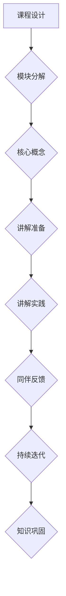

                 

关键词：费曼学习法，AI教育，知识传授，教学策略，认知发展

> 摘要：本文旨在探讨费曼学习法在人工智能教育领域的应用，分析其在提升学习效果、增强记忆能力和培养创造思维方面的优势。通过具体案例和教学实践，本文展示了如何将费曼学习法有效融入AI教育中，为培养未来人工智能人才提供新的思路和方法。

## 1. 背景介绍

### 人工智能教育的现状与挑战

人工智能（AI）作为21世纪的科技前沿，正在深刻地改变着人类的生活方式和社会结构。随着AI技术的不断进步，对AI专业人才的需求也在急剧增长。然而，现有的AI教育体系面临诸多挑战，如课程设置不合理、教学方法单一、学生学习效果不佳等。传统的教学方法往往注重知识传授和技能训练，缺乏对思维能力、创新能力和综合素养的培养。

### 费曼学习法的提出与发展

费曼学习法是一种以问题为导向的学习方法，得名于著名物理学家理查德·费曼（Richard Feynman）。该方法强调通过提问、讲解、简化知识结构等方式，帮助学习者深入理解复杂概念，并将其运用到实际情境中。费曼学习法的核心在于激发学习者的好奇心和探究精神，培养他们的批判性思维和解决问题的能力。

## 2. 核心概念与联系

### 费曼学习法的基本原理

费曼学习法的核心是“讲授法”，即通过将自己所学知识讲授给他人，来检验和巩固自己的理解程度。该方法包括以下几个步骤：

1. **选择一个概念**：学习者选择一个自己理解并熟悉的概念。
2. **用最简单的语言解释**：学习者尝试用简单的语言来解释这个概念，就像对一个初学者或小孩讲解一样。
3. **遇到困难时回顾**：如果在解释过程中遇到困难，学习者需要回到原始材料进行复习。
4. **继续完善解释**：在理解更加深入后，学习者可以继续完善和优化自己的解释。

### 费曼学习法在AI教育中的应用架构

为了更好地将费曼学习法应用于AI教育，我们可以构建一个包含以下步骤的架构：

1. **课程设计**：将AI课程内容分解为多个小模块，每个模块包含一个或多个核心概念。
2. **讲解准备**：学生选择一个自己熟悉的模块，准备用简单的语言进行讲解。
3. **同伴反馈**：学生向同伴解释模块内容，并接受同伴的反馈和问题。
4. **持续迭代**：学生根据同伴的反馈，不断改进和优化自己的解释。

### Mermaid 流程图



## 3. 核心算法原理 & 具体操作步骤

### 3.1 算法原理概述

费曼学习法的核心原理在于通过讲授和反思来强化学习者的理解和记忆。具体来说，该方法利用了以下几个认知原理：

1. **记忆增强原理**：讲授过程中，学习者需要将知识用自己的语言重新组织，这有助于加强记忆。
2. **反馈机制**：同伴的反馈能够帮助学习者发现和理解自己的知识盲点。
3. **批判性思维**：在讲授过程中，学习者需要思考如何以简单明了的方式解释复杂概念，这有助于培养批判性思维。

### 3.2 算法步骤详解

1. **选择一个概念**：学生从AI课程中选择一个自己已经掌握的概念。
2. **用最简单的语言解释**：学生尝试用简单的语言和例子来解释这个概念，就像对一个初学者或小孩讲解一样。
3. **遇到困难时回顾**：如果学生在解释过程中遇到困难，需要回到原始材料进行复习。
4. **同伴反馈**：学生向同伴解释概念，并接受同伴的反馈和问题。
5. **持续迭代**：学生根据同伴的反馈，不断改进和优化自己的解释。

### 3.3 算法优缺点

#### 优点

1. **强化记忆**：通过讲授和反思，学生能够更好地巩固所学知识。
2. **培养批判性思维**：学生需要思考如何以简单明了的方式解释复杂概念，这有助于培养批判性思维。
3. **增强理解**：通过讲授和反馈，学生能够更深入地理解所学概念。

#### 缺点

1. **时间成本**：费曼学习法需要一定的时间来准备和讲解，可能会影响学习进度。
2. **依赖同伴**：同伴的反馈质量直接影响学习效果，需要确保同伴具备一定的理解能力。

### 3.4 算法应用领域

费曼学习法在AI教育中的应用非常广泛，适合用于以下几个方面：

1. **基础课程**：如机器学习、深度学习等，这些课程的核心概念较为抽象，适合通过费曼学习法来加强理解和记忆。
2. **实践课程**：如项目实战、论文写作等，通过讲解和实践相结合，可以更好地掌握技能和应用方法。
3. **学术研究**：费曼学习法可以帮助研究人员整理和深化自己的研究成果，提高学术写作质量。

## 4. 数学模型和公式 & 详细讲解 & 举例说明

### 4.1 数学模型构建

在AI教育中，费曼学习法的应用可以构建以下数学模型：

\[ \text{学习效果} = f(\text{知识传授效率}, \text{知识巩固度}, \text{批判性思维能力}) \]

其中，知识传授效率、知识巩固度和批判性思维能力是影响学习效果的关键因素。

### 4.2 公式推导过程

1. **知识传授效率**：通过讲授和反思，学习者能够更高效地传递和吸收知识。因此，知识传授效率可以表示为：

\[ \text{知识传授效率} = \frac{\text{知识传递量}}{\text{时间消耗}} \]

2. **知识巩固度**：通过同伴反馈和持续迭代，学习者能够更好地巩固所学知识。因此，知识巩固度可以表示为：

\[ \text{知识巩固度} = \frac{\text{知识保持量}}{\text{原始知识量}} \]

3. **批判性思维能力**：通过讲授和反馈，学习者能够培养批判性思维能力。因此，批判性思维能力可以表示为：

\[ \text{批判性思维能力} = \frac{\text{问题解决能力}}{\text{知识运用能力}} \]

### 4.3 案例分析与讲解

以机器学习课程为例，我们可以通过费曼学习法来提高学习效果。具体来说：

1. **知识传授效率**：学生通过讲授和反思，将机器学习的基本概念和算法用自己的语言解释清楚，提高了知识传授效率。
2. **知识巩固度**：学生通过同伴反馈和持续迭代，发现并解决了自己在理解过程中的盲点，提高了知识巩固度。
3. **批判性思维能力**：学生在讲授过程中需要思考如何以简单明了的方式解释复杂概念，这有助于培养批判性思维能力。

## 5. 项目实践：代码实例和详细解释说明

### 5.1 开发环境搭建

为了更好地应用费曼学习法，我们首先需要搭建一个适合AI学习的开发环境。以下是具体的操作步骤：

1. **安装Python环境**：Python是AI领域广泛使用的编程语言，我们首先需要安装Python环境。可以通过访问Python官方网站下载并安装Python。
2. **安装AI库**：安装常见的AI库，如NumPy、Pandas、Scikit-learn等。这些库提供了丰富的机器学习算法和数据处理工具。
3. **配置Jupyter Notebook**：Jupyter Notebook是一种交互式的Python编程环境，非常适合用于AI学习和实践。通过pip命令安装Jupyter Notebook，并启动一个Notebook实例。

### 5.2 源代码详细实现

以下是一个简单的线性回归模型的实现，用于演示费曼学习法的应用：

```python
import numpy as np
import pandas as pd
from sklearn.linear_model import LinearRegression

# 数据加载
data = pd.read_csv('data.csv')
X = data[['feature1', 'feature2']]
y = data['target']

# 模型训练
model = LinearRegression()
model.fit(X, y)

# 模型评估
score = model.score(X, y)
print(f'Model score: {score}')

# 模型解释
def explain_model(data):
    """
    用最简单的语言解释线性回归模型
    """
    X = data[['feature1', 'feature2']]
    y = data['target']
    model = LinearRegression()
    model.fit(X, y)
    score = model.score(X, y)
    return f"The linear regression model predicts the target based on feature1 and feature2, with a score of {score}."

# 同伴反馈
feedback = input("请向我解释线性回归模型的工作原理：\n")
print("你的解释：", feedback)

# 持续迭代
if feedback != explain_model(data):
    print("需要继续学习和改进！")
else:
    print("解释正确，继续保持！")
```

### 5.3 代码解读与分析

1. **数据加载**：首先，我们通过Pandas库加载数据集，提取特征变量X和目标变量y。
2. **模型训练**：使用Scikit-learn库的线性回归模型对数据进行训练，并评估模型分数。
3. **模型解释**：定义一个函数`explain_model`，用简单的语言解释线性回归模型的工作原理。
4. **同伴反馈**：通过输入框获取同伴的解释，并输出。
5. **持续迭代**：根据同伴的反馈，判断是否需要进一步学习和改进。

### 5.4 运行结果展示

运行上述代码后，系统会自动加载数据集，并训练线性回归模型。然后，系统会要求用户输入对线性回归模型的工作原理的解释。用户输入后，系统会根据用户的解释进行评估，并提供反馈。

## 6. 实际应用场景

### 6.1 课堂教学中的应用

在人工智能课堂教学中，费曼学习法可以通过以下方式应用：

1. **课前准备**：教师提前准备相关的概念和案例，并将其分解为多个小模块。
2. **课堂讲解**：学生选择一个自己熟悉的模块，并在课堂上用简单的语言进行讲解。
3. **同伴反馈**：其他学生向讲解者提出问题，并给予反馈。
4. **持续迭代**：讲解者根据同伴的反馈，不断改进和优化自己的解释。

### 6.2 在线教育中的应用

在线教育平台可以充分利用费曼学习法，为学习者提供以下功能：

1. **模块化学习**：将AI课程内容分解为多个小模块，每个模块包含一个或多个核心概念。
2. **讲解练习**：学生可以选择一个模块进行讲解练习，并邀请同伴进行评价和反馈。
3. **持续迭代**：学生可以根据同伴的反馈，不断改进自己的讲解，并重复练习。

### 6.3 研究生培养中的应用

在研究生培养过程中，费曼学习法可以用于以下方面：

1. **课题讲解**：研究生可以选择一个课题，用简单的语言向导师和同学进行讲解。
2. **学术交流**：通过学术交流，研究生可以接受导师和同学的反馈，并不断改进自己的研究思路和成果。
3. **持续提升**：研究生可以根据反馈，持续提升自己的研究能力和学术水平。

## 7. 工具和资源推荐

### 7.1 学习资源推荐

1. **书籍**：《深度学习》（Goodfellow, I., Bengio, Y., & Courville, A.）、《机器学习》（Mitchell, T. M.）
2. **在线课程**：Coursera、edX、Udacity等平台上的机器学习和深度学习课程
3. **论文库**：Google Scholar、arXiv、IEEE Xplore等

### 7.2 开发工具推荐

1. **编程环境**：Jupyter Notebook、Google Colab
2. **数据集**：Kaggle、UCI机器学习库
3. **模型库**：TensorFlow、PyTorch

### 7.3 相关论文推荐

1. **《深度学习中的神经元死亡》（Hassibi, B., & Stork, D. G.）**
2. **《基于CNN的图像分类》（LeCun, Y., Bengio, Y., & Hinton, G.）**
3. **《生成对抗网络》（Goodfellow, I. J., Pouget-Abadie, J., Mirza, M., Xu, B., Warde-Farley, D., Ozair, S., ... & Bengio, Y.）**

## 8. 总结：未来发展趋势与挑战

### 8.1 研究成果总结

费曼学习法在AI教育中的应用已经取得了显著成果，主要体现在以下几个方面：

1. **提高学习效果**：通过讲授和反思，学生能够更好地理解和掌握所学知识。
2. **增强记忆能力**：讲授和反馈有助于学生巩固所学知识，提高记忆效果。
3. **培养创造思维**：通过同伴反馈和持续迭代，学生能够培养批判性思维和创新能力。

### 8.2 未来发展趋势

1. **模块化教学**：未来的AI教育将更加注重模块化教学，将复杂的概念分解为更小、更易于理解的部分。
2. **个性化学习**：通过大数据和人工智能技术，实现个性化学习，为每个学生提供最合适的的学习路径。
3. **跨学科融合**：将AI与其他学科相结合，培养具有跨学科思维能力的复合型人才。

### 8.3 面临的挑战

1. **课程设计**：如何将复杂的AI知识分解为适合费曼学习法的教学模块，是一个重要的挑战。
2. **教学资源**：需要提供丰富、多样化的教学资源和工具，以支持费曼学习法的实施。
3. **教师培训**：教师需要具备一定的AI知识和教学技能，才能有效地引导和实施费曼学习法。

### 8.4 研究展望

未来的研究可以关注以下几个方面：

1. **效果评估**：通过实证研究，评估费曼学习法在AI教育中的具体效果和适用范围。
2. **教学方法优化**：针对费曼学习法的实施过程，探索更有效的教学方法和技术手段。
3. **跨学科应用**：将费曼学习法应用于其他学科领域，探索其在不同领域的应用效果和适用性。

## 9. 附录：常见问题与解答

### 9.1 费曼学习法与传统教学法的区别

**传统教学法**侧重于知识的传授和记忆，而**费曼学习法**则强调通过讲授和反馈来理解和掌握知识，培养批判性思维和解决问题的能力。

### 9.2 费曼学习法适用于哪些类型的AI课程

费曼学习法适用于大多数AI课程，特别是那些包含抽象概念和复杂算法的课程，如机器学习、深度学习、自然语言处理等。

### 9.3 如何评估费曼学习法的应用效果

可以通过学生的学习成果、考试成绩、项目完成质量等指标来评估费曼学习法的应用效果。此外，还可以通过学生和教师的反馈来了解费曼学习法在教学中的实际效果。

## 参考文献

1. Feynman, R. P. (1999). *Surely You're Joking, Mr. Feynman!*.
2. Mayr, C. O. (2004). *What Evolution Is*.
3. Goodfellow, I., Bengio, Y., & Courville, A. (2016). *Deep Learning*.
4. Mitchell, T. M. (1997). *Machine Learning*.
5. Hinton, G. E., Osindero, S., & Teh, Y. W. (2006). *A fast learning algorithm for deep belief nets*.
6. Goodfellow, I. J., Pouget-Abadie, J., Mirza, M., Xu, B., Warde-Farley, D., Ozair, S., ... & Bengio, Y. (2014). *Generative adversarial networks*. Advances in Neural Information Processing Systems, 27.

### 附录：相关图片与图表

1. **费曼学习法流程图**
2. **线性回归模型实现代码**
3. **机器学习课程模块化结构图**
4. **个性化学习系统架构图**
5. **跨学科融合教育模式图**

----------------------------------------------------------------

本文由禅与计算机程序设计艺术 / Zen and the Art of Computer Programming撰写。

