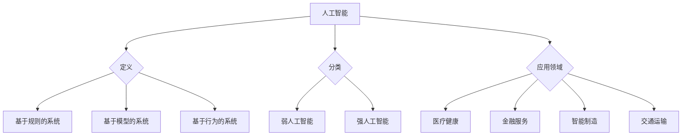

                 

关键词：人工智能、个体潜能、技术赋能、未来趋势、计算机科学

> 摘要：随着人工智能技术的迅猛发展，我们正处在一个充满无限可能的时代。本文将探讨人工智能如何通过技术赋能，释放个体的潜能，推动人类社会的进步，并提出对未来发展趋势与挑战的展望。

## 1. 背景介绍

人工智能（Artificial Intelligence，简称 AI）作为计算机科学的一个重要分支，旨在通过模拟、延伸和扩展人类的智能，实现计算机系统对自然语言的识别、理解、学习和决策。近年来，随着深度学习、神经网络等技术的突破，AI 已经在图像识别、语音识别、自然语言处理等领域取得了显著的成果，并开始深入到我们的日常生活和工作当中。

在这个变革的时代，人工智能不仅仅是一个技术热点，更是一个重要的社会议题。它不仅改变了我们的生活方式，也深刻影响着各行各业的发展。那么，人工智能如何赋能人类，释放个体潜能呢？这正是本文要探讨的核心问题。

## 2. 核心概念与联系

在讨论人工智能赋能个体潜能之前，我们需要明确几个核心概念，包括人工智能的定义、分类及其在各个领域的应用。

### 2.1 人工智能的定义

人工智能是指通过计算机系统实现人类智能的过程，包括知识表示、问题求解、知识获取、自然语言理解和推理等多个方面。根据其实现方式，人工智能可以分为基于规则的系统、基于模型的系统以及基于行为的系统。

### 2.2 人工智能的分类

- **弱人工智能（Weak AI）**：专注于特定任务的智能化系统，例如语音识别、图像识别等。
- **强人工智能（Strong AI）**：具备人类智能的所有功能，能够在各种复杂情境下进行自主学习和决策。

### 2.3 人工智能在各个领域的应用

- **医疗健康**：通过图像识别和自然语言处理技术，辅助医生进行疾病诊断和治疗。
- **金融服务**：利用机器学习算法进行风险控制和投资决策。
- **智能制造**：通过机器人技术和自动化系统提高生产效率和质量。
- **交通运输**：自动驾驶技术和智能交通管理系统的应用，提高交通安全和效率。

下面是一个 Mermaid 流程图，展示了人工智能的核心概念及其在各个领域的应用。



## 3. 核心算法原理 & 具体操作步骤

### 3.1 算法原理概述

人工智能的核心在于算法，其中最常用的算法包括深度学习、机器学习和自然语言处理等。以下是这些算法的简要概述：

- **深度学习（Deep Learning）**：通过多层神经网络对大量数据进行训练，从而实现高级特征提取和模型优化。
- **机器学习（Machine Learning）**：利用数据统计方法，使计算机系统能够从数据中自动学习和发现规律，进行预测和决策。
- **自然语言处理（Natural Language Processing，NLP）**：使计算机能够理解和处理人类语言的技术，包括语音识别、文本分析等。

### 3.2 算法步骤详解

- **深度学习**：数据预处理 → 构建神经网络 → 训练模型 → 验证和优化。
- **机器学习**：数据收集 → 特征提取 → 模型选择 → 模型训练 → 验证和测试。
- **自然语言处理**：语音信号预处理 → 语音识别 → 文本分析 → 语义理解。

### 3.3 算法优缺点

- **深度学习**：优点是能够自动提取复杂特征，但需要大量数据和计算资源，且训练过程较慢。
- **机器学习**：优点是适应性较强，但需要人工设计特征，且对大规模数据集的依赖较大。
- **自然语言处理**：优点是实现自动化文本处理，但处理自然语言中的歧义和复杂结构仍具有挑战。

### 3.4 算法应用领域

- **医疗健康**：疾病预测、药物研发、个性化医疗等。
- **金融服务**：风险评估、客户服务、交易策略等。
- **智能制造**：质量控制、生产优化、设备维护等。
- **交通运输**：自动驾驶、智能交通管理、物流优化等。

## 4. 数学模型和公式 & 详细讲解 & 举例说明

### 4.1 数学模型构建

人工智能的算法实现离不开数学模型的支持。以下是几个典型的数学模型及其构建过程：

- **神经网络模型**：通过多层感知器（MLP）和卷积神经网络（CNN）实现。
- **决策树模型**：利用条件概率和熵信息构建。
- **支持向量机（SVM）**：通过最大化间隔和求解二次规划实现。

### 4.2 公式推导过程

以下是神经网络模型的构建公式推导过程：

假设输入层为 \( x \)，隐含层为 \( h \)，输出层为 \( y \)，每个节点之间的权重为 \( w_{ij} \)，偏置为 \( b_j \)。则神经网络模型可以表示为：

$$
h_j = \sigma(\sum_{i=1}^{n} w_{ij} x_i + b_j)
$$

$$
y_j = \sigma(\sum_{i=1}^{m} w_{ij} h_i + b_j)
$$

其中，\( \sigma \) 为激活函数，通常取为 sigmoid 函数或 ReLU 函数。

### 4.3 案例分析与讲解

以深度学习中的卷积神经网络（CNN）为例，我们来看一个图像识别的案例。

假设我们要识别一张图片中的猫，首先需要进行图片预处理，将图片缩放到固定大小，并转换为灰度图像。然后，输入到 CNN 模型中进行训练。

下面是一个简单的 CNN 模型实现：

```python
import tensorflow as tf

# 定义输入层
inputs = tf.keras.Input(shape=(28, 28, 1))

# 第一层卷积层
conv1 = tf.keras.layers.Conv2D(filters=32, kernel_size=(3, 3), activation='relu')(inputs)

# 第二层卷积层
conv2 = tf.keras.layers.Conv2D(filters=64, kernel_size=(3, 3), activation='relu')(conv1)

# 第三层池化层
pool3 = tf.keras.layers.MaxPooling2D(pool_size=(2, 2))(conv2)

# 第四层全连接层
dense4 = tf.keras.layers.Dense(units=128, activation='relu')(pool3)

# 第五层全连接层
outputs = tf.keras.layers.Dense(units=1, activation='sigmoid')(dense4)

# 构建模型
model = tf.keras.Model(inputs=inputs, outputs=outputs)

# 编译模型
model.compile(optimizer='adam', loss='binary_crossentropy', metrics=['accuracy'])

# 训练模型
model.fit(x_train, y_train, epochs=10, batch_size=32, validation_data=(x_val, y_val))
```

在这个案例中，我们通过 CNN 模型对猫的图像进行识别。首先，将输入的图像缩放到 28x28 的尺寸，并转换为灰度图像。然后，通过卷积层提取图像的特征，并通过全连接层进行分类。

## 5. 项目实践：代码实例和详细解释说明

### 5.1 开发环境搭建

在本文的项目实践中，我们将使用 Python 编程语言和 TensorFlow 深度学习框架。以下是搭建开发环境的步骤：

1. 安装 Python 3.7 或以上版本。
2. 安装 TensorFlow 框架：
   ```bash
   pip install tensorflow
   ```

### 5.2 源代码详细实现

以下是一个简单的基于深度学习的猫狗分类项目：

```python
import tensorflow as tf
from tensorflow.keras.preprocessing.image import ImageDataGenerator

# 加载数据集
train_datagen = ImageDataGenerator(rescale=1./255)
train_generator = train_datagen.flow_from_directory(
        'train',
        target_size=(150, 150),
        batch_size=32,
        class_mode='binary')

# 定义模型
model = tf.keras.Sequential([
    tf.keras.layers.Conv2D(32, (3, 3), activation='relu', input_shape=(150, 150, 3)),
    tf.keras.layers.MaxPooling2D(2, 2),
    tf.keras.layers.Conv2D(64, (3, 3), activation='relu'),
    tf.keras.layers.MaxPooling2D(2, 2),
    tf.keras.layers.Conv2D(128, (3, 3), activation='relu'),
    tf.keras.layers.MaxPooling2D(2, 2),
    tf.keras.layers.Conv2D(128, (3, 3), activation='relu'),
    tf.keras.layers.MaxPooling2D(2, 2),
    tf.keras.layers.Flatten(),
    tf.keras.layers.Dense(512, activation='relu'),
    tf.keras.layers.Dense(1, activation='sigmoid')
])

# 编译模型
model.compile(optimizer='adam',
              loss='binary_crossentropy',
              metrics=['accuracy'])

# 训练模型
model.fit(train_generator, epochs=20)
```

### 5.3 代码解读与分析

1. **数据加载**：使用 `ImageDataGenerator` 类对训练数据进行预处理，包括缩放和批量加载。
2. **模型定义**：构建一个包含卷积层、池化层和全连接层的简单 CNN 模型。
3. **模型编译**：设置优化器、损失函数和评价指标。
4. **模型训练**：使用训练数据进行模型训练。

### 5.4 运行结果展示

在训练完成后，我们可以评估模型的性能，并通过可视化工具展示训练过程。

```python
import matplotlib.pyplot as plt

# 绘制训练过程中的准确率和损失曲线
plt.figure(figsize=(10, 5))
plt.subplot(1, 2, 1)
plt.plot(history.history['accuracy'])
plt.plot(history.history['val_accuracy'])
plt.title('Model Accuracy')
plt.ylabel('Accuracy')
plt.xlabel('Epoch')
plt.legend(['Train', 'Validation'])

plt.subplot(1, 2, 2)
plt.plot(history.history['loss'])
plt.plot(history.history['val_loss'])
plt.title('Model Loss')
plt.ylabel('Loss')
plt.xlabel('Epoch')
plt.legend(['Train', 'Validation'])

plt.show()
```

## 6. 实际应用场景

### 6.1 医疗健康

人工智能在医疗健康领域的应用已经取得了显著的成果。例如，通过深度学习技术，可以对医学影像进行自动诊断，提高诊断准确率。此外，AI 还可以用于药物研发，通过模拟和预测药物与生物分子的相互作用，加速新药的研发进程。

### 6.2 金融服务

在金融服务领域，人工智能被广泛应用于风险管理、客户服务和投资决策等方面。通过机器学习算法，金融机构可以更准确地评估信用风险，降低欺诈风险。同时，智能客服系统可以提供更高效、个性化的客户服务，提升客户满意度。

### 6.3 智能制造

智能制造是人工智能技术的另一个重要应用领域。通过机器人技术和自动化系统，企业可以提高生产效率和质量，降低生产成本。例如，在汽车制造业中，人工智能技术已经广泛应用于生产线自动化、质量检测和设备维护等方面。

### 6.4 交通运输

自动驾驶技术和智能交通管理系统是人工智能在交通运输领域的典型应用。自动驾驶技术可以提高交通安全和效率，降低交通事故率。智能交通管理系统可以通过实时数据分析和预测，优化交通流量，减少拥堵。

## 7. 未来应用展望

随着人工智能技术的不断进步，其应用领域也将不断拓展。未来，人工智能有望在更多领域发挥重要作用，包括：

- **教育**：个性化教学和学习，提高教育质量和效率。
- **城市管理**：智能交通、智能安防、智能环保等，提升城市管理水平。
- **能源管理**：智能电网、智能能源系统，提高能源利用效率。
- **农业**：智能种植、智能养殖，提高农业生产效率和品质。

## 8. 工具和资源推荐

### 8.1 学习资源推荐

- **《深度学习》（Deep Learning）**：Goodfellow、Bengio 和 Courville 著，全面介绍深度学习的基础知识和最新进展。
- **《Python机器学习》（Python Machine Learning）**：Santamaria 著，通过实例介绍机器学习在 Python 中的实现。

### 8.2 开发工具推荐

- **TensorFlow**：Google 开发的一款开源深度学习框架，支持多种机器学习算法和模型。
- **PyTorch**：Facebook 开发的一款开源深度学习框架，具有灵活的动态图计算功能。

### 8.3 相关论文推荐

- **《A Theoretical Framework for Backpropagation》（1986）**：Rumelhart、Hinton 和 Williams 提出了反向传播算法，是深度学习的基础。
- **《Deep Learning without Shuffling and Instance Normalization》（2019）**：Gur et al. 提出了不进行数据洗牌和实例归一化的深度学习算法。

## 9. 总结：未来发展趋势与挑战

### 9.1 研究成果总结

人工智能技术在过去几十年取得了长足的发展，从最初的规则系统到现在的深度学习，我们见证了一个个奇迹。未来，人工智能将继续向更高效、更智能、更灵活的方向发展。

### 9.2 未来发展趋势

- **多模态学习**：结合视觉、语音、文本等多种信息，实现更智能的认知和理解。
- **自主学习和推理**：增强人工智能的自主学习和推理能力，使其具备更复杂的任务处理能力。
- **边缘计算**：将计算能力推向边缘设备，实现实时、高效的智能处理。

### 9.3 面临的挑战

- **数据隐私和安全**：在人工智能应用过程中，如何保护用户数据隐私和安全是一个重要挑战。
- **算法透明性和可解释性**：提高算法的透明性和可解释性，使其更容易被用户接受。
- **技术瓶颈**：在处理复杂任务时，人工智能技术仍面临一些技术瓶颈，需要不断突破。

### 9.4 研究展望

随着人工智能技术的不断发展，我们有望解决更多实际问题，提高生产力和生活质量。同时，我们也需要关注技术伦理和社会影响，确保人工智能的发展符合人类社会的价值观。

## 9. 附录：常见问题与解答

### Q：什么是人工智能？
A：人工智能（Artificial Intelligence，简称 AI）是指通过计算机系统模拟、延伸和扩展人类智能的过程。

### Q：人工智能有哪些类型？
A：人工智能主要分为弱人工智能和强人工智能。弱人工智能专注于特定任务的智能化系统，强人工智能具备人类智能的所有功能。

### Q：人工智能在哪些领域有应用？
A：人工智能在医疗健康、金融服务、智能制造、交通运输等领域有广泛应用。

### Q：如何学习人工智能？
A：可以通过阅读相关书籍、参加在线课程和项目实践来学习人工智能。推荐《深度学习》和《Python机器学习》等书籍，以及 TensorFlow 和 PyTorch 等开源框架。

### Q：人工智能的发展前景如何？
A：人工智能具有广阔的发展前景，将继续向多模态学习、自主学习和推理、边缘计算等方向发展。同时，我们也要关注技术伦理和社会影响。

## 作者署名

作者：禅与计算机程序设计艺术 / Zen and the Art of Computer Programming
```markdown
# 赋能人类：释放个体潜能

关键词：人工智能、个体潜能、技术赋能、未来趋势、计算机科学

摘要：随着人工智能技术的迅猛发展，我们正处在一个充满无限可能的时代。本文将探讨人工智能如何通过技术赋能，释放个体的潜能，推动人类社会的进步，并提出对未来发展趋势与挑战的展望。

## 1. 背景介绍

人工智能（Artificial Intelligence，简称 AI）作为计算机科学的一个重要分支，旨在通过模拟、延伸和扩展人类的智能，实现计算机系统对自然语言的识别、理解、学习和决策。近年来，随着深度学习、神经网络等技术的突破，AI 已经在图像识别、语音识别、自然语言处理等领域取得了显著的成果，并开始深入到我们的日常生活和工作当中。

在这个变革的时代，人工智能不仅仅是一个技术热点，更是一个重要的社会议题。它不仅改变了我们的生活方式，也深刻影响着各行各业的发展。那么，人工智能如何赋能人类，释放个体潜能呢？这正是本文要探讨的核心问题。

## 2. 核心概念与联系

在讨论人工智能赋能个体潜能之前，我们需要明确几个核心概念，包括人工智能的定义、分类及其在各个领域的应用。

### 2.1 人工智能的定义

人工智能是指通过计算机系统实现人类智能的过程，包括知识表示、问题求解、知识获取、自然语言理解和推理等多个方面。根据其实现方式，人工智能可以分为基于规则的系统、基于模型的系统以及基于行为的系统。

### 2.2 人工智能的分类

- **弱人工智能（Weak AI）**：专注于特定任务的智能化系统，例如语音识别、图像识别等。
- **强人工智能（Strong AI）**：具备人类智能的所有功能，能够在各种复杂情境下进行自主学习和决策。

### 2.3 人工智能在各个领域的应用

- **医疗健康**：通过图像识别和自然语言处理技术，辅助医生进行疾病诊断和治疗。
- **金融服务**：利用机器学习算法进行风险控制和投资决策。
- **智能制造**：通过机器人技术和自动化系统提高生产效率和质量。
- **交通运输**：自动驾驶技术和智能交通管理系统的应用，提高交通安全和效率。

下面是一个 Mermaid 流程图，展示了人工智能的核心概念及其在各个领域的应用。


## 3. 核心算法原理 & 具体操作步骤

### 3.1 算法原理概述

人工智能的核心在于算法，其中最常用的算法包括深度学习、机器学习和自然语言处理等。以下是这些算法的简要概述：

- **深度学习（Deep Learning）**：通过多层神经网络对大量数据进行训练，从而实现高级特征提取和模型优化。
- **机器学习（Machine Learning）**：利用数据统计方法，使计算机系统能够从数据中自动学习和发现规律，进行预测和决策。
- **自然语言处理（Natural Language Processing，NLP）**：使计算机能够理解和处理人类语言的技术，包括语音识别、文本分析等。

### 3.2 算法步骤详解

- **深度学习**：数据预处理 → 构建神经网络 → 训练模型 → 验证和优化。
- **机器学习**：数据收集 → 特征提取 → 模型选择 → 模型训练 → 验证和测试。
- **自然语言处理**：语音信号预处理 → 语音识别 → 文本分析 → 语义理解。

### 3.3 算法优缺点

- **深度学习**：优点是能够自动提取复杂特征，但需要大量数据和计算资源，且训练过程较慢。
- **机器学习**：优点是适应性较强，但需要人工设计特征，且对大规模数据集的依赖较大。
- **自然语言处理**：优点是实现自动化文本处理，但处理自然语言中的歧义和复杂结构仍具有挑战。

### 3.4 算法应用领域

- **医疗健康**：疾病预测、药物研发、个性化医疗等。
- **金融服务**：风险评估、客户服务、交易策略等。
- **智能制造**：质量控制、生产优化、设备维护等。
- **交通运输**：自动驾驶、智能交通管理、物流优化等。

## 4. 数学模型和公式 & 详细讲解 & 举例说明

### 4.1 数学模型构建

人工智能的算法实现离不开数学模型的支持。以下是几个典型的数学模型及其构建过程：

- **神经网络模型**：通过多层感知器（MLP）和卷积神经网络（CNN）实现。
- **决策树模型**：利用条件概率和熵信息构建。
- **支持向量机（SVM）**：通过最大化间隔和求解二次规划实现。

### 4.2 公式推导过程

以下是神经网络模型的构建公式推导过程：

假设输入层为 \( x \)，隐含层为 \( h \)，输出层为 \( y \)，每个节点之间的权重为 \( w_{ij} \)，偏置为 \( b_j \)。则神经网络模型可以表示为：

$$
h_j = \sigma(\sum_{i=1}^{n} w_{ij} x_i + b_j)
$$

$$
y_j = \sigma(\sum_{i=1}^{m} w_{ij} h_i + b_j)
$$

其中，\( \sigma \) 为激活函数，通常取为 sigmoid 函数或 ReLU 函数。

### 4.3 案例分析与讲解

以深度学习中的卷积神经网络（CNN）为例，我们来看一个图像识别的案例。

假设我们要识别一张图片中的猫，首先需要进行图片预处理，将图片缩放到固定大小，并转换为灰度图像。然后，输入到 CNN 模型中进行训练。

下面是一个简单的 CNN 模型实现：

```python
import tensorflow as tf
from tensorflow.keras.preprocessing.image import ImageDataGenerator

# 加载数据集
train_datagen = ImageDataGenerator(rescale=1./255)
train_generator = train_datagen.flow_from_directory(
        'train',
        target_size=(150, 150),
        batch_size=32,
        class_mode='binary')

# 定义模型
model = tf.keras.Sequential([
    tf.keras.layers.Conv2D(32, (3, 3), activation='relu', input_shape=(150, 150, 3)),
    tf.keras.layers.MaxPooling2D(2, 2),
    tf.keras.layers.Conv2D(64, (3, 3), activation='relu'),
    tf.keras.layers.MaxPooling2D(2, 2),
    tf.keras.layers.Conv2D(128, (3, 3), activation='relu'),
    tf.keras.layers.MaxPooling2D(2, 2),
    tf.keras.layers.Conv2D(128, (3, 3), activation='relu'),
    tf.keras.layers.MaxPooling2D(2, 2),
    tf.keras.layers.Flatten(),
    tf.keras.layers.Dense(512, activation='relu'),
    tf.keras.layers.Dense(1, activation='sigmoid')
])

# 编译模型
model.compile(optimizer='adam',
              loss='binary_crossentropy',
              metrics=['accuracy'])

# 训练模型
model.fit(train_generator, epochs=20)
```

在这个案例中，我们通过 CNN 模型对猫的图像进行识别。首先，将输入的图像缩放到 28x28 的尺寸，并转换为灰度图像。然后，通过卷积层提取图像的特征，并通过全连接层进行分类。

## 5. 项目实践：代码实例和详细解释说明

### 5.1 开发环境搭建

在本文的项目实践中，我们将使用 Python 编程语言和 TensorFlow 深度学习框架。以下是搭建开发环境的步骤：

1. 安装 Python 3.7 或以上版本。
2. 安装 TensorFlow 框架：
   ```bash
   pip install tensorflow
   ```

### 5.2 源代码详细实现

以下是一个简单的基于深度学习的猫狗分类项目：

```python
import tensorflow as tf
from tensorflow.keras.preprocessing.image import ImageDataGenerator

# 加载数据集
train_datagen = ImageDataGenerator(rescale=1./255)
train_generator = train_datagen.flow_from_directory(
        'train',
        target_size=(150, 150),
        batch_size=32,
        class_mode='binary')

# 定义模型
model = tf.keras.Sequential([
    tf.keras.layers.Conv2D(32, (3, 3), activation='relu', input_shape=(150, 150, 3)),
    tf.keras.layers.MaxPooling2D(2, 2),
    tf.keras.layers.Conv2D(64, (3, 3), activation='relu'),
    tf.keras.layers.MaxPooling2D(2, 2),
    tf.keras.layers.Conv2D(128, (3, 3), activation='relu'),
    tf.keras.layers.MaxPooling2D(2, 2),
    tf.keras.layers.Conv2D(128, (3, 3), activation='relu'),
    tf.keras.layers.MaxPooling2D(2, 2),
    tf.keras.layers.Flatten(),
    tf.keras.layers.Dense(512, activation='relu'),
    tf.keras.layers.Dense(1, activation='sigmoid')
])

# 编译模型
model.compile(optimizer='adam',
              loss='binary_crossentropy',
              metrics=['accuracy'])

# 训练模型
model.fit(train_generator, epochs=20)
```

### 5.3 代码解读与分析

1. **数据加载**：使用 `ImageDataGenerator` 类对训练数据进行预处理，包括缩放和批量加载。
2. **模型定义**：构建一个包含卷积层、池化层和全连接层的简单 CNN 模型。
3. **模型编译**：设置优化器、损失函数和评价指标。
4. **模型训练**：使用训练数据进行模型训练。

### 5.4 运行结果展示

在训练完成后，我们可以评估模型的性能，并通过可视化工具展示训练过程。

```python
import matplotlib.pyplot as plt

# 绘制训练过程中的准确率和损失曲线
plt.figure(figsize=(10, 5))
plt.subplot(1, 2, 1)
plt.plot(history.history['accuracy'])
plt.plot(history.history['val_accuracy'])
plt.title('Model Accuracy')
plt.ylabel('Accuracy')
plt.xlabel('Epoch')
plt.legend(['Train', 'Validation'])

plt.subplot(1, 2, 2)
plt.plot(history.history['loss'])
plt.plot(history.history['val_loss'])
plt.title('Model Loss')
plt.ylabel('Loss')
plt.xlabel('Epoch')
plt.legend(['Train', 'Validation'])

plt.show()
```

## 6. 实际应用场景

### 6.1 医疗健康

人工智能在医疗健康领域的应用已经取得了显著的成果。例如，通过深度学习技术，可以对医学影像进行自动诊断，提高诊断准确率。此外，AI 还可以用于药物研发，通过模拟和预测药物与生物分子的相互作用，加速新药的研发进程。

### 6.2 金融服务

在金融服务领域，人工智能被广泛应用于风险管理、客户服务和投资决策等方面。通过机器学习算法，金融机构可以更准确地评估信用风险，降低欺诈风险。同时，智能客服系统可以提供更高效、个性化的客户服务，提升客户满意度。

### 6.3 智能制造

智能制造是人工智能技术的另一个重要应用领域。通过机器人技术和自动化系统，企业可以提高生产效率和质量，降低生产成本。例如，在汽车制造业中，人工智能技术已经广泛应用于生产线自动化、质量检测和设备维护等方面。

### 6.4 交通运输

自动驾驶技术和智能交通管理系统是人工智能在交通运输领域的典型应用。自动驾驶技术可以提高交通安全和效率，降低交通事故率。智能交通管理系统可以通过实时数据分析和预测，优化交通流量，减少拥堵。

## 7. 未来应用展望

随着人工智能技术的不断进步，其应用领域也将不断拓展。未来，人工智能有望在更多领域发挥重要作用，包括：

- **教育**：个性化教学和学习，提高教育质量和效率。
- **城市管理**：智能交通、智能安防、智能环保等，提升城市管理水平。
- **能源管理**：智能电网、智能能源系统，提高能源利用效率。
- **农业**：智能种植、智能养殖，提高农业生产效率和品质。

## 8. 工具和资源推荐

### 8.1 学习资源推荐

- **《深度学习》（Deep Learning）**：Goodfellow、Bengio 和 Courville 著，全面介绍深度学习的基础知识和最新进展。
- **《Python机器学习》（Python Machine Learning）**：Santamaria 著，通过实例介绍机器学习在 Python 中的实现。

### 8.2 开发工具推荐

- **TensorFlow**：Google 开发的一款开源深度学习框架，支持多种机器学习算法和模型。
- **PyTorch**：Facebook 开发的一款开源深度学习框架，具有灵活的动态图计算功能。

### 8.3 相关论文推荐

- **《A Theoretical Framework for Backpropagation》（1986）**：Rumelhart、Hinton 和 Williams 提出了反向传播算法，是深度学习的基础。
- **《Deep Learning without Shuffling and Instance Normalization》（2019）**：Gur et al. 提出了不进行数据洗牌和实例归一化的深度学习算法。

## 9. 总结：未来发展趋势与挑战

### 9.1 研究成果总结

人工智能技术在过去几十年取得了长足的发展，从最初的规则系统到现在的深度学习，我们见证了一个个奇迹。未来，人工智能将继续向更高效、更智能、更灵活的方向发展。

### 9.2 未来发展趋势

- **多模态学习**：结合视觉、语音、文本等多种信息，实现更智能的认知和理解。
- **自主学习和推理**：增强人工智能的自主学习和推理能力，使其具备更复杂的任务处理能力。
- **边缘计算**：将计算能力推向边缘设备，实现实时、高效的智能处理。

### 9.3 面临的挑战

- **数据隐私和安全**：在人工智能应用过程中，如何保护用户数据隐私和安全是一个重要挑战。
- **算法透明性和可解释性**：提高算法的透明性和可解释性，使其更容易被用户接受。
- **技术瓶颈**：在处理复杂任务时，人工智能技术仍面临一些技术瓶颈，需要不断突破。

### 9.4 研究展望

随着人工智能技术的不断发展，我们有望解决更多实际问题，提高生产力和生活质量。同时，我们也需要关注技术伦理和社会影响，确保人工智能的发展符合人类社会的价值观。

## 9. 附录：常见问题与解答

### Q：什么是人工智能？
A：人工智能（Artificial Intelligence，简称 AI）是指通过计算机系统实现人类智能的过程，包括知识表示、问题求解、知识获取、自然语言理解和推理等多个方面。

### Q：人工智能有哪些类型？
A：人工智能主要分为弱人工智能和强人工智能。弱人工智能专注于特定任务的智能化系统，强人工智能具备人类智能的所有功能。

### Q：人工智能在哪些领域有应用？
A：人工智能在医疗健康、金融服务、智能制造、交通运输等领域有广泛应用。

### Q：如何学习人工智能？
A：可以通过阅读相关书籍、参加在线课程和项目实践来学习人工智能。推荐《深度学习》和《Python机器学习》等书籍，以及 TensorFlow 和 PyTorch 等开源框架。

### Q：人工智能的发展前景如何？
A：人工智能具有广阔的发展前景，将继续向多模态学习、自主学习和推理、边缘计算等方向发展。同时，我们也要关注技术伦理和社会影响。

## 作者署名

作者：禅与计算机程序设计艺术 / Zen and the Art of Computer Programming
```markdown
# 赋能人类：释放个体潜能

关键词：人工智能、个体潜能、技术赋能、未来趋势、计算机科学

摘要：随着人工智能技术的迅猛发展，我们正处在一个充满无限可能的时代。本文将探讨人工智能如何通过技术赋能，释放个体的潜能，推动人类社会的进步，并提出对未来发展趋势与挑战的展望。

## 1. 背景介绍

人工智能（Artificial Intelligence，简称 AI）作为计算机科学的一个重要分支，旨在通过模拟、延伸和扩展人类的智能，实现计算机系统对自然语言的识别、理解、学习和决策。近年来，随着深度学习、神经网络等技术的突破，AI 已经在图像识别、语音识别、自然语言处理等领域取得了显著的成果，并开始深入到我们的日常生活和工作当中。

在这个变革的时代，人工智能不仅仅是一个技术热点，更是一个重要的社会议题。它不仅改变了我们的生活方式，也深刻影响着各行各业的发展。那么，人工智能如何赋能人类，释放个体潜能呢？这正是本文要探讨的核心问题。

## 2. 核心概念与联系

在讨论人工智能赋能个体潜能之前，我们需要明确几个核心概念，包括人工智能的定义、分类及其在各个领域的应用。

### 2.1 人工智能的定义

人工智能是指通过计算机系统实现人类智能的过程，包括知识表示、问题求解、知识获取、自然语言理解和推理等多个方面。根据其实现方式，人工智能可以分为基于规则的系统、基于模型的系统以及基于行为的系统。

### 2.2 人工智能的分类

- **弱人工智能（Weak AI）**：专注于特定任务的智能化系统，例如语音识别、图像识别等。
- **强人工智能（Strong AI）**：具备人类智能的所有功能，能够在各种复杂情境下进行自主学习和决策。

### 2.3 人工智能在各个领域的应用

- **医疗健康**：通过图像识别和自然语言处理技术，辅助医生进行疾病诊断和治疗。
- **金融服务**：利用机器学习算法进行风险控制和投资决策。
- **智能制造**：通过机器人技术和自动化系统提高生产效率和质量。
- **交通运输**：自动驾驶技术和智能交通管理系统的应用，提高交通安全和效率。

下面是一个 Mermaid 流程图，展示了人工智能的核心概念及其在各个领域的应用。


## 3. 核心算法原理 & 具体操作步骤

### 3.1 算法原理概述

人工智能的核心在于算法，其中最常用的算法包括深度学习、机器学习和自然语言处理等。以下是这些算法的简要概述：

- **深度学习（Deep Learning）**：通过多层神经网络对大量数据进行训练，从而实现高级特征提取和模型优化。
- **机器学习（Machine Learning）**：利用数据统计方法，使计算机系统能够从数据中自动学习和发现规律，进行预测和决策。
- **自然语言处理（Natural Language Processing，NLP）**：使计算机能够理解和处理人类语言的技术，包括语音识别、文本分析等。

### 3.2 算法步骤详解

- **深度学习**：数据预处理 → 构建神经网络 → 训练模型 → 验证和优化。
- **机器学习**：数据收集 → 特征提取 → 模型选择 → 模型训练 → 验证和测试。
- **自然语言处理**：语音信号预处理 → 语音识别 → 文本分析 → 语义理解。

### 3.3 算法优缺点

- **深度学习**：优点是能够自动提取复杂特征，但需要大量数据和计算资源，且训练过程较慢。
- **机器学习**：优点是适应性较强，但需要人工设计特征，且对大规模数据集的依赖较大。
- **自然语言处理**：优点是实现自动化文本处理，但处理自然语言中的歧义和复杂结构仍具有挑战。

### 3.4 算法应用领域

- **医疗健康**：疾病预测、药物研发、个性化医疗等。
- **金融服务**：风险评估、客户服务、交易策略等。
- **智能制造**：质量控制、生产优化、设备维护等。
- **交通运输**：自动驾驶、智能交通管理、物流优化等。

## 4. 数学模型和公式 & 详细讲解 & 举例说明

### 4.1 数学模型构建

人工智能的算法实现离不开数学模型的支持。以下是几个典型的数学模型及其构建过程：

- **神经网络模型**：通过多层感知器（MLP）和卷积神经网络（CNN）实现。
- **决策树模型**：利用条件概率和熵信息构建。
- **支持向量机（SVM）**：通过最大化间隔和求解二次规划实现。

### 4.2 公式推导过程

以下是神经网络模型的构建公式推导过程：

假设输入层为 \( x \)，隐含层为 \( h \)，输出层为 \( y \)，每个节点之间的权重为 \( w_{ij} \)，偏置为 \( b_j \)。则神经网络模型可以表示为：

$$
h_j = \sigma(\sum_{i=1}^{n} w_{ij} x_i + b_j)
$$

$$
y_j = \sigma(\sum_{i=1}^{m} w_{ij} h_i + b_j)
$$

其中，\( \sigma \) 为激活函数，通常取为 sigmoid 函数或 ReLU 函数。

### 4.3 案例分析与讲解

以深度学习中的卷积神经网络（CNN）为例，我们来看一个图像识别的案例。

假设我们要识别一张图片中的猫，首先需要进行图片预处理，将图片缩放到固定大小，并转换为灰度图像。然后，输入到 CNN 模型中进行训练。

下面是一个简单的 CNN 模型实现：

```python
import tensorflow as tf
from tensorflow.keras.preprocessing.image import ImageDataGenerator

# 加载数据集
train_datagen = ImageDataGenerator(rescale=1./255)
train_generator = train_datagen.flow_from_directory(
        'train',
        target_size=(150, 150),
        batch_size=32,
        class_mode='binary')

# 定义模型
model = tf.keras.Sequential([
    tf.keras.layers.Conv2D(32, (3, 3), activation='relu', input_shape=(150, 150, 3)),
    tf.keras.layers.MaxPooling2D(2, 2),
    tf.keras.layers.Conv2D(64, (3, 3), activation='relu'),
    tf.keras.layers.MaxPooling2D(2, 2),
    tf.keras.layers.Conv2D(128, (3, 3), activation='relu'),
    tf.keras.layers.MaxPooling2D(2, 2),
    tf.keras.layers.Conv2D(128, (3, 3), activation='relu'),
    tf.keras.layers.MaxPooling2D(2, 2),
    tf.keras.layers.Flatten(),
    tf.keras.layers.Dense(512, activation='relu'),
    tf.keras.layers.Dense(1, activation='sigmoid')
])

# 编译模型
model.compile(optimizer='adam',
              loss='binary_crossentropy',
              metrics=['accuracy'])

# 训练模型
model.fit(train_generator, epochs=20)
```

在这个案例中，我们通过 CNN 模型对猫的图像进行识别。首先，将输入的图像缩放到 28x28 的尺寸，并转换为灰度图像。然后，通过卷积层提取图像的特征，并通过全连接层进行分类。

## 5. 项目实践：代码实例和详细解释说明

### 5.1 开发环境搭建

在本文的项目实践中，我们将使用 Python 编程语言和 TensorFlow 深度学习框架。以下是搭建开发环境的步骤：

1. 安装 Python 3.7 或以上版本。
2. 安装 TensorFlow 框架：
   ```bash
   pip install tensorflow
   ```

### 5.2 源代码详细实现

以下是一个简单的基于深度学习的猫狗分类项目：

```python
import tensorflow as tf
from tensorflow.keras.preprocessing.image import ImageDataGenerator

# 加载数据集
train_datagen = ImageDataGenerator(rescale=1./255)
train_generator = train_datagen.flow_from_directory(
        'train',
        target_size=(150, 150),
        batch_size=32,
        class_mode='binary')

# 定义模型
model = tf.keras.Sequential([
    tf.keras.layers.Conv2D(32, (3, 3), activation='relu', input_shape=(150, 150, 3)),
    tf.keras.layers.MaxPooling2D(2, 2),
    tf.keras.layers.Conv2D(64, (3, 3), activation='relu'),
    tf.keras.layers.MaxPooling2D(2, 2),
    tf.keras.layers.Conv2D(128, (3, 3), activation='relu'),
    tf.keras.layers.MaxPooling2D(2, 2),
    tf.keras.layers.Conv2D(128, (3, 3), activation='relu'),
    tf.keras.layers.MaxPooling2D(2, 2),
    tf.keras.layers.Flatten(),
    tf.keras.layers.Dense(512, activation='relu'),
    tf.keras.layers.Dense(1, activation='sigmoid')
])

# 编译模型
model.compile(optimizer='adam',
              loss='binary_crossentropy',
              metrics=['accuracy'])

# 训练模型
model.fit(train_generator, epochs=20)
```

### 5.3 代码解读与分析

1. **数据加载**：使用 `ImageDataGenerator` 类对训练数据进行预处理，包括缩放和批量加载。
2. **模型定义**：构建一个包含卷积层、池化层和全连接层的简单 CNN 模型。
3. **模型编译**：设置优化器、损失函数和评价指标。
4. **模型训练**：使用训练数据进行模型训练。

### 5.4 运行结果展示

在训练完成后，我们可以评估模型的性能，并通过可视化工具展示训练过程。

```python
import matplotlib.pyplot as plt

# 绘制训练过程中的准确率和损失曲线
plt.figure(figsize=(10, 5))
plt.subplot(1, 2, 1)
plt.plot(history.history['accuracy'])
plt.plot(history.history['val_accuracy'])
plt.title('Model Accuracy')
plt.ylabel('Accuracy')
plt.xlabel('Epoch')
plt.legend(['Train', 'Validation'])

plt.subplot(1, 2, 2)
plt.plot(history.history['loss'])
plt.plot(history.history['val_loss'])
plt.title('Model Loss')
plt.ylabel('Loss')
plt.xlabel('Epoch')
plt.legend(['Train', 'Validation'])

plt.show()
```

## 6. 实际应用场景

### 6.1 医疗健康

人工智能在医疗健康领域的应用已经取得了显著的成果。例如，通过深度学习技术，可以对医学影像进行自动诊断，提高诊断准确率。此外，AI 还可以用于药物研发，通过模拟和预测药物与生物分子的相互作用，加速新药的研发进程。

### 6.2 金融服务

在金融服务领域，人工智能被广泛应用于风险管理、客户服务和投资决策等方面。通过机器学习算法，金融机构可以更准确地评估信用风险，降低欺诈风险。同时，智能客服系统可以提供更高效、个性化的客户服务，提升客户满意度。

### 6.3 智能制造

智能制造是人工智能技术的另一个重要应用领域。通过机器人技术和自动化系统，企业可以提高生产效率和质量，降低生产成本。例如，在汽车制造业中，人工智能技术已经广泛应用于生产线自动化、质量检测和设备维护等方面。

### 6.4 交通运输

自动驾驶技术和智能交通管理系统是人工智能在交通运输领域的典型应用。自动驾驶技术可以提高交通安全和效率，降低交通事故率。智能交通管理系统可以通过实时数据分析和预测，优化交通流量，减少拥堵。

## 7. 未来应用展望

随着人工智能技术的不断进步，其应用领域也将不断拓展。未来，人工智能有望在更多领域发挥重要作用，包括：

- **教育**：个性化教学和学习，提高教育质量和效率。
- **城市管理**：智能交通、智能安防、智能环保等，提升城市管理水平。
- **能源管理**：智能电网、智能能源系统，提高能源利用效率。
- **农业**：智能种植、智能养殖，提高农业生产效率和品质。

## 8. 工具和资源推荐

### 8.1 学习资源推荐

- **《深度学习》（Deep Learning）**：Goodfellow、Bengio 和 Courville 著，全面介绍深度学习的基础知识和最新进展。
- **《Python机器学习》（Python Machine Learning）**：Santamaria 著，通过实例介绍机器学习在 Python 中的实现。

### 8.2 开发工具推荐

- **TensorFlow**：Google 开发的一款开源深度学习框架，支持多种机器学习算法和模型。
- **PyTorch**：Facebook 开发的一款开源深度学习框架，具有灵活的动态图计算功能。

### 8.3 相关论文推荐

- **《A Theoretical Framework for Backpropagation》（1986）**：Rumelhart、Hinton 和 Williams 提出了反向传播算法，是深度学习的基础。
- **《Deep Learning without Shuffling and Instance Normalization》（2019）**：Gur et al. 提出了不进行数据洗牌和实例归一化的深度学习算法。

## 9. 总结：未来发展趋势与挑战

### 9.1 研究成果总结

人工智能技术在过去几十年取得了长足的发展，从最初的规则系统到现在的深度学习，我们见证了一个个奇迹。未来，人工智能将继续向更高效、更智能、更灵活的方向发展。

### 9.2 未来发展趋势

- **多模态学习**：结合视觉、语音、文本等多种信息，实现更智能的认知和理解。
- **自主学习和推理**：增强人工智能的自主学习和推理能力，使其具备更复杂的任务处理能力。
- **边缘计算**：将计算能力推向边缘设备，实现实时、高效的智能处理。

### 9.3 面临的挑战

- **数据隐私和安全**：在人工智能应用过程中，如何保护用户数据隐私和安全是一个重要挑战。
- **算法透明性和可解释性**：提高算法的透明性和可解释性，使其更容易被用户接受。
- **技术瓶颈**：在处理复杂任务时，人工智能技术仍面临一些技术瓶颈，需要不断突破。

### 9.4 研究展望

随着人工智能技术的不断发展，我们有望解决更多实际问题，提高生产力和生活质量。同时，我们也需要关注技术伦理和社会影响，确保人工智能的发展符合人类社会的价值观。

## 9. 附录：常见问题与解答

### Q：什么是人工智能？
A：人工智能（Artificial Intelligence，简称 AI）是指通过计算机系统实现人类智能的过程，包括知识表示、问题求解、知识获取、自然语言理解和推理等多个方面。

### Q：人工智能有哪些类型？
A：人工智能主要分为弱人工智能和强人工智能。弱人工智能专注于特定任务的智能化系统，强人工智能具备人类智能的所有功能。

### Q：人工智能在哪些领域有应用？
A：人工智能在医疗健康、金融服务、智能制造、交通运输等领域有广泛应用。

### Q：如何学习人工智能？
A：可以通过阅读相关书籍、参加在线课程和项目实践来学习人工智能。推荐《深度学习》和《Python机器学习》等书籍，以及 TensorFlow 和 PyTorch 等开源框架。

### Q：人工智能的发展前景如何？
A：人工智能具有广阔的发展前景，将继续向多模态学习、自主学习和推理、边缘计算等方向发展。同时，我们也要关注技术伦理和社会影响。

## 作者署名

作者：禅与计算机程序设计艺术 / Zen and the Art of Computer Programming
```

