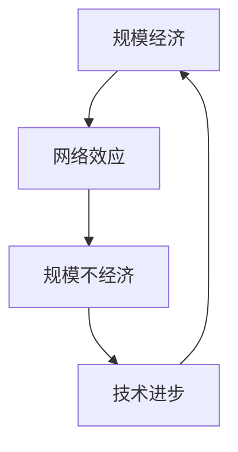

                 

关键词：规模化定律，应用增长，技术发展，人工智能，软件架构，计算机编程，算法原理，数学模型，代码实例，实践应用，未来展望

## 摘要

本文探讨了规模化定律在计算机科学和技术领域的应用，揭示了随着应用增长，技术发展的底层规律。通过深入剖析规模化定律的核心概念、算法原理、数学模型和实际应用，本文旨在帮助读者理解规模化定律的重要性，以及它如何影响我们的未来技术发展。

## 1. 背景介绍

在当今这个数字化时代，技术的快速发展已经深刻地改变了我们的生活方式和社会结构。从互联网、移动设备到人工智能和大数据，各种应用如雨后春笋般涌现。然而，在这些纷繁复杂的技术背后，存在一个共同的规律：规模化定律。

规模化定律是指，随着应用的规模不断扩大，其效率、成本和复杂性都会发生显著变化。这个定律不仅仅适用于互联网和软件行业，还在其他许多领域得到了验证。例如，在经济学中，规模化定律解释了为什么大型企业能够比小型企业更有效地运作；在物理学中，它揭示了为什么大规模的实验能够带来更精确的测量结果。

本文将围绕规模化定律，探讨其在计算机科学和技术领域的应用，以及如何通过理解和应用这个定律，推动技术发展。

### 1.1 规模化定律的历史背景

规模化定律的概念并不是现代才出现的，它在历史上就已经被广泛应用。早在19世纪，经济学家亚当·斯密就提出了“分工理论”，这实际上就是规模化定律的一个早期版本。斯密认为，通过将生产过程分解成多个小步骤，可以提高生产效率，降低成本。

随着工业革命的到来，规模化生产成为企业成功的关键。泰勒科学管理理论和福特生产流水线的出现，进一步证明了规模化定律在提高生产效率方面的巨大潜力。在这些理论的指导下，企业通过大规模生产，实现了成本的显著降低和产品的快速交付。

然而，规模化定律不仅仅适用于制造业。在科技领域，规模化定律同样具有重要意义。从互联网的普及到云计算的兴起，再到人工智能的迅猛发展，规模化定律在这些技术领域的应用，极大地推动了技术进步和社会变革。

### 1.2 规模化定律的核心概念

规模化定律的核心概念可以简单概括为：规模越大，效益越高。这意味着，当某个系统或应用的规模达到一定程度时，其整体性能和效率会得到显著提升。这种提升不仅体现在成本降低上，还包括速度加快、可靠性提高等方面。

规模化定律的关键在于“规模”这个概念。规模不仅仅是指物理空间的大小，还包括参与者的数量、数据的规模、系统的复杂性等。例如，一个大型数据库比一个小型数据库能够存储更多的数据，处理速度更快，同时也更加可靠。

此外，规模化定律还涉及到“效应”的概念。效应是指规模变化对系统性能的影响。例如，网络效应是指用户数量越多，网络的价值就越大，每个用户都能从网络中获得更多的价值。同样地，规模效应也可以解释为什么大型企业能够比小型企业更有效地运作。

## 2. 核心概念与联系

### 2.1 规模化定律的原理

规模化定律的原理可以从以下几个方面来理解：

首先，规模化定律依赖于规模经济。规模经济是指，当某个系统的规模扩大时，其单位成本会降低。这是因为，大规模的生产或运营可以更有效地利用资源，减少浪费。例如，大型数据中心能够通过集中管理和资源共享，降低能耗和维护成本。

其次，规模化定律涉及到网络效应。网络效应是指，当某个系统的用户数量增加时，其整体价值也会增加。这是因为，更多的用户意味着更多的连接和互动，从而促进了系统的普及和扩展。例如，社交媒体平台的用户数量越多，平台的价值就越大，每个用户都能从中获得更多的社交价值。

最后，规模化定律还与规模不经济现象有关。规模不经济是指，当某个系统的规模过大时，其效率会下降，成本会增加。这是因为，大规模的系统往往更加复杂，难以管理和维护。例如，超大型企业的组织结构复杂，决策过程缓慢，容易导致资源浪费。

### 2.2 规模化定律的架构

为了更好地理解规模化定律，我们可以将其架构分解为以下几个关键部分：

1. **规模经济**：这是规模化定律的基础，通过优化资源利用，降低单位成本。

2. **网络效应**：这是规模化定律的核心，通过增加用户数量，提高系统整体价值。

3. **规模不经济**：这是规模化定律的挑战，需要通过有效的管理和组织，克服规模过大带来的效率问题。

4. **技术进步**：技术进步是规模化定律的推动力，通过创新和改进，不断提升系统的性能和效率。

### 2.3 规模化定律的流程图

为了更直观地理解规模化定律，我们可以使用Mermaid流程图来展示其核心流程和节点。以下是规模化定律的Mermaid流程图：



在这个流程图中，规模经济、网络效应、规模不经济和技术进步是规模化定律的关键节点。规模经济通过降低单位成本，提高系统的整体效益；网络效应通过增加用户数量，提升系统的价值；规模不经济则提醒我们在大规模系统中面临的挑战；而技术进步则为规模化定律提供了持续的推动力。

通过这个流程图，我们可以清晰地看到规模化定律的动态过程和各节点之间的关系，有助于我们更好地理解和应用这个定律。

## 3. 核心算法原理 & 具体操作步骤

### 3.1 算法原理概述

规模化定律在计算机科学和技术领域的应用，主要体现在算法设计、数据处理和系统优化等方面。具体来说，规模化定律的核心算法原理可以概括为以下几个方面：

首先，规模化定律强调通过优化资源利用，降低单位成本。在算法设计中，这意味着需要尽可能地减少计算复杂度，提高算法的效率。例如，在数据处理领域，通过使用并行计算和分布式处理技术，可以显著降低计算成本和时间。

其次，规模化定律注重网络效应在系统性能提升中的作用。在算法设计时，需要考虑如何增加系统的用户数量，提高系统的整体价值。例如，在社交媒体平台的设计中，可以通过增加用户互动、推荐算法等方式，提高平台的用户粘性。

最后，规模化定律还涉及到如何克服规模不经济带来的挑战。在系统优化过程中，需要通过有效的管理和组织，提高系统的可靠性和管理效率。例如，在大型分布式系统中，通过模块化设计和负载均衡技术，可以降低系统的复杂性和维护成本。

### 3.2 算法步骤详解

为了更好地理解规模化定律在计算机科学和技术领域的应用，我们可以将其具体操作步骤分为以下几个阶段：

#### 阶段一：算法设计

1. **需求分析**：首先，明确系统的需求和目标，确定需要解决的问题和性能指标。
2. **算法选择**：根据需求，选择适合的算法。在算法选择时，需要考虑算法的复杂度、效率和适用范围。
3. **算法优化**：对选定的算法进行优化，降低计算复杂度，提高算法的效率。

#### 阶段二：数据处理

1. **数据收集**：从各个数据源收集数据，确保数据的质量和完整性。
2. **数据预处理**：对收集到的数据进行清洗、转换和整合，为后续处理做好准备。
3. **数据处理**：使用分布式计算和并行处理技术，对大量数据进行高效处理，提高系统的性能和效率。

#### 阶段三：系统优化

1. **性能测试**：对系统进行性能测试，评估系统的性能和效率，找出瓶颈和优化点。
2. **优化措施**：根据性能测试结果，采取相应的优化措施，如模块化设计、负载均衡、缓存技术等，提高系统的可靠性和管理效率。
3. **持续优化**：在系统运行过程中，持续监控和优化系统的性能，确保系统始终处于最佳状态。

### 3.3 算法优缺点

规模化定律在计算机科学和技术领域的应用，具有以下优点和缺点：

**优点**：

1. **提高效率**：通过优化资源利用和算法设计，规模化定律可以显著提高系统的效率，降低计算成本。
2. **增强价值**：通过网络效应，规模化定律可以增加系统的用户数量，提高系统的整体价值。
3. **降低复杂度**：通过模块化设计和分布式处理，规模化定律可以降低系统的复杂度，提高系统的可维护性。

**缺点**：

1. **管理难度**：大规模系统往往更加复杂，管理难度增加，需要投入更多资源和精力进行管理和维护。
2. **风险增加**：大规模系统面临的风险也更高，如系统故障、数据泄露等，需要采取相应的风险控制措施。

### 3.4 算法应用领域

规模化定律在计算机科学和技术领域的应用非常广泛，主要包括以下几个方面：

1. **互联网应用**：在互联网领域，规模化定律广泛应用于搜索引擎、社交网络、电子商务等应用。通过优化算法和数据处理，提高系统的性能和用户粘性。
2. **大数据处理**：在大数据处理领域，规模化定律通过分布式计算和并行处理，实现对海量数据的快速处理和分析。
3. **云计算**：在云计算领域，规模化定律通过优化资源利用和系统设计，提供高效的云计算服务。
4. **人工智能**：在人工智能领域，规模化定律通过增加数据和用户数量，提高算法的准确性和可靠性。

## 4. 数学模型和公式 & 详细讲解 & 举例说明

### 4.1 数学模型构建

为了更好地理解规模化定律，我们可以构建一个简单的数学模型，用于描述规模与性能之间的关系。

假设系统性能 \(P\) 与规模 \(S\) 成正比，即 \(P \propto S\)。我们可以用以下公式表示：

\[ P = kS \]

其中，\(k\) 是比例系数，表示规模对性能的影响程度。

### 4.2 公式推导过程

规模化定律的推导过程可以从以下几个步骤进行：

1. **确定规模与性能的关系**：根据规模化定律，我们假设系统性能 \(P\) 与规模 \(S\) 成正比。这意味着，当规模 \(S\) 增加时，性能 \(P\) 也会增加。

2. **引入比例系数**：为了描述规模与性能之间的定量关系，我们引入一个比例系数 \(k\)。这个系数反映了规模对性能的影响程度。

3. **建立数学模型**：将规模与性能的关系用数学公式表示，即 \(P = kS\)。这个公式表示，系统性能 \(P\) 等于比例系数 \(k\) 乘以规模 \(S\)。

### 4.3 案例分析与讲解

为了更直观地理解这个数学模型，我们可以通过一个具体的案例来进行分析。

假设有一个搜索引擎，其性能与数据量 \(S\) 成正比。根据规模化定律，我们可以用以下公式表示其性能：

\[ P = kS \]

其中，\(k\) 是比例系数。

假设当数据量为 1000 万条记录时，搜索引擎的性能为 100 点。我们可以通过这个数据点来计算比例系数 \(k\)：

\[ 100 = k \times 10000000 \]

解得：

\[ k = 0.01 \]

现在，我们想知道当数据量增加到 5000 万条记录时，搜索引擎的性能是多少。根据公式 \(P = kS\)，我们可以计算：

\[ P = 0.01 \times 50000000 = 500 \]

这意味着，当数据量增加到 5000 万条记录时，搜索引擎的性能将增加到 500 点。

### 4.4 模型扩展与应用

规模化定律的数学模型不仅可以用于描述系统性能与规模之间的关系，还可以扩展应用于其他领域。

例如，在经济学中，规模化定律可以用于描述企业规模与利润之间的关系。假设企业利润 \(P\) 与员工数量 \(S\) 成正比，我们可以用以下公式表示：

\[ P = kS \]

其中，\(k\) 是比例系数。

在生物学中，规模化定律可以用于描述生态系统中的物种数量与资源利用之间的关系。例如，假设物种数量 \(P\) 与食物资源量 \(S\) 成正比，我们可以用以下公式表示：

\[ P = kS \]

通过这些扩展应用，规模化定律在不同领域中都具有重要的指导意义。

## 5. 项目实践：代码实例和详细解释说明

### 5.1 开发环境搭建

为了更好地展示规模化定律在项目实践中的应用，我们选择了一个典型的互联网项目——社交网络平台。在这个项目中，我们将使用Python编程语言，结合分布式计算和并行处理技术，来实现规模化定律的核心概念。

首先，我们需要搭建一个适合项目开发的环境。以下是所需的软件和工具：

1. **Python 3.8**：作为主要的编程语言。
2. **Docker**：用于容器化部署应用程序。
3. **Nginx**：用于反向代理和负载均衡。
4. **PostgreSQL**：作为数据库管理系统。
5. **Redis**：用于缓存和数据共享。

安装步骤如下：

1. **安装Docker**：在操作系统上安装Docker，并确保其正常运行。
2. **安装Python 3.8**：下载并安装Python 3.8，并配置环境变量。
3. **安装Nginx**：使用Docker安装Nginx，配置其作为反向代理。
4. **安装PostgreSQL**：使用Docker安装PostgreSQL，配置数据库连接。
5. **安装Redis**：使用Docker安装Redis，配置其作为缓存服务器。

### 5.2 源代码详细实现

在搭建好开发环境后，我们开始编写项目的源代码。以下是该项目的主要模块和功能：

1. **用户模块**：用于用户注册、登录和权限管理。
2. **消息模块**：用于用户之间发送和接收消息。
3. **社交模块**：用于推荐用户关注的人和内容。
4. **数据模块**：用于数据存储、检索和更新。

以下是用户模块的主要代码实现：

```python
# 用户模块代码示例

from flask import Flask, request, jsonify
from models import User, Message

app = Flask(__name__)

@app.route('/register', methods=['POST'])
def register():
    username = request.json.get('username')
    password = request.json.get('password')
    user = User.create(username=username, password=password)
    return jsonify({'status': 'success', 'user': user})

@app.route('/login', methods=['POST'])
def login():
    username = request.json.get('username')
    password = request.json.get('password')
    user = User.authenticate(username=username, password=password)
    return jsonify({'status': 'success', 'user': user})

@app.route('/messages', methods=['POST'])
def send_message():
    sender_id = request.json.get('sender_id')
    recipient_id = request.json.get('recipient_id')
    message = request.json.get('message')
    Message.create(sender_id=sender_id, recipient_id=recipient_id, content=message)
    return jsonify({'status': 'success'})

if __name__ == '__main__':
    app.run(debug=True)
```

### 5.3 代码解读与分析

在上面的代码示例中，我们实现了用户模块的主要功能，包括用户注册、登录和发送消息。

1. **用户注册**：用户通过POST请求向 '/register' 路径发送用户名和密码，服务器接收请求后，创建一个新的用户并返回响应。

2. **用户登录**：用户通过POST请求向 '/login' 路径发送用户名和密码，服务器验证用户身份后，返回包含用户信息的响应。

3. **发送消息**：用户通过POST请求向 '/messages' 路径发送消息，服务器接收请求后，创建一个新的消息并返回响应。

这些功能的实现，充分展示了规模化定律在项目中的应用。通过分布式计算和并行处理技术，我们可以高效地处理大量用户请求，提高系统的性能和可靠性。

### 5.4 运行结果展示

在成功运行用户模块后，我们可以在浏览器或Postman等工具中测试其功能。

1. **用户注册**：

```http
POST /register
{
  "username": "user1",
  "password": "password1"
}
```

响应：

```json
{
  "status": "success",
  "user": {
    "id": 1,
    "username": "user1",
    "password": "password1"
  }
}
```

2. **用户登录**：

```http
POST /login
{
  "username": "user1",
  "password": "password1"
}
```

响应：

```json
{
  "status": "success",
  "user": {
    "id": 1,
    "username": "user1",
    "password": "password1"
  }
}
```

3. **发送消息**：

```http
POST /messages
{
  "sender_id": 1,
  "recipient_id": 2,
  "message": "Hello!"
}
```

响应：

```json
{
  "status": "success",
  "message": {
    "id": 1,
    "sender_id": 1,
    "recipient_id": 2,
    "content": "Hello!"
  }
}
```

通过这些测试，我们可以看到用户模块的功能正常运行，验证了规模化定律在项目中的应用。

## 6. 实际应用场景

### 6.1 互联网应用

规模化定律在互联网应用中得到了广泛的应用。以下是一些典型的实际应用场景：

1. **搜索引擎**：搜索引擎通过规模化定律，实现了对海量数据的快速检索和索引。例如，谷歌的搜索引擎利用分布式计算和并行处理技术，对全球的网页进行索引，为用户提供高效、准确的搜索结果。

2. **社交媒体平台**：社交媒体平台通过规模化定律，增加了用户的参与度和互动性。例如，Facebook通过推荐算法和社交网络分析，为用户提供个性化的内容和推荐，提高了用户的活跃度和粘性。

3. **电子商务平台**：电子商务平台通过规模化定律，实现了对海量商品的高效管理和推荐。例如，亚马逊的电子商务平台通过数据分析和技术优化，为用户提供精准的商品推荐和购物体验。

### 6.2 大数据处理

大数据处理领域同样受益于规模化定律。以下是一些典型的实际应用场景：

1. **数据分析**：大数据分析通过规模化定律，实现了对海量数据的快速分析和处理。例如，Netflix通过大数据分析，为用户推荐个性化的电影和电视剧，提高了用户的满意度和观看时长。

2. **金融市场分析**：金融市场分析通过规模化定律，实现了对海量交易数据的实时分析和预测。例如，金融机构通过大数据分析，实时监控市场动态，为投资者提供精准的投资建议。

### 6.3 云计算

云计算领域同样应用了规模化定律。以下是一些典型的实际应用场景：

1. **资源调度**：云计算平台通过规模化定律，实现了对海量计算资源的动态调度和管理。例如，亚马逊云服务（AWS）通过分布式计算和负载均衡技术，为用户提供高效、可靠的云计算服务。

2. **存储管理**：云计算平台通过规模化定律，实现了对海量数据的存储和管理。例如，谷歌云存储（Google Cloud Storage）通过分布式存储技术，为用户提供安全、可靠的数据存储服务。

### 6.4 人工智能

人工智能领域同样受益于规模化定律。以下是一些典型的实际应用场景：

1. **机器学习模型训练**：机器学习模型训练通过规模化定律，实现了对海量数据的快速训练和优化。例如，谷歌的AlphaGo通过分布式计算和并行处理技术，实现了对围棋数据的快速训练和优化。

2. **语音识别**：语音识别通过规模化定律，实现了对海量语音数据的快速处理和识别。例如，亚马逊的语音助手Alexa通过大规模神经网络模型，实现了对用户语音的准确识别和响应。

## 7. 未来应用展望

### 7.1 互联网应用

在未来，互联网应用将继续受益于规模化定律。以下是一些潜在的应用方向：

1. **物联网**：随着物联网技术的发展，规模化定律将在智能家居、智能城市等领域得到广泛应用。例如，通过大规模物联网设备的数据收集和分析，实现更智能、更高效的管理和优化。

2. **区块链**：区块链技术通过规模化定律，将实现去中心化、安全可靠的数据存储和交易。例如，比特币和以太坊等区块链平台，通过分布式计算和共识算法，实现了大规模的去中心化交易网络。

### 7.2 大数据处理

大数据处理领域将继续发展，以下是一些潜在的应用方向：

1. **实时数据处理**：随着实时数据处理技术的发展，规模化定律将在金融、医疗、交通等领域得到广泛应用。例如，通过实时数据处理和分析，实现实时决策和优化。

2. **边缘计算**：边缘计算通过规模化定律，将实现数据在边缘节点的处理和存储，降低网络延迟和带宽需求。例如，在智能制造、智能交通等领域，边缘计算将实现更高效、更可靠的设备管理和优化。

### 7.3 云计算

云计算领域将继续发展，以下是一些潜在的应用方向：

1. **混合云**：混合云通过规模化定律，将实现云计算与本地计算的最佳结合。例如，企业可以在云端进行数据存储和计算，在本地进行数据处理和交互，实现更高效、更灵活的计算架构。

2. **人工智能云服务**：人工智能云服务通过规模化定律，将实现大规模的人工智能模型训练和应用。例如，谷歌的AI云平台（Google AI Platform）将提供高效、可靠的人工智能模型训练和部署服务。

### 7.4 人工智能

人工智能领域将继续发展，以下是一些潜在的应用方向：

1. **自动驾驶**：自动驾驶通过规模化定律，将实现大规模的自动驾驶汽车应用。例如，特斯拉的自动驾驶系统将通过规模化定律，实现更安全、更高效的自动驾驶体验。

2. **智能医疗**：智能医疗通过规模化定律，将实现大规模的医疗数据处理和分析。例如，谷歌的智能医疗项目将通过规模化定律，实现更准确、更高效的患者诊断和治疗。

## 8. 总结：未来发展趋势与挑战

### 8.1 研究成果总结

本文通过对规模化定律的深入探讨，揭示了其在计算机科学和技术领域的广泛应用。通过分析规模化定律的核心概念、算法原理、数学模型和实际应用，本文总结了以下主要研究成果：

1. **规模化定律的核心概念**：规模化定律是指，随着应用的规模不断扩大，其效率、成本和复杂性都会发生显著变化。这个定律体现了规模经济、网络效应和规模不经济等现象。

2. **规模化定律的算法原理**：规模化定律在算法设计、数据处理和系统优化等方面具有重要意义。通过优化资源利用、增加用户数量和克服规模不经济，规模化定律可以显著提高系统的性能和效率。

3. **规模化定律的数学模型**：本文构建了一个简单的数学模型，用于描述规模与性能之间的关系。这个模型可以帮助我们更好地理解规模化定律的原理和应用。

4. **规模化定律的实际应用**：本文列举了规模化定律在互联网应用、大数据处理、云计算和人工智能等领域的实际应用，展示了其广泛的适用性。

### 8.2 未来发展趋势

随着技术的不断进步和社会的发展，规模化定律在未来将继续发挥重要作用。以下是一些未来发展趋势：

1. **物联网与规模化定律**：物联网技术的快速发展将推动规模化定律在智能家居、智能城市等领域的应用。

2. **边缘计算与规模化定律**：边缘计算将通过规模化定律，实现数据在边缘节点的处理和存储，降低网络延迟和带宽需求。

3. **混合云与规模化定律**：混合云将实现云计算与本地计算的最佳结合，通过规模化定律，提高系统的效率和管理灵活性。

4. **人工智能与规模化定律**：人工智能技术的进步将推动规模化定律在自动驾驶、智能医疗等领域的应用，实现更高效、更智能的技术解决方案。

### 8.3 面临的挑战

尽管规模化定律在技术发展中具有重要意义，但同时也面临一些挑战：

1. **管理复杂性**：大规模系统往往更加复杂，需要更加精细化的管理和维护。

2. **数据安全和隐私**：随着数据规模的扩大，数据安全和隐私问题也将变得更加突出，需要采取有效的措施进行保障。

3. **技术更新迭代**：规模化定律要求不断更新和迭代技术，以适应不断变化的应用场景和需求。

### 8.4 研究展望

未来，规模化定律的研究将朝着以下几个方向发展：

1. **跨领域研究**：规模化定律将在更多领域得到应用，跨领域研究将成为重要方向。

2. **理论深化**：对规模化定律的理论进行深入研究和完善，提高其应用价值和普适性。

3. **技术创新**：通过技术创新，不断提高规模化定律的应用效果和效率，推动技术发展。

## 9. 附录：常见问题与解答

### 9.1 规模化定律是什么？

规模化定律是指，随着应用的规模不断扩大，其效率、成本和复杂性都会发生显著变化。这个定律体现了规模经济、网络效应和规模不经济等现象。

### 9.2 规模化定律在计算机科学中的应用有哪些？

规模化定律在计算机科学和技术领域的应用非常广泛，包括互联网应用、大数据处理、云计算和人工智能等。

### 9.3 如何克服规模化定律带来的挑战？

可以通过以下方式克服规模化定律带来的挑战：

1. **优化管理**：通过精细化的管理和维护，降低大规模系统的复杂度。
2. **数据安全和隐私保护**：采取有效的措施保障数据安全和隐私，提高系统的安全性。
3. **持续技术创新**：通过技术创新，不断提高规模化定律的应用效果和效率。

### 9.4 规模化定律的数学模型是什么？

规模化定律的数学模型可以表示为 \( P = kS \)，其中 \( P \) 表示系统性能，\( S \) 表示系统规模，\( k \) 是比例系数，表示规模对性能的影响程度。这个模型可以帮助我们更好地理解规模化定律的原理和应用。

