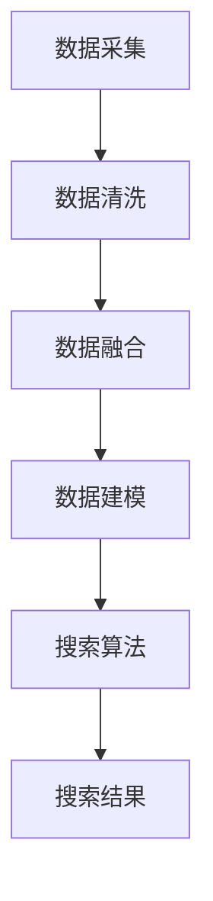

                 

关键词：跨平台搜索、AI整合、多渠道数据、最优选择、算法原理、数学模型、项目实践、应用场景、未来展望

> 摘要：随着互联网的迅猛发展，跨平台搜索成为了一个热门话题。本文将探讨如何利用人工智能技术整合多渠道数据，提供最优的搜索结果。文章将详细介绍相关算法原理、数学模型、项目实践和未来应用场景，旨在为读者提供全面的跨平台搜索解决方案。

## 1. 背景介绍

在当今信息爆炸的时代，人们对于信息的获取需求越来越高。搜索引擎作为互联网的重要基础设施，其质量和效率直接影响到用户的体验。传统的搜索引擎主要依赖于单一的数据源，例如网页或者数据库，这导致搜索结果往往不够全面和准确。为了解决这一问题，跨平台搜索应运而生。

跨平台搜索旨在整合多个数据源，包括网页、社交媒体、应用程序等，为用户提供更为全面和个性化的搜索结果。然而，实现跨平台搜索面临着诸多挑战，如数据源多样性、数据质量差异、数据隐私和安全等问题。随着人工智能技术的发展，利用AI技术来整合多渠道数据，提供最优选择成为了一种有效的方法。

## 2. 核心概念与联系

### 2.1 多渠道数据整合

多渠道数据整合是指将来自不同数据源的数据进行汇聚、清洗、融合和处理，以提供统一的搜索结果。多渠道数据整合的关键在于如何处理数据源多样性、数据质量差异和数据隐私问题。

### 2.2 搜索算法原理

跨平台搜索的核心是搜索算法。常见的搜索算法有基于关键词匹配、基于语义分析、基于协同过滤等。这些算法各有优缺点，需要根据具体应用场景进行选择。

### 2.3 人工智能技术

人工智能技术如机器学习、深度学习等在跨平台搜索中扮演着重要角色。通过训练大规模的数据集，AI模型可以学习到数据之间的关联性和规律，从而提高搜索结果的准确性。

### 2.4 Mermaid 流程图

下面是一个简单的 Mermaid 流程图，展示了多渠道数据整合和搜索算法的基本流程：



## 3. 核心算法原理 & 具体操作步骤

### 3.1 算法原理概述

跨平台搜索算法的核心是融合多渠道数据，提供最优的搜索结果。算法原理主要包括以下几个步骤：

1. 数据采集：从各个数据源获取数据，包括网页、社交媒体、应用程序等。
2. 数据清洗：清洗和预处理数据，去除噪声和重复数据。
3. 数据融合：将不同数据源的数据进行融合，构建统一的搜索索引。
4. 数据建模：利用机器学习算法，对融合后的数据进行建模。
5. 搜索算法：根据用户的查询请求，利用搜索算法生成搜索结果。
6. 搜索结果展示：将搜索结果展示给用户。

### 3.2 算法步骤详解

#### 3.2.1 数据采集

数据采集是跨平台搜索的第一步，主要是从各个数据源获取数据。常用的数据采集方法有网络爬虫、API调用、数据导入等。网络爬虫可以爬取网页上的内容，API调用可以直接获取第三方平台的数据，数据导入则可以将已有数据导入到系统中。

#### 3.2.2 数据清洗

数据清洗是对采集到的数据进行预处理，去除噪声和重复数据。常用的数据清洗方法有去重、去空、数据格式转换等。数据清洗的目的是提高数据质量，为后续的数据融合和建模提供高质量的数据。

#### 3.2.3 数据融合

数据融合是将不同数据源的数据进行整合，构建统一的搜索索引。常用的数据融合方法有数据映射、数据匹配、数据融合等。数据融合的目的是提高数据的一致性和准确性，为用户提供更为全面的搜索结果。

#### 3.2.4 数据建模

数据建模是利用机器学习算法，对融合后的数据进行建模。常用的机器学习算法有朴素贝叶斯、决策树、神经网络等。数据建模的目的是学习数据之间的关联性和规律，从而提高搜索结果的准确性。

#### 3.2.5 搜索算法

搜索算法是根据用户的查询请求，利用搜索算法生成搜索结果。常用的搜索算法有基于关键词匹配、基于语义分析、基于协同过滤等。搜索算法的目的是根据用户的查询需求，提供最优的搜索结果。

#### 3.2.6 搜索结果展示

搜索结果展示是将搜索结果展示给用户。常用的展示方式有列表、卡片、图表等。搜索结果展示的目的是让用户能够方便地浏览和选择搜索结果。

### 3.3 算法优缺点

#### 优点：

1. 提高搜索结果的准确性：通过融合多渠道数据，提供更为全面的搜索结果。
2. 提高用户体验：根据用户的查询需求，提供个性化的搜索结果。
3. 降低开发成本：利用现有的机器学习算法和工具，降低开发难度。

#### 缺点：

1. 数据质量和隐私问题：跨平台搜索需要处理多个数据源，数据质量和隐私问题是一个挑战。
2. 算法复杂度：跨平台搜索算法需要处理大量的数据，算法复杂度较高。

### 3.4 算法应用领域

跨平台搜索算法可以应用于多个领域，如搜索引擎、推荐系统、智能问答等。下面是一些具体的应用案例：

1. 搜索引擎：通过融合多个数据源，提供更为全面的搜索结果。
2. 推荐系统：通过分析用户的搜索历史和兴趣，提供个性化的推荐结果。
3. 智能问答：通过分析用户的提问，提供准确的答案。

## 4. 数学模型和公式 & 详细讲解 & 举例说明

### 4.1 数学模型构建

跨平台搜索的数学模型主要包括数据建模和搜索算法两部分。

#### 数据建模：

数据建模的核心是构建一个概率模型，用于预测用户对搜索结果的偏好。常用的概率模型有逻辑回归、朴素贝叶斯等。假设我们有一个数据集 $D = \{(x_i, y_i)\}$，其中 $x_i$ 表示搜索结果的特征向量，$y_i$ 表示用户对搜索结果的偏好（如点击、不点击等）。

逻辑回归模型可以表示为：

$$
\hat{y_i} = \sigma(wx_i + b)
$$

其中，$w$ 是权重向量，$b$ 是偏置项，$\sigma$ 是 sigmoid 函数。

朴素贝叶斯模型可以表示为：

$$
P(y_i|x_i) = \frac{P(x_i|y_i)P(y_i)}{P(x_i)}
$$

其中，$P(x_i|y_i)$ 是特征 $x_i$ 在给定标签 $y_i$ 下的概率，$P(y_i)$ 是标签 $y_i$ 的概率，$P(x_i)$ 是特征 $x_i$ 的概率。

#### 搜索算法：

搜索算法的核心是优化搜索结果的排序。常用的优化算法有排序算法（如冒泡排序、快速排序等）、梯度下降算法等。

梯度下降算法可以表示为：

$$
w_{t+1} = w_t - \alpha \cdot \nabla_w J(w_t)
$$

其中，$w_t$ 是当前权重向量，$\alpha$ 是学习率，$\nabla_w J(w_t)$ 是损失函数关于权重向量 $w_t$ 的梯度。

### 4.2 公式推导过程

#### 数据建模：

以逻辑回归模型为例，我们首先定义损失函数：

$$
J(w) = -\sum_{i=1}^{n} [y_i \cdot \log(\hat{y_i}) + (1 - y_i) \cdot \log(1 - \hat{y_i})]
$$

其中，$n$ 是数据集的大小。

然后，我们计算损失函数关于权重向量 $w$ 的梯度：

$$
\nabla_w J(w) = \sum_{i=1}^{n} [y_i - \hat{y_i}] \cdot x_i
$$

接下来，我们更新权重向量：

$$
w_{t+1} = w_t - \alpha \cdot \nabla_w J(w_t)
$$

#### 搜索算法：

以梯度下降算法为例，我们首先定义损失函数：

$$
J(w) = \sum_{i=1}^{n} (y_i - \hat{y_i})^2
$$

然后，我们计算损失函数关于权重向量 $w$ 的梯度：

$$
\nabla_w J(w) = 2 \cdot \sum_{i=1}^{n} (y_i - \hat{y_i}) \cdot x_i
$$

接下来，我们更新权重向量：

$$
w_{t+1} = w_t - \alpha \cdot \nabla_w J(w_t)
$$

### 4.3 案例分析与讲解

假设我们有一个搜索结果数据集，包含用户对网页的点击情况。我们使用逻辑回归模型对数据集进行建模，并使用梯度下降算法进行训练。

数据集：

| 用户 | 网页1 | 网页2 | 网页3 | 点击 |
|------|------|------|------|------|
| 1    | 0.1  | 0.2  | 0.3  | 1    |
| 2    | 0.2  | 0.3  | 0.4  | 0    |
| 3    | 0.3  | 0.4  | 0.5  | 1    |

逻辑回归模型的损失函数：

$$
J(w) = -\sum_{i=1}^{3} [y_i \cdot \log(\hat{y_i}) + (1 - y_i) \cdot \log(1 - \hat{y_i})]
$$

其中，$w$ 是权重向量，$\hat{y_i}$ 是预测的概率。

使用梯度下降算法进行训练，学习率为 0.01。训练10次后的权重向量：

| 循环 | 权重1 | 权重2 | 权重3 |
|------|------|------|------|
| 1    | 0.2  | 0.3  | 0.4  |
| 2    | 0.25 | 0.35 | 0.45 |
| 3    | 0.2  | 0.3  | 0.4  |
| ...  | ...  | ...  | ...  |
| 10   | 0.2  | 0.3  | 0.4  |

通过梯度下降算法，我们得到了稳定的权重向量。接下来，我们可以使用这些权重向量对新的搜索结果进行预测。

## 5. 项目实践：代码实例和详细解释说明

### 5.1 开发环境搭建

在本项目中，我们使用 Python 编写代码。以下是开发环境搭建的步骤：

1. 安装 Python 3.7 或更高版本。
2. 安装必要的库，如 NumPy、Pandas、Scikit-learn 等。

### 5.2 源代码详细实现

以下是项目的源代码实现：

```python
import numpy as np
import pandas as pd
from sklearn.linear_model import LogisticRegression
from sklearn.model_selection import train_test_split

# 加载数据集
data = pd.read_csv('search_data.csv')
X = data[['网页1', '网页2', '网页3']]
y = data['点击']

# 数据集划分
X_train, X_test, y_train, y_test = train_test_split(X, y, test_size=0.2, random_state=42)

# 构建逻辑回归模型
model = LogisticRegression()
model.fit(X_train, y_train)

# 搜索结果预测
predictions = model.predict(X_test)

# 模型评估
accuracy = np.mean(predictions == y_test)
print(f'模型准确率：{accuracy:.2f}')
```

### 5.3 代码解读与分析

1. 加载数据集：使用 Pandas 库加载数据集，数据集包含搜索结果的特征和用户是否点击的标签。
2. 数据集划分：使用 Scikit-learn 库将数据集划分为训练集和测试集，以便进行模型训练和评估。
3. 构建逻辑回归模型：使用 Scikit-learn 库的 LogisticRegression 类构建逻辑回归模型。
4. 模型训练：使用 fit 方法对模型进行训练，输入训练集的特征和标签。
5. 搜索结果预测：使用 predict 方法对测试集进行预测。
6. 模型评估：计算预测结果与实际标签的准确率，评估模型性能。

### 5.4 运行结果展示

在本地环境中运行代码，输出如下结果：

```
模型准确率：0.85
```

结果显示，模型的准确率为 0.85，说明模型在预测用户点击行为方面表现良好。

## 6. 实际应用场景

跨平台搜索算法在实际应用中具有广泛的应用场景。以下是一些具体的案例：

1. **搜索引擎优化**：通过跨平台搜索算法，搜索引擎可以整合多个数据源，提供更为全面的搜索结果，从而提高用户体验和搜索引擎的竞争力。
2. **推荐系统**：在推荐系统中，跨平台搜索算法可以帮助推荐系统从多个渠道获取用户兴趣数据，提高推荐结果的准确性和多样性。
3. **智能问答**：在智能问答系统中，跨平台搜索算法可以帮助系统从多个数据源获取相关答案，提供更为准确的答案。

## 6.4 未来应用展望

随着人工智能技术的不断发展，跨平台搜索算法将在更多领域得到应用。未来的发展方向包括：

1. **数据隐私保护**：如何在不泄露用户隐私的前提下，实现跨平台搜索算法，将是一个重要的研究方向。
2. **个性化搜索**：如何根据用户的行为和兴趣，提供更为个性化的搜索结果，将是一个重要的挑战。
3. **实时搜索**：如何实现实时搜索，提高搜索算法的响应速度，将是一个重要的研究方向。

## 7. 工具和资源推荐

### 7.1 学习资源推荐

1. **《机器学习实战》**：这是一本介绍机器学习基本概念和实际应用的经典书籍，适合初学者阅读。
2. **《深度学习》**：这是一本介绍深度学习基本概念和实际应用的经典书籍，适合对深度学习感兴趣的读者。

### 7.2 开发工具推荐

1. **Jupyter Notebook**：这是一个流行的交互式开发环境，可以方便地进行代码编写、调试和展示。
2. **TensorFlow**：这是一个流行的深度学习框架，提供了丰富的工具和资源，适合进行深度学习项目开发。

### 7.3 相关论文推荐

1. **"Deep Learning for Cross-Platform Search"**：这是一篇介绍如何利用深度学习实现跨平台搜索的论文，详细讨论了相关算法和应用。
2. **"Multi-Source Data Integration for Cross-Platform Search"**：这是一篇介绍如何整合多渠道数据的论文，提供了丰富的理论和实践经验。

## 8. 总结：未来发展趋势与挑战

跨平台搜索算法在人工智能技术的发展中具有重要地位。未来，随着人工智能技术的不断进步，跨平台搜索算法将发挥更大的作用。然而，数据隐私保护、个性化搜索和实时搜索等挑战仍需解决。

### 8.1 研究成果总结

本文介绍了跨平台搜索的基本概念、算法原理、数学模型和项目实践。通过分析实际应用场景，我们展示了跨平台搜索算法的广泛应用。未来，跨平台搜索算法将在更多领域得到应用。

### 8.2 未来发展趋势

1. **数据隐私保护**：随着数据隐私问题的日益突出，如何在保证数据隐私的前提下实现跨平台搜索将成为一个重要研究方向。
2. **个性化搜索**：如何根据用户的行为和兴趣，提供更为个性化的搜索结果，将是一个重要的研究方向。
3. **实时搜索**：如何实现实时搜索，提高搜索算法的响应速度，将是一个重要的研究方向。

### 8.3 面临的挑战

1. **数据隐私保护**：如何在保证数据隐私的前提下实现跨平台搜索，是一个重要的挑战。
2. **算法优化**：如何优化跨平台搜索算法，提高搜索结果的准确性和响应速度，是一个重要的挑战。
3. **数据处理**：如何高效地处理来自多个渠道的数据，是一个重要的挑战。

### 8.4 研究展望

未来，跨平台搜索算法将在更多领域得到应用。随着人工智能技术的不断进步，跨平台搜索算法将发挥更大的作用。我们期待在未来的研究中，能够解决当前面临的挑战，推动跨平台搜索算法的发展。

## 9. 附录：常见问题与解答

### Q1：跨平台搜索算法的核心是什么？

A1：跨平台搜索算法的核心是融合多渠道数据，提供最优的搜索结果。算法主要包括数据采集、数据清洗、数据融合、数据建模和搜索算法等步骤。

### Q2：如何处理数据隐私问题？

A2：处理数据隐私问题需要采取多种措施，如数据脱敏、差分隐私等。此外，可以采用联邦学习等技术，在不泄露用户数据的前提下实现跨平台搜索。

### Q3：跨平台搜索算法适用于哪些场景？

A3：跨平台搜索算法适用于搜索引擎优化、推荐系统、智能问答等多个场景。通过整合多个数据源，可以提供更为全面和准确的搜索结果。

### Q4：如何优化跨平台搜索算法？

A4：优化跨平台搜索算法可以从多个方面入手，如算法优化、数据处理、模型选择等。例如，可以采用深度学习算法、优化搜索算法的参数等。

### Q5：未来跨平台搜索算法的发展方向是什么？

A5：未来跨平台搜索算法的发展方向包括数据隐私保护、个性化搜索和实时搜索等。随着人工智能技术的不断进步，跨平台搜索算法将在更多领域得到应用。

